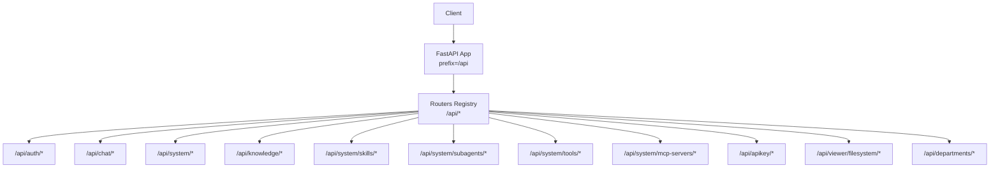
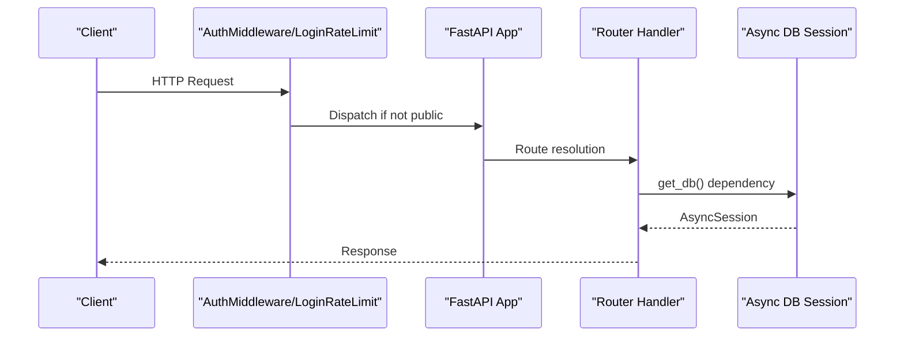
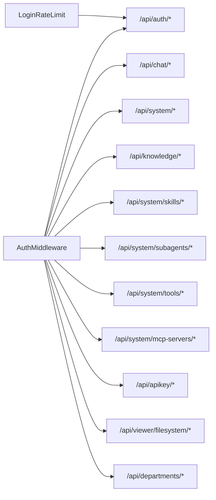

# API Reference

<cite>
**Referenced Files in This Document**
- [main.py](file://backend/server/main.py)
- [auth_middleware.py](file://backend/server/utils/auth_middleware.py)
- [routers/__init__.py](file://backend/server/routers/__init__.py)
- [auth_router.py](file://backend/server/routers/auth_router.py)
- [apikey_router.py](file://backend/server/routers/apikey_router.py)
- [chat_router.py](file://backend/server/routers/chat_router.py)
- [knowledge_router.py](file://backend/server/routers/knowledge_router.py)
- [skill_router.py](file://backend/server/routers/skill_router.py)
- [subagent_router.py](file://backend/server/routers/subagent_router.py)
- [system_router.py](file://backend/server/routers/system_router.py)
- [filesystem_router.py](file://backend/server/routers/filesystem_router.py)
- [department_router.py](file://backend/server/routers/department_router.py)
- [tool_router.py](file://backend/server/routers/tool_router.py)
- [mcp_router.py](file://backend/server/routers/mcp_router.py)
</cite>

## Table of Contents
1. [Introduction](#introduction)
2. [Project Structure](#project-structure)
3. [Core Components](#core-components)
4. [Architecture Overview](#architecture-overview)
5. [Detailed Component Analysis](#detailed-component-analysis)
6. [Dependency Analysis](#dependency-analysis)
7. [Performance Considerations](#performance-considerations)
8. [Troubleshooting Guide](#troubleshooting-guide)
9. [Conclusion](#conclusion)
10. [Appendices](#appendices)

## Introduction
This document provides a comprehensive API reference for the Yuxi platform REST endpoints. It covers authentication, chat and agent orchestration, knowledge base operations, skills and sub-agent management, system administration, and filesystem access. For each endpoint, you will find HTTP methods, URL patterns, request/response schemas, authentication requirements, and error handling behavior. Practical examples, common use cases, client implementation guidelines, rate limiting, security considerations, and API versioning strategies are also included.

## Project Structure
The backend exposes a single API prefix (/api) under which all routes are grouped by functional domain. Authentication and authorization are enforced via middleware and route-level dependencies. Public endpoints (e.g., health checks, initialization) are whitelisted.

**Diagram sources**
- [main.py:40-42](file://backend/server/main.py#L40-L42)
- [routers/__init__.py:20-49](file://backend/server/routers/__init__.py#L20-L49)

**Section sources**
- [main.py:40-42](file://backend/server/main.py#L40-L42)
- [routers/__init__.py:20-49](file://backend/server/routers/__init__.py#L20-L49)

## Core Components
- Authentication and Authorization
  - Supports JWT Bearer tokens and API Key authentication.
  - Public endpoints include health checks and initialization.
  - Rate limiting applied to login attempts.
- Routing and Prefixing
  - All routes mounted under /api with domain-specific subpaths.
- Middleware
  - CORS, access logging, authentication, and login rate limiting.

Security highlights:
- API keys are stored as SHA-256 hashes and returned only upon creation.
- Admin-only and superadmin-only endpoints enforce role-based access.
- Public paths are explicitly whitelisted.

**Section sources**
- [auth_middleware.py:15-26](file://backend/server/utils/auth_middleware.py#L15-L26)
- [auth_middleware.py:95-123](file://backend/server/utils/auth_middleware.py#L95-L123)
- [main.py:32-38](file://backend/server/main.py#L32-L38)
- [main.py:63-96](file://backend/server/main.py#L63-L96)

## Architecture Overview
The API follows a layered FastAPI architecture:
- Application entry initializes middleware and mounts routers.
- Routers define domain groups and route handlers.
- Route handlers depend on authentication and database sessions.
- Services encapsulate business logic; repositories handle persistence.

**Diagram sources**
- [main.py:99-137](file://backend/server/main.py#L99-L137)
- [auth_middleware.py:74-123](file://backend/server/utils/auth_middleware.py#L74-L123)

## Detailed Component Analysis

### Authentication API
- Purpose: User login, profile management, admin user management, and avatar upload.
- Authentication: JWT Bearer or API Key (Authorization header).
- Public endpoints: health check, first-run check, initialization.

Endpoints
- POST /api/auth/token
  - Description: Obtain access token using OAuth2 password flow.
  - Auth: None (public).
  - Request body: OAuth2PasswordRequestForm (username, password).
  - Response: Token model with user info.
  - Errors: 401 Unauthorized, 423 Locked (login lock), 403 Forbidden (deleted account).
  - Security: Login rate limiting enforced; lockout after repeated failures.
- GET /api/auth/check-first-run
  - Description: Check if system requires initial admin setup.
  - Auth: None.
  - Response: Boolean flag.
- POST /api/auth/initialize
  - Description: Initialize system with superadmin and default department.
  - Auth: None.
  - Request: InitializeAdmin (user_id, password, optional phone).
  - Response: Token model.
  - Errors: 403 if not first run.
- GET /api/auth/me
  - Description: Get current user profile.
  - Auth: Bearer or API Key.
  - Response: UserResponse.
- PUT /api/auth/profile
  - Description: Update personal profile (username, phone).
  - Auth: Bearer or API Key.
  - Request: UserProfileUpdate.
  - Response: UserResponse.
- POST /api/auth/users
  - Description: Create a new user (admin only).
  - Auth: Admin or Superadmin.
  - Request: UserCreate.
  - Response: UserResponse.
- GET /api/auth/users
  - Description: List users with pagination (admin only).
  - Auth: Admin or Superadmin.
  - Query: skip, limit.
  - Response: Array of UserResponse.
- GET /api/auth/users/{user_id}
  - Description: Get specific user (admin only).
  - Auth: Admin or Superadmin.
  - Response: UserResponse.
- PUT /api/auth/users/{user_id}
  - Description: Update user (admin only).
  - Auth: Admin or Superadmin.
  - Request: UserUpdate.
  - Response: UserResponse.
- DELETE /api/auth/users/{user_id}
  - Description: Delete user (soft delete) (admin only).
  - Auth: Admin or Superadmin.
  - Response: Success object.
- POST /api/auth/validate-username
  - Description: Validate username and generate user_id (admin only).
  - Auth: Admin or Superadmin.
  - Request: UsernameValidation.
  - Response: UserIdGeneration.
- GET /api/auth/check-user-id/{user_id}
  - Description: Check availability of user_id (admin only).
  - Auth: Admin or Superadmin.
  - Response: Object with availability.
- POST /api/auth/upload-avatar
  - Description: Upload avatar image (<= 5MB, image/*).
  - Auth: Bearer or API Key.
  - Request: multipart/form-data (file).
  - Response: Success with avatar URL.
- POST /api/auth/impersonate/{user_id}
  - Description: Superadmin simulates another user (returns token).
  - Auth: Superadmin.
  - Response: Token model.

Common use cases
- Initial admin setup during first run.
- Login with username or phone number; receive JWT token.
- Admin bulk user management and soft deletion.

Client implementation guidelines
- Use Authorization: Bearer <token> for JWT.
- Use Authorization: Bearer yxkey_* for API Key.
- Respect rate limiting and lockout headers.

**Section sources**
- [auth_router.py:115-207](file://backend/server/routers/auth_router.py#L115-L207)
- [auth_router.py:211-290](file://backend/server/routers/auth_router.py#L211-L290)
- [auth_router.py:299-370](file://backend/server/routers/auth_router.py#L299-L370)
- [auth_router.py:379-496](file://backend/server/routers/auth_router.py#L379-L496)
- [auth_router.py:500-690](file://backend/server/routers/auth_router.py#L500-L690)
- [auth_router.py:694-734](file://backend/server/routers/auth_router.py#L694-L734)
- [auth_router.py:738-773](file://backend/server/routers/auth_router.py#L738-L773)
- [auth_router.py:777-800](file://backend/server/routers/auth_router.py#L777-L800)
- [main.py:32-38](file://backend/server/main.py#L32-L38)
- [main.py:63-96](file://backend/server/main.py#L63-L96)

### API Key Management API
- Purpose: Manage API keys per user or department.
- Authentication: Bearer or API Key (requires current user).

Endpoints
- GET /api/apikey/
  - Description: List API keys with pagination (superadmin sees all).
  - Auth: Required.
  - Query: skip, limit.
  - Response: Object with array and total count.
- POST /api/apikey/
  - Description: Create API key; secret returned once.
  - Auth: Required.
  - Request: APIKeyCreate (name, optional user_id, department_id, expires_at).
  - Response: APIKeyCreateResponse (api_key, secret).
- GET /api/apikey/{api_key_id}
  - Description: Get single API key (owner or superadmin).
  - Auth: Required.
  - Response: Object with api_key.
- PUT /api/apikey/{api_key_id}
  - Description: Update API key (name, expires_at, is_enabled).
  - Auth: Required.
  - Response: Object with api_key.
- DELETE /api/apikey/{api_key_id}
  - Description: Delete API key.
  - Auth: Required.
  - Response: Success object.
- POST /api/apikey/{api_key_id}/regenerate
  - Description: Regenerate API key; new secret returned once.
  - Auth: Required.
  - Response: APIKeyCreateResponse.

Security considerations
- Secret is only returned at creation/regeneration.
- Keys are stored as SHA-256 hashes.
- Expiration and enablement flags supported.

**Section sources**
- [apikey_router.py:65-97](file://backend/server/routers/apikey_router.py#L65-L97)
- [apikey_router.py:100-149](file://backend/server/routers/apikey_router.py#L100-L149)
- [apikey_router.py:152-169](file://backend/server/routers/apikey_router.py#L152-L169)
- [apikey_router.py:172-203](file://backend/server/routers/apikey_router.py#L172-L203)
- [apikey_router.py:206-226](file://backend/server/routers/apikey_router.py#L206-L226)
- [apikey_router.py:229-258](file://backend/server/routers/apikey_router.py#L229-L258)

### Chat and Agent API
- Purpose: Agent orchestration, conversations, runs, streaming, and thread/file operations.
- Authentication: Bearer or API Key.

Endpoints
- GET /api/chat/default_agent
  - Description: Get default agent id (requires login).
  - Auth: Required.
  - Response: Object with default_agent_id.
- POST /api/chat/set_default_agent
  - Description: Set default agent (admin only).
  - Auth: Admin.
  - Request: Object with agent_id.
  - Response: Success object.
- POST /api/chat/call
  - Description: Simple model call (requires login).
  - Auth: Required.
  - Request: Body with query, optional meta.
  - Response: Response with content and request_id.
- GET /api/chat/agent
  - Description: List available agents (requires login).
  - Auth: Required.
  - Response: Agents array.
- GET /api/chat/agent/{agent_id}
  - Description: Get agent info (requires login).
  - Auth: Required.
  - Response: Agent info.
- GET /api/chat/agent/{agent_id}/configs
  - Description: List department-scoped agent configs (requires login).
  - Auth: Required.
  - Response: Configs array.
- GET /api/chat/agent/{agent_id}/configs/{config_id}
  - Description: Get specific agent config (requires login).
  - Auth: Required.
  - Response: Config object.
- POST /api/chat/agent/{agent_id}/configs
  - Description: Create agent config (admin only).
  - Auth: Admin.
  - Request: AgentConfigCreate.
  - Response: Config object.
- PUT /api/chat/agent/{agent_id}/configs/{config_id}
  - Description: Update agent config (admin only).
  - Auth: Admin.
  - Request: AgentConfigUpdate.
  - Response: Config object.
- POST /api/chat/agent/{agent_id}/configs/{config_id}/set_default
  - Description: Set default agent config (admin only).
  - Auth: Admin.
  - Response: Config object.
- DELETE /api/chat/agent/{agent_id}/configs/{config_id}
  - Description: Delete agent config (admin only).
  - Auth: Admin.
  - Response: Success object.
- POST /api/chat/agent
  - Description: Stream agent chat (requires login).
  - Auth: Required.
  - Request: AgentChatRequest (query, agent_config_id, optional thread_id, meta, optional image_content).
  - Response: Server-Sent Events (application/json).
- POST /api/chat/agent/sync
  - Description: Non-stream synchronous agent chat (requires login).
  - Auth: Required.
  - Request: AgentChatRequest.
  - Response: JSON object.
- POST /api/chat/runs
  - Description: Enqueue asynchronous run (requires login).
  - Auth: Required.
  - Request: AgentRunCreate.
  - Response: Run view.
- GET /api/chat/runs/{run_id}
  - Description: Get run status (requires login).
  - Auth: Required.
  - Response: Run view.
- POST /api/chat/runs/{run_id}/cancel
  - Description: Cancel run (requires login).
  - Auth: Required.
  - Response: Success object.
- GET /api/chat/runs/{run_id}/events
  - Description: SSE stream of run events (requires login).
  - Auth: Required.
  - Response: text/event-stream.
- GET /api/chat/models
  - Description: List models for a provider (admin only).
  - Auth: Admin.
  - Query: model_provider.
  - Response: Models array.
- POST /api/chat/models/update
  - Description: Update models list for provider (admin only).
  - Auth: Admin.
  - Request: Provider id and model names.
  - Response: Updated models.
- POST /api/chat/thread/{thread_id}/resume
  - Description: Resume interrupted conversation with human approval (requires login).
  - Auth: Required.
  - Request: approved boolean or answer object/dict.
  - Response: Server-Sent Events (application/json).
- GET /api/chat/thread/{thread_id}/active_run
  - Description: Get active run for thread (requires login).
  - Auth: Required.
  - Response: Active run.
- GET /api/chat/thread/{thread_id}/history
  - Description: Get thread history with feedback (requires login).
  - Auth: Required.
  - Response: History view.
- GET /api/chat/thread/{thread_id}/state
  - Description: Get agent state for thread (requires login).
  - Auth: Required.
  - Response: State view.
- POST /api/chat/thread
  - Description: Create thread (requires login).
  - Auth: Required.
  - Request: ThreadCreate.
  - Response: ThreadResponse.
- GET /api/chat/threads
  - Description: List threads (requires login).
  - Auth: Required.
  - Query: agent_id, limit, offset.
  - Response: Threads array.
- DELETE /api/chat/thread/{thread_id}
  - Description: Delete thread (requires login).
  - Auth: Required.
  - Response: Success object.
- PUT /api/chat/thread/{thread_id}
  - Description: Update thread (requires login).
  - Auth: Required.
  - Request: ThreadUpdate.
  - Response: ThreadResponse.
- POST /api/chat/thread/{thread_id}/attachments
  - Description: Upload attachment to thread (requires login).
  - Auth: Required.
  - Request: multipart/form-data (file).
  - Response: AttachmentResponse.
- GET /api/chat/thread/{thread_id}/attachments
  - Description: List thread attachments (requires login).
  - Auth: Required.
  - Response: AttachmentListResponse.

Streaming behavior
- Streaming endpoints return Server-Sent Events or JSON streams.
- Clients should handle partial messages and reconnect on network errors.

**Section sources**
- [chat_router.py:106-148](file://backend/server/routers/chat_router.py#L106-L148)
- [chat_router.py:151-169](file://backend/server/routers/chat_router.py#L151-L169)
- [chat_router.py:172-196](file://backend/server/routers/chat_router.py#L172-L196)
- [chat_router.py:199-248](file://backend/server/routers/chat_router.py#L199-L248)
- [chat_router.py:251-344](file://backend/server/routers/chat_router.py#L251-L344)
- [chat_router.py:347-396](file://backend/server/routers/chat_router.py#L347-L396)
- [chat_router.py:399-434](file://backend/server/routers/chat_router.py#L399-L434)
- [chat_router.py:437-456](file://backend/server/routers/chat_router.py#L437-L456)
- [chat_router.py:463-476](file://backend/server/routers/chat_router.py#L463-L476)
- [chat_router.py:479-576](file://backend/server/routers/chat_router.py#L479-L576)
- [chat_router.py:579-623](file://backend/server/routers/chat_router.py#L579-L623)
- [chat_router.py:629-764](file://backend/server/routers/chat_router.py#L629-L764)
- [chat_router.py:772-799](file://backend/server/routers/chat_router.py#L772-L799)

### Knowledge Base API
- Purpose: Knowledge database lifecycle, document ingestion, parsing, indexing, retrieval, and export.
- Authentication: Admin or Superadmin for most operations.

Endpoints
- GET /api/knowledge/databases
  - Description: List databases accessible to current user (admin).
  - Auth: Admin/Superadmin.
  - Response: Databases array.
- POST /api/knowledge/databases
  - Description: Create knowledge database (admin).
  - Auth: Admin/Superadmin.
  - Request: Database creation parameters (name, description, type, embeddings, LLM info, sharing config, additional params).
  - Response: Database info.
- GET /api/knowledge/databases/accessible
  - Description: List databases accessible to current user (for agent config).
  - Auth: Required.
  - Response: Accessible databases.
- GET /api/knowledge/databases/{db_id}
  - Description: Get database info (admin).
  - Auth: Admin/Superadmin.
  - Response: Database info.
- PUT /api/knowledge/databases/{db_id}
  - Description: Update database info (admin).
  - Auth: Admin/Superadmin.
  - Request: Update parameters.
  - Response: Success with updated database.
- DELETE /api/knowledge/databases/{db_id}
  - Description: Delete database (admin).
  - Auth: Admin/Superadmin.
  - Response: Success message.
- GET /api/knowledge/databases/{db_id}/export
  - Description: Export database data (admin).
  - Auth: Admin/Superadmin.
  - Query: format (csv|xlsx|md|txt), include_vectors.
  - Response: File download.
- POST /api/knowledge/databases/{db_id}/documents
  - Description: Ingest documents (upload -> parse -> optional index) (admin).
  - Auth: Admin/Superadmin.
  - Request: Items (URLs or file paths), params (auto_index, chunking).
  - Response: Task queue status.
- POST /api/knowledge/databases/{db_id}/documents/parse
  - Description: Manually trigger parse (admin).
  - Auth: Admin/Superadmin.
  - Request: File ids.
  - Response: Task queue status.
- POST /api/knowledge/databases/{db_id}/documents/index
  - Description: Manually trigger index (admin).
  - Auth: Admin/Superadmin.
  - Request: File ids, params.
  - Response: Task queue status.
- GET /api/knowledge/databases/{db_id}/documents/{doc_id}
  - Description: Get document info (admin).
  - Auth: Admin/Superadmin.
  - Response: Document info.
- GET /api/knowledge/databases/{db_id}/documents/{doc_id}/basic
  - Description: Get document basic info (admin).
  - Auth: Admin/Superadmin.
  - Response: Basic info.
- GET /api/knowledge/databases/{db_id}/documents/{doc_id}/content
  - Description: Get document content (chunks/lines) (admin).
  - Auth: Admin/Superadmin.
  - Response: Content info.
- DELETE /api/knowledge/databases/{db_id}/documents/batch
  - Description: Batch delete documents/folders (admin).
  - Auth: Admin/Superadmin.
  - Request: File ids.
  - Response: Deletion summary.
- DELETE /api/knowledge/databases/{db_id}/documents/{doc_id}
  - Description: Delete document or folder (admin).
  - Auth: Admin/Superadmin.
  - Response: Success message.
- GET /api/knowledge/databases/{db_id}/documents/{doc_id}/download
  - Description: Download original file (admin).
  - Auth: Admin/Superadmin.
  - Response: File download.

Common use cases
- Bulk ingestion with automatic parsing and indexing.
- Manual parse/index steps for fine-grained control.
- Export knowledge base for backup or analytics.

**Section sources**
- [knowledge_router.py:90-177](file://backend/server/routers/knowledge_router.py#L90-L177)
- [knowledge_router.py:180-198](file://backend/server/routers/knowledge_router.py#L180-L198)
- [knowledge_router.py:201-207](file://backend/server/routers/knowledge_router.py#L201-L207)
- [knowledge_router.py:210-250](file://backend/server/routers/knowledge_router.py#L210-L250)
- [knowledge_router.py:253-268](file://backend/server/routers/knowledge_router.py#L253-L268)
- [knowledge_router.py:271-294](file://backend/server/routers/knowledge_router.py#L271-L294)
- [knowledge_router.py:302-491](file://backend/server/routers/knowledge_router.py#L302-L491)
- [knowledge_router.py:494-540](file://backend/server/routers/knowledge_router.py#L494-L540)
- [knowledge_router.py:543-618](file://backend/server/routers/knowledge_router.py#L543-L618)
- [knowledge_router.py:621-660](file://backend/server/routers/knowledge_router.py#L621-L660)
- [knowledge_router.py:663-714](file://backend/server/routers/knowledge_router.py#L663-L714)
- [knowledge_router.py:717-749](file://backend/server/routers/knowledge_router.py#L717-L749)
- [knowledge_router.py:752-800](file://backend/server/routers/knowledge_router.py#L752-L800)

### Skills Management API
- Purpose: Manage built-in and custom skills, dependencies, and installation.
- Authentication: Admin or Superadmin.

Endpoints
- GET /api/system/skills
  - Description: List skills (admin).
  - Auth: Admin/Superadmin.
  - Response: Success + data array.
- GET /api/system/skills/dependency-options
  - Description: Get dependency options (superadmin).
  - Auth: Superadmin.
  - Response: Options.
- GET /api/system/skills/builtin
  - Description: List builtin skills with install status (superadmin).
  - Auth: Superadmin.
  - Response: Skills with status.
- POST /api/system/skills/builtin/{slug}/install
  - Description: Install builtin skill (superadmin).
  - Auth: Superadmin.
  - Response: Installed skill.
- POST /api/system/skills/builtin/{slug}/update
  - Description: Update builtin skill (superadmin).
  - Auth: Superadmin.
  - Request: Force flag.
  - Response: Updated skill.
- POST /api/system/skills/import
  - Description: Import skill package (ZIP or SKILL.md) (superadmin).
  - Auth: Superadmin.
  - Request: multipart/form-data (file).
  - Response: Imported skill.
- POST /api/system/skills/remote/list
  - Description: List remote skills (superadmin).
  - Auth: Superadmin.
  - Request: Source.
  - Response: Remote skills.
- POST /api/system/skills/remote/install
  - Description: Install remote skill (superadmin).
  - Auth: Superadmin.
  - Request: Source, skill name.
  - Response: Installed skill.
- GET /api/system/skills/{slug}/tree
  - Description: Get skill directory tree (superadmin).
  - Auth: Superadmin.
  - Response: Tree.
- GET /api/system/skills/{slug}/file
  - Description: Read skill file (superadmin).
  - Auth: Superadmin.
  - Query: Path.
  - Response: File content.
- POST /api/system/skills/{slug}/file
  - Description: Create skill file/dir (superadmin).
  - Auth: Superadmin.
  - Request: Node create payload.
  - Response: Success.
- PUT /api/system/skills/{slug}/file
  - Description: Update skill file (superadmin).
  - Auth: Superadmin.
  - Request: File update payload.
  - Response: Success.
- PUT /api/system/skills/{slug}/dependencies
  - Description: Update skill dependencies (superadmin).
  - Auth: Superadmin.
  - Request: Dependencies.
  - Response: Updated skill.
- DELETE /api/system/skills/{slug}/file
  - Description: Delete skill file/dir (superadmin).
  - Auth: Superadmin.
  - Query: Path.
  - Response: Success.
- GET /api/system/skills/{slug}/export
  - Description: Export skill as ZIP (superadmin).
  - Auth: Superadmin.
  - Response: File download.
- DELETE /api/system/skills/{slug}
  - Description: Delete skill (superadmin).
  - Auth: Superadmin.
  - Response: Success.

**Section sources**
- [skill_router.py:79-90](file://backend/server/routers/skill_router.py#L79-L90)
- [skill_router.py:93-103](file://backend/server/routers/skill_router.py#L93-L103)
- [skill_router.py:106-138](file://backend/server/routers/skill_router.py#L106-L138)
- [skill_router.py:141-156](file://backend/server/routers/skill_router.py#L141-L156)
- [skill_router.py:159-185](file://backend/server/routers/skill_router.py#L159-L185)
- [skill_router.py:188-210](file://backend/server/routers/skill_router.py#L188-L210)
- [skill_router.py:213-226](file://backend/server/routers/skill_router.py#L213-L226)
- [skill_router.py:229-251](file://backend/server/routers/skill_router.py#L229-L251)
- [skill_router.py:254-270](file://backend/server/routers/skill_router.py#L254-L270)
- [skill_router.py:273-290](file://backend/server/routers/skill_router.py#L273-L290)
- [skill_router.py:293-317](file://backend/server/routers/skill_router.py#L293-L317)
- [skill_router.py:320-343](file://backend/server/routers/skill_router.py#L320-L343)
- [skill_router.py:346-370](file://backend/server/routers/skill_router.py#L346-L370)
- [skill_router.py:373-390](file://backend/server/routers/skill_router.py#L373-L390)
- [skill_router.py:393-415](file://backend/server/routers/skill_router.py#L393-L415)
- [skill_router.py:418-434](file://backend/server/routers/skill_router.py#L418-L434)

### Sub-Agent Management API
- Purpose: Manage sub-agents (name, system prompt, tools, model override).
- Authentication: Admin or Superadmin.

Endpoints
- GET /api/system/subagents
  - Description: List subagents (admin).
  - Auth: Admin/Superadmin.
  - Response: Success + data.
- GET /api/system/subagents/{name}
  - Description: Get subagent (admin).
  - Auth: Admin/Superadmin.
  - Response: Success + data.
- POST /api/system/subagents
  - Description: Create subagent (admin).
  - Auth: Admin/Superadmin.
  - Request: Create payload.
  - Response: Success + data.
- PUT /api/system/subagents/{name}
  - Description: Update subagent (admin).
  - Auth: Admin/Superadmin.
  - Request: Update payload.
  - Response: Success + data.
- DELETE /api/system/subagents/{name}
  - Description: Delete subagent (admin).
  - Auth: Admin/Superadmin.
  - Response: Success.
- PUT /api/system/subagents/{name}/status
  - Description: Toggle enabled status (admin).
  - Auth: Admin/Superadmin.
  - Request: Status payload.
  - Response: Success + message.

**Section sources**
- [subagent_router.py:58-68](file://backend/server/routers/subagent_router.py#L58-L68)
- [subagent_router.py:71-86](file://backend/server/routers/subagent_router.py#L71-L86)
- [subagent_router.py:89-110](file://backend/server/routers/subagent_router.py#L89-L110)
- [subagent_router.py:112-131](file://backend/server/routers/subagent_router.py#L112-L131)
- [subagent_router.py:134-149](file://backend/server/routers/subagent_router.py#L134-L149)
- [subagent_router.py:154-170](file://backend/server/routers/subagent_router.py#L154-L170)

### System Management API
- Purpose: Health checks, configuration, logs, OCR status, model status, custom providers.
- Authentication: Admin or Superadmin for most endpoints.

Endpoints
- GET /api/system/health
  - Description: Health check (public).
  - Auth: None.
  - Response: Status + version.
- GET /api/system/config
  - Description: Get system config (admin).
  - Auth: Admin/Superadmin.
  - Response: Config dump.
- POST /api/system/config
  - Description: Update single config (admin).
  - Auth: Admin/Superadmin.
  - Request: Key-value pair.
  - Response: Updated config.
- POST /api/system/config/update
  - Description: Batch update config (admin).
  - Auth: Admin/Superadmin.
  - Request: Object of items.
  - Response: Updated config.
- GET /api/system/logs
  - Description: Get system logs (admin).
  - Auth: Admin/Superadmin.
  - Query: levels filter.
  - Response: Log content + file path.
- GET /api/system/info
  - Description: Get info config (public).
  - Auth: None.
  - Response: Info data.
- POST /api/system/info/reload
  - Description: Reload info config (admin).
  - Auth: Admin/Superadmin.
  - Response: Success + data.
- GET /api/system/ocr/health
  - Description: Check OCR services health (admin).
  - Auth: Admin/Superadmin.
  - Response: Overall + service statuses.
- GET /api/system/chat-models/status
  - Description: Check single chat model status (admin).
  - Auth: Admin/Superadmin.
  - Query: provider, model_name.
  - Response: Status.
- GET /api/system/chat-models/all/status
  - Description: Check all chat model statuses (admin).
  - Auth: Admin/Superadmin.
  - Response: Status.
- GET /api/system/custom-providers
  - Description: List custom providers (admin).
  - Auth: Admin/Superadmin.
  - Response: Providers.
- POST /api/system/custom-providers
  - Description: Add custom provider (admin).
  - Auth: Admin/Superadmin.
  - Request: Provider id + data.
  - Response: Success.
- PUT /api/system/custom-providers/{provider_id}
  - Description: Update custom provider (admin).
  - Auth: Admin/Superadmin.
  - Request: Provider data.
  - Response: Success.
- DELETE /api/system/custom-providers/{provider_id}
  - Description: Delete custom provider (admin).
  - Auth: Admin/Superadmin.
  - Response: Success.
- POST /api/system/custom-providers/{provider_id}/test
  - Description: Test custom provider (admin).
  - Auth: Admin/Superadmin.
  - Request: Test request with model_name.
  - Response: Status.

**Section sources**
- [system_router.py:21-24](file://backend/server/routers/system_router.py#L21-L24)
- [system_router.py:32-51](file://backend/server/routers/system_router.py#L32-L51)
- [system_router.py:54-93](file://backend/server/routers/system_router.py#L54-L93)
- [system_router.py:125-144](file://backend/server/routers/system_router.py#L125-L144)
- [system_router.py:152-190](file://backend/server/routers/system_router.py#L152-L190)
- [system_router.py:198-222](file://backend/server/routers/system_router.py#L198-L222)
- [system_router.py:230-291](file://backend/server/routers/system_router.py#L230-L291)
- [system_router.py:294-319](file://backend/server/routers/system_router.py#L294-L319)

### Filesystem API (Viewer)
- Purpose: Read-only filesystem access for the Viewer UI within a thread context.
- Authentication: Required.

Endpoints
- GET /api/viewer/filesystem/tree
  - Description: List filesystem tree for a thread.
  - Auth: Required.
  - Query: thread_id, path, optional agent_id, agent_config_id.
  - Response: Tree structure.
- GET /api/viewer/filesystem/file
  - Description: Read file content.
  - Auth: Required.
  - Query: thread_id, path, optional agent_id, agent_config_id.
  - Response: File content.
- DELETE /api/viewer/filesystem/file
  - Description: Delete file.
  - Auth: Required.
  - Query: thread_id, path, optional agent_id, agent_config_id.
  - Response: Success.
- GET /api/viewer/filesystem/download
  - Description: Download file.
  - Auth: Required.
  - Query: thread_id, path, optional agent_id, agent_config_id.
  - Response: File download.

**Section sources**
- [filesystem_router.py:24-40](file://backend/server/routers/filesystem_router.py#L24-L40)
- [filesystem_router.py:43-59](file://backend/server/routers/filesystem_router.py#L43-L59)
- [filesystem_router.py:62-78](file://backend/server/routers/filesystem_router.py#L62-L78)
- [filesystem_router.py:81-97](file://backend/server/routers/filesystem_router.py#L81-L97)

### Department Management API
- Purpose: Manage departments and associated admin users.
- Authentication: Superadmin only.

Endpoints
- GET /api/departments
  - Description: List departments with user counts (admin).
  - Auth: Admin/Superadmin.
  - Response: Departments array.
- GET /api/departments/{department_id}
  - Description: Get department details (superadmin).
  - Auth: Superadmin.
  - Response: Department with user_count.
- POST /api/departments
  - Description: Create department and admin (superadmin).
  - Auth: Superadmin.
  - Request: DepartmentCreate (name, description, admin_user_id, admin_password, optional admin_phone).
  - Response: New department with user_count.
- PUT /api/departments/{department_id}
  - Description: Update department (superadmin).
  - Auth: Superadmin.
  - Request: DepartmentUpdate.
  - Response: Updated department with user_count.
- DELETE /api/departments/{department_id}
  - Description: Delete department (superadmin).
  - Auth: Superadmin.
  - Response: Success.

**Section sources**
- [department_router.py:70-74](file://backend/server/routers/department_router.py#L70-L74)
- [department_router.py:77-94](file://backend/server/routers/department_router.py#L77-L94)
- [department_router.py:97-170](file://backend/server/routers/department_router.py#L97-L170)
- [department_router.py:173-211](file://backend/server/routers/department_router.py#L173-L211)
- [department_router.py:214-247](file://backend/server/routers/department_router.py#L214-L247)

### Tools API
- Purpose: List tools and tool options.
- Authentication: Admin or Superadmin.

Endpoints
- GET /api/system/tools
  - Description: List tools (admin).
  - Auth: Admin/Superadmin.
  - Query: category.
  - Response: Success + data.
- GET /api/system/tools/options
  - Description: Get tool options for dropdowns (admin).
  - Auth: Admin/Superadmin.
  - Response: Success + options.

**Section sources**
- [tool_router.py:10-25](file://backend/server/routers/tool_router.py#L10-L25)

### MCP Servers API
- Purpose: Manage MCP servers and tools.
- Authentication: Admin or Superadmin.

Endpoints
- GET /api/system/mcp-servers
  - Description: List MCP servers (admin).
  - Auth: Admin/Superadmin.
  - Response: Success + data.
- POST /api/system/mcp-servers
  - Description: Create MCP server (admin).
  - Auth: Admin/Superadmin.
  - Request: CreateMcpServerRequest (transport, url/command/args/env, headers, timeout, tags, icon).
  - Response: Success + data.
- GET /api/system/mcp-servers/{name}
  - Description: Get MCP server (admin).
  - Auth: Admin/Superadmin.
  - Response: Success + data.
- PUT /api/system/mcp-servers/{name}
  - Description: Update MCP server (admin).
  - Auth: Admin/Superadmin.
  - Request: UpdateMcpServerRequest.
  - Response: Success + data.
- DELETE /api/system/mcp-servers/{name}
  - Description: Delete MCP server (admin).
  - Auth: Admin/Superadmin.
  - Response: Success.
- POST /api/system/mcp-servers/{name}/test
  - Description: Test MCP server connection (admin).
  - Auth: Admin/Superadmin.
  - Response: Success + tool count.
- PUT /api/system/mcp-servers/{name}/status
  - Description: Toggle server enabled status (admin).
  - Auth: Admin/Superadmin.
  - Request: UpdateMcpServerStatusRequest.
  - Response: Success + enabled flag.
- GET /api/system/mcp-servers/{name}/tools
  - Description: List MCP tools (admin).
  - Auth: Admin/Superadmin.
  - Response: Success + data + totals.
- POST /api/system/mcp-servers/{name}/tools/refresh
  - Description: Refresh MCP tools (admin).
  - Auth: Admin/Superadmin.
  - Response: Success + counts.
- PUT /api/system/mcp-servers/{name}/tools/{tool_name}/toggle
  - Description: Toggle tool enabled status (admin).
  - Auth: Admin/Superadmin.
  - Response: Success + enabled flag.

**Section sources**
- [mcp_router.py:81-92](file://backend/server/routers/mcp_router.py#L81-L92)
- [mcp_router.py:95-135](file://backend/server/routers/mcp_router.py#L95-L135)
- [mcp_router.py:138-152](file://backend/server/routers/mcp_router.py#L138-L152)
- [mcp_router.py:155-195](file://backend/server/routers/mcp_router.py#L155-L195)
- [mcp_router.py:198-219](file://backend/server/routers/mcp_router.py#L198-L219)
- [mcp_router.py:227-250](file://backend/server/routers/mcp_router.py#L227-L250)
- [mcp_router.py:253-273](file://backend/server/routers/mcp_router.py#L253-L273)
- [mcp_router.py:281-329](file://backend/server/routers/mcp_router.py#L281-L329)
- [mcp_router.py:332-370](file://backend/server/routers/mcp_router.py#L332-L370)
- [mcp_router.py:373-393](file://backend/server/routers/mcp_router.py#L373-L393)

## Dependency Analysis
- Authentication and Authorization
  - Auth middleware supports both JWT and API Key; public paths excluded from auth.
  - Rate limiting middleware guards login endpoint.
- Routing
  - Central router aggregates domain routers; LITE mode toggles knowledge-related endpoints.
- Services and Repositories
  - Route handlers depend on services and repositories for business logic and persistence.

**Diagram sources**
- [auth_middleware.py:15-26](file://backend/server/utils/auth_middleware.py#L15-L26)
- [main.py:63-96](file://backend/server/main.py#L63-L96)
- [routers/__init__.py:20-49](file://backend/server/routers/__init__.py#L20-L49)

**Section sources**
- [auth_middleware.py:15-26](file://backend/server/utils/auth_middleware.py#L15-L26)
- [main.py:63-96](file://backend/server/main.py#L63-L96)
- [routers/__init__.py:20-49](file://backend/server/routers/__init__.py#L20-L49)

## Performance Considerations
- Streaming endpoints use Server-Sent Events or JSON streaming; clients should buffer and render incrementally.
- Knowledge ingestion is asynchronous; use task IDs to poll progress.
- Large file uploads (avatars, attachments) are supported; consider chunked uploads for very large content.
- Pagination is enforced for listings (e.g., API keys, users, threads) to avoid heavy payloads.

## Troubleshooting Guide
Common errors and resolutions
- 401 Unauthorized
  - Cause: Missing or invalid Authorization header; expired or revoked token/API key.
  - Resolution: Re-authenticate or regenerate API key.
- 403 Forbidden
  - Cause: Insufficient permissions (non-admin accessing admin-only endpoints).
  - Resolution: Use appropriate credentials or contact a superadmin.
- 404 Not Found
  - Cause: Resource does not exist (user, thread, document, skill).
  - Resolution: Verify identifiers and existence.
- 423 Locked
  - Cause: Account locked due to repeated failed logins.
  - Resolution: Wait for lockout period or reset via admin tools.
- 429 Too Many Requests
  - Cause: Login attempts exceed rate limit.
  - Resolution: Retry after the indicated interval.
- 5xx Internal Server Error
  - Cause: Unexpected server-side failure.
  - Resolution: Check system logs and retry.

Operational tips
- Use /api/system/logs to inspect recent entries.
- For knowledge operations, monitor task queues and progress.
- Validate model and provider configurations via system endpoints.

**Section sources**
- [auth_router.py:130-176](file://backend/server/routers/auth_router.py#L130-L176)
- [auth_router.py:146-152](file://backend/server/routers/auth_router.py#L146-L152)
- [main.py:80-84](file://backend/server/main.py#L80-L84)
- [system_router.py:54-93](file://backend/server/routers/system_router.py#L54-L93)

## Conclusion
The Yuxi platform provides a comprehensive REST API covering authentication, agent orchestration, knowledge base operations, skills and sub-agent management, system administration, and filesystem access. Authentication supports both JWT and API Key mechanisms, with robust role-based access control and rate limiting. Streaming endpoints enable real-time interactions, while asynchronous tasks support long-running operations like knowledge ingestion. Adhering to the documented schemas, authentication requirements, and operational guidelines ensures reliable integration.

## Appendices

### Authentication and Authorization
- Supported schemes
  - Bearer JWT: Authorization: Bearer <jwt-token>.
  - API Key: Authorization: Bearer yxkey_*.
- Public endpoints
  - /api/system/health, /api/auth/token, /api/auth/check-first-run, /api/auth/initialize, /api/system/info.
- Role hierarchy
  - User: Basic access.
  - Admin: Administrative capabilities within department scope.
  - Superadmin: Full system control.

**Section sources**
- [auth_middleware.py:15-26](file://backend/server/utils/auth_middleware.py#L15-L26)
- [auth_middleware.py:142-159](file://backend/server/utils/auth_middleware.py#L142-L159)
- [main.py:32-38](file://backend/server/main.py#L32-L38)

### Rate Limiting
- Applied to POST /api/auth/token.
- Tracks per-IP login attempts within a sliding window.
- Returns 429 with Retry-After header when exceeded.

**Section sources**
- [main.py:32-38](file://backend/server/main.py#L32-L38)
- [main.py:63-96](file://backend/server/main.py#L63-L96)

### API Versioning Strategy
- No explicit versioned URL segments observed.
- Backward compatibility maintained via additive changes and deprecation notices in documentation and code comments.

**Section sources**
- [routers/__init__.py:20-49](file://backend/server/routers/__init__.py#L20-L49)

### Client Implementation Guidelines
- Use Authorization headers consistently.
- For streaming endpoints, handle incremental messages and reconnection.
- For knowledge ingestion, poll task IDs until completion.
- Validate inputs against documented schemas and constraints.