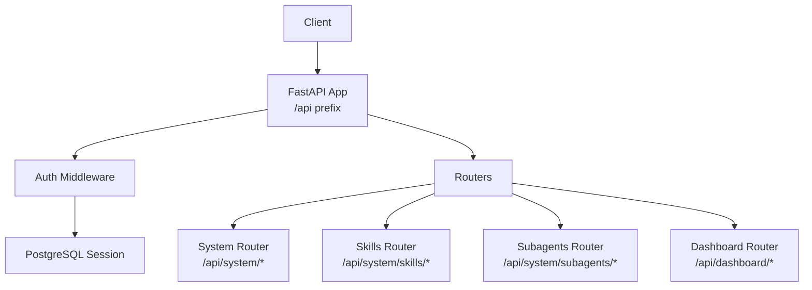
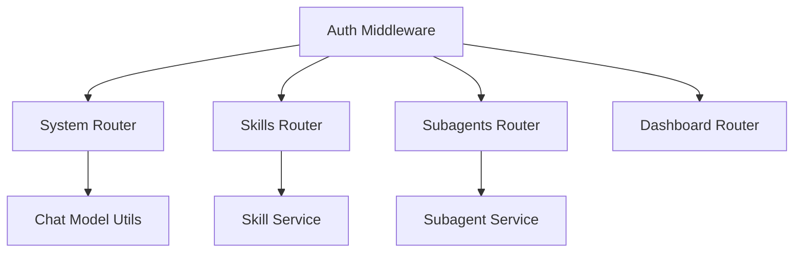

# Agent Configuration API

<cite>
**Referenced Files in This Document**
- [main.py](file://backend/server/main.py)
- [auth_middleware.py](file://backend/server/utils/auth_middleware.py)
- [skill_router.py](file://backend/server/routers/skill_router.py)
- [subagent_router.py](file://backend/server/routers/subagent_router.py)
- [dashboard_router.py](file://backend/server/routers/dashboard_router.py)
- [system_router.py](file://backend/server/routers/system_router.py)
- [skill_service.py](file://backend/package/yuxi/services/skill_service.py)
- [subagent_service.py](file://backend/package/yuxi/services/subagent_service.py)
- [chat.py](file://backend/package/yuxi/models/chat.py)
</cite>

## Table of Contents
1. [Introduction](#introduction)
2. [Project Structure](#project-structure)
3. [Core Components](#core-components)
4. [Architecture Overview](#architecture-overview)
5. [Detailed Component Analysis](#detailed-component-analysis)
6. [Dependency Analysis](#dependency-analysis)
7. [Performance Considerations](#performance-considerations)
8. [Troubleshooting Guide](#troubleshooting-guide)
9. [Conclusion](#conclusion)
10. [Appendices](#appendices)

## Introduction
This document provides comprehensive API documentation for agent configuration and management endpoints. It covers:
- Skill management: creation, deployment, configuration, dependency resolution, and distribution via import/export and remote installation.
- Sub-agent lifecycle: creation, updates, enabling/disabling, and parameter configuration.
- Agent template management: skill visibility scoping per-thread and synchronization.
- Sandbox configuration: managed via system configuration endpoints.
- Deployment, scaling, and monitoring: system health, configuration, logs, OCR health, model status checks, and dashboard analytics.

Authentication and authorization are enforced centrally, with endpoints categorized by privilege levels (public, admin, superadmin). Error handling follows consistent patterns with structured responses and appropriate HTTP status codes.

## Project Structure
The API surface is organized under a single FastAPI application with routes grouped by functional domains:
- System: health, configuration, logs, info, OCR health, model status, custom providers.
- Skills: CRUD, dependency management, import/export, and remote installation.
- Sub-agents: lifecycle management and status toggling.
- Dashboard: monitoring, analytics, and statistics.



**Diagram sources**
- [main.py:40-42](file://backend/server/main.py#L40-L42)
- [auth_middleware.py:16](file://backend/server/utils/auth_middleware.py#L16)

**Section sources**
- [main.py:40-42](file://backend/server/main.py#L40-L42)
- [auth_middleware.py:16](file://backend/server/utils/auth_middleware.py#L16)

## Core Components
- Authentication and Authorization:
  - Public paths bypass authentication; others require a valid bearer token or API key.
  - Roles: admin and superadmin gatekeeper endpoints.
- System Router:
  - Health checks, configuration retrieval and updates, logs, info, OCR health, model status, and custom provider management.
- Skills Router:
  - Lists, creates, updates, deletes, and exports skills; manages dependencies and remote installations.
- Subagents Router:
  - Lists, retrieves, creates, updates, deletes, and toggles subagent status.
- Dashboard Router:
  - Conversations, feedback, analytics, and time-series call statistics.

**Section sources**
- [auth_middleware.py:16](file://backend/server/utils/auth_middleware.py#L16)
- [auth_middleware.py:142-159](file://backend/server/utils/auth_middleware.py#L142-L159)
- [system_router.py:21-51](file://backend/server/routers/system_router.py#L21-L51)
- [skill_router.py:79-435](file://backend/server/routers/skill_router.py#L79-L435)
- [subagent_router.py:58-175](file://backend/server/routers/subagent_router.py#L58-L175)
- [dashboard_router.py:128-177](file://backend/server/routers/dashboard_router.py#L128-L177)

## Architecture Overview
The API enforces authentication centrally and delegates to domain-specific routers. Services encapsulate business logic and interact with repositories and external systems.

```mermaid
sequenceDiagram
participant C as "Client"
participant A as "Auth Middleware"
participant S as "System Router"
participant SK as "Skills Router"
participant SA as "Subagents Router"
participant D as "Dashboard Router"
C->>A : HTTP Request
A-->>C : 401/403 if unauthenticated/unauthorized
A->>S : Route to System endpoints
A->>SK : Route to Skills endpoints
A->>SA : Route to Subagents endpoints
A->>D : Route to Dashboard endpoints
Note over S,SK,SA,D : Endpoints return structured JSON with success/data/error
```

**Diagram sources**
- [main.py:100-137](file://backend/server/main.py#L100-L137)
- [auth_middleware.py:16](file://backend/server/utils/auth_middleware.py#L16)

## Detailed Component Analysis

### System Endpoints
- Health Check
  - Method: GET
  - URL: /api/system/health
  - Auth: Public
  - Response: Status object with service health and version
- Configuration
  - GET /api/system/config
    - Auth: Admin
    - Response: Current system configuration snapshot
  - POST /api/system/config
    - Auth: Admin
    - Body: Single key/value pair
    - Response: Updated configuration
  - POST /api/system/config/update
    - Auth: Admin
    - Body: Batch key/value pairs
    - Response: Updated configuration
- Logs
  - GET /api/system/logs
    - Auth: Admin
    - Query: levels (optional, comma-separated)
    - Response: Log content and file path
- Info
  - GET /api/system/info
    - Auth: Public
    - Response: Branding/information configuration
  - POST /api/system/info/reload
    - Auth: Admin
    - Response: Reloaded configuration
- OCR Health
  - GET /api/system/ocr/health
    - Auth: Admin
    - Response: Overall and per-service health status
- Chat Model Status
  - GET /api/system/chat-models/status
    - Auth: Admin
    - Query: provider, model_name
    - Response: Status of a specific model
  - GET /api/system/chat-models/all/status
    - Auth: Admin
    - Response: Status of all configured models
- Custom Providers
  - GET /api/system/custom-providers
    - Auth: Admin
    - Response: All custom providers
  - POST /api/system/custom-providers
    - Auth: Admin
    - Body: provider_id, provider_data
    - Response: Success message
  - PUT /api/system/custom-providers/{provider_id}
    - Auth: Admin
    - Body: provider_data
    - Response: Success message
  - DELETE /api/system/custom-providers/{provider_id}
    - Auth: Admin
    - Response: Success message
  - POST /api/system/custom-providers/{provider_id}/test
    - Auth: Admin
    - Body: model_name
    - Response: Test result

Authentication and Authorization
- Public paths include health, info, and initialization endpoints.
- Admin endpoints require admin or superadmin roles.
- Superadmin endpoints require superadmin role.

Error Handling
- Standardized error responses with HTTP status codes:
  - 400 Bad Request for invalid inputs
  - 401 Unauthorized for missing/invalid credentials
  - 403 Forbidden for insufficient privileges
  - 404 Not Found for missing resources
  - 409 Conflict for conflicts (e.g., builtin skill update)
  - 429 Too Many Requests for rate-limited login attempts
  - 500 Internal Server Error for unexpected failures

**Section sources**
- [system_router.py:21-51](file://backend/server/routers/system_router.py#L21-L51)
- [system_router.py:54-94](file://backend/server/routers/system_router.py#L54-L94)
- [system_router.py:125-145](file://backend/server/routers/system_router.py#L125-L145)
- [system_router.py:152-191](file://backend/server/routers/system_router.py#L152-L191)
- [system_router.py:198-223](file://backend/server/routers/system_router.py#L198-L223)
- [system_router.py:230-292](file://backend/server/routers/system_router.py#L230-L292)
- [system_router.py:294-320](file://backend/server/routers/system_router.py#L294-L320)
- [auth_middleware.py:16](file://backend/server/utils/auth_middleware.py#L16)
- [auth_middleware.py:142-159](file://backend/server/utils/auth_middleware.py#L142-L159)
- [main.py:63-97](file://backend/server/main.py#L63-L97)

### Skills Management Endpoints
Endpoints for managing skills, including built-in, imported, and remote variants.

- List Skills
  - Method: GET
  - URL: /api/system/skills
  - Auth: Admin
  - Response: Array of skills with metadata
- Dependency Options
  - Method: GET
  - URL: /api/system/skills/dependency-options
  - Auth: Superadmin
  - Response: Available tool/mcp/skill dependency options
- List Built-in Skills
  - Method: GET
  - URL: /api/system/skills/builtin
  - Auth: Superadmin
  - Response: Array of builtin specs with installation status
- Install Built-in Skill
  - Method: POST
  - URL: /api/system/skills/builtin/{slug}/install
  - Auth: Superadmin
  - Path: slug
  - Response: Installed skill record
- Update Built-in Skill
  - Method: POST
  - URL: /api/system/skills/builtin/{slug}/update
  - Auth: Superadmin
  - Path: slug
  - Body: force (boolean)
  - Response: Updated skill record or conflict detail
- Import Skill Package
  - Method: POST
  - URL: /api/system/skills/import
  - Auth: Superadmin
  - Form-Data: file (ZIP or SKILL.md)
  - Response: Imported skill record
- List Remote Skills
  - Method: POST
  - URL: /api/system/skills/remote/list
  - Auth: Superadmin
  - Body: source (owner/repo or GitHub URL)
  - Response: Remote skill list
- Install Remote Skill
  - Method: POST
  - URL: /api/system/skills/remote/install
  - Auth: Superadmin
  - Body: source, skill
  - Response: Installed skill record
- Get Skill Tree
  - Method: GET
  - URL: /api/system/skills/{slug}/tree
  - Auth: Superadmin
  - Path: slug
  - Response: Directory tree structure
- Read Skill File
  - Method: GET
  - URL: /api/system/skills/{slug}/file
  - Auth: Superadmin
  - Path: slug
  - Query: path (relative file path)
  - Response: File content
- Create Skill Node
  - Method: POST
  - URL: /api/system/skills/{slug}/file
  - Auth: Superadmin
  - Path: slug
  - Body: path, is_dir, content
  - Response: Success
- Update Skill File
  - Method: PUT
  - URL: /api/system/skills/{slug}/file
  - Auth: Superadmin
  - Path: slug
  - Body: path, content
  - Response: Success
- Update Dependencies
  - Method: PUT
  - URL: /api/system/skills/{slug}/dependencies
  - Auth: Superadmin
  - Path: slug
  - Body: tool_dependencies, mcp_dependencies, skill_dependencies
  - Response: Updated skill record
- Delete Skill Node
  - Method: DELETE
  - URL: /api/system/skills/{slug}/file
  - Auth: Superadmin
  - Path: slug
  - Query: path
  - Response: Success
- Export Skill Package
  - Method: GET
  - URL: /api/system/skills/{slug}/export
  - Auth: Superadmin
  - Path: slug
  - Response: ZIP file download
- Delete Skill
  - Method: DELETE
  - URL: /api/system/skills/{slug}
  - Auth: Superadmin
  - Path: slug
  - Response: Success

Skill Dependency Resolution
- Skills declare dependencies on tools, MCP servers, and other skills.
- Dependency options are enumerated for administrators.
- Updates propagate to the skill’s metadata and persisted records.

Skill Template Management
- Thread-scoped visibility of skills is synchronized per-thread.
- Visible skills are materialized under a thread-specific directory.

Sandbox Configuration
- System configuration endpoints enable operators to manage runtime settings affecting sandbox behavior.

Error Handling
- ValueErrors mapped to 404/400; generic exceptions to 500.
- Background tasks clean up temporary export artifacts.

**Section sources**
- [skill_router.py:79-435](file://backend/server/routers/skill_router.py#L79-L435)
- [skill_service.py:97-164](file://backend/package/yuxi/services/skill_service.py#L97-L164)

### Sub-Agent Operations
Endpoints for managing sub-agents used by agents.

- List Sub-Agents
  - Method: GET
  - URL: /api/system/subagents
  - Auth: Admin
  - Response: Array of subagent specs
- Get Sub-Agent
  - Method: GET
  - URL: /api/system/subagents/{name}
  - Auth: Admin
  - Path: name
  - Response: Sub-agent spec
- Create Sub-Agent
  - Method: POST
  - URL: /api/system/subagents
  - Auth: Admin
  - Body: name, description, system_prompt, tools, model
  - Response: Created sub-agent
- Update Sub-Agent
  - Method: PUT
  - URL: /api/system/subagents/{name}
  - Auth: Admin
  - Path: name
  - Body: Partial fields (description, system_prompt, tools, model)
  - Response: Updated sub-agent
- Delete Sub-Agent
  - Method: DELETE
  - URL: /api/system/subagents/{name}
  - Auth: Admin
  - Path: name
  - Response: Success
- Update Sub-Agent Status
  - Method: PUT
  - URL: /api/system/subagents/{name}/status
  - Auth: Admin
  - Path: name
  - Body: enabled (boolean)
  - Response: Updated sub-agent and message

Execution Controls
- Sub-agents are resolved into tool instances at runtime.
- Tools are validated against available toolkits; missing tools are skipped with warnings.

Lifecycle Management
- Initialization ensures builtin subagents exist and are kept in sync.
- Cache of subagent specs is cleared after mutations to ensure fresh reads.

**Section sources**
- [subagent_router.py:58-175](file://backend/server/routers/subagent_router.py#L58-L175)
- [subagent_service.py:70-99](file://backend/package/yuxi/services/subagent_service.py#L70-L99)
- [subagent_service.py:101-149](file://backend/package/yuxi/services/subagent_service.py#L101-L149)

### Monitoring and Analytics Endpoints
- Conversations
  - GET /api/dashboard/conversations
    - Auth: Admin
    - Query: user_id, agent_id, status, limit, offset
    - Response: List of conversation summaries
  - GET /api/dashboard/conversations/{thread_id}
    - Auth: Admin
    - Response: Conversation detail with messages and stats
- User Activity Stats
  - GET /api/dashboard/stats/users
    - Auth: Admin
    - Response: Totals and daily active users
- Tool Call Stats
  - GET /api/dashboard/stats/tools
    - Auth: Admin
    - Response: Call counts, success rates, and error distributions
- Knowledge Stats
  - GET /api/dashboard/stats/knowledge
    - Auth: Admin
    - Response: KB counts, file types, storage metrics
- Agent Analytics
  - GET /api/dashboard/stats/agents
    - Auth: Admin
    - Response: Agent conversation counts, satisfaction, tool usage, top performers
- Dashboard Stats
  - GET /api/dashboard/stats
    - Auth: Admin
    - Response: Totals and satisfaction rate
- Feedbacks
  - GET /api/dashboard/feedbacks
    - Auth: Admin
    - Query: rating, agent_id
    - Response: Feedback records with user and message context
- Call Time Series
  - GET /api/dashboard/stats/calls/timeseries
    - Auth: Admin
    - Query: type (models/agents/tokens/tools), time_range (14hours/14days/14weeks)
    - Response: Time series with categories and totals

**Section sources**
- [dashboard_router.py:128-242](file://backend/server/routers/dashboard_router.py#L128-L242)
- [dashboard_router.py:249-316](file://backend/server/routers/dashboard_router.py#L249-L316)
- [dashboard_router.py:323-391](file://backend/server/routers/dashboard_router.py#L323-L391)
- [dashboard_router.py:398-480](file://backend/server/routers/dashboard_router.py#L398-L480)
- [dashboard_router.py:487-577](file://backend/server/routers/dashboard_router.py#L487-L577)
- [dashboard_router.py:584-634](file://backend/server/routers/dashboard_router.py#L584-L634)
- [dashboard_router.py:656-715](file://backend/server/routers/dashboard_router.py#L656-L715)
- [dashboard_router.py:733-800](file://backend/server/routers/dashboard_router.py#L733-L800)

## Dependency Analysis
- Authentication and Authorization:
  - Centralized via OAuth2 bearer tokens or API keys; public paths excluded.
  - Role-based access controls enforce admin/superadmin boundaries.
- System Router:
  - Depends on configuration and model status utilities.
- Skills Router:
  - Uses skill service for persistence, dependency resolution, and packaging.
- Subagents Router:
  - Uses subagent service for CRUD and spec caching.
- Dashboard Router:
  - Aggregates data from repositories and models; uses time-series utilities.



**Diagram sources**
- [auth_middleware.py:16](file://backend/server/utils/auth_middleware.py#L16)
- [skill_router.py:14-31](file://backend/server/routers/skill_router.py#L14-L31)
- [subagent_router.py:11](file://backend/server/routers/subagent_router.py#L11)
- [system_router.py:10-11](file://backend/server/routers/system_router.py#L10-L11)
- [chat.py:143-199](file://backend/package/yuxi/models/chat.py#L143-L199)

**Section sources**
- [auth_middleware.py:16](file://backend/server/utils/auth_middleware.py#L16)
- [skill_router.py:14-31](file://backend/server/routers/skill_router.py#L14-L31)
- [subagent_router.py:11](file://backend/server/routers/subagent_router.py#L11)
- [system_router.py:10-11](file://backend/server/routers/system_router.py#L10-L11)
- [chat.py:143-199](file://backend/package/yuxi/models/chat.py#L143-L199)

## Performance Considerations
- Time-series queries use efficient grouping expressions and timezone-aware conversions to minimize database overhead.
- Dashboard endpoints aggregate counts and groupings; consider pagination and filtering to avoid large payloads.
- Model status checks use retries with exponential backoff to handle transient network issues.
- Skill export operations use background tasks to clean temporary files post-download.

[No sources needed since this section provides general guidance]

## Troubleshooting Guide
Common issues and resolutions:
- Authentication Failures
  - Ensure requests include a valid bearer token or API key header.
  - Verify the user role meets endpoint requirements.
- Rate Limiting
  - Login attempts are rate-limited; wait for the Retry-After window to pass.
- Skill Operations
  - ValueErrors during skill operations map to 400/404; inspect returned detail messages.
  - Conflicts during builtin skill updates return 409 with needs_confirm flag.
- Subagent Operations
  - Duplicate names produce 409; verify uniqueness.
  - Missing subagents return 404; confirm name exists.
- Dashboard Queries
  - Large datasets may require narrowing filters (user_id, agent_id, status).
  - Time-range selection affects grouping precision and performance.

**Section sources**
- [auth_middleware.py:142-159](file://backend/server/utils/auth_middleware.py#L142-L159)
- [main.py:63-97](file://backend/server/main.py#L63-L97)
- [skill_router.py:66-70](file://backend/server/routers/skill_router.py#L66-L70)
- [subagent_router.py:49-56](file://backend/server/routers/subagent_router.py#L49-L56)
- [dashboard_router.py:128-177](file://backend/server/routers/dashboard_router.py#L128-L177)

## Conclusion
The Agent Configuration API provides a robust, role-secured interface for managing skills, sub-agents, system configuration, and monitoring. Administrators can deploy and operate skills, configure sub-agent behavior, and monitor system health and usage. Superadmin endpoints enable advanced operations such as builtin skill management and dependency configuration. Consistent error handling and standardized responses simplify integration and maintenance.

[No sources needed since this section summarizes without analyzing specific files]

## Appendices

### Authentication and Authorization Reference
- Public paths: health, info, initialization.
- Admin endpoints: require admin or superadmin.
- Superadmin endpoints: require superadmin.

**Section sources**
- [auth_middleware.py:16](file://backend/server/utils/auth_middleware.py#L16)
- [auth_middleware.py:142-159](file://backend/server/utils/auth_middleware.py#L142-L159)

### Example Workflows

- Skill Integration Pattern
  - Create a skill directory/file via POST/PUT endpoints.
  - Configure dependencies via PUT /api/system/skills/{slug}/dependencies.
  - Export and distribute via GET /api/system/skills/{slug}/export.
  - Install remotely via POST /api/system/skills/remote/install.

- Sub-Agent Execution Control
  - Define sub-agent specs (tools, system prompt, model override).
  - Toggle enabled status via PUT /api/system/subagents/{name}/status.
  - Resolve tools at runtime; missing tools are ignored with warnings.

- Agent Template Management
  - Synchronize thread-visible skills via thread-scoped directory updates.
  - Maintain consistent content hashes and slugs for integrity.

- Monitoring Best Practices
  - Use time-range parameters to balance granularity and performance.
  - Filter conversations and feedback by agent_id and rating for targeted analysis.

[No sources needed since this section provides general guidance]