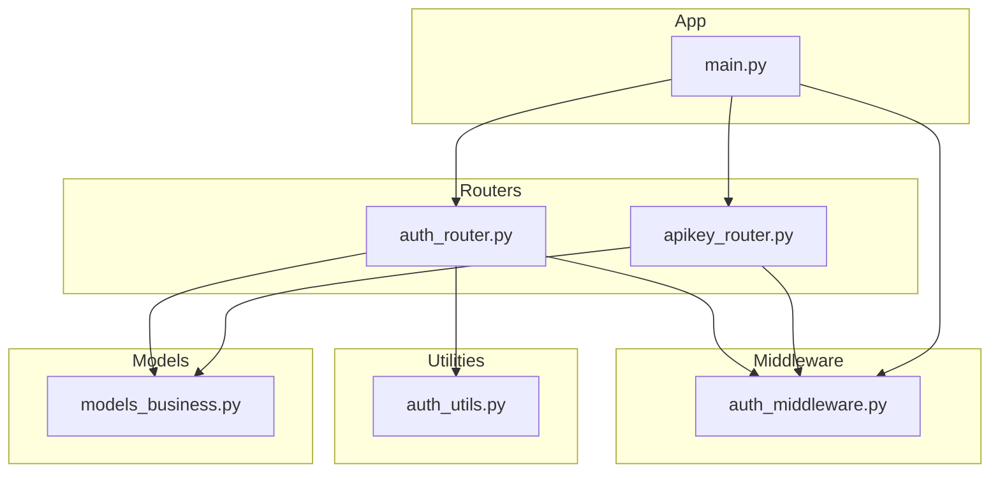
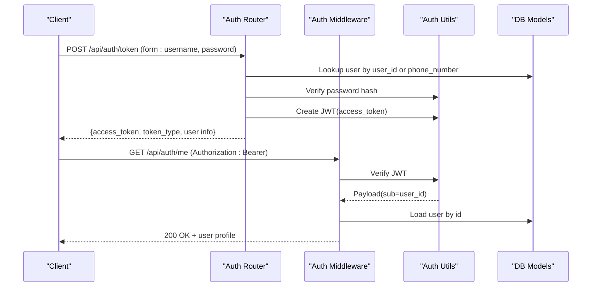
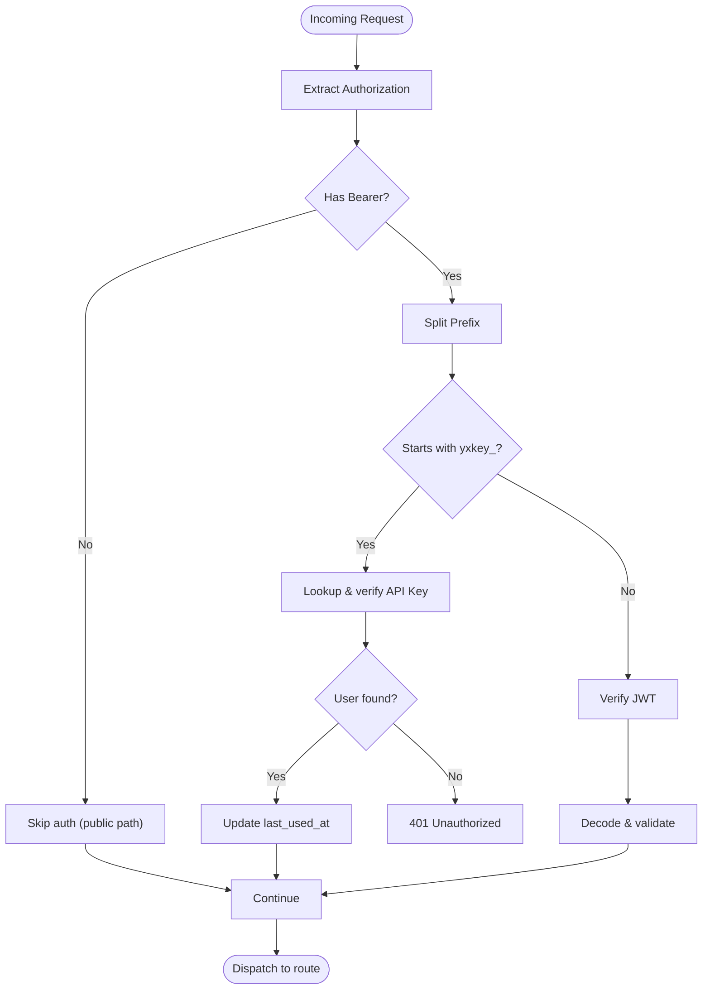
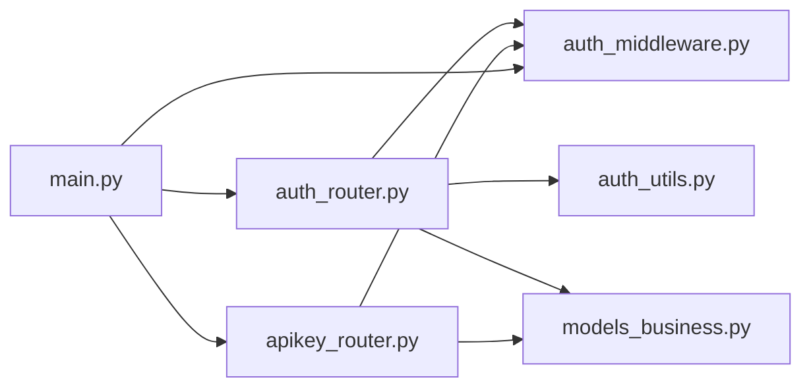

# Authentication API

<cite>
**Referenced Files in This Document**
- [auth_router.py](file://backend/server/routers/auth_router.py)
- [apikey_router.py](file://backend/server/routers/apikey_router.py)
- [auth_middleware.py](file://backend/server/utils/auth_middleware.py)
- [auth_utils.py](file://backend/server/utils/auth_utils.py)
- [models_business.py](file://backend/package/yuxi/storage/postgres/models_business.py)
- [main.py](file://backend/server/main.py)
- [test_auth_router.py](file://backend/test/integration/api/test_auth_router.py)
- [user.js](file://web/src/stores/user.js)
- [apikey_api.js](file://web/src/apis/apikey_api.js)
</cite>

## Table of Contents
1. [Introduction](#introduction)
2. [Project Structure](#project-structure)
3. [Core Components](#core-components)
4. [Architecture Overview](#architecture-overview)
5. [Detailed Component Analysis](#detailed-component-analysis)
6. [Dependency Analysis](#dependency-analysis)
7. [Performance Considerations](#performance-considerations)
8. [Troubleshooting Guide](#troubleshooting-guide)
9. [Conclusion](#conclusion)

## Introduction
This document provides comprehensive API documentation for the authentication subsystem. It covers:
- Login and logout mechanisms with JWT token management
- API key authentication and administration
- Session handling and user lifecycle endpoints
- Authentication middleware configuration, token validation, and authorization patterns
- Practical authentication flows, token refresh considerations, and security practices
- Rate limiting, session timeout, and secure token storage recommendations

## Project Structure
The authentication system spans several modules:
- Routers: authentication endpoints and API key management
- Middleware: authentication and authorization guards
- Utilities: JWT creation/verification and password hashing
- Models: business domain models including User and APIKey
- Application: global middleware configuration and rate limiting

**Diagram sources**
- [auth_router.py:1-829](file://backend/server/routers/auth_router.py#L1-L829)
- [apikey_router.py:1-259](file://backend/server/routers/apikey_router.py#L1-L259)
- [auth_middleware.py:1-169](file://backend/server/utils/auth_middleware.py#L1-L169)
- [auth_utils.py:1-81](file://backend/server/utils/auth_utils.py#L1-L81)
- [models_business.py:1-200](file://backend/package/yuxi/storage/postgres/models_business.py#L1-L200)
- [main.py:1-150](file://backend/server/main.py#L1-L150)

**Section sources**
- [auth_router.py:1-829](file://backend/server/routers/auth_router.py#L1-L829)
- [apikey_router.py:1-259](file://backend/server/routers/apikey_router.py#L1-L259)
- [auth_middleware.py:1-169](file://backend/server/utils/auth_middleware.py#L1-L169)
- [auth_utils.py:1-81](file://backend/server/utils/auth_utils.py#L1-L81)
- [models_business.py:1-200](file://backend/package/yuxi/storage/postgres/models_business.py#L1-L200)
- [main.py:1-150](file://backend/server/main.py#L1-L150)

## Core Components
- Authentication router (/api/auth): login, user info/profile, user management, avatar upload, impersonation
- API key router (/api/apikey): CRUD and regeneration for API keys
- Authentication middleware: bearer token extraction, JWT/API key validation, role checks
- Auth utilities: JWT encode/decode/verify, password hashing/verification
- Business models: User, Department, APIKey
- Global middleware: public path bypass, login rate limiting

**Section sources**
- [auth_router.py:29-829](file://backend/server/routers/auth_router.py#L29-L829)
- [apikey_router.py:16-259](file://backend/server/routers/apikey_router.py#L16-L259)
- [auth_middleware.py:15-169](file://backend/server/utils/auth_middleware.py#L15-L169)
- [auth_utils.py:20-81](file://backend/server/utils/auth_utils.py#L20-L81)
- [models_business.py:51-131](file://backend/package/yuxi/storage/postgres/models_business.py#L51-L131)
- [main.py:32-137](file://backend/server/main.py#L32-L137)

## Architecture Overview
High-level authentication flow:
- Clients send credentials to login and receive a JWT
- Subsequent requests include Authorization: Bearer <token>
- Middleware validates tokens and enforces role-based access
- API keys are supported as an alternative, validated via hash lookup

**Diagram sources**
- [auth_router.py:115-207](file://backend/server/routers/auth_router.py#L115-L207)
- [auth_middleware.py:74-124](file://backend/server/utils/auth_middleware.py#L74-L124)
- [auth_utils.py:46-81](file://backend/server/utils/auth_utils.py#L46-L81)
- [models_business.py:51-104](file://backend/package/yuxi/storage/postgres/models_business.py#L51-L104)

## Detailed Component Analysis

### Authentication Endpoints

#### POST /api/auth/token
- Description: Obtain a JWT access token using username and password
- Authentication: No prior authentication required
- Request: form-data
  - username: string (supports user_id or phone_number)
  - password: string
- Response: Token
  - access_token: string
  - token_type: string ("bearer")
  - user_id: integer
  - username: string
  - user_id_login: string
  - phone_number: string | null
  - avatar: string | null
  - role: string
  - department_id: integer | null
  - department_name: string | null
- Errors:
  - 401 Unauthorized: invalid credentials, generic message for security
  - 403 Forbidden: account deleted
  - 423 Locked: locked due to repeated failures; includes X-Lock-Remaining header
  - WWW-Authenticate: Bearer
- Security:
  - Brute-force protection via rate limiting middleware
  - Login lockout after repeated failures
  - No password in response

**Section sources**
- [auth_router.py:115-207](file://backend/server/routers/auth_router.py#L115-L207)
- [auth_router.py:156-176](file://backend/server/routers/auth_router.py#L156-L176)
- [main.py:63-96](file://backend/server/main.py#L63-L96)
- [models_business.py:106-131](file://backend/package/yuxi/storage/postgres/models_business.py#L106-L131)

#### GET /api/auth/check-first-run
- Description: Check if the system requires initial admin setup
- Response: { first_run: boolean }

**Section sources**
- [auth_router.py:211-214](file://backend/server/routers/auth_router.py#L211-L214)

#### POST /api/auth/initialize
- Description: Create the initial superadmin during first run
- Authentication: No prior authentication required
- Request: InitializeAdmin
  - user_id: string (alphanumeric + underscore, length 3–20)
  - password: string
  - phone_number: string | null
- Response: Token (same as login)
- Errors:
  - 403 Forbidden: system already initialized

**Section sources**
- [auth_router.py:218-290](file://backend/server/routers/auth_router.py#L218-L290)

#### GET /api/auth/me
- Description: Retrieve current user profile
- Authentication: Required (Bearer JWT or API Key)
- Response: UserResponse
- Errors:
  - 401 Unauthorized: missing/invalid credentials
  - 400 Bad Request: user not bound to a department

**Section sources**
- [auth_router.py:299-308](file://backend/server/routers/auth_router.py#L299-L308)
- [auth_middleware.py:126-139](file://backend/server/utils/auth_middleware.py#L126-L139)

#### PUT /api/auth/profile
- Description: Update personal profile (username, phone number)
- Authentication: Required
- Request: UserProfileUpdate
  - username: string | null
  - phone_number: string | null
- Response: UserResponse
- Errors:
  - 400 Bad Request: invalid username format, duplicate username/phone

**Section sources**
- [auth_router.py:312-370](file://backend/server/routers/auth_router.py#L312-L370)

#### POST /api/auth/users
- Description: Create a new user (admin-only)
- Authentication: Admin or Superadmin required
- Request: UserCreate
  - username: string
  - password: string
  - role: string (default "user"; superadmin disallowed)
  - phone_number: string | null
  - department_id: integer | null (only superadmin may specify)
- Response: UserResponse
- Errors:
  - 400/403: insufficient privileges, duplicate entries, invalid role

**Section sources**
- [auth_router.py:379-471](file://backend/server/routers/auth_router.py#L379-L471)

#### GET /api/auth/users
- Description: List users (admin-only)
- Authentication: Admin or Superadmin required
- Query: skip, limit
- Response: array of UserResponse

**Section sources**
- [auth_router.py:475-496](file://backend/server/routers/auth_router.py#L475-L496)

#### GET /api/auth/users/{user_id}
- Description: Get a specific user (admin-only)
- Authentication: Admin or Superadmin required
- Response: UserResponse
- Errors: 404 Not Found if user does not exist

**Section sources**
- [auth_router.py:499-509](file://backend/server/routers/auth_router.py#L499-L509)

#### PUT /api/auth/users/{user_id}
- Description: Update user (admin-only)
- Authentication: Admin or Superadmin required
- Request: UserUpdate
  - username: string | null
  - password: string | null
  - role: string | null
  - phone_number: string | null
  - avatar: string | null
  - department_id: integer | null (superadmin only)
- Response: UserResponse
- Errors:
  - 400/403: role changes, department changes, uniqueness constraints

**Section sources**
- [auth_router.py:525-619](file://backend/server/routers/auth_router.py#L525-L619)

#### DELETE /api/auth/users/{user_id}
- Description: Soft-delete a user (admin-only)
- Authentication: Admin or Superadmin required
- Response: { success: boolean, message: string }
- Errors:
  - 400/403: cannot delete superadmin, cannot remove sole admin, cannot delete self

**Section sources**
- [auth_router.py:623-690](file://backend/server/routers/auth_router.py#L623-L690)

#### POST /api/auth/validate-username
- Description: Validate username and propose a unique user_id (admin-only)
- Authentication: Admin or Superadmin required
- Response: { username, user_id, is_available: true }

**Section sources**
- [auth_router.py:694-723](file://backend/server/routers/auth_router.py#L694-L723)

#### GET /api/auth/check-user-id/{user_id}
- Description: Check availability of a user_id (admin-only)
- Authentication: Admin or Superadmin required
- Response: { user_id, is_available: boolean }

**Section sources**
- [auth_router.py:727-734](file://backend/server/routers/auth_router.py#L727-L734)

#### POST /api/auth/upload-avatar
- Description: Upload user avatar (image/*, <= 5MB)
- Authentication: Required
- Request: multipart/form-data (file)
- Response: { success: boolean, avatar_url: string, message: string }
- Errors:
  - 400 Bad Request: invalid content type or size
  - 500 Internal Server Error: upload failure

**Section sources**
- [auth_router.py:738-774](file://backend/server/routers/auth_router.py#L738-L774)

#### POST /api/auth/impersonate/{user_id}
- Description: Superadmin simulates another user’s session
- Authentication: Superadmin required
- Response: Token (as login)
- Errors:
  - 403 Forbidden: cannot impersonate superadmin
  - 404 Not Found: user not found

**Section sources**
- [auth_router.py:777-828](file://backend/server/routers/auth_router.py#L777-L828)

### API Key Endpoints

#### GET /api/apikey/
- Description: List API keys for current user (or all for superadmin)
- Authentication: Required
- Query: skip, limit
- Response: { api_keys: [...], total: integer }

**Section sources**
- [apikey_router.py:65-97](file://backend/server/routers/apikey_router.py#L65-L97)

#### POST /api/apikey/
- Description: Create a new API key (secret returned once)
- Authentication: Required
- Request: APIKeyCreate
  - name: string
  - user_id: integer | null (superadmin may set)
  - department_id: integer | null
  - expires_at: string | null
- Response: { api_key: APIKeyResponse, secret: string }
- Errors:
  - 403/404: unauthorized user binding or missing user

**Section sources**
- [apikey_router.py:100-149](file://backend/server/routers/apikey_router.py#L100-L149)

#### GET /api/apikey/{api_key_id}
- Description: Get a single API key (own or superadmin)
- Authentication: Required
- Response: { api_key: APIKeyResponse }

**Section sources**
- [apikey_router.py:152-169](file://backend/server/routers/apikey_router.py#L152-L169)

#### PUT /api/apikey/{api_key_id}
- Description: Update API key (own or superadmin)
- Authentication: Required
- Request: APIKeyUpdate
- Response: { api_key: APIKeyResponse }

**Section sources**
- [apikey_router.py:172-203](file://backend/server/routers/apikey_router.py#L172-L203)

#### DELETE /api/apikey/{api_key_id}
- Description: Delete API key (own or superadmin)
- Authentication: Required
- Response: { success: true }

**Section sources**
- [apikey_router.py:206-226](file://backend/server/routers/apikey_router.py#L206-L226)

#### POST /api/apikey/{api_key_id}/regenerate
- Description: Regenerate API key (secret returned once)
- Authentication: Required
- Response: { api_key: APIKeyResponse, secret: string }

**Section sources**
- [apikey_router.py:229-258](file://backend/server/routers/apikey_router.py#L229-L258)

### Authentication Middleware and Token Management

#### Bearer Token Validation
- Supports two token types:
  - JWT: "Bearer <token>"
  - API Key: "Bearer yxkey_<secret>" (hashed in DB)
- JWT validation:
  - HS256 signature verification
  - Expiration enforced
- API Key validation:
  - Hash comparison against stored key_hash
  - Enabled flag and expiration checked
  - Optional binding to user or department-level admin
- Public paths bypass authentication (e.g., login, initialization)

**Diagram sources**
- [auth_middleware.py:74-139](file://backend/server/utils/auth_middleware.py#L74-L139)
- [auth_utils.py:62-81](file://backend/server/utils/auth_utils.py#L62-L81)

**Section sources**
- [auth_middleware.py:15-169](file://backend/server/utils/auth_middleware.py#L15-L169)
- [auth_utils.py:13-81](file://backend/server/utils/auth_utils.py#L13-L81)

### Authorization Patterns
- Role checks:
  - get_required_user: ensures login and department binding
  - get_admin_user: admin or superadmin
  - get_superadmin_user: superadmin only
- Department isolation:
  - Admins see only users in their department (except superadmin)
- Impersonation:
  - Superadmin can generate JWT for another user

**Section sources**
- [auth_middleware.py:126-159](file://backend/server/utils/auth_middleware.py#L126-L159)
- [auth_router.py:481-489](file://backend/server/routers/auth_router.py#L481-L489)
- [auth_router.py:777-828](file://backend/server/routers/auth_router.py#L777-L828)

### JWT Configuration and Token Lifecycle
- Algorithm: HS256
- Expiration: 7 days
- Secret: environment variable (fallback included)
- Storage: clients should persist securely (see Secure Storage Practices)

**Section sources**
- [auth_utils.py:13-17](file://backend/server/utils/auth_utils.py#L13-L17)
- [auth_utils.py:46-60](file://backend/server/utils/auth_utils.py#L46-L60)

### Logout Mechanism
- No dedicated logout endpoint exists
- To invalidate a token, revoke the JWT or disable the API key
- Frontend clears local token storage on logout

**Section sources**
- [user.js:88-90](file://web/src/stores/user.js#L88-L90)

## Dependency Analysis
- Router-to-middleware: all auth routes depend on auth_middleware for user resolution and authorization
- Router-to-utils: auth_router depends on auth_utils for password hashing and JWT operations
- Router-to-models: auth_router and apikey_router depend on User, Department, APIKey models
- App-to-routers: main.py registers both routers and applies global middleware

**Diagram sources**
- [auth_router.py:15-25](file://backend/server/routers/auth_router.py#L15-L25)
- [auth_middleware.py:15-16](file://backend/server/utils/auth_middleware.py#L15-L16)
- [auth_utils.py:1-12](file://backend/server/utils/auth_utils.py#L1-L12)
- [models_business.py:1-24](file://backend/package/yuxi/storage/postgres/models_business.py#L1-L24)
- [main.py:42-42](file://backend/server/main.py#L42-L42)

**Section sources**
- [auth_router.py:15-25](file://backend/server/routers/auth_router.py#L15-L25)
- [auth_middleware.py:15-16](file://backend/server/utils/auth_middleware.py#L15-L16)
- [auth_utils.py:1-12](file://backend/server/utils/auth_utils.py#L1-L12)
- [models_business.py:1-24](file://backend/package/yuxi/storage/postgres/models_business.py#L1-L24)
- [main.py:42-42](file://backend/server/main.py#L42-L42)

## Performance Considerations
- Login rate limiting: sliding window per IP prevents brute force on /api/auth/token
- Token verification: lightweight HS256 decoding; cacheable claims only
- Database queries: minimal ORM usage; avoid N+1 by using joins where applicable
- Avatar uploads: stream to MinIO; enforce size limits client-side

[No sources needed since this section provides general guidance]

## Troubleshooting Guide
- 401 Unauthorized on protected endpoints:
  - Ensure Authorization header is present and prefixed with "Bearer "
  - For API keys, confirm the header value starts with "yxkey_" and is enabled
- 423 Locked during login:
  - Respect X-Lock-Remaining header; wait for lock to expire
- 403 Forbidden on admin endpoints:
  - Confirm current user has admin or superadmin role
- 404 Not Found for users:
  - Soft-deleted users are not retrievable via normal endpoints
- Integration tests:
  - Verify invalid tokens are rejected and login lock behavior is enforced

**Section sources**
- [auth_middleware.py:74-139](file://backend/server/utils/auth_middleware.py#L74-L139)
- [auth_router.py:156-176](file://backend/server/routers/auth_router.py#L156-L176)
- [test_auth_router.py:14-40](file://backend/test/integration/api/test_auth_router.py#L14-L40)
- [test_auth_router.py:72-75](file://backend/test/integration/api/test_auth_router.py#L72-L75)

## Conclusion
The authentication system provides robust JWT-based and API key-based authentication with strong middleware-driven authorization, rate limiting, and user lifecycle management. Administrators can manage users and API keys centrally, while clients should adopt secure token storage and handle lockouts gracefully. There is no explicit logout endpoint; token invalidation relies on revocation or key disabling.