# Chat API

<cite>
**Referenced Files in This Document**
- [chat_router.py](file://backend/server/routers/chat_router.py)
- [main.py](file://backend/server/main.py)
- [chat_service.py](file://backend/package/yuxi/services/chat_service.py)
- [conversation_service.py](file://backend/package/yuxi/services/conversation_service.py)
- [conversation_repository.py](file://backend/package/yuxi/repositories/conversation_repository.py)
- [thread_files_service.py](file://backend/package/yuxi/services/thread_files_service.py)
- [chat.py](file://backend/package/yuxi/models/chat.py)
- [configuration.md](file://docs/advanced/configuration.md)
- [test_chat_router.py](file://backend/test/integration/api/test_chat_router.py)
- [test_chat_service_sync.py](file://backend/test/unit/services/test_chat_service_sync.py)
</cite>

## Table of Contents
1. [Introduction](#introduction)
2. [Project Structure](#project-structure)
3. [Core Components](#core-components)
4. [Architecture Overview](#architecture-overview)
5. [Detailed Component Analysis](#detailed-component-analysis)
6. [Dependency Analysis](#dependency-analysis)
7. [Performance Considerations](#performance-considerations)
8. [Troubleshooting Guide](#troubleshooting-guide)
9. [Conclusion](#conclusion)
10. [Appendices](#appendices)

## Introduction
This document provides comprehensive API documentation for chat and conversation management endpoints. It covers:
- Conversation creation and lifecycle
- Message sending and retrieval
- Streaming responses
- Conversation history management
- Message threading and attachments
- Real-time chat capabilities and event streaming
- Message status tracking and feedback
- Attachment handling and artifact management
- Authentication and authorization requirements
- Error handling and troubleshooting
- Performance considerations and analytics

## Project Structure
The chat API is implemented as part of a FastAPI application with modular routing and service-layer architecture:
- Router module defines endpoints under /api/chat
- Services encapsulate business logic for chat, conversation, and thread files
- Repositories handle persistence for conversations and messages
- Models provide model selection and streaming utilities
- Tests validate integration and unit behaviors

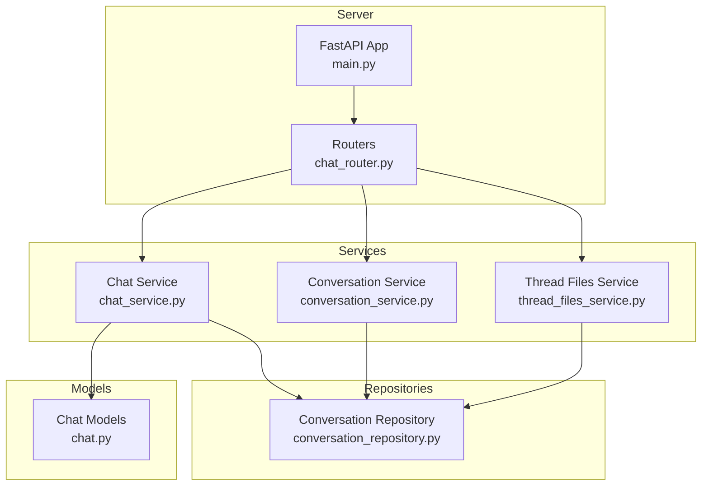

**Diagram sources**
- [main.py:40-42](file://backend/server/main.py#L40-L42)
- [chat_router.py:99-100](file://backend/server/routers/chat_router.py#L99-L100)
- [chat_service.py:1-20](file://backend/package/yuxi/services/chat_service.py#L1-L20)
- [conversation_service.py:1-20](file://backend/package/yuxi/services/conversation_service.py#L1-L20)
- [thread_files_service.py:1-20](file://backend/package/yuxi/services/thread_files_service.py#L1-L20)
- [conversation_repository.py:18-21](file://backend/package/yuxi/repositories/conversation_repository.py#L18-L21)
- [chat.py:103-141](file://backend/package/yuxi/models/chat.py#L103-L141)

**Section sources**
- [main.py:40-42](file://backend/server/main.py#L40-L42)
- [chat_router.py:99-100](file://backend/server/routers/chat_router.py#L99-L100)

## Core Components
- Chat Router: Defines all chat-related endpoints, request/response models, and authentication dependencies.
- Chat Service: Implements non-streaming and streaming chat flows, LangGraph state integration, content guard checks, and LangFuse tracing.
- Conversation Service: Manages thread creation, listing, updates, deletion, and attachment handling with sandbox-backed storage.
- Thread Files Service: Provides file listing, content reading, artifact resolution, and saving to workspace within the sandbox.
- Conversation Repository: Handles persistence of conversations, messages, tool calls, and attachments.
- Chat Models: Provides model selection and streaming utilities for external providers.

**Section sources**
- [chat_router.py:99-985](file://backend/server/routers/chat_router.py#L99-L985)
- [chat_service.py:464-1103](file://backend/package/yuxi/services/chat_service.py#L464-L1103)
- [conversation_service.py:267-550](file://backend/package/yuxi/services/conversation_service.py#L267-L550)
- [thread_files_service.py:29-292](file://backend/package/yuxi/services/thread_files_service.py#L29-L292)
- [conversation_repository.py:18-464](file://backend/package/yuxi/repositories/conversation_repository.py#L18-L464)
- [chat.py:103-141](file://backend/package/yuxi/models/chat.py#L103-L141)

## Architecture Overview
The chat API follows a layered architecture:
- Presentation Layer: FastAPI routes define endpoints and request/response models.
- Service Layer: Business logic orchestrates agent invocation, LangGraph state, persistence, and streaming.
- Persistence Layer: SQLAlchemy repositories manage conversations, messages, and attachments.
- Storage Layer: Sandboxed file system for attachments and artifacts.

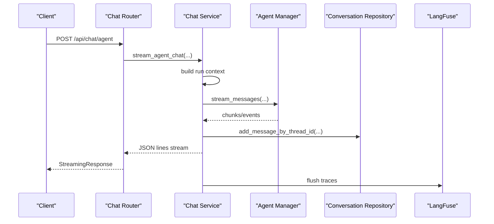

**Diagram sources**
- [chat_router.py:347-397](file://backend/server/routers/chat_router.py#L347-L397)
- [chat_service.py:657-800](file://backend/package/yuxi/services/chat_service.py#L657-L800)
- [conversation_repository.py:136-157](file://backend/package/yuxi/repositories/conversation_repository.py#L136-L157)

## Detailed Component Analysis

### Authentication and Authorization
- Authentication: Routes decorated with user dependency enforce authentication. Some administrative endpoints require admin roles.
- Middleware: Global middleware handles CORS, access logging, rate limiting for login, and basic auth checks.

Key behaviors:
- Non-admin endpoints require a logged-in user.
- Admin-only endpoints (e.g., setting default agent) require admin privileges.
- Public paths bypass auth checks; all business APIs are prefixed with /api.

**Section sources**
- [chat_router.py:107-148](file://backend/server/routers/chat_router.py#L107-L148)
- [main.py:99-137](file://backend/server/main.py#L99-L137)

### Conversation Management Endpoints
- Create Thread
  - Method: POST
  - URL: /api/chat/thread
  - Request body: ThreadCreate (agent_id, title, metadata)
  - Response: ThreadResponse (id, user_id, agent_id, title, is_pinned, created_at, updated_at, metadata)
  - Authentication: Required
  - Notes: Creates a new conversation bound to the user and agent.

- List Threads
  - Method: GET
  - URL: /api/chat/threads
  - Query params: agent_id (optional), limit (default 100, max 500), offset (default 0)
  - Response: Array of ThreadResponse
  - Authentication: Required

- Update Thread
  - Method: PUT
  - URL: /api/chat/thread/{thread_id}
  - Request body: ThreadUpdate (title, is_pinned)
  - Response: ThreadResponse
  - Authentication: Required

- Delete Thread
  - Method: DELETE
  - URL: /api/chat/thread/{thread_id}
  - Authentication: Required

- Get Thread Active Run
  - Method: GET
  - URL: /api/chat/thread/{thread_id}/active_run
  - Authentication: Required
  - Purpose: Retrieve the currently active run for the thread.

- Get Thread State
  - Method: GET
  - URL: /api/chat/thread/{thread_id}/state
  - Authentication: Required
  - Purpose: Retrieve agent state for the thread.

- Get Thread History
  - Method: GET
  - URL: /api/chat/thread/{thread_id}/history
  - Authentication: Required
  - Response: Contains history array with message details, tool calls, feedback, and error metadata.

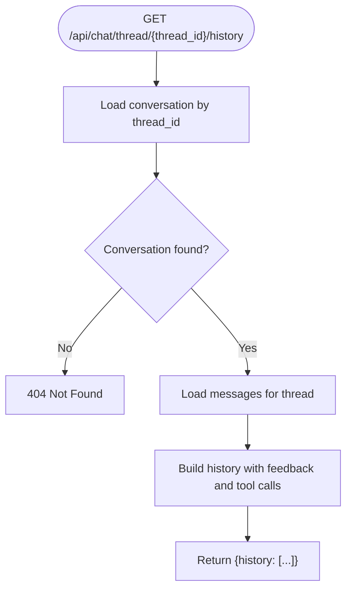

**Diagram sources**
- [chat_router.py:589-604](file://backend/server/routers/chat_router.py#L589-L604)
- [conversation_service.py:489-550](file://backend/package/yuxi/services/conversation_service.py#L489-L550)

**Section sources**
- [chat_router.py:709-765](file://backend/server/routers/chat_router.py#L709-L765)
- [chat_router.py:579-624](file://backend/server/routers/chat_router.py#L579-L624)
- [chat_router.py:589-604](file://backend/server/routers/chat_router.py#L589-L604)
- [conversation_repository.py:222-278](file://backend/package/yuxi/repositories/conversation_repository.py#L222-L278)

### Message Sending and Retrieval
- Non-streaming Chat
  - Method: POST
  - URL: /api/chat/agent/sync
  - Request body: AgentChatRequest (query, agent_config_id, thread_id, meta, image_content)
  - Response: Complete chat response object (status, response, request_id, thread_id, agent_state, time_cost)
  - Authentication: Required
  - Notes: Uses agent.invoke_messages and persists LangGraph state.

- Streaming Chat
  - Method: POST
  - URL: /api/chat/agent
  - Response: JSON Lines stream with status events (init, messages, error, finished, interrupted, ask_user_question_required)
  - Authentication: Required
  - Notes: Emits structured JSON chunks for incremental rendering.

- Resume Interrupted Chat
  - Method: POST
  - URL: /api/chat/thread/{thread_id}/resume
  - Request body: approved (bool), answer (object mapping question_id to answer), config (dict)
  - Response: JSON Lines stream resuming the agent after human approval.
  - Authentication: Required

- Submit Message Feedback
  - Method: POST
  - URL: /api/chat/message/{message_id}/feedback
  - Request body: MessageFeedbackRequest (rating, reason)
  - Response: MessageFeedbackResponse (id, message_id, rating, reason, created_at)
  - Authentication: Required

- Get Message Feedback
  - Method: GET
  - URL: /api/chat/message/{message_id}/feedback
  - Authentication: Required

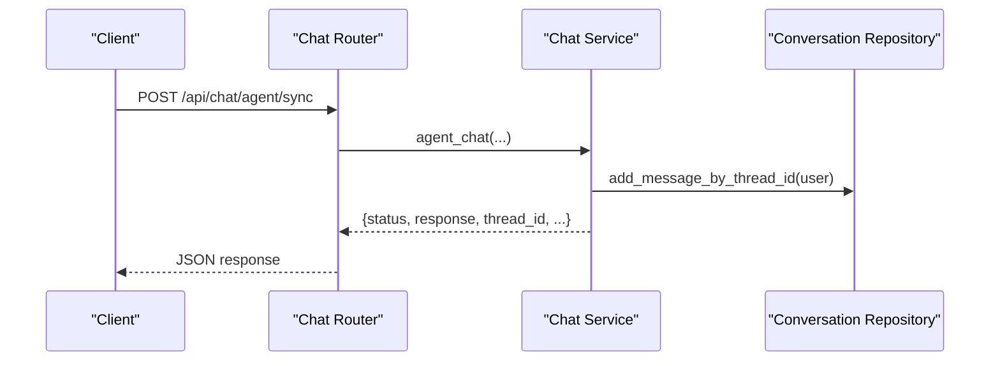

**Diagram sources**
- [chat_router.py:376-397](file://backend/server/routers/chat_router.py#L376-L397)
- [chat_service.py:464-655](file://backend/package/yuxi/services/chat_service.py#L464-L655)
- [conversation_repository.py:136-157](file://backend/package/yuxi/repositories/conversation_repository.py#L136-L157)

**Section sources**
- [chat_router.py:347-397](file://backend/server/routers/chat_router.py#L347-L397)
- [chat_router.py:479-577](file://backend/server/routers/chat_router.py#L479-L577)
- [chat_router.py:911-941](file://backend/server/routers/chat_router.py#L911-L941)
- [chat_service.py:464-655](file://backend/package/yuxi/services/chat_service.py#L464-L655)

### Attachment Handling
- Upload Thread Attachment
  - Method: POST
  - URL: /api/chat/thread/{thread_id}/attachments
  - Request: multipart/form-data (file)
  - Response: AttachmentResponse (file_id, file_name, file_type, file_size, status, uploaded_at, path, artifact_url, original_path, original_artifact_url, minio_url)
  - Authentication: Required
  - Notes: Converts to markdown when possible, materializes files in sandbox, and syncs agent state.

- List Thread Attachments
  - Method: GET
  - URL: /api/chat/thread/{thread_id}/attachments
  - Response: AttachmentListResponse (attachments[], limits.allowed_extensions, limits.max_size_bytes)
  - Authentication: Required

- Delete Thread Attachment
  - Method: DELETE
  - URL: /api/chat/thread/{thread_id}/attachments/{file_id}
  - Authentication: Required

- Limits and Validation
  - Max file size: 5 MB
  - Allowed extensions: configured in service constants
  - Status transitions: uploaded -> parsed (when markdown conversion succeeds)

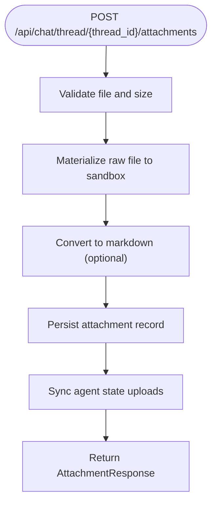

**Diagram sources**
- [chat_router.py:772-786](file://backend/server/routers/chat_router.py#L772-L786)
- [conversation_service.py:367-423](file://backend/package/yuxi/services/conversation_service.py#L367-L423)
- [conversation_service.py:166-190](file://backend/package/yuxi/services/conversation_service.py#L166-L190)

**Section sources**
- [chat_router.py:772-816](file://backend/server/routers/chat_router.py#L772-L816)
- [conversation_service.py:367-423](file://backend/package/yuxi/services/conversation_service.py#L367-L423)
- [conversation_repository.py:400-464](file://backend/package/yuxi/repositories/conversation_repository.py#L400-L464)

### Thread Files and Artifacts
- List Thread Files
  - Method: GET
  - URL: /api/chat/thread/{thread_id}/files
  - Query: path (default virtual root), recursive (bool)
  - Response: ThreadFileListResponse (path, files[])
  - Authentication: Required

- Read Thread File Content
  - Method: GET
  - URL: /api/chat/thread/{thread_id}/files/content
  - Query: path, offset (default 0), limit (default 2000, max 5000)
  - Response: ThreadFileContentResponse (path, content[], offset, limit, total_lines, artifact_url)
  - Authentication: Required

- Get Artifact
  - Method: GET
  - URL: /api/chat/thread/{thread_id}/artifacts/{path}
  - Query: download (bool)
  - Response: FileResponse
  - Authentication: Required

- Save Artifact to Workspace
  - Method: POST
  - URL: /api/chat/thread/{thread_id}/artifacts/save
  - Request: SaveThreadArtifactRequest (path)
  - Response: SaveThreadArtifactResponse (name, source_path, saved_path, saved_artifact_url)
  - Authentication: Required

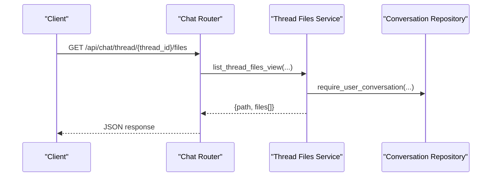

**Diagram sources**
- [chat_router.py:818-854](file://backend/server/routers/chat_router.py#L818-L854)
- [thread_files_service.py:29-78](file://backend/package/yuxi/services/thread_files_service.py#L29-L78)

**Section sources**
- [chat_router.py:818-891](file://backend/server/routers/chat_router.py#L818-L891)
- [thread_files_service.py:29-292](file://backend/package/yuxi/services/thread_files_service.py#L29-L292)

### Real-time Chat and Event Streaming
- SSE Events for Runs
  - Method: GET
  - URL: /api/chat/runs/{run_id}/events
  - Query: after_seq (default "0")
  - Response: Server-Sent Events stream
  - Authentication: Required
  - Purpose: Stream run lifecycle events for asynchronous runs.

- Streaming Chat
  - Method: POST
  - URL: /api/chat/agent
  - Response: JSON Lines stream with structured events (init, messages, error, finished, interrupted, ask_user_question_required)
  - Authentication: Required

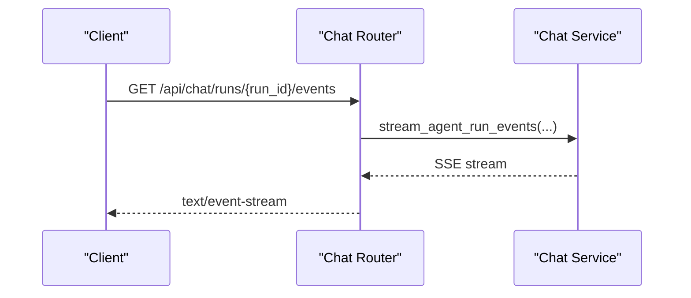

**Diagram sources**
- [chat_router.py:437-456](file://backend/server/routers/chat_router.py#L437-L456)

**Section sources**
- [chat_router.py:437-456](file://backend/server/routers/chat_router.py#L437-L456)
- [chat_router.py:347-397](file://backend/server/routers/chat_router.py#L347-L397)

### Model Management
- List Models
  - Method: GET
  - URL: /api/chat/models
  - Query: model_provider
  - Authentication: Admin required

- Update Models
  - Method: POST
  - URL: /api/chat/models/update
  - Request: model_provider, model_names[]
  - Authentication: Admin required

**Section sources**
- [chat_router.py:463-477](file://backend/server/routers/chat_router.py#L463-L477)

### Multi-modal Image Support
- Upload Image
  - Method: POST
  - URL: /api/chat/image/upload
  - Request: multipart/form-data (file)
  - Response: ImageUploadResponse (success, image_content, thumbnail_content, width, height, format, mime_type, size_bytes, error)
  - Authentication: Required
  - Notes: Validates image type and size, processes image, returns base64 content and metadata.

**Section sources**
- [chat_router.py:948-985](file://backend/server/routers/chat_router.py#L948-L985)

### Request and Response Schemas
Common models used across endpoints:
- AgentChatRequest: query, agent_config_id, thread_id, meta, image_content
- ThreadCreate: title, agent_id, metadata
- ThreadUpdate: title, is_pinned
- AttachmentResponse: file_id, file_name, file_type, file_size, status, uploaded_at, path, artifact_url, original_path, original_artifact_url, minio_url
- AttachmentListResponse: attachments[], limits (allowed_extensions, max_size_bytes)
- ThreadFileEntry: path, name, is_dir, size, modified_at, artifact_url
- ThreadFileListResponse: path, files[]
- ThreadFileContentResponse: path, content[], offset, limit, total_lines, artifact_url
- SaveThreadArtifactRequest: path
- SaveThreadArtifactResponse: name, source_path, saved_path, saved_artifact_url
- MessageFeedbackRequest: rating, reason
- MessageFeedbackResponse: id, message_id, rating, reason, created_at

**Section sources**
- [chat_router.py:91-97](file://backend/server/routers/chat_router.py#L91-L97)
- [chat_router.py:629-702](file://backend/server/routers/chat_router.py#L629-L702)
- [chat_router.py:772-786](file://backend/server/routers/chat_router.py#L772-L786)
- [chat_router.py:818-854](file://backend/server/routers/chat_router.py#L818-L854)
- [chat_router.py:877-891](file://backend/server/routers/chat_router.py#L877-L891)
- [chat_router.py:898-941](file://backend/server/routers/chat_router.py#L898-L941)

## Dependency Analysis
Key dependencies and relationships:
- Router depends on services for business logic.
- Services depend on repositories for persistence.
- Chat service integrates with agent manager, LangGraph, LangFuse, and content guard.
- Thread files service depends on sandbox utilities and resolves virtual paths.
- Conversation repository manages conversations, messages, tool calls, and attachments.

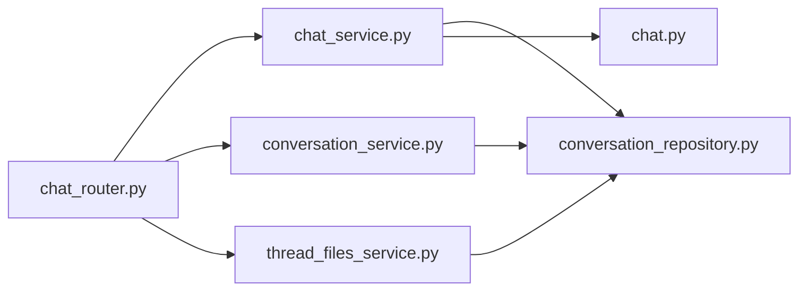

**Diagram sources**
- [chat_router.py:17-42](file://backend/server/routers/chat_router.py#L17-L42)
- [chat_service.py:1-32](file://backend/package/yuxi/services/chat_service.py#L1-L32)
- [conversation_service.py:1-19](file://backend/package/yuxi/services/conversation_service.py#L1-L19)
- [thread_files_service.py:1-19](file://backend/package/yuxi/services/thread_files_service.py#L1-L19)
- [conversation_repository.py:18-21](file://backend/package/yuxi/repositories/conversation_repository.py#L18-L21)
- [chat.py:103-141](file://backend/package/yuxi/models/chat.py#L103-L141)

**Section sources**
- [chat_router.py:17-42](file://backend/server/routers/chat_router.py#L17-L42)
- [chat_service.py:1-32](file://backend/package/yuxi/services/chat_service.py#L1-L32)
- [conversation_service.py:1-19](file://backend/package/yuxi/services/conversation_service.py#L1-L19)
- [thread_files_service.py:1-19](file://backend/package/yuxi/services/thread_files_service.py#L1-L19)
- [conversation_repository.py:18-21](file://backend/package/yuxi/repositories/conversation_repository.py#L18-L21)
- [chat.py:103-141](file://backend/package/yuxi/models/chat.py#L103-L141)

## Performance Considerations
- Streaming Responses: Prefer streaming endpoints (/api/chat/agent) for real-time UX and reduced latency.
- Attachment Size Limits: Enforced at 5 MB to prevent excessive memory usage during conversion.
- Pagination: Use limit/offset for listing threads and reading file content to control payload sizes.
- LangGraph State: State is restored automatically from checkpointer; avoid unnecessary state mutations.
- Content Guard: Enabled by configuration to filter sensitive content early, reducing downstream processing.
- Model Selection: Use select_model to leverage provider-specific optimizations and retries.

[No sources needed since this section provides general guidance]

## Troubleshooting Guide
Common issues and resolutions:
- Authentication Failures
  - Symptom: 401 Unauthorized on protected endpoints.
  - Cause: Missing or invalid credentials.
  - Resolution: Ensure user is authenticated; admin endpoints require admin privileges.

- Invalid Agent Config
  - Symptom: Error response indicating invalid_config.
  - Cause: agent_config_id not found or mismatched agent_id.
  - Resolution: Verify agent configuration belongs to the user’s department and matches the agent_id.

- Content Guard Blocked
  - Symptom: Error response with content_guard_blocked.
  - Cause: Input or output flagged by content guard.
  - Resolution: Adjust content or review guard settings.

- Attachment Conversion Failures
  - Symptom: Attachment recorded as uploaded but not parsed.
  - Cause: Unsupported file type or conversion errors.
  - Resolution: Check allowed extensions and file size; ensure file integrity.

- File Access Denied
  - Symptom: 403 Forbidden when accessing artifacts.
  - Cause: Path outside allowed roots.
  - Resolution: Use provided artifact URLs or ensure path is within sandbox roots.

**Section sources**
- [chat_service.py:489-503](file://backend/package/yuxi/services/chat_service.py#L489-L503)
- [chat_service.py:698-702](file://backend/package/yuxi/services/chat_service.py#L698-L702)
- [conversation_service.py:78-80](file://backend/package/yuxi/services/conversation_service.py#L78-L80)
- [thread_files_service.py:223-229](file://backend/package/yuxi/services/thread_files_service.py#L223-L229)

## Conclusion
The Chat API provides a robust, streaming-first interface for conversational AI with strong persistence, attachment handling, and sandbox-backed file management. It supports real-time interactions, feedback collection, and agent state introspection, enabling rich chat experiences with reliable performance and security.

[No sources needed since this section summarizes without analyzing specific files]

## Appendices

### Authentication and Authorization Reference
- Non-admin endpoints: Require authenticated user.
- Admin endpoints: Require admin role.
- Middleware: CORS, access logs, rate limiting, and basic auth checks.

**Section sources**
- [chat_router.py:107-148](file://backend/server/routers/chat_router.py#L107-L148)
- [main.py:44-51](file://backend/server/main.py#L44-L51)
- [main.py:99-137](file://backend/server/main.py#L99-L137)

### Configuration Notes
- Content Guard: Controlled by configuration flag.
- Model Providers: Managed via configuration system with environment variables.
- Sandbox Paths: Virtual path prefix defaults to /home/gem/user-data.

**Section sources**
- [configuration.md:40-50](file://docs/advanced/configuration.md#L40-L50)
- [configuration.md:115-135](file://docs/advanced/configuration.md#L115-L135)
- [configuration.md:172-192](file://docs/advanced/configuration.md#L172-L192)

### Example Workflows

#### Non-streaming Chat Workflow
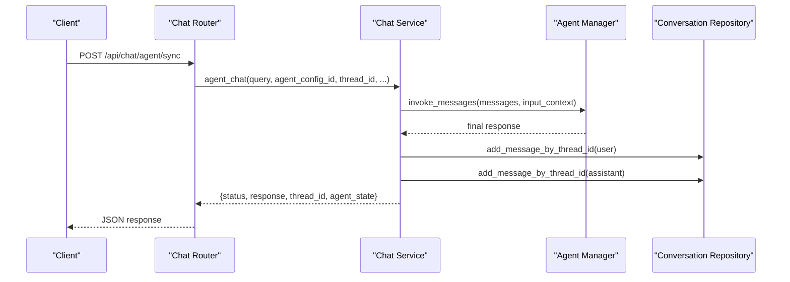

**Diagram sources**
- [chat_router.py:376-397](file://backend/server/routers/chat_router.py#L376-L397)
- [chat_service.py:464-655](file://backend/package/yuxi/services/chat_service.py#L464-L655)
- [conversation_repository.py:136-157](file://backend/package/yuxi/repositories/conversation_repository.py#L136-L157)

#### Streaming Chat Workflow
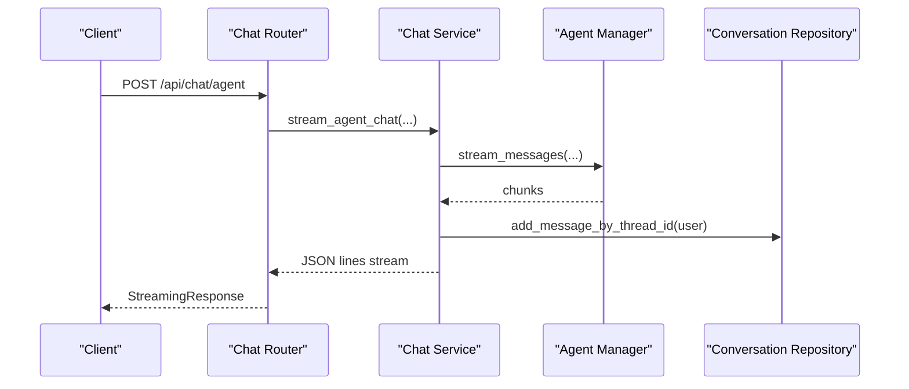

**Diagram sources**
- [chat_router.py:347-397](file://backend/server/routers/chat_router.py#L347-L397)
- [chat_service.py:657-800](file://backend/package/yuxi/services/chat_service.py#L657-L800)
- [conversation_repository.py:136-157](file://backend/package/yuxi/repositories/conversation_repository.py#L136-L157)

#### Attachment Upload Workflow
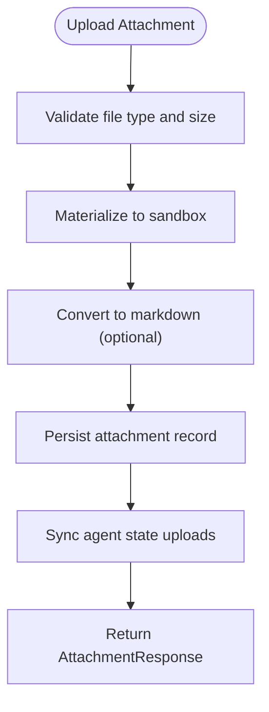

**Diagram sources**
- [conversation_service.py:367-423](file://backend/package/yuxi/services/conversation_service.py#L367-L423)
- [conversation_service.py:166-190](file://backend/package/yuxi/services/conversation_service.py#L166-L190)

### Test References
- Integration tests validate authentication and artifact saving behavior.
- Unit tests validate sync chat behavior and LangGraph state persistence.

**Section sources**
- [test_chat_router.py:15-182](file://backend/test/integration/api/test_chat_router.py#L15-L182)
- [test_chat_service_sync.py:62-217](file://backend/test/unit/services/test_chat_service_sync.py#L62-L217)