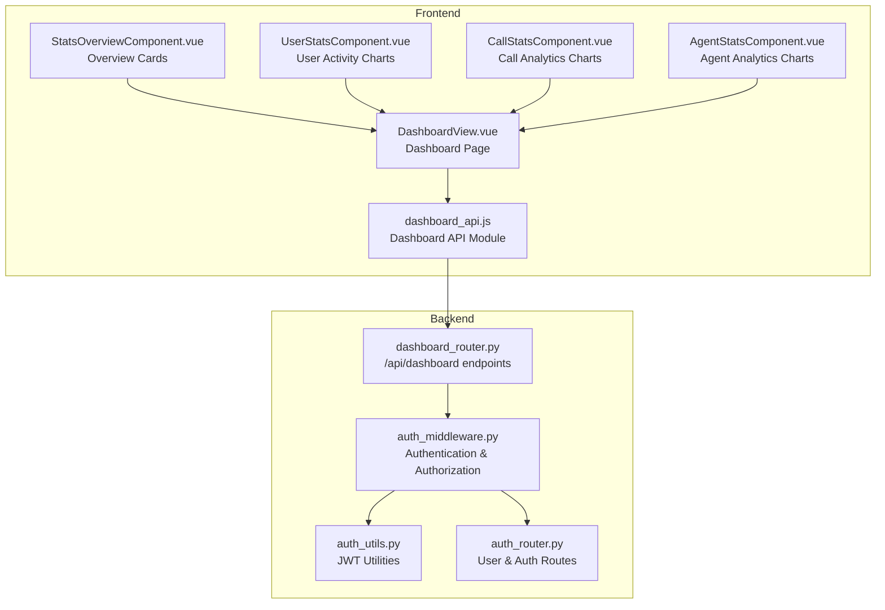
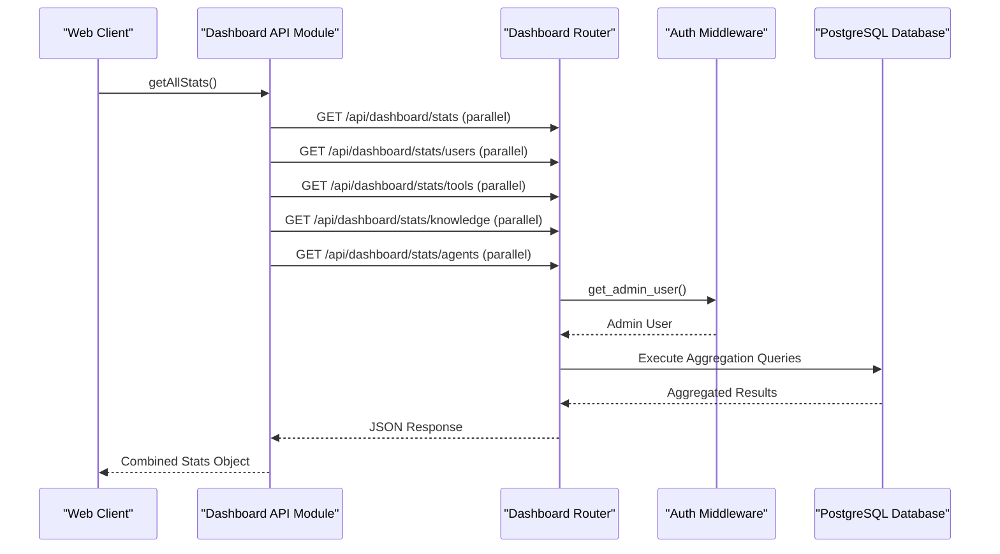
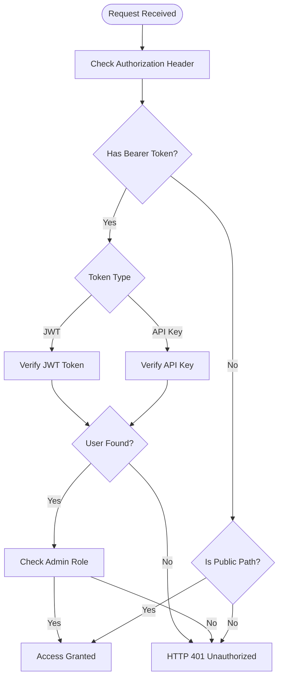
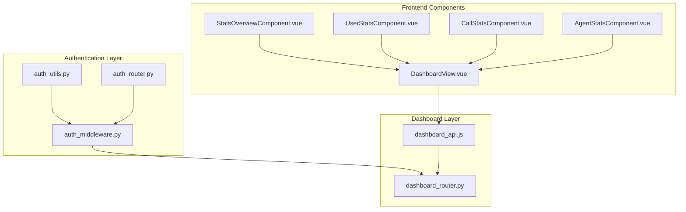

# Dashboard API

<cite>
**Referenced Files in This Document**
- [dashboard_router.py](file://backend/server/routers/dashboard_router.py)
- [dashboard_api.js](file://web/src/apis/dashboard_api.js)
- [auth_middleware.py](file://backend/server/utils/auth_middleware.py)
- [auth_router.py](file://backend/server/routers/auth_router.py)
- [auth_utils.py](file://backend/server/utils/auth_utils.py)
- [DashboardView.vue](file://web/src/views/DashboardView.vue)
- [StatsOverviewComponent.vue](file://web/src/components/dashboard/StatsOverviewComponent.vue)
- [UserStatsComponent.vue](file://web/src/components/dashboard/UserStatsComponent.vue)
- [CallStatsComponent.vue](file://web/src/components/dashboard/CallStatsComponent.vue)
- [AgentStatsComponent.vue](file://web/src/components/dashboard/AgentStatsComponent.vue)
- [test_dashboard_router.py](file://backend/test/integration/api/test_dashboard_router.py)
</cite>

## Table of Contents
1. [Introduction](#introduction)
2. [Project Structure](#project-structure)
3. [Core Components](#core-components)
4. [Architecture Overview](#architecture-overview)
5. [Detailed Component Analysis](#detailed-component-analysis)
6. [Dependency Analysis](#dependency-analysis)
7. [Performance Considerations](#performance-considerations)
8. [Troubleshooting Guide](#troubleshooting-guide)
9. [Conclusion](#conclusion)

## Introduction
This document provides comprehensive API documentation for the dashboard and analytics endpoints. It covers statistics collection, metrics aggregation, reporting endpoints, user activity tracking, system usage analytics, performance monitoring operations, real-time dashboard updates, data visualization endpoints, and export capabilities. It also documents custom metric definitions, dashboard configuration, and alerting mechanisms.

## Project Structure
The dashboard functionality spans both backend FastAPI routes and frontend Vue components:
- Backend: `/api/dashboard` endpoints under `dashboard_router.py`
- Frontend: Dashboard API module and visualization components
- Authentication: JWT and API key authentication under `auth_middleware.py` and `auth_router.py`

**Diagram sources**
- [dashboard_router.py:26-27](file://backend/server/routers/dashboard_router.py#L26-L27)
- [auth_middleware.py:16-169](file://backend/server/utils/auth_middleware.py#L16-L169)
- [auth_utils.py:20-81](file://backend/server/utils/auth_utils.py#L20-L81)
- [auth_router.py:29-21](file://backend/server/routers/auth_router.py#L29-L21)
- [dashboard_api.js:1-133](file://web/src/apis/dashboard_api.js#L1-L133)
- [DashboardView.vue:74-123](file://web/src/views/DashboardView.vue#L74-L123)
- [StatsOverviewComponent.vue:1-313](file://web/src/components/dashboard/StatsOverviewComponent.vue#L1-L313)
- [UserStatsComponent.vue:140-205](file://web/src/components/dashboard/UserStatsComponent.vue#L140-L205)
- [CallStatsComponent.vue:73-167](file://web/src/components/dashboard/CallStatsComponent.vue#L73-L167)
- [AgentStatsComponent.vue:312-383](file://web/src/components/dashboard/AgentStatsComponent.vue#L312-L383)

**Section sources**
- [dashboard_router.py:1-27](file://backend/server/routers/dashboard_router.py#L1-L27)
- [dashboard_api.js:1-133](file://web/src/apis/dashboard_api.js#L1-L133)

## Core Components
- Dashboard Router: Centralized FastAPI router for dashboard analytics and monitoring endpoints
- Dashboard API Module: Frontend client for dashboard endpoints with parallel requests
- Authentication Middleware: JWT and API key authentication with admin/superadmin authorization
- Dashboard Components: Vue components for data visualization and real-time updates

Key responsibilities:
- Statistics collection and aggregation
- Metrics computation and time-series analysis
- User activity tracking and system usage analytics
- Real-time dashboard updates and data visualization
- Export capabilities and custom metric definitions

**Section sources**
- [dashboard_router.py:26-27](file://backend/server/routers/dashboard_router.py#L26-L27)
- [dashboard_api.js:1-133](file://web/src/apis/dashboard_api.js#L1-L133)
- [auth_middleware.py:142-169](file://backend/server/utils/auth_middleware.py#L142-L169)

## Architecture Overview
The dashboard architecture follows a client-server pattern with authentication middleware and data visualization components:

**Diagram sources**
- [dashboard_api.js:100-121](file://web/src/apis/dashboard_api.js#L100-L121)
- [dashboard_router.py:584-633](file://backend/server/routers/dashboard_router.py#L584-L633)
- [auth_middleware.py:142-149](file://backend/server/utils/auth_middleware.py#L142-L149)

## Detailed Component Analysis

### Authentication and Authorization
The dashboard endpoints require administrative privileges:
- Admin users (role: admin/superadmin) can access all dashboard endpoints
- Authentication supports both JWT tokens and API keys
- Public paths are defined for unauthenticated access (login, health checks)

Authentication flow:

**Diagram sources**
- [auth_middleware.py:74-149](file://backend/server/utils/auth_middleware.py#L74-L149)
- [auth_router.py:115-207](file://backend/server/routers/auth_router.py#L115-L207)

**Section sources**
- [auth_middleware.py:142-169](file://backend/server/utils/auth_middleware.py#L142-L169)
- [auth_router.py:115-207](file://backend/server/routers/auth_router.py#L115-L207)

### Dashboard Endpoints

#### Base Statistics Endpoint
- **Method**: GET
- **URL**: `/api/dashboard/stats`
- **Authentication**: Admin required
- **Response**: Basic system statistics including conversations, messages, users, and feedback metrics

#### User Activity Statistics
- **Method**: GET
- **URL**: `/api/dashboard/stats/users`
- **Authentication**: Admin required
- **Response**: User activity metrics including total users, active users (24h/30d), and daily active users trend

#### Tool Call Statistics
- **Method**: GET
- **URL**: `/api/dashboard/stats/tools`
- **Authentication**: Admin required
- **Response**: Tool usage metrics including total calls, success rates, most used tools, error distribution, and daily trends

#### Knowledge Base Statistics
- **Method**: GET
- **URL**: `/api/dashboard/stats/knowledge`
- **Authentication**: Admin required
- **Response**: Knowledge base metrics including databases, files, nodes, storage usage, and file type distribution

#### Agent Analytics
- **Method**: GET
- **URL**: `/api/dashboard/stats/agents`
- **Authentication**: Admin required
- **Response**: Agent performance metrics including conversation counts, satisfaction rates, tool usage, and top performing agents

#### Call Time Series Statistics
- **Method**: GET
- **URL**: `/api/dashboard/stats/calls/timeseries`
- **Query Parameters**:
  - `type`: models/agents/tokens/tools (default: models)
  - `time_range`: 14hours/14days/14weeks (default: 14days)
- **Authentication**: Admin required
- **Response**: Time series data with categories, totals, averages, and peak values

#### Conversation Management
- **Method**: GET
- **URL**: `/api/dashboard/conversations`
- **Query Parameters**:
  - `user_id`: Filter by user
  - `agent_id`: Filter by agent
  - `status`: active/deleted/all (default: active)
  - `limit`: Results limit (default: 100)
  - `offset`: Pagination offset (default: 0)
- **Authentication**: Admin required
- **Response**: List of conversation summaries

- **Method**: GET
- **URL**: `/api/dashboard/conversations/{thread_id}`
- **Authentication**: Admin required
- **Response**: Complete conversation details including messages and metadata

#### Feedback Management
- **Method**: GET
- **URL**: `/api/dashboard/feedbacks`
- **Query Parameters**:
  - `rating`: like/dislike/all (default: all)
  - `agent_id`: Filter by agent
- **Authentication**: Admin required
- **Response**: List of feedback records with user information and ratings

**Section sources**
- [dashboard_router.py:128-242](file://backend/server/routers/dashboard_router.py#L128-L242)
- [dashboard_router.py:249-316](file://backend/server/routers/dashboard_router.py#L249-L316)
- [dashboard_router.py:323-391](file://backend/server/routers/dashboard_router.py#L323-L391)
- [dashboard_router.py:398-480](file://backend/server/routers/dashboard_router.py#L398-L480)
- [dashboard_router.py:487-577](file://backend/server/routers/dashboard_router.py#L487-L577)
- [dashboard_router.py:733-982](file://backend/server/routers/dashboard_router.py#L733-L982)

### Frontend Dashboard Integration

#### Dashboard API Module
The frontend provides a comprehensive API module with:
- Individual stat endpoints for each dashboard component
- Parallel batch loading for optimal performance
- Time series data fetching with configurable parameters
- Conversation and feedback management

#### Real-time Updates and Data Visualization
Dashboard components implement:
- Responsive chart rendering with ECharts
- Automatic chart updates on data changes
- Theme-aware styling and responsive design
- Error handling and retry mechanisms

#### Dashboard View Integration
The main dashboard page coordinates:
- Parallel API calls for all statistics
- Component lifecycle management
- Error handling and user feedback
- Real-time data refresh capabilities

**Section sources**
- [dashboard_api.js:1-133](file://web/src/apis/dashboard_api.js#L1-L133)
- [DashboardView.vue:74-123](file://web/src/views/DashboardView.vue#L74-L123)
- [StatsOverviewComponent.vue:1-313](file://web/src/components/dashboard/StatsOverviewComponent.vue#L1-L313)
- [UserStatsComponent.vue:140-205](file://web/src/components/dashboard/UserStatsComponent.vue#L140-L205)
- [CallStatsComponent.vue:73-167](file://web/src/components/dashboard/CallStatsComponent.vue#L73-L167)
- [AgentStatsComponent.vue:312-383](file://web/src/components/dashboard/AgentStatsComponent.vue#L312-L383)

### Data Models and Schemas

#### UserActivityStats
- total_users: integer
- active_users_24h: integer
- active_users_30d: integer
- daily_active_users: array of objects with date and active_users

#### ToolCallStats
- total_calls: integer
- successful_calls: integer
- failed_calls: integer
- success_rate: number
- most_used_tools: array of tool usage objects
- tool_error_distribution: object mapping tool to error count
- daily_tool_calls: array of daily call counts

#### KnowledgeStats
- total_databases: integer
- total_files: integer
- total_nodes: integer
- total_storage_size: integer (bytes)
- databases_by_type: object mapping type to count
- file_type_distribution: object mapping file type to count

#### AgentAnalytics
- total_agents: integer
- agent_conversation_counts: array of agent conversation counts
- agent_satisfaction_rates: array of satisfaction metrics
- agent_tool_usage: array of tool usage counts
- top_performing_agents: array of top agents by conversation count

#### TimeSeriesStats
- data: array of time series objects
- categories: array of category names
- total_count: integer
- average_count: number
- peak_count: integer
- peak_date: string

**Section sources**
- [dashboard_router.py:53-121](file://backend/server/routers/dashboard_router.py#L53-L121)
- [dashboard_router.py:722-731](file://backend/server/routers/dashboard_router.py#L722-L731)

## Dependency Analysis
The dashboard system exhibits clear separation of concerns with well-defined dependencies:

**Diagram sources**
- [auth_middleware.py:1-169](file://backend/server/utils/auth_middleware.py#L1-L169)
- [auth_utils.py:1-81](file://backend/server/utils/auth_utils.py#L1-L81)
- [auth_router.py:1-829](file://backend/server/routers/auth_router.py#L1-L829)
- [dashboard_router.py:1-982](file://backend/server/routers/dashboard_router.py#L1-L982)
- [dashboard_api.js:1-133](file://web/src/apis/dashboard_api.js#L1-L133)

**Section sources**
- [auth_middleware.py:1-169](file://backend/server/utils/auth_middleware.py#L1-L169)
- [dashboard_router.py:1-982](file://backend/server/routers/dashboard_router.py#L1-L982)

## Performance Considerations
- Parallel API requests: The frontend uses Promise.all for concurrent dashboard data loading
- Time series optimization: Database queries use efficient grouping and aggregation
- Caching opportunities: Consider implementing Redis caching for frequently accessed statistics
- Pagination: Conversation endpoints support pagination for large datasets
- Query optimization: PostgreSQL-specific optimizations for time-based aggregations
- Frontend rendering: Efficient chart updates with ECharts and responsive design

## Troubleshooting Guide
Common issues and solutions:

### Authentication Issues
- **401 Unauthorized**: Verify JWT token or API key validity and expiration
- **403 Forbidden**: Ensure user has admin or superadmin role
- **Invalid Credentials**: Check token format (Bearer prefix) and authentication method

### Data Access Issues
- **Empty Results**: Verify database connectivity and table existence
- **Permission Denied**: Confirm user belongs to correct department
- **Query Failures**: Check PostgreSQL version compatibility and timezone settings

### Frontend Integration Issues
- **Chart Rendering**: Ensure container dimensions are available before rendering
- **Parallel Requests**: Handle individual endpoint failures gracefully
- **Theme Changes**: Charts should re-render on theme updates

**Section sources**
- [auth_middleware.py:74-169](file://backend/server/utils/auth_middleware.py#L74-L169)
- [dashboard_router.py:174-178](file://backend/server/routers/dashboard_router.py#L174-L178)
- [test_dashboard_router.py:12-37](file://backend/test/integration/api/test_dashboard_router.py#L12-L37)

## Conclusion
The dashboard API provides comprehensive analytics and monitoring capabilities with robust authentication, efficient data aggregation, and rich visualization components. The system supports real-time updates, customizable metrics, and scalable performance through parallel processing and optimized database queries. The modular architecture enables easy extension and maintenance while providing a solid foundation for system monitoring and analytics workflows.