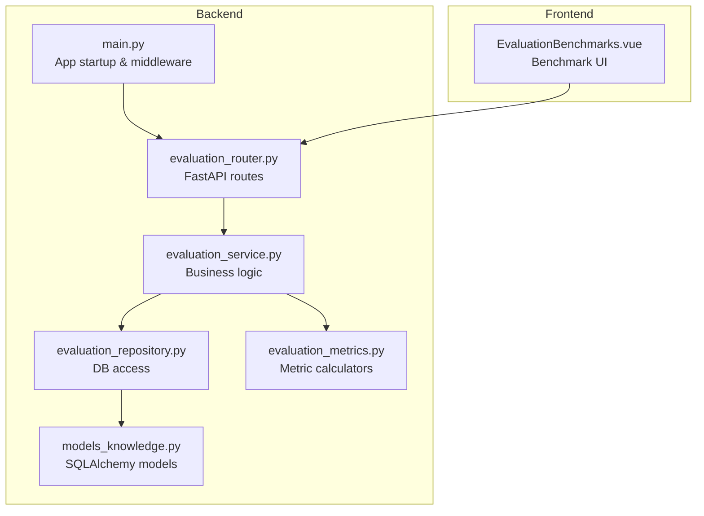
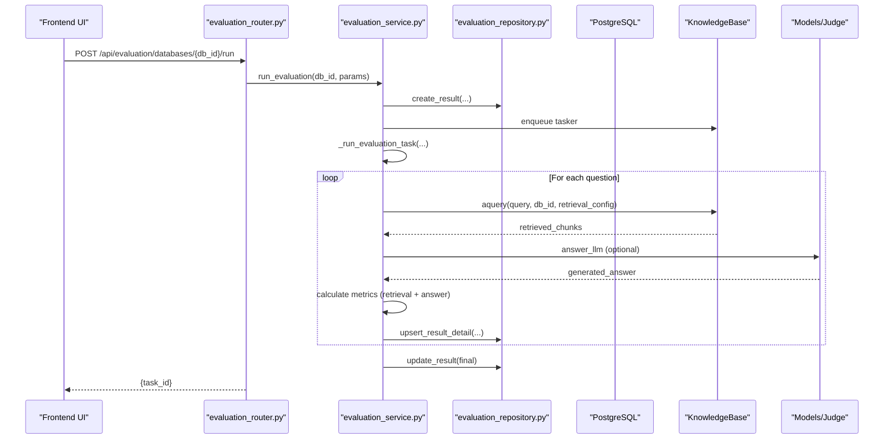
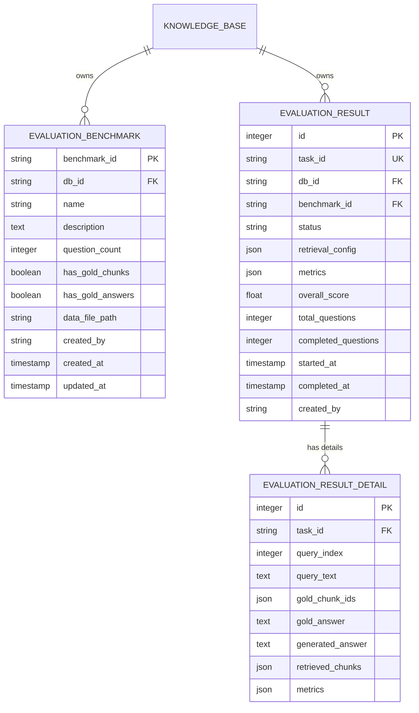
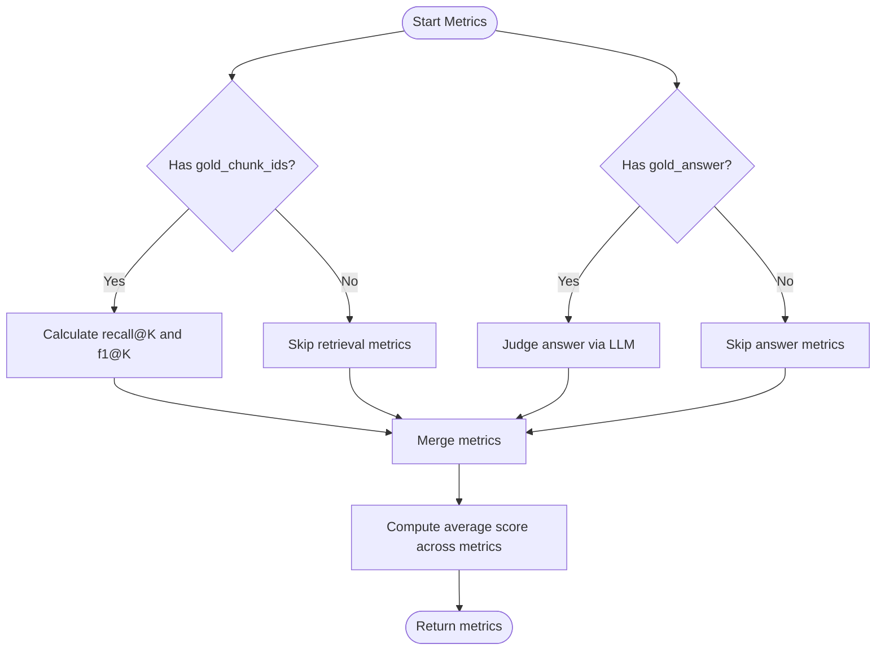
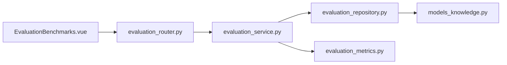

# Evaluation API

<cite>
**Referenced Files in This Document**
- [evaluation_router.py](file://backend/server/routers/evaluation_router.py)
- [evaluation_service.py](file://backend/package/yuxi/services/evaluation_service.py)
- [evaluation_repository.py](file://backend/package/yuxi/repositories/evaluation_repository.py)
- [evaluation_metrics.py](file://backend/package/yuxi/utils/evaluation_metrics.py)
- [models_knowledge.py](file://backend/package/yuxi/storage/postgres/models_knowledge.py)
- [main.py](file://backend/server/main.py)
- [test_evaluation_router.py](file://backend/test/integration/api/test_evaluation_router.py)
- [evaluation.md](file://docs/intro/evaluation.md)
- [EvaluationBenchmarks.vue](file://web/src/components/EvaluationBenchmarks.vue)
</cite>

## Table of Contents
1. [Introduction](#introduction)
2. [Project Structure](#project-structure)
3. [Core Components](#core-components)
4. [Architecture Overview](#architecture-overview)
5. [Detailed Component Analysis](#detailed-component-analysis)
6. [Dependency Analysis](#dependency-analysis)
7. [Performance Considerations](#performance-considerations)
8. [Troubleshooting Guide](#troubleshooting-guide)
9. [Conclusion](#conclusion)
10. [Appendices](#appendices)

## Introduction
This document provides comprehensive API documentation for evaluation and benchmarking endpoints. It covers:
- Creation and management of evaluation benchmarks
- Execution of evaluation tasks against knowledge bases
- Retrieval and filtering of evaluation results
- Benchmark generation and upload workflows
- Metric calculation and overall scoring
- Authentication and authorization requirements
- Error handling and troubleshooting
- Frontend integration points and usage patterns

The evaluation system supports:
- Upload or auto-generate evaluation datasets (JSONL)
- Run RAG evaluations with configurable retrieval and generation models
- Real-time progress and interim metrics during evaluation
- Downloadable benchmark datasets
- Pagination and filtering of results

## Project Structure
The evaluation feature spans backend routers, services, repositories, and models, plus frontend components for benchmark management.

**Diagram sources**
- [evaluation_router.py:1-227](file://backend/server/routers/evaluation_router.py#L1-L227)
- [evaluation_service.py:1-853](file://backend/package/yuxi/services/evaluation_service.py#L1-L853)
- [evaluation_repository.py:1-119](file://backend/package/yuxi/repositories/evaluation_repository.py#L1-L119)
- [models_knowledge.py:1-139](file://backend/package/yuxi/storage/postgres/models_knowledge.py#L1-L139)
- [evaluation_metrics.py:1-153](file://backend/package/yuxi/utils/evaluation_metrics.py#L1-L153)
- [main.py:1-150](file://backend/server/main.py#L1-L150)
- [EvaluationBenchmarks.vue:1-825](file://web/src/components/EvaluationBenchmarks.vue#L1-L825)

**Section sources**
- [evaluation_router.py:1-227](file://backend/server/routers/evaluation_router.py#L1-L227)
- [evaluation_service.py:1-853](file://backend/package/yuxi/services/evaluation_service.py#L1-L853)
- [evaluation_repository.py:1-119](file://backend/package/yuxi/repositories/evaluation_repository.py#L1-L119)
- [models_knowledge.py:1-139](file://backend/package/yuxi/storage/postgres/models_knowledge.py#L1-L139)
- [evaluation_metrics.py:1-153](file://backend/package/yuxi/utils/evaluation_metrics.py#L1-L153)
- [main.py:1-150](file://backend/server/main.py#L1-L150)
- [EvaluationBenchmarks.vue:1-825](file://web/src/components/EvaluationBenchmarks.vue#L1-L825)

## Core Components
- Router: Defines evaluation endpoints under /api/evaluation with admin-required access for sensitive operations.
- Service: Implements benchmark lifecycle (upload, generate, list, detail, delete), evaluation execution (enqueue task, run), and result retrieval (list, paginated, error-only filter).
- Repository: Provides CRUD operations for benchmarks, results, and result details backed by PostgreSQL.
- Metrics: Calculates retrieval metrics (Recall@K, F1@K) and answer correctness via LLM judge.
- Models: SQLAlchemy ORM models for EvaluationBenchmark, EvaluationResult, and EvaluationResultDetail.

Key responsibilities:
- Endpoint handlers validate inputs, enforce pagination limits, and delegate to service methods.
- Service orchestrates knowledge base access, embedding/model selection, and task scheduling.
- Repository persists structured data and supports efficient queries for lists and details.
- Metrics calculator computes standardized retrieval and answer quality indicators.

**Section sources**
- [evaluation_router.py:19-227](file://backend/server/routers/evaluation_router.py#L19-L227)
- [evaluation_service.py:18-853](file://backend/package/yuxi/services/evaluation_service.py#L18-L853)
- [evaluation_repository.py:11-119](file://backend/package/yuxi/repositories/evaluation_repository.py#L11-L119)
- [evaluation_metrics.py:95-153](file://backend/package/yuxi/utils/evaluation_metrics.py#L95-L153)
- [models_knowledge.py:74-139](file://backend/package/yuxi/storage/postgres/models_knowledge.py#L74-L139)

## Architecture Overview
The evaluation pipeline integrates frontend UI, backend routes, service orchestration, task queue, and persistence.

**Diagram sources**
- [evaluation_router.py:196-213](file://backend/server/routers/evaluation_router.py#L196-L213)
- [evaluation_service.py:461-750](file://backend/package/yuxi/services/evaluation_service.py#L461-L750)
- [evaluation_repository.py:49-112](file://backend/package/yuxi/repositories/evaluation_repository.py#L49-L112)
- [models_knowledge.py:94-139](file://backend/package/yuxi/storage/postgres/models_knowledge.py#L94-L139)

## Detailed Component Analysis

### Authentication and Authorization
- Admin-only endpoints:
  - GET /api/evaluation/benchmarks/{benchmark_id}/download
  - DELETE /api/evaluation/benchmarks/{benchmark_id}
  - GET /api/evaluation/databases/{db_id}/results/{task_id}
  - DELETE /api/evaluation/databases/{db_id}/results/{task_id}
- These endpoints depend on a user role check that restricts access to administrators.

Operational notes:
- Authentication middleware is configured globally; admin checks are enforced per route.
- Non-admin requests to admin-only endpoints receive 403 Forbidden.

**Section sources**
- [evaluation_router.py:57-77](file://backend/server/routers/evaluation_router.py#L57-L77)
- [evaluation_router.py:43-54](file://backend/server/routers/evaluation_router.py#L43-L54)
- [evaluation_router.py:80-120](file://backend/server/routers/evaluation_router.py#L80-L120)
- [main.py:99-137](file://backend/server/main.py#L99-L137)

### Benchmark Management Endpoints

#### Upload Benchmark
- Method: POST
- URL: /api/evaluation/databases/{db_id}/benchmarks/upload
- Auth: Admin required
- Request:
  - Form fields:
    - name (string, required)
    - description (string, optional)
  - File:
    - file (multipart/form-data, required, .jsonl)
- Response:
  - message: success
  - data: benchmark metadata (benchmark_id, name, description, db_id, question_count, has_gold_chunks, has_gold_answers, benchmark_file, created_by, created_at, updated_at)

Validation:
- Rejects non-JSONL files
- Parses JSONL lines, validates presence of query field
- Records presence of gold_chunk_ids and gold_answer

**Section sources**
- [evaluation_router.py:128-163](file://backend/server/routers/evaluation_router.py#L128-L163)
- [evaluation_service.py:45-114](file://backend/package/yuxi/services/evaluation_service.py#L45-L114)

#### List Benchmarks
- Method: GET
- URL: /api/evaluation/databases/{db_id}/benchmarks
- Auth: Admin required
- Response:
  - message: success
  - data: array of benchmark objects (id, benchmark_id, name, description, db_id, question_count, has_gold_chunks, has_gold_answers, benchmark_file, created_by, created_at, updated_at)

**Section sources**
- [evaluation_router.py:166-177](file://backend/server/routers/evaluation_router.py#L166-L177)
- [evaluation_service.py:115-139](file://backend/package/yuxi/services/evaluation_service.py#L115-L139)

#### Get Benchmark Detail (Paginated)
- Method: GET
- URL: /api/evaluation/databases/{db_id}/benchmarks/{benchmark_id}?page=&page_size=
- Auth: Admin required
- Query params:
  - page (integer, default 1, min 1)
  - page_size (integer, default 10, min 1, max 100)
- Response:
  - message: success
  - data: benchmark metadata + questions (paginated) + pagination info (current_page, page_size, total_questions, total_pages, has_next, has_prev)

**Section sources**
- [evaluation_router.py:19-41](file://backend/server/routers/evaluation_router.py#L19-L41)
- [evaluation_service.py:173-233](file://backend/package/yuxi/services/evaluation_service.py#L173-L233)

#### Download Benchmark
- Method: GET
- URL: /api/evaluation/benchmarks/{benchmark_id}/download
- Auth: Admin required
- Response: FileResponse (application/x-ndjson)
- Errors:
  - 404 if benchmark not found
  - 500 on internal errors

**Section sources**
- [evaluation_router.py:57-77](file://backend/server/routers/evaluation_router.py#L57-L77)
- [evaluation_service.py:235-256](file://backend/package/yuxi/services/evaluation_service.py#L235-L256)

#### Delete Benchmark
- Method: DELETE
- URL: /api/evaluation/benchmarks/{benchmark_id}
- Auth: Admin required
- Response:
  - message: success
  - data: null

**Section sources**
- [evaluation_router.py:43-54](file://backend/server/routers/evaluation_router.py#L43-L54)
- [evaluation_service.py:258-272](file://backend/package/yuxi/services/evaluation_service.py#L258-L272)

### Evaluation Execution Endpoints

#### Generate Benchmark
- Method: POST
- URL: /api/evaluation/databases/{db_id}/benchmarks/generate
- Auth: Admin required
- Request body: params (object)
  - Example fields: name, description, count, neighbors_count, embedding_model_id, llm_model_spec
- Response:
  - message: success
  - data: {task_id, message}

Notes:
- Enqueues a background task to generate benchmarks using knowledge base content and models.

**Section sources**
- [evaluation_router.py:180-193](file://backend/server/routers/evaluation_router.py#L180-L193)
- [evaluation_service.py:280-288](file://backend/package/yuxi/services/evaluation_service.py#L280-L288)
- [evaluation_service.py:290-460](file://backend/package/yuxi/services/evaluation_service.py#L290-L460)

#### Run Evaluation
- Method: POST
- URL: /api/evaluation/databases/{db_id}/run
- Auth: Admin required
- Request body: params (object)
  - benchmark_id (string, required)
  - model_config (object, optional): merges with knowledge base retrieval options
- Response:
  - message: success
  - data: {task_id}

Behavior:
- Validates benchmark ownership by db_id
- Loads retrieval_config from knowledge base query_params and merges with model_config
- Creates result record with status "running"
- Enqueues background task to process questions and compute metrics

**Section sources**
- [evaluation_router.py:196-213](file://backend/server/routers/evaluation_router.py#L196-L213)
- [evaluation_service.py:461-521](file://backend/package/yuxi/services/evaluation_service.py#L461-L521)

#### Get Evaluation History
- Method: GET
- URL: /api/evaluation/databases/{db_id}/history
- Auth: Admin required
- Response:
  - message: success
  - data: array of evaluation records (task_id, benchmark_id, status, started_at, completed_at, total_questions, completed_questions, overall_score, retrieval_config, metrics)

**Section sources**
- [evaluation_router.py:215-226](file://backend/server/routers/evaluation_router.py#L215-L226)
- [evaluation_service.py:758-780](file://backend/package/yuxi/services/evaluation_service.py#L758-L780)

### Results Retrieval Endpoints

#### Get Evaluation Results (Paginated, Filtered)
- Method: GET
- URL: /api/evaluation/databases/{db_id}/results/{task_id}?page=&page_size=&error_only=
- Auth: Admin required
- Query params:
  - page (integer, default 1, min 1)
  - page_size (integer, default 20, min 1, max 100)
  - error_only (boolean, default false)
- Response:
  - message: success
  - data: evaluation summary + interim_results (paginated) + pagination info
  - Interim results include query_text, gold_chunk_ids, gold_answer, generated_answer, retrieved_chunks, metrics

Filtering:
- error_only filters items with low answer score or low recall thresholds

**Section sources**
- [evaluation_router.py:80-106](file://backend/server/routers/evaluation_router.py#L80-L106)
- [evaluation_service.py:783-842](file://backend/package/yuxi/services/evaluation_service.py#L783-L842)

#### Delete Evaluation Result
- Method: DELETE
- URL: /api/evaluation/databases/{db_id}/results/{task_id}
- Auth: Admin required
- Response:
  - message: success
  - data: null

**Section sources**
- [evaluation_router.py:109-120](file://backend/server/routers/evaluation_router.py#L109-L120)
- [evaluation_service.py:844-852](file://backend/package/yuxi/services/evaluation_service.py#L844-L852)

### Data Models and Persistence
The evaluation domain uses three SQLAlchemy models:

**Diagram sources**
- [models_knowledge.py:74-139](file://backend/package/yuxi/storage/postgres/models_knowledge.py#L74-L139)

**Section sources**
- [models_knowledge.py:74-139](file://backend/package/yuxi/storage/postgres/models_knowledge.py#L74-L139)
- [evaluation_repository.py:11-119](file://backend/package/yuxi/repositories/evaluation_repository.py#L11-L119)

### Metric Calculation and Scoring
Retrieval metrics:
- Precision@K, Recall@K, F1@K computed for K values [1, 3, 5, 10]
- Uses chunk IDs from retrieved_chunks vs gold_chunk_ids

Answer metrics:
- Uses LLM judge to compare generated_answer vs gold_answer
- Returns score and reasoning

Overall score:
- Average of all retrieval metric values and answer scores

**Diagram sources**
- [evaluation_metrics.py:95-153](file://backend/package/yuxi/utils/evaluation_metrics.py#L95-L153)
- [evaluation_service.py:644-728](file://backend/package/yuxi/services/evaluation_service.py#L644-L728)

**Section sources**
- [evaluation_metrics.py:13-153](file://backend/package/yuxi/utils/evaluation_metrics.py#L13-L153)
- [evaluation_service.py:644-728](file://backend/package/yuxi/services/evaluation_service.py#L644-L728)

### Frontend Integration
The frontend component EvaluationBenchmarks.vue interacts with the evaluation API:
- Lists benchmarks and previews questions with pagination
- Uploads and generates benchmarks
- Downloads and deletes benchmarks
- Triggers evaluation runs and refreshes task lists

Key interactions:
- Load benchmarks: GET /api/evaluation/databases/{db_id}/benchmarks
- Preview benchmark: GET /api/evaluation/databases/{db_id}/benchmarks/{benchmark_id}?page=&page_size=
- Download benchmark: GET /api/evaluation/benchmarks/{benchmark_id}/download
- Delete benchmark: DELETE /api/evaluation/benchmarks/{benchmark_id}
- Run evaluation: POST /api/evaluation/databases/{db_id}/run

**Section sources**
- [EvaluationBenchmarks.vue:295-416](file://web/src/components/EvaluationBenchmarks.vue#L295-L416)
- [EvaluationBenchmarks.vue:438-470](file://web/src/components/EvaluationBenchmarks.vue#L438-L470)

## Dependency Analysis
High-level dependencies:
- Router depends on Service
- Service depends on Repository and Metrics
- Repository depends on SQLAlchemy models and PostgreSQL
- Frontend depends on Router endpoints

**Diagram sources**
- [evaluation_router.py:1-227](file://backend/server/routers/evaluation_router.py#L1-L227)
- [evaluation_service.py:1-853](file://backend/package/yuxi/services/evaluation_service.py#L1-L853)
- [evaluation_repository.py:1-119](file://backend/package/yuxi/repositories/evaluation_repository.py#L1-L119)
- [models_knowledge.py:1-139](file://backend/package/yuxi/storage/postgres/models_knowledge.py#L1-L139)
- [EvaluationBenchmarks.vue:1-825](file://web/src/components/EvaluationBenchmarks.vue#L1-L825)

**Section sources**
- [evaluation_router.py:1-227](file://backend/server/routers/evaluation_router.py#L1-L227)
- [evaluation_service.py:1-853](file://backend/package/yuxi/services/evaluation_service.py#L1-L853)
- [evaluation_repository.py:1-119](file://backend/package/yuxi/repositories/evaluation_repository.py#L1-L119)
- [models_knowledge.py:1-139](file://backend/package/yuxi/storage/postgres/models_knowledge.py#L1-L139)
- [EvaluationBenchmarks.vue:1-825](file://web/src/components/EvaluationBenchmarks.vue#L1-L825)

## Performance Considerations
- Embedding computation cost: Auto-generated benchmarks recompute embeddings for all chunks; consider caching or reusing existing vector DB embeddings for large knowledge bases.
- LLM calls: Answer generation and judge scoring are expensive; batch judgements and cache results when feasible.
- Pagination: Use page_size limits to control memory and network usage for large result sets.
- Background tasks: Evaluation runs asynchronously; monitor task progress and resource utilization.

[No sources needed since this section provides general guidance]

## Troubleshooting Guide
Common issues and resolutions:
- 400 Bad Request:
  - Invalid page/page_size values
  - Unsupported file format on upload
- 403 Forbidden:
  - Non-admin user attempting admin-only operation
- 404 Not Found:
  - Benchmark not found during download
- 500 Internal Server Error:
  - Exceptions raised during processing are logged and surfaced as 500

Validation and error handling:
- Router validates pagination bounds and file types
- Service raises descriptive errors for missing records or unsupported KB types
- Repository updates result records atomically

**Section sources**
- [evaluation_router.py:27-40](file://backend/server/routers/evaluation_router.py#L27-L40)
- [evaluation_router.py:139-163](file://backend/server/routers/evaluation_router.py#L139-L163)
- [evaluation_router.py:70-77](file://backend/server/routers/evaluation_router.py#L70-L77)
- [evaluation_service.py:312-343](file://backend/package/yuxi/services/evaluation_service.py#L312-L343)
- [evaluation_service.py:738-750](file://backend/package/yuxi/services/evaluation_service.py#L738-L750)

## Conclusion
The evaluation API provides a robust framework for managing benchmarks, executing RAG evaluations, and retrieving results with standardized metrics. Admin-only endpoints protect sensitive operations, while background tasks enable scalable processing. The frontend component integrates seamlessly with these endpoints to support end-to-end evaluation workflows.

[No sources needed since this section summarizes without analyzing specific files]

## Appendices

### Endpoint Reference Summary

- Upload Benchmark
  - Method: POST
  - URL: /api/evaluation/databases/{db_id}/benchmarks/upload
  - Auth: Admin
  - Request: multipart/form-data (file), form fields (name, description)
  - Response: {message, data: benchmark metadata}

- List Benchmarks
  - Method: GET
  - URL: /api/evaluation/databases/{db_id}/benchmarks
  - Auth: Admin
  - Response: {message, data: array of benchmarks}

- Get Benchmark Detail (Paginated)
  - Method: GET
  - URL: /api/evaluation/databases/{db_id}/benchmarks/{benchmark_id}?page=&page_size=
  - Auth: Admin
  - Response: {message, data: benchmark + questions + pagination}

- Download Benchmark
  - Method: GET
  - URL: /api/evaluation/benchmarks/{benchmark_id}/download
  - Auth: Admin
  - Response: FileResponse (application/x-ndjson)

- Delete Benchmark
  - Method: DELETE
  - URL: /api/evaluation/benchmarks/{benchmark_id}
  - Auth: Admin
  - Response: {message, data: null}

- Generate Benchmark
  - Method: POST
  - URL: /api/evaluation/databases/{db_id}/benchmarks/generate
  - Auth: Admin
  - Request: JSON body (params)
  - Response: {message, data: {task_id, message}}

- Run Evaluation
  - Method: POST
  - URL: /api/evaluation/databases/{db_id}/run
  - Auth: Admin
  - Request: JSON body (params: benchmark_id, model_config)
  - Response: {message, data: {task_id}}

- Get Evaluation History
  - Method: GET
  - URL: /api/evaluation/databases/{db_id}/history
  - Auth: Admin
  - Response: {message, data: array of evaluation records}

- Get Evaluation Results (Paginated, Filtered)
  - Method: GET
  - URL: /api/evaluation/databases/{db_id}/results/{task_id}?page=&page_size=&error_only=
  - Auth: Admin
  - Response: {message, data: summary + interim_results + pagination}

- Delete Evaluation Result
  - Method: DELETE
  - URL: /api/evaluation/databases/{db_id}/results/{task_id}
  - Auth: Admin
  - Response: {message, data: null}

**Section sources**
- [evaluation_router.py:19-227](file://backend/server/routers/evaluation_router.py#L19-L227)

### Example Workflows

- Upload and Evaluate
  - Upload benchmark: POST /api/evaluation/databases/{db_id}/benchmarks/upload
  - Run evaluation: POST /api/evaluation/databases/{db_id}/run with benchmark_id
  - Monitor progress: GET /api/evaluation/databases/{db_id}/results/{task_id}?page=&page_size=&error_only=

- Auto-generate and Evaluate
  - Generate benchmark: POST /api/evaluation/databases/{db_id}/benchmarks/generate
  - Run evaluation: POST /api/evaluation/databases/{db_id}/run
  - Review metrics: GET /api/evaluation/databases/{db_id}/results/{task_id}

- Download and Reuse Benchmark
  - Download: GET /api/evaluation/benchmarks/{benchmark_id}/download
  - Upload: POST /api/evaluation/databases/{db_id}/benchmarks/upload

**Section sources**
- [evaluation_router.py:128-163](file://backend/server/routers/evaluation_router.py#L128-L163)
- [evaluation_router.py:180-193](file://backend/server/routers/evaluation_router.py#L180-L193)
- [evaluation_router.py:196-213](file://backend/server/routers/evaluation_router.py#L196-L213)
- [evaluation_router.py:57-77](file://backend/server/routers/evaluation_router.py#L57-L77)

### Additional Resources
- Evaluation guide and metric interpretation: [evaluation.md:1-81](file://docs/intro/evaluation.md#L1-L81)
- Frontend benchmark management UI: [EvaluationBenchmarks.vue:1-825](file://web/src/components/EvaluationBenchmarks.vue#L1-L825)
- Integration tests for evaluation endpoints: [test_evaluation_router.py:1-62](file://backend/test/integration/api/test_evaluation_router.py#L1-L62)

**Section sources**
- [evaluation.md:1-81](file://docs/intro/evaluation.md#L1-L81)
- [EvaluationBenchmarks.vue:1-825](file://web/src/components/EvaluationBenchmarks.vue#L1-L825)
- [test_evaluation_router.py:1-62](file://backend/test/integration/api/test_evaluation_router.py#L1-L62)