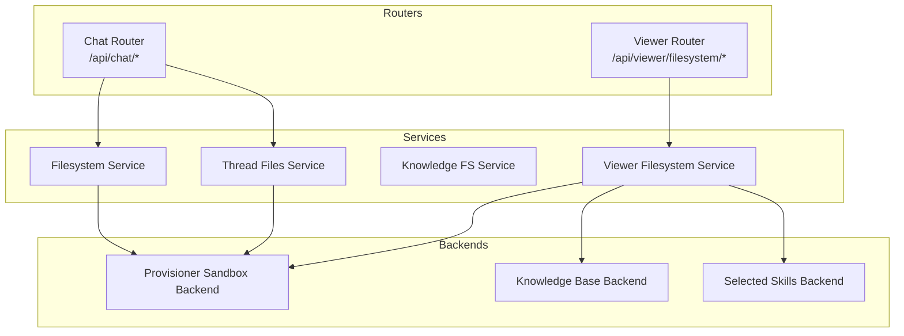
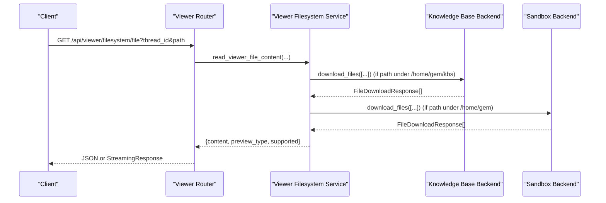
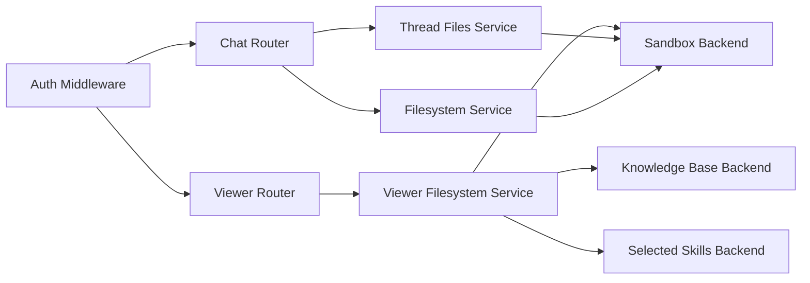

# Filesystem API

<cite>
**Referenced Files in This Document**
- [filesystem_router.py](file://backend/server/routers/filesystem_router.py)
- [viewer_filesystem_router.py](file://backend/server/routers/viewer_filesystem_router.py)
- [chat_router.py](file://backend/server/routers/chat_router.py)
- [auth_middleware.py](file://backend/server/utils/auth_middleware.py)
- [filesystem_service.py](file://backend/package/yuxi/services/filesystem_service.py)
- [viewer_filesystem_service.py](file://backend/package/yuxi/services/viewer_filesystem_service.py)
- [thread_files_service.py](file://backend/package/yuxi/services/thread_files_service.py)
- [knowledge_fs_service.py](file://backend/package/yuxi/services/knowledge_fs_service.py)
- [attachment_middleware.py](file://backend/package/yuxi/agents/middlewares/attachment_middleware.py)
- [provisioner_sandbox_backend.py](file://backend/package/yuxi/agents/backends/sandbox/backend.py)
- [test_viewer_filesystem_router.py](file://backend/test/integration/api/test_viewer_filesystem_router.py)
- [test_viewer_filesystem_security.py](file://backend/test/integration/api/test_viewer_filesystem_security.py)
- [test_attachment_and_agent_state.py](file://backend/test/e2e/test_attachment_and_agent_state.py)
</cite>

## Table of Contents
1. [Introduction](#introduction)
2. [Project Structure](#project-structure)
3. [Core Components](#core-components)
4. [Architecture Overview](#architecture-overview)
5. [Detailed Component Analysis](#detailed-component-analysis)
6. [Dependency Analysis](#dependency-analysis)
7. [Performance Considerations](#performance-considerations)
8. [Troubleshooting Guide](#troubleshooting-guide)
9. [Conclusion](#conclusion)

## Introduction
This document provides comprehensive API documentation for filesystem and file management endpoints. It covers:
- File upload, download, and deletion operations with support for large files and streaming
- Directory listing and file content retrieval
- Virtual filesystem operations, attachment handling, and file preview capabilities
- Access control, permissions, and security boundaries
- Bulk operations, batch processing, and synchronization patterns
- Authentication requirements and error handling

Endpoints documented here serve two primary audiences:
- Viewer UI: read-only filesystem browsing and file previews
- Chat threads: attachment upload and artifact access within a user’s thread sandbox

## Project Structure
The filesystem APIs are implemented across routers, services, and middleware:
- Routers define HTTP endpoints and bind them to service handlers
- Services encapsulate business logic, permission checks, and backend orchestration
- Middleware integrates uploaded attachments into agent prompts
- Backends provide sandboxed file operations and virtual path resolution

**Diagram sources**
- [viewer_filesystem_router.py](file://backend/server/routers/viewer_filesystem_router.py)
- [filesystem_router.py](file://backend/server/routers/filesystem_router.py)
- [chat_router.py](file://backend/server/routers/chat_router.py)
- [viewer_filesystem_service.py](file://backend/package/yuxi/services/viewer_filesystem_service.py)
- [thread_files_service.py](file://backend/package/yuxi/services/thread_files_service.py)
- [knowledge_fs_service.py](file://backend/package/yuxi/services/knowledge_fs_service.py)
- [filesystem_service.py](file://backend/package/yuxi/services/filesystem_service.py)
- [provisioner_sandbox_backend.py](file://backend/package/yuxi/agents/backends/sandbox/backend.py)

**Section sources**
- [viewer_filesystem_router.py](file://backend/server/routers/viewer_filesystem_router.py)
- [filesystem_router.py](file://backend/server/routers/filesystem_router.py)
- [chat_router.py](file://backend/server/routers/chat_router.py)

## Core Components
- Viewer Filesystem Router: Provides read-only endpoints for browsing and previewing files within a thread’s virtual namespace.
- Thread Files Service: Lists, reads, and resolves artifacts within a thread’s sandboxed directories.
- Filesystem Service: Resolves runtime context for agents and composes backends for composite filesystem operations.
- Knowledge FS Service: Builds virtual knowledge base mounts and caches MinIO objects locally.
- Provisioner Sandbox Backend: Implements sandboxed file operations, path normalization, and streaming downloads.
- Attachment Middleware: Injects uploaded file metadata into agent prompts for on-demand reading.

**Section sources**
- [viewer_filesystem_service.py](file://backend/package/yuxi/services/viewer_filesystem_service.py)
- [thread_files_service.py](file://backend/package/yuxi/services/thread_files_service.py)
- [filesystem_service.py](file://backend/package/yuxi/services/filesystem_service.py)
- [knowledge_fs_service.py](file://backend/package/yuxi/services/knowledge_fs_service.py)
- [provisioner_sandbox_backend.py](file://backend/package/yuxi/agents/backends/sandbox/backend.py)
- [attachment_middleware.py](file://backend/package/yuxi/agents/middlewares/attachment_middleware.py)

## Architecture Overview
The filesystem API stack enforces strict separation of concerns:
- Authentication and authorization are enforced at router level via middleware
- Viewer endpoints operate within a virtual namespace rooted at user-data, skills, and knowledge base mounts
- Chat endpoints enable attachment upload and artifact resolution within thread sandboxes
- Downloads leverage streaming responses for large files and binary content

**Diagram sources**
- [viewer_filesystem_router.py](file://backend/server/routers/viewer_filesystem_router.py)
- [viewer_filesystem_service.py](file://backend/package/yuxi/services/viewer_filesystem_service.py)
- [provisioner_sandbox_backend.py](file://backend/package/yuxi/agents/backends/sandbox/backend.py)

## Detailed Component Analysis

### Viewer Filesystem Endpoints
These endpoints provide read-only access to files within the viewer namespace.

- Tree Listing
  - Method: GET
  - URL: /api/viewer/filesystem/tree
  - Query Params:
    - thread_id: string (required)
    - path: string (default "/")
    - agent_id: string (optional)
    - agent_config_id: integer (optional)
  - Authentication: Bearer JWT or API Key
  - Response: { entries: [{ path: string, name: string, is_dir: boolean, size: number, modified_at: string }] }
  - Behavior:
    - Root (“/”) lists virtual namespaces: user-data, skills, kbs
    - Paths under user-data are resolved against thread sandbox directories
    - Paths under skills and kbs are delegated to readonly backends
  - Security:
    - Access denied for paths outside viewer namespace
    - Protected roots under user-data cannot be deleted

- File Content (Text/PDF/Image Preview)
  - Method: GET
  - URL: /api/viewer/filesystem/file
  - Query Params:
    - thread_id: string (required)
    - path: string (required)
    - agent_id: string (optional)
    - agent_config_id: integer (optional)
  - Response: { content: string|null, preview_type: "text"|"markdown"|"pdf"|"image"|"unsupported", supported: boolean, message?: string }
  - Behavior:
    - Detects preview type by extension/mime and content signature
    - Returns raw content for text/markdown; otherwise metadata indicating unsupported or preview-ready
  - Errors:
    - 404: file not found
    - 400: path is directory, unsupported format, or access denied

- Download File
  - Method: GET
  - URL: /api/viewer/filesystem/download
  - Query Params:
    - thread_id: string (required)
    - path: string (required)
    - agent_id: string (optional)
    - agent_config_id: integer (optional)
  - Response: StreamingResponse (file/octet-stream) with Content-Disposition header
  - Behavior:
    - Streams large files directly from sandbox or knowledge base
    - Returns FileResponse for local user-data files
  - Errors:
    - 404: file not found
    - 400: path is directory or invalid
    - 403: access denied

- Delete File/Directory
  - Method: DELETE
  - URL: /api/viewer/filesystem/file
  - Query Params:
    - thread_id: string (required)
    - path: string (required)
    - agent_id: string (optional)
    - agent_config_id: integer (optional)
  - Response: { success: true, path: string }
  - Behavior:
    - Only user-data paths are deletable
    - Protected roots (workspace, uploads, outputs) are blocked
    - Recursive deletion for directories
  - Errors:
    - 400: path not deletable or protected
    - 404: not found

Security and Access Control
- Authentication: Requires logged-in user; supports JWT Bearer or API Key
- Authorization: Enforces namespace boundaries; prevents escape from thread sandbox
- Path validation: Normalizes and rejects path traversal; restricts protected roots

Streaming and Large Files
- Downloads use StreamingResponse/FileResponse to avoid memory pressure
- Text content is decoded with UTF-8 and fallback handling for invalid sequences

**Section sources**
- [viewer_filesystem_router.py](file://backend/server/routers/viewer_filesystem_router.py)
- [viewer_filesystem_service.py](file://backend/package/yuxi/services/viewer_filesystem_service.py)
- [auth_middleware.py](file://backend/server/utils/auth_middleware.py)

### Chat Thread File Management Endpoints
These endpoints manage attachments and artifacts within a chat thread.

- Upload Attachment
  - Method: POST
  - URL: /api/chat/thread/{thread_id}/attachments
  - Form Fields:
    - file: file (required)
  - Response: { file_id: string, file_name: string, file_type: string, file_size: integer, status: string, uploaded_at: string, path: string, artifact_url: string|null, original_path: string|null, original_artifact_url: string|null, minio_url: string|null }
  - Behavior:
    - Validates file type and size limits
    - Materializes file into thread sandbox and generates markdown preview when applicable
    - Stores metadata and returns artifact URLs for downstream consumption
  - Errors:
    - 400: invalid filename, oversized file, unsupported type

- List Attachments
  - Method: GET
  - URL: /api/chat/thread/{thread_id}/attachments
  - Response: { attachments: [...], limits: { allowed_extensions: string[], max_size_bytes: integer } }

- Artifact Resolution and Streaming
  - Method: GET
  - URL: /api/chat/thread/{thread_id}/artifacts/{virtual_path}
  - Behavior:
    - Resolves virtual path to actual sandbox location
    - Validates allowed roots (workspace, uploads, outputs)
    - Streams file content or returns 403 if outside allowed scope
  - Errors:
    - 404: artifact not found
    - 400: path is not a file
    - 403: access denied

- Save Artifact to Workspace
  - Method: POST
  - URL: /api/chat/thread/{thread_id}/artifacts/save
  - Request Body: { path: string }
  - Response: { name: string, source_path: string, saved_path: string, saved_artifact_url: string }
  - Behavior:
    - Copies artifact from sandbox to workspace/saved_artifacts with collision handling

- Thread File Listing
  - Method: GET
  - URL: /api/chat/thread/{thread_id}/files
  - Query Params:
    - path: string (optional)
    - recursive: boolean (default false)
  - Response: { path: string, files: [ { path: string, name: string, is_dir: boolean, size: integer, modified_at: string, artifact_url: string|null } ] }

- Read Thread File Content (Text)
  - Method: GET
  - URL: /api/chat/thread/{thread_id}/files/content
  - Query Params:
    - path: string (required)
    - offset: integer (default 0)
    - limit: integer (default 2000, max 5000)
  - Response: { path: string, content: string[], offset: integer, limit: integer, total_lines: integer, artifact_url: string }

Attachment Prompt Injection
- Middleware augments agent prompts with readable paths for uploaded files
- Prevents duplicate injection and markers attachment context in system prompt blocks

**Section sources**
- [chat_router.py](file://backend/server/routers/chat_router.py)
- [thread_files_service.py](file://backend/package/yuxi/services/thread_files_service.py)
- [attachment_middleware.py](file://backend/package/yuxi/agents/middlewares/attachment_middleware.py)

### Knowledge Base Virtual Mounts
- Build Visible Knowledge Mounts
  - Purpose: Construct virtual mounts for accessible knowledge bases
  - Behavior:
    - Normalizes mount names and validates conflicts
    - Lists files per database and serializes metadata
    - Caches MinIO objects locally with ETag/version-aware keys
- Cache MinIO Objects
  - Purpose: Local caching for frequently accessed knowledge base objects
  - Behavior:
    - Computes cache key from bucket/object/etag or last_modified
    - Persists object payload and manifest for reuse

**Section sources**
- [knowledge_fs_service.py](file://backend/package/yuxi/services/knowledge_fs_service.py)

### Sandbox Backend Operations
- Path Normalization
  - Ensures absolute POSIX-style paths; rejects path traversal
- File Operations
  - download_files: streams raw bytes; maps errors to structured responses
  - upload_files: writes base64-encoded content; handles permission/directory/file-not-found
  - read/write/edit: text-only operations with validation and truncation
- Streaming Reads
  - read_file: supports offset/limit for partial text retrieval
- Execution
  - execute: runs shell commands with timeout and output size limits

**Section sources**
- [provisioner_sandbox_backend.py](file://backend/package/yuxi/agents/backends/sandbox/backend.py)

## Dependency Analysis

**Diagram sources**
- [auth_middleware.py](file://backend/server/utils/auth_middleware.py)
- [viewer_filesystem_router.py](file://backend/server/routers/viewer_filesystem_router.py)
- [chat_router.py](file://backend/server/routers/chat_router.py)
- [viewer_filesystem_service.py](file://backend/package/yuxi/services/viewer_filesystem_service.py)
- [thread_files_service.py](file://backend/package/yuxi/services/thread_files_service.py)
- [filesystem_service.py](file://backend/package/yuxi/services/filesystem_service.py)
- [provisioner_sandbox_backend.py](file://backend/package/yuxi/agents/backends/sandbox/backend.py)

**Section sources**
- [auth_middleware.py](file://backend/server/utils/auth_middleware.py)
- [viewer_filesystem_service.py](file://backend/package/yuxi/services/viewer_filesystem_service.py)
- [thread_files_service.py](file://backend/package/yuxi/services/thread_files_service.py)
- [filesystem_service.py](file://backend/package/yuxi/services/filesystem_service.py)

## Performance Considerations
- Streaming Downloads
  - Prefer StreamingResponse/FileResponse for large files to reduce memory footprint
- Partial Reads
  - Use offset/limit for large text files to avoid loading entire content
- Binary Detection
  - Avoid attempting to decode binary content; return preview metadata instead
- Caching
  - Reuse cached MinIO objects keyed by ETag/last_modified to minimize network I/O
- Concurrency
  - Use asyncio.to_thread for blocking filesystem operations to keep event loop responsive
- Output Limits
  - Truncate long outputs and enforce maximum payload sizes to protect clients

[No sources needed since this section provides general guidance]

## Troubleshooting Guide
Common Issues and Resolutions
- Authentication Failures
  - Ensure Authorization header includes Bearer JWT or API Key
  - Verify token validity and API key status
- Access Denied
  - Paths outside viewer namespace or protected roots are rejected
  - Confirm thread ownership and sandbox initialization
- File Not Found
  - Verify normalized path and existence within allowed roots
- Unsupported Formats
  - Non-text/binary files return preview metadata; use download endpoint for raw content
- Path Traversal
  - Ensure paths are absolute and normalized; avoid “..” segments

Security Validation
- Integration tests confirm:
  - Download blocks symlink escapes from workspace
  - Protected user-data roots cannot be deleted
  - Root tree listing avoids invoking sandbox for namespace discovery

**Section sources**
- [test_viewer_filesystem_security.py](file://backend/test/integration/api/test_viewer_filesystem_security.py)
- [test_viewer_filesystem_router.py](file://backend/test/integration/api/test_viewer_filesystem_router.py)

## Conclusion
The filesystem API provides a secure, scalable foundation for file operations across viewer and chat contexts:
- Viewer endpoints offer read-only navigation and previews within controlled namespaces
- Chat endpoints enable attachment upload, artifact resolution, and safe streaming
- Strong access controls, path normalization, and streaming ensure performance and safety
- Virtual mounts and caching optimize knowledge base access