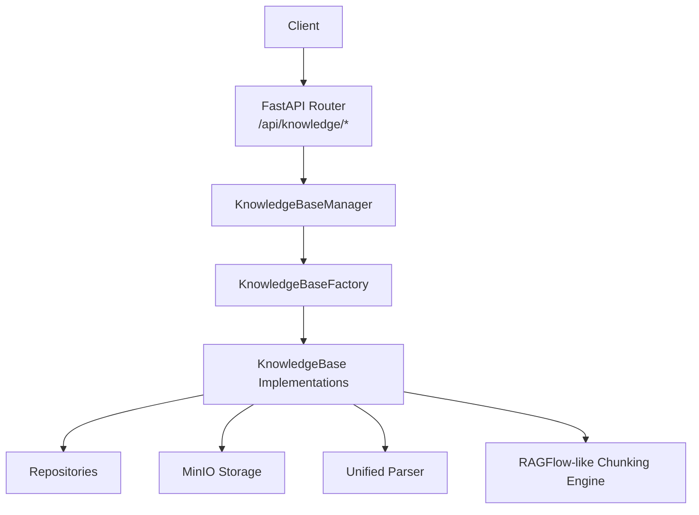
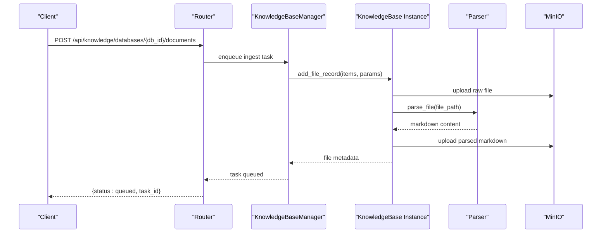
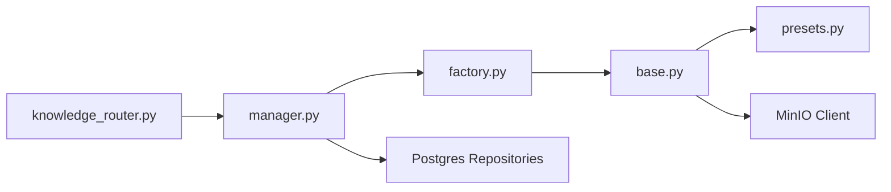

# Knowledge Base API

<cite>
**Referenced Files in This Document**
- [knowledge_router.py](file://backend/server/routers/knowledge_router.py)
- [base.py](file://backend/package/yuxi/knowledge/base.py)
- [manager.py](file://backend/package/yuxi/knowledge/manager.py)
- [presets.py](file://backend/package/yuxi/knowledge/chunking/ragflow_like/presets.py)
- [factory.py](file://backend/package/yuxi/knowledge/factory.py)
- [knowledge_api.js](file://web/src/apis/knowledge_api.js)
- [knowledge_base_backend.py](file://backend/package/yuxi/agents/backends/knowledge_base_backend.py)
</cite>

## Table of Contents
1. [Introduction](#introduction)
2. [Project Structure](#project-structure)
3. [Core Components](#core-components)
4. [Architecture Overview](#architecture-overview)
5. [Detailed Component Analysis](#detailed-component-analysis)
6. [Dependency Analysis](#dependency-analysis)
7. [Performance Considerations](#performance-considerations)
8. [Troubleshooting Guide](#troubleshooting-guide)
9. [Conclusion](#conclusion)

## Introduction
This document provides comprehensive API documentation for the knowledge base management system. It covers document upload, parsing, indexing, and retrieval operations with support for multiple file formats. It also documents knowledge base configuration, chunking parameters, and indexing operations, along with file management endpoints, metadata handling, and batch processing. Search APIs are documented with filtering, ranking, and result formatting options. For each endpoint, we specify HTTP methods, URL patterns, request/response schemas, authentication requirements, and error handling. Finally, we include examples of document processing workflows, search queries, and knowledge base optimization techniques.

## Project Structure
The knowledge base API is implemented as FastAPI routes under the `/api/knowledge` namespace. The router delegates to a knowledge base manager and underlying knowledge base implementations. Chunking and parsing are handled by a RAGFlow-like chunking engine with preset configurations. The frontend integrates with these APIs via a JavaScript client.

**Diagram sources**
- [knowledge_router.py:1-1515](file://backend/server/routers/knowledge_router.py#L1-L1515)
- [manager.py:1-955](file://backend/package/yuxi/knowledge/manager.py#L1-L955)
- [factory.py:1-108](file://backend/package/yuxi/knowledge/factory.py#L1-L108)
- [base.py:1-1257](file://backend/package/yuxi/knowledge/base.py#L1-L1257)

**Section sources**
- [knowledge_router.py:1-1515](file://backend/server/routers/knowledge_router.py#L1-L1515)
- [manager.py:1-955](file://backend/package/yuxi/knowledge/manager.py#L1-L955)

## Core Components
- KnowledgeBaseManager: Central orchestrator for database lifecycle, file operations, and search. It loads metadata per knowledge base type and coordinates persistence.
- KnowledgeBaseFactory: Creates knowledge base instances by type and manages supported types.
- KnowledgeBase Implementations: Abstract interface for different knowledge base backends (e.g., LightRAG, Milvus, Dify). Concrete implementations handle indexing and querying.
- Chunking Engine: Preset-driven chunking with configurable parameters (chunk size, overlap, delimiter, parser config).
- Unified Parser: Converts various file formats to Markdown for indexing.
- MinIO Storage: Stores uploaded files and parsed Markdown artifacts.

**Section sources**
- [manager.py:1-955](file://backend/package/yuxi/knowledge/manager.py#L1-L955)
- [factory.py:1-108](file://backend/package/yuxi/knowledge/factory.py#L1-L108)
- [base.py:1-1257](file://backend/package/yuxi/knowledge/base.py#L1-L1257)
- [presets.py:1-239](file://backend/package/yuxi/knowledge/chunking/ragflow_like/presets.py#L1-L239)

## Architecture Overview
The API follows a layered architecture:
- Router layer handles HTTP requests and authentication.
- Manager layer validates permissions, resolves knowledge base instances, and coordinates tasks.
- Knowledge base implementations encapsulate backend-specific logic (indexing, querying).
- Repositories persist metadata to Postgres.
- MinIO persists raw and parsed content.

**Diagram sources**
- [knowledge_router.py:302-492](file://backend/server/routers/knowledge_router.py#L302-L492)
- [base.py:192-353](file://backend/package/yuxi/knowledge/base.py#L192-L353)
- [manager.py:406-426](file://backend/package/yuxi/knowledge/manager.py#L406-L426)

## Detailed Component Analysis

### Authentication and Authorization
- Admin-only endpoints require an authenticated admin user.
- Access checks filter databases by user role and share configuration.

**Section sources**
- [knowledge_router.py:90-98](file://backend/server/routers/knowledge_router.py#L90-L98)
- [manager.py:203-245](file://backend/package/yuxi/knowledge/manager.py#L203-L245)

### Knowledge Base Management
- Create database: POST /api/knowledge/databases
- Update database: PUT /api/knowledge/databases/{db_id}
- Delete database: DELETE /api/knowledge/databases/{db_id}
- List databases: GET /api/knowledge/databases
- Get database info: GET /api/knowledge/databases/{db_id}
- Export database: GET /api/knowledge/databases/{db_id}/export

Request body fields for creation/update:
- name: string
- description: string
- kb_type: string (default: lightrag)
- embed_model_name: string (required for non-Dify types)
- additional_params: dict (chunking defaults, parser config)
- llm_info: dict (optional)
- share_config: dict (optional)
- auto_generate_questions: bool (automatically set to false)

Response body:
- Database info including db_id, name, description, kb_type, embed_info, llm_info, share_config, additional_params, files count, status.

Errors:
- 400: Validation errors (missing embed_model_name, unsupported type, invalid params).
- 404: Database not found.
- 409: Name conflict.
- 500: Internal server error.

**Section sources**
- [knowledge_router.py:100-268](file://backend/server/routers/knowledge_router.py#L100-L268)
- [manager.py:326-387](file://backend/package/yuxi/knowledge/manager.py#L326-L387)

### Document Upload and Processing
- Upload file: POST /api/knowledge/files/upload
  - Query params: db_id (optional), allow_jsonl (bool)
  - Form field: file (UploadFile)
  - Response includes minio_url, content_hash, filename, original_filename, minio_filename, object_name, bucket_name, same_name_files, has_same_name.
- Fetch URL: POST /api/knowledge/files/fetch-url
  - Body: url (string), db_id (optional)
  - Response includes minio_url, content_hash, filename, final_url, size, has_same_name, same_name_files.
- Add documents: POST /api/knowledge/databases/{db_id}/documents
  - Body: items (list[str]), params (dict)
  - Supported content types: file, url (deprecated; use fetch-url)
  - Auto-indexing: params.auto_index (bool)
  - Chunking params: chunk_size, chunk_overlap, qa_separator, chunk_preset_id, chunk_parser_config
  - Response: {status: queued, task_id}
- Parse documents: POST /api/knowledge/databases/{db_id}/documents/parse
  - Body: file_ids (list[str])
  - Response: {status: queued, task_id}
- Index documents: POST /api/knowledge/databases/{db_id}/documents/index
  - Body: file_ids (list[str]), params (dict)
  - Response: {status: queued, task_id}

Processing stages:
1) Add file record (UPLOADED)
2) Parse file (PARSING -> PARSED/ERROR_PARSING)
3) Optional: Update params and index file (INDEXING -> INDEXED/ERROR_INDEXING)

Progress and result are tracked via tasker.

**Section sources**
- [knowledge_router.py:1217-1357](file://backend/server/routers/knowledge_router.py#L1217-L1357)
- [knowledge_router.py:302-492](file://backend/server/routers/knowledge_router.py#L302-L492)
- [knowledge_router.py:494-618](file://backend/server/routers/knowledge_router.py#L494-L618)
- [base.py:192-353](file://backend/package/yuxi/knowledge/base.py#L192-L353)

### File Management
- Create folder: POST /api/knowledge/databases/{db_id}/folders
  - Body: folder_name (string), parent_id (string, optional)
- Move document: PUT /api/knowledge/databases/{db_id}/documents/{doc_id}/move
  - Body: new_parent_id (string, optional)
- Get document info: GET /api/knowledge/databases/{db_id}/documents/{doc_id}
- Get document basic info: GET /api/knowledge/databases/{db_id}/documents/{doc_id}/basic
- Get document content: GET /api/knowledge/databases/{db_id}/documents/{doc_id}/content
- Download document: GET /api/knowledge/databases/{db_id}/documents/{doc_id}/download
- Delete document: DELETE /api/knowledge/databases/{db_id}/documents/{doc_id}
- Batch delete documents: DELETE /api/knowledge/databases/{db_id}/documents/batch

Metadata handling:
- Folders are stored with is_folder flag and parent_id.
- File movement validates cycles and updates parent_id.
- Downloads support both local and MinIO paths.

**Section sources**
- [knowledge_router.py:1182-750](file://backend/server/routers/knowledge_router.py#L1182-L750)
- [base.py:858-948](file://backend/package/yuxi/knowledge/base.py#L858-L948)

### Search APIs
- Query knowledge base: POST /api/knowledge/databases/{db_id}/query
  - Body: query (string), meta (dict)
  - Response: {result, status}
- Test query: POST /api/knowledge/databases/{db_id}/query-test
  - Body: query (string), meta (dict)
  - Response: raw result
- Get query params: GET /api/knowledge/databases/{db_id}/query-params
  - Response: {params, message}
- Update query params: PUT /api/knowledge/databases/{db_id}/query-params
  - Body: params (dict)
  - Response: {message, data}

Query parameters configuration:
- Options include keys like reranker, top_k, filter, etc., depending on backend.
- Saved options are merged with defaults.

**Section sources**
- [knowledge_router.py:892-977](file://backend/server/routers/knowledge_router.py#L892-L977)
- [base.py:572-600](file://backend/package/yuxi/knowledge/base.py#L572-L600)

### Chunking and Parsing
Chunking parameters resolution:
- chunk_preset_id: general, qa, book, laws
- chunk_parser_config: merges kb-level, file-level, and request-level configs
- Legacy fields: chunk_size, chunk_overlap, qa_separator mapped to new parser config
- Snapshot includes chunk_engine_version, chunk_preset_id, chunk_parser_config

Supported file types:
- PDF, DOCX, TXT, MD, JSON, CSV, XLSX, PPTX, images, HTML, XML, ZIP, and more.

**Section sources**
- [presets.py:1-239](file://backend/package/yuxi/knowledge/chunking/ragflow_like/presets.py#L1-L239)
- [knowledge_router.py:1360-1363](file://backend/server/routers/knowledge_router.py#L1360-L1363)
- [base.py:161-213](file://backend/package/yuxi/knowledge/base.py#L161-L213)

### Knowledge Base Types and Statistics
- Get types: GET /api/knowledge/types
- Get statistics: GET /api/knowledge/stats

**Section sources**
- [knowledge_router.py:1404-1423](file://backend/server/routers/knowledge_router.py#L1404-L1423)
- [manager.py:666-703](file://backend/package/yuxi/knowledge/manager.py#L666-L703)

### AI-Assisted Features
- Generate sample questions: POST /api/knowledge/databases/{db_id}/sample-questions
  - Body: count (int)
  - Response: {message, questions, count, db_id, db_name}
- Get sample questions: GET /api/knowledge/databases/{db_id}/sample-questions
  - Response: {message, questions, count, db_id}
- Generate description: POST /api/knowledge/generate-description
  - Body: name, current_description, file_list
  - Response: {description, status}

**Section sources**
- [knowledge_router.py:1018-1174](file://backend/server/routers/knowledge_router.py#L1018-L1174)
- [knowledge_router.py:1463-1514](file://backend/server/routers/knowledge_router.py#L1463-L1514)

### Frontend Integration Examples
- Query knowledge base: knowledge_api.js exposes queryKnowledgeBase, queryTest, getKnowledgeBaseQueryParams, updateKnowledgeBaseQueryParams.

**Section sources**
- [knowledge_api.js:212-254](file://web/src/apis/knowledge_api.js#L212-L254)

## Dependency Analysis

**Diagram sources**
- [knowledge_router.py:1-1515](file://backend/server/routers/knowledge_router.py#L1-L1515)
- [manager.py:1-955](file://backend/package/yuxi/knowledge/manager.py#L1-L955)
- [factory.py:1-108](file://backend/package/yuxi/knowledge/factory.py#L1-L108)
- [base.py:1-1257](file://backend/package/yuxi/knowledge/base.py#L1-L1257)
- [presets.py:1-239](file://backend/package/yuxi/knowledge/chunking/ragflow_like/presets.py#L1-L239)

**Section sources**
- [knowledge_router.py:1-1515](file://backend/server/routers/knowledge_router.py#L1-L1515)
- [manager.py:1-955](file://backend/package/yuxi/knowledge/manager.py#L1-L955)

## Performance Considerations
- Asynchronous task queues: Use tasker for long-running ingestion, parsing, and indexing to avoid blocking.
- Streaming downloads: MinIO and local file downloads use streaming responses to reduce memory usage.
- Metadata normalization: Timestamps and statuses are normalized to prevent stale states.
- Chunking presets: Choose appropriate presets (general, qa, book, laws) to balance recall and precision.
- Batch operations: Prefer batch endpoints for bulk deletions and updates.

[No sources needed since this section provides general guidance]

## Troubleshooting Guide
Common errors and resolutions:
- Dify knowledge base restrictions: Certain operations (add, parse, index, delete) are disallowed for Dify-type knowledge bases.
- Unsupported file types: Ensure file extension is supported or allow JSONL only with explicit flags.
- Content hash conflicts: Duplicate content detection prevents re-uploading identical files.
- Permission denied: Admin authentication required for most endpoints.
- MinIO failures: Verify bucket existence and credentials; logs capture detailed errors.

Operational tips:
- Use fetch-url for web content ingestion with whitelist validation.
- Monitor task progress via tasker; inspect failed items in batch results.
- Validate chunking parameters before indexing to improve retrieval quality.

**Section sources**
- [knowledge_router.py:77-83](file://backend/server/routers/knowledge_router.py#L77-L83)
- [knowledge_router.py:1306-1325](file://backend/server/routers/knowledge_router.py#L1306-L1325)
- [knowledge_router.py:1238-1245](file://backend/server/routers/knowledge_router.py#L1238-L1245)

## Conclusion
The knowledge base API provides a robust, extensible framework for managing documents, configuring chunking, and retrieving relevant content. Administrators can create and configure knowledge bases, upload and process diverse file formats, and optimize retrieval through chunking presets and query parameters. The system supports multiple backends and integrates seamlessly with MinIO and Postgres for scalable storage and metadata persistence.