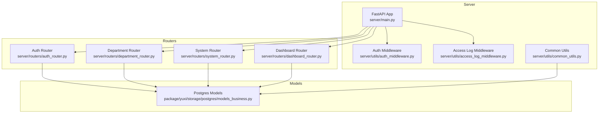
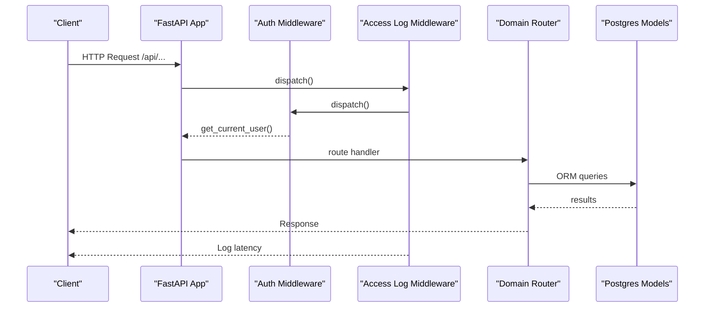
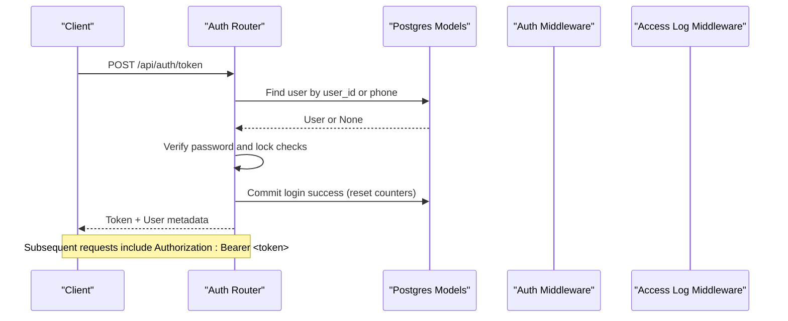
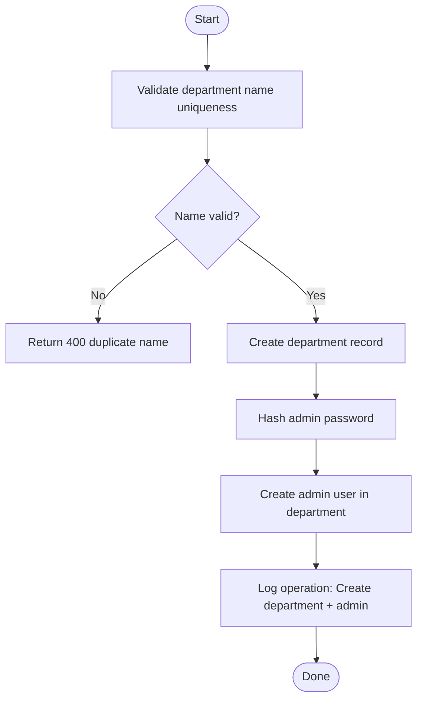
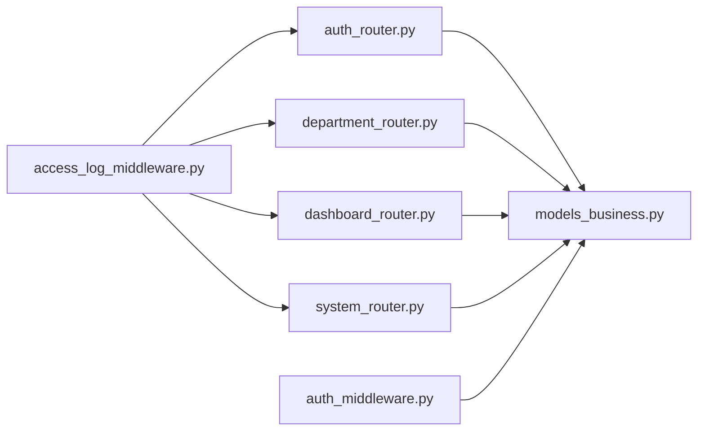

# System Management API

<cite>
**Referenced Files in This Document**
- [backend/server/main.py](file://backend/server/main.py)
- [backend/server/utils/access_log_middleware.py](file://backend/server/utils/access_log_middleware.py)
- [backend/server/utils/auth_middleware.py](file://backend/server/utils/auth_middleware.py)
- [backend/server/utils/common_utils.py](file://backend/server/utils/common_utils.py)
- [backend/server/routers/auth_router.py](file://backend/server/routers/auth_router.py)
- [backend/server/routers/department_router.py](file://backend/server/routers/department_router.py)
- [backend/server/routers/system_router.py](file://backend/server/routers/system_router.py)
- [backend/server/routers/dashboard_router.py](file://backend/server/routers/dashboard_router.py)
- [backend/package/yuxi/storage/postgres/models_business.py](file://backend/package/yuxi/storage/postgres/models_business.py)
- [backend/package/yuxi/config/static/info.template.yaml](file://backend/package/yuxi/config/static/info.template.yaml)
</cite>

## Table of Contents
1. [Introduction](#introduction)
2. [Project Structure](#project-structure)
3. [Core Components](#core-components)
4. [Architecture Overview](#architecture-overview)
5. [Detailed Component Analysis](#detailed-component-analysis)
6. [Dependency Analysis](#dependency-analysis)
7. [Performance Considerations](#performance-considerations)
8. [Troubleshooting Guide](#troubleshooting-guide)
9. [Conclusion](#conclusion)
10. [Appendices](#appendices)

## Introduction
This document provides comprehensive API documentation for system administration and user management endpoints. It covers:
- User lifecycle management (creation, updates, soft deletion)
- Role assignment and permission enforcement
- Department management with hierarchical organization and access control
- System configuration endpoints for platform settings, feature toggles, and environment variables
- Audit logging, system monitoring, and administrative reporting endpoints

Each endpoint documents HTTP methods, URL patterns, request/response schemas, authentication requirements, and error handling. Administrative workflows, permission matrices, and system maintenance procedures are included for practical guidance.

## Project Structure
The backend is organized around FastAPI routers grouped by domain:
- Authentication and user management under `/api/auth`
- Department management under `/api/departments`
- System configuration and health checks under `/api/system`
- Dashboard and monitoring under `/api/dashboard`

**Diagram sources**
- [backend/server/main.py:40-42](file://backend/server/main.py#L40-L42)
- [backend/server/utils/auth_middleware.py:142-159](file://backend/server/utils/auth_middleware.py#L142-L159)
- [backend/server/utils/access_log_middleware.py:34-67](file://backend/server/utils/access_log_middleware.py#L34-L67)
- [backend/server/routers/auth_router.py:29](file://backend/server/routers/auth_router.py#L29)
- [backend/server/routers/department_router.py:22](file://backend/server/routers/department_router.py#L22)
- [backend/server/routers/system_router.py:14](file://backend/server/routers/system_router.py#L14)
- [backend/server/routers/dashboard_router.py:26](file://backend/server/routers/dashboard_router.py#L26)
- [backend/package/yuxi/storage/postgres/models_business.py:29](file://backend/package/yuxi/storage/postgres/models_business.py#L29)

**Section sources**
- [backend/server/main.py:40-42](file://backend/server/main.py#L40-L42)
- [backend/server/routers/auth_router.py:29](file://backend/server/routers/auth_router.py#L29)
- [backend/server/routers/department_router.py:22](file://backend/server/routers/department_router.py#L22)
- [backend/server/routers/system_router.py:14](file://backend/server/routers/system_router.py#L14)
- [backend/server/routers/dashboard_router.py:26](file://backend/server/routers/dashboard_router.py#L26)

## Core Components
- Authentication and Authorization
  - Public paths: health checks, initialization, and token generation
  - Protected routes require bearer tokens or API keys
  - Role-based access: admin vs superadmin
- User and Department Models
  - Users with roles, departments, soft-deletion, and login lockout
  - Departments with hierarchical relationships and user counts
- Logging and Auditing
  - Access log middleware records request latency
  - Operation logs capture administrative actions
- System Configuration
  - Platform info YAML and dynamic config management
  - Provider management and health checks

**Section sources**
- [backend/server/utils/auth_middleware.py:18-26](file://backend/server/utils/auth_middleware.py#L18-L26)
- [backend/server/utils/auth_middleware.py:142-159](file://backend/server/utils/auth_middleware.py#L142-L159)
- [backend/package/yuxi/storage/postgres/models_business.py:51](file://backend/package/yuxi/storage/postgres/models_business.py#L51)
- [backend/package/yuxi/storage/postgres/models_business.py:29](file://backend/package/yuxi/storage/postgres/models_business.py#L29)
- [backend/server/utils/access_log_middleware.py:34-67](file://backend/server/utils/access_log_middleware.py#L34-L67)
- [backend/server/utils/common_utils.py:33-45](file://backend/server/utils/common_utils.py#L33-L45)

## Architecture Overview
The system enforces authentication and authorization centrally, then delegates to domain-specific routers. Middleware logs requests and validates credentials. Data access is performed via SQLAlchemy ORM models.

**Diagram sources**
- [backend/server/main.py:100-137](file://backend/server/main.py#L100-L137)
- [backend/server/utils/access_log_middleware.py:41-67](file://backend/server/utils/access_log_middleware.py#L41-L67)
- [backend/server/utils/auth_middleware.py:74-123](file://backend/server/utils/auth_middleware.py#L74-L123)
- [backend/server/routers/auth_router.py:379-471](file://backend/server/routers/auth_router.py#L379-L471)

## Detailed Component Analysis

### Authentication and User Management Endpoints
- Purpose: Manage users, roles, profiles, and authentication lifecycle
- Authentication: Requires admin or superadmin for user management; public for token and initialization
- Key behaviors:
  - Admins can create/update/delete users within their department constraints
  - Superadmins can manage all users and override department assignments
  - Soft-delete preserves audit trail and releases resources

Endpoints
- POST /api/auth/token
  - Description: Obtain access token using user_id or phone_number
  - Auth: Public
  - Response: Token and user metadata
  - Errors: 401 unauthorized, 423 locked, 403 forbidden
- GET /api/auth/check-first-run
  - Description: Check if system needs initial admin setup
  - Auth: Public
  - Response: Boolean flag
- POST /api/auth/initialize
  - Description: Initialize system with first superadmin and default department
  - Auth: Public (only valid before first-run completes)
  - Response: Token and user metadata
  - Errors: 403 if already initialized
- GET /api/auth/me
  - Description: Fetch current user profile
  - Auth: Requires bearer token
  - Response: UserResponse
- PUT /api/auth/profile
  - Description: Update personal profile (username, phone)
  - Auth: Requires bearer token
  - Response: UserResponse
- POST /api/auth/users
  - Description: Create a new user (admin/superadmin)
  - Auth: Admin or Superadmin
  - Request: UserCreate (username, password, role, optional phone, optional department_id for superadmin)
  - Response: UserResponse
  - Errors: 400 invalid role, 403 insufficient privileges, 400 duplicate username/phone
- GET /api/auth/users
  - Description: List users with department names (admin/superadmin)
  - Auth: Admin or Superadmin
  - Query: skip, limit
  - Response: Array of UserResponse
- GET /api/auth/users/{user_id}
  - Description: Get specific user (admin/superadmin)
  - Auth: Admin or Superadmin
  - Response: UserResponse
- PUT /api/auth/users/{user_id}
  - Description: Update user (admin/superadmin)
  - Auth: Admin or Superadmin
  - Request: UserUpdate (username, password, role, phone, avatar, department_id)
  - Response: UserResponse
  - Errors: 400/403 for role/department changes, 400 if removing sole admin from department
- DELETE /api/auth/users/{user_id}
  - Description: Soft-delete user (admin/superadmin)
  - Auth: Admin or Superadmin
  - Response: Success message
  - Errors: 400 if trying to delete superadmin or sole admin, 400 if already deleted, 400 if deleting self
- POST /api/auth/validate-username
  - Description: Validate username and propose unique user_id (admin/superadmin)
  - Auth: Admin or Superadmin
  - Response: UserIdGeneration
- GET /api/auth/check-user-id/{user_id}
  - Description: Check availability of user_id (admin/superadmin)
  - Auth: Admin or Superadmin
  - Response: { user_id, is_available }
- POST /api/auth/upload-avatar
  - Description: Upload avatar image (authenticated user)
  - Auth: Requires bearer token
  - Response: Avatar URL and success message
  - Errors: 400 invalid file type/size, 500 on upload failure
- POST /api/auth/impersonate/{user_id}
  - Description: Superadmin simulates login as another user
  - Auth: Superadmin only
  - Response: Token
  - Errors: 404 if user not found, 403 if user is superadmin

Request/Response Schemas
- Token: access_token, token_type, user_id, username, user_id_login, phone_number, avatar, role, department_id, department_name
- UserCreate: username, password, role (default "user"), phone_number, department_id
- UserUpdate: username, password, role, phone_number, avatar, department_id
- UserResponse: id, username, user_id, phone_number, avatar, role, department_id, department_name, created_at, last_login
- UserIdGeneration: username, user_id, is_available
- ErrorResponse: { detail: string }

Permission Matrix
- Admin can:
  - Create users with role "user"
  - Update own profile
  - View users in own department
  - Soft-delete users (not superadmin, not sole admin in department)
- Superadmin can:
  - Create users with any role except superadmin
  - Update any user’s role/department
  - Delete any user except superadmin
  - Impersonate any non-superadmin user

Administrative Workflow Examples
- Create a new user in a department:
  - POST /api/auth/users with role "user" and optional department_id (superadmin)
  - PUT /api/auth/users/{id} to adjust role/department (superadmin)
- Remove a user account:
  - DELETE /api/auth/users/{id} (admin/superadmin)
  - Ensure replacement admin exists if removing sole admin from department

**Section sources**
- [backend/server/routers/auth_router.py:115-207](file://backend/server/routers/auth_router.py#L115-L207)
- [backend/server/routers/auth_router.py:211-290](file://backend/server/routers/auth_router.py#L211-L290)
- [backend/server/routers/auth_router.py:299-371](file://backend/server/routers/auth_router.py#L299-L371)
- [backend/server/routers/auth_router.py:379-471](file://backend/server/routers/auth_router.py#L379-L471)
- [backend/server/routers/auth_router.py:475-510](file://backend/server/routers/auth_router.py#L475-L510)
- [backend/server/routers/auth_router.py:525-620](file://backend/server/routers/auth_router.py#L525-L620)
- [backend/server/routers/auth_router.py:623-690](file://backend/server/routers/auth_router.py#L623-L690)
- [backend/server/routers/auth_router.py:694-734](file://backend/server/routers/auth_router.py#L694-L734)
- [backend/server/routers/auth_router.py:738-774](file://backend/server/routers/auth_router.py#L738-L774)
- [backend/server/routers/auth_router.py:777-800](file://backend/server/routers/auth_router.py#L777-L800)
- [backend/package/yuxi/storage/postgres/models_business.py:51](file://backend/package/yuxi/storage/postgres/models_business.py#L51)

### Department Management Endpoints
- Purpose: Manage organizational units and enforce department isolation
- Authentication: Superadmin for create/update/delete; admin for read/list with constraints
- Key behaviors:
  - Creating a department also creates an admin user for that department
  - Deleting a department requires empty user count

Endpoints
- GET /api/departments
  - Description: List departments with user counts (admin/superadmin)
  - Auth: Admin or Superadmin
  - Response: Array of DepartmentResponse
- GET /api/departments/{department_id}
  - Description: Get department details (superadmin)
  - Auth: Superadmin
  - Response: DepartmentResponse
- POST /api/departments
  - Description: Create department and admin user (superadmin)
  - Auth: Superadmin
  - Request: DepartmentCreate (name, description, admin_user_id, admin_password, optional admin_phone)
  - Response: DepartmentResponse
  - Errors: 400 duplicate name/user_id/phone
- PUT /api/departments/{department_id}
  - Description: Update department (superadmin)
  - Auth: Superadmin
  - Request: DepartmentUpdate (name, description)
  - Response: DepartmentResponse
  - Errors: 400 duplicate name
- DELETE /api/departments/{department_id}
  - Description: Delete department (superadmin)
  - Auth: Superadmin
  - Response: Success message
  - Errors: 400 if department still has users

Request/Response Schemas
- DepartmentCreate: name, description, admin_user_id, admin_password, admin_phone
- DepartmentUpdate: name, description
- DepartmentResponse: id, name, description, created_at, user_count

Hierarchical Organization and Access Control
- Department isolation:
  - Admins can only see users within their own department
  - Superadmins can see all users
- Department admin protection:
  - Cannot remove sole admin from a department
  - Cannot delete department if users remain

**Section sources**
- [backend/server/routers/department_router.py:70-94](file://backend/server/routers/department_router.py#L70-L94)
- [backend/server/routers/department_router.py:77-94](file://backend/server/routers/department_router.py#L77-L94)
- [backend/server/routers/department_router.py:97-170](file://backend/server/routers/department_router.py#L97-L170)
- [backend/server/routers/department_router.py:173-211](file://backend/server/routers/department_router.py#L173-L211)
- [backend/server/routers/department_router.py:214-247](file://backend/server/routers/department_router.py#L214-L247)

### System Configuration Endpoints
- Purpose: Platform settings, feature toggles, environment variables, and system info
- Authentication: Superadmin/admin protected; health/info open to public

Endpoints
- GET /api/system/health
  - Description: Health check (public)
  - Response: { status: "ok", message: "...", version: string }
- GET /api/system/config
  - Description: Retrieve current system configuration (admin/superadmin)
  - Auth: Admin or Superadmin
  - Response: Serialized config
- POST /api/system/config
  - Description: Update single config key (admin/superadmin)
  - Auth: Admin or Superadmin
  - Request: { key, value }
  - Response: Updated config
- POST /api/system/config/update
  - Description: Batch update config items (admin/superadmin)
  - Auth: Admin or Superadmin
  - Request: { items: dict }
  - Response: Updated config
- GET /api/system/logs
  - Description: Tail system logs (admin/superadmin)
  - Auth: Admin or Superadmin
  - Query: levels (comma-separated log levels)
  - Response: { log: string, message: "success", log_file: string }
- GET /api/system/info
  - Description: Public system info (branding, features, footer) (public)
  - Response: { success: true, data: info_yaml_as_dict }
- POST /api/system/info/reload
  - Description: Reload info config (admin/superadmin)
  - Auth: Admin or Superadmin
  - Response: { success: true, message: "...", data: info_yaml_as_dict }
- GET /api/system/ocr/health
  - Description: Check OCR service health (admin/superadmin)
  - Auth: Admin or Superadmin
  - Response: { overall_status, services, message }
- GET /api/system/chat-models/status
  - Description: Check specific chat model status (admin/superadmin)
  - Auth: Admin or Superadmin
  - Query: provider, model_name
  - Response: { status, message }
- GET /api/system/chat-models/all/status
  - Description: Check all chat models status (admin/superadmin)
  - Auth: Admin or Superadmin
  - Response: { status, message }
- GET /api/system/custom-providers
  - Description: List custom providers (admin/superadmin)
  - Auth: Admin or Superadmin
  - Response: { providers: dict, message }
- POST /api/system/custom-providers
  - Description: Add custom provider (admin/superadmin)
  - Auth: Admin or Superadmin
  - Request: { provider_id, provider_data }
  - Response: { message }
- PUT /api/system/custom-providers/{provider_id}
  - Description: Update custom provider (admin/superadmin)
  - Auth: Admin or Superadmin
  - Request: { provider_data }
  - Response: { message }
- DELETE /api/system/custom-providers/{provider_id}
  - Description: Delete custom provider (admin/superadmin)
  - Auth: Admin or Superadmin
  - Response: { message }
- POST /api/system/custom-providers/{provider_id}/test
  - Description: Test custom provider connection (admin/superadmin)
  - Auth: Admin or Superadmin
  - Request: { model_name }
  - Response: { status, message }

Configuration Files
- Info template: Branding, features, actions, footer
- Environment-driven path: YUXI_BRAND_FILE_PATH or fallback to info.template.yaml

**Section sources**
- [backend/server/routers/system_router.py:21-24](file://backend/server/routers/system_router.py#L21-L24)
- [backend/server/routers/system_router.py:32-51](file://backend/server/routers/system_router.py#L32-L51)
- [backend/server/routers/system_router.py:54-94](file://backend/server/routers/system_router.py#L54-L94)
- [backend/server/routers/system_router.py:125-144](file://backend/server/routers/system_router.py#L125-L144)
- [backend/server/routers/system_router.py:152-190](file://backend/server/routers/system_router.py#L152-L190)
- [backend/server/routers/system_router.py:198-222](file://backend/server/routers/system_router.py#L198-L222)
- [backend/server/routers/system_router.py:230-291](file://backend/server/routers/system_router.py#L230-L291)
- [backend/server/routers/system_router.py:294-320](file://backend/server/routers/system_router.py#L294-L320)
- [backend/package/yuxi/config/static/info.template.yaml:1-62](file://backend/package/yuxi/config/static/info.template.yaml#L1-L62)

### Audit Logging, Monitoring, and Reporting Endpoints
- Purpose: Track administrative actions, monitor system usage, and generate reports
- Authentication: Admin or Superadmin for all dashboard endpoints

Endpoints
- GET /api/dashboard/stats
  - Description: Basic system metrics (admin/superadmin)
  - Response: { total_conversations, active_conversations, total_messages, total_users, feedback_stats }
- GET /api/dashboard/stats/users
  - Description: User activity stats (admin/superadmin)
  - Response: { total_users, active_users_24h, active_users_30d, daily_active_users }
- GET /api/dashboard/stats/tools
  - Description: Tool call statistics (admin/superadmin)
  - Response: { total_calls, successful_calls, failed_calls, success_rate, most_used_tools, tool_error_distribution, daily_tool_calls }
- GET /api/dashboard/stats/knowledge
  - Description: Knowledge base statistics (admin/superadmin)
  - Response: { total_databases, total_files, total_nodes, total_storage_size, databases_by_type, file_type_distribution }
- GET /api/dashboard/stats/agents
  - Description: Agent analytics (admin/superadmin)
  - Response: { total_agents, agent_conversation_counts, agent_satisfaction_rates, agent_tool_usage, top_performing_agents }
- GET /api/dashboard/stats/calls/timeseries
  - Description: Time-series call analytics (admin/superadmin)
  - Query: type ("models"|"agents"|"tokens"|"tools"), time_range ("14hours"|"14days"|"14weeks")
  - Response: { data, categories, total_count, average_count, peak_count, peak_date }
- GET /api/dashboard/conversations
  - Description: List conversations with filters (admin/superadmin)
  - Query: user_id, agent_id, status, limit, offset
  - Response: Array of ConversationListItem
- GET /api/dashboard/conversations/{thread_id}
  - Description: Conversation detail with messages and stats (admin/superadmin)
  - Response: ConversationDetailResponse
- GET /api/dashboard/feedbacks
  - Description: Feedback records (admin/superadmin)
  - Query: rating ("like"|"dislike"), agent_id
  - Response: Array of FeedbackListItem

Audit Logging
- Operation logs capture administrative actions with IP address
- Logged on create/update/delete/impersonation and other privileged actions

**Section sources**
- [backend/server/routers/dashboard_router.py:584-633](file://backend/server/routers/dashboard_router.py#L584-L633)
- [backend/server/routers/dashboard_router.py:249-315](file://backend/server/routers/dashboard_router.py#L249-L315)
- [backend/server/routers/dashboard_router.py:323-390](file://backend/server/routers/dashboard_router.py#L323-L390)
- [backend/server/routers/dashboard_router.py:398-479](file://backend/server/routers/dashboard_router.py#L398-L479)
- [backend/server/routers/dashboard_router.py:487-576](file://backend/server/routers/dashboard_router.py#L487-L576)
- [backend/server/routers/dashboard_router.py:733-981](file://backend/server/routers/dashboard_router.py#L733-L981)
- [backend/server/routers/dashboard_router.py:128-241](file://backend/server/routers/dashboard_router.py#L128-L241)
- [backend/server/routers/dashboard_router.py:656-714](file://backend/server/routers/dashboard_router.py#L656-L714)
- [backend/server/utils/common_utils.py:33-45](file://backend/server/utils/common_utils.py#L33-L45)
- [backend/package/yuxi/storage/postgres/models_business.py:373](file://backend/package/yuxi/storage/postgres/models_business.py#L373)

### Authentication Flow

**Diagram sources**
- [backend/server/routers/auth_router.py:115-207](file://backend/server/routers/auth_router.py#L115-L207)
- [backend/server/utils/auth_middleware.py:74-123](file://backend/server/utils/auth_middleware.py#L74-L123)

### Department Creation Workflow

**Diagram sources**
- [backend/server/routers/department_router.py:97-170](file://backend/server/routers/department_router.py#L97-L170)

## Dependency Analysis
- Router-to-Model Coupling
  - Auth and Department routers depend on User and Department models
  - Dashboard router depends on multiple models for stats and analytics
  - System router depends on configuration and provider health checks
- Middleware Dependencies
  - Auth middleware validates JWT/API keys and enforces role checks
  - Access log middleware measures request latency
- External Integrations
  - MinIO for avatar uploads
  - YAML loader for info configuration
  - Async Postgres via SQLAlchemy

**Diagram sources**
- [backend/server/routers/auth_router.py:29](file://backend/server/routers/auth_router.py#L29)
- [backend/server/routers/department_router.py:22](file://backend/server/routers/department_router.py#L22)
- [backend/server/routers/dashboard_router.py:26](file://backend/server/routers/dashboard_router.py#L26)
- [backend/server/routers/system_router.py:14](file://backend/server/routers/system_router.py#L14)
- [backend/server/utils/auth_middleware.py:142-159](file://backend/server/utils/auth_middleware.py#L142-L159)
- [backend/server/utils/access_log_middleware.py:34-67](file://backend/server/utils/access_log_middleware.py#L34-L67)
- [backend/package/yuxi/storage/postgres/models_business.py:51](file://backend/package/yuxi/storage/postgres/models_business.py#L51)

**Section sources**
- [backend/server/routers/auth_router.py:29](file://backend/server/routers/auth_router.py#L29)
- [backend/server/routers/department_router.py:22](file://backend/server/routers/department_router.py#L22)
- [backend/server/routers/dashboard_router.py:26](file://backend/server/routers/dashboard_router.py#L26)
- [backend/server/routers/system_router.py:14](file://backend/server/routers/system_router.py#L14)
- [backend/server/utils/auth_middleware.py:142-159](file://backend/server/utils/auth_middleware.py#L142-L159)
- [backend/server/utils/access_log_middleware.py:34-67](file://backend/server/utils/access_log_middleware.py#L34-L67)

## Performance Considerations
- Asynchronous I/O
  - All routers use async sessions and async file operations where applicable
- Pagination and Limits
  - User listing supports skip/limit to avoid large payloads
- Time-series Aggregation
  - Dashboard endpoints pre-aggregate data to reduce client-side computation
- Logging Overhead
  - Access log middleware measures latency; ensure structured logging for observability
- Rate Limiting
  - Login attempts are rate-limited per IP for the token endpoint

[No sources needed since this section provides general guidance]

## Troubleshooting Guide
Common Errors and Resolutions
- Authentication
  - 401 Unauthorized: Missing or invalid Authorization header; ensure Bearer token
  - 403 Forbidden: Insufficient role (admin vs superadmin) or account locked
  - 423 Locked: Account temporarily locked after repeated failures
- User Management
  - 400 Duplicate username/phone during creation or update
  - 403 Attempting to downgrade superadmin or modify sole admin’s department
  - 400 Cannot delete user who is sole admin of a department
- Department Management
  - 400 Cannot delete department with users remaining
  - 400 Duplicate department name
- System Configuration
  - 500 Failed to load info config or logs
  - 404 Provider not found during test
- Dashboard
  - 500 Internal errors during aggregation; verify DB connectivity and permissions

Operational Checks
- Verify middleware registration order: access log, rate limit, auth
- Confirm public paths are correctly whitelisted
- Ensure MinIO is reachable for avatar uploads
- Validate YAML info file path and permissions

**Section sources**
- [backend/server/utils/auth_middleware.py:18-26](file://backend/server/utils/auth_middleware.py#L18-L26)
- [backend/server/utils/access_log_middleware.py:34-67](file://backend/server/utils/access_log_middleware.py#L34-L67)
- [backend/server/routers/auth_router.py:420-433](file://backend/server/routers/auth_router.py#L420-L433)
- [backend/server/routers/auth_router.py:574-582](file://backend/server/routers/auth_router.py#L574-L582)
- [backend/server/routers/department_router.py:235-238](file://backend/server/routers/department_router.py#L235-L238)
- [backend/server/routers/system_router.py:91-93](file://backend/server/routers/system_router.py#L91-L93)
- [backend/server/routers/dashboard_router.py:174-177](file://backend/server/routers/dashboard_router.py#L174-L177)

## Conclusion
The System Management API provides a secure, auditable, and observable foundation for administration:
- Strict role-based access controls protect sensitive operations
- Comprehensive user and department management supports scalable organizational structures
- System configuration endpoints enable dynamic platform tuning
- Rich monitoring and reporting facilitate operational insights

Adhering to the documented workflows and permission matrices ensures safe and efficient administration.

[No sources needed since this section summarizes without analyzing specific files]

## Appendices

### Endpoint Reference Summary
- Authentication
  - POST /api/auth/token
  - GET /api/auth/check-first-run
  - POST /api/auth/initialize
  - GET /api/auth/me
  - PUT /api/auth/profile
  - POST /api/auth/users
  - GET /api/auth/users
  - GET /api/auth/users/{user_id}
  - PUT /api/auth/users/{user_id}
  - DELETE /api/auth/users/{user_id}
  - POST /api/auth/validate-username
  - GET /api/auth/check-user-id/{user_id}
  - POST /api/auth/upload-avatar
  - POST /api/auth/impersonate/{user_id}
- Department Management
  - GET /api/departments
  - GET /api/departments/{department_id}
  - POST /api/departments
  - PUT /api/departments/{department_id}
  - DELETE /api/departments/{department_id}
- System Configuration
  - GET /api/system/health
  - GET /api/system/config
  - POST /api/system/config
  - POST /api/system/config/update
  - GET /api/system/logs
  - GET /api/system/info
  - POST /api/system/info/reload
  - GET /api/system/ocr/health
  - GET /api/system/chat-models/status
  - GET /api/system/chat-models/all/status
  - GET /api/system/custom-providers
  - POST /api/system/custom-providers
  - PUT /api/system/custom-providers/{provider_id}
  - DELETE /api/system/custom-providers/{provider_id}
  - POST /api/system/custom-providers/{provider_id}/test
- Dashboard and Monitoring
  - GET /api/dashboard/stats
  - GET /api/dashboard/stats/users
  - GET /api/dashboard/stats/tools
  - GET /api/dashboard/stats/knowledge
  - GET /api/dashboard/stats/agents
  - GET /api/dashboard/stats/calls/timeseries
  - GET /api/dashboard/conversations
  - GET /api/dashboard/conversations/{thread_id}
  - GET /api/dashboard/feedbacks

**Section sources**
- [backend/server/routers/auth_router.py:115-207](file://backend/server/routers/auth_router.py#L115-L207)
- [backend/server/routers/auth_router.py:211-290](file://backend/server/routers/auth_router.py#L211-L290)
- [backend/server/routers/auth_router.py:299-371](file://backend/server/routers/auth_router.py#L299-L371)
- [backend/server/routers/auth_router.py:379-471](file://backend/server/routers/auth_router.py#L379-L471)
- [backend/server/routers/auth_router.py:475-510](file://backend/server/routers/auth_router.py#L475-L510)
- [backend/server/routers/auth_router.py:525-620](file://backend/server/routers/auth_router.py#L525-L620)
- [backend/server/routers/auth_router.py:623-690](file://backend/server/routers/auth_router.py#L623-L690)
- [backend/server/routers/auth_router.py:694-734](file://backend/server/routers/auth_router.py#L694-L734)
- [backend/server/routers/auth_router.py:738-774](file://backend/server/routers/auth_router.py#L738-L774)
- [backend/server/routers/auth_router.py:777-800](file://backend/server/routers/auth_router.py#L777-L800)
- [backend/server/routers/department_router.py:70-94](file://backend/server/routers/department_router.py#L70-L94)
- [backend/server/routers/department_router.py:77-94](file://backend/server/routers/department_router.py#L77-L94)
- [backend/server/routers/department_router.py:97-170](file://backend/server/routers/department_router.py#L97-L170)
- [backend/server/routers/department_router.py:173-211](file://backend/server/routers/department_router.py#L173-L211)
- [backend/server/routers/department_router.py:214-247](file://backend/server/routers/department_router.py#L214-L247)
- [backend/server/routers/system_router.py:21-24](file://backend/server/routers/system_router.py#L21-L24)
- [backend/server/routers/system_router.py:32-51](file://backend/server/routers/system_router.py#L32-L51)
- [backend/server/routers/system_router.py:54-94](file://backend/server/routers/system_router.py#L54-L94)
- [backend/server/routers/system_router.py:125-144](file://backend/server/routers/system_router.py#L125-L144)
- [backend/server/routers/system_router.py:152-190](file://backend/server/routers/system_router.py#L152-L190)
- [backend/server/routers/system_router.py:198-222](file://backend/server/routers/system_router.py#L198-L222)
- [backend/server/routers/system_router.py:230-291](file://backend/server/routers/system_router.py#L230-L291)
- [backend/server/routers/system_router.py:294-320](file://backend/server/routers/system_router.py#L294-L320)
- [backend/server/routers/dashboard_router.py:584-633](file://backend/server/routers/dashboard_router.py#L584-L633)
- [backend/server/routers/dashboard_router.py:249-315](file://backend/server/routers/dashboard_router.py#L249-L315)
- [backend/server/routers/dashboard_router.py:323-390](file://backend/server/routers/dashboard_router.py#L323-L390)
- [backend/server/routers/dashboard_router.py:398-479](file://backend/server/routers/dashboard_router.py#L398-L479)
- [backend/server/routers/dashboard_router.py:487-576](file://backend/server/routers/dashboard_router.py#L487-L576)
- [backend/server/routers/dashboard_router.py:733-981](file://backend/server/routers/dashboard_router.py#L733-L981)
- [backend/server/routers/dashboard_router.py:128-241](file://backend/server/routers/dashboard_router.py#L128-L241)
- [backend/server/routers/dashboard_router.py:656-714](file://backend/server/routers/dashboard_router.py#L656-L714)