# Agent Development

<cite>
**Referenced Files in This Document**
- [__init__.py](file://backend/package/yuxi/agents/__init__.py)
- [base.py](file://backend/package/yuxi/agents/base.py)
- [context.py](file://backend/package/yuxi/agents/context.py)
- [state.py](file://backend/package/yuxi/agents/state.py)
- [models.py](file://backend/package/yuxi/agents/models.py)
- [middlewares/__init__.py](file://backend/package/yuxi/agents/middlewares/__init__.py)
- [context_middlewares.py](file://backend/package/yuxi/agents/middlewares/context_middlewares.py)
- [skills_middleware.py](file://backend/package/yuxi/agents/middlewares/skills_middleware.py)
- [dynamic_tool_middleware.py](file://backend/package/yuxi/agents/middlewares/dynamic_tool_middleware.py)
- [backends/composite.py](file://backend/package/yuxi/agents/backends/composite.py)
- [backends/sandbox/backend.py](file://backend/package/yuxi/agents/backends/sandbox/backend.py)
- [backends/skills_backend.py](file://backend/package/yuxi/agents/backends/skills_backend.py)
- [toolkits/registry.py](file://backend/package/yuxi/agents/toolkits/registry.py)
- [toolkits/utils.py](file://backend/package/yuxi/agents/toolkits/utils.py)
- [services/subagent_service.py](file://backend/package/yuxi/services/subagent_service.py)
</cite>

## Table of Contents
1. [Introduction](#introduction)
2. [Project Structure](#project-structure)
3. [Core Components](#core-components)
4. [Architecture Overview](#architecture-overview)
5. [Detailed Component Analysis](#detailed-component-analysis)
6. [Dependency Analysis](#dependency-analysis)
7. [Performance Considerations](#performance-considerations)
8. [Troubleshooting Guide](#troubleshooting-guide)
9. [Conclusion](#conclusion)
10. [Appendices](#appendices)

## Introduction
This document explains the agent development system built on LangGraph v1. It covers agent orchestration patterns, sub-agent management, middleware-driven tool and skill integration, sandbox execution, and secure attachment handling. It also documents agent state management, context building, execution flows, configuration patterns, error handling, and performance optimization. Practical examples are provided via concrete code paths to guide developers in creating custom agents, configuring skills, and implementing middleware.

## Project Structure
The agent framework is organized around:
- Core agent base and state management
- Context builder for runtime configuration
- Middlewares for dynamic tool selection, skills injection, and model routing
- Backends for sandbox execution, skills exposure, and knowledge base access
- Tool registries and utilities for tool discovery and metadata
- Sub-agent service for managing reusable agent templates

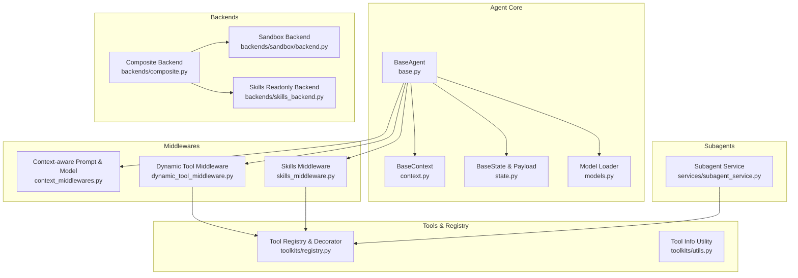

**Diagram sources**
- [base.py:17-263](file://backend/package/yuxi/agents/base.py#L17-L263)
- [context.py:11-191](file://backend/package/yuxi/agents/context.py#L11-L191)
- [state.py:19-31](file://backend/package/yuxi/agents/state.py#L19-L31)
- [models.py:12-58](file://backend/package/yuxi/agents/models.py#L12-L58)
- [middlewares/context_middlewares.py:11-26](file://backend/package/yuxi/agents/middlewares/context_middlewares.py#L11-L26)
- [middlewares/dynamic_tool_middleware.py:10-70](file://backend/package/yuxi/agents/middlewares/dynamic_tool_middleware.py#L10-L70)
- [middlewares/skills_middleware.py:145-477](file://backend/package/yuxi/agents/middlewares/skills_middleware.py#L145-L477)
- [backends/composite.py:18-134](file://backend/package/yuxi/agents/backends/composite.py#L18-L134)
- [backends/sandbox/backend.py:64-402](file://backend/package/yuxi/agents/backends/sandbox/backend.py#L64-L402)
- [backends/skills_backend.py:12-115](file://backend/package/yuxi/agents/backends/skills_backend.py#L12-L115)
- [toolkits/registry.py:5-97](file://backend/package/yuxi/agents/toolkits/registry.py#L5-L97)
- [toolkits/utils.py:7-56](file://backend/package/yuxi/agents/toolkits/utils.py#L7-L56)
- [services/subagent_service.py:101-249](file://backend/package/yuxi/services/subagent_service.py#L101-L249)

**Section sources**
- [__init__.py:1-29](file://backend/package/yuxi/agents/__init__.py#L1-L29)
- [base.py:17-263](file://backend/package/yuxi/agents/base.py#L17-L263)
- [context.py:11-191](file://backend/package/yuxi/agents/context.py#L11-L191)
- [state.py:19-31](file://backend/package/yuxi/agents/state.py#L19-L31)
- [models.py:12-58](file://backend/package/yuxi/agents/models.py#L12-L58)
- [middlewares/__init__.py:1-17](file://backend/package/yuxi/agents/middlewares/__init__.py#L1-L17)
- [middlewares/context_middlewares.py:11-26](file://backend/package/yuxi/agents/middlewares/context_middlewares.py#L11-L26)
- [middlewares/dynamic_tool_middleware.py:10-70](file://backend/package/yuxi/agents/middlewares/dynamic_tool_middleware.py#L10-L70)
- [middlewares/skills_middleware.py:145-477](file://backend/package/yuxi/agents/middlewares/skills_middleware.py#L145-L477)
- [backends/composite.py:18-134](file://backend/package/yuxi/agents/backends/composite.py#L18-L134)
- [backends/sandbox/backend.py:64-402](file://backend/package/yuxi/agents/backends/sandbox/backend.py#L64-L402)
- [backends/skills_backend.py:12-115](file://backend/package/yuxi/agents/backends/skills_backend.py#L12-L115)
- [toolkits/registry.py:5-97](file://backend/package/yuxi/agents/toolkits/registry.py#L5-L97)
- [toolkits/utils.py:7-56](file://backend/package/yuxi/agents/toolkits/utils.py#L7-L56)
- [services/subagent_service.py:101-249](file://backend/package/yuxi/services/subagent_service.py#L101-L249)

## Core Components
- BaseAgent: Orchestrates LangGraph v1 compiled graphs, manages checkpointer backends, and exposes streaming/invoke APIs with context-aware configuration.
- BaseContext: Central runtime configuration schema for threads, users, system prompts, model selection, tools, skills, MCP servers, subagents, and summarization thresholds.
- BaseState: Shared state fields including artifacts with deterministic merging.
- Model loader: Resolves provider-specific LLM initialization from configuration and environment variables.
- Middlewares: Dynamic tool selection, skills injection/activation, and context-aware model routing.
- Backends: Composite backend routing to sandbox, skills, and knowledge base backends; sandbox backend for safe execution and file operations.
- Tool registry: Decorator-based tool registration and metadata collection; tool info utility for frontend presentation.
- Subagent service: CRUD and caching for reusable sub-agent templates and tool resolution.

**Section sources**
- [base.py:17-263](file://backend/package/yuxi/agents/base.py#L17-L263)
- [context.py:11-191](file://backend/package/yuxi/agents/context.py#L11-L191)
- [state.py:19-31](file://backend/package/yuxi/agents/state.py#L19-L31)
- [models.py:12-58](file://backend/package/yuxi/agents/models.py#L12-L58)
- [middlewares/__init__.py:1-17](file://backend/package/yuxi/agents/middlewares/__init__.py#L1-L17)
- [backends/composite.py:18-134](file://backend/package/yuxi/agents/backends/composite.py#L18-L134)
- [backends/sandbox/backend.py:64-402](file://backend/package/yuxi/agents/backends/sandbox/backend.py#L64-L402)
- [backends/skills_backend.py:12-115](file://backend/package/yuxi/agents/backends/skills_backend.py#L12-L115)
- [toolkits/registry.py:5-97](file://backend/package/yuxi/agents/toolkits/registry.py#L5-L97)
- [toolkits/utils.py:7-56](file://backend/package/yuxi/agents/toolkits/utils.py#L7-L56)
- [services/subagent_service.py:101-249](file://backend/package/yuxi/services/subagent_service.py#L101-L249)

## Architecture Overview
The system integrates LangGraph v1 with a middleware-driven pipeline:
- BaseAgent compiles a graph with a checkpointer and streams/invoke messages with context.
- Middlewares dynamically adjust tools, skills, and model selection per runtime context.
- Composite backend routes file operations to sandbox, skills, or knowledge base backends.
- Subagents are resolved from the registry and injected into workflows as needed.

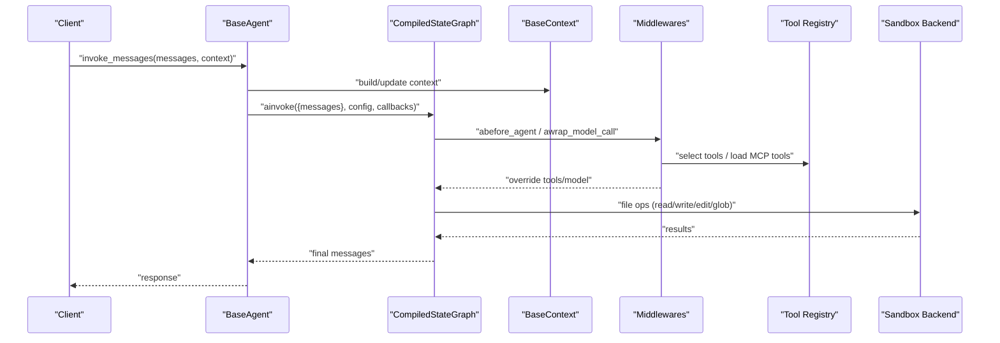

**Diagram sources**
- [base.py:125-150](file://backend/package/yuxi/agents/base.py#L125-L150)
- [middlewares/context_middlewares.py:17-26](file://backend/package/yuxi/agents/middlewares/context_middlewares.py#L17-L26)
- [middlewares/dynamic_tool_middleware.py:40-70](file://backend/package/yuxi/agents/middlewares/dynamic_tool_middleware.py#L40-L70)
- [backends/composite.py:122-134](file://backend/package/yuxi/agents/backends/composite.py#L122-L134)
- [backends/sandbox/backend.py:171-200](file://backend/package/yuxi/agents/backends/sandbox/backend.py#L171-L200)

## Detailed Component Analysis

### BaseAgent and LangGraph v1 Integration
- Provides streaming and invocation APIs with context propagation.
- Configures LangGraph checkpointer backends (SQLite, Postgres, memory fallback).
- Exposes history retrieval and graph reload utilities.

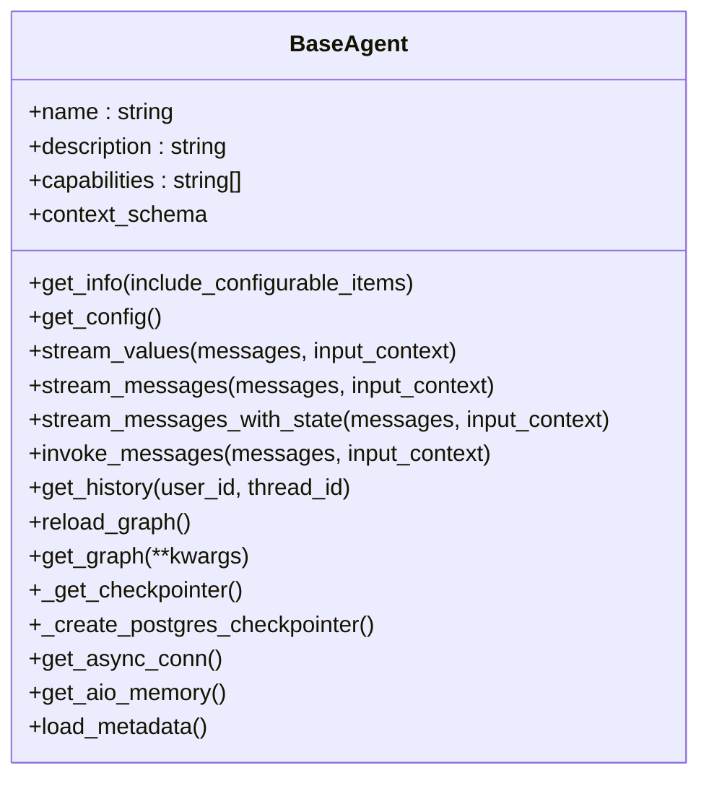

**Diagram sources**
- [base.py:17-263](file://backend/package/yuxi/agents/base.py#L17-L263)

**Section sources**
- [base.py:44-197](file://backend/package/yuxi/agents/base.py#L44-L197)
- [base.py:199-255](file://backend/package/yuxi/agents/base.py#L199-L255)

### Context Building and Configuration Patterns
- BaseContext defines configurable fields for thread/user identity, system prompt, model, tools, skills, MCP servers, subagents, and summarization threshold.
- Provides a schema for UI-driven configuration and default/fallback resolution.

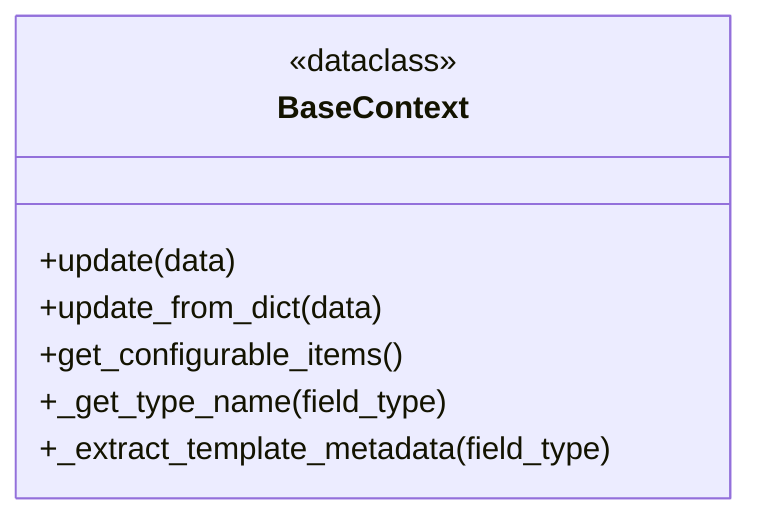

**Diagram sources**
- [context.py:11-191](file://backend/package/yuxi/agents/context.py#L11-L191)

**Section sources**
- [context.py:21-191](file://backend/package/yuxi/agents/context.py#L21-L191)

### State Management and Artifacts
- BaseState extends AgentState with an annotated artifacts field and a reducer to merge file paths deterministically.
- AgentStatePayload defines serialized state fields for the frontend.

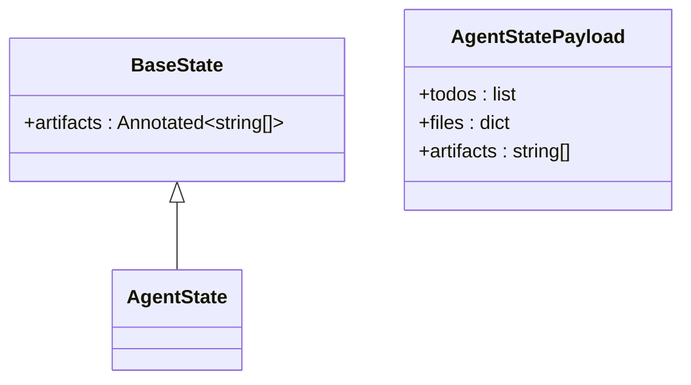

**Diagram sources**
- [state.py:19-31](file://backend/package/yuxi/agents/state.py#L19-L31)

**Section sources**
- [state.py:10-31](file://backend/package/yuxi/agents/state.py#L10-L31)

### Model Loading and Provider Resolution
- load_chat_model resolves provider-specific initialization, environment variables, and base URLs.

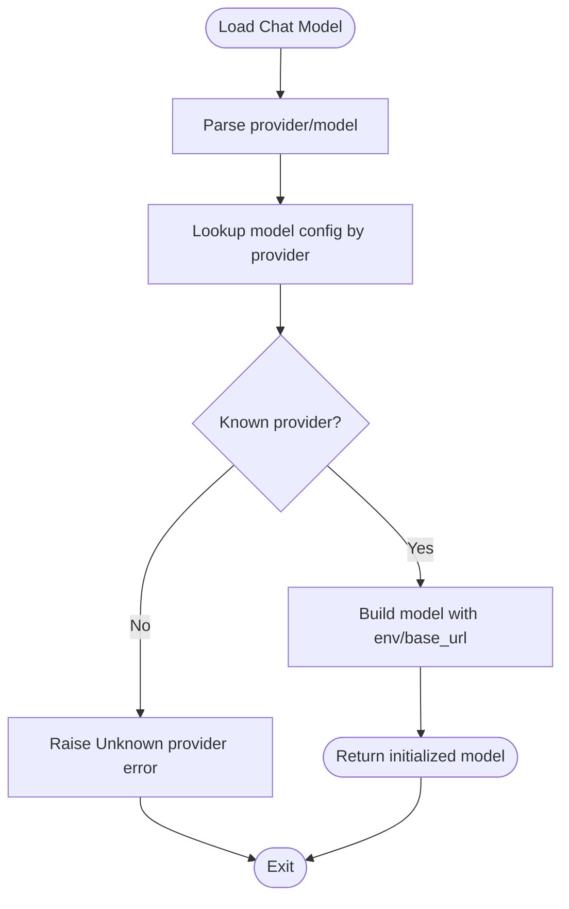

**Diagram sources**
- [models.py:12-58](file://backend/package/yuxi/agents/models.py#L12-L58)

**Section sources**
- [models.py:12-58](file://backend/package/yuxi/agents/models.py#L12-L58)

### Middleware: Context-Aware Prompt and Model Routing
- context_aware_prompt injects the runtime system prompt into model requests.
- context_based_model selects the model from BaseContext and overrides the request.

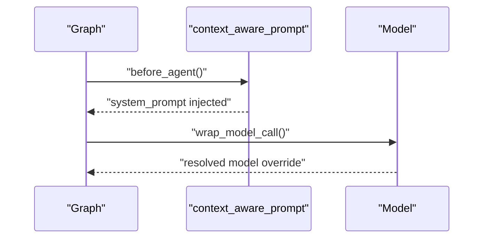

**Diagram sources**
- [middlewares/context_middlewares.py:11-26](file://backend/package/yuxi/agents/middlewares/context_middlewares.py#L11-L26)
- [models.py:12-58](file://backend/package/yuxi/agents/models.py#L12-L58)

**Section sources**
- [middlewares/context_middlewares.py:11-26](file://backend/package/yuxi/agents/middlewares/context_middlewares.py#L11-L26)

### Middleware: Dynamic Tool Selection
- DynamicToolMiddleware preloads MCP tools and filters tools based on runtime context.

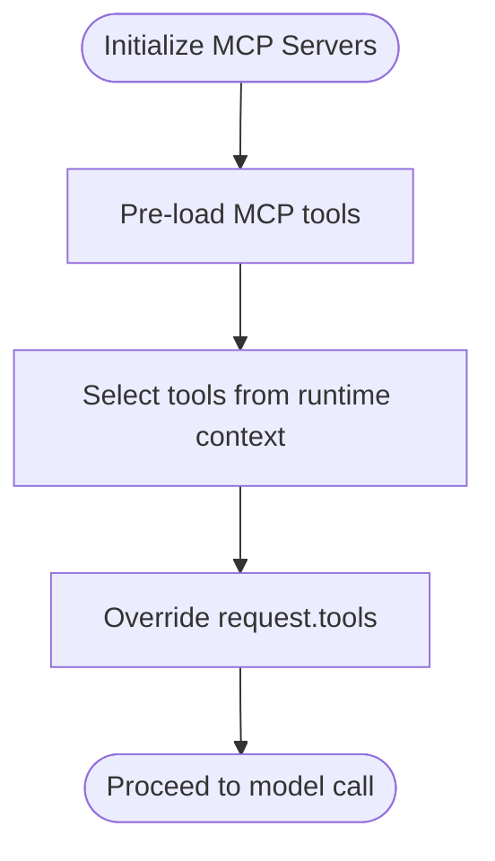

**Diagram sources**
- [middlewares/dynamic_tool_middleware.py:29-70](file://backend/package/yuxi/agents/middlewares/dynamic_tool_middleware.py#L29-L70)

**Section sources**
- [middlewares/dynamic_tool_middleware.py:10-70](file://backend/package/yuxi/agents/middlewares/dynamic_tool_middleware.py#L10-L70)

### Middleware: Skills Injection, Dependency Expansion, and Activation
- SkillsMiddleware:
  - Injects skills prompt into system prompt
  - Expands closure of activated skills
  - Builds dependency bundles (tools/MCPs) and merges into request
  - Handles dynamic skill activation via tool call results

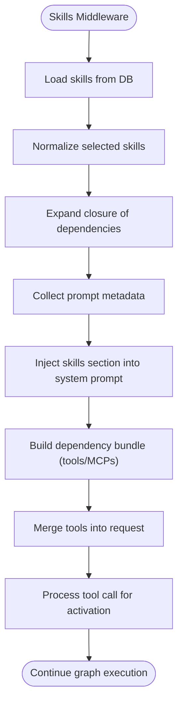

**Diagram sources**
- [middlewares/skills_middleware.py:175-272](file://backend/package/yuxi/agents/middlewares/skills_middleware.py#L175-L272)
- [middlewares/skills_middleware.py:273-448](file://backend/package/yuxi/agents/middlewares/skills_middleware.py#L273-L448)

**Section sources**
- [middlewares/skills_middleware.py:145-477](file://backend/package/yuxi/agents/middlewares/skills_middleware.py#L145-L477)

### Composite Backend and Routing
- CustomCompositeBackend routes file operations:
  - Default: ProvisionerSandboxBackend
  - Routes: SelectedSkillsReadonlyBackend for “/skills/”, KnowledgeBaseReadonlyBackend for “/home/gem/kbs/”
- Fixes glob_info routing to search only default backend when path does not match a route.

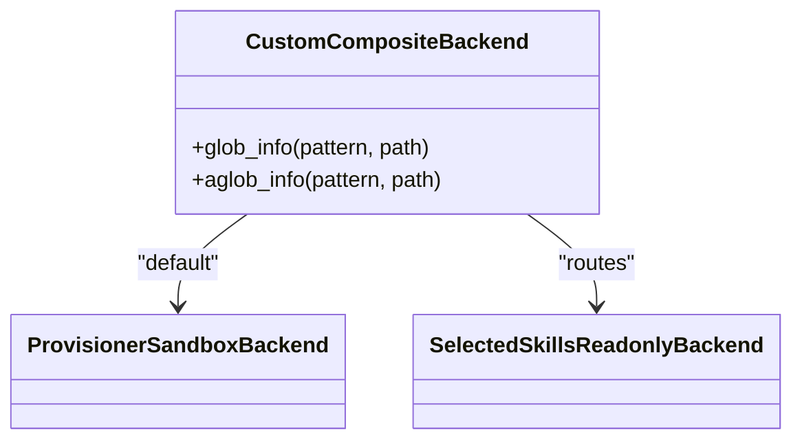

**Diagram sources**
- [backends/composite.py:18-134](file://backend/package/yuxi/agents/backends/composite.py#L18-L134)
- [backends/sandbox/backend.py:64-402](file://backend/package/yuxi/agents/backends/sandbox/backend.py#L64-L402)
- [backends/skills_backend.py:12-115](file://backend/package/yuxi/agents/backends/skills_backend.py#L12-L115)

**Section sources**
- [backends/composite.py:18-134](file://backend/package/yuxi/agents/backends/composite.py#L18-L134)

### Sandbox Environment: Secure Execution and File Operations
- ProvisionerSandboxBackend:
  - Normalizes paths and prevents traversal
  - Reads/writes/edit files, executes commands, lists/globs files
  - Uploads/downloads files with base64 encoding
  - Enforces timeouts and output truncation limits
  - Synchronizes visible skills to the sandbox

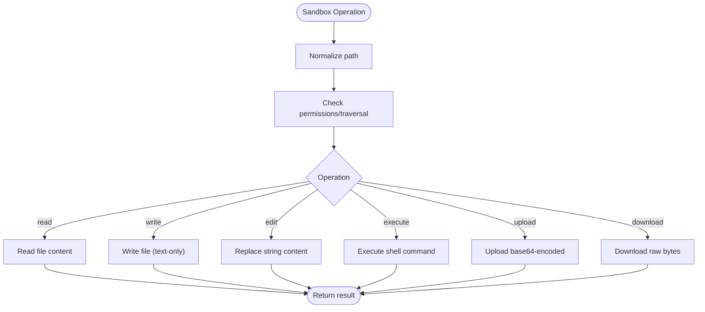

**Diagram sources**
- [backends/sandbox/backend.py:107-402](file://backend/package/yuxi/agents/backends/sandbox/backend.py#L107-L402)

**Section sources**
- [backends/sandbox/backend.py:64-402](file://backend/package/yuxi/agents/backends/sandbox/backend.py#L64-L402)

### Skills Backend: Read-Only Exposure
- SelectedSkillsReadonlyBackend:
  - Restricts access to selected skill slugs
  - Implements ls_info, read, grep_raw, glob_info, and downloads
  - Disallows writes and uploads

**Section sources**
- [backends/skills_backend.py:12-115](file://backend/package/yuxi/agents/backends/skills_backend.py#L12-L115)

### Tool Integration: Registry and Metadata
- Tool registry:
  - Decorator collects tool instances and metadata
  - Provides global access to all registered tools
- Tool info utility:
  - Extracts tool metadata and argument schemas for frontend

**Section sources**
- [toolkits/registry.py:5-97](file://backend/package/yuxi/agents/toolkits/registry.py#L5-L97)
- [toolkits/utils.py:7-56](file://backend/package/yuxi/agents/toolkits/utils.py#L7-L56)

### Sub-Agent Management
- Subagent service:
  - Initializes builtin subagents and keeps them synchronized
  - Caches subagent specs and resolves tools by name
  - CRUD operations and enabling/disabling subagents

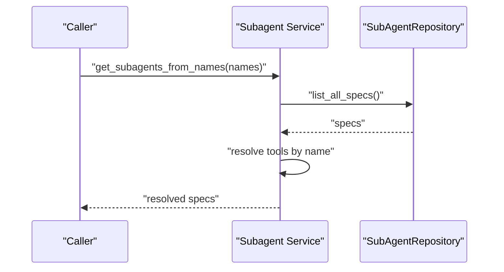

**Diagram sources**
- [services/subagent_service.py:121-149](file://backend/package/yuxi/services/subagent_service.py#L121-L149)

**Section sources**
- [services/subagent_service.py:101-249](file://backend/package/yuxi/services/subagent_service.py#L101-L249)

## Dependency Analysis
- BaseAgent depends on LangGraph checkpointer backends and context/state schemas.
- Middlewares depend on tool registries and MCP services for dynamic tool loading.
- Composite backend composes sandbox and skills backends with routing rules.
- Subagent service depends on tool registries to resolve tool names into instances.

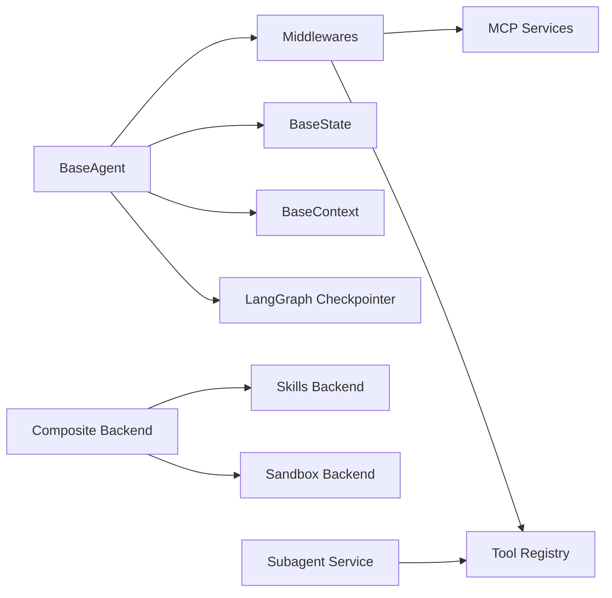

**Diagram sources**
- [base.py:17-263](file://backend/package/yuxi/agents/base.py#L17-L263)
- [middlewares/dynamic_tool_middleware.py:10-70](file://backend/package/yuxi/agents/middlewares/dynamic_tool_middleware.py#L10-L70)
- [middlewares/skills_middleware.py:145-477](file://backend/package/yuxi/agents/middlewares/skills_middleware.py#L145-L477)
- [backends/composite.py:18-134](file://backend/package/yuxi/agents/backends/composite.py#L18-L134)
- [services/subagent_service.py:121-149](file://backend/package/yuxi/services/subagent_service.py#L121-L149)

**Section sources**
- [base.py:17-263](file://backend/package/yuxi/agents/base.py#L17-L263)
- [middlewares/__init__.py:1-17](file://backend/package/yuxi/agents/middlewares/__init__.py#L1-17)
- [backends/composite.py:18-134](file://backend/package/yuxi/agents/backends/composite.py#L18-L134)
- [services/subagent_service.py:121-149](file://backend/package/yuxi/services/subagent_service.py#L121-L149)

## Performance Considerations
- Checkpointer backends:
  - Prefer Postgres for production; fallback to SQLite or memory if unavailable.
  - Configure recursion limits and streaming modes to balance responsiveness and throughput.
- Tool loading:
  - Preload MCP tools in DynamicToolMiddleware to avoid runtime latency.
  - Cache dependency maps and skill metadata to reduce repeated DB queries.
- Sandbox:
  - Enforce command timeouts and output size limits to prevent resource exhaustion.
  - Use glob_info routing fixes to minimize unnecessary cross-backend searches.
- Streaming:
  - Use stream_modes appropriate to UI needs (messages/values) to reduce payload sizes.

[No sources needed since this section provides general guidance]

## Troubleshooting Guide
- History retrieval:
  - Ensure a checkpointer is configured; otherwise history is empty.
- Sandbox failures:
  - Verify agent-sandbox dependency and sandbox URL availability.
  - Inspect path normalization and permission errors for file operations.
- Tool unavailability:
  - Confirm tools are enabled in context and MCP servers are preloaded.
- Skills activation:
  - Ensure skills are visible and dependencies are resolvable; check logs for warnings about cycles or missing targets.

**Section sources**
- [base.py:158-184](file://backend/package/yuxi/agents/base.py#L158-L184)
- [backends/sandbox/backend.py:95-105](file://backend/package/yuxi/agents/backends/sandbox/backend.py#L95-L105)
- [middlewares/dynamic_tool_middleware.py:54-61](file://backend/package/yuxi/agents/middlewares/dynamic_tool_middleware.py#L54-L61)
- [middlewares/skills_middleware.py:100-110](file://backend/package/yuxi/agents/middlewares/skills_middleware.py#L100-L110)

## Conclusion
The agent development system integrates LangGraph v1 with a robust middleware pipeline, secure sandbox execution, and flexible sub-agent management. Developers can compose agents by extending BaseAgent, configuring BaseContext, selecting tools via middlewares, and orchestrating subagents through the service layer. The composite backend ensures safe and controlled access to skills and knowledge resources, while state and artifacts support long-running, artifact-rich workflows.

[No sources needed since this section summarizes without analyzing specific files]

## Appendices

### Practical Examples (by code path)
- Create a custom agent:
  - Extend BaseAgent and implement get_graph to compile a LangGraph with a checkpointer.
  - Reference: [base.py:190-197](file://backend/package/yuxi/agents/base.py#L190-L197)
- Configure skills:
  - Set skills and mcps in BaseContext; SkillsMiddleware will inject prompts and load dependencies.
  - Reference: [context.py:80-89](file://backend/package/yuxi/agents/context.py#L80-L89), [middlewares/skills_middleware.py:175-272](file://backend/package/yuxi/agents/middlewares/skills_middleware.py#L175-L272)
- Implement middleware:
  - Use DynamicToolMiddleware to filter tools by runtime context.
  - Reference: [middlewares/dynamic_tool_middleware.py:40-70](file://backend/package/yuxi/agents/middlewares/dynamic_tool_middleware.py#L40-L70)
- Sandbox execution:
  - Execute commands and manage files via ProvisionerSandboxBackend.
  - Reference: [backends/sandbox/backend.py:171-200](file://backend/package/yuxi/agents/backends/sandbox/backend.py#L171-L200)
- Attachment handling and artifacts:
  - Use BaseState.artifacts to track file paths; composite backend routes file operations.
  - Reference: [state.py:22](file://backend/package/yuxi/agents/state.py#L22), [backends/composite.py:122-134](file://backend/package/yuxi/agents/backends/composite.py#L122-L134)
- Sub-agent orchestration:
  - Resolve subagents by name and inject tools; manage lifecycle via subagent service.
  - Reference: [services/subagent_service.py:121-149](file://backend/package/yuxi/services/subagent_service.py#L121-L149)