# Agent Framework Overview

<cite>
**Referenced Files in This Document**
- [base.py](file://backend/package/yuxi/agents/base.py)
- [context.py](file://backend/package/yuxi/agents/context.py)
- [state.py](file://backend/package/yuxi/agents/state.py)
- [models.py](file://backend/package/yuxi/agents/models.py)
- [__init__.py](file://backend/package/yuxi/agents/__init__.py)
- [graph.py](file://backend/package/yuxi/agents/buildin/deep_agent/graph.py)
- [__init__.py](file://backend/package/yuxi/agents/buildin/deep_agent/__init__.py)
- [skills_middleware.py](file://backend/package/yuxi/agents/middlewares/skills_middleware.py)
- [knowledge_base_middleware.py](file://backend/package/yuxi/agents/middlewares/knowledge_base_middleware.py)
- [context_middlewares.py](file://backend/package/yuxi/agents/middlewares/context_middlewares.py)
- [composite.py](file://backend/package/yuxi/agents/backends/composite.py)
- [registry.py](file://backend/package/yuxi/agents/toolkits/registry.py)
</cite>

## Table of Contents
1. [Introduction](#introduction)
2. [Project Structure](#project-structure)
3. [Core Components](#core-components)
4. [Architecture Overview](#architecture-overview)
5. [Detailed Component Analysis](#detailed-component-analysis)
6. [Dependency Analysis](#dependency-analysis)
7. [Performance Considerations](#performance-considerations)
8. [Troubleshooting Guide](#troubleshooting-guide)
9. [Conclusion](#conclusion)
10. [Appendices](#appendices)

## Introduction
This document explains the agent framework’s foundational architecture and operational patterns. It focuses on the BaseAgent class as the core abstraction for all agent implementations, the agent lifecycle from initialization through execution, context and state management, metadata and capability declarations, and how agents integrate with middlewares, backends, and toolkits. Practical usage patterns and registration mechanisms are included to help developers implement and deploy new agents effectively.

## Project Structure
The agent framework is organized around a small set of core abstractions and a rich ecosystem of middlewares, backends, and toolkits. The most important modules are:
- BaseAgent: The abstract base class that defines the agent interface and lifecycle.
- BaseContext: The typed configuration schema passed into agent graphs at runtime.
- BaseState: The shared state schema used across agents.
- Middlewares: Extensible components that augment agent behavior (skills, knowledge base, runtime configuration, summarization, etc.).
- Backends: Pluggable storage and routing backends for file systems, knowledge bases, and sandbox environments.
- Toolkits: Registry and decorators for tools, with automatic discovery and metadata collection.
- Models: Unified model loading utilities for various providers.

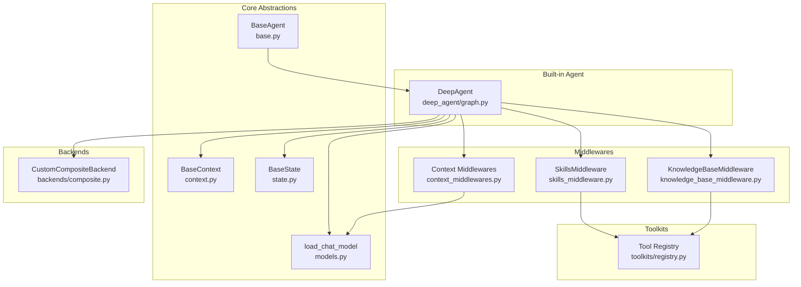

**Diagram sources**
- [base.py:17-263](file://backend/package/yuxi/agents/base.py#L17-L263)
- [context.py:11-191](file://backend/package/yuxi/agents/context.py#L11-L191)
- [state.py:19-31](file://backend/package/yuxi/agents/state.py#L19-L31)
- [models.py:12-58](file://backend/package/yuxi/agents/models.py#L12-L58)
- [graph.py:27-124](file://backend/package/yuxi/agents/buildin/deep_agent/graph.py#L27-L124)
- [skills_middleware.py:145-477](file://backend/package/yuxi/agents/middlewares/skills_middleware.py#L145-L477)
- [knowledge_base_middleware.py:12-33](file://backend/package/yuxi/agents/middlewares/knowledge_base_middleware.py#L12-L33)
- [context_middlewares.py:11-26](file://backend/package/yuxi/agents/middlewares/context_middlewares.py#L11-L26)
- [composite.py:18-134](file://backend/package/yuxi/agents/backends/composite.py#L18-L134)
- [registry.py:38-97](file://backend/package/yuxi/agents/toolkits/registry.py#L38-L97)

**Section sources**
- [__init__.py:1-29](file://backend/package/yuxi/agents/__init__.py#L1-L29)

## Core Components
- BaseAgent: Defines the agent contract, lifecycle hooks, streaming and invocation APIs, and persistence via checkpointer backends (SQLite, Postgres, or memory).
- BaseContext: A typed dataclass that carries runtime configuration such as thread identifiers, user identifiers, system prompts, model selection, tools, knowledge bases, MCP servers, skills, subagents, and summarization thresholds.
- BaseState: A shared state schema extending AgentState with artifact tracking.
- Model loader: A unified function to initialize chat models from provider-specific configurations.

Key responsibilities:
- BaseAgent orchestrates graph compilation, streaming, invocation, history retrieval, and persistence.
- BaseContext provides a schema-driven configuration surface with metadata for UI rendering and validation.
- BaseState standardizes stateful artifacts across agents.
- Models loader encapsulates provider-specific initialization and environment variable handling.

**Section sources**
- [base.py:17-263](file://backend/package/yuxi/agents/base.py#L17-L263)
- [context.py:11-191](file://backend/package/yuxi/agents/context.py#L11-L191)
- [state.py:19-31](file://backend/package/yuxi/agents/state.py#L19-L31)
- [models.py:12-58](file://backend/package/yuxi/agents/models.py#L12-L58)

## Architecture Overview
The agent framework is built on LangGraph’s CompiledStateGraph. Agents declare capabilities and metadata, configure runtime context, and compose middleware stacks to extend behavior. The graph is compiled with a checkpointer to support state persistence and history retrieval. Backends provide secure, routed access to file systems, knowledge bases, and sandbox environments. Toolkits register tools with metadata for discoverability and UI presentation.

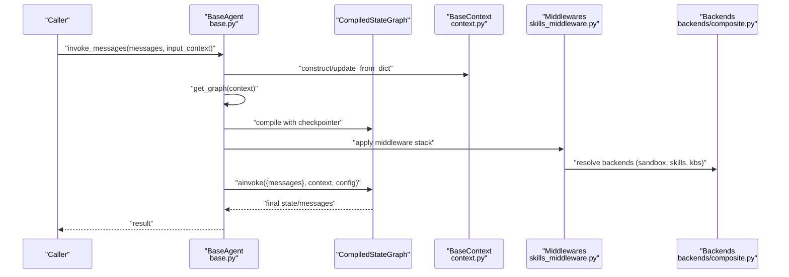

**Diagram sources**
- [base.py:125-150](file://backend/package/yuxi/agents/base.py#L125-L150)
- [context.py:186-191](file://backend/package/yuxi/agents/context.py#L186-L191)
- [skills_middleware.py:145-272](file://backend/package/yuxi/agents/middlewares/skills_middleware.py#L145-L272)
- [composite.py:122-134](file://backend/package/yuxi/agents/backends/composite.py#L122-L134)

## Detailed Component Analysis

### BaseAgent: Lifecycle, Streaming, Invocation, Persistence
BaseAgent centralizes agent lifecycle and execution:
- Initialization: Creates a working directory under a per-agent module path and prepares persistence resources.
- Metadata exposure: Provides agent metadata and configurable items derived from the context schema.
- Execution: Supports streaming values, streaming messages, streaming with state, and single-shot invocation.
- Persistence: Selects a checkpointer backend (Postgres, SQLite, or memory) and exposes history retrieval.
- Graph lifecycle: Enforces that subclasses compile graphs with a checkpointer to enable state restoration.

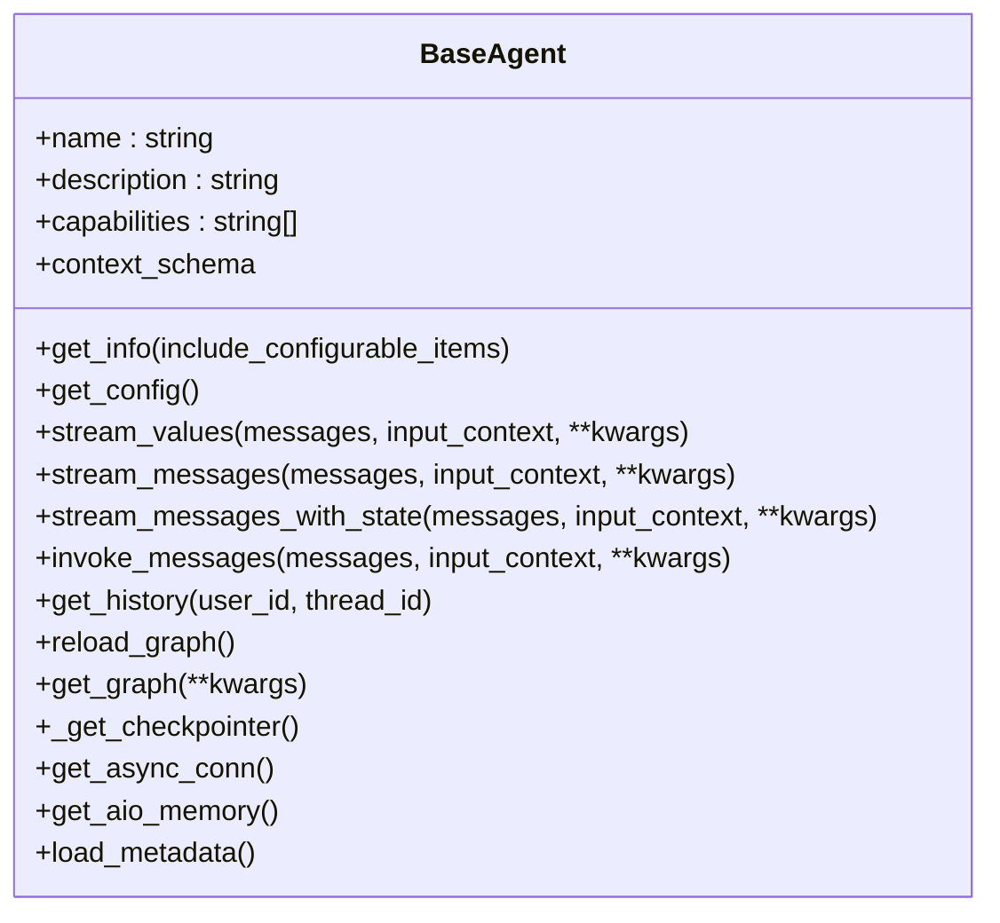

**Diagram sources**
- [base.py:17-263](file://backend/package/yuxi/agents/base.py#L17-L263)

**Section sources**
- [base.py:27-60](file://backend/package/yuxi/agents/base.py#L27-L60)
- [base.py:64-150](file://backend/package/yuxi/agents/base.py#L64-L150)
- [base.py:158-184](file://backend/package/yuxi/agents/base.py#L158-L184)
- [base.py:199-254](file://backend/package/yuxi/agents/base.py#L199-L254)
- [base.py:256-263](file://backend/package/yuxi/agents/base.py#L256-L263)

### BaseContext: Typed Runtime Configuration
BaseContext defines a strongly-typed configuration surface:
- Identity fields: thread_id and user_id for conversation threading and user scoping.
- Prompting and model: system_prompt and model selection with provider-specific metadata.
- Tooling: tools list and dynamic tool injection via middlewares.
- Knowledge and MCP: lists of knowledge bases and MCP servers with dynamic resolution.
- Skills and subagents: lists of skills and subagents with defaults and UI metadata.
- Summarization threshold: controls when context offloading is triggered.

It also provides:
- get_configurable_items(): introspects fields and extracts UI-friendly metadata, including type inference and template hints.
- update_from_dict(): merges runtime configuration into the context.

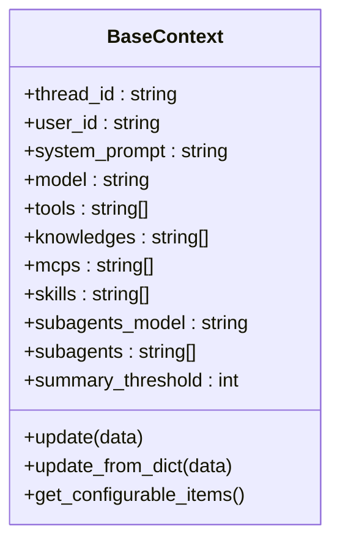

**Diagram sources**
- [context.py:11-191](file://backend/package/yuxi/agents/context.py#L11-L191)

**Section sources**
- [context.py:27-116](file://backend/package/yuxi/agents/context.py#L27-L116)
- [context.py:118-149](file://backend/package/yuxi/agents/context.py#L118-L149)
- [context.py:186-191](file://backend/package/yuxi/agents/context.py#L186-L191)

### BaseState and Artifacts
BaseState extends AgentState with an artifacts field annotated with a merge function to preserve ordering and deduplicate file paths. AgentStatePayload describes serialized state consumable by the frontend.

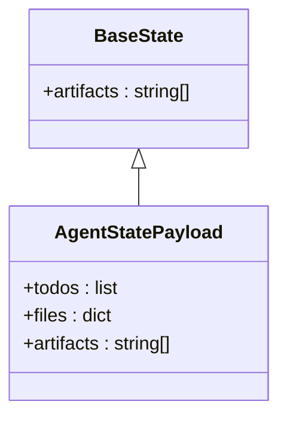

**Diagram sources**
- [state.py:19-31](file://backend/package/yuxi/agents/state.py#L19-L31)

**Section sources**
- [state.py:10-17](file://backend/package/yuxi/agents/state.py#L10-L17)
- [state.py:25-31](file://backend/package/yuxi/agents/state.py#L25-L31)

### Model Loader: Provider-Agnostic Chat Model Initialization
The model loader resolves provider-specific initialization, environment variables, and base URLs. It supports official providers and others via LangChain integrations.

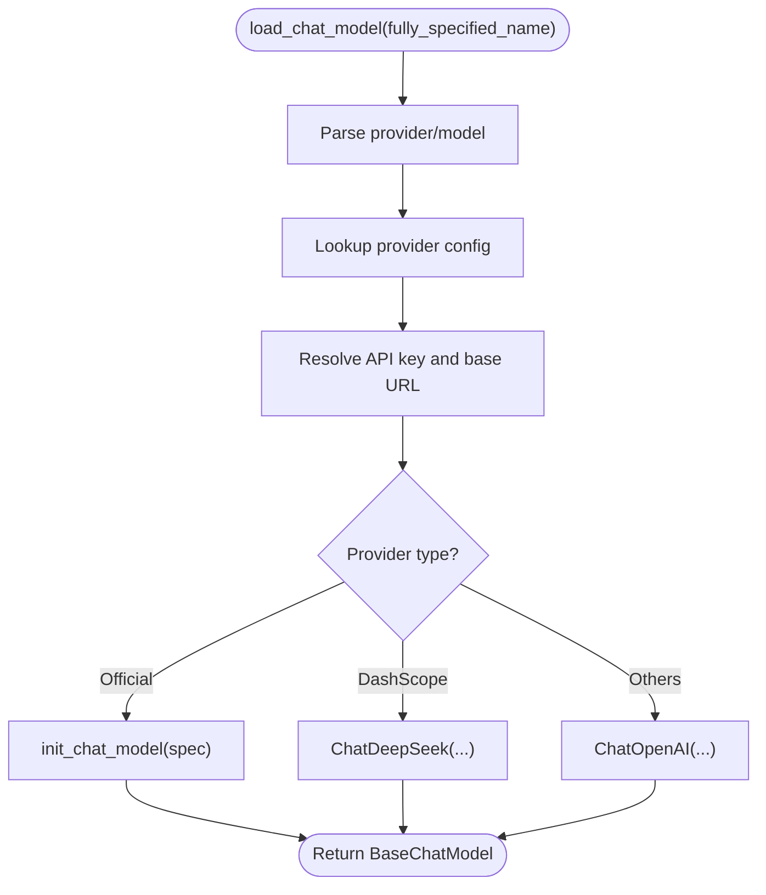

**Diagram sources**
- [models.py:12-58](file://backend/package/yuxi/agents/models.py#L12-L58)

**Section sources**
- [models.py:12-58](file://backend/package/yuxi/agents/models.py#L12-L58)

### Built-in Agent Example: DeepAgent
DeepAgent demonstrates a real-world agent implementation:
- Declares name, description, capabilities, and metadata.
- Builds a system prompt by combining a deep prompt with the runtime context’s system prompt.
- Loads models for the main agent and subagents.
- Composes a middleware pipeline including filesystem, runtime configuration, skills, knowledge base, subagents, and summarization.
- Compiles the graph with a checkpointer and returns it.

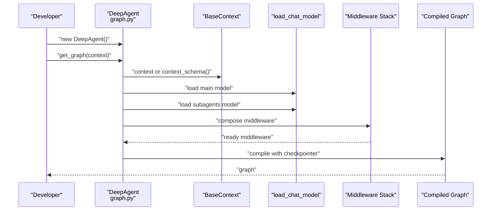

**Diagram sources**
- [graph.py:27-124](file://backend/package/yuxi/agents/buildin/deep_agent/graph.py#L27-L124)

**Section sources**
- [graph.py:27-124](file://backend/package/yuxi/agents/buildin/deep_agent/graph.py#L27-L124)
- [__init__.py:14-23](file://backend/package/yuxi/agents/buildin/deep_agent/__init__.py#L14-L23)

### Middlewares: Capabilities and Behavior Extension
- SkillsMiddleware: Injects skills prompts, expands dependencies, dynamically activates skills, and loads tools and MCP servers accordingly.
- KnowledgeBaseMiddleware: Provides common knowledge base tools and resolves visible knowledge bases for the runtime context.
- Context Middlewares: Dynamically adjust system prompts and model selection based on runtime context.

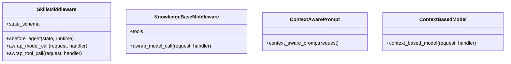

**Diagram sources**
- [skills_middleware.py:145-477](file://backend/package/yuxi/agents/middlewares/skills_middleware.py#L145-L477)
- [knowledge_base_middleware.py:12-33](file://backend/package/yuxi/agents/middlewares/knowledge_base_middleware.py#L12-L33)
- [context_middlewares.py:11-26](file://backend/package/yuxi/agents/middlewares/context_middlewares.py#L11-L26)

**Section sources**
- [skills_middleware.py:145-272](file://backend/package/yuxi/agents/middlewares/skills_middleware.py#L145-L272)
- [knowledge_base_middleware.py:12-33](file://backend/package/yuxi/agents/middlewares/knowledge_base_middleware.py#L12-L33)
- [context_middlewares.py:11-26](file://backend/package/yuxi/agents/middlewares/context_middlewares.py#L11-L26)

### Backends: Composite Routing and Access Control
The composite backend routes requests across multiple backends:
- Default: Sandbox backend scoped to thread and user with visible skills.
- Routes: Read-only access to selected skills and knowledge bases resolved from runtime context.

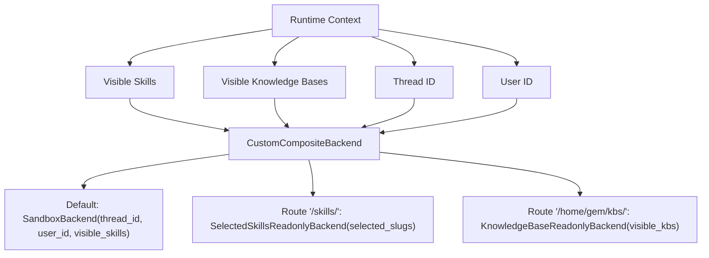

**Diagram sources**
- [composite.py:18-134](file://backend/package/yuxi/agents/backends/composite.py#L18-L134)

**Section sources**
- [composite.py:122-134](file://backend/package/yuxi/agents/backends/composite.py#L122-L134)

### Toolkits: Registration and Metadata
The toolkit registry enables:
- Defining tools with extra metadata (category, tags, display name, icon, configuration guide).
- Automatic collection of tool instances for dynamic activation.
- Discovery and UI presentation of tools.

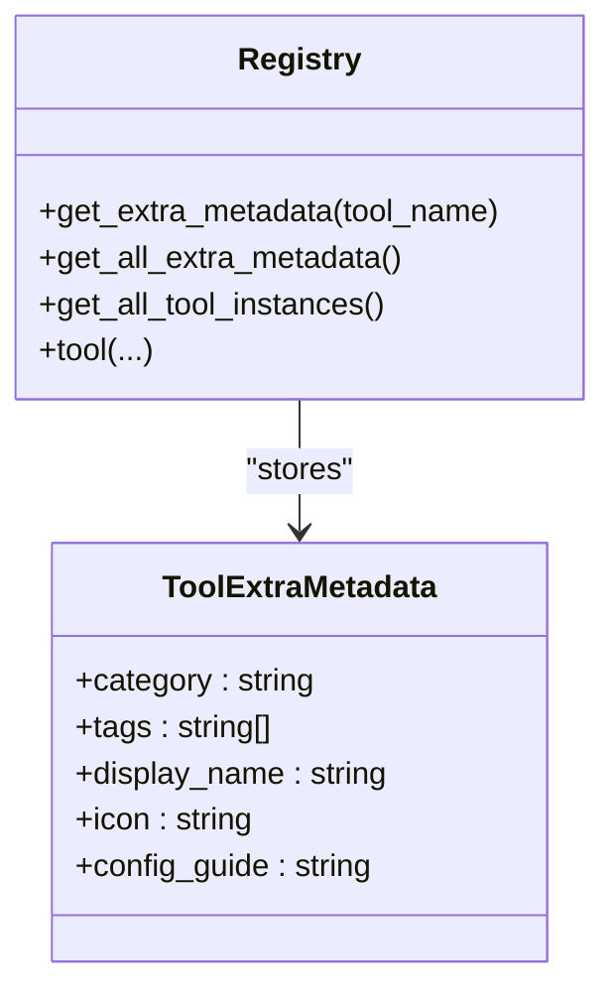

**Diagram sources**
- [registry.py:5-97](file://backend/package/yuxi/agents/toolkits/registry.py#L5-L97)

**Section sources**
- [registry.py:38-97](file://backend/package/yuxi/agents/toolkits/registry.py#L38-L97)

## Dependency Analysis
The framework exhibits layered cohesion:
- BaseAgent depends on BaseContext, BaseState, and model loading utilities.
- Built-in agents depend on middlewares and backends to assemble capabilities.
- Middlewares depend on toolkits and services for dynamic tool activation and MCP integration.
- Backends depend on runtime context to resolve visibility and routing.

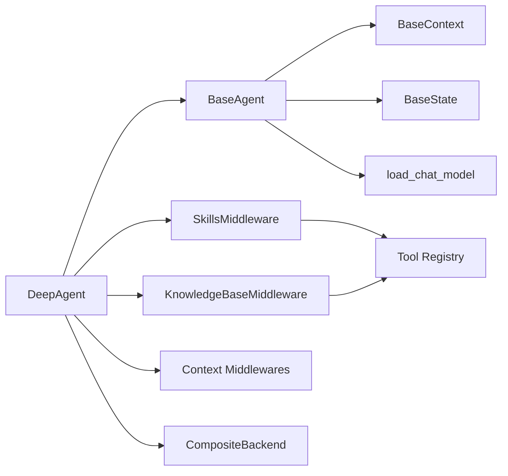

**Diagram sources**
- [base.py:17-263](file://backend/package/yuxi/agents/base.py#L17-L263)
- [graph.py:27-124](file://backend/package/yuxi/agents/buildin/deep_agent/graph.py#L27-L124)
- [skills_middleware.py:145-477](file://backend/package/yuxi/agents/middlewares/skills_middleware.py#L145-L477)
- [knowledge_base_middleware.py:12-33](file://backend/package/yuxi/agents/middlewares/knowledge_base_middleware.py#L12-L33)
- [context_middlewares.py:11-26](file://backend/package/yuxi/agents/middlewares/context_middlewares.py#L11-L26)
- [composite.py:122-134](file://backend/package/yuxi/agents/backends/composite.py#L122-L134)
- [registry.py:38-97](file://backend/package/yuxi/agents/toolkits/registry.py#L38-L97)

**Section sources**
- [__init__.py:1-29](file://backend/package/yuxi/agents/__init__.py#L1-L29)

## Performance Considerations
- Streaming vs. single-shot: Prefer streaming APIs for long-running tasks to reduce latency and improve responsiveness.
- Checkpointer selection: Use Postgres-backed checkpointer in production for reliability; fall back to SQLite or memory when unavailable.
- Middleware overhead: Skills and knowledge base middlewares add dynamic resolution; tune thresholds and limits to avoid excessive tool activation.
- Summarization offload: Configure summary thresholds to keep context windows manageable for long conversations.
- Backend routing: Composite backend routing is efficient but ensure thread and user scoping avoids unnecessary cross-backend scans.

## Troubleshooting Guide
Common issues and resolutions:
- Missing or invalid checkpointer: Ensure get_graph compiles with a checkpointer; BaseAgent falls back to memory if needed.
- History retrieval errors: Verify thread_id and user_id are present in runtime configuration; handle empty histories gracefully.
- Skills not activating: Confirm skills are configured and visible; inspect middleware logs for dependency resolution and dynamic activation.
- MCP tool availability: Ensure MCP servers are reachable and enabled; verify tool loading and merging logic.
- Model provider errors: Validate provider configuration and environment variables; confirm base URLs and API keys.

**Section sources**
- [base.py:158-184](file://backend/package/yuxi/agents/base.py#L158-L184)
- [skills_middleware.py:216-272](file://backend/package/yuxi/agents/middlewares/skills_middleware.py#L216-L272)
- [knowledge_base_middleware.py:28-33](file://backend/package/yuxi/agents/middlewares/knowledge_base_middleware.py#L28-L33)
- [models.py:12-58](file://backend/package/yuxi/agents/models.py#L12-L58)

## Conclusion
The agent framework centers on BaseAgent as a robust, extensible foundation. Through typed contexts, standardized state, provider-agnostic model loading, and a modular middleware/backends/toolkit ecosystem, it enables consistent agent behavior, powerful capabilities, and seamless integration. Developers can implement new agents by extending BaseAgent, composing middlewares, and leveraging backends and toolkits tailored to their use cases.

## Appendices

### Agent Lifecycle: From Initialization to Execution
- Initialization: BaseAgent sets up working directories and persistence resources.
- Configuration: BaseContext is constructed and updated from input; configurable items are exposed for UI.
- Graph compilation: get_graph builds the middleware stack, loads models, and compiles the graph with a checkpointer.
- Execution: Invoke or stream messages; BaseAgent manages runtime configuration, callbacks, and metadata.
- Persistence: Retrieve history using thread_id and user_id; manage checkpointer backends.

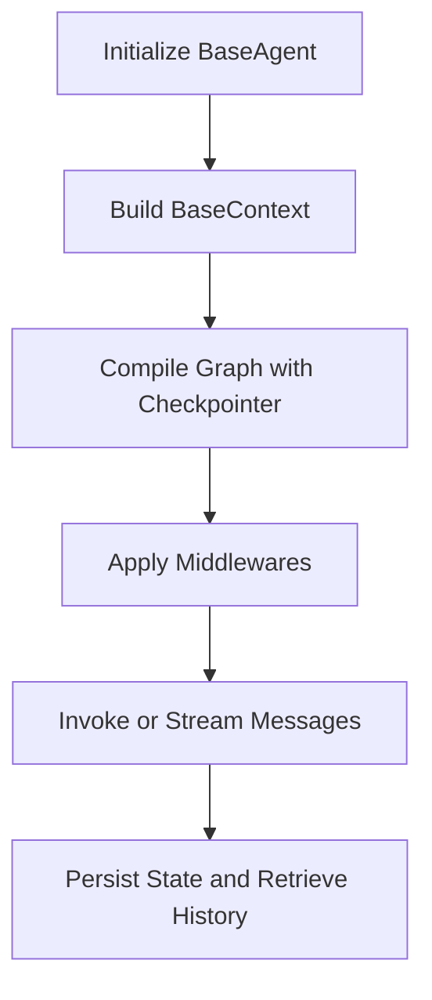

**Diagram sources**
- [base.py:27-60](file://backend/package/yuxi/agents/base.py#L27-L60)
- [base.py:64-150](file://backend/package/yuxi/agents/base.py#L64-L150)
- [base.py:158-184](file://backend/package/yuxi/agents/base.py#L158-L184)

### Practical Usage Patterns
- Instantiate and configure:
  - Construct a BaseContext with desired fields and update from a dictionary.
  - Call get_config to obtain a typed configuration instance.
- Execute:
  - Use stream_messages or invoke_messages with optional callbacks, metadata, and tags.
- Expose metadata and capabilities:
  - Call get_info to retrieve agent metadata, capabilities, and configurable items.
- Manage state and history:
  - Use get_history with thread_id and user_id to retrieve persisted messages.

**Section sources**
- [base.py:44-59](file://backend/package/yuxi/agents/base.py#L44-L59)
- [base.py:64-150](file://backend/package/yuxi/agents/base.py#L64-L150)
- [base.py:158-184](file://backend/package/yuxi/agents/base.py#L158-L184)
- [context.py:186-191](file://backend/package/yuxi/agents/context.py#L186-L191)

### Agent Registration and Integration
- Built-in agents are surfaced via their package’s __init__ exports.
- Toolkits auto-register tools via decorators; middleware consumes registered tools and MCP servers.
- Backends are resolved per-runtime to enforce visibility and access control.

**Section sources**
- [__init__.py:14-23](file://backend/package/yuxi/agents/buildin/deep_agent/__init__.py#L14-L23)
- [registry.py:38-97](file://backend/package/yuxi/agents/toolkits/registry.py#L38-L97)
- [composite.py:122-134](file://backend/package/yuxi/agents/backends/composite.py#L122-L134)