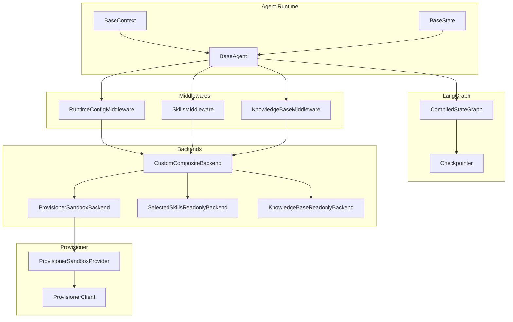
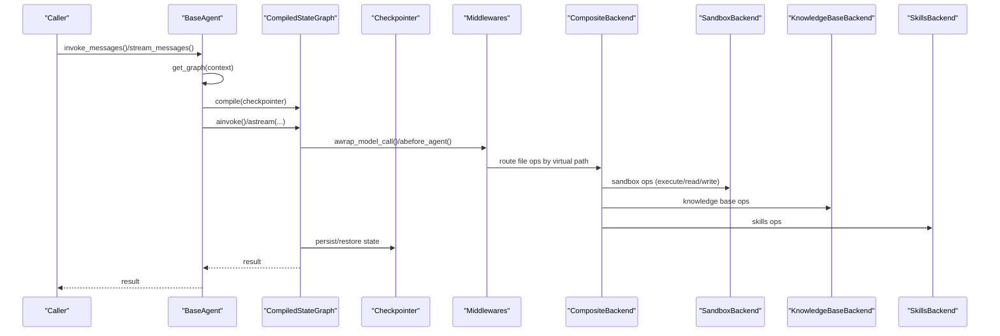
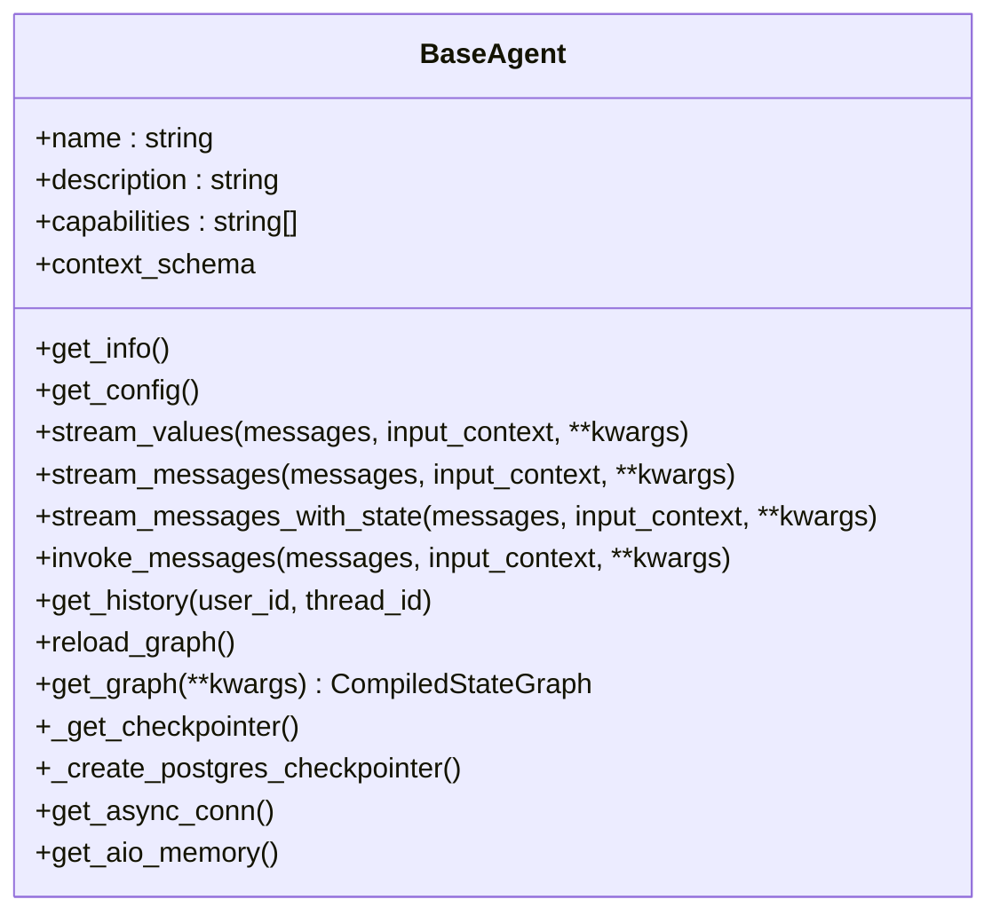
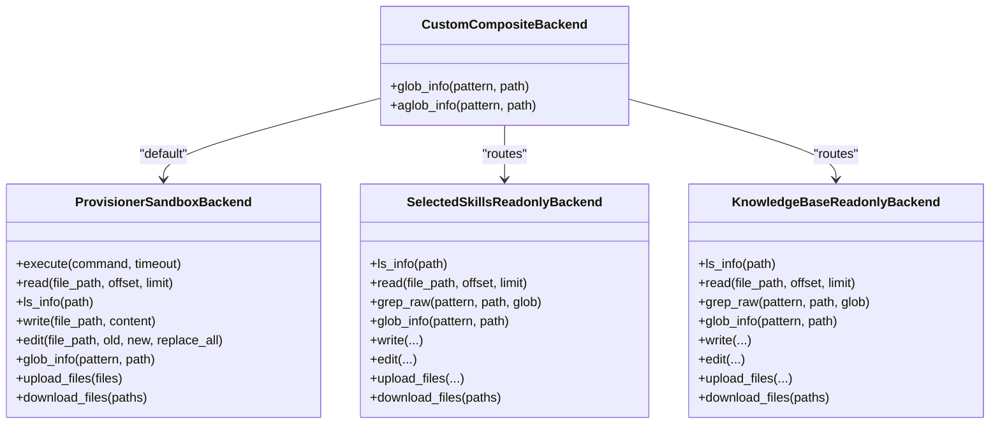
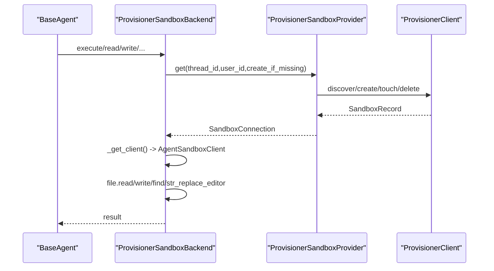
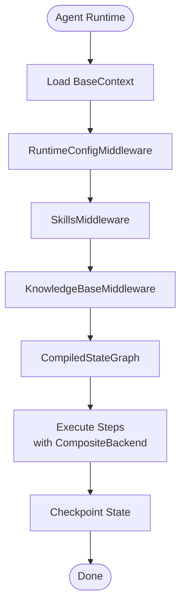
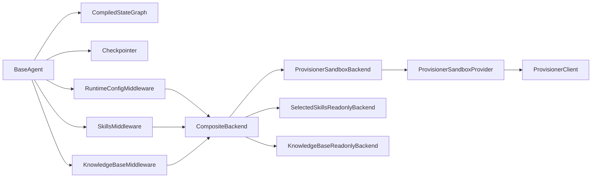

# LangGraph Integration

<cite>
**Referenced Files in This Document**
- [base.py](file://backend/package/yuxi/agents/base.py)
- [composite.py](file://backend/package/yuxi/agents/backends/composite.py)
- [skills_backend.py](file://backend/package/yuxi/agents/backends/skills_backend.py)
- [knowledge_base_backend.py](file://backend/package/yuxi/agents/backends/knowledge_base_backend.py)
- [backend.py](file://backend/package/yuxi/agents/backends/sandbox/backend.py)
- [provider.py](file://backend/package/yuxi/agents/backends/sandbox/provider.py)
- [provisioner_client.py](file://backend/package/yuxi/agents/backends/sandbox/provisioner_client.py)
- [paths.py](file://backend/package/yuxi/agents/backends/sandbox/paths.py)
- [skills_middleware.py](file://backend/package/yuxi/agents/middlewares/skills_middleware.py)
- [runtime_config_middleware.py](file://backend/package/yuxi/agents/middlewares/runtime_config_middleware.py)
- [knowledge_base_middleware.py](file://backend/package/yuxi/agents/middlewares/knowledge_base_middleware.py)
- [state.py](file://backend/package/yuxi/agents/state.py)
- [context.py](file://backend/package/yuxi/agents/context.py)
</cite>

## Table of Contents
1. [Introduction](#introduction)
2. [Project Structure](#project-structure)
3. [Core Components](#core-components)
4. [Architecture Overview](#architecture-overview)
5. [Detailed Component Analysis](#detailed-component-analysis)
6. [Dependency Analysis](#dependency-analysis)
7. [Performance Considerations](#performance-considerations)
8. [Troubleshooting Guide](#troubleshooting-guide)
9. [Conclusion](#conclusion)

## Introduction
This document explains how LangGraph v1 is integrated into the Yuxi agent system to provide stateful agent orchestration. It covers graph compilation, checkpointing mechanisms, and state management. It also documents the composite backend system that allows agents to combine multiple execution backends, including the skills backend for tool execution, the knowledge base backend for retrieval-augmented generation, and the provisioning system for sandboxed execution. Concrete examples show how to construct graphs, configure state persistence, and manage checkpoints. Finally, it outlines performance considerations, memory management, and scaling strategies for complex agent workflows.

## Project Structure
The LangGraph integration centers around:
- Agent base classes and graph lifecycle management
- Middleware pipeline for runtime configuration, skills, and knowledge base
- Backends for sandbox execution, skills, and knowledge base
- Provisioning system for sandbox allocation and lifecycle

**Diagram sources**
- [base.py:17-263](file://backend/package/yuxi/agents/base.py#L17-L263)
- [composite.py:122-134](file://backend/package/yuxi/agents/backends/composite.py#L122-L134)
- [skills_backend.py:12-115](file://backend/package/yuxi/agents/backends/skills_backend.py#L12-L115)
- [knowledge_base_backend.py:135-460](file://backend/package/yuxi/agents/backends/knowledge_base_backend.py#L135-L460)
- [backend.py:64-402](file://backend/package/yuxi/agents/backends/sandbox/backend.py#L64-L402)
- [provider.py:27-171](file://backend/package/yuxi/agents/backends/sandbox/provider.py#L27-L171)
- [provisioner_client.py:15-73](file://backend/package/yuxi/agents/backends/sandbox/provisioner_client.py#L15-L73)

**Section sources**
- [base.py:17-263](file://backend/package/yuxi/agents/base.py#L17-L263)
- [composite.py:122-134](file://backend/package/yuxi/agents/backends/composite.py#L122-L134)

## Core Components
- BaseAgent: Orchestrates graph compilation, streaming, invocation, and checkpointing. It selects a checkpointer backend (SQLite, Postgres, or in-memory) and manages async connections.
- BaseContext: Defines configurable parameters for agent runs, including thread_id, user_id, system_prompt, model, tools, knowledges, mcps, skills, subagents, and summary threshold.
- BaseState: Defines shared state fields, including artifacts for tracking produced file paths.
- Middlewares: Provide runtime configuration, skills injection and expansion, and knowledge base tool availability.
- Composite Backend: Routes file operations across sandbox, skills, and knowledge base backends based on virtual paths.
- Backends:
  - ProvisionerSandboxBackend: Executes commands and reads/writes files inside a provisioned sandbox.
  - SelectedSkillsReadonlyBackend: Exposes only selected skills in a read-only manner.
  - KnowledgeBaseReadonlyBackend: Materializes and exposes user-visible knowledge base files in a read-only manner.

**Section sources**
- [base.py:17-263](file://backend/package/yuxi/agents/base.py#L17-L263)
- [context.py:11-191](file://backend/package/yuxi/agents/context.py#L11-L191)
- [state.py:19-31](file://backend/package/yuxi/agents/state.py#L19-L31)
- [skills_middleware.py:145-477](file://backend/package/yuxi/agents/middlewares/skills_middleware.py#L145-L477)
- [runtime_config_middleware.py:16-162](file://backend/package/yuxi/agents/middlewares/runtime_config_middleware.py#L16-L162)
- [knowledge_base_middleware.py:12-33](file://backend/package/yuxi/agents/middlewares/knowledge_base_middleware.py#L12-L33)
- [composite.py:18-134](file://backend/package/yuxi/agents/backends/composite.py#L18-L134)
- [skills_backend.py:12-115](file://backend/package/yuxi/agents/backends/skills_backend.py#L12-L115)
- [knowledge_base_backend.py:135-460](file://backend/package/yuxi/agents/backends/knowledge_base_backend.py#L135-L460)
- [backend.py:64-402](file://backend/package/yuxi/agents/backends/sandbox/backend.py#L64-L402)

## Architecture Overview
LangGraph’s CompiledStateGraph is the central runtime for Yuxi agents. BaseAgent compiles the graph and injects a checkpointer. During execution, middlewares enrich the runtime context (model, tools, system prompt, skills visibility, knowledge base visibility). The composite backend resolves file operations to the appropriate backend based on virtual paths.

**Diagram sources**
- [base.py:64-150](file://backend/package/yuxi/agents/base.py#L64-L150)
- [composite.py:122-134](file://backend/package/yuxi/agents/backends/composite.py#L122-L134)
- [backend.py:171-200](file://backend/package/yuxi/agents/backends/sandbox/backend.py#L171-L200)
- [knowledge_base_backend.py:351-372](file://backend/package/yuxi/agents/backends/knowledge_base_backend.py#L351-L372)
- [skills_backend.py:61-82](file://backend/package/yuxi/agents/backends/skills_backend.py#L61-L82)

## Detailed Component Analysis

### BaseAgent: Graph Compilation, Streaming, Invocation, and Checkpointing
- Responsibilities:
  - Build runtime context from BaseContext
  - Compile CompiledStateGraph with a checkpointer
  - Stream values/messages and optionally include state
  - Invoke graph synchronously
  - Retrieve history via checkpointer
  - Manage checkpointer selection and async SQLite connection
- Key behaviors:
  - Configurable thread_id and user_id passed to LangGraph config
  - Supports callbacks, metadata, and tags propagation
  - Checkpointer selection:
    - Environment variable chooses backend (sqlite/postgres/memory)
    - Postgres fallback if unavailable
    - SQLite with aiofiles and patched connection if needed
- Example paths:
  - Streaming: [stream_messages:71-98](file://backend/package/yuxi/agents/base.py#L71-L98)
  - Invocation: [invoke_messages:125-150](file://backend/package/yuxi/agents/base.py#L125-L150)
  - History: [get_history:158-184](file://backend/package/yuxi/agents/base.py#L158-L184)
  - Checkpointer creation: [_get_checkpointer:199-217](file://backend/package/yuxi/agents/base.py#L199-L217), [_create_postgres_checkpointer:219-239](file://backend/package/yuxi/agents/base.py#L219-L239)

**Diagram sources**
- [base.py:17-263](file://backend/package/yuxi/agents/base.py#L17-L263)

**Section sources**
- [base.py:64-150](file://backend/package/yuxi/agents/base.py#L64-L150)
- [base.py:158-239](file://backend/package/yuxi/agents/base.py#L158-L239)

### Composite Backend: Multi-backend Routing and Virtual Paths
- Purpose:
  - Route file operations to default or routed backends based on virtual path prefixes
  - Fix glob_info routing to avoid scanning all routes when path does not match
- Routing:
  - Default: ProvisionerSandboxBackend (thread-scoped sandbox)
  - Routes:
    - "/skills/": SelectedSkillsReadonlyBackend (visible skills)
    - "/home/gem/kbs/": KnowledgeBaseReadonlyBackend (visible knowledge bases)
- Helpers:
  - Extract thread_id and user_id from runtime/configurable context
  - Normalize visible skills and knowledge bases for runtime

**Diagram sources**
- [composite.py:18-134](file://backend/package/yuxi/agents/backends/composite.py#L18-L134)
- [skills_backend.py:12-115](file://backend/package/yuxi/agents/backends/skills_backend.py#L12-L115)
- [knowledge_base_backend.py:135-460](file://backend/package/yuxi/agents/backends/knowledge_base_backend.py#L135-L460)
- [backend.py:64-402](file://backend/package/yuxi/agents/backends/sandbox/backend.py#L64-L402)

**Section sources**
- [composite.py:18-134](file://backend/package/yuxi/agents/backends/composite.py#L18-L134)
- [skills_backend.py:12-115](file://backend/package/yuxi/agents/backends/skills_backend.py#L12-L115)
- [knowledge_base_backend.py:135-460](file://backend/package/yuxi/agents/backends/knowledge_base_backend.py#L135-L460)
- [backend.py:64-402](file://backend/package/yuxi/agents/backends/sandbox/backend.py#L64-L402)

### ProvisionerSandboxBackend: Sandboxed Execution and File Operations
- Responsibilities:
  - Provision and reuse sandboxes per thread
  - Execute shell commands with timeouts and output limits
  - Read/write/edit files, search content, upload/download payloads
  - Normalize binary/text responses and enforce path safety
- Sandbox lifecycle:
  - Provider allocates/reuses sandbox per thread_id
  - Keepalive touches maintained via periodic intervals
- Safety:
  - Path normalization and traversal checks
  - Binary detection and safe text rendering
  - Error mapping to user-friendly messages

**Diagram sources**
- [backend.py:95-105](file://backend/package/yuxi/agents/backends/sandbox/backend.py#L95-L105)
- [provider.py:103-129](file://backend/package/yuxi/agents/backends/sandbox/provider.py#L103-L129)
- [provisioner_client.py:32-66](file://backend/package/yuxi/agents/backends/sandbox/provisioner_client.py#L32-L66)

**Section sources**
- [backend.py:64-402](file://backend/package/yuxi/agents/backends/sandbox/backend.py#L64-L402)
- [provider.py:27-171](file://backend/package/yuxi/agents/backends/sandbox/provider.py#L27-L171)
- [provisioner_client.py:15-73](file://backend/package/yuxi/agents/backends/sandbox/provisioner_client.py#L15-L73)
- [paths.py:12-136](file://backend/package/yuxi/agents/backends/sandbox/paths.py#L12-L136)

### Skills Backend: Read-only Exposure of Selected Skills
- Purpose:
  - Expose only selected skills to the agent runtime
  - Enforce path-based access control
  - Support listing, reading, searching, and downloading within allowed slugs
- Behavior:
  - Validates skill slugs and filters paths accordingly
  - Disallows writes and uploads

**Section sources**
- [skills_backend.py:12-115](file://backend/package/yuxi/agents/backends/skills_backend.py#L12-L115)

### Knowledge Base Backend: Retrieval-Augmented Generation Read-only Files
- Purpose:
  - Materialize and expose user-visible knowledge base files
  - Build virtual tree from metadata and cached content
  - Support text rendering, globbing, and grep
- Behavior:
  - Sanitizes segments and names
  - Downloads from MinIO when needed
  - Enforces path normalization and traversal checks

**Section sources**
- [knowledge_base_backend.py:135-460](file://backend/package/yuxi/agents/backends/knowledge_base_backend.py#L135-L460)

### Middlewares: Runtime Configuration, Skills, and Knowledge Base
- RuntimeConfigMiddleware:
  - Applies model/tool/system prompt overrides from context
  - Loads MCP tools dynamically
  - Merges tools while preserving non-managed ones
- SkillsMiddleware:
  - Injects skills system prompt and expands closure of activated skills
  - Dynamically loads tools and MCP servers based on skill dependencies
  - Handles dynamic skill activation via tool calls
- KnowledgeBaseMiddleware:
  - Resolves visible knowledge bases for context
  - Provides common KB tools (list, mindmap, query)

**Diagram sources**
- [runtime_config_middleware.py:75-117](file://backend/package/yuxi/agents/middlewares/runtime_config_middleware.py#L75-L117)
- [skills_middleware.py:175-271](file://backend/package/yuxi/agents/middlewares/skills_middleware.py#L175-L271)
- [knowledge_base_middleware.py:28-32](file://backend/package/yuxi/agents/middlewares/knowledge_base_middleware.py#L28-L32)

**Section sources**
- [runtime_config_middleware.py:16-162](file://backend/package/yuxi/agents/middlewares/runtime_config_middleware.py#L16-L162)
- [skills_middleware.py:145-477](file://backend/package/yuxi/agents/middlewares/skills_middleware.py#L145-L477)
- [knowledge_base_middleware.py:12-33](file://backend/package/yuxi/agents/middlewares/knowledge_base_middleware.py#L12-L33)

### State and Context: Shared Fields and Configuration
- BaseState:
  - artifacts: annotated reducer to merge file paths while preserving order
- BaseContext:
  - thread_id, user_id, system_prompt, model, tools, knowledges, mcps, skills, subagents, subagents_model, summary_threshold
  - Provides configurable items for UI configuration

**Section sources**
- [state.py:19-31](file://backend/package/yuxi/agents/state.py#L19-L31)
- [context.py:11-191](file://backend/package/yuxi/agents/context.py#L11-L191)

## Dependency Analysis
- BaseAgent depends on:
  - LangGraph’s CompiledStateGraph and checkpointer
  - Middlewares for runtime enrichment
  - CompositeBackend for file operation routing
- CompositeBackend depends on:
  - ProvisionerSandboxBackend (default)
  - SelectedSkillsReadonlyBackend (route)
  - KnowledgeBaseReadonlyBackend (route)
- ProvisionerSandboxBackend depends on:
  - ProvisionerSandboxProvider for sandbox lifecycle
  - ProvisionerClient for HTTP operations
- Middlewares depend on:
  - Services and repositories for tool and skill resolution
  - Runtime context for configuration

**Diagram sources**
- [base.py:199-239](file://backend/package/yuxi/agents/base.py#L199-L239)
- [composite.py:122-134](file://backend/package/yuxi/agents/backends/composite.py#L122-L134)
- [provider.py:103-129](file://backend/package/yuxi/agents/backends/sandbox/provider.py#L103-L129)
- [provisioner_client.py:32-66](file://backend/package/yuxi/agents/backends/sandbox/provisioner_client.py#L32-L66)

**Section sources**
- [base.py:199-239](file://backend/package/yuxi/agents/base.py#L199-L239)
- [composite.py:122-134](file://backend/package/yuxi/agents/backends/composite.py#L122-L134)
- [provider.py:103-129](file://backend/package/yuxi/agents/backends/sandbox/provider.py#L103-L129)
- [provisioner_client.py:32-66](file://backend/package/yuxi/agents/backends/sandbox/provisioner_client.py#L32-L66)

## Performance Considerations
- Checkpointing:
  - Prefer Postgres for production scale; falls back to SQLite or in-memory
  - Ensure asynchronous SQLite connection is patched for compatibility
- Sandbox execution:
  - Configure timeouts and output limits to prevent resource exhaustion
  - Use keepalive intervals to maintain sandbox availability
- File operations:
  - Composite backend routes to specialized backends to minimize cross-boundary overhead
  - Knowledge base backend caches materialized files locally
- Streaming:
  - Use stream modes “messages” and “values” to reduce memory pressure
  - Limit recursion depth and tune thresholds for long conversations

[No sources needed since this section provides general guidance]

## Troubleshooting Guide
- Checkpointer failures:
  - Verify environment variables for backend selection
  - Confirm Postgres URL and availability
  - Fall back to in-memory when needed
- Sandbox unavailability:
  - Ensure sandbox_provisioner_url is configured
  - Check provider locks and keepalive intervals
  - Validate thread_id/user_id sanitization
- Path errors:
  - Composite backend enforces path normalization and traversal checks
  - Sandbox backend rejects invalid paths and binary content for text rendering
- Middleware issues:
  - SkillsMiddleware requires valid skill slugs and dependency maps
  - KnowledgeBaseMiddleware resolves visible knowledge bases before model calls

**Section sources**
- [base.py:199-239](file://backend/package/yuxi/agents/base.py#L199-L239)
- [provider.py:27-171](file://backend/package/yuxi/agents/backends/sandbox/provider.py#L27-L171)
- [backend.py:26-62](file://backend/package/yuxi/agents/backends/sandbox/backend.py#L26-L62)
- [skills_middleware.py:82-121](file://backend/package/yuxi/agents/middlewares/skills_middleware.py#L82-L121)
- [knowledge_base_middleware.py:28-32](file://backend/package/yuxi/agents/middlewares/knowledge_base_middleware.py#L28-L32)

## Conclusion
Yuxi integrates LangGraph v1 to deliver robust, stateful agent orchestration. BaseAgent compiles graphs with configurable checkpointers, while middlewares enrich runtime context and backends provide secure, sandboxed execution and read-only access to skills and knowledge bases. The composite backend system enables flexible routing, and the provisioning system ensures reliable sandbox lifecycle management. With careful tuning of checkpointing, sandbox timeouts, and streaming modes, Yuxi scales to complex agent workflows while maintaining strong isolation and observability.