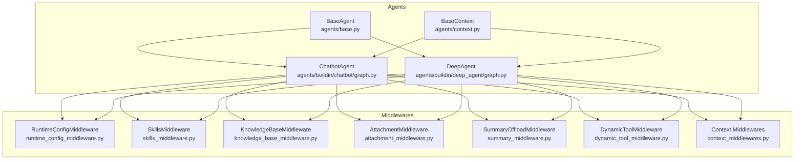
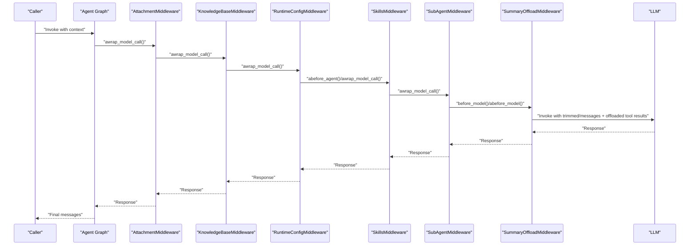
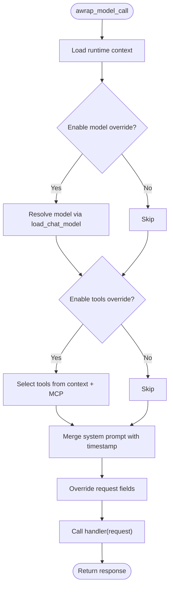
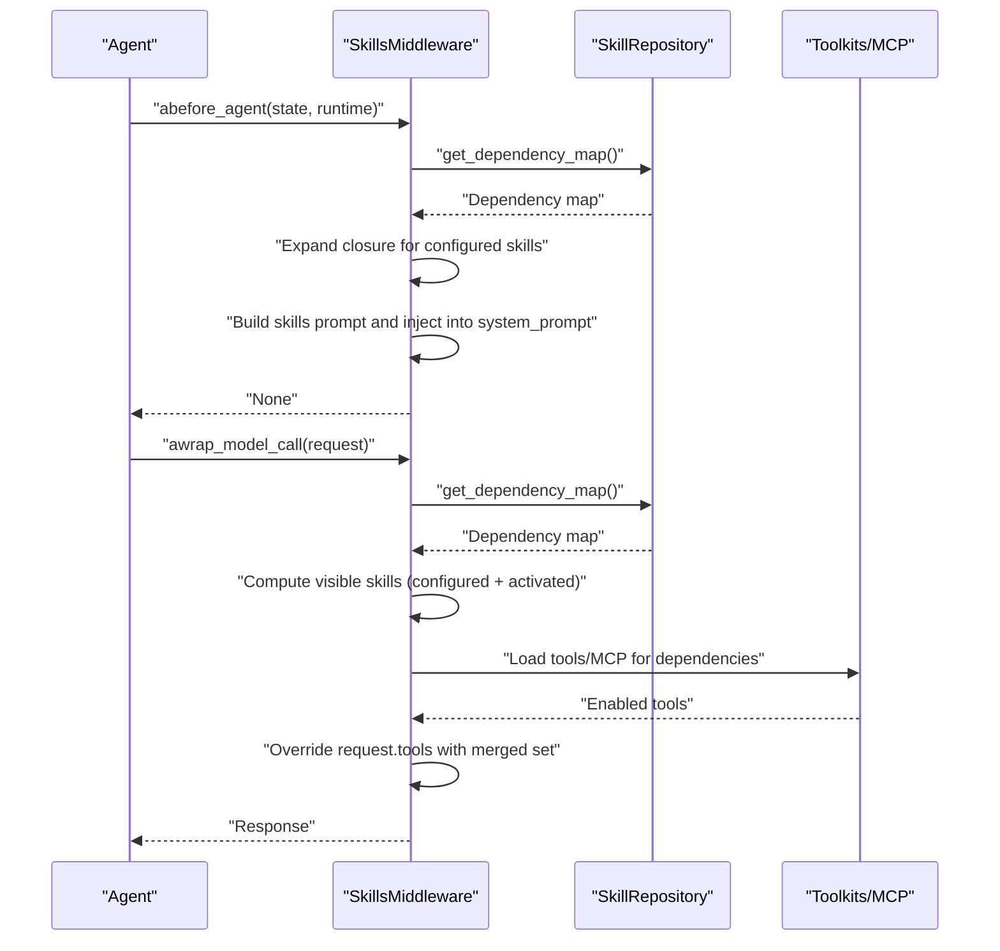
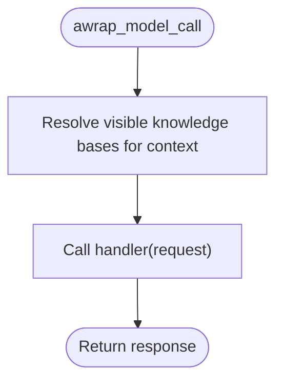
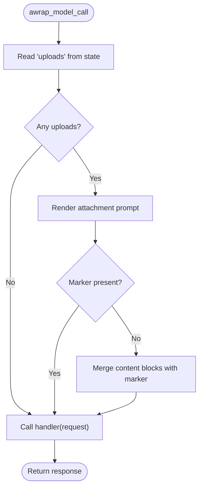
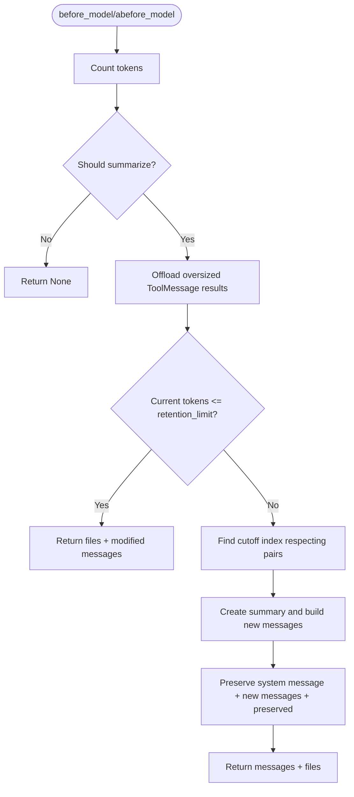
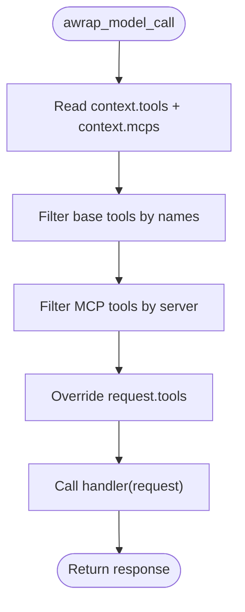
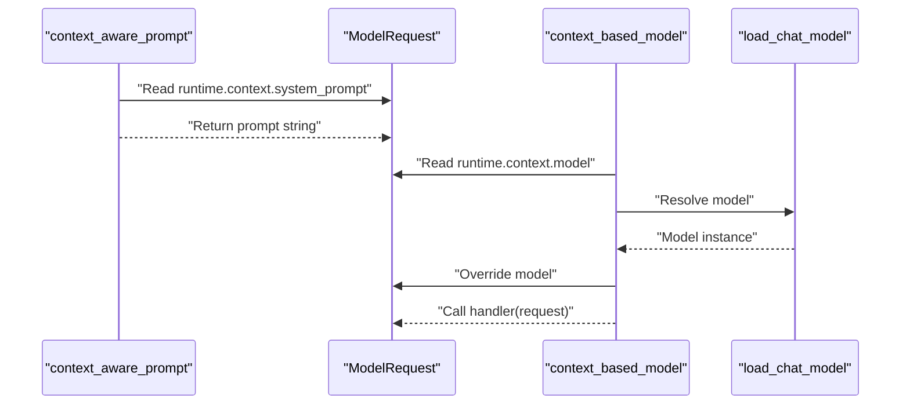
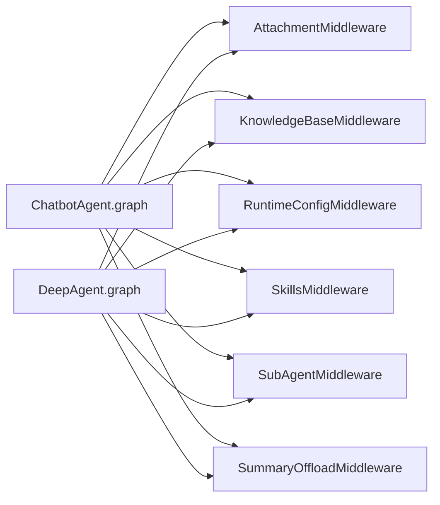

# Middleware Framework

<cite>
**Referenced Files in This Document**
- [middlewares/__init__.py](file://backend/package/yuxi/agents/middlewares/__init__.py)
- [middlewares/context_middlewares.py](file://backend/package/yuxi/agents/middlewares/context_middlewares.py)
- [middlewares/attachment_middleware.py](file://backend/package/yuxi/agents/middlewares/attachment_middleware.py)
- [middlewares/runtime_config_middleware.py](file://backend/package/yuxi/agents/middlewares/runtime_config_middleware.py)
- [middlewares/knowledge_base_middleware.py](file://backend/package/yuxi/agents/middlewares/knowledge_base_middleware.py)
- [middlewares/skills_middleware.py](file://backend/package/yuxi/agents/middlewares/skills_middleware.py)
- [middlewares/dynamic_tool_middleware.py](file://backend/package/yuxi/agents/middlewares/dynamic_tool_middleware.py)
- [middlewares/summary_middleware.py](file://backend/package/yuxi/agents/middlewares/summary_middleware.py)
- [agents/base.py](file://backend/package/yuxi/agents/base.py)
- [agents/context.py](file://backend/package/yuxi/agents/context.py)
- [agents/buildin/chatbot/graph.py](file://backend/package/yuxi/agents/buildin/chatbot/graph.py)
- [agents/buildin/deep_agent/graph.py](file://backend/package/yuxi/agents/buildin/deep_agent/graph.py)
</cite>

## Table of Contents
1. [Introduction](#introduction)
2. [Project Structure](#project-structure)
3. [Core Components](#core-components)
4. [Architecture Overview](#architecture-overview)
5. [Detailed Component Analysis](#detailed-component-analysis)
6. [Dependency Analysis](#dependency-analysis)
7. [Performance Considerations](#performance-considerations)
8. [Troubleshooting Guide](#troubleshooting-guide)
9. [Conclusion](#conclusion)
10. [Appendices](#appendices)

## Introduction
This document explains the middleware framework that extends agent functionality through modular processing layers. The middleware architecture intercepts and modifies agent execution flow at key lifecycle points, enabling:
- Context-aware prompt and model selection
- Attachment handling and file-based context injection
- Runtime configuration application (model, tools, MCP servers, system prompt)
- Skills middleware for prompt injection, dependency expansion, and dynamic activation
- Knowledge base tool availability
- Summary and tool-result offloading to manage context length
- Dynamic tool selection via MCP

The framework composes a middleware chain around agent graphs and orchestrates execution order to ensure predictable, extensible behavior.

## Project Structure
The middleware components live under the agents middlewares package and are integrated into agent graph construction. Agents define their own context schemas and compose middleware lists during graph creation.

**Diagram sources**
- [agents/base.py:17-263](file://backend/package/yuxi/agents/base.py#L17-L263)
- [agents/context.py:11-191](file://backend/package/yuxi/agents/context.py#L11-L191)
- [agents/buildin/chatbot/graph.py:65-96](file://backend/package/yuxi/agents/buildin/chatbot/graph.py#L65-L96)
- [agents/buildin/deep_agent/graph.py:27-124](file://backend/package/yuxi/agents/buildin/deep_agent/graph.py#L27-L124)
- [middlewares/runtime_config_middleware.py:16-162](file://backend/package/yuxi/agents/middlewares/runtime_config_middleware.py#L16-L162)
- [middlewares/skills_middleware.py:145-477](file://backend/package/yuxi/agents/middlewares/skills_middleware.py#L145-L477)
- [middlewares/knowledge_base_middleware.py:12-33](file://backend/package/yuxi/agents/middlewares/knowledge_base_middleware.py#L12-L33)
- [middlewares/attachment_middleware.py:54-90](file://backend/package/yuxi/agents/middlewares/attachment_middleware.py#L54-L90)
- [middlewares/summary_middleware.py:209-718](file://backend/package/yuxi/agents/middlewares/summary_middleware.py#L209-L718)
- [middlewares/dynamic_tool_middleware.py:10-70](file://backend/package/yuxi/agents/middlewares/dynamic_tool_middleware.py#L10-L70)
- [middlewares/context_middlewares.py:11-26](file://backend/package/yuxi/agents/middlewares/context_middlewares.py#L11-L26)

**Section sources**
- [agents/buildin/chatbot/graph.py:22-62](file://backend/package/yuxi/agents/buildin/chatbot/graph.py#L22-L62)
- [agents/buildin/deep_agent/graph.py:52-123](file://backend/package/yuxi/agents/buildin/deep_agent/graph.py#L52-L123)

## Core Components
- RuntimeConfigMiddleware: Applies model/tool/MCP/system prompt overrides from runtime context and merges them into the request.
- SkillsMiddleware: Injects skills prompts, expands dependencies, dynamically activates skills, and augments tools accordingly.
- KnowledgeBaseMiddleware: Provides common knowledge base tools and resolves visible knowledge bases for the context.
- AttachmentMiddleware: Injects file-based context into the system prompt and ensures deduplication markers.
- SummaryOffloadMiddleware: Summarizes long histories and offloads large tool results to a virtual file system to control token usage.
- DynamicToolMiddleware: Selects tools at runtime from a pre-registered pool based on context configuration.
- Context Middlewares: context_aware_prompt and context_based_model for dynamic prompt and model selection.

These components are exported via the middlewares package initializer and are used to construct agent graphs.

**Section sources**
- [middlewares/__init__.py:1-17](file://backend/package/yuxi/agents/middlewares/__init__.py#L1-L17)
- [middlewares/runtime_config_middleware.py:16-162](file://backend/package/yuxi/agents/middlewares/runtime_config_middleware.py#L16-L162)
- [middlewares/skills_middleware.py:145-477](file://backend/package/yuxi/agents/middlewares/skills_middleware.py#L145-L477)
- [middlewares/knowledge_base_middleware.py:12-33](file://backend/package/yuxi/agents/middlewares/knowledge_base_middleware.py#L12-L33)
- [middlewares/attachment_middleware.py:54-90](file://backend/package/yuxi/agents/middlewares/attachment_middleware.py#L54-L90)
- [middlewares/summary_middleware.py:209-718](file://backend/package/yuxi/agents/middlewares/summary_middleware.py#L209-L718)
- [middlewares/dynamic_tool_middleware.py:10-70](file://backend/package/yuxi/agents/middlewares/dynamic_tool_middleware.py#L10-L70)
- [middlewares/context_middlewares.py:11-26](file://backend/package/yuxi/agents/middlewares/context_middlewares.py#L11-L26)

## Architecture Overview
The middleware chain is constructed per agent graph and executed around model calls, tool calls, and state updates. The order influences behavior such as prompt injection precedence, tool availability, and context trimming.

**Diagram sources**
- [agents/buildin/chatbot/graph.py:22-62](file://backend/package/yuxi/agents/buildin/chatbot/graph.py#L22-L62)
- [agents/buildin/deep_agent/graph.py:52-123](file://backend/package/yuxi/agents/buildin/deep_agent/graph.py#L52-L123)
- [middlewares/attachment_middleware.py:59-85](file://backend/package/yuxi/agents/middlewares/attachment_middleware.py#L59-L85)
- [middlewares/knowledge_base_middleware.py:28-32](file://backend/package/yuxi/agents/middlewares/knowledge_base_middleware.py#L28-L32)
- [middlewares/runtime_config_middleware.py:75-117](file://backend/package/yuxi/agents/middlewares/runtime_config_middleware.py#L75-L117)
- [middlewares/skills_middleware.py:175-271](file://backend/package/yuxi/agents/middlewares/skills_middleware.py#L175-L271)
- [middlewares/summary_middleware.py:308-447](file://backend/package/yuxi/agents/middlewares/summary_middleware.py#L308-L447)

## Detailed Component Analysis

### RuntimeConfigMiddleware
- Purpose: Apply runtime overrides for model, tools, MCP servers, and system prompt.
- Key behaviors:
  - Loads tools from a shared registry and merges with context-selected tools.
  - Resolves MCP tools by server name and merges them into the toolset.
  - Extends the system prompt with contextual information and a timestamp.
  - Supports disabling specific overrides via flags.
- Execution hook: awrap_model_call.

**Diagram sources**
- [middlewares/runtime_config_middleware.py:75-117](file://backend/package/yuxi/agents/middlewares/runtime_config_middleware.py#L75-L117)
- [middlewares/runtime_config_middleware.py:119-161](file://backend/package/yuxi/agents/middlewares/runtime_config_middleware.py#L119-L161)

**Section sources**
- [middlewares/runtime_config_middleware.py:16-162](file://backend/package/yuxi/agents/middlewares/runtime_config_middleware.py#L16-L162)

### SkillsMiddleware
- Purpose: Prompt injection, dependency closure expansion, and dynamic skill activation.
- Key behaviors:
  - abefore_agent injects a skills section into the system prompt and marks it as injected.
  - awrap_model_call computes visible skills (configured + activated), builds a dependency bundle, and augments tools.
  - awrap_tool_call monitors tool results and dynamically activates skills based on file reads.
- Execution hooks: abefore_agent, awrap_model_call, awrap_tool_call.

**Diagram sources**
- [middlewares/skills_middleware.py:175-271](file://backend/package/yuxi/agents/middlewares/skills_middleware.py#L175-L271)
- [middlewares/skills_middleware.py:273-295](file://backend/package/yuxi/agents/middlewares/skills_middleware.py#L273-L295)
- [middlewares/skills_middleware.py:320-359](file://backend/package/yuxi/agents/middlewares/skills_middleware.py#L320-L359)

**Section sources**
- [middlewares/skills_middleware.py:145-477](file://backend/package/yuxi/agents/middlewares/skills_middleware.py#L145-L477)

### KnowledgeBaseMiddleware
- Purpose: Provide common knowledge base tools and resolve visible knowledge bases for the current context.
- Key behaviors:
  - Preloads common KB tools and exposes them to the agent.
  - Resolves visibility of knowledge bases for the runtime context before model calls.
- Execution hook: awrap_model_call.

**Diagram sources**
- [middlewares/knowledge_base_middleware.py:28-32](file://backend/package/yuxi/agents/middlewares/knowledge_base_middleware.py#L28-L32)

**Section sources**
- [middlewares/knowledge_base_middleware.py:12-33](file://backend/package/yuxi/agents/middlewares/knowledge_base_middleware.py#L12-L33)

### AttachmentMiddleware
- Purpose: Inject file-based context into the system prompt from LangGraph state.
- Key behaviors:
  - Reads uploads from state, renders a concise prompt block, and injects it into the system message blocks.
  - Uses a marker to avoid duplicate injections.
- Execution hook: awrap_model_call.

**Diagram sources**
- [middlewares/attachment_middleware.py:59-85](file://backend/package/yuxi/agents/middlewares/attachment_middleware.py#L59-L85)

**Section sources**
- [middlewares/attachment_middleware.py:54-90](file://backend/package/yuxi/agents/middlewares/attachment_middleware.py#L54-L90)

### SummaryOffloadMiddleware
- Purpose: Summarize long histories and offload large tool results to a virtual file system to control token usage.
- Key behaviors:
  - before_model/abefore_model checks triggers (messages/tokens/fraction), offloads oversized ToolMessage results, and optionally evicts messages to maintain retention ratio.
  - Uses a configurable threshold and model-specific token counting.
- Execution hooks: before_model, abefore_model.

**Diagram sources**
- [middlewares/summary_middleware.py:308-447](file://backend/package/yuxi/agents/middlewares/summary_middleware.py#L308-L447)
- [middlewares/summary_middleware.py:449-468](file://backend/package/yuxi/agents/middlewares/summary_middleware.py#L449-L468)
- [middlewares/summary_middleware.py:527-552](file://backend/package/yuxi/agents/middlewares/summary_middleware.py#L527-L552)

**Section sources**
- [middlewares/summary_middleware.py:209-718](file://backend/package/yuxi/agents/middlewares/summary_middleware.py#L209-L718)

### DynamicToolMiddleware
- Purpose: Dynamically select tools at runtime from a pre-registered pool based on context configuration.
- Key behaviors:
  - Preloads MCP tools for configured servers and registers them.
  - Filters tools based on context.tools and context.mcps during awrap_model_call.
- Execution hook: awrap_model_call.

**Diagram sources**
- [middlewares/dynamic_tool_middleware.py:40-69](file://backend/package/yuxi/agents/middlewares/dynamic_tool_middleware.py#L40-L69)

**Section sources**
- [middlewares/dynamic_tool_middleware.py:10-70](file://backend/package/yuxi/agents/middlewares/dynamic_tool_middleware.py#L10-L70)

### Context Middlewares
- context_aware_prompt: Returns the current runtime context’s system prompt for dynamic prompt injection.
- context_based_model: Resolves a model from the runtime context and overrides the request model.

**Diagram sources**
- [middlewares/context_middlewares.py:11-26](file://backend/package/yuxi/agents/middlewares/context_middlewares.py#L11-L26)

**Section sources**
- [middlewares/context_middlewares.py:11-26](file://backend/package/yuxi/agents/middlewares/context_middlewares.py#L11-L26)

## Dependency Analysis
- Agent graphs import and instantiate middleware instances, then pass them to create_agent.
- Middleware composition order affects behavior:
  - AttachmentMiddleware often precedes RuntimeConfigMiddleware to ensure file context is available when applying tool sets.
  - SkillsMiddleware runs early to inject prompts and compute visible skills before tool augmentation.
  - SummaryOffloadMiddleware runs near the end to trim context and offload results.
- RuntimeConfigMiddleware depends on tool registries and MCP service to assemble tools.
- SkillsMiddleware depends on database-backed skill metadata and dependency maps.
- KnowledgeBaseMiddleware depends on common KB toolkits and visibility resolution.

**Diagram sources**
- [agents/buildin/chatbot/graph.py:22-62](file://backend/package/yuxi/agents/buildin/chatbot/graph.py#L22-L62)
- [agents/buildin/deep_agent/graph.py:52-123](file://backend/package/yuxi/agents/buildin/deep_agent/graph.py#L52-L123)

**Section sources**
- [agents/buildin/chatbot/graph.py:22-62](file://backend/package/yuxi/agents/buildin/chatbot/graph.py#L22-L62)
- [agents/buildin/deep_agent/graph.py:52-123](file://backend/package/yuxi/agents/buildin/deep_agent/graph.py#L52-L123)

## Performance Considerations
- Token budgeting: Use SummaryOffloadMiddleware with appropriate triggers (tokens/messages/fraction) and retention ratios to prevent excessive memory usage.
- Tool loading: Preload MCP tools in DynamicToolMiddleware and filter at runtime to minimize overhead.
- Skills dependency expansion: Keep configured skills minimal and rely on closure expansion only when necessary.
- Prompt merging: Avoid redundant prompt injections by leveraging marker-based checks in AttachmentMiddleware and SkillsMiddleware prompt injection.
- Asynchronous operations: SkillsMiddleware and RuntimeConfigMiddleware perform async calls; ensure proper concurrency limits and caching.

[No sources needed since this section provides general guidance]

## Troubleshooting Guide
- Duplicate prompt injection: AttachmentMiddleware uses a marker to avoid re-injection; verify the marker exists in the system prompt content blocks.
- Missing MCP tools: DynamicToolMiddleware logs warnings when a server is not pre-loaded; ensure mcp_servers includes all required servers.
- Skills not activating: Verify that the visible skills list includes the slug and that the file path pattern matches expectations.
- Tool selection anomalies: Confirm context fields (tools, mcps) are lists of strings and that tool names match registered tool names.
- Summary errors: SummaryOffloadMiddleware falls back to preserving recent messages if trimming fails; inspect logs for exceptions during summary generation.

**Section sources**
- [middlewares/attachment_middleware.py:76-78](file://backend/package/yuxi/agents/middlewares/attachment_middleware.py#L76-L78)
- [middlewares/dynamic_tool_middleware.py:60-61](file://backend/package/yuxi/agents/middlewares/dynamic_tool_middleware.py#L60-L61)
- [middlewares/skills_middleware.py:373-378](file://backend/package/yuxi/agents/middlewares/skills_middleware.py#L373-L378)
- [middlewares/summary_middleware.py:660-661](file://backend/package/yuxi/agents/middlewares/summary_middleware.py#L660-L661)

## Conclusion
The middleware framework provides a robust, extensible mechanism to intercept and modify agent execution. By composing middleware in a deliberate order—attachment injection, knowledge base availability, runtime configuration, skills orchestration, tool augmentation, sub-agent coordination, and summary offloading—developers can tailor agent behavior to diverse use cases while maintaining performance and reliability.

[No sources needed since this section summarizes without analyzing specific files]

## Appendices

### Middleware Registration and Execution Order
- Registration: Agents construct middleware lists and pass them to create_agent.
- Execution order: Middleware wraps model calls and tool calls; the order determines precedence of prompt injection, tool availability, and context trimming.

**Section sources**
- [agents/buildin/chatbot/graph.py:22-62](file://backend/package/yuxi/agents/buildin/chatbot/graph.py#L22-L62)
- [agents/buildin/deep_agent/graph.py:52-123](file://backend/package/yuxi/agents/buildin/deep_agent/graph.py#L52-L123)

### Practical Examples
- Implementing custom middleware:
  - Extend AgentMiddleware and implement desired hooks (awrap_model_call, awrap_tool_call, abefore_agent, before_model, abefore_model).
  - Register the middleware instance in the agent graph’s middleware list.
- Modifying agent context:
  - Use RuntimeConfigMiddleware to override model, tools, and system prompt from context fields.
- Extending capabilities:
  - SkillsMiddleware dynamically augments tools and prompts based on configured and activated skills.
  - KnowledgeBaseMiddleware exposes common KB tools for retrieval tasks.

**Section sources**
- [middlewares/runtime_config_middleware.py:75-117](file://backend/package/yuxi/agents/middlewares/runtime_config_middleware.py#L75-L117)
- [middlewares/skills_middleware.py:175-271](file://backend/package/yuxi/agents/middlewares/skills_middleware.py#L175-L271)
- [middlewares/knowledge_base_middleware.py:28-32](file://backend/package/yuxi/agents/middlewares/knowledge_base_middleware.py#L28-L32)