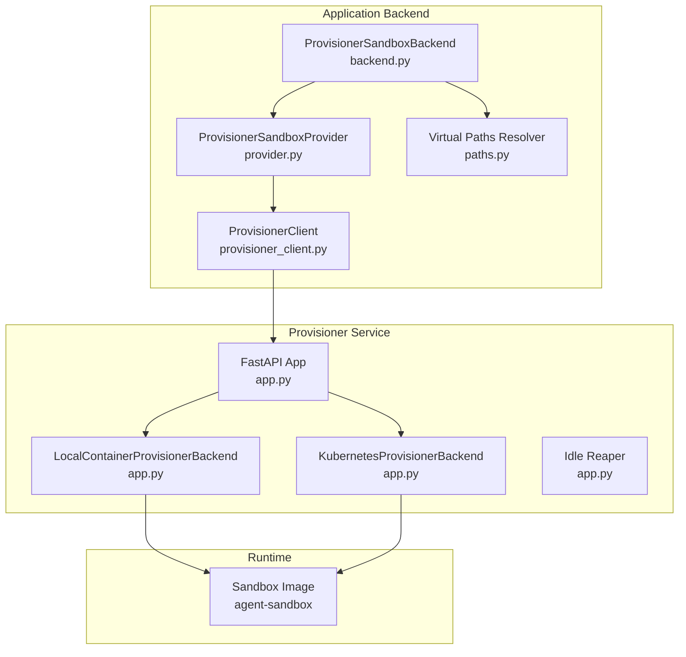
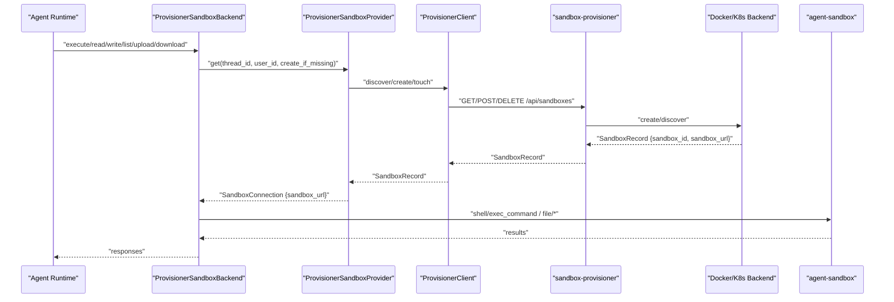
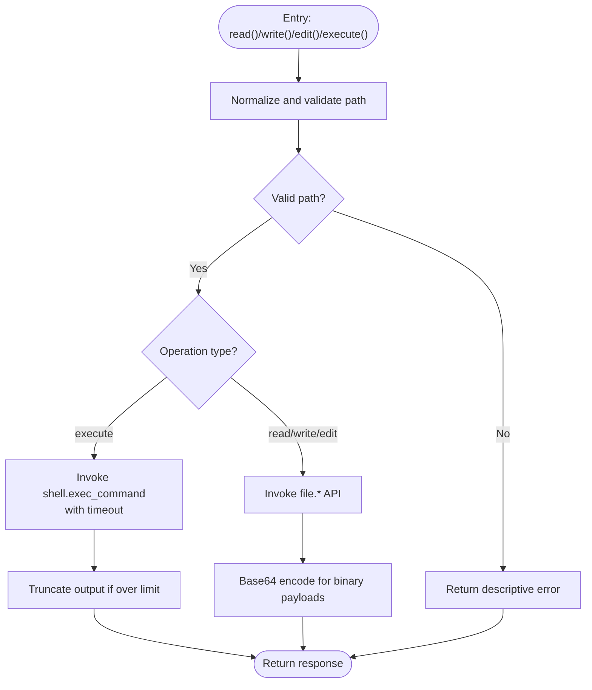
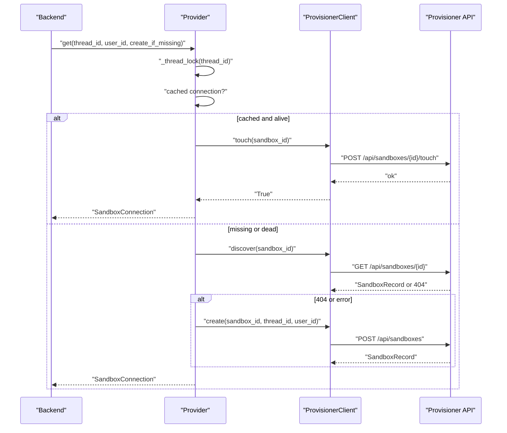
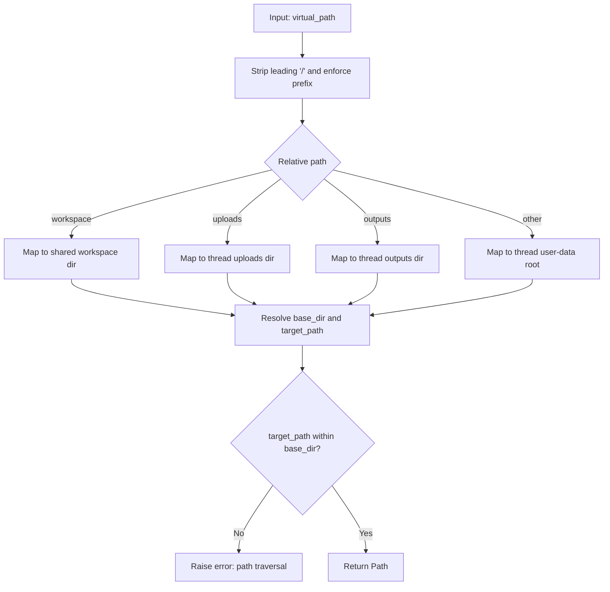
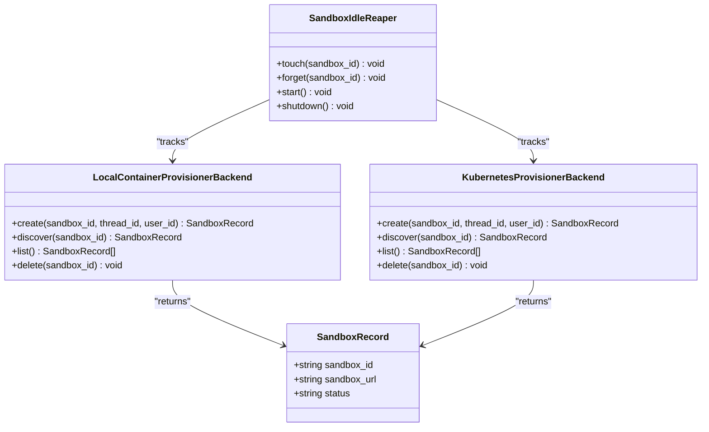
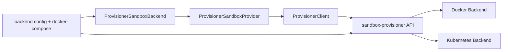

# Sandbox Environment

<cite>
**Referenced Files in This Document**
- [backend.py](file://backend/package/yuxi/agents/backends/sandbox/backend.py)
- [provider.py](file://backend/package/yuxi/agents/backends/sandbox/provider.py)
- [provisioner_client.py](file://backend/package/yuxi/agents/backends/sandbox/provisioner_client.py)
- [paths.py](file://backend/package/yuxi/agents/backends/sandbox/paths.py)
- [app.py](file://docker/sandbox_provisioner/app.py)
- [Dockerfile](file://docker/sandbox_provisioner/Dockerfile)
- [requirements.txt](file://docker/sandbox_provisioner/requirements.txt)
- [docker-compose.yml](file://docker-compose.yml)
- [app.py (backend config)](file://backend/package/yuxi/config/app.py)
- [sandbox-architecture.md](file://docs/agents/sandbox-architecture.md)
</cite>

## Table of Contents
1. [Introduction](#introduction)
2. [Project Structure](#project-structure)
3. [Core Components](#core-components)
4. [Architecture Overview](#architecture-overview)
5. [Detailed Component Analysis](#detailed-component-analysis)
6. [Dependency Analysis](#dependency-analysis)
7. [Performance Considerations](#performance-considerations)
8. [Troubleshooting Guide](#troubleshooting-guide)
9. [Conclusion](#conclusion)
10. [Appendices](#appendices)

## Introduction
This document describes the sandbox environment that provides secure execution isolation for agents. It explains the sandbox architecture, the provisioner system, container orchestration, and resource management. It documents the security model that isolates agent execution from the host system, including filesystem virtualization, network restrictions, and process limitations. It details the sandbox provider implementation, lifecycle management, resource allocation, and cleanup. Practical configuration examples, permission management, and file operations within isolated containers are included. Performance optimization, debugging, and monitoring approaches are also covered, along with the sandbox management API, security policies, and best practices for production deployments.

## Project Structure
The sandbox environment spans three layers:
- Application backend: a sandbox backend that communicates with a provisioner and a remote sandbox service.
- Provisioner service: a FastAPI service that provisions and manages sandbox instances (Docker or Kubernetes).
- Container runtime: the sandbox image exposing a shell and file API consumed by the backend.

**Diagram sources**
- [backend.py:64-402](file://backend/package/yuxi/agents/backends/sandbox/backend.py#L64-L402)
- [provider.py:27-171](file://backend/package/yuxi/agents/backends/sandbox/provider.py#L27-L171)
- [provisioner_client.py:15-73](file://backend/package/yuxi/agents/backends/sandbox/provisioner_client.py#L15-L73)
- [paths.py:12-136](file://backend/package/yuxi/agents/backends/sandbox/paths.py#L12-L136)
- [app.py:801-890](file://docker/sandbox_provisioner/app.py#L801-L890)
- [app.py:116-455](file://docker/sandbox_provisioner/app.py#L116-L455)
- [app.py:457-698](file://docker/sandbox_provisioner/app.py#L457-L698)

**Section sources**
- [backend.py:64-402](file://backend/package/yuxi/agents/backends/sandbox/backend.py#L64-L402)
- [provider.py:27-171](file://backend/package/yuxi/agents/backends/sandbox/provider.py#L27-L171)
- [provisioner_client.py:15-73](file://backend/package/yuxi/agents/backends/sandbox/provisioner_client.py#L15-L73)
- [paths.py:12-136](file://backend/package/yuxi/agents/backends/sandbox/paths.py#L12-L136)
- [app.py:801-890](file://docker/sandbox_provisioner/app.py#L801-L890)
- [app.py:116-455](file://docker/sandbox_provisioner/app.py#L116-L455)
- [app.py:457-698](file://docker/sandbox_provisioner/app.py#L457-L698)

## Core Components
- ProvisionerSandboxBackend: the application-facing sandbox interface that executes commands, reads/writes/edit files, lists/globs paths, and uploads/downloads files via a remote sandbox service.
- ProvisionerSandboxProvider: a thread-scoped provider that discovers/reuses or creates a sandbox via the provisioner and maintains keep-alive touches.
- ProvisionerClient: a thin HTTP client that talks to the provisioner API.
- Virtual paths resolver: resolves virtual paths to host paths, enforcing safe namespaces and preventing path traversal.
- Provisioner service: FastAPI app that exposes sandbox lifecycle APIs and orchestrates Docker or Kubernetes backends.
- Backends: LocalContainerProvisionerBackend (Docker) and KubernetesProvisionerBackend, plus an idle reaper for cleanup.

**Section sources**
- [backend.py:64-402](file://backend/package/yuxi/agents/backends/sandbox/backend.py#L64-L402)
- [provider.py:27-171](file://backend/package/yuxi/agents/backends/sandbox/provider.py#L27-L171)
- [provisioner_client.py:15-73](file://backend/package/yuxi/agents/backends/sandbox/provisioner_client.py#L15-L73)
- [paths.py:12-136](file://backend/package/yuxi/agents/backends/sandbox/paths.py#L12-L136)
- [app.py:801-890](file://docker/sandbox_provisioner/app.py#L801-L890)
- [app.py:116-455](file://docker/sandbox_provisioner/app.py#L116-L455)
- [app.py:457-698](file://docker/sandbox_provisioner/app.py#L457-L698)

## Architecture Overview
The sandbox architecture separates concerns:
- Application backend requests a sandbox for a thread and caches the connection.
- Provisioner service manages sandbox lifecycles and returns a reachable sandbox URL.
- Sandbox image exposes a shell and file API; the backend invokes these APIs for agent tasks.

**Diagram sources**
- [backend.py:95-105](file://backend/package/yuxi/agents/backends/sandbox/backend.py#L95-L105)
- [provider.py:103-128](file://backend/package/yuxi/agents/backends/sandbox/provider.py#L103-L128)
- [provisioner_client.py:47-72](file://backend/package/yuxi/agents/backends/sandbox/provisioner_client.py#L47-L72)
- [app.py:816-889](file://docker/sandbox_provisioner/app.py#L816-L889)

## Detailed Component Analysis

### ProvisionerSandboxBackend
Responsibilities:
- Normalize and validate paths to prevent traversal.
- Execute shell commands with timeouts and output limits.
- Read, write, edit, grep, glob, upload, and download files via the sandbox file API.
- Handle binary detection and safe text rendering.
- Manage client creation and reuse.

Key behaviors:
- Path normalization and validation ensure safe access within the virtual prefix.
- Command execution is bounded by configured timeout and output size.
- File operations support base64 encoding for binary payloads and structured error reporting.

**Diagram sources**
- [backend.py:136-196](file://backend/package/yuxi/agents/backends/sandbox/backend.py#L136-L196)
- [backend.py:230-301](file://backend/package/yuxi/agents/backends/sandbox/backend.py#L230-L301)
- [backend.py:340-401](file://backend/package/yuxi/agents/backends/sandbox/backend.py#L340-L401)

**Section sources**
- [backend.py:26-62](file://backend/package/yuxi/agents/backends/sandbox/backend.py#L26-L62)
- [backend.py:136-196](file://backend/package/yuxi/agents/backends/sandbox/backend.py#L136-L196)
- [backend.py:201-228](file://backend/package/yuxi/agents/backends/sandbox/backend.py#L201-L228)
- [backend.py:230-301](file://backend/package/yuxi/agents/backends/sandbox/backend.py#L230-L301)
- [backend.py:303-338](file://backend/package/yuxi/agents/backends/sandbox/backend.py#L303-L338)
- [backend.py:340-401](file://backend/package/yuxi/agents/backends/sandbox/backend.py#L340-L401)

### ProvisionerSandboxProvider and ProvisionerClient
Responsibilities:
- Provider maps thread_id to a stable sandbox_id, discovers or creates a sandbox via the provisioner, and keeps it alive.
- Client wraps HTTP calls to the provisioner’s REST API.

Behavior highlights:
- Thread-scoped locks protect concurrent acquisition.
- Keep-alive touch prevents premature deletion.
- Error handling distinguishes missing sandboxes vs. transient failures.

**Diagram sources**
- [provider.py:103-128](file://backend/package/yuxi/agents/backends/sandbox/provider.py#L103-L128)
- [provisioner_client.py:32-72](file://backend/package/yuxi/agents/backends/sandbox/provisioner_client.py#L32-L72)

**Section sources**
- [provider.py:27-171](file://backend/package/yuxi/agents/backends/sandbox/provider.py#L27-L171)
- [provisioner_client.py:15-73](file://backend/package/yuxi/agents/backends/sandbox/provisioner_client.py#L15-L73)

### Virtual Paths Resolver
Responsibilities:
- Enforce a virtual path prefix for sandbox-visible paths.
- Resolve virtual paths to host paths safely, preventing traversal.
- Map thread-specific and shared directories to predictable host locations.

Key points:
- Validates thread_id and user_id.
- Ensures target path is within allowed namespaces.
- Supports mapping to shared workspace and per-thread user-data directories.

**Diagram sources**
- [paths.py:95-110](file://backend/package/yuxi/agents/backends/sandbox/paths.py#L95-L110)
- [paths.py:69-110](file://backend/package/yuxi/agents/backends/sandbox/paths.py#L69-L110)

**Section sources**
- [paths.py:12-136](file://backend/package/yuxi/agents/backends/sandbox/paths.py#L12-L136)

### Provisioner Service and Backends
Responsibilities:
- Expose REST endpoints for sandbox lifecycle management.
- Provision sandboxes using Docker or Kubernetes backends.
- Maintain an idle reaper to clean up long-stale sandboxes.

Highlights:
- Docker backend validates identifiers, ensures writable user-data mounts, and waits for readiness.
- Kubernetes backend creates Pods and Services, maps NodePort to a reachable URL.
- Idle reaper enforces minimum idle timeout to avoid deleting running sandboxes.

**Diagram sources**
- [app.py:54-59](file://docker/sandbox_provisioner/app.py#L54-L59)
- [app.py:116-455](file://docker/sandbox_provisioner/app.py#L116-L455)
- [app.py:457-698](file://docker/sandbox_provisioner/app.py#L457-L698)
- [app.py:700-776](file://docker/sandbox_provisioner/app.py#L700-L776)

**Section sources**
- [app.py:801-890](file://docker/sandbox_provisioner/app.py#L801-L890)
- [app.py:116-455](file://docker/sandbox_provisioner/app.py#L116-L455)
- [app.py:457-698](file://docker/sandbox_provisioner/app.py#L457-L698)
- [app.py:700-776](file://docker/sandbox_provisioner/app.py#L700-L776)

### Security Model and Resource Management
- Filesystem virtualization: agent-visible paths are constrained under a virtual prefix and mapped to controlled host directories. Workspace is shared among a user’s threads; uploads/outputs are thread-scoped.
- Network restrictions: sandbox URL is returned by provisioner; Docker backend uses random host port mapping; Kubernetes backend uses NodePort.
- Process limitations: commands are executed with a configurable timeout and output size cap; file operations are restricted to sandbox-visible namespaces.
- Cleanup: idle reaper deletes sandboxes exceeding idle timeout; explicit delete endpoint removes sandboxes.

**Section sources**
- [paths.py:69-110](file://backend/package/yuxi/agents/backends/sandbox/paths.py#L69-L110)
- [backend.py:171-196](file://backend/package/yuxi/agents/backends/sandbox/backend.py#L171-L196)
- [app.py:700-776](file://docker/sandbox_provisioner/app.py#L700-L776)

## Dependency Analysis
- Backend depends on provider for sandbox connection and on agent-sandbox client for remote APIs.
- Provider depends on ProvisionerClient for HTTP calls to sandbox-provisioner.
- Provisioner service depends on Docker or Kubernetes SDKs and exposes REST endpoints.
- Configuration is centralized in backend config and docker-compose environment variables.

**Diagram sources**
- [backend.py:95-105](file://backend/package/yuxi/agents/backends/sandbox/backend.py#L95-L105)
- [provider.py:37-42](file://backend/package/yuxi/agents/backends/sandbox/provider.py#L37-L42)
- [provisioner_client.py:16-26](file://backend/package/yuxi/agents/backends/sandbox/provisioner_client.py#L16-L26)
- [app.py:801-890](file://docker/sandbox_provisioner/app.py#L801-L890)
- [docker-compose.yml:140-161](file://docker-compose.yml#L140-L161)

**Section sources**
- [backend.py:95-105](file://backend/package/yuxi/agents/backends/sandbox/backend.py#L95-L105)
- [provider.py:37-42](file://backend/package/yuxi/agents/backends/sandbox/provider.py#L37-L42)
- [provisioner_client.py:16-26](file://backend/package/yuxi/agents/backends/sandbox/provisioner_client.py#L16-L26)
- [app.py:801-890](file://docker/sandbox_provisioner/app.py#L801-L890)
- [docker-compose.yml:140-161](file://docker-compose.yml#L140-L161)

## Performance Considerations
- Command timeouts and output truncation prevent runaway processes and large payloads.
- Keep-alive touch intervals balance freshness with overhead.
- Idle reaper frees resources; ensure idle timeout exceeds exec timeout to avoid premature deletion.
- Docker backend uses tmpfs for ephemeral home and bind-mounts persistent user-data; Kubernetes backend uses NodePort for minimal latency.

[No sources needed since this section provides general guidance]

## Troubleshooting Guide
Common issues and checks:
- Provisioner health: verify backend type and idle settings via health endpoint.
- Docker address reachability: confirm host mapping and that the sandbox URL is reachable from the backend container.
- Kubernetes address reachability: verify NodePort and NODE_HOST accessibility.
- Path resolution: distinguish host-side path existence from sandbox mount exposure.

Operational tips:
- Inspect provisioner logs for creation, reuse, readiness, and reaper actions.
- Validate that sandbox URL responds to the sandbox API endpoint.
- Confirm that virtual paths resolve to expected host directories.

**Section sources**
- [sandbox-architecture.md:199-206](file://docs/agents/sandbox-architecture.md#L199-L206)

## Conclusion
The sandbox environment provides secure, isolated execution for agents with clear separation of concerns. The application backend interacts with a provisioner that dynamically provisions sandboxes via Docker or Kubernetes. Strict path virtualization, bounded execution, and lifecycle management ensure safety and efficiency. The documented APIs, configuration knobs, and operational guidance enable reliable production deployments.

[No sources needed since this section summarizes without analyzing specific files]

## Appendices

### Sandbox Management API
Endpoints exposed by the provisioner:
- GET /health
- POST /api/sandboxes
- GET /api/sandboxes/{sandbox_id}
- POST /api/sandboxes/{sandbox_id}/touch
- GET /api/sandboxes
- DELETE /api/sandboxes/{sandbox_id}

**Section sources**
- [app.py:804-890](file://docker/sandbox_provisioner/app.py#L804-L890)

### Configuration Reference
Backend configuration (selected):
- SANDBOX_PROVIDER
- SANDBOX_PROVISIONER_URL
- SANDBOX_VIRTUAL_PATH_PREFIX
- SANDBOX_EXEC_TIMEOUT_SECONDS
- SANDBOX_MAX_OUTPUT_BYTES
- SANDBOX_KEEPALIVE_INTERVAL_SECONDS

Provisioner backend configuration (selected):
- PROVISIONER_BACKEND
- SANDBOX_IMAGE
- SANDBOX_CONTAINER_PORT
- SANDBOX_HEALTH_TIMEOUT_SECONDS
- SANDBOX_IDLE_TIMEOUT_SECONDS
- SANDBOX_IDLE_CHECK_INTERVAL_SECONDS
- DOCKER_NETWORK
- DOCKER_THREADS_HOST_PATH
- DOCKER_SANDBOX_PREFIX
- DOCKER_SANDBOX_HOST
- K8S_NAMESPACE
- KUBECONFIG_PATH
- NODE_HOST
- THREAD_PVC
- SKILLS_PVC

**Section sources**
- [app.py (backend config):246-267](file://backend/package/yuxi/config/app.py#L246-L267)
- [docker-compose.yml:140-161](file://docker-compose.yml#L140-L161)

### Best Practices for Production
- Use Docker backend for local development and Kubernetes backend for scalable deployments.
- Set SANDBOX_IDLE_TIMEOUT_SECONDS greater than SANDBOX_EXEC_TIMEOUT_SECONDS.
- Bind host paths carefully and ensure the sandbox URL is reachable from the backend.
- Monitor provisioner health and logs; leverage the idle reaper to reclaim resources.
- Keep virtual path semantics consistent across environments to simplify debugging.

[No sources needed since this section provides general guidance]