# Skill System

<cite>
**Referenced Files in This Document**
- [skills_backend.py](file://backend/package/yuxi/agents/backends/skills_backend.py)
- [knowledge_base_backend.py](file://backend/package/yuxi/agents/backends/knowledge_base_backend.py)
- [base.py](file://backend/package/yuxi/agents/base.py)
- [context.py](file://backend/package/yuxi/agents/context.py)
- [models.py](file://backend/package/yuxi/agents/models.py)
- [state.py](file://backend/package/yuxi/agents/state.py)
- [skill_service.py](file://backend/package/yuxi/services/skill_service.py)
- [tool_service.py](file://backend/package/yuxi/services/tool_service.py)
- [skill_repository.py](file://backend/package/yuxi/repositories/skill_repository.py)
- [__init__.py](file://backend/package/yuxi/agents/toolkits/__init__.py)
- [reporter SKILL.md](file://backend/package/yuxi/agents/skills/buildin/reporter/SKILL.md)
- [deep-reporter SKILL.md](file://backend/package/yuxi/agents/skills/buildin/deep-reporter/SKILL.md)
- [skill_api.js](file://web/src/apis/skill_api.js)
</cite>

## Table of Contents
1. [Introduction](#introduction)
2. [Project Structure](#project-structure)
3. [Core Components](#core-components)
4. [Architecture Overview](#architecture-overview)
5. [Detailed Component Analysis](#detailed-component-analysis)
6. [Dependency Analysis](#dependency-analysis)
7. [Performance Considerations](#performance-considerations)
8. [Troubleshooting Guide](#troubleshooting-guide)
9. [Conclusion](#conclusion)
10. [Appendices](#appendices)

## Introduction
This document explains the skill system architecture that enables agents to perform specific tasks through standardized interfaces. It covers built-in skills, toolkits, registration and discovery mechanisms, invocation patterns, execution environment, parameter validation, result handling, versioning, dependency management, and security considerations for sandboxed execution.

## Project Structure
The skill system spans backend services, agent runtime, toolkits, and frontend APIs:
- Backend services manage skill lifecycle, dependencies, and persistence.
- Agent runtime integrates skills via context and tool/mcp availability.
- Toolkits expose tools and metadata for discovery and composition.
- Frontend APIs support admin operations for skills.

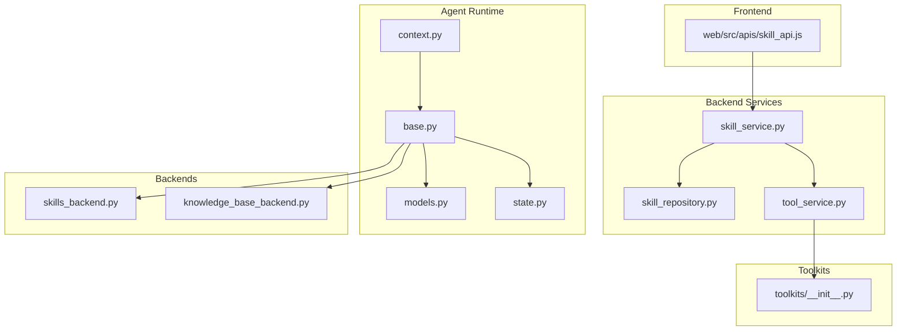

**Diagram sources**
- [skill_service.py:1-939](file://backend/package/yuxi/services/skill_service.py#L1-L939)
- [skill_repository.py:1-85](file://backend/package/yuxi/repositories/skill_repository.py#L1-L85)
- [tool_service.py:1-80](file://backend/package/yuxi/services/tool_service.py#L1-L80)
- [context.py:1-191](file://backend/package/yuxi/agents/context.py#L1-L191)
- [base.py:1-263](file://backend/package/yuxi/agents/base.py#L1-L263)
- [models.py:1-58](file://backend/package/yuxi/agents/models.py#L1-L58)
- [state.py:1-31](file://backend/package/yuxi/agents/state.py#L1-L31)
- [skills_backend.py:1-115](file://backend/package/yuxi/agents/backends/skills_backend.py#L1-L115)
- [knowledge_base_backend.py:1-460](file://backend/package/yuxi/agents/backends/knowledge_base_backend.py#L1-L460)
- [__init__.py:1-27](file://backend/package/yuxi/agents/toolkits/__init__.py#L1-L27)
- [skill_api.js:43-100](file://web/src/apis/skill_api.js#L43-L100)

**Section sources**
- [skill_service.py:1-939](file://backend/package/yuxi/services/skill_service.py#L1-L939)
- [context.py:1-191](file://backend/package/yuxi/agents/context.py#L1-L191)
- [base.py:1-263](file://backend/package/yuxi/agents/base.py#L1-L263)
- [__init__.py:1-27](file://backend/package/yuxi/agents/toolkits/__init__.py#L1-L27)
- [skill_api.js:43-100](file://web/src/apis/skill_api.js#L43-L100)

## Core Components
- Skill service orchestrates installation, import, export, tree browsing, and dependency validation for skills.
- Skill repository persists skill metadata and dependencies.
- Tool service aggregates tool metadata from toolkits for discovery.
- Agent context defines runtime configuration including skills, tools, knowledge bases, and MCP servers.
- Backends restrict file access to selected skills and knowledge base content for sandboxed execution.
- Built-in skills describe capabilities and constraints for reporting and deep research.

**Section sources**
- [skill_service.py:1-939](file://backend/package/yuxi/services/skill_service.py#L1-L939)
- [skill_repository.py:1-85](file://backend/package/yuxi/repositories/skill_repository.py#L1-L85)
- [tool_service.py:1-80](file://backend/package/yuxi/services/tool_service.py#L1-L80)
- [context.py:1-191](file://backend/package/yuxi/agents/context.py#L1-L191)
- [skills_backend.py:1-115](file://backend/package/yuxi/agents/backends/skills_backend.py#L1-L115)
- [knowledge_base_backend.py:1-460](file://backend/package/yuxi/agents/backends/knowledge_base_backend.py#L1-L460)
- [reporter SKILL.md:1-29](file://backend/package/yuxi/agents/skills/buildin/reporter/SKILL.md#L1-L29)
- [deep-reporter SKILL.md:1-63](file://backend/package/yuxi/agents/skills/buildin/deep-reporter/SKILL.md#L1-L63)

## Architecture Overview
The skill system is composed of:
- Skill definition and metadata via SKILL.md frontmatter.
- Registration and discovery through toolkits and tool service.
- Execution orchestration via agent context and backends.
- Persistence and dependency management via skill repository and service.

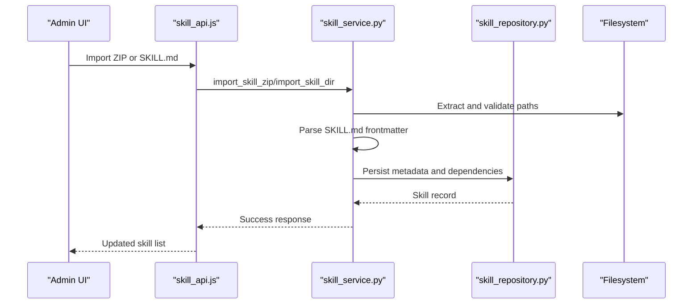

**Diagram sources**
- [skill_api.js:43-100](file://web/src/apis/skill_api.js#L43-L100)
- [skill_service.py:545-608](file://backend/package/yuxi/services/skill_service.py#L545-L608)
- [skill_repository.py:1-85](file://backend/package/yuxi/repositories/skill_repository.py#L1-L85)

## Detailed Component Analysis

### Built-in Skills: Reporting and Deep Reporting
Built-in skills define standardized capabilities and constraints:
- Reporter skill: generates SQL queries and charts, produces markdown-rendered charts, and focuses on concise conclusions.
- Deep-reporter skill: supports long-form, structured reports with evidence, analysis, and citations.

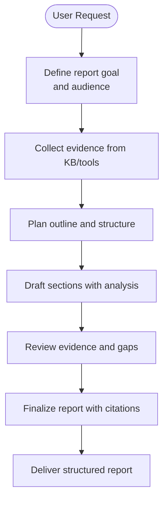

**Diagram sources**
- [reporter SKILL.md:1-29](file://backend/package/yuxi/agents/skills/buildin/reporter/SKILL.md#L1-L29)
- [deep-reporter SKILL.md:1-63](file://backend/package/yuxi/agents/skills/buildin/deep-reporter/SKILL.md#L1-L63)

**Section sources**
- [reporter SKILL.md:1-29](file://backend/package/yuxi/agents/skills/buildin/reporter/SKILL.md#L1-L29)
- [deep-reporter SKILL.md:1-63](file://backend/package/yuxi/agents/skills/buildin/deep-reporter/SKILL.md#L1-L63)

### Toolkit System and Tool Discovery
Toolkits group related tools and skills. The toolkit package exposes:
- Automatic registration via @tool decorators.
- Tool metadata aggregation for discovery and categorization.
- Accessors for extra metadata and tool instances.

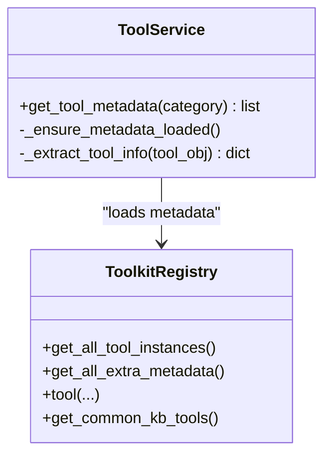

**Diagram sources**
- [tool_service.py:1-80](file://backend/package/yuxi/services/tool_service.py#L1-L80)
- [__init__.py:1-27](file://backend/package/yuxi/agents/toolkits/__init__.py#L1-L27)

**Section sources**
- [tool_service.py:1-80](file://backend/package/yuxi/services/tool_service.py#L1-L80)
- [__init__.py:1-27](file://backend/package/yuxi/agents/toolkits/__init__.py#L1-L27)

### Skill Registration, Discovery, and Invocation Patterns
- Registration: tools are registered automatically when importing toolkit packages.
- Discovery: tool metadata is lazily loaded and enriched with categories/tags.
- Invocation: agents configure skills, tools, knowledge bases, and MCP servers via context; backends enforce read-only exposure of selected skills and KB content.

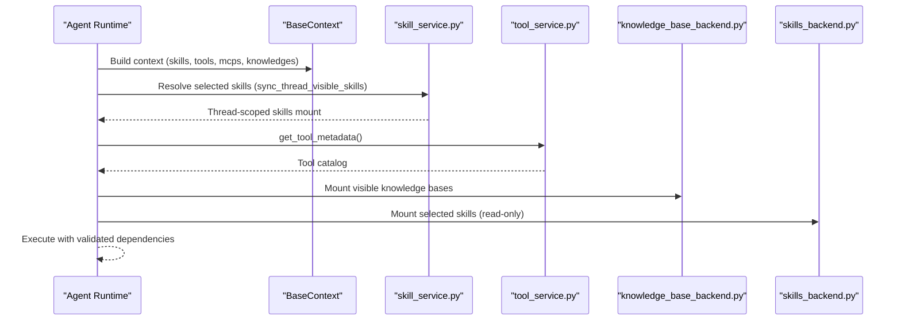

**Diagram sources**
- [context.py:1-191](file://backend/package/yuxi/agents/context.py#L1-L191)
- [skill_service.py:115-164](file://backend/package/yuxi/services/skill_service.py#L115-L164)
- [tool_service.py:33-80](file://backend/package/yuxi/services/tool_service.py#L33-L80)
- [knowledge_base_backend.py:135-460](file://backend/package/yuxi/agents/backends/knowledge_base_backend.py#L135-L460)
- [skills_backend.py:12-115](file://backend/package/yuxi/agents/backends/skills_backend.py#L12-L115)

**Section sources**
- [context.py:80-89](file://backend/package/yuxi/agents/context.py#L80-L89)
- [skill_service.py:115-164](file://backend/package/yuxi/services/skill_service.py#L115-L164)
- [tool_service.py:73-80](file://backend/package/yuxi/services/tool_service.py#L73-L80)
- [skills_backend.py:12-115](file://backend/package/yuxi/agents/backends/skills_backend.py#L12-L115)
- [knowledge_base_backend.py:135-460](file://backend/package/yuxi/agents/backends/knowledge_base_backend.py#L135-L460)

### Skill Execution Environment, Parameter Validation, and Result Handling
- Execution environment: agents compile LangGraph workflows with optional checkpointer backends (SQLite, Postgres, memory).
- Parameter validation: skill service validates slugs, frontmatter, ZIP paths, and dependency lists against available tools, MCP servers, and other skills.
- Result handling: artifacts are merged deterministically; tool call results render via frontend components.

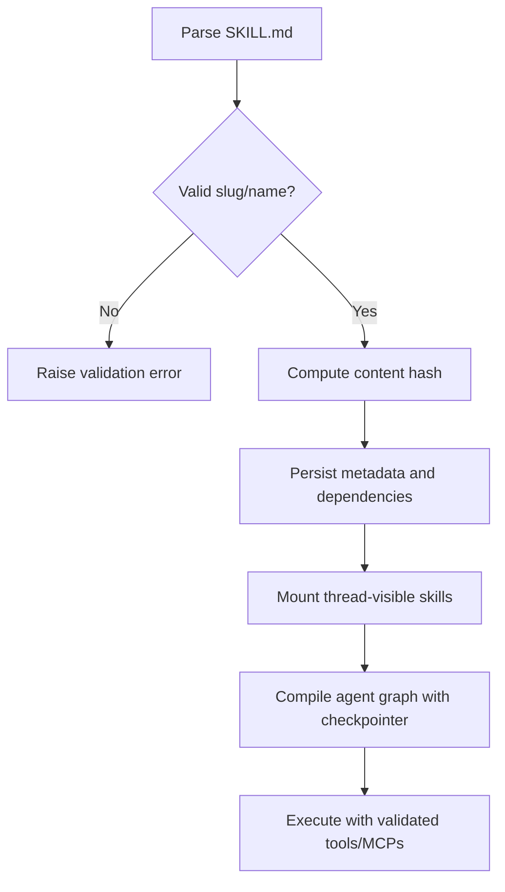

**Diagram sources**
- [skill_service.py:348-417](file://backend/package/yuxi/services/skill_service.py#L348-L417)
- [skill_service.py:285-316](file://backend/package/yuxi/services/skill_service.py#L285-L316)
- [base.py:199-254](file://backend/package/yuxi/agents/base.py#L199-L254)
- [state.py:10-16](file://backend/package/yuxi/agents/state.py#L10-L16)

**Section sources**
- [skill_service.py:348-417](file://backend/package/yuxi/services/skill_service.py#L348-L417)
- [skill_service.py:285-316](file://backend/package/yuxi/services/skill_service.py#L285-L316)
- [base.py:199-254](file://backend/package/yuxi/agents/base.py#L199-L254)
- [state.py:10-16](file://backend/package/yuxi/agents/state.py#L10-L16)

### Practical Examples

#### Creating a Custom Skill
- Prepare a directory with a root-level SKILL.md frontmatter containing name and description.
- Optionally include nested files and prompts.
- Import via frontend API or backend service to register and persist metadata.

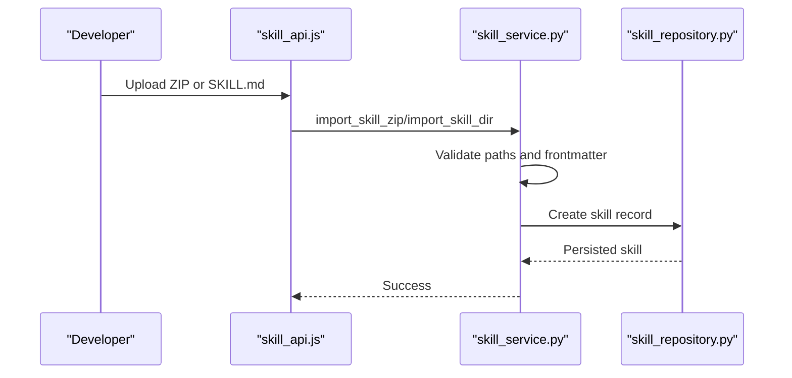

**Diagram sources**
- [skill_api.js:43-100](file://web/src/apis/skill_api.js#L43-L100)
- [skill_service.py:545-608](file://backend/package/yuxi/services/skill_service.py#L545-L608)
- [skill_repository.py:25-60](file://backend/package/yuxi/repositories/skill_repository.py#L25-L60)

**Section sources**
- [skill_service.py:545-608](file://backend/package/yuxi/services/skill_service.py#L545-L608)
- [skill_api.js:43-100](file://web/src/apis/skill_api.js#L43-L100)

#### Integrating External Tools and MCP Servers
- Configure tools and MCP servers in agent context; tool metadata is discovered via tool service.
- Skills declare dependencies; validation ensures availability.

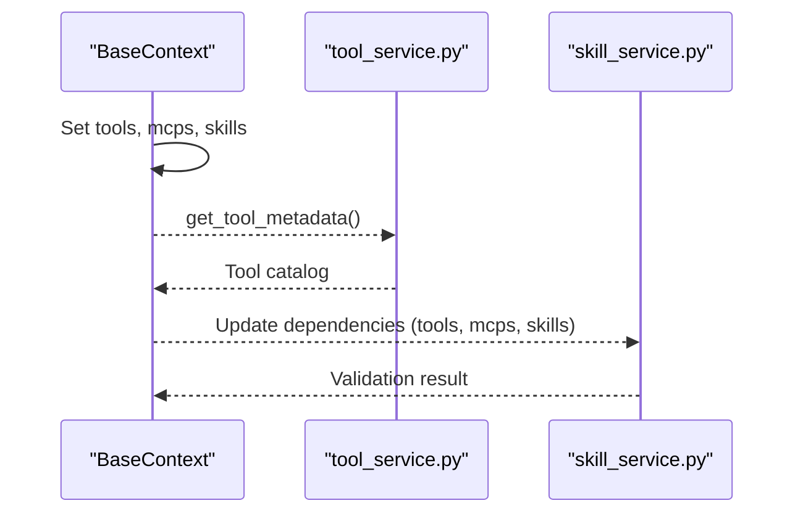

**Diagram sources**
- [context.py:51-89](file://backend/package/yuxi/agents/context.py#L51-L89)
- [tool_service.py:247-269](file://backend/package/yuxi/services/tool_service.py#L247-L269)
- [skill_service.py:247-269](file://backend/package/yuxi/services/skill_service.py#L247-L269)

**Section sources**
- [context.py:51-89](file://backend/package/yuxi/agents/context.py#L51-L89)
- [tool_service.py:247-269](file://backend/package/yuxi/services/tool_service.py#L247-L269)
- [skill_service.py:285-316](file://backend/package/yuxi/services/skill_service.py#L285-L316)

#### Composing Skills into Complex Workflows
- Select skills in agent context; the runtime mounts only those skills (read-only).
- Combine with tools and knowledge bases to compose multi-step workflows.

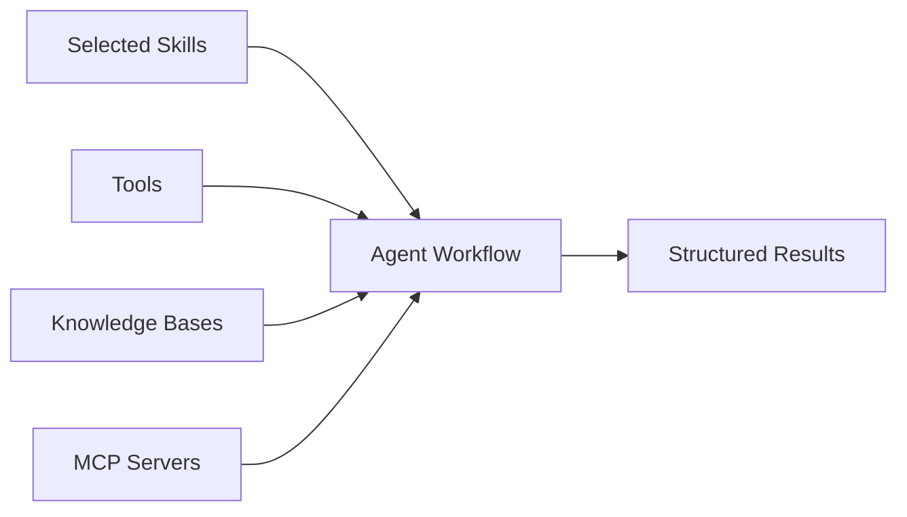

**Diagram sources**
- [skills_backend.py:12-115](file://backend/package/yuxi/agents/backends/skills_backend.py#L12-L115)
- [context.py:80-89](file://backend/package/yuxi/agents/context.py#L80-L89)

**Section sources**
- [skills_backend.py:12-115](file://backend/package/yuxi/agents/backends/skills_backend.py#L12-L115)
- [context.py:80-89](file://backend/package/yuxi/agents/context.py#L80-L89)

### Security Considerations and Sandboxed Execution
- Selected skills backend enforces read-only access and path scoping to mounted skill slugs.
- Knowledge base backend materializes content from storage and prevents path traversal.
- ZIP import validates absolute paths and parent traversal attempts.

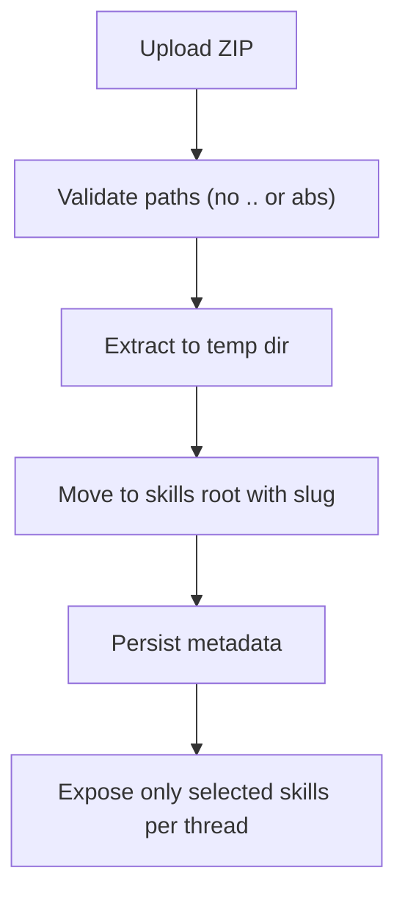

**Diagram sources**
- [skill_service.py:410-417](file://backend/package/yuxi/services/skill_service.py#L410-L417)
- [skill_service.py:545-588](file://backend/package/yuxi/services/skill_service.py#L545-L588)
- [skills_backend.py:12-115](file://backend/package/yuxi/agents/backends/skills_backend.py#L12-L115)
- [knowledge_base_backend.py:31-46](file://backend/package/yuxi/agents/backends/knowledge_base_backend.py#L31-L46)

**Section sources**
- [skill_service.py:410-417](file://backend/package/yuxi/services/skill_service.py#L410-L417)
- [skills_backend.py:12-115](file://backend/package/yuxi/agents/backends/skills_backend.py#L12-L115)
- [knowledge_base_backend.py:31-46](file://backend/package/yuxi/agents/backends/knowledge_base_backend.py#L31-L46)

## Dependency Analysis
Skills declare dependencies on tools, MCP servers, and other skills. The system validates these dependencies against available resources and prevents cycles or self-reference.

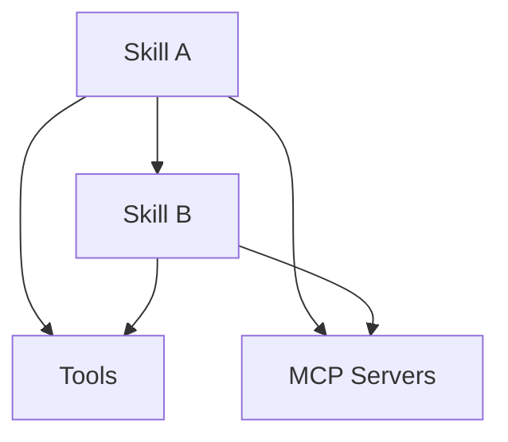

**Diagram sources**
- [skill_service.py:285-316](file://backend/package/yuxi/services/skill_service.py#L285-L316)
- [tool_service.py:247-269](file://backend/package/yuxi/services/tool_service.py#L247-L269)

**Section sources**
- [skill_service.py:285-316](file://backend/package/yuxi/services/skill_service.py#L285-L316)
- [tool_service.py:247-269](file://backend/package/yuxi/services/tool_service.py#L247-L269)

## Performance Considerations
- Lazy loading of tool metadata reduces startup overhead.
- Content hashing and directory comparison minimize redundant copies during thread synchronization.
- Streaming agent execution modes reduce latency for long-running tasks.

[No sources needed since this section provides general guidance]

## Troubleshooting Guide
Common issues and resolutions:
- Invalid skill slug or name: ensure lowercase, alphanumeric, and hyphenated naming without consecutive hyphens.
- Missing or malformed SKILL.md: frontmatter must include name and description.
- ZIP path traversal or absolute paths: reject uploads with unsafe paths.
- Dependency resolution failures: confirm tool, MCP, and skill IDs exist and are available.

**Section sources**
- [skill_service.py:348-356](file://backend/package/yuxi/services/skill_service.py#L348-L356)
- [skill_service.py:382-397](file://backend/package/yuxi/services/skill_service.py#L382-L397)
- [skill_service.py:410-417](file://backend/package/yuxi/services/skill_service.py#L410-L417)
- [skill_service.py:285-316](file://backend/package/yuxi/services/skill_service.py#L285-L316)

## Conclusion
The skill system provides a robust framework for defining, registering, validating, and executing agent capabilities. Through toolkits, dependency management, sandboxed backends, and standardized skill metadata, it enables secure, composable workflows tailored to reporting, deep research, and other specialized tasks.

[No sources needed since this section summarizes without analyzing specific files]

## Appendices

### Appendix A: Built-in Skills Reference
- Reporter skill: SQL-driven reporting with chart generation and markdown embedding.
- Deep-reporter skill: Structured, evidence-backed long-form reports with citation requirements.

**Section sources**
- [reporter SKILL.md:1-29](file://backend/package/yuxi/agents/skills/buildin/reporter/SKILL.md#L1-L29)
- [deep-reporter SKILL.md:1-63](file://backend/package/yuxi/agents/skills/buildin/deep-reporter/SKILL.md#L1-L63)