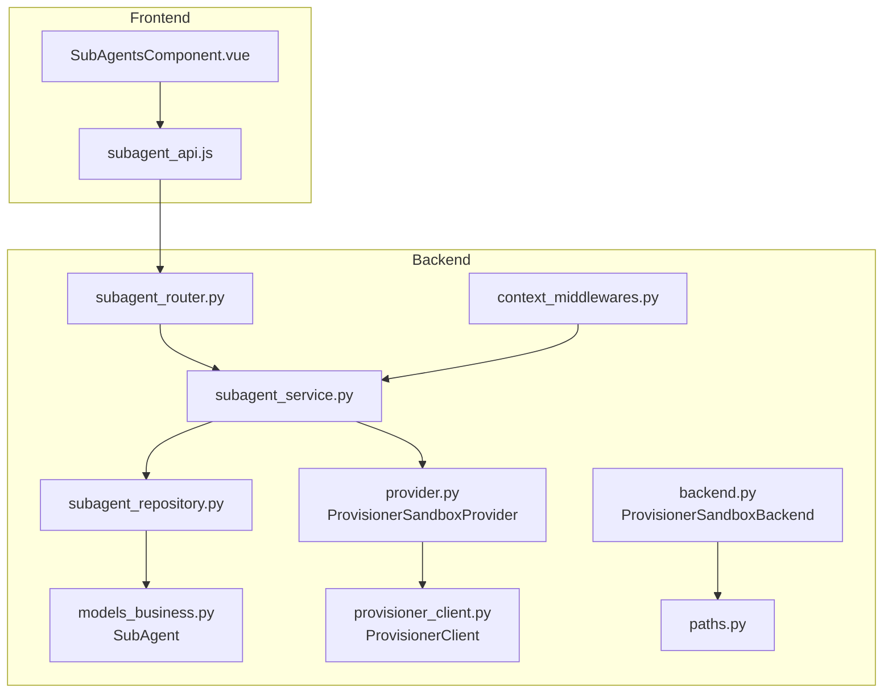
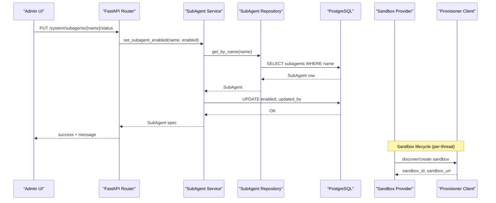
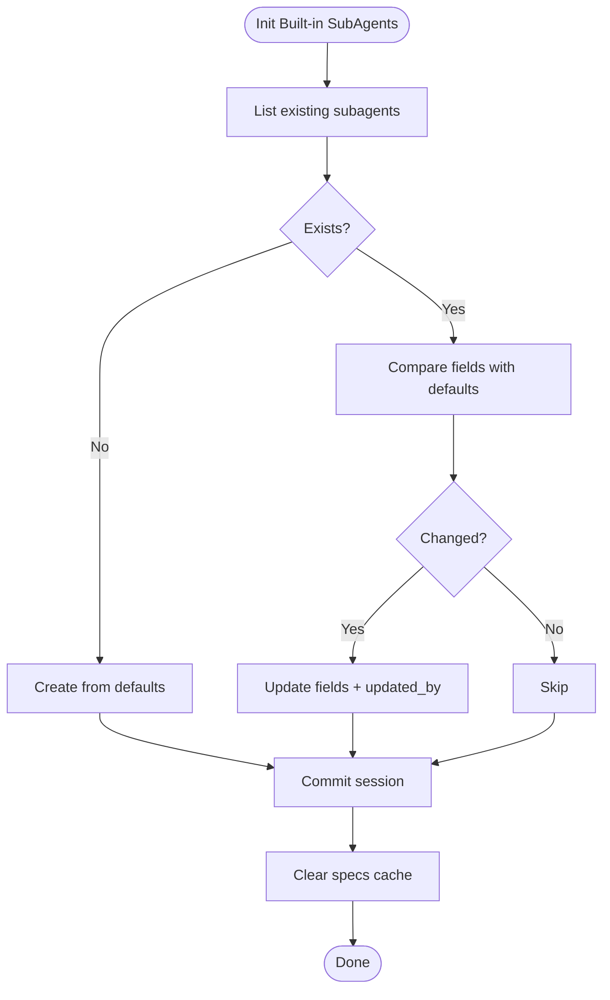
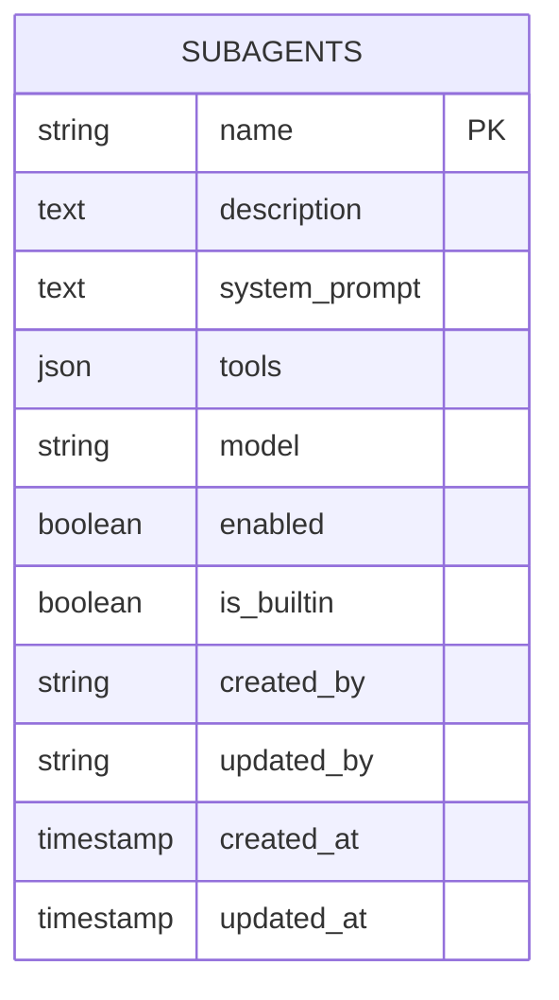
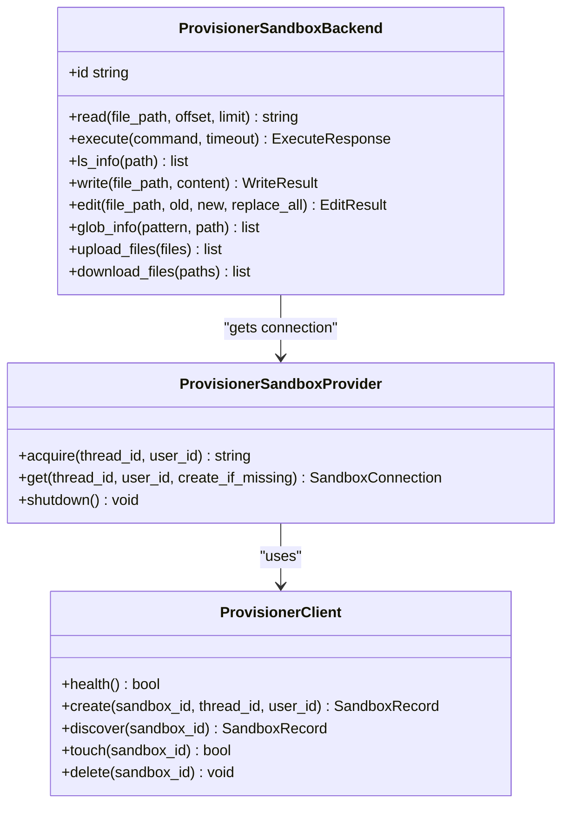
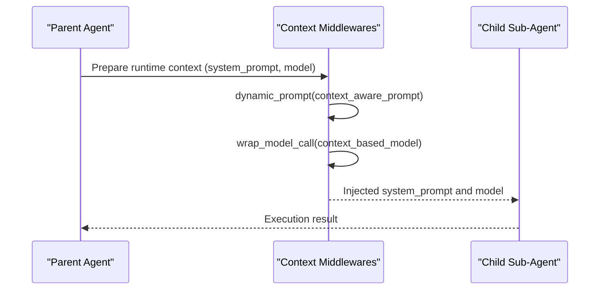
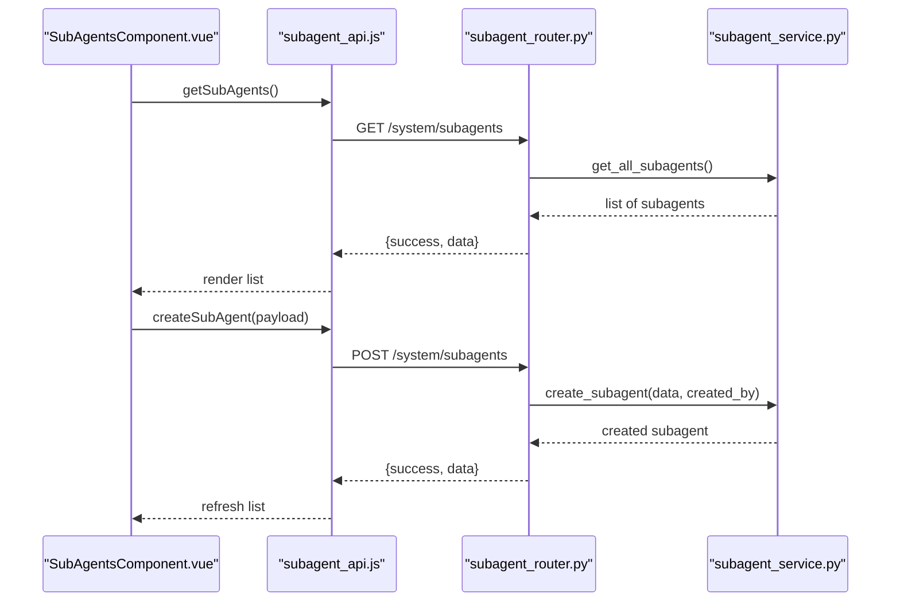
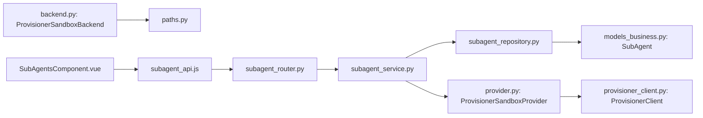

# Sub-agent Management

<cite>
**Referenced Files in This Document**
- [subagent_service.py](file://backend/package/yuxi/services/subagent_service.py)
- [subagent_router.py](file://backend/server/routers/subagent_router.py)
- [subagent_repository.py](file://backend/package/yuxi/repositories/subagent_repository.py)
- [models_business.py](file://backend/package/yuxi/storage/postgres/models_business.py)
- [provisioner_client.py](file://backend/package/yuxi/agents/backends/sandbox/provisioner_client.py)
- [provider.py](file://backend/package/yuxi/agents/backends/sandbox/provider.py)
- [backend.py](file://backend/package/yuxi/agents/backends/sandbox/backend.py)
- [paths.py](file://backend/package/yuxi/agents/backends/sandbox/paths.py)
- [context_middlewares.py](file://backend/package/yuxi/agents/middlewares/context_middlewares.py)
- [subagent_api.js](file://web/src/apis/subagent_api.js)
- [SubAgentsComponent.vue](file://web/src/components/SubAgentsComponent.vue)
</cite>

## Table of Contents
1. [Introduction](#introduction)
2. [Project Structure](#project-structure)
3. [Core Components](#core-components)
4. [Architecture Overview](#architecture-overview)
5. [Detailed Component Analysis](#detailed-component-analysis)
6. [Dependency Analysis](#dependency-analysis)
7. [Performance Considerations](#performance-considerations)
8. [Troubleshooting Guide](#troubleshooting-guide)
9. [Conclusion](#conclusion)
10. [Appendices](#appendices)

## Introduction
This document explains the sub-agent management capabilities that enable hierarchical agent architectures. Parent agents can delegate tasks to child agents (sub-agents) with specialized capabilities. It covers the sub-agent service implementation, creation and configuration lifecycle, sandbox provisioner for isolated execution environments, context inheritance, multi-agent workflows, delegation patterns, coordination mechanisms, resource allocation, security isolation, performance monitoring, and the API endpoints used to manage sub-agent relationships and execution flows.

## Project Structure
The sub-agent system spans backend services, persistence, sandbox orchestration, and frontend management:
- Backend service layer orchestrates sub-agent CRUD and runtime specs retrieval
- Persistence uses a dedicated SubAgent entity and repository
- Sandbox subsystem provisions and manages isolated execution environments
- Frontend provides admin UI for managing sub-agents

**Diagram sources**
- [subagent_service.py:1-249](file://backend/package/yuxi/services/subagent_service.py#L1-L249)
- [subagent_router.py:1-175](file://backend/server/routers/subagent_router.py#L1-L175)
- [subagent_repository.py:1-108](file://backend/package/yuxi/repositories/subagent_repository.py#L1-L108)
- [models_business.py:571-616](file://backend/package/yuxi/storage/postgres/models_business.py#L571-L616)
- [provider.py:1-171](file://backend/package/yuxi/agents/backends/sandbox/provider.py#L1-L171)
- [backend.py:1-402](file://backend/package/yuxi/agents/backends/sandbox/backend.py#L1-L402)
- [provisioner_client.py:1-73](file://backend/package/yuxi/agents/backends/sandbox/provisioner_client.py#L1-L73)
- [paths.py:1-136](file://backend/package/yuxi/agents/backends/sandbox/paths.py#L1-L136)
- [context_middlewares.py:1-26](file://backend/package/yuxi/agents/middlewares/context_middlewares.py#L1-L26)
- [subagent_api.js:1-77](file://web/src/apis/subagent_api.js#L1-L77)
- [SubAgentsComponent.vue:1-587](file://web/src/components/SubAgentsComponent.vue#L1-L587)

**Section sources**
- [subagent_service.py:1-249](file://backend/package/yuxi/services/subagent_service.py#L1-L249)
- [subagent_router.py:1-175](file://backend/server/routers/subagent_router.py#L1-L175)
- [subagent_repository.py:1-108](file://backend/package/yuxi/repositories/subagent_repository.py#L1-L108)
- [models_business.py:571-616](file://backend/package/yuxi/storage/postgres/models_business.py#L571-L616)
- [provider.py:1-171](file://backend/package/yuxi/agents/backends/sandbox/provider.py#L1-L171)
- [backend.py:1-402](file://backend/package/yuxi/agents/backends/sandbox/backend.py#L1-L402)
- [provisioner_client.py:1-73](file://backend/package/yuxi/agents/backends/sandbox/provisioner_client.py#L1-L73)
- [paths.py:1-136](file://backend/package/yuxi/agents/backends/sandbox/paths.py#L1-L136)
- [context_middlewares.py:1-26](file://backend/package/yuxi/agents/middlewares/context_middlewares.py#L1-L26)
- [subagent_api.js:1-77](file://web/src/apis/subagent_api.js#L1-L77)
- [SubAgentsComponent.vue:1-587](file://web/src/components/SubAgentsComponent.vue#L1-L587)

## Core Components
- Sub-agent service: initializes built-in sub-agents, lists and resolves specs, and exposes CRUD APIs
- Sub-agent repository: persistence layer for SubAgent entity
- SubAgent model: database schema and spec conversion helpers
- Sandbox provisioner: external sandbox orchestration client and provider
- Sandbox backend: isolated execution environment abstraction
- Frontend API module and UI component: admin management of sub-agents

Key responsibilities:
- Creation and configuration: define name, description, system prompt, tools, optional model override, and enabled state
- Lifecycle: enable/disable, update, delete (builtin sub-agents are protected)
- Runtime specs: cached, thread-safe retrieval of enabled sub-agent specs with tool resolution
- Sandbox isolation: per-thread sandbox provisioning and keep-alive

**Section sources**
- [subagent_service.py:70-249](file://backend/package/yuxi/services/subagent_service.py#L70-L249)
- [subagent_repository.py:12-108](file://backend/package/yuxi/repositories/subagent_repository.py#L12-L108)
- [models_business.py:571-616](file://backend/package/yuxi/storage/postgres/models_business.py#L571-L616)
- [provider.py:27-171](file://backend/package/yuxi/agents/backends/sandbox/provider.py#L27-L171)
- [backend.py:64-402](file://backend/package/yuxi/agents/backends/sandbox/backend.py#L64-L402)

## Architecture Overview
The sub-agent architecture separates concerns across layers:
- API layer: FastAPI routes expose admin endpoints
- Service layer: Business logic for sub-agent management and runtime spec caching
- Persistence layer: SQLAlchemy ORM for SubAgent entity
- Sandbox layer: Provisioner-backed sandbox provider and backend for isolated execution
- Frontend: Admin UI to manage sub-agents and trigger updates

**Diagram sources**
- [subagent_router.py:154-175](file://backend/server/routers/subagent_router.py#L154-L175)
- [subagent_service.py:230-249](file://backend/package/yuxi/services/subagent_service.py#L230-L249)
- [subagent_repository.py:33-43](file://backend/package/yuxi/repositories/subagent_repository.py#L33-L43)
- [provider.py:78-129](file://backend/package/yuxi/agents/backends/sandbox/provider.py#L78-L129)
- [provisioner_client.py:47-58](file://backend/package/yuxi/agents/backends/sandbox/provisioner_client.py#L47-L58)

## Detailed Component Analysis

### Sub-agent Service Layer
Responsibilities:
- Initialize built-in sub-agents and synchronize fields with code-defined defaults
- Retrieve and cache sub-agent specs for middleware usage
- Resolve tool instances by tool names for selected sub-agents
- CRUD operations with validation and protection for builtin sub-agents
- Clear cache after mutations to ensure fresh runtime specs

**Diagram sources**
- [subagent_service.py:70-98](file://backend/package/yuxi/services/subagent_service.py#L70-L98)

Key methods and behaviors:
- Initialization and synchronization of built-in sub-agents
- Thread-safe cache for sub-agent specs with lock-based population
- Tool resolution against registered tool instances
- Validation and error handling for CRUD operations

**Section sources**
- [subagent_service.py:70-249](file://backend/package/yuxi/services/subagent_service.py#L70-L249)

### Sub-agent Repository and Model
- Repository provides list, filter, create, update, delete operations
- Model defines SubAgent entity with fields: name (PK), description, system_prompt, tools, model, enabled, is_builtin, and audit fields
- Spec conversion helpers produce middleware-ready structures

**Diagram sources**
- [models_business.py:571-616](file://backend/package/yuxi/storage/postgres/models_business.py#L571-L616)

**Section sources**
- [subagent_repository.py:12-108](file://backend/package/yuxi/repositories/subagent_repository.py#L12-L108)
- [models_business.py:571-616](file://backend/package/yuxi/storage/postgres/models_business.py#L571-L616)

### Sandbox Provisioner System
The sandbox subsystem provides isolated execution environments per thread:
- ProvisionerClient: HTTP client to external sandbox provisioner
- ProvisionerSandboxProvider: thread-scoped connection management, discovery, creation, keep-alive, and cleanup
- ProvisionerSandboxBackend: sandbox abstraction exposing file operations, shell execution, and search utilities
- Paths utilities: virtual path mapping and safety checks for user-data directories

**Diagram sources**
- [provisioner_client.py:15-73](file://backend/package/yuxi/agents/backends/sandbox/provisioner_client.py#L15-L73)
- [provider.py:27-171](file://backend/package/yuxi/agents/backends/sandbox/provider.py#L27-L171)
- [backend.py:64-402](file://backend/package/yuxi/agents/backends/sandbox/backend.py#L64-L402)

Operational highlights:
- Per-thread sandbox identity derived from thread_id hash
- Keep-alive touch interval configurable to balance resource usage
- Safety checks for path traversal and virtual path resolution
- Output truncation and timeouts for execution safety and performance

**Section sources**
- [provider.py:27-171](file://backend/package/yuxi/agents/backends/sandbox/provider.py#L27-L171)
- [backend.py:64-402](file://backend/package/yuxi/agents/backends/sandbox/backend.py#L64-L402)
- [paths.py:16-136](file://backend/package/yuxi/agents/backends/sandbox/paths.py#L16-L136)

### Context Inheritance and Middleware
Sub-agents inherit runtime context from parent agents:
- Context-aware prompt middleware injects system_prompt from runtime context
- Context-based model middleware selects model based on runtime context

**Diagram sources**
- [context_middlewares.py:11-26](file://backend/package/yuxi/agents/middlewares/context_middlewares.py#L11-L26)

**Section sources**
- [context_middlewares.py:11-26](file://backend/package/yuxi/agents/middlewares/context_middlewares.py#L11-L26)

### API Endpoints and Frontend Integration
Admin endpoints for sub-agent management:
- GET /system/subagents: list all sub-agents
- GET /system/subagents/{name}: get a sub-agent by name
- POST /system/subagents: create a sub-agent
- PUT /system/subagents/{name}: update a sub-agent
- DELETE /system/subagents/{name}: delete a sub-agent
- PUT /system/subagents/{name}/status: toggle enabled state

Frontend integration:
- API module encapsulates admin endpoints
- UI component renders lists, filters, forms, and actions for sub-agents

**Diagram sources**
- [subagent_router.py:58-175](file://backend/server/routers/subagent_router.py#L58-L175)
- [subagent_service.py:168-187](file://backend/package/yuxi/services/subagent_service.py#L168-L187)
- [subagent_api.js:18-61](file://web/src/apis/subagent_api.js#L18-L61)
- [SubAgentsComponent.vue:360-428](file://web/src/components/SubAgentsComponent.vue#L360-L428)

**Section sources**
- [subagent_router.py:58-175](file://backend/server/routers/subagent_router.py#L58-L175)
- [subagent_service.py:168-249](file://backend/package/yuxi/services/subagent_service.py#L168-L249)
- [subagent_api.js:18-61](file://web/src/apis/subagent_api.js#L18-L61)
- [SubAgentsComponent.vue:360-428](file://web/src/components/SubAgentsComponent.vue#L360-L428)

## Dependency Analysis
- Service depends on repository and PostgreSQL manager for persistence
- Repository depends on SQLAlchemy ORM and the SubAgent model
- Sandbox provider depends on provisioner client and configuration
- Backend depends on provider and sandbox client for operations
- Frontend depends on API module and UI component for management

**Diagram sources**
- [subagent_service.py:1-249](file://backend/package/yuxi/services/subagent_service.py#L1-L249)
- [subagent_repository.py:1-108](file://backend/package/yuxi/repositories/subagent_repository.py#L1-L108)
- [models_business.py:571-616](file://backend/package/yuxi/storage/postgres/models_business.py#L571-L616)
- [provider.py:1-171](file://backend/package/yuxi/agents/backends/sandbox/provider.py#L1-L171)
- [provisioner_client.py:1-73](file://backend/package/yuxi/agents/backends/sandbox/provisioner_client.py#L1-L73)
- [backend.py:1-402](file://backend/package/yuxi/agents/backends/sandbox/backend.py#L1-L402)
- [paths.py:1-136](file://backend/package/yuxi/agents/backends/sandbox/paths.py#L1-L136)
- [subagent_api.js:1-77](file://web/src/apis/subagent_api.js#L1-L77)
- [SubAgentsComponent.vue:1-587](file://web/src/components/SubAgentsComponent.vue#L1-L587)

**Section sources**
- [subagent_service.py:1-249](file://backend/package/yuxi/services/subagent_service.py#L1-L249)
- [subagent_repository.py:1-108](file://backend/package/yuxi/repositories/subagent_repository.py#L1-L108)
- [models_business.py:571-616](file://backend/package/yuxi/storage/postgres/models_business.py#L571-L616)
- [provider.py:1-171](file://backend/package/yuxi/agents/backends/sandbox/provider.py#L1-L171)
- [provisioner_client.py:1-73](file://backend/package/yuxi/agents/backends/sandbox/provisioner_client.py#L1-L73)
- [backend.py:1-402](file://backend/package/yuxi/agents/backends/sandbox/backend.py#L1-L402)
- [paths.py:1-136](file://backend/package/yuxi/agents/backends/sandbox/paths.py#L1-L136)
- [subagent_api.js:1-77](file://web/src/apis/subagent_api.js#L1-L77)
- [SubAgentsComponent.vue:1-587](file://web/src/components/SubAgentsComponent.vue#L1-L587)

## Performance Considerations
- Sub-agent specs caching: reduce repeated database reads and tool resolution overhead
- Sandbox keep-alive intervals: tune to balance resource usage and responsiveness
- Command timeouts and output truncation: prevent runaway executions and excessive memory usage
- Virtual path validation: avoid expensive or unsafe filesystem operations
- Tool resolution: cache tool instances to minimize repeated lookups

[No sources needed since this section provides general guidance]

## Troubleshooting Guide
Common issues and resolutions:
- Duplicate sub-agent name: integrity error during creation; ensure unique name
- Sub-agent not found: 404 when updating/deleting/getting by name
- Built-in sub-agent protection: attempts to edit/delete builtin sub-agents raise validation errors
- Sandbox provisioning failures: check provisioner health endpoint and network connectivity
- Path traversal errors: ensure virtual paths are within allowed namespaces

**Section sources**
- [subagent_router.py:49-56](file://backend/server/routers/subagent_router.py#L49-L56)
- [subagent_router.py:80-86](file://backend/server/routers/subagent_router.py#L80-L86)
- [subagent_router.py:121-132](file://backend/server/routers/subagent_router.py#L121-L132)
- [subagent_router.py:142-152](file://backend/server/routers/subagent_router.py#L142-L152)
- [subagent_service.py:201-203](file://backend/package/yuxi/services/subagent_service.py#L201-L203)
- [provisioner_client.py:28-31](file://backend/package/yuxi/agents/backends/sandbox/provisioner_client.py#L28-L31)
- [paths.py:95-110](file://backend/package/yuxi/agents/backends/sandbox/paths.py#L95-L110)

## Conclusion
The sub-agent management system provides a robust foundation for hierarchical agent execution. It offers secure, isolated sandbox environments, flexible configuration, and admin-managed lifecycle controls. By combining cached runtime specs, thread-scoped sandboxing, and context-aware middleware, it supports scalable multi-agent workflows with clear delegation patterns and strong operational safeguards.

[No sources needed since this section summarizes without analyzing specific files]

## Appendices

### API Reference Summary
- GET /system/subagents: List all sub-agents
- GET /system/subagents/{name}: Get a sub-agent by name
- POST /system/subagents: Create a sub-agent
- PUT /system/subagents/{name}: Update a sub-agent
- DELETE /system/subagents/{name}: Delete a sub-agent
- PUT /system/subagents/{name}/status: Toggle enabled state

**Section sources**
- [subagent_router.py:58-175](file://backend/server/routers/subagent_router.py#L58-L175)