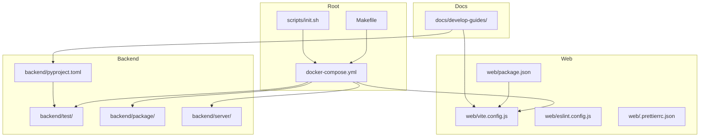
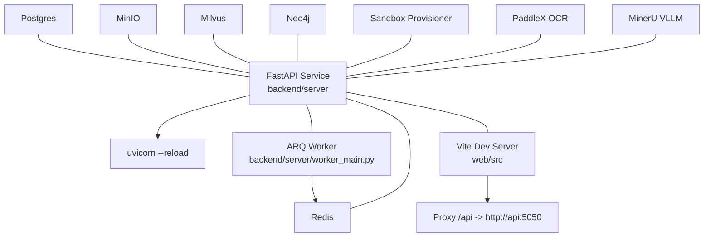
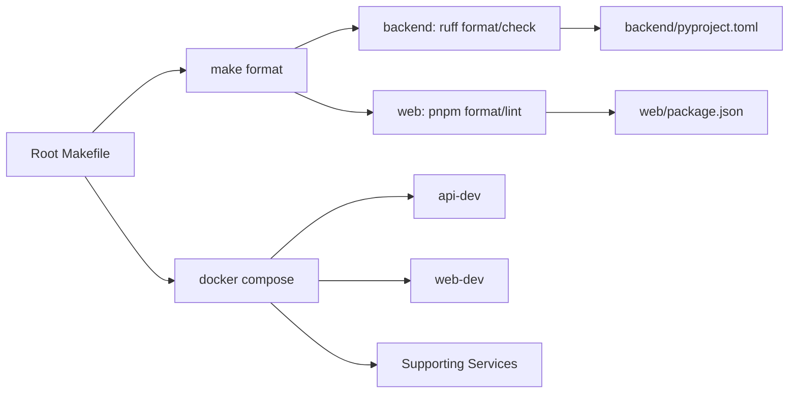

# Contributing & Development

<cite>
**Referenced Files in This Document**
- [CONTRIBUTING.md](file://CONTRIBUTING.md)
- [README.md](file://README.md)
- [Makefile](file://Makefile)
- [docker-compose.yml](file://docker-compose.yml)
- [scripts/init.sh](file://scripts/init.sh)
- [.github/PULL_REQUEST_TEMPLATE.md](file://.github/PULL_REQUEST_TEMPLATE.md)
- [backend/pyproject.toml](file://backend/pyproject.toml)
- [backend/test/run_tests.sh](file://backend/test/run_tests.sh)
- [backend/test/conftest.py](file://backend/test/conftest.py)
- [web/package.json](file://web/package.json)
- [web/vite.config.js](file://web/vite.config.js)
- [web/eslint.config.js](file://web/eslint.config.js)
- [web/.prettierrc.json](file://web/.prettierrc.json)
- [docs/develop-guides/contributing.md](file://docs/develop-guides/contributing.md)
- [docs/develop-guides/design.md](file://docs/develop-guides/design.md)
</cite>

## Table of Contents
1. [Introduction](#introduction)
2. [Project Structure](#project-structure)
3. [Core Components](#core-components)
4. [Architecture Overview](#architecture-overview)
5. [Detailed Component Analysis](#detailed-component-analysis)
6. [Dependency Analysis](#dependency-analysis)
7. [Performance Considerations](#performance-considerations)
8. [Troubleshooting Guide](#troubleshooting-guide)
9. [Conclusion](#conclusion)
10. [Appendices](#appendices)

## Introduction
This document provides comprehensive contributing and development guidance for the Yuxi project. It covers environment setup, IDE configuration, debugging, local workflows, code standards, testing requirements, code review and quality gates, pull request and branch management, release procedures, development tools, automation utilities, and practical contribution scenarios. It also outlines community guidelines, communication channels, and governance practices.

## Project Structure
Yuxi is a full-stack platform built with Vue 3 (frontend), FastAPI (backend), and Docker Compose for development and production orchestration. The repository is organized into:
- backend: Python-based FastAPI server, package, and tests
- web: Vue 3 frontend with TypeScript/JS, Vite, and ESLint/Prettier
- docker: Multi-service Dockerfiles and compose configuration
- docs: Developer and user documentation
- scripts: Helper scripts for environment initialization and image management
- Root: Top-level Makefile, CI/CD templates, and contribution guidelines

**Diagram sources**
- [docker-compose.yml:37-436](file://docker-compose.yml#L37-L436)
- [Makefile:1-39](file://Makefile#L1-L39)
- [backend/pyproject.toml:1-66](file://backend/pyproject.toml#L1-L66)
- [web/package.json:1-51](file://web/package.json#L1-L51)
- [web/vite.config.js:1-30](file://web/vite.config.js#L1-L30)
- [web/eslint.config.js:1-28](file://web/eslint.config.js#L1-L28)
- [web/.prettierrc.json:1-8](file://web/.prettierrc.json#L1-L8)
- [docs/develop-guides/contributing.md:1-212](file://docs/develop-guides/contributing.md#L1-L212)

**Section sources**
- [README.md:97-119](file://README.md#L97-L119)
- [docker-compose.yml:37-436](file://docker-compose.yml#L37-L436)
- [Makefile:1-39](file://Makefile#L1-L39)
- [scripts/init.sh:1-86](file://scripts/init.sh#L1-L86)

## Core Components
- Backend development environment via Docker Compose with hot reload for server and package directories.
- Frontend development served by Vite with proxy to backend API.
- Automated formatting and linting for both backend (Ruff) and frontend (ESLint/Prettier).
- Test automation via pytest groups and a convenience runner script.
- Makefile targets for up/down, lite mode, logs, and formatting/linting.

Key developer commands and locations:
- Start services: docker compose up -d
- Lite mode startup: make up-lite
- Logs: make logs
- Format and lint: make format
- Run tests: backend/test/run_tests.sh (or docker compose exec api uv run pytest)

**Section sources**
- [docs/develop-guides/contributing.md:28-48](file://docs/develop-guides/contributing.md#L28-L48)
- [Makefile:6-38](file://Makefile#L6-L38)
- [backend/test/run_tests.sh:1-88](file://backend/test/run_tests.sh#L1-L88)
- [web/vite.config.js:15-27](file://web/vite.config.js#L15-L27)

## Architecture Overview
The development architecture centers on Docker Compose orchestrating backend API, worker, web UI, and supporting services (Postgres, Redis, MinIO, Milvus, Neo4j, sandbox provisioner, OCR/VLM services). Hot reload is configured for backend server and package directories, and for frontend source files.

**Diagram sources**
- [docker-compose.yml:38-436](file://docker-compose.yml#L38-L436)
- [web/vite.config.js:16-21](file://web/vite.config.js#L16-L21)

**Section sources**
- [docker-compose.yml:38-436](file://docker-compose.yml#L38-L436)
- [web/vite.config.js:15-27](file://web/vite.config.js#L15-L27)

## Detailed Component Analysis

### Development Environment Setup
- Prerequisites: Docker, Docker Compose, pnpm (for frontend), Python 3.12+ (via uv in container).
- Initialize environment variables and pull images with scripts/init.sh.
- Start services with docker compose up -d; verify health checks.
- Lite mode for reduced dependencies via make up-lite.

Recommended IDE configuration:
- Backend: Python interpreter from uv in container; enable format-on-save with Ruff; configure pytest group “test”.
- Frontend: VS Code with Volar/Vue extension; configure ESLint and Prettier; set Vite proxy target to http://api:5050.

Debugging tips:
- Use docker logs api-dev to inspect backend logs.
- Enable hot reload for backend server and package directories; for frontend, changes are reflected immediately.
- Use docker compose exec api to run targeted commands inside the backend container.

**Section sources**
- [scripts/init.sh:11-50](file://scripts/init.sh#L11-L50)
- [docker-compose.yml:64-84](file://docker-compose.yml#L64-L84)
- [Makefile:6-27](file://Makefile#L6-L27)
- [docs/develop-guides/contributing.md:28-48](file://docs/develop-guides/contributing.md#L28-L48)

### Code Standards and Conventions
Backend (Python):
- Style: Python 3.12+ idioms; formatting and linting via Ruff.
- Formatting and linting: make format applies ruff format/check and import sorting; also runs backend tests.
- Dependencies and dev/test groups are declared in backend/pyproject.toml.

Frontend (Vue/JS):
- Package manager: pnpm.
- Linting: ESLint flat config with Vue plugin and prettier integration.
- Formatting: Prettier with semi:false, tabWidth 2, singleQuote, printWidth 100, trailingComma none.
- Proxy: Vite proxy routes /api to backend.

Design guidelines:
- UI simplicity, consistency, and dark mode compatibility; avoid decorative motion and excessive gradients.

**Section sources**
- [backend/pyproject.toml:13-66](file://backend/pyproject.toml#L13-L66)
- [Makefile:33-38](file://Makefile#L33-L38)
- [web/package.json:5-13](file://web/package.json#L5-L13)
- [web/eslint.config.js:1-28](file://web/eslint.config.js#L1-L28)
- [web/.prettierrc.json:1-8](file://web/.prettierrc.json#L1-L8)
- [docs/develop-guides/design.md:1-69](file://docs/develop-guides/design.md#L1-L69)

### Testing Requirements and Quality Gates
Test categories and markers:
- Unit tests: isolated logic without live services.
- Integration tests: hit the live API service.
- E2E tests: end-to-end workflows.
- Slow tests: marked separately.

Runner script:
- backend/test/run_tests.sh supports unit, integration, e2e, all, and health checks.
- Requires docker compose up -d and healthy api-dev.

Quality gates:
- Pre-commit: run make format and make lint.
- Tests must pass locally before opening a PR.
- Sufficient coverage for new features and bug fixes.

**Section sources**
- [backend/test/conftest.py:17-26](file://backend/test/conftest.py#L17-L26)
- [backend/test/run_tests.sh:22-43](file://backend/test/run_tests.sh#L22-L43)
- [backend/pyproject.toml:41-54](file://backend/pyproject.toml#L41-L54)
- [docs/develop-guides/contributing.md:125-146](file://docs/develop-guides/contributing.md#L125-L146)

### Pull Request Workflow and Branch Management
- Fork the repository and create feature/fix/docs branches with clear, semantic names.
- Keep PRs focused on a single issue; include screenshots or recordings for UI changes.
- Describe changes, impact, and verification steps; update docs when applicable.
- Use conventional commit prefixes: feat, fix, docs, refactor, test, chore.

Review process:
- Ensure CI passes and tests are green.
- Address reviewer comments promptly; keep PRs rebased and up to date.

**Section sources**
- [docs/develop-guides/contributing.md:49-96](file://docs/develop-guides/contributing.md#L49-L96)
- [CONTRIBUTING.md:25-38](file://CONTRIBUTING.md#L25-L38)
- [.github/PULL_REQUEST_TEMPLATE.md:1-22](file://.github/PULL_REQUEST_TEMPLATE.md#L1-L22)

### Release Procedures and Hotfix Flow
Release flow:
- Tag releases on main after merging approved PRs.
- Hotfixes: if main contains unmerged work, branch from the previous tag, apply minimal fix, merge to main, tag, and clean up the temporary branch.

**Section sources**
- [docs/develop-guides/contributing.md:160-194](file://docs/develop-guides/contributing.md#L160-L194)

### Development Tools and Automation Utilities
- Makefile: up, down, up-lite, logs, format, lint.
- Docker Compose: orchestrates services, health checks, and hot reload.
- Scripts: scripts/init.sh for environment setup and image pulling.
- Backend: uv for Python tooling; pytest groups for test selection.
- Frontend: Vite dev server with proxy; ESLint and Prettier for code quality.

**Section sources**
- [Makefile:1-39](file://Makefile#L1-L39)
- [scripts/init.sh:52-86](file://scripts/init.sh#L52-L86)
- [backend/pyproject.toml:22-66](file://backend/pyproject.toml#L22-L66)
- [web/vite.config.js:15-27](file://web/vite.config.js#L15-L27)

### Practical Contribution Scenarios
- Bug fix:
  - Create a fix/* branch.
  - Add or adjust unit/integration tests under backend/test.
  - Run make format and make lint; ensure backend/test/run_tests.sh passes.
  - Open PR with concise description and verification steps.

- Feature addition:
  - Open an issue first for larger features.
  - Implement in backend/server and/or web/src; add tests.
  - Update docs if user-visible behavior changes.
  - Use PR template to describe changes and include screenshots if UI-related.

- Documentation improvement:
  - Update docs/develop-guides/*.md or user docs as needed.
  - Keep PR focused; link related issues.

**Section sources**
- [docs/develop-guides/contributing.md:11-18](file://docs/develop-guides/contributing.md#L11-L18)
- [docs/develop-guides/contributing.md:125-146](file://docs/develop-guides/contributing.md#L125-L146)
- [CONTRIBUTING.md:78-88](file://CONTRIBUTING.md#L78-L88)

### Community Guidelines, Communication, and Governance
- Issues: report bugs and request features via GitHub Issues.
- Discussions: propose designs and gather feedback via GitHub Discussions.
- Contributors: see the contributor graph linked from docs/develop-guides/contributing.md.

Governance:
- Maintainers triage issues and review PRs.
- Decisions follow consensus; maintainers have the final say on architectural changes.

**Section sources**
- [docs/develop-guides/contributing.md:206-211](file://docs/develop-guides/contributing.md#L206-L211)
- [CONTRIBUTING.md:89-92](file://CONTRIBUTING.md#L89-L92)

## Dependency Analysis
The backend and frontend rely on Docker Compose-managed services. Backend dependencies are declared in backend/pyproject.toml; frontend dependencies in web/package.json. The Makefile coordinates formatting and linting across both stacks.

**Diagram sources**
- [Makefile:33-38](file://Makefile#L33-L38)
- [backend/pyproject.toml:13-66](file://backend/pyproject.toml#L13-L66)
- [web/package.json:5-13](file://web/package.json#L5-L13)
- [docker-compose.yml:37-436](file://docker-compose.yml#L37-L436)

**Section sources**
- [backend/pyproject.toml:13-66](file://backend/pyproject.toml#L13-L66)
- [web/package.json:14-49](file://web/package.json#L14-L49)
- [Makefile:33-38](file://Makefile#L33-L38)

## Performance Considerations
- Prefer unit tests for fast feedback; reserve integration and E2E tests for workflow validation.
- Use lite mode (make up-lite) to reduce resource usage during development.
- Keep PRs small to minimize CI time and improve review turnaround.
- Use hot reload to avoid repeated container restarts.

## Troubleshooting Guide
Common issues and resolutions:
- Missing .env: The Makefile enforces .env presence; initialize with scripts/init.sh.
- Health checks failing: Verify docker compose up -d succeeded and services are healthy; use make logs to inspect api-dev logs.
- Frontend not reaching backend: Confirm Vite proxy target matches backend port (http://api:5050) and that api-dev is healthy.
- Tests timing out: Ensure backend is reachable and run backend/test/run_tests.sh check to validate health before running tests.

**Section sources**
- [Makefile:7-11](file://Makefile#L7-L11)
- [scripts/init.sh:11-50](file://scripts/init.sh#L11-L50)
- [docker-compose.yml:69-84](file://docker-compose.yml#L69-L84)
- [web/vite.config.js:16-21](file://web/vite.config.js#L16-L21)
- [backend/test/run_tests.sh:10-20](file://backend/test/run_tests.sh#L10-L20)

## Conclusion
By following the environment setup, code standards, testing, and PR processes outlined here, contributors can efficiently develop and ship high-quality changes to Yuxi. Use Docker Compose for consistent environments, Makefile targets for automation, and adhere to the documented conventions for a smooth collaboration experience.

## Appendices

### Quick Reference: Local Development Commands
- Initialize environment: scripts/init.sh
- Start services: docker compose up -d
- Start lite mode: make up-lite
- View logs: make logs
- Format and lint: make format
- Run tests: backend/test/run_tests.sh all

**Section sources**
- [scripts/init.sh:82-86](file://scripts/init.sh#L82-L86)
- [Makefile:6-27](file://Makefile#L6-L27)
- [backend/test/run_tests.sh:39-43](file://backend/test/run_tests.sh#L39-L43)