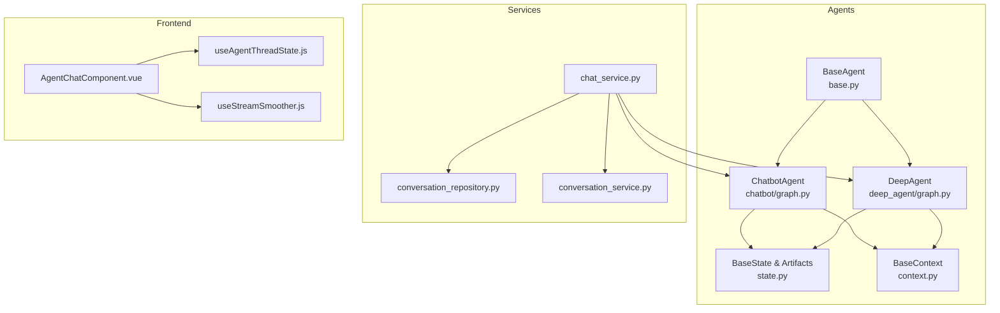
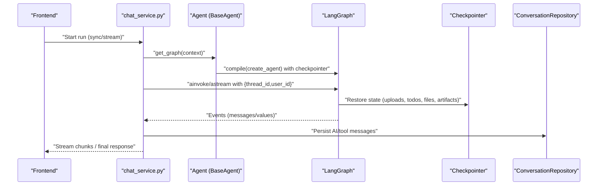
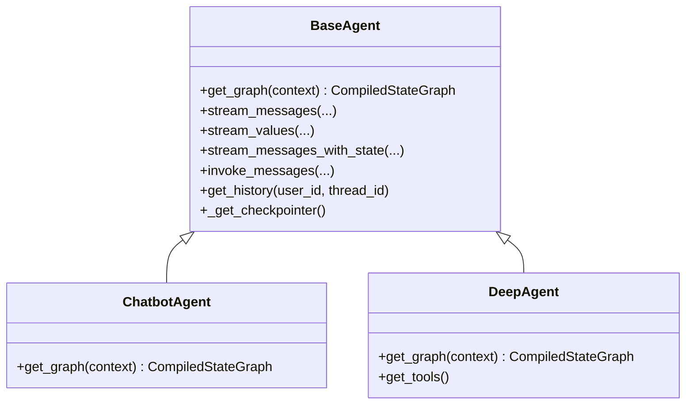
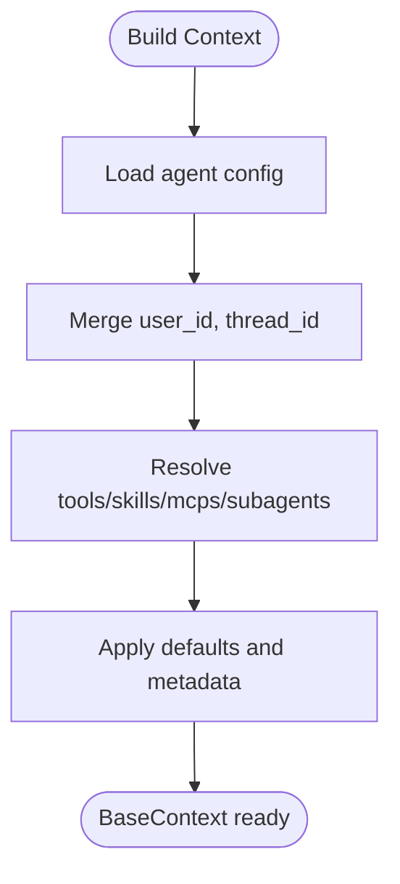
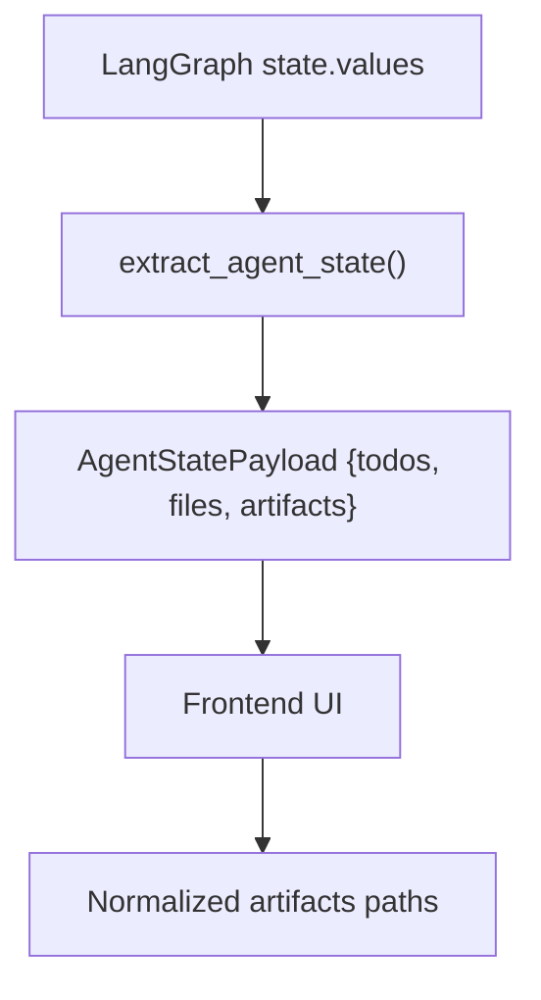
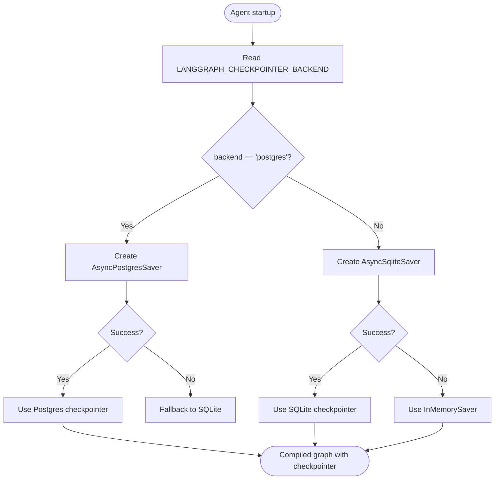
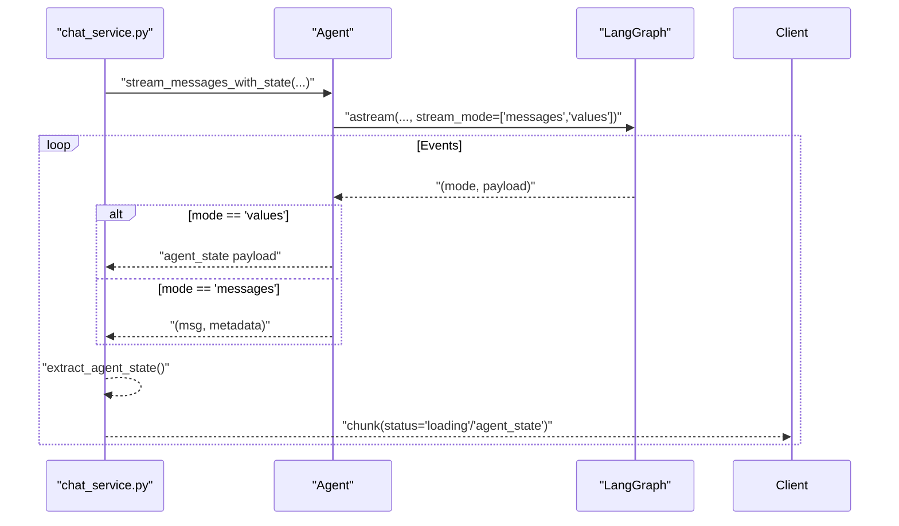
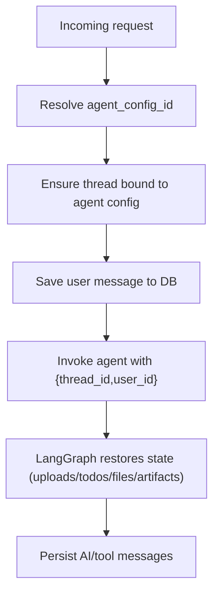
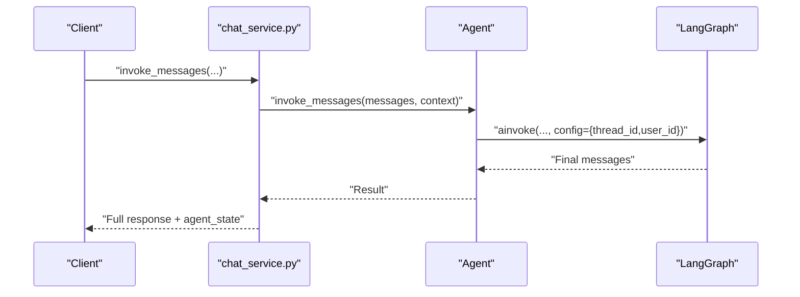
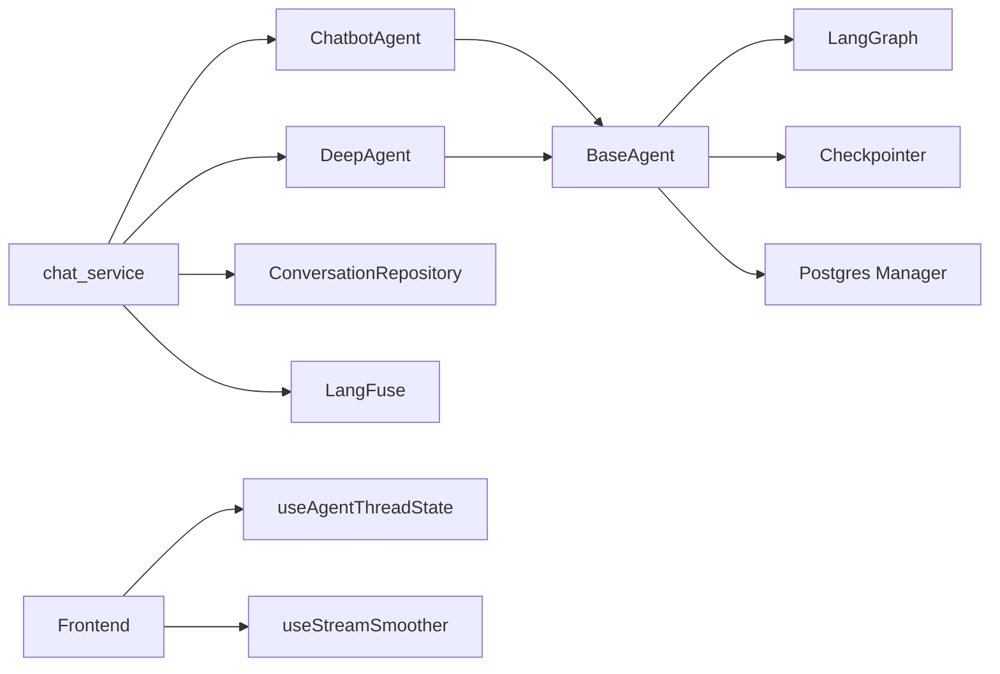

# Agent Lifecycle Management

<cite>
**Referenced Files in This Document**
- [base.py](file://backend/package/yuxi/agents/base.py)
- [state.py](file://backend/package/yuxi/agents/state.py)
- [context.py](file://backend/package/yuxi/agents/context.py)
- [graph.py (Chatbot)](file://backend/package/yuxi/agents/buildin/chatbot/graph.py)
- [graph.py (Deep Agent)](file://backend/package/yuxi/agents/buildin/deep_agent/graph.py)
- [chat_service.py](file://backend/package/yuxi/services/chat_service.py)
- [conversation_repository.py](file://backend/package/yuxi/repositories/conversation_repository.py)
- [conversation_service.py](file://backend/package/yuxi/services/conversation_service.py)
- [useAgentThreadState.js](file://web/src/composables/useAgentThreadState.js)
- [useStreamSmoother.js](file://web/src/composables/useStreamSmoother.js)
- [AgentChatComponent.vue](file://web/src/components/AgentChatComponent.vue)
- [test_attachment_and_agent_state.py](file://backend/test/e2e/test_attachment_and_agent_state.py)
- [test_agent_artifacts_state.py](file://backend/test/unit/services/test_agent_artifacts_state.py)
- [agent_run_repository.py](file://backend/package/yuxi/repositories/agent_run_repository.py)
</cite>

## Table of Contents
1. [Introduction](#introduction)
2. [Project Structure](#project-structure)
3. [Core Components](#core-components)
4. [Architecture Overview](#architecture-overview)
5. [Detailed Component Analysis](#detailed-component-analysis)
6. [Dependency Analysis](#dependency-analysis)
7. [Performance Considerations](#performance-considerations)
8. [Troubleshooting Guide](#troubleshooting-guide)
9. [Conclusion](#conclusion)

## Introduction
This document explains agent lifecycle management in Yuxi’s LangGraph-based system. It covers the end-to-end execution cycle from initialization to completion, including context building, state management, and memory persistence. It documents checkpointer backends (SQLite, PostgreSQL, memory), streaming modes (values, messages, values+messages), thread-based conversation tracking, user context management, artifact handling, invocation patterns, state restoration, error handling, isolation, resource cleanup, and performance optimization strategies.

## Project Structure
Yuxi organizes agent logic around a shared BaseAgent abstraction and specialized agents (Chatbot and Deep Agent). Services orchestrate streaming and synchronous runs, persist conversation history, and manage artifacts. Frontend composable utilities coordinate per-thread state and streaming smoothing.

**Diagram sources**
- [base.py:17-197](file://backend/package/yuxi/agents/base.py#L17-L197)
- [graph.py (Chatbot):65-96](file://backend/package/yuxi/agents/buildin/chatbot/graph.py#L65-L96)
- [graph.py (Deep Agent):27-123](file://backend/package/yuxi/agents/buildin/deep_agent/graph.py#L27-L123)
- [state.py:10-31](file://backend/package/yuxi/agents/state.py#L10-L31)
- [context.py:11-191](file://backend/package/yuxi/agents/context.py#L11-L191)
- [chat_service.py:464-930](file://backend/package/yuxi/services/chat_service.py#L464-L930)
- [conversation_repository.py:41-77](file://backend/package/yuxi/repositories/conversation_repository.py#L41-L77)
- [conversation_service.py:166-216](file://backend/package/yuxi/services/conversation_service.py#L166-L216)
- [useAgentThreadState.js:1-100](file://web/src/composables/useAgentThreadState.js#L1-L100)
- [useStreamSmoother.js:232-256](file://web/src/composables/useStreamSmoother.js#L232-L256)
- [AgentChatComponent.vue:853-887](file://web/src/components/AgentChatComponent.vue#L853-L887)

**Section sources**
- [base.py:17-197](file://backend/package/yuxi/agents/base.py#L17-L197)
- [graph.py (Chatbot):65-96](file://backend/package/yuxi/agents/buildin/chatbot/graph.py#L65-L96)
- [graph.py (Deep Agent):27-123](file://backend/package/yuxi/agents/buildin/deep_agent/graph.py#L27-L123)
- [state.py:10-31](file://backend/package/yuxi/agents/state.py#L10-L31)
- [context.py:11-191](file://backend/package/yuxi/agents/context.py#L11-L191)
- [chat_service.py:464-930](file://backend/package/yuxi/services/chat_service.py#L464-L930)
- [conversation_repository.py:41-77](file://backend/package/yuxi/repositories/conversation_repository.py#L41-L77)
- [conversation_service.py:166-216](file://backend/package/yuxi/services/conversation_service.py#L166-L216)
- [useAgentThreadState.js:1-100](file://web/src/composables/useAgentThreadState.js#L1-L100)
- [useStreamSmoother.js:232-256](file://web/src/composables/useStreamSmoother.js#L232-L256)
- [AgentChatComponent.vue:853-887](file://web/src/components/AgentChatComponent.vue#L853-L887)

## Core Components
- BaseAgent: Provides shared agent capabilities, streaming modes, invocation, checkpointer selection, and history retrieval.
- BaseState: Defines shared state fields including artifacts with merge semantics.
- BaseContext: Supplies configurable runtime parameters (thread_id, user_id, model, tools, skills, subagents, summary threshold, etc.).
- ChatbotAgent and DeepAgent: Specialized agents that construct LangGraph agents with middleware, filesystem, knowledge base, skills, subagents, and summarization.
- chat_service: Orchestrates synchronous and streaming runs, manages LangFuse tracing, guards content, persists messages, extracts agent state, and handles interruptions.
- Repositories and Services: Persist and manage conversations, uploads, and artifacts; synchronize upload state into agent state.

**Section sources**
- [base.py:17-197](file://backend/package/yuxi/agents/base.py#L17-L197)
- [state.py:10-31](file://backend/package/yuxi/agents/state.py#L10-L31)
- [context.py:11-191](file://backend/package/yuxi/agents/context.py#L11-L191)
- [graph.py (Chatbot):65-96](file://backend/package/yuxi/agents/buildin/chatbot/graph.py#L65-L96)
- [graph.py (Deep Agent):27-123](file://backend/package/yuxi/agents/buildin/deep_agent/graph.py#L27-L123)
- [chat_service.py:464-930](file://backend/package/yuxi/services/chat_service.py#L464-L930)
- [conversation_repository.py:41-77](file://backend/package/yuxi/repositories/conversation_repository.py#L41-L77)
- [conversation_service.py:166-216](file://backend/package/yuxi/services/conversation_service.py#L166-L216)

## Architecture Overview
The agent lifecycle centers on BaseAgent and specialized agents, with LangGraph checkpointer enabling state persistence across runs. Services drive execution, enforce content safety, and persist conversation messages. Frontend composable utilities track per-thread state and smooth streaming.

**Diagram sources**
- [base.py:190-197](file://backend/package/yuxi/agents/base.py#L190-L197)
- [graph.py (Chatbot):81-96](file://backend/package/yuxi/agents/buildin/chatbot/graph.py#L81-L96)
- [graph.py (Deep Agent):52-123](file://backend/package/yuxi/agents/buildin/deep_agent/graph.py#L52-L123)
- [chat_service.py:657-930](file://backend/package/yuxi/services/chat_service.py#L657-L930)
- [conversation_repository.py:41-77](file://backend/package/yuxi/repositories/conversation_repository.py#L41-L77)

## Detailed Component Analysis

### Agent Initialization and Graph Construction
- BaseAgent compiles a LangGraph agent with a checkpointer injected at compile time. Specialized agents (ChatbotAgent, DeepAgent) supply middleware stacks and state schema.
- Middleware include filesystem, knowledge base, skills, subagents, summarization, tool-call patching, and retries. These shape context building and execution behavior.

**Diagram sources**
- [base.py:190-197](file://backend/package/yuxi/agents/base.py#L190-L197)
- [graph.py (Chatbot):81-96](file://backend/package/yuxi/agents/buildin/chatbot/graph.py#L81-L96)
- [graph.py (Deep Agent):52-123](file://backend/package/yuxi/agents/buildin/deep_agent/graph.py#L52-L123)

**Section sources**
- [base.py:190-197](file://backend/package/yuxi/agents/base.py#L190-L197)
- [graph.py (Chatbot):65-96](file://backend/package/yuxi/agents/buildin/chatbot/graph.py#L65-L96)
- [graph.py (Deep Agent):27-123](file://backend/package/yuxi/agents/buildin/deep_agent/graph.py#L27-L123)

### Context Building and User/Thread Management
- BaseContext defines configurable fields including thread_id, user_id, model, tools, skills, subagents, and summary thresholds. It supports dynamic resolution of MCP servers and lists.
- chat_service constructs input_context by merging agent config with runtime user/thread identifiers and passes them to agent invocation/streaming.

**Diagram sources**
- [context.py:11-191](file://backend/package/yuxi/agents/context.py#L11-L191)
- [chat_service.py:544-551](file://backend/package/yuxi/services/chat_service.py#L544-L551)

**Section sources**
- [context.py:11-191](file://backend/package/yuxi/agents/context.py#L11-L191)
- [chat_service.py:544-551](file://backend/package/yuxi/services/chat_service.py#L544-L551)

### State Management and Artifacts
- BaseState extends AgentState with an annotated artifacts list and a merge function to deduplicate while preserving order.
- chat_service.extract_agent_state maps LangGraph values to a frontend-friendly payload including todos, files, and artifacts.
- E2E and unit tests confirm that attachments propagate into agent state and artifacts are normalized and validated.

**Diagram sources**
- [state.py:10-31](file://backend/package/yuxi/agents/state.py#L10-L31)
- [chat_service.py:104-118](file://backend/package/yuxi/services/chat_service.py#L104-L118)
- [test_attachment_and_agent_state.py:84-119](file://backend/test/e2e/test_attachment_and_agent_state.py#L84-L119)
- [test_agent_artifacts_state.py:66-70](file://backend/test/unit/services/test_agent_artifacts_state.py#L66-L70)

**Section sources**
- [state.py:10-31](file://backend/package/yuxi/agents/state.py#L10-L31)
- [chat_service.py:104-118](file://backend/package/yuxi/services/chat_service.py#L104-L118)
- [test_attachment_and_agent_state.py:84-119](file://backend/test/e2e/test_attachment_and_agent_state.py#L84-L119)
- [test_agent_artifacts_state.py:66-70](file://backend/test/unit/services/test_agent_artifacts_state.py#L66-L70)

### Memory Persistence and Checkpointers
- BaseAgent selects a checkpointer backend at runtime:
  - Environment variable determines backend ("postgres" or default "sqlite").
  - PostgreSQL: AsyncPostgresSaver backed by a managed pool; falls back if unavailable.
  - SQLite: AsyncSqliteSaver with a local aio_history.db; falls back to InMemorySaver on failure.
- Specialized agents compile with checkpointer=await self._get_checkpointer() to enable state restoration across runs.

**Diagram sources**
- [base.py:199-254](file://backend/package/yuxi/agents/base.py#L199-L254)
- [graph.py (Chatbot):93-94](file://backend/package/yuxi/agents/buildin/chatbot/graph.py#L93-L94)
- [graph.py (Deep Agent):120-121](file://backend/package/yuxi/agents/buildin/deep_agent/graph.py#L120-L121)

**Section sources**
- [base.py:199-254](file://backend/package/yuxi/agents/base.py#L199-L254)
- [graph.py (Chatbot):93-94](file://backend/package/yuxi/agents/buildin/chatbot/graph.py#L93-L94)
- [graph.py (Deep Agent):120-121](file://backend/package/yuxi/agents/buildin/deep_agent/graph.py#L120-L121)

### Streaming Modes and Use Cases
- values: Emits incremental agent_state payloads for UI to reflect todos/files/artifacts updates.
- messages: Emits AIMessage/AIMessageChunk and metadata for streaming LLM output.
- values+messages: Streams both agent_state updates and message chunks concurrently.
- chat_service routes to appropriate stream_* method and yields structured JSON chunks with status, content, and metadata.

**Diagram sources**
- [base.py:99-123](file://backend/package/yuxi/agents/base.py#L99-L123)
- [chat_service.py:130-142](file://backend/package/yuxi/services/chat_service.py#L130-L142)
- [chat_service.py:794-835](file://backend/package/yuxi/services/chat_service.py#L794-L835)

**Section sources**
- [base.py:64-123](file://backend/package/yuxi/agents/base.py#L64-L123)
- [chat_service.py:794-835](file://backend/package/yuxi/services/chat_service.py#L794-L835)

### Thread-Based Conversation Tracking and User Context
- chat_service ensures a thread is bound to the current agent configuration and persists user messages before invoking the agent.
- LangGraph configuration includes {"configurable": {"thread_id", "user_id"}} so state is isolated per thread and user.
- conversation_service synchronizes uploaded files into agent state via graph.aupdate_state, ensuring uploads are reflected in agent context.

**Diagram sources**
- [chat_service.py:564-592](file://backend/package/yuxi/services/chat_service.py#L564-L592)
- [conversation_service.py:166-189](file://backend/package/yuxi/services/conversation_service.py#L166-L189)
- [conversation_repository.py:41-77](file://backend/package/yuxi/repositories/conversation_repository.py#L41-L77)

**Section sources**
- [chat_service.py:564-592](file://backend/package/yuxi/services/chat_service.py#L564-L592)
- [conversation_service.py:166-189](file://backend/package/yuxi/services/conversation_service.py#L166-L189)
- [conversation_repository.py:41-77](file://backend/package/yuxi/repositories/conversation_repository.py#L41-L77)

### Artifact Handling and Normalization
- Artifacts are merged with deduplication and order preservation.
- Tests validate normalization of artifact paths and rejection of non-outputs paths.
- chat_service.extract_agent_state caps todos and forwards files/artifacts to the UI.

**Section sources**
- [state.py:10-16](file://backend/package/yuxi/agents/state.py#L10-L16)
- [test_agent_artifacts_state.py:27-63](file://backend/test/unit/services/test_agent_artifacts_state.py#L27-L63)
- [chat_service.py:104-118](file://backend/package/yuxi/services/chat_service.py#L104-L118)

### Invocation Patterns and State Restoration
- Synchronous invocation: agent.invoke_messages(...) returns the final message after execution.
- Streaming invocation: agent.stream_messages(...) or stream_messages_with_state(...) streams intermediate events and agent_state updates.
- State restoration: LangGraph automatically restores state from the selected checkpointer using thread_id and user_id.

**Diagram sources**
- [base.py:125-150](file://backend/package/yuxi/agents/base.py#L125-L150)
- [chat_service.py:586-592](file://backend/package/yuxi/services/chat_service.py#L586-L592)

**Section sources**
- [base.py:125-150](file://backend/package/yuxi/agents/base.py#L125-L150)
- [chat_service.py:586-592](file://backend/package/yuxi/services/chat_service.py#L586-L592)

### Error Handling During Execution
- chat_service wraps execution in try/catch, yielding structured error chunks and saving partial messages when errors occur or clients disconnect.
- Content guard checks are applied incrementally during streaming and at the end; sensitive content triggers interruption and partial message saving.
- Interrupts (e.g., ask_user_question) are detected and emitted as special status chunks.

**Section sources**
- [chat_service.py:879-927](file://backend/package/yuxi/services/chat_service.py#L879-L927)
- [chat_service.py:817-829](file://backend/package/yuxi/services/chat_service.py#L817-L829)
- [chat_service.py:418-441](file://backend/package/yuxi/services/chat_service.py#L418-L441)

### Frontend Thread State and Streaming Smoothing
- useAgentThreadState tracks per-thread streaming state, abort controllers, ongoing conversation buffers, and agentState snapshots.
- useStreamSmoother smooths streamed deltas and emits buffered chunks according to budgets and pacing.
- AgentChatComponent fetches agent state, refreshes thread files/attachments, and integrates with streaming.

**Section sources**
- [useAgentThreadState.js:1-100](file://web/src/composables/useAgentThreadState.js#L1-L100)
- [useStreamSmoother.js:232-256](file://web/src/composables/useStreamSmoother.js#L232-L256)
- [AgentChatComponent.vue:853-887](file://web/src/components/AgentChatComponent.vue#L853-L887)

### Agent Run Isolation and Cleanup
- AgentRunRepository maintains run isolation with terminal statuses and concurrency-safe transitions.
- chat_service saves partial messages on interruption and ensures database writes precede “finished” to avoid race conditions.

**Section sources**
- [agent_run_repository.py:14-103](file://backend/package/yuxi/repositories/agent_run_repository.py#L14-L103)
- [chat_service.py:882-927](file://backend/package/yuxi/services/chat_service.py#L882-L927)

## Dependency Analysis
- BaseAgent depends on LangGraph checkpointers and PostgreSQL manager for persistence.
- Specialized agents depend on middleware stacks and toolkits to enrich context and capabilities.
- Services depend on repositories for conversation persistence and on LangFuse for observability.
- Frontend composables depend on chat state to coordinate streaming and UI updates.

**Diagram sources**
- [base.py:199-254](file://backend/package/yuxi/agents/base.py#L199-L254)
- [graph.py (Chatbot):81-96](file://backend/package/yuxi/agents/buildin/chatbot/graph.py#L81-L96)
- [graph.py (Deep Agent):52-123](file://backend/package/yuxi/agents/buildin/deep_agent/graph.py#L52-L123)
- [chat_service.py:464-930](file://backend/package/yuxi/services/chat_service.py#L464-L930)
- [conversation_repository.py:41-77](file://backend/package/yuxi/repositories/conversation_repository.py#L41-L77)

**Section sources**
- [base.py:199-254](file://backend/package/yuxi/agents/base.py#L199-L254)
- [graph.py (Chatbot):81-96](file://backend/package/yuxi/agents/buildin/chatbot/graph.py#L81-L96)
- [graph.py (Deep Agent):52-123](file://backend/package/yuxi/agents/buildin/deep_agent/graph.py#L52-L123)
- [chat_service.py:464-930](file://backend/package/yuxi/services/chat_service.py#L464-L930)
- [conversation_repository.py:41-77](file://backend/package/yuxi/repositories/conversation_repository.py#L41-L77)

## Performance Considerations
- Choose PostgreSQL checkpointer for multi-instance deployments and high durability needs; fall back gracefully to SQLite/memory.
- Limit tool-call counts and recursion depth to prevent runaway executions.
- Use summarization middleware to cap context size and reduce latency.
- Stream values updates sparingly; batch UI updates to reduce render churn.
- Ensure uploads are materialized and normalized early to avoid repeated IO overhead.

## Troubleshooting Guide
- No history restored: Verify checkpointer availability and that thread_id/user_id are present in config.
- Streaming stalls: Confirm stream_mode and that agent_state diffs are being emitted and consumed.
- Interrupts not shown: Ensure interrupts are extracted and emitted as ask_user_question_required.
- Partial messages not saved: Check error paths and cleanup tasks that write partial messages on interruption.

**Section sources**
- [base.py:158-184](file://backend/package/yuxi/agents/base.py#L158-L184)
- [chat_service.py:418-441](file://backend/package/yuxi/services/chat_service.py#L418-L441)
- [chat_service.py:879-927](file://backend/package/yuxi/services/chat_service.py#L879-L927)

## Conclusion
Yuxi’s agent lifecycle leverages LangGraph’s compiled state graphs with pluggable checkpointers, robust streaming modes, and strong separation of concerns across agents, services, and frontend utilities. By combining thread-based isolation, artifact-aware state, and resilient error handling, the system supports reliable, scalable conversational AI experiences.