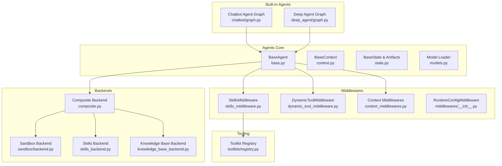
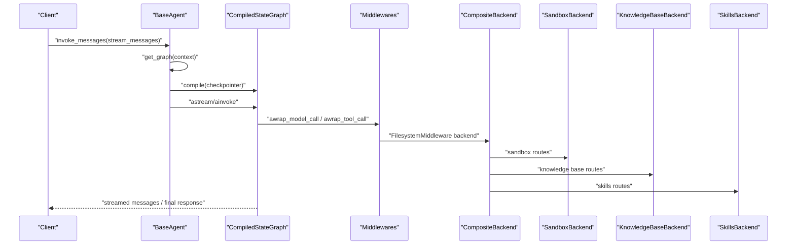
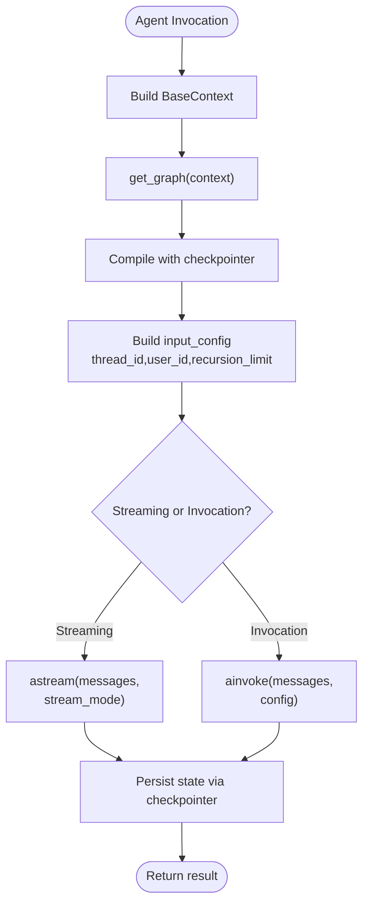
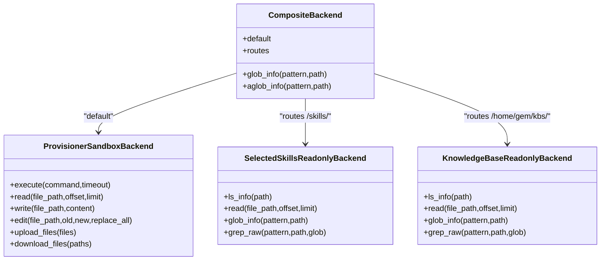
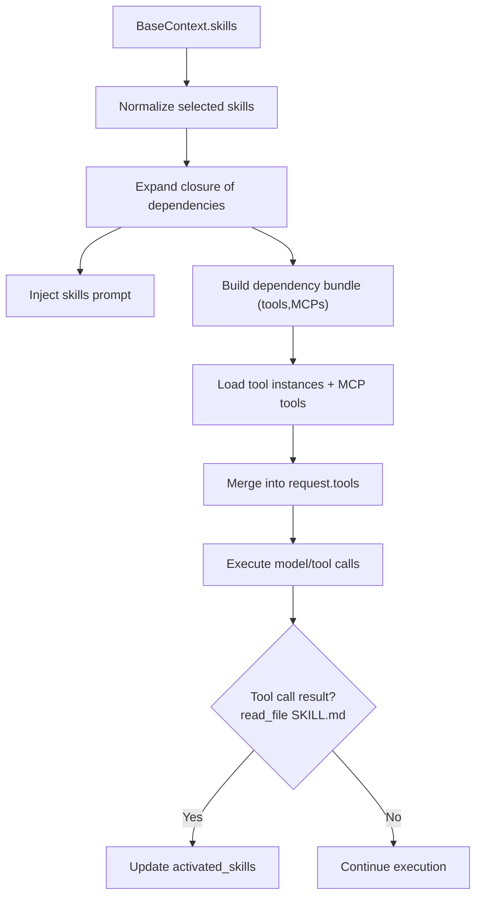
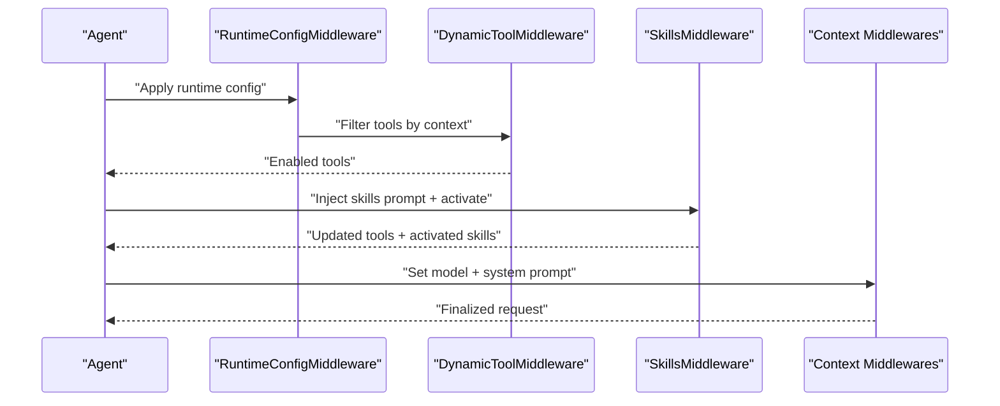
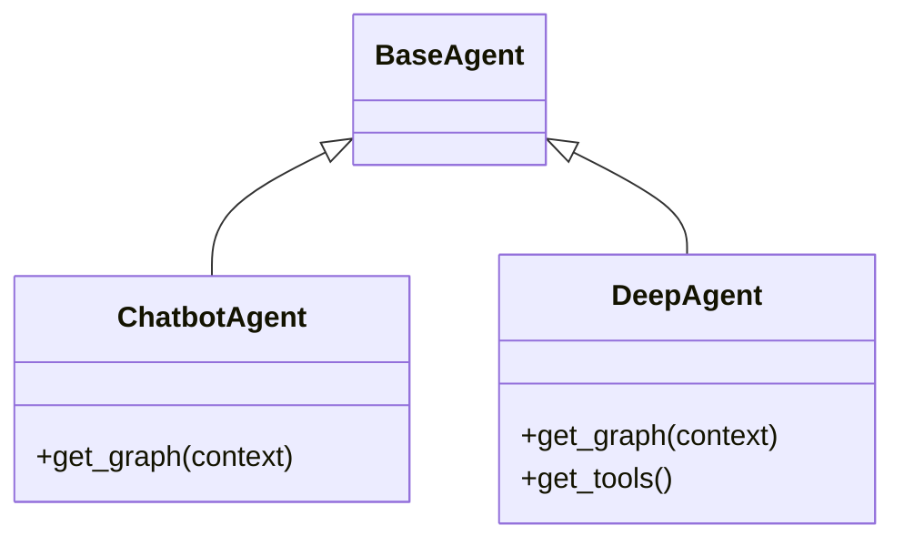
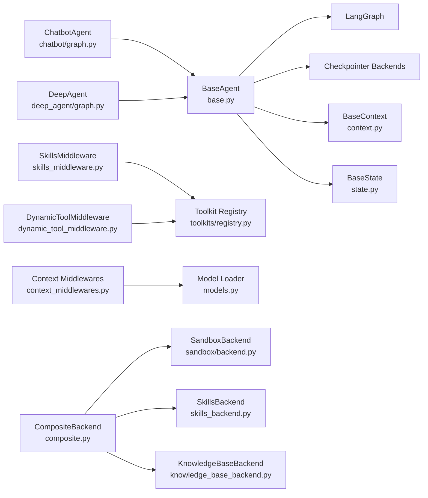

# Agent System Architecture

<cite>
**Referenced Files in This Document**
- [__init__.py](file://backend/package/yuxi/agents/__init__.py)
- [base.py](file://backend/package/yuxi/agents/base.py)
- [context.py](file://backend/package/yuxi/agents/context.py)
- [state.py](file://backend/package/yuxi/agents/state.py)
- [models.py](file://backend/package/yuxi/agents/models.py)
- [composite.py](file://backend/package/yuxi/agents/backends/composite.py)
- [skills_backend.py](file://backend/package/yuxi/agents/backends/skills_backend.py)
- [knowledge_base_backend.py](file://backend/package/yuxi/agents/backends/knowledge_base_backend.py)
- [backend.py](file://backend/package/yuxi/agents/backends/sandbox/backend.py)
- [__init__.py](file://backend/package/yuxi/agents/middlewares/__init__.py)
- [skills_middleware.py](file://backend/package/yuxi/agents/middlewares/skills_middleware.py)
- [context_middlewares.py](file://backend/package/yuxi/agents/middlewares/context_middlewares.py)
- [dynamic_tool_middleware.py](file://backend/package/yuxi/agents/middlewares/dynamic_tool_middleware.py)
- [graph.py](file://backend/package/yuxi/agents/buildin/chatbot/graph.py)
- [graph.py](file://backend/package/yuxi/agents/buildin/deep_agent/graph.py)
- [registry.py](file://backend/package/yuxi/agents/toolkits/registry.py)
</cite>

## Table of Contents
1. [Introduction](#introduction)
2. [Project Structure](#project-structure)
3. [Core Components](#core-components)
4. [Architecture Overview](#architecture-overview)
5. [Detailed Component Analysis](#detailed-component-analysis)
6. [Dependency Analysis](#dependency-analysis)
7. [Performance Considerations](#performance-considerations)
8. [Troubleshooting Guide](#troubleshooting-guide)
9. [Conclusion](#conclusion)

## Introduction
This document describes the agent system architecture built on LangGraph v1 within Yuxi. It explains the agent orchestration framework, the composite backend pattern, the skill integration system, and the middleware pipeline. It documents the agent lifecycle from initialization through execution, including context building, tool calling, and state management. It also details the relationships among agents, sub-agents, and skills, the LangGraph integration patterns, node connections, and conditional branching logic. Persistence mechanisms, memory management, and artifact handling are covered, along with examples of agent configuration, skill registration, and custom middleware development. Finally, it addresses agent isolation, sandbox execution, and resource management patterns.

## Project Structure
The agent system is organized around:
- Core agent abstractions and utilities
- Middleware pipeline for dynamic configuration and tool selection
- Composite backend for sandbox, skills, and knowledge base access
- Built-in agents (chatbot and deep agent) that assemble LangGraph agents with middleware and backends
- Toolkits and registries for tool discovery and metadata
- State and context schemas for shared runtime data

**Diagram sources**
- [base.py:17-263](file://backend/package/yuxi/agents/base.py#L17-L263)
- [context.py:11-191](file://backend/package/yuxi/agents/context.py#L11-L191)
- [state.py:19-31](file://backend/package/yuxi/agents/state.py#L19-L31)
- [models.py:12-58](file://backend/package/yuxi/agents/models.py#L12-L58)
- [composite.py:18-134](file://backend/package/yuxi/agents/backends/composite.py#L18-L134)
- [sandbox/backend.py:64-402](file://backend/package/yuxi/agents/backends/sandbox/backend.py#L64-L402)
- [skills_backend.py:12-115](file://backend/package/yuxi/agents/backends/skills_backend.py#L12-L115)
- [knowledge_base_backend.py:135-460](file://backend/package/yuxi/agents/backends/knowledge_base_backend.py#L135-L460)
- [skills_middleware.py:145-477](file://backend/package/yuxi/agents/middlewares/skills_middleware.py#L145-L477)
- [dynamic_tool_middleware.py:10-70](file://backend/package/yuxi/agents/middlewares/dynamic_tool_middleware.py#L10-L70)
- [context_middlewares.py:11-26](file://backend/package/yuxi/agents/middlewares/context_middlewares.py#L11-L26)
- [chatbot/graph.py:65-96](file://backend/package/yuxi/agents/buildin/chatbot/graph.py#L65-L96)
- [deep_agent/graph.py:27-124](file://backend/package/yuxi/agents/buildin/deep_agent/graph.py#L27-L124)
- [registry.py:38-97](file://backend/package/yuxi/agents/toolkits/registry.py#L38-L97)

**Section sources**
- [__init__.py:1-29](file://backend/package/yuxi/agents/__init__.py#L1-L29)
- [base.py:17-263](file://backend/package/yuxi/agents/base.py#L17-L263)
- [context.py:11-191](file://backend/package/yuxi/agents/context.py#L11-L191)
- [state.py:19-31](file://backend/package/yuxi/agents/state.py#L19-L31)
- [models.py:12-58](file://backend/package/yuxi/agents/models.py#L12-L58)
- [composite.py:18-134](file://backend/package/yuxi/agents/backends/composite.py#L18-L134)
- [sandbox/backend.py:64-402](file://backend/package/yuxi/agents/backends/sandbox/backend.py#L64-L402)
- [skills_backend.py:12-115](file://backend/package/yuxi/agents/backends/skills_backend.py#L12-L115)
- [knowledge_base_backend.py:135-460](file://backend/package/yuxi/agents/backends/knowledge_base_backend.py#L135-L460)
- [skills_middleware.py:145-477](file://backend/package/yuxi/agents/middlewares/skills_middleware.py#L145-L477)
- [dynamic_tool_middleware.py:10-70](file://backend/package/yuxi/agents/middlewares/dynamic_tool_middleware.py#L10-L70)
- [context_middlewares.py:11-26](file://backend/package/yuxi/agents/middlewares/context_middlewares.py#L11-L26)
- [chatbot/graph.py:65-96](file://backend/package/yuxi/agents/buildin/chatbot/graph.py#L65-L96)
- [deep_agent/graph.py:27-124](file://backend/package/yuxi/agents/buildin/deep_agent/graph.py#L27-L124)
- [registry.py:38-97](file://backend/package/yuxi/agents/toolkits/registry.py#L38-L97)

## Core Components
- BaseAgent: Provides agent lifecycle methods (streaming and invocation), LangGraph integration, checkpointer management, and history retrieval. It compiles and caches graphs with a checkpointer for persistence.
- BaseContext: Defines configurable runtime parameters (thread_id, user_id, system_prompt, model, tools, knowledges, mcps, skills, subagents, subagents_model, summary_threshold) and exposes a schema for UI configuration.
- BaseState: Extends AgentState with artifacts and a typed payload for serialization to the frontend.
- Model loader: Loads chat models from provider-specific configurations with environment variables and base URLs.
- Composite backend: Routes requests across sandbox, skills, and knowledge base backends with path-based routing and visibility controls.
- Middlewares: Dynamic tool selection, skills injection and dependency expansion, context-aware prompts and model selection, runtime configuration, and summary offloading.

**Section sources**
- [base.py:17-263](file://backend/package/yuxi/agents/base.py#L17-L263)
- [context.py:11-191](file://backend/package/yuxi/agents/context.py#L11-L191)
- [state.py:19-31](file://backend/package/yuxi/agents/state.py#L19-L31)
- [models.py:12-58](file://backend/package/yuxi/agents/models.py#L12-L58)
- [composite.py:18-134](file://backend/package/yuxi/agents/backends/composite.py#L18-L134)

## Architecture Overview
The system composes LangGraph agents with a middleware pipeline and a composite backend. Agents are initialized with a context, compile a graph with a checkpointer, and execute with streaming or invocation modes. Middlewares dynamically configure tools, models, and prompts, while the composite backend isolates and exposes controlled filesystem access across sandbox, skills, and knowledge base.

**Diagram sources**
- [base.py:64-150](file://backend/package/yuxi/agents/base.py#L64-L150)
- [chatbot/graph.py:81-96](file://backend/package/yuxi/agents/buildin/chatbot/graph.py#L81-L96)
- [composite.py:122-134](file://backend/package/yuxi/agents/backends/composite.py#L122-L134)
- [sandbox/backend.py:64-402](file://backend/package/yuxi/agents/backends/sandbox/backend.py#L64-L402)
- [knowledge_base_backend.py:135-460](file://backend/package/yuxi/agents/backends/knowledge_base_backend.py#L135-L460)
- [skills_backend.py:12-115](file://backend/package/yuxi/agents/backends/skills_backend.py#L12-L115)

## Detailed Component Analysis

### Agent Orchestration Framework
- Initialization: BaseAgent constructs a working directory per module, prepares context, and compiles a graph with a checkpointer.
- Execution: Supports streaming values/messages and invocation with configurable recursion limits and optional LangFuse metadata/callbacks.
- Persistence: Uses SQLite (or Postgres if configured) via AsyncSqliteSaver or AsyncPostgresSaver keyed by thread_id and user_id.
- History: Retrieves persisted state via checkpointer for a given thread_id.

**Diagram sources**
- [base.py:64-150](file://backend/package/yuxi/agents/base.py#L64-L150)
- [base.py:199-254](file://backend/package/yuxi/agents/base.py#L199-L254)

**Section sources**
- [base.py:27-197](file://backend/package/yuxi/agents/base.py#L27-L197)
- [base.py:199-254](file://backend/package/yuxi/agents/base.py#L199-L254)

### Composite Backend Pattern
- Routing: Routes file operations by path prefixes to the appropriate backend (sandbox, skills, knowledge base).
- Visibility: Enforces allowed paths based on runtime-selected skills and knowledge bases.
- Sandbox isolation: Executes commands and file operations inside a sandbox container with strict path normalization and output limits.
- Skills exposure: Exposes only selected skills directories read-only.
- Knowledge base materialization: Virtualizes knowledge base files and caches content locally for fast reads.

**Diagram sources**
- [composite.py:18-134](file://backend/package/yuxi/agents/backends/composite.py#L18-L134)
- [sandbox/backend.py:64-402](file://backend/package/yuxi/agents/backends/sandbox/backend.py#L64-L402)
- [skills_backend.py:12-115](file://backend/package/yuxi/agents/backends/skills_backend.py#L12-L115)
- [knowledge_base_backend.py:135-460](file://backend/package/yuxi/agents/backends/knowledge_base_backend.py#L135-L460)

**Section sources**
- [composite.py:18-134](file://backend/package/yuxi/agents/backends/composite.py#L18-L134)
- [sandbox/backend.py:64-402](file://backend/package/yuxi/agents/backends/sandbox/backend.py#L64-L402)
- [skills_backend.py:12-115](file://backend/package/yuxi/agents/backends/skills_backend.py#L12-L115)
- [knowledge_base_backend.py:135-460](file://backend/package/yuxi/agents/backends/knowledge_base_backend.py#L135-L460)

### Skill Integration System
- Skills middleware:
  - Injects skills prompts into the system prompt.
  - Expands selected skills into a closure of dependencies (tools, MCP servers, nested skills).
  - Dynamically activates skills during tool calls (e.g., reading a skill’s SKILL.md).
  - Merges activated skills into state updates.
- Dependency resolution:
  - Loads skills metadata and dependency maps from the database.
  - Normalizes and deduplicates skill slugs.
- Tool/MCP loading:
  - Loads MCP tools from configured servers and merges with existing tools.
  - Supports parallel loading of MCP tool sets.

**Diagram sources**
- [skills_middleware.py:175-271](file://backend/package/yuxi/agents/middlewares/skills_middleware.py#L175-L271)
- [skills_middleware.py:380-447](file://backend/package/yuxi/agents/middlewares/skills_middleware.py#L380-L447)

**Section sources**
- [skills_middleware.py:145-477](file://backend/package/yuxi/agents/middlewares/skills_middleware.py#L145-L477)

### Middleware Pipeline
- DynamicToolMiddleware: Preloads MCP tools and filters them at runtime according to context.tools and context.mcps.
- Context middlewares: Provide dynamic system prompt and model selection based on context.
- RuntimeConfigMiddleware: Applies runtime configuration for tools, models, and prompts.
- SummaryOffloadMiddleware: Summarizes long contexts when token thresholds are exceeded.
- TodoListMiddleware and ModelRetryMiddleware: Manage todo lists and retry failed model calls.

**Diagram sources**
- [dynamic_tool_middleware.py:40-70](file://backend/package/yuxi/agents/middlewares/dynamic_tool_middleware.py#L40-L70)
- [context_middlewares.py:17-26](file://backend/package/yuxi/agents/middlewares/context_middlewares.py#L17-L26)
- [chatbot/graph.py:22-62](file://backend/package/yuxi/agents/buildin/chatbot/graph.py#L22-L62)
- [deep_agent/graph.py:52-124](file://backend/package/yuxi/agents/buildin/deep_agent/graph.py#L52-L124)

**Section sources**
- [__init__.py:1-17](file://backend/package/yuxi/agents/middlewares/__init__.py#L1-L17)
- [dynamic_tool_middleware.py:10-70](file://backend/package/yuxi/agents/middlewares/dynamic_tool_middleware.py#L10-L70)
- [context_middlewares.py:11-26](file://backend/package/yuxi/agents/middlewares/context_middlewares.py#L11-L26)

### Built-in Agents and LangGraph Integration
- ChatbotAgent: Creates a basic conversational agent with filesystem middleware, attachments, knowledge base middleware, skills middleware, subagents middleware, and summary offloading.
- DeepAgent: Adds search tools, tool call limits, and deeper planning capabilities with subagents and summary offloading.

**Diagram sources**
- [chatbot/graph.py:65-96](file://backend/package/yuxi/agents/buildin/chatbot/graph.py#L65-L96)
- [deep_agent/graph.py:27-124](file://backend/package/yuxi/agents/buildin/deep_agent/graph.py#L27-L124)

**Section sources**
- [chatbot/graph.py:65-96](file://backend/package/yuxi/agents/buildin/chatbot/graph.py#L65-L96)
- [deep_agent/graph.py:27-124](file://backend/package/yuxi/agents/buildin/deep_agent/graph.py#L27-L124)

### Tool Registration and Toolkit Registry
- Toolkit registry collects tool instances and metadata (category, tags, display name, icon, config guide).
- Tools are decorated with metadata and automatically registered for discovery by middlewares.

**Section sources**
- [registry.py:38-97](file://backend/package/yuxi/agents/toolkits/registry.py#L38-L97)

### Agent Lifecycle: From Initialization to Execution
- Context building: BaseContext populates defaults and UI-configurable fields.
- Graph compilation: BaseAgent.get_graph compiles with middleware and checkpointer.
- Streaming/invocation: BaseAgent.stream_messages/stream_values/ainvoke handle execution with optional callbacks/metadata/tags.
- State management: BaseState manages artifacts and typed payloads; LangGraph checkpointer persists state keyed by thread_id/user_id.
- Artifact handling: Artifacts are merged deterministically to preserve order and avoid duplicates.

**Section sources**
- [context.py:118-191](file://backend/package/yuxi/agents/context.py#L118-L191)
- [base.py:64-150](file://backend/package/yuxi/agents/base.py#L64-L150)
- [state.py:10-31](file://backend/package/yuxi/agents/state.py#L10-L31)

### Conditional Branching and Node Connections
- Middleware-driven branching: Skills activation, tool filtering, and subagent delegation occur conditionally based on runtime context and tool call results.
- Filesystem routing: Composite backend routes to sandbox, skills, or knowledge base depending on path prefixes.
- Summary offloading: Triggers summarization when token thresholds are exceeded.

**Section sources**
- [skills_middleware.py:380-447](file://backend/package/yuxi/agents/middlewares/skills_middleware.py#L380-L447)
- [composite.py:25-68](file://backend/package/yuxi/agents/backends/composite.py#L25-L68)
- [chatbot/graph.py:28-34](file://backend/package/yuxi/agents/buildin/chatbot/graph.py#L28-L34)

### Agent State Persistence and Memory Management
- Checkpointer backends: SQLite (AsyncSqliteSaver) with local DB file; Postgres (AsyncPostgresSaver) if configured; fallback to InMemorySaver.
- Threaded conversations: Persists state per thread_id/user_id.
- Memory cleanup: BaseAgent maintains a working directory per module and async connection caching.

**Section sources**
- [base.py:199-254](file://backend/package/yuxi/agents/base.py#L199-L254)
- [base.py:152-184](file://backend/package/yuxi/agents/base.py#L152-L184)

### Artifact Handling
- Artifacts are stored as a list in BaseState and merged deterministically to avoid duplicates while preserving order.
- Frontend payload includes todos, files, and artifacts for rendering.

**Section sources**
- [state.py:10-31](file://backend/package/yuxi/agents/state.py#L10-L31)

### Examples and Best Practices
- Agent configuration:
  - Set system_prompt, model, tools, mcps, skills, knowledges, subagents, subagents_model, and summary_threshold via BaseContext.
- Skill registration:
  - Define skills with tool/MCP dependencies; skills middleware expands closures and injects prompts.
- Custom middleware development:
  - Implement AgentMiddleware hooks (abefore_agent, awrap_model_call, awrap_tool_call) to modify tools, prompts, or state.
- Sandbox execution:
  - Use ProvisionerSandboxBackend for isolated command execution and file operations with path normalization and output limits.
- Resource management:
  - Limit tool call counts and summary offload thresholds to control resource usage.

**Section sources**
- [context.py:118-191](file://backend/package/yuxi/agents/context.py#L118-L191)
- [skills_middleware.py:145-477](file://backend/package/yuxi/agents/middlewares/skills_middleware.py#L145-L477)
- [sandbox/backend.py:64-402](file://backend/package/yuxi/agents/backends/sandbox/backend.py#L64-L402)
- [chatbot/graph.py:22-62](file://backend/package/yuxi/agents/buildin/chatbot/graph.py#L22-L62)

## Dependency Analysis
The agent system exhibits low coupling between components:
- BaseAgent depends on LangGraph and checkpointer backends.
- Middlewares depend on context and tool registries.
- Composite backend composes sandbox, skills, and knowledge base backends.
- Built-in agents depend on BaseAgent and assemble middleware stacks.

**Diagram sources**
- [base.py:17-263](file://backend/package/yuxi/agents/base.py#L17-L263)
- [context.py:11-191](file://backend/package/yuxi/agents/context.py#L11-L191)
- [state.py:19-31](file://backend/package/yuxi/agents/state.py#L19-L31)
- [models.py:12-58](file://backend/package/yuxi/agents/models.py#L12-L58)
- [composite.py:18-134](file://backend/package/yuxi/agents/backends/composite.py#L18-L134)
- [sandbox/backend.py:64-402](file://backend/package/yuxi/agents/backends/sandbox/backend.py#L64-L402)
- [skills_backend.py:12-115](file://backend/package/yuxi/agents/backends/skills_backend.py#L12-L115)
- [knowledge_base_backend.py:135-460](file://backend/package/yuxi/agents/backends/knowledge_base_backend.py#L135-L460)
- [skills_middleware.py:145-477](file://backend/package/yuxi/agents/middlewares/skills_middleware.py#L145-L477)
- [dynamic_tool_middleware.py:10-70](file://backend/package/yuxi/agents/middlewares/dynamic_tool_middleware.py#L10-L70)
- [context_middlewares.py:11-26](file://backend/package/yuxi/agents/middlewares/context_middlewares.py#L11-L26)
- [chatbot/graph.py:65-96](file://backend/package/yuxi/agents/buildin/chatbot/graph.py#L65-L96)
- [deep_agent/graph.py:27-124](file://backend/package/yuxi/agents/buildin/deep_agent/graph.py#L27-L124)
- [registry.py:38-97](file://backend/package/yuxi/agents/toolkits/registry.py#L38-L97)

**Section sources**
- [__init__.py:1-29](file://backend/package/yuxi/agents/__init__.py#L1-L29)
- [base.py:17-263](file://backend/package/yuxi/agents/base.py#L17-L263)
- [composite.py:18-134](file://backend/package/yuxi/agents/backends/composite.py#L18-L134)

## Performance Considerations
- Token-based summarization reduces context size when approaching model limits.
- Tool call limits prevent runaway execution and excessive external calls.
- Parallel MCP tool loading minimizes startup latency.
- Sandbox output truncation prevents oversized payloads.
- SQLite/Postgres checkpointer backends balance durability and performance.

## Troubleshooting Guide
- Checkpointer backend issues:
  - If Postgres URL is missing or unavailable, the system falls back to SQLite or in-memory saver.
- Sandbox unavailability:
  - ProvisionerSandboxBackend raises runtime errors if sandbox is unavailable for a thread.
- Path traversal and permissions:
  - Composite backends enforce path normalization and deny invalid paths or write operations in read-only backends.
- Tool availability:
  - SkillsMiddleware logs warnings when MCP dependencies are unavailable or cycles are detected in skill dependencies.

**Section sources**
- [base.py:219-238](file://backend/package/yuxi/agents/base.py#L219-L238)
- [sandbox/backend.py:95-105](file://backend/package/yuxi/agents/backends/sandbox/backend.py#L95-L105)
- [composite.py:25-68](file://backend/package/yuxi/agents/backends/composite.py#L25-L68)
- [skills_middleware.py:100-109](file://backend/package/yuxi/agents/middlewares/skills_middleware.py#L100-L109)

## Conclusion
Yuxi’s agent system integrates LangGraph v1 with a robust middleware pipeline and a composite backend to deliver secure, extensible, and configurable agents. The system supports dynamic tool selection, skills-based prompting and activation, subagent orchestration, and sandboxed execution. Persistence and state management are handled via configurable checkpointer backends, while artifact handling ensures deterministic state updates. The modular design enables straightforward customization and extension through middleware and toolkit registries.