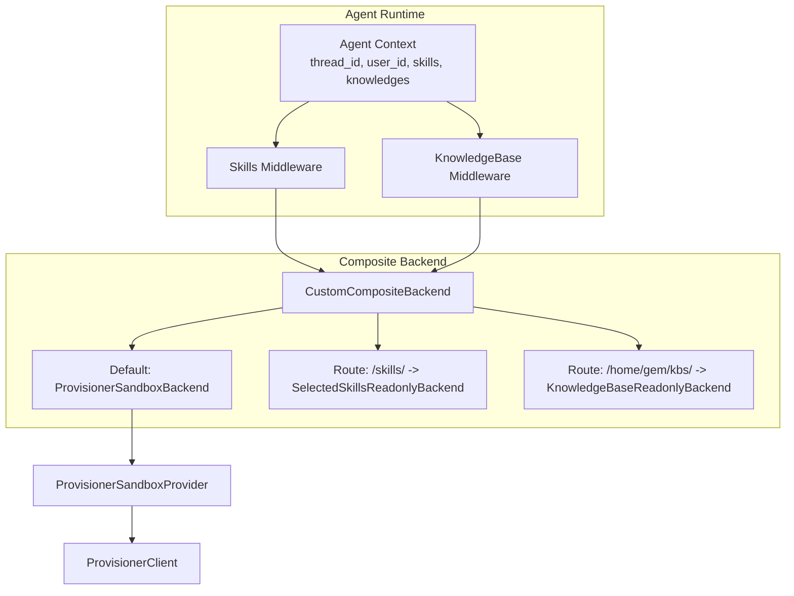
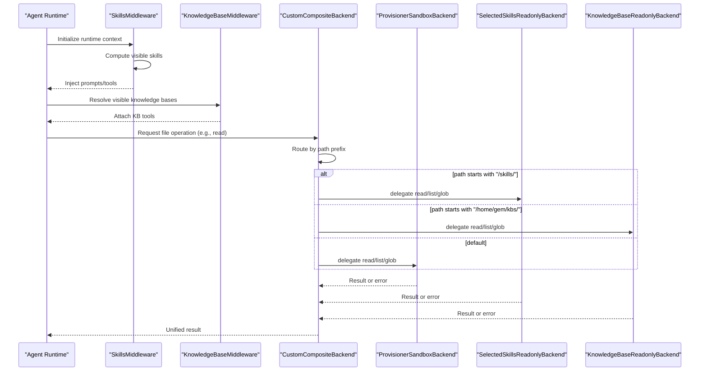
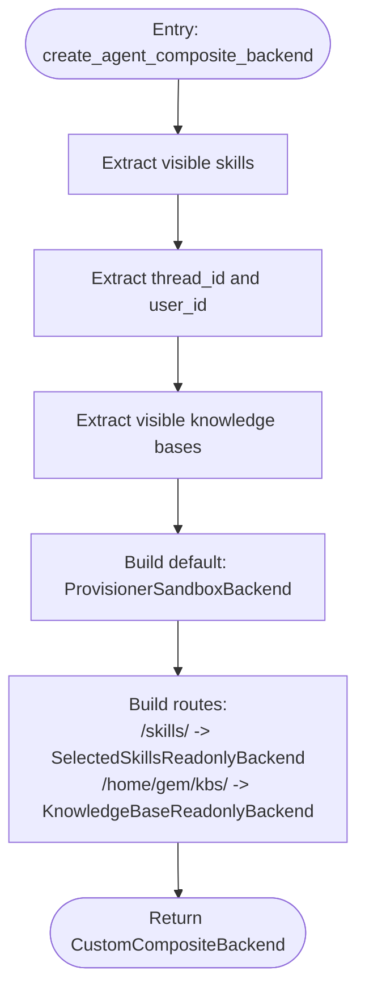
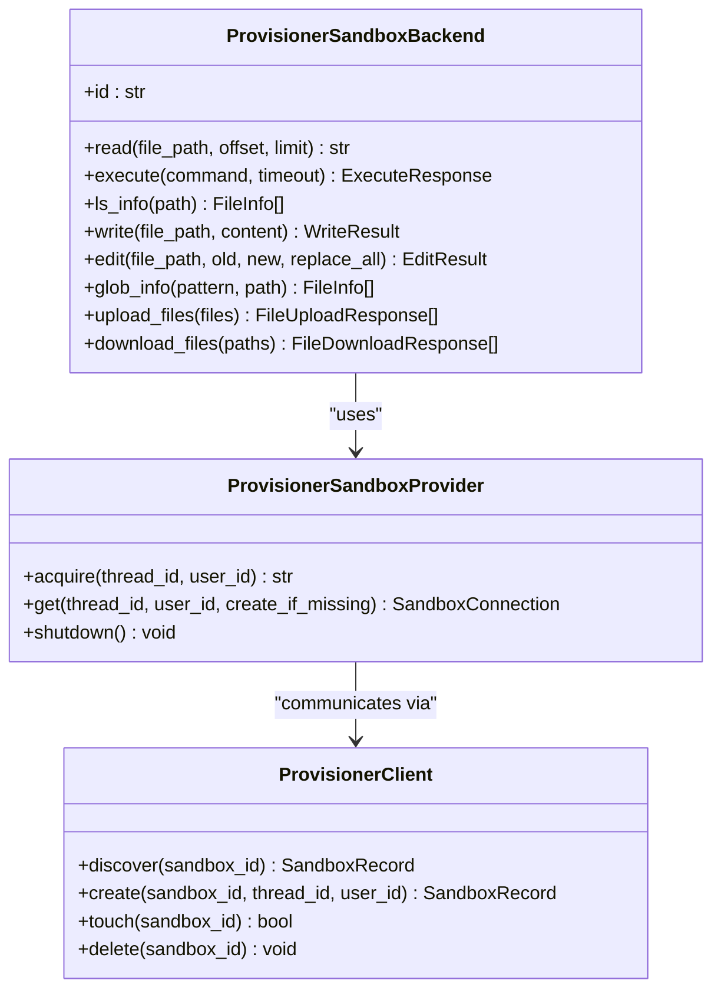
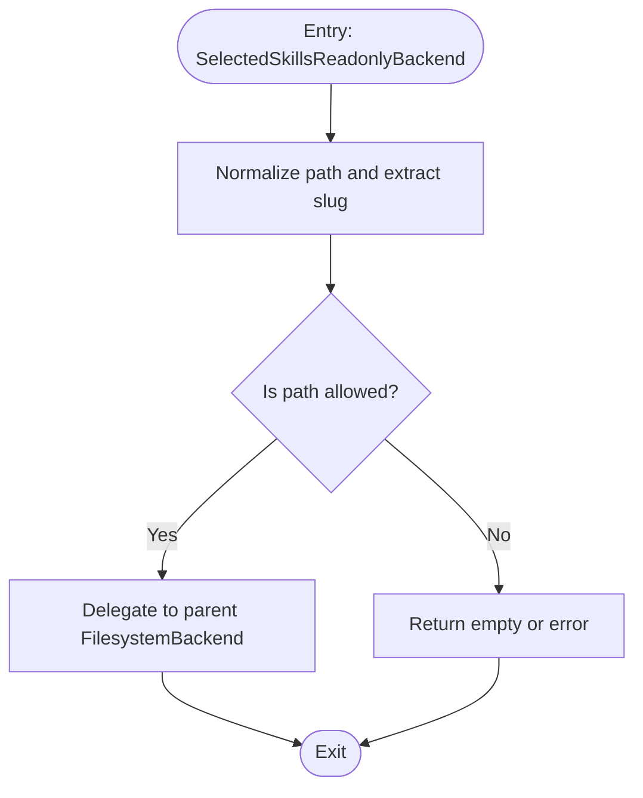
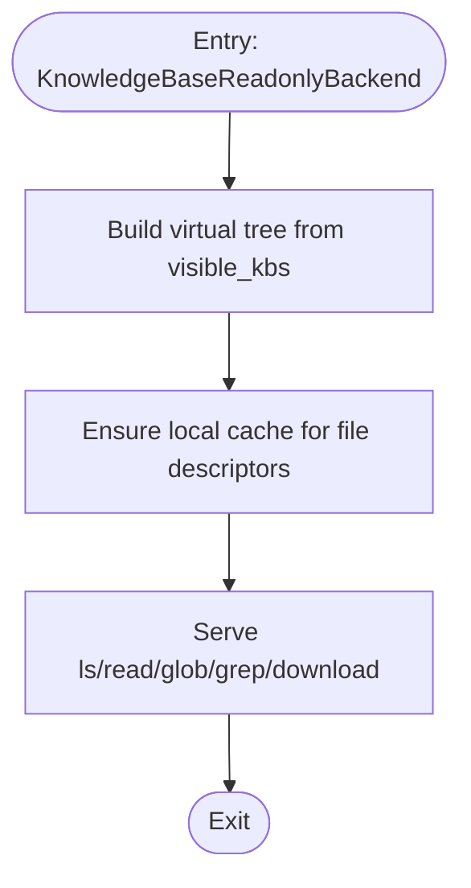
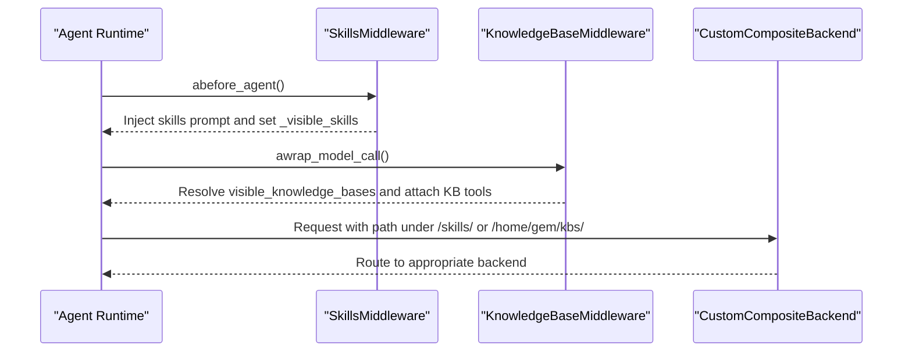
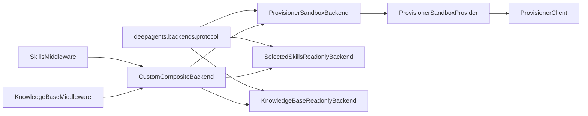

# Composite Backend Architecture

<cite>
**Referenced Files in This Document**
- [composite.py](file://backend/package/yuxi/agents/backends/composite.py)
- [skills_backend.py](file://backend/package/yuxi/agents/backends/skills_backend.py)
- [knowledge_base_backend.py](file://backend/package/yuxi/agents/backends/knowledge_base_backend.py)
- [__init__.py](file://backend/package/yuxi/agents/backends/__init__.py)
- [backend.py](file://backend/package/yuxi/agents/backends/sandbox/backend.py)
- [provider.py](file://backend/package/yuxi/agents/backends/sandbox/provider.py)
- [provisioner_client.py](file://backend/package/yuxi/agents/backends/sandbox/provisioner_client.py)
- [skills_middleware.py](file://backend/package/yuxi/agents/middlewares/skills_middleware.py)
- [knowledge_base_middleware.py](file://backend/package/yuxi/agents/middlewares/knowledge_base_middleware.py)
- [context.py](file://backend/package/yuxi/agents/context.py)
- [test_sandbox_backends.py](file://backend/test/unit/backends/test_sandbox_backends.py)
- [test_skills_backend.py](file://backend/test/unit/backends/test_skills_backend.py)
- [test_knowledge_base_backend.py](file://backend/test/unit/backends/test_knowledge_base_backend.py)
</cite>

## Table of Contents
1. [Introduction](#introduction)
2. [Project Structure](#project-structure)
3. [Core Components](#core-components)
4. [Architecture Overview](#architecture-overview)
5. [Detailed Component Analysis](#detailed-component-analysis)
6. [Dependency Analysis](#dependency-analysis)
7. [Performance Considerations](#performance-considerations)
8. [Troubleshooting Guide](#troubleshooting-guide)
9. [Conclusion](#conclusion)

## Introduction
This document explains the composite backend architecture that orchestrates multiple agent backends in Yuxi. It focuses on how the system composes a default sandbox backend with two specialized readonly backends (skills and knowledge base) and coordinates them through routing, runtime-driven visibility, and middleware. It also documents backend selection logic, priority handling, fallback mechanisms, interface contracts, communication protocols, and operational concerns such as isolation, error propagation, and performance monitoring.

## Project Structure
The composite backend lives under the agents/backends package and integrates:
- A default sandbox backend (ProvisionerSandboxBackend) for execution and file operations
- A skills backend (SelectedSkillsReadonlyBackend) exposing only selected skills
- A knowledge base backend (KnowledgeBaseReadonlyBackend) materializing and serving user-visible knowledge files
- A composite backend wrapper (CustomCompositeBackend) that routes requests to the appropriate backend based on path prefixes
- Middleware that computes visibility and injects prompts/tools dynamically

**Diagram sources**
- [composite.py:122-133](file://backend/package/yuxi/agents/backends/composite.py#L122-L133)
- [backend.py:64-105](file://backend/package/yuxi/agents/backends/sandbox/backend.py#L64-L105)
- [provider.py:27-101](file://backend/package/yuxi/agents/backends/sandbox/provider.py#L27-L101)
- [provisioner_client.py:15-66](file://backend/package/yuxi/agents/backends/sandbox/provisioner_client.py#L15-L66)
- [skills_backend.py:12-115](file://backend/package/yuxi/agents/backends/skills_backend.py#L12-L115)
- [knowledge_base_backend.py:135-460](file://backend/package/yuxi/agents/backends/knowledge_base_backend.py#L135-L460)

**Section sources**
- [__init__.py:1-65](file://backend/package/yuxi/agents/backends/__init__.py#L1-L65)
- [composite.py:18-133](file://backend/package/yuxi/agents/backends/composite.py#L18-L133)

## Core Components
- CustomCompositeBackend: Extends the upstream CompositeBackend and fixes routing behavior for glob_info to avoid unnecessary cross-backend scans when a path does not match a route.
- ProvisionerSandboxBackend: Default backend backed by a provisioner-managed sandbox container. Provides file operations, execution, and streaming of results with strict path normalization and error handling.
- SelectedSkillsReadonlyBackend: Readonly filesystem backend that exposes only selected skills, enforcing path-based visibility and read-only operations.
- KnowledgeBaseReadonlyBackend: Virtual readonly backend that materializes files from MinIO into a local cache and serves them under a virtual tree under /home/gem/kbs/.
- Middleware integration: SkillsMiddleware computes visible skills and injects prompts/tools; KnowledgeBaseMiddleware resolves visible knowledge bases and injects KB tools.

**Section sources**
- [composite.py:18-133](file://backend/package/yuxi/agents/backends/composite.py#L18-L133)
- [backend.py:64-402](file://backend/package/yuxi/agents/backends/sandbox/backend.py#L64-L402)
- [skills_backend.py:12-115](file://backend/package/yuxi/agents/backends/skills_backend.py#L12-L115)
- [knowledge_base_backend.py:135-460](file://backend/package/yuxi/agents/backends/knowledge_base_backend.py#L135-L460)
- [skills_middleware.py:145-477](file://backend/package/yuxi/agents/middlewares/skills_middleware.py#L145-L477)
- [knowledge_base_middleware.py:12-33](file://backend/package/yuxi/agents/middlewares/knowledge_base_middleware.py#L12-L33)

## Architecture Overview
The composite backend pattern routes requests by path prefix:
- /skills/: routed to SelectedSkillsReadonlyBackend
- /home/gem/kbs/: routed to KnowledgeBaseReadonlyBackend
- Other paths: handled by the default ProvisionerSandboxBackend

Visibility is computed from runtime context:
- Visible skills: derived from SkillsMiddleware’s normalized and expanded closure
- Visible knowledge bases: resolved from context and filtered by enabled names

**Diagram sources**
- [composite.py:25-68](file://backend/package/yuxi/agents/backends/composite.py#L25-L68)
- [skills_backend.py:43-115](file://backend/package/yuxi/agents/backends/skills_backend.py#L43-L115)
- [knowledge_base_backend.py:351-460](file://backend/package/yuxi/agents/backends/knowledge_base_backend.py#L351-L460)
- [backend.py:136-228](file://backend/package/yuxi/agents/backends/sandbox/backend.py#L136-L228)
- [skills_middleware.py:175-271](file://backend/package/yuxi/agents/middlewares/skills_middleware.py#L175-L271)
- [knowledge_base_middleware.py:28-32](file://backend/package/yuxi/agents/middlewares/knowledge_base_middleware.py#L28-L32)

## Detailed Component Analysis

### Composite Backend Routing and Visibility
- Routing: Uses a route-for-path function to select the correct backend based on the leading prefix. When a path matches a route, only that backend is queried; otherwise, default behavior applies.
- Fix: The glob_info override ensures that when a path does not match any route, only the default backend is searched, avoiding scanning all route backends unnecessarily.
- Visibility extraction: Extracts thread_id and user_id from runtime context/config; extracts visible skills and visible knowledge bases for backend construction.

**Diagram sources**
- [composite.py:122-133](file://backend/package/yuxi/agents/backends/composite.py#L122-L133)
- [composite.py:71-119](file://backend/package/yuxi/agents/backends/composite.py#L71-L119)

**Section sources**
- [composite.py:18-133](file://backend/package/yuxi/agents/backends/composite.py#L18-L133)

### Sandbox Backend (Default)
- Responsibilities: Executes commands, reads/writes files, lists directory entries, uploads/downloads files, and performs fixed-string grep.
- Safety: Normalizes paths to prevent traversal; decodes base64 payloads consistently; truncates output to configured limits; logs and returns structured error responses.
- Provisioning: Uses ProvisionerSandboxProvider to discover/create sandboxes per thread_id; maintains keepalive touches; supports creation on demand.

**Diagram sources**
- [backend.py:64-402](file://backend/package/yuxi/agents/backends/sandbox/backend.py#L64-L402)
- [provider.py:27-171](file://backend/package/yuxi/agents/backends/sandbox/provider.py#L27-L171)
- [provisioner_client.py:15-73](file://backend/package/yuxi/agents/backends/sandbox/provisioner_client.py#L15-L73)

**Section sources**
- [backend.py:64-402](file://backend/package/yuxi/agents/backends/sandbox/backend.py#L64-L402)
- [provider.py:27-171](file://backend/package/yuxi/agents/backends/sandbox/provider.py#L27-L171)
- [provisioner_client.py:15-73](file://backend/package/yuxi/agents/backends/sandbox/provisioner_client.py#L15-L73)

### Skills Backend (Readonly)
- Purpose: Expose only selected skills under /skills/, enforcing path-based visibility and read-only operations.
- Behavior: Filters directory listings and glob results to include only allowed skill roots; rejects writes and edits; supports downloads and grep within allowed paths.

**Diagram sources**
- [skills_backend.py:23-41](file://backend/package/yuxi/agents/backends/skills_backend.py#L23-L41)
- [skills_backend.py:43-90](file://backend/package/yuxi/agents/backends/skills_backend.py#L43-L90)

**Section sources**
- [skills_backend.py:12-115](file://backend/package/yuxi/agents/backends/skills_backend.py#L12-L115)

### Knowledge Base Backend (Readonly)
- Purpose: Materialize files from MinIO into a local cache and serve them under a virtual tree under /home/gem/kbs/.
- Behavior: Builds a virtual directory tree per visible knowledge base; resolves source and parsed files; downloads content on demand; enforces read-only operations; supports glob and grep.

**Diagram sources**
- [knowledge_base_backend.py:150-187](file://backend/package/yuxi/agents/backends/knowledge_base_backend.py#L150-L187)
- [knowledge_base_backend.py:335-349](file://backend/package/yuxi/agents/backends/knowledge_base_backend.py#L335-L349)
- [knowledge_base_backend.py:351-460](file://backend/package/yuxi/agents/backends/knowledge_base_backend.py#L351-L460)

**Section sources**
- [knowledge_base_backend.py:135-460](file://backend/package/yuxi/agents/backends/knowledge_base_backend.py#L135-L460)

### Middleware Integration
- SkillsMiddleware: Computes visible skills from configuration and dependencies, injects a skills prompt segment, and dynamically loads tools/MCPs based on activated skills.
- KnowledgeBaseMiddleware: Resolves visible knowledge bases from context and injects common KB tools.

**Diagram sources**
- [skills_middleware.py:175-271](file://backend/package/yuxi/agents/middlewares/skills_middleware.py#L175-L271)
- [knowledge_base_middleware.py:28-32](file://backend/package/yuxi/agents/middlewares/knowledge_base_middleware.py#L28-L32)
- [composite.py:25-68](file://backend/package/yuxi/agents/backends/composite.py#L25-L68)

**Section sources**
- [skills_middleware.py:145-477](file://backend/package/yuxi/agents/middlewares/skills_middleware.py#L145-L477)
- [knowledge_base_middleware.py:12-33](file://backend/package/yuxi/agents/middlewares/knowledge_base_middleware.py#L12-L33)

## Dependency Analysis
- Backends depend on shared protocol types (FileInfo, WriteResult, etc.) from deepagents.backends.protocol.
- Composite backend composes three concrete backends and delegates to them based on path routing.
- Sandbox backend depends on ProvisionerSandboxProvider, which communicates with ProvisionerClient to manage sandbox lifecycles.
- Middleware depends on services to compute visibility and load tools.

**Diagram sources**
- [composite.py:3-15](file://backend/package/yuxi/agents/backends/composite.py#L3-L15)
- [backend.py:8-23](file://backend/package/yuxi/agents/backends/sandbox/backend.py#L8-L23)
- [provider.py:11](file://backend/package/yuxi/agents/backends/sandbox/provider.py#L11)
- [skills_middleware.py:9-21](file://backend/package/yuxi/agents/middlewares/skills_middleware.py#L9-L21)
- [knowledge_base_middleware.py:5-9](file://backend/package/yuxi/agents/middlewares/knowledge_base_middleware.py#L5-L9)

**Section sources**
- [composite.py:3-15](file://backend/package/yuxi/agents/backends/composite.py#L3-L15)
- [backend.py:8-23](file://backend/package/yuxi/agents/backends/sandbox/backend.py#L8-L23)
- [provider.py:11](file://backend/package/yuxi/agents/backends/sandbox/provider.py#L11)
- [skills_middleware.py:9-21](file://backend/package/yuxi/agents/middlewares/skills_middleware.py#L9-L21)
- [knowledge_base_middleware.py:5-9](file://backend/package/yuxi/agents/middlewares/knowledge_base_middleware.py#L5-L9)

## Performance Considerations
- Sandbox output truncation: Limits maximum output size to avoid memory pressure and network overhead.
- Keepalive touches: Provider periodically touches sandboxes to maintain liveness and reduce cold-start costs.
- Virtual tree caching: KnowledgeBaseReadonlyBackend caches materialized files locally after first fetch.
- Routing optimization: CustomCompositeBackend avoids scanning all route backends when a path does not match a route.

[No sources needed since this section provides general guidance]

## Troubleshooting Guide
Common issues and resolutions:
- Sandbox unavailable: The default backend raises a runtime error when a sandbox cannot be acquired; verify sandbox_provisioner_url and provider configuration.
- Path errors: Both sandbox and knowledge base backends return descriptive errors for invalid paths, missing files, or permission denials; ensure paths are normalized and allowed.
- Binary content rendering: Sandbox backend refuses to render binary files as text; use download_files to retrieve raw bytes.
- Glob safety: KnowledgeBaseReadonlyBackend validates glob patterns to prevent path traversal; use allowed patterns.
- Middleware visibility: SkillsMiddleware expands closures and normalizes selections; ensure skills are properly configured and not cyclically dependent.

**Section sources**
- [backend.py:85-105](file://backend/package/yuxi/agents/backends/sandbox/backend.py#L85-L105)
- [backend.py:147-156](file://backend/package/yuxi/agents/backends/sandbox/backend.py#L147-L156)
- [knowledge_base_backend.py:375-377](file://backend/package/yuxi/agents/backends/knowledge_base_backend.py#L375-L377)
- [skills_middleware.py:99-120](file://backend/package/yuxi/agents/middlewares/skills_middleware.py#L99-L120)

## Conclusion
The composite backend architecture cleanly separates concerns among sandbox execution, skills exposure, and knowledge base materialization. It routes requests efficiently, enforces strong isolation and read-only guarantees where applicable, and integrates middleware to compute visibility and tooling dynamically. The design supports extensibility by adding new routes and backends while preserving clean separation of concerns and predictable error propagation.