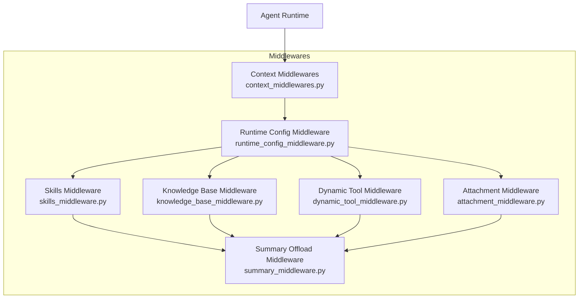
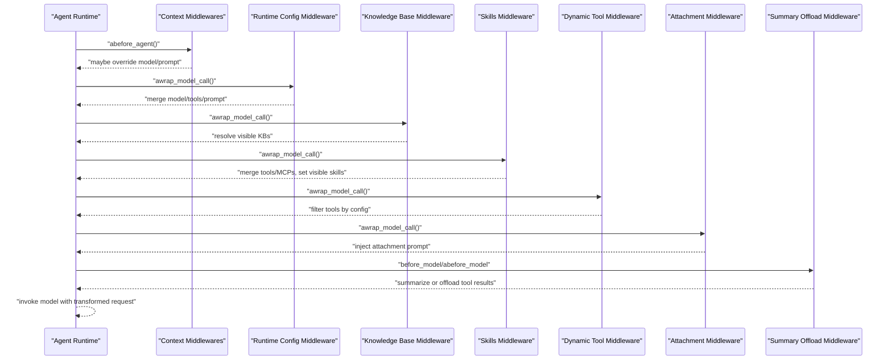
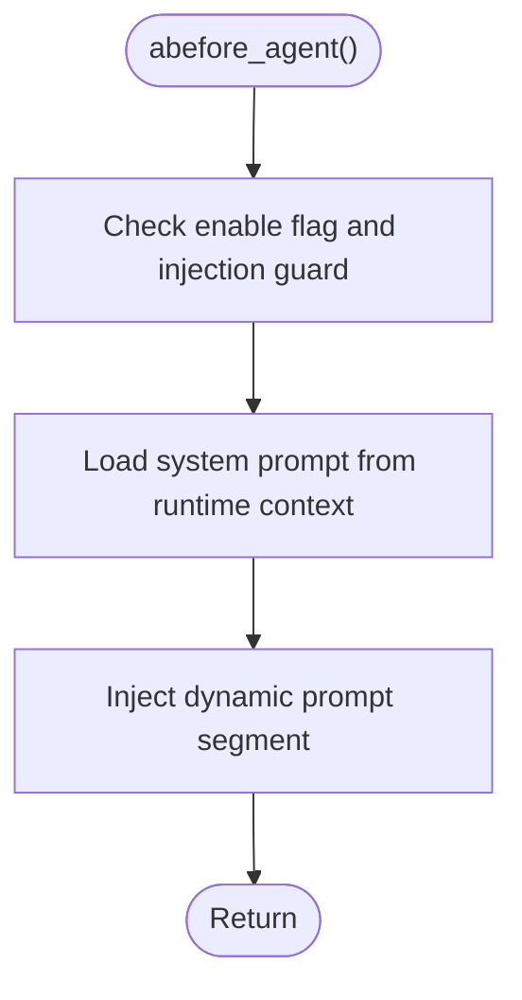
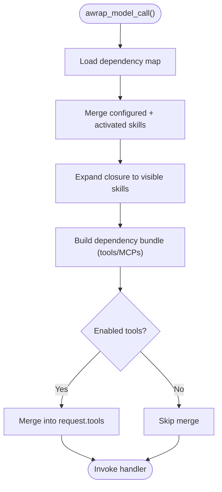
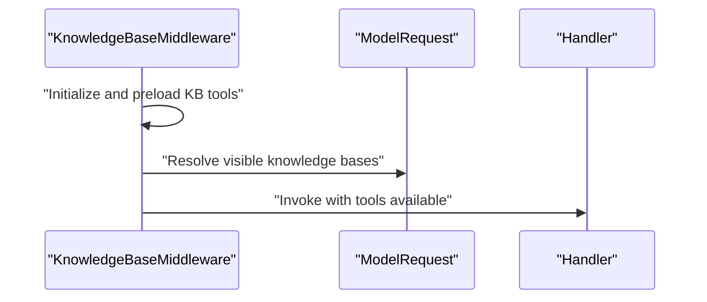
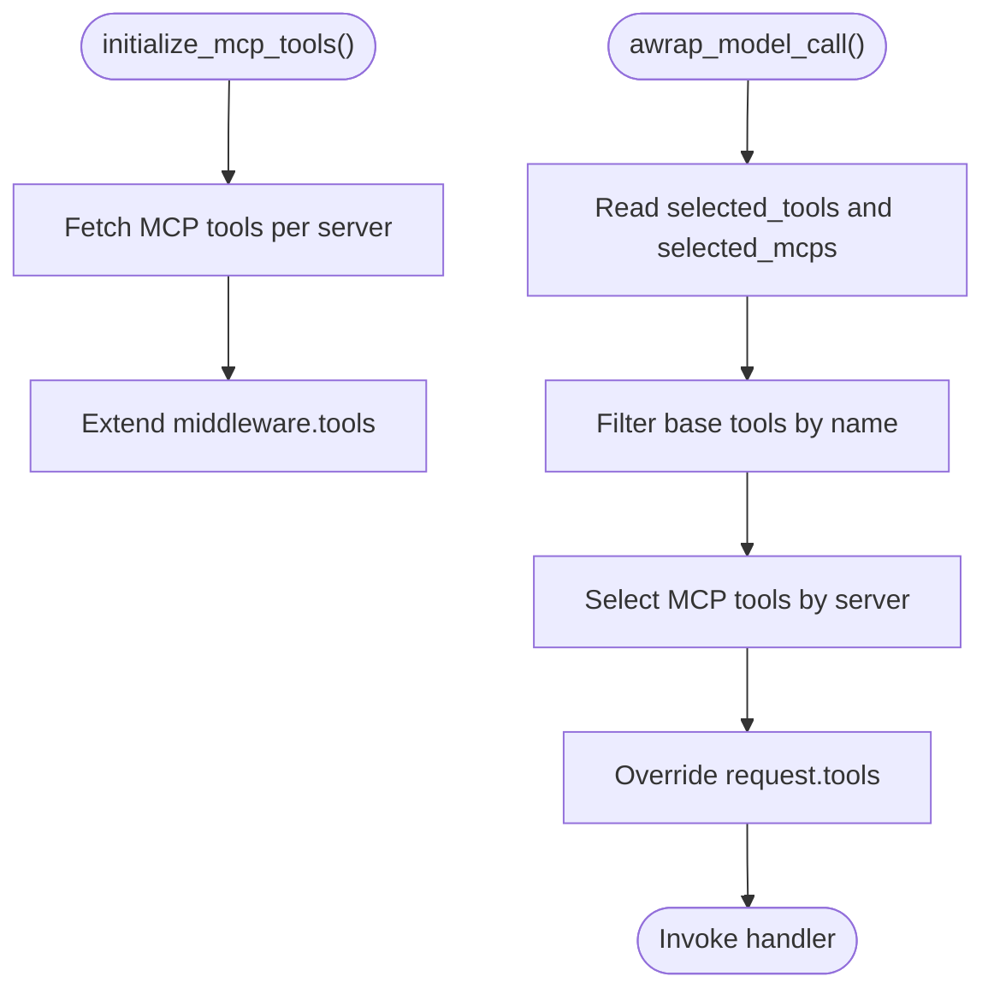
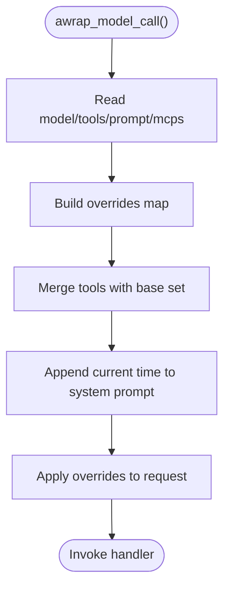
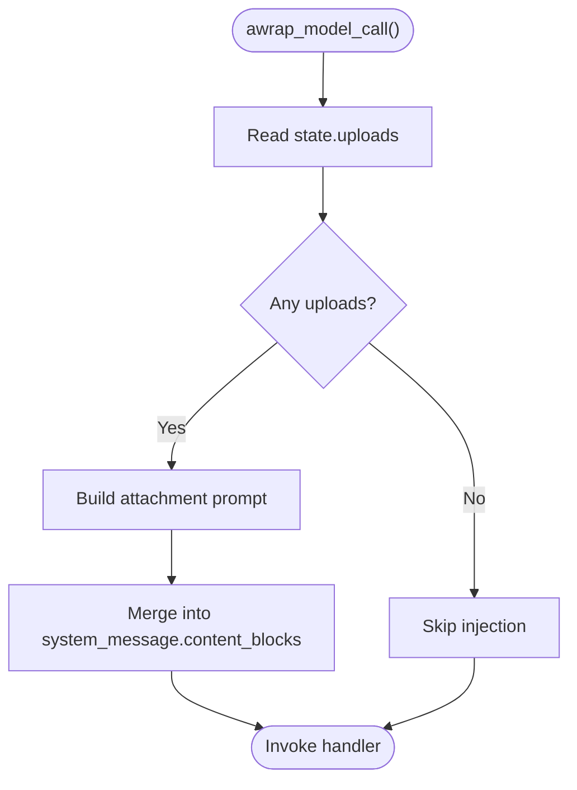
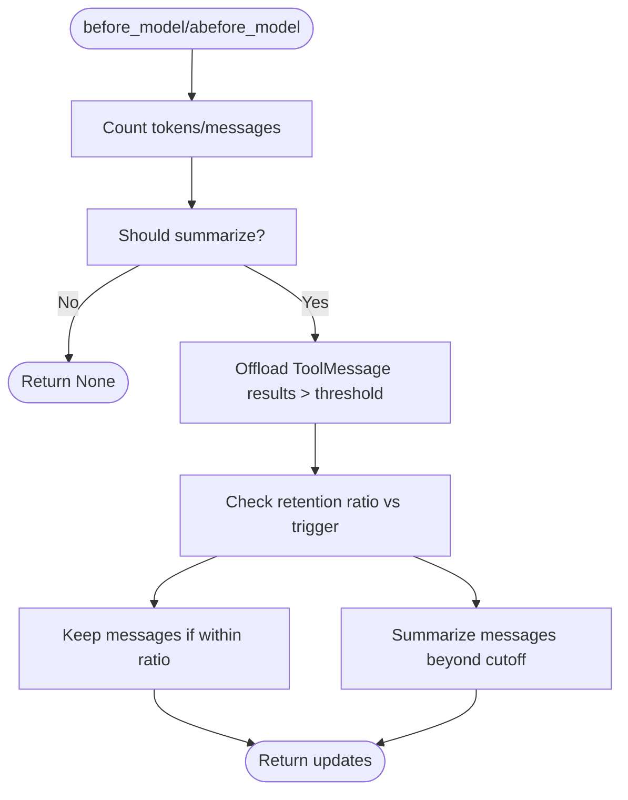
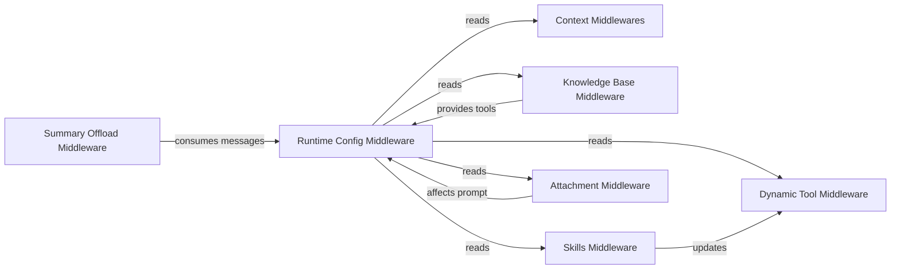

# Middleware Pipeline System

<cite>
**Referenced Files in This Document**
- [context_middlewares.py](file://backend/package/yuxi/agents/middlewares/context_middlewares.py)
- [skills_middleware.py](file://backend/package/yuxi/agents/middlewares/skills_middleware.py)
- [knowledge_base_middleware.py](file://backend/package/yuxi/agents/middlewares/knowledge_base_middleware.py)
- [dynamic_tool_middleware.py](file://backend/package/yuxi/agents/middlewares/dynamic_tool_middleware.py)
- [runtime_config_middleware.py](file://backend/package/yuxi/agents/middlewares/runtime_config_middleware.py)
- [attachment_middleware.py](file://backend/package/yuxi/agents/middlewares/attachment_middleware.py)
- [summary_middleware.py](file://backend/package/yuxi/agents/middlewares/summary_middleware.py)
</cite>

## Table of Contents
1. [Introduction](#introduction)
2. [Project Structure](#project-structure)
3. [Core Components](#core-components)
4. [Architecture Overview](#architecture-overview)
5. [Detailed Component Analysis](#detailed-component-analysis)
6. [Dependency Analysis](#dependency-analysis)
7. [Performance Considerations](#performance-considerations)
8. [Troubleshooting Guide](#troubleshooting-guide)
9. [Conclusion](#conclusion)

## Introduction
This document explains the middleware pipeline system that processes agent requests and responses. It covers the middleware chain architecture, execution order, and data transformation patterns. It documents the context middleware for request preprocessing, skills middleware for capability routing, knowledge base middleware for retrieval augmentation, dynamic tool middleware for runtime tool resolution, and attachment middleware for file processing. It also includes examples of middleware registration, configuration, and custom middleware development, along with error handling, performance impact, and debugging techniques. Finally, it explains how middleware enables modular agent functionality and extensibility.

## Project Structure
The middleware system resides under the agents module and is organized by responsibility:
- Context-aware prompting and model selection
- Skills-based capability routing and dynamic activation
- Knowledge base tool augmentation
- Dynamic tool selection and MCP integration
- Runtime configuration merging and system prompt composition
- Attachment prompt injection and file context
- Conversation summarization and tool-result offloading

**Diagram sources**
- [context_middlewares.py:11-26](file://backend/package/yuxi/agents/middlewares/context_middlewares.py#L11-L26)
- [skills_middleware.py:145-272](file://backend/package/yuxi/agents/middlewares/skills_middleware.py#L145-L272)
- [knowledge_base_middleware.py:12-33](file://backend/package/yuxi/agents/middlewares/knowledge_base_middleware.py#L12-L33)
- [dynamic_tool_middleware.py:10-70](file://backend/package/yuxi/agents/middlewares/dynamic_tool_middleware.py#L10-L70)
- [runtime_config_middleware.py:16-162](file://backend/package/yuxi/agents/middlewares/runtime_config_middleware.py#L16-L162)
- [attachment_middleware.py:54-90](file://backend/package/yuxi/agents/middlewares/attachment_middleware.py#L54-L90)
- [summary_middleware.py:209-447](file://backend/package/yuxi/agents/middlewares/summary_middleware.py#L209-L447)

**Section sources**
- [context_middlewares.py:1-26](file://backend/package/yuxi/agents/middlewares/context_middlewares.py#L1-L26)
- [skills_middleware.py:1-477](file://backend/package/yuxi/agents/middlewares/skills_middleware.py#L1-L477)
- [knowledge_base_middleware.py:1-33](file://backend/package/yuxi/agents/middlewares/knowledge_base_middleware.py#L1-L33)
- [dynamic_tool_middleware.py:1-70](file://backend/package/yuxi/agents/middlewares/dynamic_tool_middleware.py#L1-L70)
- [runtime_config_middleware.py:1-162](file://backend/package/yuxi/agents/middlewares/runtime_config_middleware.py#L1-L162)
- [attachment_middleware.py:1-90](file://backend/package/yuxi/agents/middlewares/attachment_middleware.py#L1-L90)
- [summary_middleware.py:1-718](file://backend/package/yuxi/agents/middlewares/summary_middleware.py#L1-L718)

## Core Components
- Context Middlewares: Inject dynamic prompts and select the model based on runtime context.
- Skills Middleware: Inject skills prompts, compute dependency closures, dynamically activate skills, and merge tools/MCPs.
- Knowledge Base Middleware: Resolve visible knowledge bases for context and provide common KB tools.
- Dynamic Tool Middleware: Pre-load MCP tools and filter tools at runtime according to configuration.
- Runtime Config Middleware: Merge model/system prompt/tools/MCPs from context into the request.
- Attachment Middleware: Inject readable file paths into the system prompt via content blocks.
- Summary Offload Middleware: Summarize long histories and offload large tool results to virtual files.

**Section sources**
- [context_middlewares.py:11-26](file://backend/package/yuxi/agents/middlewares/context_middlewares.py#L11-L26)
- [skills_middleware.py:145-477](file://backend/package/yuxi/agents/middlewares/skills_middleware.py#L145-L477)
- [knowledge_base_middleware.py:12-33](file://backend/package/yuxi/agents/middlewares/knowledge_base_middleware.py#L12-L33)
- [dynamic_tool_middleware.py:10-70](file://backend/package/yuxi/agents/middlewares/dynamic_tool_middleware.py#L10-L70)
- [runtime_config_middleware.py:16-162](file://backend/package/yuxi/agents/middlewares/runtime_config_middleware.py#L16-L162)
- [attachment_middleware.py:54-90](file://backend/package/yuxi/agents/middlewares/attachment_middleware.py#L54-L90)
- [summary_middleware.py:209-718](file://backend/package/yuxi/agents/middlewares/summary_middleware.py#L209-L718)

## Architecture Overview
The middleware pipeline executes in a layered fashion around the agent’s model call. Each middleware can modify the request (tools, model, system prompt, state) and optionally handle tool calls or message lifecycle events.

**Diagram sources**
- [context_middlewares.py:17-26](file://backend/package/yuxi/agents/middlewares/context_middlewares.py#L17-L26)
- [runtime_config_middleware.py:75-117](file://backend/package/yuxi/agents/middlewares/runtime_config_middleware.py#L75-L117)
- [knowledge_base_middleware.py:28-33](file://backend/package/yuxi/agents/middlewares/knowledge_base_middleware.py#L28-L33)
- [skills_middleware.py:216-272](file://backend/package/yuxi/agents/middlewares/skills_middleware.py#L216-L272)
- [dynamic_tool_middleware.py:40-70](file://backend/package/yuxi/agents/middlewares/dynamic_tool_middleware.py#L40-L70)
- [attachment_middleware.py:59-85](file://backend/package/yuxi/agents/middlewares/attachment_middleware.py#L59-L85)
- [summary_middleware.py:308-447](file://backend/package/yuxi/agents/middlewares/summary_middleware.py#L308-L447)

## Detailed Component Analysis

### Context Middlewares
Responsibilities:
- Dynamic prompt injection via decorator.
- Model selection based on runtime context and model spec.

Execution pattern:
- Decorators apply transformations to the prompt and model selection prior to model invocation.

**Diagram sources**
- [context_middlewares.py:11-26](file://backend/package/yuxi/agents/middlewares/context_middlewares.py#L11-L26)

**Section sources**
- [context_middlewares.py:11-26](file://backend/package/yuxi/agents/middlewares/context_middlewares.py#L11-L26)

### Skills Middleware
Responsibilities:
- Inject skills prompt segments into the system prompt.
- Expand configured and activated skills into a closure of dependencies.
- Dynamically load tools and MCPs based on activated skills.
- Handle dynamic skill activation via tool call results (e.g., reading a skill file).

Execution pattern:
- Pre-model hook injects skills prompt and sets visibility.
- Model wrapper merges tools/MCPs and updates request.
- Tool call wrapper monitors results and updates activated skills.

**Diagram sources**
- [skills_middleware.py:216-272](file://backend/package/yuxi/agents/middlewares/skills_middleware.py#L216-L272)

**Section sources**
- [skills_middleware.py:145-477](file://backend/package/yuxi/agents/middlewares/skills_middleware.py#L145-L477)

### Knowledge Base Middleware
Responsibilities:
- Preload common knowledge base tools.
- Resolve visible knowledge bases for the current context before model call.

Execution pattern:
- Constructor preloads tools.
- Model wrapper resolves visibility and passes through.

**Diagram sources**
- [knowledge_base_middleware.py:12-33](file://backend/package/yuxi/agents/middlewares/knowledge_base_middleware.py#L12-L33)

**Section sources**
- [knowledge_base_middleware.py:12-33](file://backend/package/yuxi/agents/middlewares/knowledge_base_middleware.py#L12-L33)

### Dynamic Tool Middleware
Responsibilities:
- Pre-load MCP tools from configured servers.
- Filter tools at runtime based on context configuration.

Execution pattern:
- Initialization preloads MCP tools and registers them.
- Model wrapper filters tools according to context fields.

**Diagram sources**
- [dynamic_tool_middleware.py:29-70](file://backend/package/yuxi/agents/middlewares/dynamic_tool_middleware.py#L29-L70)

**Section sources**
- [dynamic_tool_middleware.py:10-70](file://backend/package/yuxi/agents/middlewares/dynamic_tool_middleware.py#L10-L70)

### Runtime Config Middleware
Responsibilities:
- Merge model, system prompt, and tools from context into the request.
- Optionally integrate MCP tools dynamically.

Execution pattern:
- Reads context fields and constructs overrides.
- Merges tools while preserving non-managed tools.

**Diagram sources**
- [runtime_config_middleware.py:75-117](file://backend/package/yuxi/agents/middlewares/runtime_config_middleware.py#L75-L117)

**Section sources**
- [runtime_config_middleware.py:16-162](file://backend/package/yuxi/agents/middlewares/runtime_config_middleware.py#L16-L162)

### Attachment Middleware
Responsibilities:
- Read uploaded file metadata from state and inject readable paths into the system prompt.
- Insert a marker to avoid duplicate injections.

Execution pattern:
- Reads state.uploads and builds a prompt block.
- Merges into system message content blocks.

**Diagram sources**
- [attachment_middleware.py:59-85](file://backend/package/yuxi/agents/middlewares/attachment_middleware.py#L59-L85)

**Section sources**
- [attachment_middleware.py:54-90](file://backend/package/yuxi/agents/middlewares/attachment_middleware.py#L54-L90)

### Summary Offload Middleware
Responsibilities:
- Trigger summarization based on token/message/fractional thresholds.
- Offload large tool results to virtual files and replace with placeholders.
- Preserve System messages and maintain AI/Tool message pair integrity.

Execution pattern:
- Before model invocation, evaluate triggers and decide summarization.
- Offload ToolMessage results exceeding a token threshold.
- Rebuild messages with a summary and preserved tail.

**Diagram sources**
- [summary_middleware.py:308-447](file://backend/package/yuxi/agents/middlewares/summary_middleware.py#L308-L447)

**Section sources**
- [summary_middleware.py:209-718](file://backend/package/yuxi/agents/middlewares/summary_middleware.py#L209-L718)

## Dependency Analysis
- Coupling: Middlewares depend on runtime context and shared services (e.g., loading tools, resolving MCPs).
- Cohesion: Each middleware encapsulates a single concern (prompt/model, skills, KB tools, dynamic tools, attachments, summarization).
- External integrations: MCP tool loading, knowledge base visibility resolution, and model loading utilities.

**Diagram sources**
- [runtime_config_middleware.py:75-117](file://backend/package/yuxi/agents/middlewares/runtime_config_middleware.py#L75-L117)
- [skills_middleware.py:216-272](file://backend/package/yuxi/agents/middlewares/skills_middleware.py#L216-L272)
- [knowledge_base_middleware.py:28-33](file://backend/package/yuxi/agents/middlewares/knowledge_base_middleware.py#L28-L33)
- [dynamic_tool_middleware.py:40-70](file://backend/package/yuxi/agents/middlewares/dynamic_tool_middleware.py#L40-L70)
- [attachment_middleware.py:59-85](file://backend/package/yuxi/agents/middlewares/attachment_middleware.py#L59-L85)
- [summary_middleware.py:308-447](file://backend/package/yuxi/agents/middlewares/summary_middleware.py#L308-L447)

**Section sources**
- [runtime_config_middleware.py:16-162](file://backend/package/yuxi/agents/middlewares/runtime_config_middleware.py#L16-L162)
- [skills_middleware.py:145-477](file://backend/package/yuxi/agents/middlewares/skills_middleware.py#L145-L477)
- [knowledge_base_middleware.py:12-33](file://backend/package/yuxi/agents/middlewares/knowledge_base_middleware.py#L12-L33)
- [dynamic_tool_middleware.py:10-70](file://backend/package/yuxi/agents/middlewares/dynamic_tool_middleware.py#L10-L70)
- [attachment_middleware.py:54-90](file://backend/package/yuxi/agents/middlewares/attachment_middleware.py#L54-L90)
- [summary_middleware.py:209-718](file://backend/package/yuxi/agents/middlewares/summary_middleware.py#L209-L718)

## Performance Considerations
- Prompt and tool building: Skills and runtime config middlewares construct prompts and tool lists; caching and minimal recomputation improve throughput.
- MCP tool loading: Pre-loading MCP tools reduces latency during model calls.
- Token counting and summarization: Summary middleware uses token counters and binary search to efficiently truncate conversations.
- Offloading large tool results: Reduces token pressure and avoids truncation artifacts.
- Parallelism: Skills middleware loads MCP tools concurrently.

[No sources needed since this section provides general guidance]

## Troubleshooting Guide
Common issues and remedies:
- Skills dependency cycles or missing targets: The skills middleware logs warnings and skips problematic nodes; review dependency definitions and slug validity.
- MCP tool unavailability: The skills and runtime config middlewares log warnings when MCP servers are not pre-loaded or unavailable; ensure servers are included in initialization and reachable.
- Tool name mismatches: Runtime config middleware warns when a tool name is not found in the managed tool set; verify tool names and availability.
- Duplicate attachment prompt injection: The attachment middleware checks for a marker and avoids duplication; ensure the marker is present if you intend to replace content.
- Summary thresholds: Tune trigger and retention ratios to balance memory usage and fidelity.

**Section sources**
- [skills_middleware.py:87-121](file://backend/package/yuxi/agents/middlewares/skills_middleware.py#L87-L121)
- [skills_middleware.py:320-360](file://backend/package/yuxi/agents/middlewares/skills_middleware.py#L320-L360)
- [runtime_config_middleware.py:119-162](file://backend/package/yuxi/agents/middlewares/runtime_config_middleware.py#L119-L162)
- [attachment_middleware.py:76-85](file://backend/package/yuxi/agents/middlewares/attachment_middleware.py#L76-L85)
- [summary_middleware.py:449-469](file://backend/package/yuxi/agents/middlewares/summary_middleware.py#L449-L469)

## Conclusion
The middleware pipeline composes modular capabilities around agent execution. By structuring concerns into distinct middlewares—context, skills, knowledge base, dynamic tools, runtime configuration, attachments, and summarization—the system achieves high extensibility and maintainability. Proper configuration, pre-loading, and monitoring ensure robust performance and reliable behavior across diverse agent scenarios.