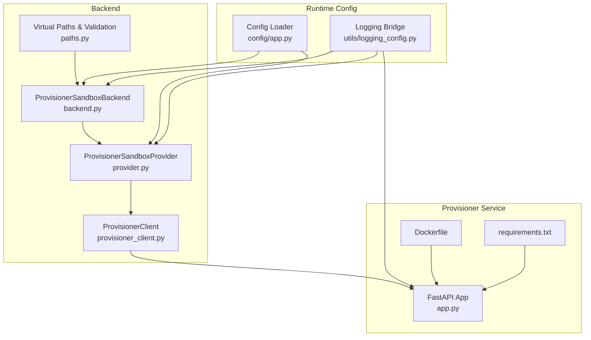
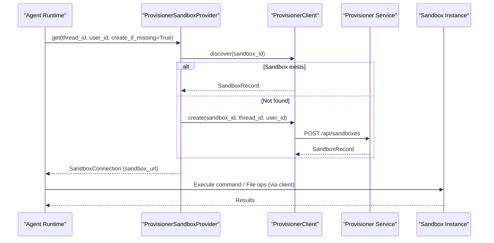
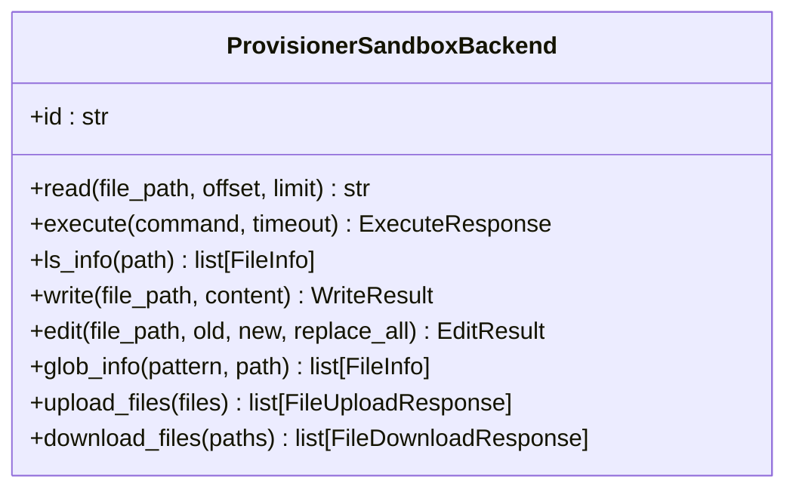
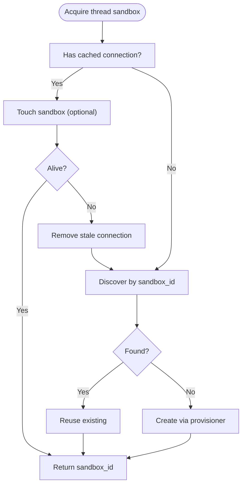
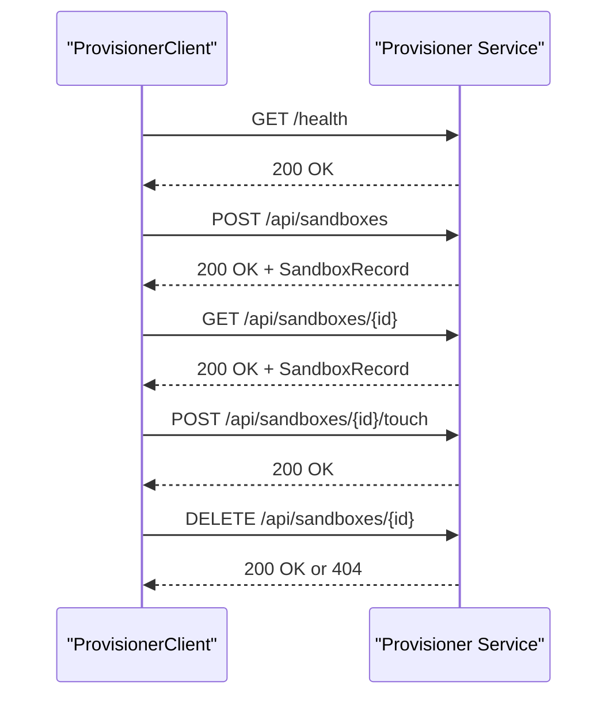
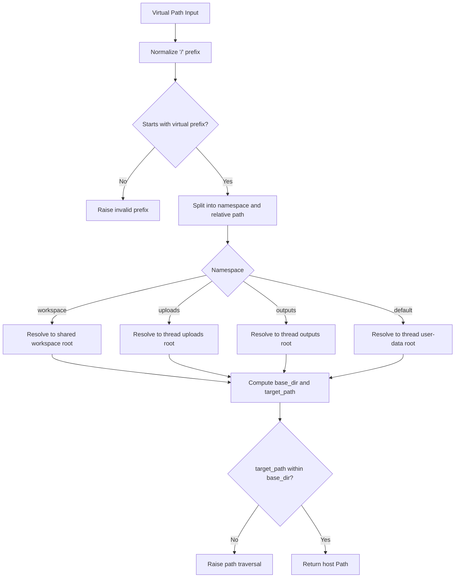
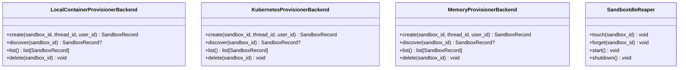
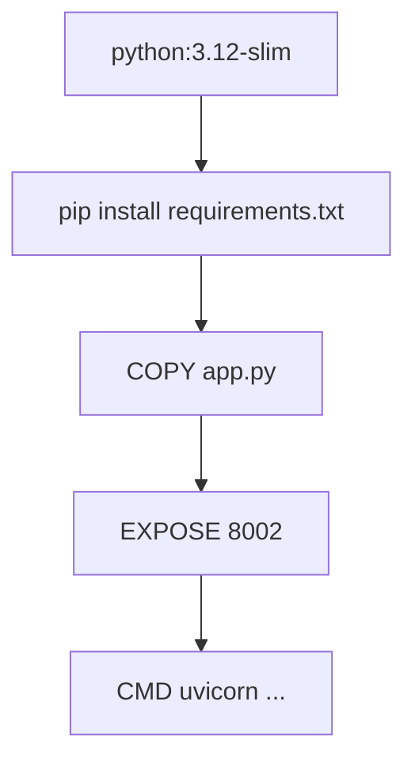
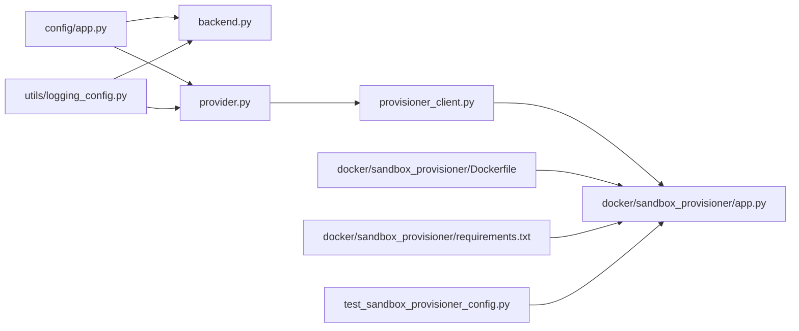

# Sandboxed Execution Environment

<cite>
**Referenced Files in This Document**
- [backend.py](file://backend/package/yuxi/agents/backends/sandbox/backend.py)
- [provider.py](file://backend/package/yuxi/agents/backends/sandbox/provider.py)
- [provisioner_client.py](file://backend/package/yuxi/agents/backends/sandbox/provisioner_client.py)
- [paths.py](file://backend/package/yuxi/agents/backends/sandbox/paths.py)
- [__init__.py](file://backend/package/yuxi/agents/backends/sandbox/__init__.py)
- [app.py](file://docker/sandbox_provisioner/app.py)
- [Dockerfile](file://docker/sandbox_provisioner/Dockerfile)
- [requirements.txt](file://docker/sandbox_provisioner/requirements.txt)
- [app.py](file://backend/package/yuxi/config/app.py)
- [logging_config.py](file://backend/package/yuxi/utils/logging_config.py)
- [docker-compose.yml](file://docker-compose.yml)
- [test_sandbox_provisioner_config.py](file://backend/test/unit/backends/test_sandbox_provisioner_config.py)
</cite>

## Table of Contents
1. [Introduction](#introduction)
2. [Project Structure](#project-structure)
3. [Core Components](#core-components)
4. [Architecture Overview](#architecture-overview)
5. [Detailed Component Analysis](#detailed-component-analysis)
6. [Dependency Analysis](#dependency-analysis)
7. [Performance Considerations](#performance-considerations)
8. [Troubleshooting Guide](#troubleshooting-guide)
9. [Conclusion](#conclusion)
10. [Appendices](#appendices)

## Introduction
This document describes the sandboxed execution environment that isolates agent operations for security and stability. It explains the sandbox architecture, containerization strategy, and resource isolation mechanisms. It documents the provisioner system for dynamic sandbox creation and management, filesystem virtualization, network restrictions, and process isolation. It also covers sandbox configuration, security policies, resource limits, monitoring, logging, and debugging capabilities, and how sandbox execution integrates with the broader agent system to enhance reliability and security.

## Project Structure
The sandbox environment spans three primary areas:
- Backend sandbox client and provider: Python modules that manage sandbox lifecycle, connection, and filesystem virtualization.
- Sandbox provisioner: A FastAPI service that provisions and manages sandbox instances (Docker/Kubernetes/Memory).
- Containerization: A dedicated Docker image for the provisioner service.

**Diagram sources**
- [backend.py:64-402](file://backend/package/yuxi/agents/backends/sandbox/backend.py#L64-L402)
- [provider.py:27-171](file://backend/package/yuxi/agents/backends/sandbox/provider.py#L27-L171)
- [provisioner_client.py:15-73](file://backend/package/yuxi/agents/backends/sandbox/provisioner_client.py#L15-L73)
- [paths.py:12-136](file://backend/package/yuxi/agents/backends/sandbox/paths.py#L12-L136)
- [app.py:801-890](file://docker/sandbox_provisioner/app.py#L801-L890)
- [Dockerfile:1-16](file://docker/sandbox_provisioner/Dockerfile#L1-L16)
- [requirements.txt:1-5](file://docker/sandbox_provisioner/requirements.txt#L1-L5)
- [app.py:243-267](file://backend/package/yuxi/config/app.py#L243-L267)
- [logging_config.py:1-99](file://backend/package/yuxi/utils/logging_config.py#L1-L99)

**Section sources**
- [backend.py:64-402](file://backend/package/yuxi/agents/backends/sandbox/backend.py#L64-L402)
- [provider.py:27-171](file://backend/package/yuxi/agents/backends/sandbox/provider.py#L27-L171)
- [provisioner_client.py:15-73](file://backend/package/yuxi/agents/backends/sandbox/provisioner_client.py#L15-L73)
- [paths.py:12-136](file://backend/package/yuxi/agents/backends/sandbox/paths.py#L12-L136)
- [app.py:801-890](file://docker/sandbox_provisioner/app.py#L801-L890)
- [Dockerfile:1-16](file://docker/sandbox_provisioner/Dockerfile#L1-L16)
- [requirements.txt:1-5](file://docker/sandbox_provisioner/requirements.txt#L1-L5)
- [app.py:243-267](file://backend/package/yuxi/config/app.py#L243-L267)
- [logging_config.py:1-99](file://backend/package/yuxi/utils/logging_config.py#L1-L99)

## Core Components
- ProvisionerSandboxBackend: Implements the sandbox interface for the agent runtime. It validates paths, executes commands, reads/writes/edit files, lists/globs files, and uploads/downloads binary content. It enforces output truncation and sanitizes paths to prevent traversal.
- ProvisionerSandboxProvider: Manages sandbox connections per thread, ensures keep-alive touches, and coordinates with the provisioner service to create/reuse sandboxes.
- ProvisionerClient: HTTP client to the provisioner service for create/discover/touch/delete operations.
- Virtual Paths Module: Provides virtual path resolution, validation, and mapping between virtual user-data paths and host directories.
- Provisioner Service: FastAPI service supporting Docker, Kubernetes, and memory backends. It provisions sandboxes, maintains idle reaper, and exposes health and lifecycle endpoints.
- Configuration and Logging: Centralized configuration loading and logging bridge for consistent observability.

**Section sources**
- [backend.py:64-402](file://backend/package/yuxi/agents/backends/sandbox/backend.py#L64-L402)
- [provider.py:27-171](file://backend/package/yuxi/agents/backends/sandbox/provider.py#L27-L171)
- [provisioner_client.py:15-73](file://backend/package/yuxi/agents/backends/sandbox/provisioner_client.py#L15-L73)
- [paths.py:12-136](file://backend/package/yuxi/agents/backends/sandbox/paths.py#L12-L136)
- [app.py:801-890](file://docker/sandbox_provisioner/app.py#L801-L890)
- [app.py:243-267](file://backend/package/yuxi/config/app.py#L243-L267)
- [logging_config.py:1-99](file://backend/package/yuxi/utils/logging_config.py#L1-L99)

## Architecture Overview
The sandbox architecture separates concerns between the agent runtime and the provisioner service:
- Agent runtime requests a sandbox via the provider, which communicates with the provisioner service.
- The provisioner creates or reuses a sandbox container/pod and returns a URL.
- The backend executes commands and file operations against the sandbox via a client library.
- The provisioner maintains sandbox health, enforces idle timeouts, and cleans up resources.

**Diagram sources**
- [provider.py:103-129](file://backend/package/yuxi/agents/backends/sandbox/provider.py#L103-L129)
- [provisioner_client.py:32-58](file://backend/package/yuxi/agents/backends/sandbox/provisioner_client.py#L32-L58)
- [app.py:816-833](file://docker/sandbox_provisioner/app.py#L816-L833)

## Detailed Component Analysis

### Sandbox Backend (ProvisionerSandboxBackend)
Responsibilities:
- Path normalization and validation to prevent traversal.
- Command execution with output truncation and exit code reporting.
- File operations: read, write, edit, glob, list, upload/download with proper error mapping.
- Integration with the sandbox client library for remote operations.

Key behaviors:
- Path normalization rejects empty or invalid paths and disallows traversal.
- Output truncation ensures bounded payload sizes.
- Binary uploads use base64 encoding; downloads decode to raw bytes.
- Errors are mapped to user-friendly messages with consistent keys.

**Diagram sources**
- [backend.py:64-402](file://backend/package/yuxi/agents/backends/sandbox/backend.py#L64-L402)

**Section sources**
- [backend.py:64-402](file://backend/package/yuxi/agents/backends/sandbox/backend.py#L64-L402)

### Sandbox Provider and Connection Management
Responsibilities:
- Thread-scoped sandbox identity derived from thread_id.
- Acquire/get connections with keep-alive touch logic.
- Coordinate with provisioner service for discovery/creation.

Behavior highlights:
- Thread locks prevent concurrent provisioning conflicts.
- Keep-alive touch prevents premature deletion.
- On missing or stale connections, the provider recreates or refreshes.

**Diagram sources**
- [provider.py:78-129](file://backend/package/yuxi/agents/backends/sandbox/provider.py#L78-L129)

**Section sources**
- [provider.py:27-171](file://backend/package/yuxi/agents/backends/sandbox/provider.py#L27-L171)

### Provisioner Client
Responsibilities:
- HTTP wrapper around provisioner endpoints.
- Health checks, create, discover, touch, delete operations.

Endpoints:
- GET /health
- POST /api/sandboxes
- GET /api/sandboxes/{sandbox_id}
- POST /api/sandboxes/{sandbox_id}/touch
- DELETE /api/sandboxes/{sandbox_id}

**Diagram sources**
- [provisioner_client.py:28-73](file://backend/package/yuxi/agents/backends/sandbox/provisioner_client.py#L28-L73)
- [app.py:804-833](file://docker/sandbox_provisioner/app.py#L804-L833)

**Section sources**
- [provisioner_client.py:15-73](file://backend/package/yuxi/agents/backends/sandbox/provisioner_client.py#L15-L73)
- [app.py:804-833](file://docker/sandbox_provisioner/app.py#L804-L833)

### Virtual Paths and Filesystem Virtualization
Responsibilities:
- Define virtual path prefix and enforce safe resolution.
- Map virtual paths to host directories for user-data, workspace, uploads, outputs.
- Prevent path traversal and ensure containment.

Key functions:
- Resolve virtual path to host path with strict validation.
- Compute virtual path for a given host file path.
- Ensure thread and user scoping for workspace and user-data.

**Diagram sources**
- [paths.py:95-111](file://backend/package/yuxi/agents/backends/sandbox/paths.py#L95-L111)
- [paths.py:113-136](file://backend/package/yuxi/agents/backends/sandbox/paths.py#L113-L136)

**Section sources**
- [paths.py:12-136](file://backend/package/yuxi/agents/backends/sandbox/paths.py#L12-L136)

### Sandbox Provisioner Service
Backends:
- Docker backend: Creates containers with mounted volumes for skills and user-data, tmpfs for ephemeral home, and seccomp unconfined for compatibility.
- Kubernetes backend: Creates pods/services with PVC-backed volumes and init container to set permissions.
- Memory backend: Returns preconfigured URLs for testing/dev.

Lifecycle:
- Create: Discover existing, validate mounts, ensure writable user-data, wait for readiness.
- Discover: Validate labels and mounts; check health endpoint.
- List/Delete: Enumerate and remove sandboxes.
- Idle Reaper: Periodically deletes idle sandboxes based on configurable timeouts.

**Diagram sources**
- [app.py:116-455](file://docker/sandbox_provisioner/app.py#L116-L455)
- [app.py:457-698](file://docker/sandbox_provisioner/app.py#L457-L698)
- [app.py:62-99](file://docker/sandbox_provisioner/app.py#L62-L99)
- [app.py:700-777](file://docker/sandbox_provisioner/app.py#L700-L777)

**Section sources**
- [app.py:116-455](file://docker/sandbox_provisioner/app.py#L116-L455)
- [app.py:457-698](file://docker/sandbox_provisioner/app.py#L457-L698)
- [app.py:62-99](file://docker/sandbox_provisioner/app.py#L62-L99)
- [app.py:700-777](file://docker/sandbox_provisioner/app.py#L700-L777)

### Containerization Strategy
- Base image: Python slim with minimal packages.
- Exposed port: 8002 for the provisioner API.
- Entrypoint: Uvicorn serving the FastAPI app.
- Dependencies: FastAPI, Uvicorn, Docker SDK, Kubernetes client.

**Diagram sources**
- [Dockerfile:1-16](file://docker/sandbox_provisioner/Dockerfile#L1-L16)
- [requirements.txt:1-5](file://docker/sandbox_provisioner/requirements.txt#L1-L5)

**Section sources**
- [Dockerfile:1-16](file://docker/sandbox_provisioner/Dockerfile#L1-L16)
- [requirements.txt:1-5](file://docker/sandbox_provisioner/requirements.txt#L1-L5)

## Dependency Analysis
High-level dependencies:
- Backend sandbox client depends on configuration and logging modules.
- Provider depends on the provisioner client and configuration.
- Provisioner service depends on Docker or Kubernetes SDKs and exposes HTTP endpoints.
- Tests validate backend selection and environment behavior.

**Diagram sources**
- [app.py:243-267](file://backend/package/yuxi/config/app.py#L243-L267)
- [backend.py:64-402](file://backend/package/yuxi/agents/backends/sandbox/backend.py#L64-L402)
- [provider.py:27-171](file://backend/package/yuxi/agents/backends/sandbox/provider.py#L27-L171)
- [logging_config.py:1-99](file://backend/package/yuxi/utils/logging_config.py#L1-L99)
- [provisioner_client.py:15-73](file://backend/package/yuxi/agents/backends/sandbox/provisioner_client.py#L15-L73)
- [app.py:801-890](file://docker/sandbox_provisioner/app.py#L801-L890)
- [Dockerfile:1-16](file://docker/sandbox_provisioner/Dockerfile#L1-L16)
- [requirements.txt:1-5](file://docker/sandbox_provisioner/requirements.txt#L1-L5)
- [test_sandbox_provisioner_config.py:37-57](file://backend/test/unit/backends/test_sandbox_provisioner_config.py#L37-L57)

**Section sources**
- [app.py:243-267](file://backend/package/yuxi/config/app.py#L243-L267)
- [backend.py:64-402](file://backend/package/yuxi/agents/backends/sandbox/backend.py#L64-L402)
- [provider.py:27-171](file://backend/package/yuxi/agents/backends/sandbox/provider.py#L27-L171)
- [logging_config.py:1-99](file://backend/package/yuxi/utils/logging_config.py#L1-L99)
- [provisioner_client.py:15-73](file://backend/package/yuxi/agents/backends/sandbox/provisioner_client.py#L15-L73)
- [app.py:801-890](file://docker/sandbox_provisioner/app.py#L801-L890)
- [Dockerfile:1-16](file://docker/sandbox_provisioner/Dockerfile#L1-L16)
- [requirements.txt:1-5](file://docker/sandbox_provisioner/requirements.txt#L1-L5)
- [test_sandbox_provisioner_config.py:37-57](file://backend/test/unit/backends/test_sandbox_provisioner_config.py#L37-L57)

## Performance Considerations
- Command output truncation prevents excessive memory usage and network overhead.
- Keep-alive touch intervals balance resource usage with liveness detection.
- Idle reaper prevents accumulation of stale sandboxes; ensure idle timeout exceeds execution timeout to avoid premature deletion.
- Docker tmpfs for ephemeral home reduces persistent writes; ensure sufficient host disk for mounted user-data volumes.
- Kubernetes init container ensures correct permissions; consider startup latency when provisioning.

[No sources needed since this section provides general guidance]

## Troubleshooting Guide
Common issues and resolutions:
- Sandbox unavailable: Verify provisioner health endpoint and backend logs. Check environment variables for backend selection and image/port settings.
- Path errors: Ensure virtual paths start with the configured prefix and do not contain traversal sequences.
- Permission errors: Confirm mounts for skills and user-data are present and writable; Docker backend requires proper host bind paths.
- Execution failures: Review command timeouts and output truncation; check sandbox readiness before issuing commands.
- Idle deletion: Adjust idle timeout and check exec timeout to avoid premature cleanup.

Operational checks:
- Provisioner health: GET /health to confirm backend and tracked sandbox counts.
- Sandbox readiness: Poll sandbox URL health endpoint before use.
- Logs: Use centralized logging bridge to capture runtime and third-party logs.

**Section sources**
- [app.py:804-813](file://docker/sandbox_provisioner/app.py#L804-L813)
- [paths.py:95-111](file://backend/package/yuxi/agents/backends/sandbox/paths.py#L95-L111)
- [logging_config.py:33-99](file://backend/package/yuxi/utils/logging_config.py#L33-L99)

## Conclusion
The sandboxed execution environment provides robust isolation and security for agent operations. Through a clear separation of concerns—agent runtime, provider coordination, and provisioner-managed instances—the system achieves dynamic provisioning, filesystem virtualization, and resource controls. With configurable timeouts, logging, and an idle reaper, it balances reliability and cost-efficiency while maintaining strong security boundaries.

[No sources needed since this section summarizes without analyzing specific files]

## Appendices

### Sandbox Configuration Reference
Environment variables and defaults:
- SANDBOX_PROVIDER: "provisioner"
- SANDBOX_PROVISIONER_URL: "http://sandbox-provisioner:8002"
- SANDBOX_VIRTUAL_PATH_PREFIX: "/home/gem/user-data"
- SANDBOX_EXEC_TIMEOUT_SECONDS: 180
- SANDBOX_MAX_OUTPUT_BYTES: 262144
- SANDBOX_KEEPALIVE_INTERVAL_SECONDS: 30
- SANDBOX_IDLE_TIMEOUT_SECONDS: 600
- SANDBOX_IDLE_CHECK_INTERVAL_SECONDS: 10
- PROVISIONER_BACKEND: "docker"
- SANDBOX_IMAGE: "enterprise-public-cn-beijing.cr.volces.com/vefaas-public/all-in-one-sandbox:latest"
- SANDBOX_CONTAINER_PORT: 8080
- DOCKER_NETWORK: "yuxi-know_app-network"
- DOCKER_THREADS_HOST_PATH: (required)
- DOCKER_SANDBOX_PREFIX: "yuxi-sandbox"
- DOCKER_SANDBOX_HOST: "host.docker.internal"
- K8S_NAMESPACE: "yuxi-know"
- NODE_HOST: "host.docker.internal"

Compose overrides:
- SANDBOX_PROVISIONER_BACKEND
- SANDBOX_IMAGE
- SANDBOX_CONTAINER_PORT
- SANDBOX_HEALTH_TIMEOUT_SECONDS
- SANDBOX_IDLE_TIMEOUT_SECONDS
- SANDBOX_IDLE_CHECK_INTERVAL_SECONDS
- SANDBOX_EXEC_TIMEOUT_SECONDS
- SANDBOX_HTTP_PROXY, SANDBOX_HTTPS_PROXY, SANDBOX_NO_PROXY
- DOCKER_NETWORK, DOCKER_THREADS_HOST_PATH, DOCKER_SANDBOX_PREFIX, DOCKER_SANDBOX_HOST
- K8S_NAMESPACE, NODE_HOST

**Section sources**
- [app.py:243-267](file://backend/package/yuxi/config/app.py#L243-L267)
- [docker-compose.yml:140-161](file://docker-compose.yml#L140-L161)

### Security Policies and Resource Limits
- Path validation: Rejects empty, invalid, or traversal paths.
- Filesystem mounts: Separate volumes for skills (read-only), workspace (shared), uploads/outputs (per-thread).
- Ephemeral home: tmpfs for /home/gem to minimize persistence.
- Seccomp: Docker backend sets seccomp=unconfined for compatibility; consider restricted profiles in hardened environments.
- Network: Kubernetes backend uses NodePort service; restrict ingress/egress via cluster policies.
- Idle cleanup: Prevents resource drift; tune timeouts to match workload characteristics.

**Section sources**
- [paths.py:95-111](file://backend/package/yuxi/agents/backends/sandbox/paths.py#L95-L111)
- [app.py:366-398](file://docker/sandbox_provisioner/app.py#L366-L398)
- [app.py:526-554](file://docker/sandbox_provisioner/app.py#L526-L554)

### Monitoring, Logging, and Debugging
- Health endpoint: GET /health on provisioner for backend status and tracked sandbox count.
- Logging bridge: Captures Python logging and redirects to loguru with file/console handlers.
- Debugging tips: Validate virtual path resolution, confirm sandbox readiness, and inspect backend logs for mount and permission errors.

**Section sources**
- [app.py:804-813](file://docker/sandbox_provisioner/app.py#L804-L813)
- [logging_config.py:55-99](file://backend/package/yuxi/utils/logging_config.py#L55-L99)