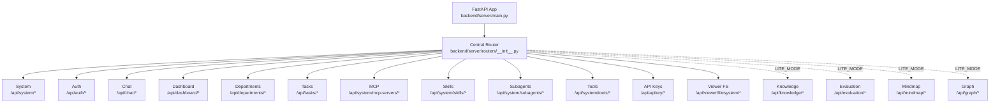
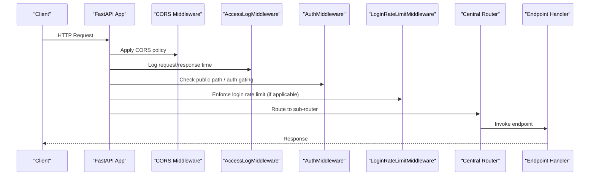
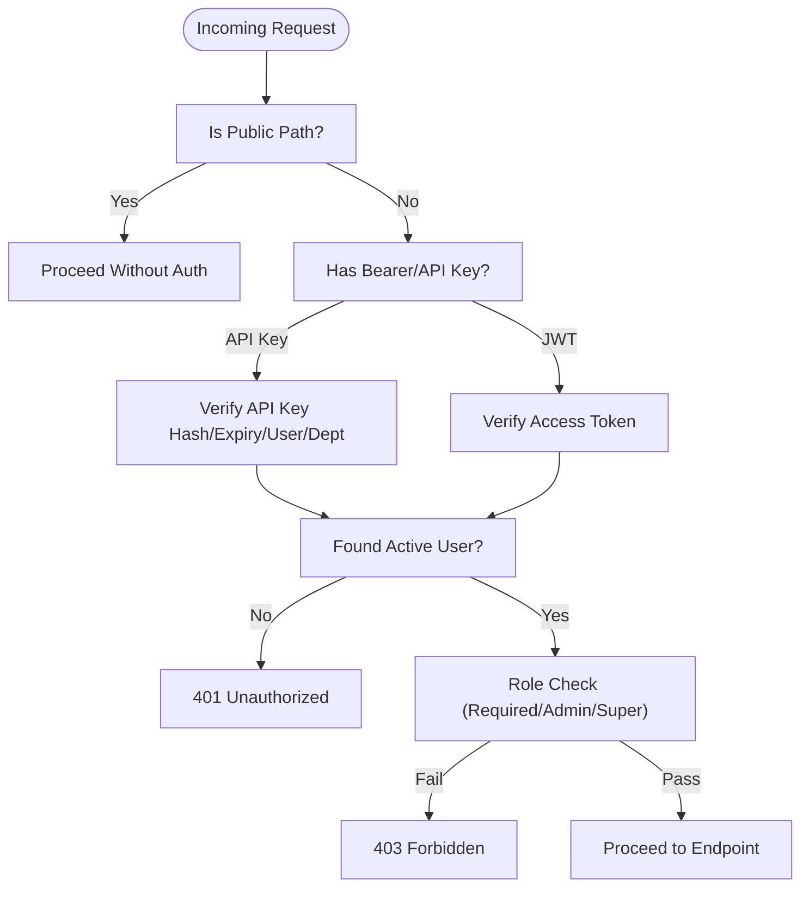
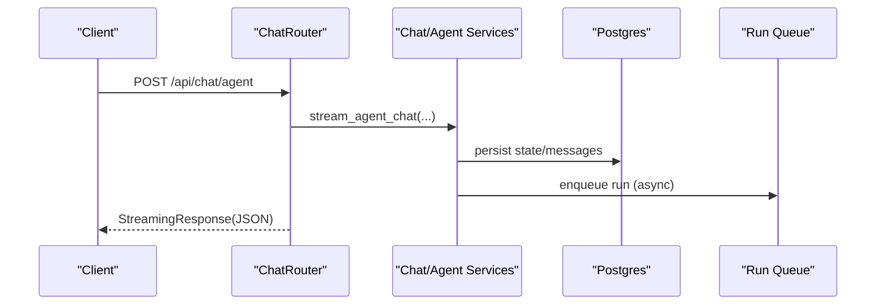
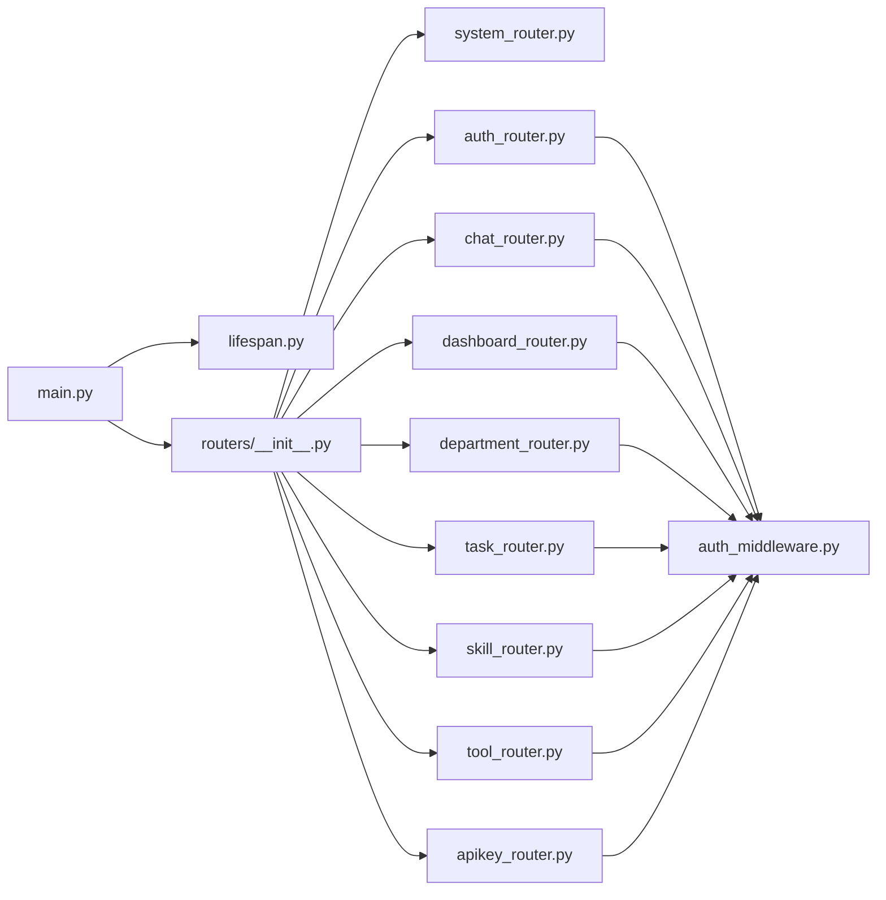

# API Layer & Router Organization

<cite>
**Referenced Files in This Document**
- [main.py](file://backend/server/main.py)
- [routers/__init__.py](file://backend/server/routers/__init__.py)
- [lifespan.py](file://backend/server/utils/lifespan.py)
- [auth_middleware.py](file://backend/server/utils/auth_middleware.py)
- [access_log_middleware.py](file://backend/server/utils/access_log_middleware.py)
- [auth_router.py](file://backend/server/routers/auth_router.py)
- [chat_router.py](file://backend/server/routers/chat_router.py)
- [knowledge_router.py](file://backend/server/routers/knowledge_router.py)
- [skill_router.py](file://backend/server/routers/skill_router.py)
- [dashboard_router.py](file://backend/server/routers/dashboard_router.py)
- [system_router.py](file://backend/server/routers/system_router.py)
- [tool_router.py](file://backend/server/routers/tool_router.py)
- [task_router.py](file://backend/server/routers/task_router.py)
- [department_router.py](file://backend/server/routers/department_router.py)
- [apikey_router.py](file://backend/server/routers/apikey_router.py)
</cite>

## Table of Contents
1. [Introduction](#introduction)
2. [Project Structure](#project-structure)
3. [Core Components](#core-components)
4. [Architecture Overview](#architecture-overview)
5. [Detailed Component Analysis](#detailed-component-analysis)
6. [Dependency Analysis](#dependency-analysis)
7. [Performance Considerations](#performance-considerations)
8. [Troubleshooting Guide](#troubleshooting-guide)
9. [Conclusion](#conclusion)

## Introduction
This document describes the API layer and router organization of the backend server built with FastAPI. It explains the centralized router registration system, URL routing patterns, endpoint grouping strategies, authentication and authorization mechanisms, rate limiting, CORS configuration, middleware integration, and request preprocessing. It also outlines request/response schemas, parameter validation, error handling patterns, and provides practical usage guidance for each major router module.

## Project Structure
The backend exposes a single entrypoint at /api with grouped routers for:
- System and health checks
- Authentication and user management
- Chat and agent orchestration
- Knowledge base and retrieval
- Skills and tools
- Dashboard analytics
- Administrative functions (departments, tasks, API keys)

**Diagram sources**
- [main.py:40-42](file://backend/server/main.py#L40-L42)
- [routers/__init__.py:20-49](file://backend/server/routers/__init__.py#L20-L49)

**Section sources**
- [main.py:40-42](file://backend/server/main.py#L40-L42)
- [routers/__init__.py:20-49](file://backend/server/routers/__init__.py#L20-L49)

## Core Components
- Centralized router registration: A single APIRouter aggregates all sub-routers under /api, enabling consistent URL patterns and middleware application.
- Middleware stack: Access logging, authentication gating, and login rate limiting are applied globally.
- Authentication: Dual-mode support for JWT bearer tokens and API keys; public paths excluded from auth.
- Rate limiting: Login attempts are throttled per IP within a sliding window.
- CORS: Enabled for development with broad allowances.
- Lifespan hooks: Startup and shutdown routines initialize DB, MCP servers, subagents, knowledge base (when not in LITE mode), Redis, and LangGraph checkpoint tables.

**Section sources**
- [main.py:40-51](file://backend/server/main.py#L40-L51)
- [main.py:63-96](file://backend/server/main.py#L63-L96)
- [main.py:99-137](file://backend/server/main.py#L99-L137)
- [auth_middleware.py:16-26](file://backend/server/utils/auth_middleware.py#L16-L26)
- [lifespan.py:17-89](file://backend/server/utils/lifespan.py#L17-L89)

## Architecture Overview
The application initializes via lifespan, registers the central router, applies middleware, and mounts sub-routers. Public paths bypass authentication; protected routes require either JWT or API key. Knowledge-related endpoints are gated by a LITE_MODE environment variable.

**Diagram sources**
- [main.py:44-51](file://backend/server/main.py#L44-L51)
- [main.py:132-137](file://backend/server/main.py#L132-L137)
- [auth_middleware.py:162-169](file://backend/server/utils/auth_middleware.py#L162-L169)
- [routers/__init__.py:20-49](file://backend/server/routers/__init__.py#L20-L49)

## Detailed Component Analysis

### Central Router Registration and URL Patterns
- Prefix: All endpoints are mounted under /api.
- Grouping: Routers are included in a logical order: system/auth/chat, then dashboard/administration, then optional knowledge family when not in LITE mode.
- LITE_MODE: When true, knowledge, evaluation, mindmap, and graph routers are omitted.

**Section sources**
- [main.py:40-42](file://backend/server/main.py#L40-L42)
- [routers/__init__.py:20-49](file://backend/server/routers/__init__.py#L20-L49)

### Authentication and Authorization
- Public paths: Health checks, first-run checks, initialization, and system info are publicly accessible.
- JWT vs API key:
  - JWT: Bearer tokens validated via access token verification.
  - API key: Starts with a specific prefix; validated against database with hashing, expiration, and user/department binding.
- Role-based access:
  - get_required_user: Ensures login and department binding.
  - get_admin_user: Requires admin or superadmin.
  - get_superadmin_user: Requires superadmin.
- User profile updates and avatar upload enforce uniqueness and format validation.

**Diagram sources**
- [auth_middleware.py:16-26](file://backend/server/utils/auth_middleware.py#L16-L26)
- [auth_middleware.py:74-139](file://backend/server/utils/auth_middleware.py#L74-L139)
- [auth_middleware.py:142-159](file://backend/server/utils/auth_middleware.py#L142-L159)
- [auth_middleware.py:162-169](file://backend/server/utils/auth_middleware.py#L162-L169)

**Section sources**
- [auth_middleware.py:16-26](file://backend/server/utils/auth_middleware.py#L16-L26)
- [auth_middleware.py:74-139](file://backend/server/utils/auth_middleware.py#L74-L139)
- [auth_middleware.py:142-159](file://backend/server/utils/auth_middleware.py#L142-L159)
- [auth_middleware.py:162-169](file://backend/server/utils/auth_middleware.py#L162-L169)

### System and Health Checks
- Health: Public endpoint for service status and version.
- Config: Admin-only endpoints to get, update single, and batch update configuration.
- Logs: Admin-only tailing of system log file with level filtering.
- Info: Public endpoint to load branding/information config with reload capability.
- OCR and chat model status: Admin-only endpoints to check health and availability.
- Custom providers: CRUD and test endpoints for custom model providers.

**Section sources**
- [system_router.py:21-24](file://backend/server/routers/system_router.py#L21-L24)
- [system_router.py:32-51](file://backend/server/routers/system_router.py#L32-L51)
- [system_router.py:54-93](file://backend/server/routers/system_router.py#L54-L93)
- [system_router.py:125-144](file://backend/server/routers/system_router.py#L125-L144)
- [system_router.py:152-190](file://backend/server/routers/system_router.py#L152-L190)
- [system_router.py:198-222](file://backend/server/routers/system_router.py#L198-L222)
- [system_router.py:230-291](file://backend/server/routers/system_router.py#L230-L291)
- [system_router.py:294-320](file://backend/server/routers/system_router.py#L294-L320)

### Authentication Endpoints
- Token exchange: Supports login by user_id or phone_number; enforces lockout and failure counters; logs operations.
- First-run check and initialization: Creates initial superadmin and default department.
- Current user profile: Read and update personal details with uniqueness and format validations.
- User management: Admin-only creation, listing, retrieval, update, and deletion with role and department constraints.
- Username validation and user_id availability checks.
- Avatar upload with type and size restrictions.
- Impersonation: Superadmin-only simulation of another user’s session.

**Section sources**
- [auth_router.py:115-207](file://backend/server/routers/auth_router.py#L115-L207)
- [auth_router.py:211-290](file://backend/server/routers/auth_router.py#L211-L290)
- [auth_router.py:299-308](file://backend/server/routers/auth_router.py#L299-L308)
- [auth_router.py:312-370](file://backend/server/routers/auth_router.py#L312-L370)
- [auth_router.py:379-471](file://backend/server/routers/auth_router.py#L379-L471)
- [auth_router.py:475-496](file://backend/server/routers/auth_router.py#L475-L496)
- [auth_router.py:500-509](file://backend/server/routers/auth_router.py#L500-L509)
- [auth_router.py:525-619](file://backend/server/routers/auth_router.py#L525-L619)
- [auth_router.py:623-690](file://backend/server/routers/auth_router.py#L623-L690)
- [auth_router.py:694-734](file://backend/server/routers/auth_router.py#L694-L734)
- [auth_router.py:727-734](file://backend/server/routers/auth_router.py#L727-L734)
- [auth_router.py:738-773](file://backend/server/routers/auth_router.py#L738-L773)
- [auth_router.py:777-800](file://backend/server/routers/auth_router.py#L777-L800)

### Chat and Agent Operations
- Agent lifecycle: List default agent, set default agent (admin), list agents, get agent info, manage agent configs (list/create/update/set_default/delete).
- Chat: Synchronous and streaming chat endpoints; resume interrupted chats; run management (create, get, cancel, stream events).
- Threads: Create, list, update, delete threads; history and state queries.
- Attachments: Upload, list, and manage thread attachments with limits and metadata.
- Files: List, read, and resolve thread artifacts; save artifacts to workspace.
- Feedback: Retrieve and submit message feedback.
- Image processing: Optional base64 image content in requests.

**Diagram sources**
- [chat_router.py:348-396](file://backend/server/routers/chat_router.py#L348-L396)
- [chat_router.py:399-424](file://backend/server/routers/chat_router.py#L399-L424)
- [chat_router.py:437-456](file://backend/server/routers/chat_router.py#L437-L456)

**Section sources**
- [chat_router.py:106-148](file://backend/server/routers/chat_router.py#L106-L148)
- [chat_router.py:172-196](file://backend/server/routers/chat_router.py#L172-L196)
- [chat_router.py:199-344](file://backend/server/routers/chat_router.py#L199-L344)
- [chat_router.py:348-396](file://backend/server/routers/chat_router.py#L348-L396)
- [chat_router.py:399-456](file://backend/server/routers/chat_router.py#L399-L456)
- [chat_router.py:579-623](file://backend/server/routers/chat_router.py#L579-L623)
- [chat_router.py:629-764](file://backend/server/routers/chat_router.py#L629-L764)
- [chat_router.py:772-800](file://backend/server/routers/chat_router.py#L772-L800)

### Knowledge Base Management
- Databases: List, create, update, delete, export (CSV/XLSX/MD/TXT) with chunking defaults and embedding model validation; Dify-specific parameter validation.
- Documents: Batch ingestion (file/url), manual parse, manual index, batch delete, delete, download; supports MinIO and local paths; URL fetcher integration.
- Content access: Basic info, content chunks, and metadata retrieval.
- Permissions: Admin-only for destructive operations; accessible list for agents.

**Section sources**
- [knowledge_router.py:90-177](file://backend/server/routers/knowledge_router.py#L90-L177)
- [knowledge_router.py:180-198](file://backend/server/routers/knowledge_router.py#L180-L198)
- [knowledge_router.py:201-268](file://backend/server/routers/knowledge_router.py#L201-L268)
- [knowledge_router.py:302-491](file://backend/server/routers/knowledge_router.py#L302-L491)
- [knowledge_router.py:494-540](file://backend/server/routers/knowledge_router.py#L494-L540)
- [knowledge_router.py:543-618](file://backend/server/routers/knowledge_router.py#L543-L618)
- [knowledge_router.py:621-750](file://backend/server/routers/knowledge_router.py#L621-L750)
- [knowledge_router.py:752-800](file://backend/server/routers/knowledge_router.py#L752-L800)

### Skills and Tools
- Skills:
  - List, dependency options (superadmin).
  - Built-in skills: list, install, update (with conflict handling).
  - Import/export skill packages (ZIP).
  - Manage skill tree, files, dependencies, and deletion.
- Tools:
  - List tools and tool options (admin).

**Section sources**
- [skill_router.py:79-90](file://backend/server/routers/skill_router.py#L79-L90)
- [skill_router.py:93-103](file://backend/server/routers/skill_router.py#L93-L103)
- [skill_router.py:106-138](file://backend/server/routers/skill_router.py#L106-L138)
- [skill_router.py:141-185](file://backend/server/routers/skill_router.py#L141-L185)
- [skill_router.py:188-210](file://backend/server/routers/skill_router.py#L188-L210)
- [skill_router.py:213-251](file://backend/server/routers/skill_router.py#L213-L251)
- [skill_router.py:254-270](file://backend/server/routers/skill_router.py#L254-L270)
- [skill_router.py:273-290](file://backend/server/routers/skill_router.py#L273-L290)
- [skill_router.py:293-343](file://backend/server/routers/skill_router.py#L293-L343)
- [skill_router.py:346-370](file://backend/server/routers/skill_router.py#L346-L370)
- [skill_router.py:373-390](file://backend/server/routers/skill_router.py#L373-L390)
- [skill_router.py:393-415](file://backend/server/routers/skill_router.py#L393-L415)
- [skill_router.py:418-434](file://backend/server/routers/skill_router.py#L418-L434)
- [tool_router.py:10-25](file://backend/server/routers/tool_router.py#L10-L25)

### Dashboard Analytics
- Conversations: List and detail with messages and tool calls.
- User activity: Totals, active users in 24h/30d, daily active users.
- Tool call stats: Totals, success rate, most used tools, error distribution, daily series.
- Knowledge stats: Counts by database type and file type distribution.
- Agent analytics: Conversation counts, satisfaction rates, tool usage, top performers.
- Feedback: List feedback with filters.
- Time-series: Calls by models/agents/tokens/tools with configurable ranges.

**Section sources**
- [dashboard_router.py:128-177](file://backend/server/routers/dashboard_router.py#L128-L177)
- [dashboard_router.py:180-241](file://backend/server/routers/dashboard_router.py#L180-L241)
- [dashboard_router.py:249-315](file://backend/server/routers/dashboard_router.py#L249-L315)
- [dashboard_router.py:323-390](file://backend/server/routers/dashboard_router.py#L323-L390)
- [dashboard_router.py:398-479](file://backend/server/routers/dashboard_router.py#L398-L479)
- [dashboard_router.py:487-576](file://backend/server/routers/dashboard_router.py#L487-L576)
- [dashboard_router.py:584-633](file://backend/server/routers/dashboard_router.py#L584-L633)
- [dashboard_router.py:656-714](file://backend/server/routers/dashboard_router.py#L656-L714)
- [dashboard_router.py:733-834](file://backend/server/routers/dashboard_router.py#L733-L834)

### Administration Endpoints
- Departments:
  - List, get, create (with admin user), update, delete with constraints.
  - Validation for user_id format, phone number, uniqueness.
- Tasks:
  - List, get, cancel, delete tasks via task service.
- API Keys:
  - List, create, get, update, delete, regenerate with scoping by user/department and expiration handling.
  - Secret returned only at creation/regeneration.

**Section sources**
- [department_router.py:70-94](file://backend/server/routers/department_router.py#L70-L94)
- [department_router.py:97-170](file://backend/server/routers/department_router.py#L97-L170)
- [department_router.py:173-211](file://backend/server/routers/department_router.py#L173-L211)
- [department_router.py:214-247](file://backend/server/routers/department_router.py#L214-L247)
- [task_router.py:10-44](file://backend/server/routers/task_router.py#L10-L44)
- [apikey_router.py:65-97](file://backend/server/routers/apikey_router.py#L65-L97)
- [apikey_router.py:100-149](file://backend/server/routers/apikey_router.py#L100-L149)
- [apikey_router.py:152-169](file://backend/server/routers/apikey_router.py#L152-L169)
- [apikey_router.py:172-203](file://backend/server/routers/apikey_router.py#L172-L203)
- [apikey_router.py:206-226](file://backend/server/routers/apikey_router.py#L206-L226)
- [apikey_router.py:229-258](file://backend/server/routers/apikey_router.py#L229-L258)

## Dependency Analysis
- Application bootstrap:
  - main.py wires CORS, access logging, auth, and rate-limit middleware; mounts the central router.
  - lifespan.py initializes DB, MCP servers, subagents, knowledge base (non-LITE), Redis, and LangGraph checkpoint tables.
- Router composition:
  - routers/__init__.py aggregates sub-routers and conditionally includes knowledge family based on LITE_MODE.
- Authentication and authorization:
  - auth_middleware.py defines public paths, JWT/API key parsing, and role-based dependency providers.
- Endpoint dependencies:
  - Many endpoints depend on get_required_user/get_admin_user/get_superadmin_user and database sessions via get_db.

**Diagram sources**
- [main.py:23-25](file://backend/server/main.py#L23-L25)
- [main.py:40-42](file://backend/server/main.py#L40-L42)
- [lifespan.py:17-89](file://backend/server/utils/lifespan.py#L17-L89)
- [routers/__init__.py:20-49](file://backend/server/routers/__init__.py#L20-L49)
- [auth_middleware.py:29-32](file://backend/server/utils/auth_middleware.py#L29-L32)

**Section sources**
- [main.py:23-25](file://backend/server/main.py#L23-L25)
- [main.py:40-42](file://backend/server/main.py#L40-L42)
- [lifespan.py:17-89](file://backend/server/utils/lifespan.py#L17-L89)
- [routers/__init__.py:20-49](file://backend/server/routers/__init__.py#L20-L49)
- [auth_middleware.py:29-32](file://backend/server/utils/auth_middleware.py#L29-L32)

## Performance Considerations
- Streaming responses: Chat endpoints return StreamingResponse to reduce latency and memory footprint for long-running operations.
- Background tasks: Knowledge ingestion, parsing, and indexing are queued via a task service to avoid blocking requests.
- Rate limiting: Login attempts are throttled per IP with a sliding window to mitigate brute-force attacks.
- Access logging: Structured access logs include processing time for observability and performance tuning.

[No sources needed since this section provides general guidance]

## Troubleshooting Guide
- Authentication failures:
  - 401 Unauthorized: Invalid or missing credentials; ensure Authorization header is present and valid.
  - 403 Forbidden: Insufficient privileges; verify role (admin/superadmin) or department binding.
  - Lockouts: Excessive failed attempts trigger temporary lockouts; wait for cooldown.
- Rate limiting:
  - 429 Too Many Requests: Login attempts exceed configured threshold; retry after indicated interval.
- CORS:
  - If cross-origin requests fail, verify client origin and headers; the server allows all origins for development.
- Knowledge ingestion:
  - Export/parse/index errors: Check task status via tasks endpoints; review logs for detailed error messages.
- Middleware:
  - Access logs: Confirm access_logger is initialized and not suppressed; inspect stdout/stderr.

**Section sources**
- [auth_middleware.py:78-139](file://backend/server/utils/auth_middleware.py#L78-L139)
- [main.py:63-96](file://backend/server/main.py#L63-L96)
- [main.py:132-137](file://backend/server/main.py#L132-L137)

## Conclusion
The backend employs a centralized router architecture under /api with strict authentication and role-based authorization. Middleware ensures secure, observable, and resilient operations. Endpoints are grouped by functional domains, with clear separation between public, admin-only, and superadmin-only capabilities. Knowledge-intensive features are conditionally available via LITE_MODE. The design balances developer ergonomics with operational safety, providing robust streaming, background tasking, and comprehensive audit trails.