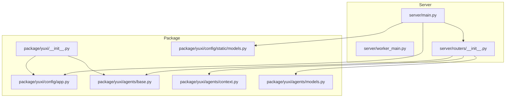
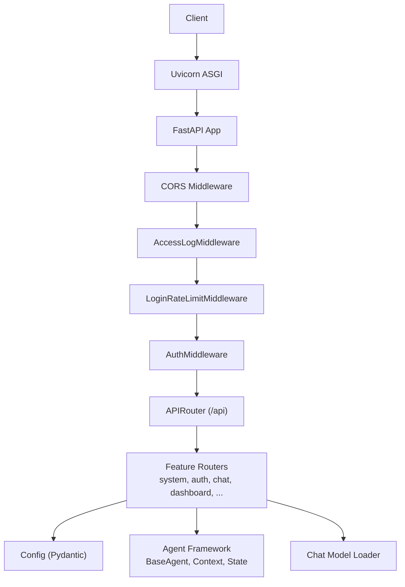
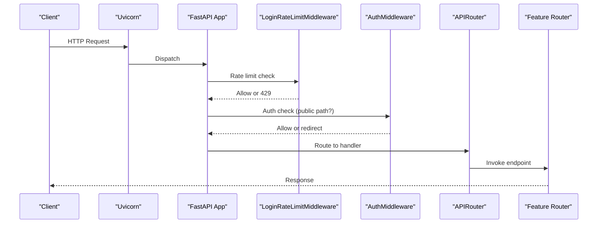
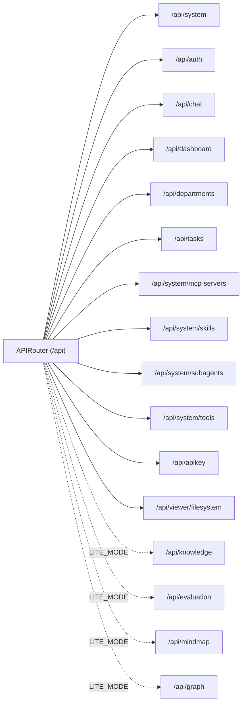
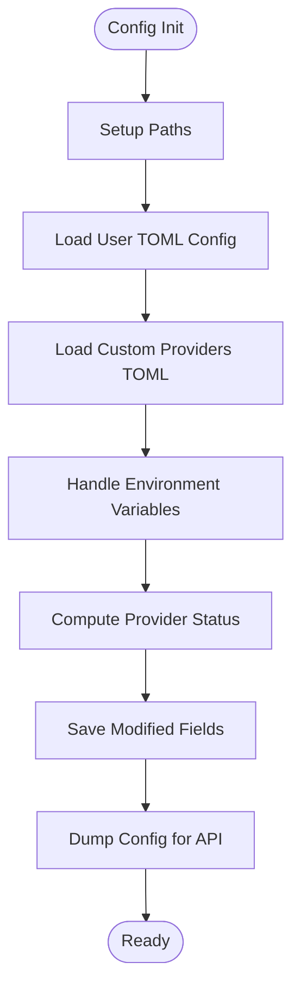
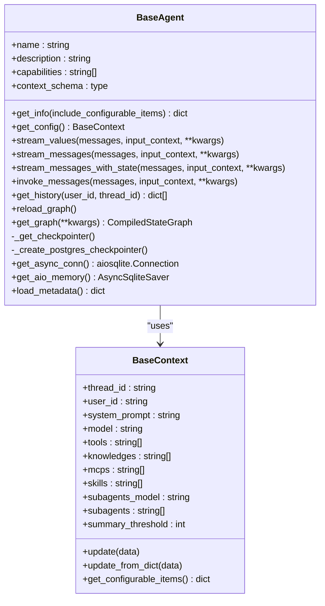
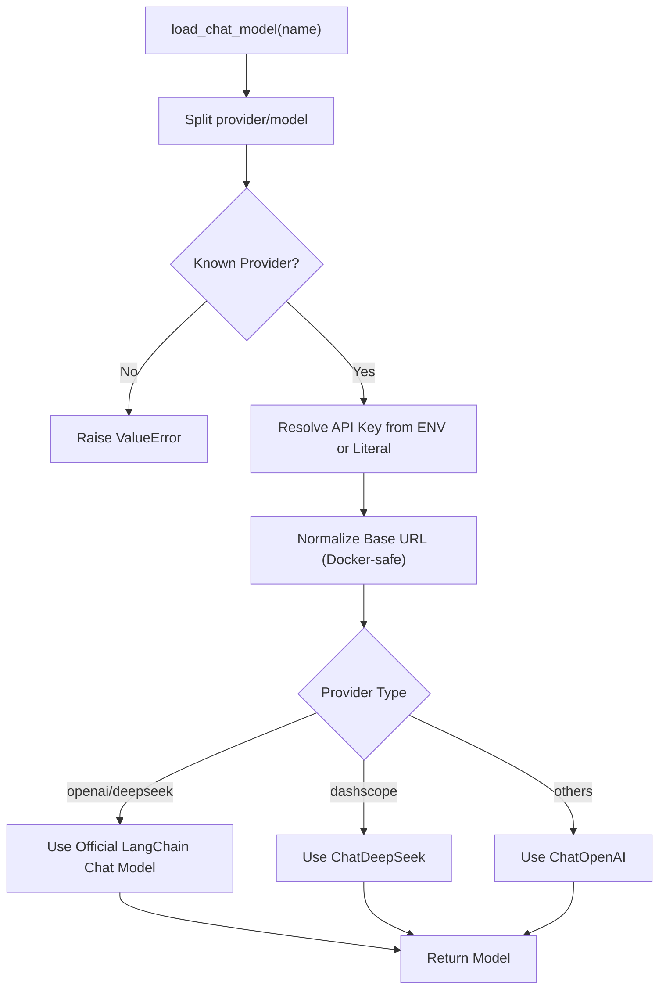
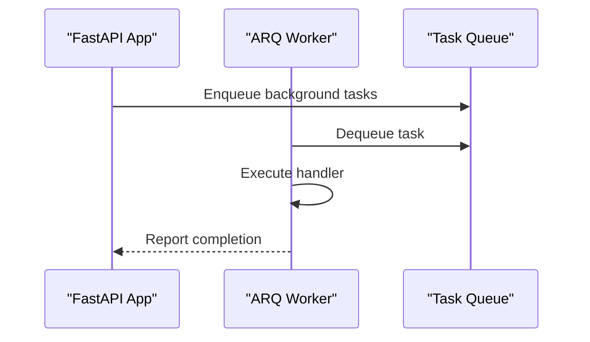
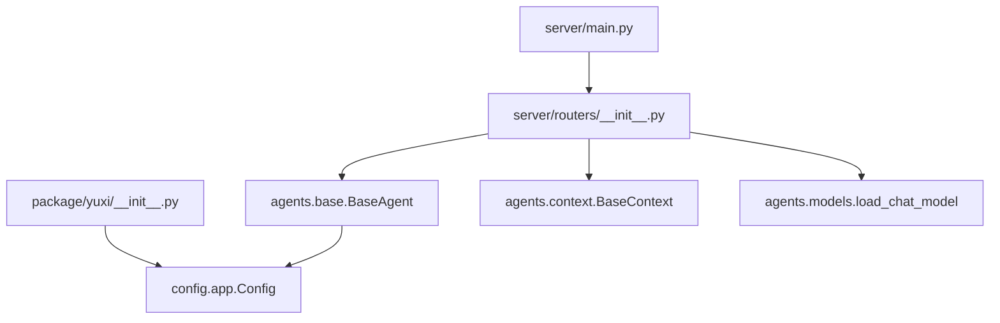

# Backend Services Architecture

<cite>
**Referenced Files in This Document**
- [backend/server/main.py](file://backend/server/main.py)
- [backend/server/worker_main.py](file://backend/server/worker_main.py)
- [backend/server/routers/__init__.py](file://backend/server/routers/__init__.py)
- [backend/package/yuxi/__init__.py](file://backend/package/yuxi/__init__.py)
- [backend/package/yuxi/config/app.py](file://backend/package/yuxi/config/app.py)
- [backend/package/yuxi/config/static/models.py](file://backend/package/yuxi/config/static/models.py)
- [backend/package/yuxi/agents/base.py](file://backend/package/yuxi/agents/base.py)
- [backend/package/yuxi/agents/context.py](file://backend/package/yuxi/agents/context.py)
- [backend/package/yuxi/agents/models.py](file://backend/package/yuxi/agents/models.py)
</cite>

## Table of Contents
1. [Introduction](#introduction)
2. [Project Structure](#project-structure)
3. [Core Components](#core-components)
4. [Architecture Overview](#architecture-overview)
5. [Detailed Component Analysis](#detailed-component-analysis)
6. [Dependency Analysis](#dependency-analysis)
7. [Performance Considerations](#performance-considerations)
8. [Troubleshooting Guide](#troubleshooting-guide)
9. [Conclusion](#conclusion)

## Introduction
This document describes the backend services architecture for Yuxi’s FastAPI application. It covers the router organization, middleware stack, service layer design, and the agent-centric runtime. It also documents the configuration system, agent context and state models, and how the application orchestrates business logic services for chat, knowledge processing, and file system operations. Background task processing via ARQ and worker coordination are explained, along with integration patterns for external APIs and microservices.

## Project Structure
The backend is organized into two primary packages:
- server: FastAPI application, routers, middleware, and worker entrypoints
- package/yuxi: reusable library containing configuration, agent framework, knowledge processing, toolkits, repositories, services, and utilities

**Diagram sources**
- [backend/server/main.py:1-150](file://backend/server/main.py#L1-L150)
- [backend/server/routers/__init__.py:1-49](file://backend/server/routers/__init__.py#L1-L49)
- [backend/package/yuxi/__init__.py:1-29](file://backend/package/yuxi/__init__.py#L1-L29)
- [backend/package/yuxi/config/app.py:1-598](file://backend/package/yuxi/config/app.py#L1-L598)
- [backend/package/yuxi/config/static/models.py:1-256](file://backend/package/yuxi/config/static/models.py#L1-L256)
- [backend/package/yuxi/agents/base.py:1-263](file://backend/package/yuxi/agents/base.py#L1-L263)
- [backend/package/yuxi/agents/context.py:1-191](file://backend/package/yuxi/agents/context.py#L1-L191)
- [backend/package/yuxi/agents/models.py:1-58](file://backend/package/yuxi/agents/models.py#L1-L58)

**Section sources**
- [backend/server/main.py:1-150](file://backend/server/main.py#L1-L150)
- [backend/server/routers/__init__.py:1-49](file://backend/server/routers/__init__.py#L1-L49)
- [backend/package/yuxi/__init__.py:1-29](file://backend/package/yuxi/__init__.py#L1-L29)

## Core Components
- FastAPI Application: Central entrypoint with CORS, access logging, rate-limiting, and authentication middleware; mounts grouped routers under /api.
- Router Organization: Modular API groups for system, auth, chat, dashboard, departments, tasks, MCP, skills, subagents, tools, API keys, filesystem, and optionally knowledge/graph/evaluation/mindmap depending on LITE_MODE.
- Middleware Stack: Access log, login rate limit, and auth middleware; Windows-specific event loop policy initialization.
- Configuration System: Pydantic-based Config class managing defaults, environment overrides, TOML persistence, and runtime provider status.
- Agent Framework: BaseAgent with LangGraph integration, context schema, and checkpointers (SQLite/Postgres/Memory).
- Agent Context and State: Typed context fields and shared state with artifact merging semantics.
- Model Loader: Provider-aware chat model loader supporting multiple LLM providers and Docker-safe base URLs.

**Section sources**
- [backend/server/main.py:40-137](file://backend/server/main.py#L40-L137)
- [backend/server/routers/__init__.py:18-49](file://backend/server/routers/__init__.py#L18-L49)
- [backend/package/yuxi/config/app.py:31-344](file://backend/package/yuxi/config/app.py#L31-L344)
- [backend/package/yuxi/agents/base.py:17-263](file://backend/package/yuxi/agents/base.py#L17-L263)
- [backend/package/yuxi/agents/context.py:11-191](file://backend/package/yuxi/agents/context.py#L11-L191)
- [backend/package/yuxi/agents/models.py:12-58](file://backend/package/yuxi/agents/models.py#L12-L58)

## Architecture Overview
The FastAPI app initializes logging, sets up middleware, and mounts a single APIRouter that aggregates feature-specific routers. Business logic is encapsulated in services and utilities under the package/yuxi namespace. Agent orchestration leverages LangGraph with configurable checkpointer backends. Configuration is centralized and persisted to TOML with environment variable overrides.

**Diagram sources**
- [backend/server/main.py:40-137](file://backend/server/main.py#L40-L137)
- [backend/server/routers/__init__.py:18-49](file://backend/server/routers/__init__.py#L18-L49)
- [backend/package/yuxi/config/app.py:31-344](file://backend/package/yuxi/config/app.py#L31-L344)
- [backend/package/yuxi/agents/base.py:17-263](file://backend/package/yuxi/agents/base.py#L17-L263)
- [backend/package/yuxi/agents/models.py:12-58](file://backend/package/yuxi/agents/models.py#L12-L58)

## Detailed Component Analysis

### FastAPI Application and Middleware Stack
- Event Loop Policy: On Windows, switches to selector event loop to support async Postgres drivers.
- Logging: Centralized logging setup invoked early.
- Router Mounting: Single APIRouter mounted at /api with modular grouping.
- CORS: Permissive configuration enabled.
- Access Log Middleware: Records request durations.
- Login Rate Limit Middleware: Tracks login attempts per IP window and returns 429 when exceeded.
- Auth Middleware: Public path bypass; non-API paths allowed; bearer token extraction commented out for extensibility.
- Worker Entrypoint: ARQ worker settings exported for background job processing.

**Diagram sources**
- [backend/server/main.py:63-137](file://backend/server/main.py#L63-L137)

**Section sources**
- [backend/server/main.py:1-150](file://backend/server/main.py#L1-L150)
- [backend/server/worker_main.py:1-16](file://backend/server/worker_main.py#L1-L16)

### Router Organization
- Grouped under server/routers/__init__.py with include_router calls for system, auth, chat, dashboard, departments, tasks, MCP, skills, subagents, tools, API keys, and filesystem.
- Conditional inclusion of knowledge, evaluation, mindmap, and graph routers controlled by LITE_MODE environment variable.

**Diagram sources**
- [backend/server/routers/__init__.py:18-49](file://backend/server/routers/__init__.py#L18-L49)

**Section sources**
- [backend/server/routers/__init__.py:1-49](file://backend/server/routers/__init__.py#L1-L49)

### Configuration System (Pydantic Config)
- Centralized configuration with defaults, environment overrides, and TOML persistence.
- Handles model providers, embedding models, reranking models, sandbox settings, and runtime availability checks.
- Exposes helpers to export configuration for API responses and maintain provider lists.

**Diagram sources**
- [backend/package/yuxi/config/app.py:127-344](file://backend/package/yuxi/config/app.py#L127-L344)

**Section sources**
- [backend/package/yuxi/config/app.py:31-598](file://backend/package/yuxi/config/app.py#L31-L598)
- [backend/package/yuxi/config/static/models.py:13-256](file://backend/package/yuxi/config/static/models.py#L13-L256)

### Agent Framework and Orchestration
- BaseAgent integrates LangGraph with configurable checkpointer backends (Postgres, SQLite, Memory).
- Provides streaming and invocation APIs for message processing and history retrieval.
- Supports LangFuse callbacks/tags/metadata passthrough for observability.

**Diagram sources**
- [backend/package/yuxi/agents/base.py:17-263](file://backend/package/yuxi/agents/base.py#L17-L263)
- [backend/package/yuxi/agents/context.py:11-191](file://backend/package/yuxi/agents/context.py#L11-L191)

**Section sources**
- [backend/package/yuxi/agents/base.py:17-263](file://backend/package/yuxi/agents/base.py#L17-L263)
- [backend/package/yuxi/agents/context.py:11-191](file://backend/package/yuxi/agents/context.py#L11-L191)

### Chat Model Loader
- Provider-aware model loading with Docker-safe base URL resolution.
- Supports official providers and specialized integrations with provider-specific clients.
- Raises explicit errors on unsupported or failing provider loads.

**Diagram sources**
- [backend/package/yuxi/agents/models.py:12-58](file://backend/package/yuxi/agents/models.py#L12-L58)

**Section sources**
- [backend/package/yuxi/agents/models.py:12-58](file://backend/package/yuxi/agents/models.py#L12-L58)

### Background Tasks and Worker Coordination
- Worker entrypoint exports WorkerSettings for ARQ; Windows event loop policy configured at process start.
- Run queue service and worker implementation exist under services and are wired via ARQ.

**Diagram sources**
- [backend/server/worker_main.py:1-16](file://backend/server/worker_main.py#L1-L16)

**Section sources**
- [backend/server/worker_main.py:1-16](file://backend/server/worker_main.py#L1-L16)

## Dependency Analysis
- Package bootstrap: package/yuxi/__init__.py loads environment variables, exposes version, and lazily exposes knowledge graph utilities.
- Server depends on routers, lifespan utilities, and middleware; routers depend on agent framework and configuration.
- Agent framework depends on LangGraph, configuration, and optional Postgres manager for checkpointers.

**Diagram sources**
- [backend/package/yuxi/__init__.py:1-29](file://backend/package/yuxi/__init__.py#L1-L29)
- [backend/server/main.py:40-137](file://backend/server/main.py#L40-L137)
- [backend/server/routers/__init__.py:18-49](file://backend/server/routers/__init__.py#L18-L49)
- [backend/package/yuxi/config/app.py:31-344](file://backend/package/yuxi/config/app.py#L31-L344)
- [backend/package/yuxi/agents/base.py:17-263](file://backend/package/yuxi/agents/base.py#L17-L263)
- [backend/package/yuxi/agents/context.py:11-191](file://backend/package/yuxi/agents/context.py#L11-L191)
- [backend/package/yuxi/agents/models.py:12-58](file://backend/package/yuxi/agents/models.py#L12-L58)

**Section sources**
- [backend/package/yuxi/__init__.py:1-29](file://backend/package/yuxi/__init__.py#L1-L29)
- [backend/server/main.py:40-137](file://backend/server/main.py#L40-L137)
- [backend/server/routers/__init__.py:18-49](file://backend/server/routers/__init__.py#L18-L49)
- [backend/package/yuxi/config/app.py:31-344](file://backend/package/yuxi/config/app.py#L31-L344)
- [backend/package/yuxi/agents/base.py:17-263](file://backend/package/yuxi/agents/base.py#L17-L263)
- [backend/package/yuxi/agents/context.py:11-191](file://backend/package/yuxi/agents/context.py#L11-L191)
- [backend/package/yuxi/agents/models.py:12-58](file://backend/package/yuxi/agents/models.py#L12-L58)

## Performance Considerations
- Middleware overhead: Access log and rate-limit middleware add minimal CPU overhead; ensure structured logging is efficient.
- Streaming: Prefer streaming endpoints for long-running agent runs to reduce latency and memory pressure.
- Checkpointers: Choose Postgres checkpointer for production-scale state persistence; fallback to SQLite or memory for development.
- Model selection: Use appropriate model sizes for agent tasks; avoid overly small models for reasoning-heavy workflows.
- Concurrency: Tune Uvicorn workers and threads according to CPU cores and I/O characteristics; monitor Postgres connections for async drivers.

## Troubleshooting Guide
- Authentication: Auth middleware currently allows requests without enforcing bearer tokens; implement token extraction and validation as needed.
- Rate limiting: Login attempts are tracked per IP; adjust RATE_LIMIT_MAX_ATTEMPTS and RATE_LIMIT_WINDOW_SECONDS for site policies.
- Windows async: Ensure WindowsSelectorEventLoopPolicy is set before importing async drivers to avoid driver compatibility issues.
- Configuration persistence: If saving TOML fails, verify write permissions to SAVE_DIR and that only modified fields are persisted.
- Agent history: If history retrieval fails, confirm checkpointer availability and thread/user IDs match stored state.

**Section sources**
- [backend/server/main.py:63-137](file://backend/server/main.py#L63-L137)
- [backend/package/yuxi/config/app.py:274-306](file://backend/package/yuxi/config/app.py#L274-L306)

## Conclusion
Yuxi’s backend leverages a clean separation of concerns: a modular FastAPI application with a robust middleware stack, a centralized configuration system, and a powerful agent framework built on LangGraph. The design supports scalable background processing via ARQ, flexible provider integrations, and extensible service orchestration. By adhering to the documented patterns for middleware, configuration, and agent orchestration, teams can extend functionality safely and efficiently.