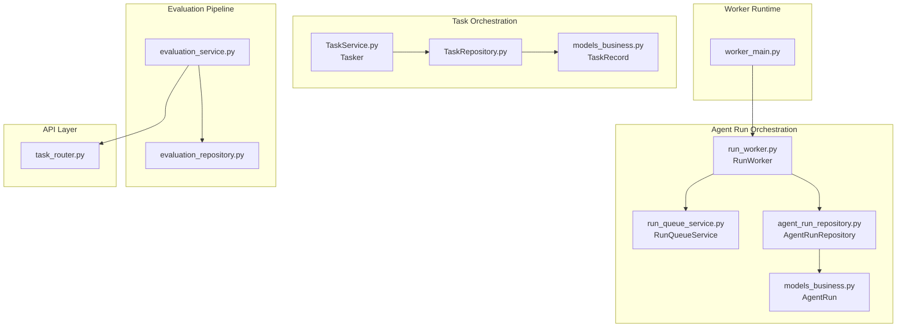
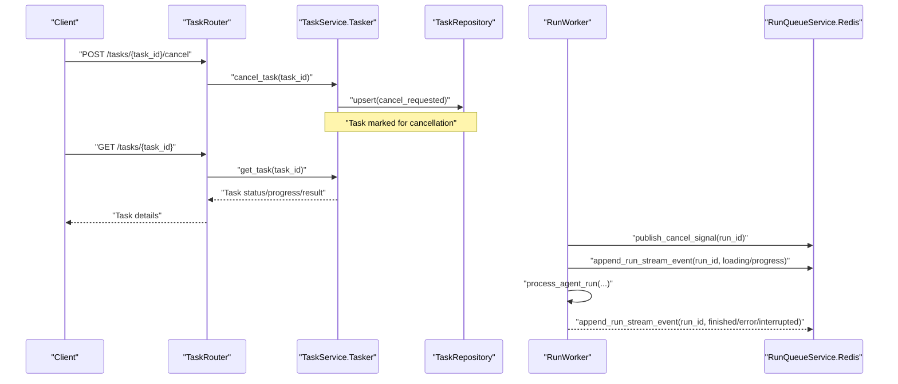
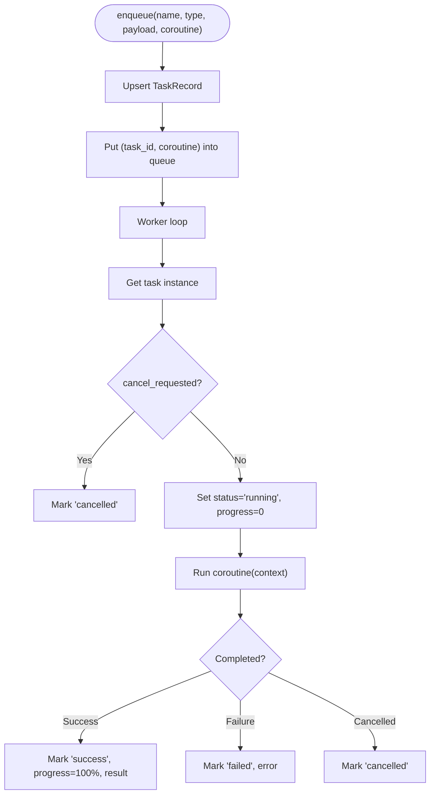
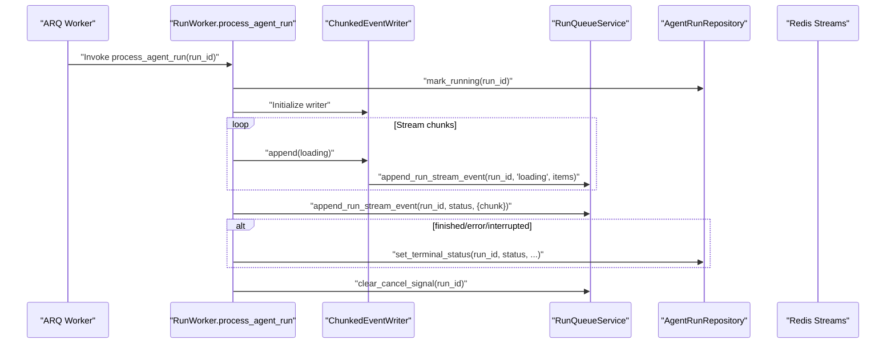
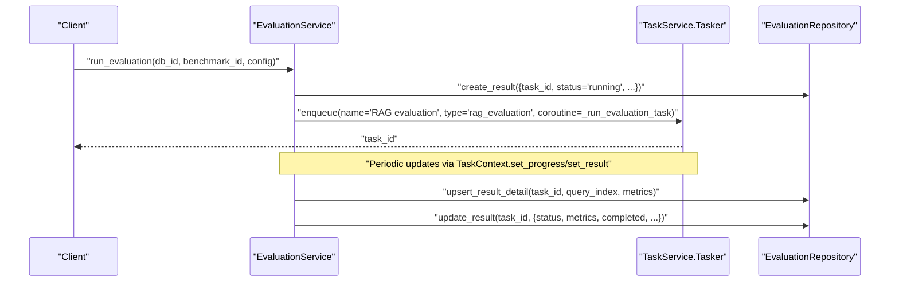
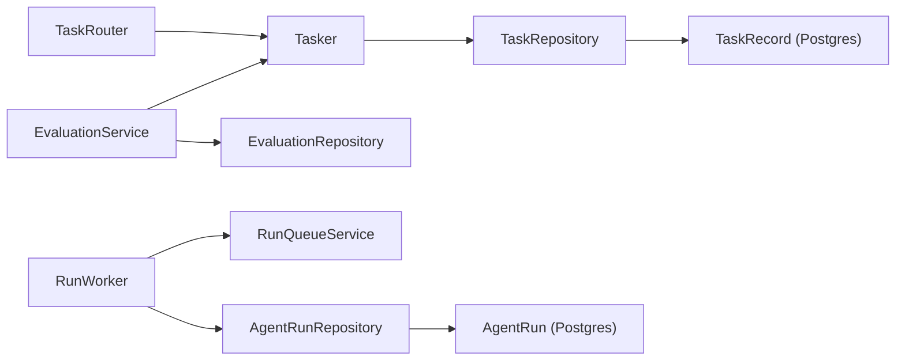

# Background Tasks & Worker Coordination

<cite>
**Referenced Files in This Document**
- [run_queue_service.py](file://backend/package/yuxi/services/run_queue_service.py)
- [run_worker.py](file://backend/package/yuxi/services/run_worker.py)
- [task_service.py](file://backend/package/yuxi/services/task_service.py)
- [task_repository.py](file://backend/package/yuxi/repositories/task_repository.py)
- [evaluation_service.py](file://backend/package/yuxi/services/evaluation_service.py)
- [task_router.py](file://backend/server/routers/task_router.py)
- [worker_main.py](file://backend/server/worker_main.py)
- [models_business.py](file://backend/package/yuxi/storage/postgres/models_business.py)
- [agent_run_repository.py](file://backend/package/yuxi/repositories/agent_run_repository.py)
- [evaluation_repository.py](file://backend/package/yuxi/repositories/evaluation_repository.py)
</cite>

## Table of Contents
1. [Introduction](#introduction)
2. [Project Structure](#project-structure)
3. [Core Components](#core-components)
4. [Architecture Overview](#architecture-overview)
5. [Detailed Component Analysis](#detailed-component-analysis)
6. [Dependency Analysis](#dependency-analysis)
7. [Performance Considerations](#performance-considerations)
8. [Troubleshooting Guide](#troubleshooting-guide)
9. [Conclusion](#conclusion)
10. [Appendices](#appendices)

## Introduction
This document explains Yuxi’s background task processing and worker coordination system. It covers queue management, task scheduling, worker pool coordination, run queue streaming, task prioritization, failure handling, worker processes, task execution patterns, resource allocation, evaluation service integration, batch processing, asynchronous operations, task serialization, progress tracking, and result retrieval. It also provides examples for task submission, worker configuration, and monitoring approaches.

## Project Structure
The background task system spans several modules:
- Task orchestration and persistence: Tasker, TaskService, TaskRepository
- Agent run orchestration and streaming: RunWorker, RunQueueService, AgentRunRepository
- Evaluation pipeline integration: EvaluationService, EvaluationRepository
- HTTP APIs for task management: TaskRouter
- Worker entrypoint: WorkerMain
- Persistence models: TaskRecord, AgentRun

**Diagram sources**
- [task_service.py:95-339](file://backend/package/yuxi/services/task_service.py#L95-L339)
- [task_repository.py:11-52](file://backend/package/yuxi/repositories/task_repository.py#L11-L52)
- [models_business.py:528-569](file://backend/package/yuxi/storage/postgres/models_business.py#L528-L569)
- [run_worker.py:189-388](file://backend/package/yuxi/services/run_worker.py#L189-L388)
- [run_queue_service.py:114-240](file://backend/package/yuxi/services/run_queue_service.py#L114-L240)
- [agent_run_repository.py:14-103](file://backend/package/yuxi/repositories/agent_run_repository.py#L14-L103)
- [models_business.py:665-706](file://backend/package/yuxi/storage/postgres/models_business.py#L665-L706)
- [evaluation_service.py:18-800](file://backend/package/yuxi/services/evaluation_service.py#L18-L800)
- [evaluation_repository.py:11-119](file://backend/package/yuxi/repositories/evaluation_repository.py#L11-L119)
- [task_router.py:10-45](file://backend/server/routers/task_router.py#L10-L45)
- [worker_main.py:13-16](file://backend/server/worker_main.py#L13-L16)

**Section sources**
- [task_service.py:95-339](file://backend/package/yuxi/services/task_service.py#L95-L339)
- [task_repository.py:11-52](file://backend/package/yuxi/repositories/task_repository.py#L11-L52)
- [models_business.py:528-569](file://backend/package/yuxi/storage/postgres/models_business.py#L528-L569)
- [run_worker.py:189-388](file://backend/package/yuxi/services/run_worker.py#L189-L388)
- [run_queue_service.py:114-240](file://backend/package/yuxi/services/run_queue_service.py#L114-L240)
- [agent_run_repository.py:14-103](file://backend/package/yuxi/repositories/agent_run_repository.py#L14-L103)
- [models_business.py:665-706](file://backend/package/yuxi/storage/postgres/models_business.py#L665-L706)
- [evaluation_service.py:18-800](file://backend/package/yuxi/services/evaluation_service.py#L18-L800)
- [evaluation_repository.py:11-119](file://backend/package/yuxi/repositories/evaluation_repository.py#L11-L119)
- [task_router.py:10-45](file://backend/server/routers/task_router.py#L10-L45)
- [worker_main.py:13-16](file://backend/server/worker_main.py#L13-L16)

## Core Components
- Tasker: In-process task scheduler with a worker pool, queue, and persistence via TaskRepository. Supports progress tracking, cancellation, and result updates.
- RunWorker: ARQ-based worker for long-running agent runs with Redis-backed streaming, cancellation signaling, and robust retry handling.
- RunQueueService: Redis helpers for cancel signals, event streams, and TTL management for run events.
- EvaluationService: Integrates task orchestration with evaluation benchmarks and results, exposing async task submission and progress reporting.
- TaskRouter: Admin endpoints to list, fetch, cancel, and delete tasks.

**Section sources**
- [task_service.py:95-339](file://backend/package/yuxi/services/task_service.py#L95-L339)
- [run_worker.py:189-388](file://backend/package/yuxi/services/run_worker.py#L189-L388)
- [run_queue_service.py:114-240](file://backend/package/yuxi/services/run_queue_service.py#L114-L240)
- [evaluation_service.py:18-800](file://backend/package/yuxi/services/evaluation_service.py#L18-L800)
- [task_router.py:10-45](file://backend/server/routers/task_router.py#L10-L45)

## Architecture Overview
Yuxi separates concerns across three layers:
- In-process tasking: Tasker manages lightweight tasks with local queues and PostgreSQL persistence.
- Agent run orchestration: RunWorker executes long-running agent runs asynchronously, streams intermediate events to Redis, and handles cancellation and retries.
- Evaluation pipeline: EvaluationService submits tasks to Tasker for benchmark generation and RAG evaluation, aggregating metrics and persisting results.

**Diagram sources**
- [task_router.py:29-35](file://backend/server/routers/task_router.py#L29-L35)
- [task_service.py:175-187](file://backend/package/yuxi/services/task_service.py#L175-L187)
- [task_service.py:170-174](file://backend/package/yuxi/services/task_service.py#L170-L174)
- [run_worker.py:189-388](file://backend/package/yuxi/services/run_worker.py#L189-L388)
- [run_queue_service.py:114-240](file://backend/package/yuxi/services/run_queue_service.py#L114-L240)

## Detailed Component Analysis

### Tasker and Task Service
- Queue and workers: Tasker starts N workers and pulls tasks from an asyncio queue. Each worker executes a coroutine and updates persisted state atomically.
- Progress and result tracking: TaskContext exposes set_progress, set_message, set_result, and cancellation checks.
- Persistence: TaskRepository persists TaskRecord to PostgreSQL; Tasker loads state on startup and marks orphaned running tasks as failed.
- Cancellation: Tasks can be cancelled by setting cancel_requested; workers check and raise CancelledError accordingly.

**Diagram sources**
- [task_service.py:127-142](file://backend/package/yuxi/services/task_service.py#L127-L142)
- [task_service.py:198-244](file://backend/package/yuxi/services/task_service.py#L198-L244)
- [task_service.py:258-290](file://backend/package/yuxi/services/task_service.py#L258-L290)
- [task_repository.py:31-41](file://backend/package/yuxi/repositories/task_repository.py#L31-L41)

**Section sources**
- [task_service.py:95-339](file://backend/package/yuxi/services/task_service.py#L95-L339)
- [task_repository.py:11-52](file://backend/package/yuxi/repositories/task_repository.py#L11-L52)
- [models_business.py:528-569](file://backend/package/yuxi/storage/postgres/models_business.py#L528-L569)

### Run Worker and Run Queue Service
- Worker lifecycle: WorkerSettings defines ARQ settings, including job timeout, retry policy, and Redis connection. Startup initializes DB; shutdown closes connections.
- Cancellation: RunWorker listens for Redis cancel signals and sets RunContext events. It polls for cancellation and aborts streaming when requested.
- Streaming: ChunkedEventWriter buffers and flushes “loading” events periodically; process_agent_run emits structured run events to Redis streams keyed by run_id.
- Terminal states: Worker marks runs as completed, failed, cancelled, or interrupted based on stream status and error conditions.

**Diagram sources**
- [run_worker.py:189-388](file://backend/package/yuxi/services/run_worker.py#L189-L388)
- [run_queue_service.py:114-240](file://backend/package/yuxi/services/run_queue_service.py#L114-L240)
- [agent_run_repository.py:55-98](file://backend/package/yuxi/repositories/agent_run_repository.py#L55-L98)

**Section sources**
- [run_worker.py:189-388](file://backend/package/yuxi/services/run_worker.py#L189-L388)
- [run_queue_service.py:114-240](file://backend/package/yuxi/services/run_queue_service.py#L114-L240)
- [agent_run_repository.py:14-103](file://backend/package/yuxi/repositories/agent_run_repository.py#L14-L103)

### Evaluation Service Integration
- Benchmark generation: EvaluationService.generate_benchmark enqueues a task via Tasker to generate synthetic benchmarks for a knowledge base.
- RAG evaluation: EvaluationService.run_evaluation creates a result record and enqueues a task to evaluate retrieval and answer quality, updating metrics incrementally and persisting results.
- Real-time progress: TaskContext.set_result allows periodic updates of current metrics and completion counts for live dashboards.

**Diagram sources**
- [evaluation_service.py:461-522](file://backend/package/yuxi/services/evaluation_service.py#L461-L522)
- [evaluation_service.py:523-751](file://backend/package/yuxi/services/evaluation_service.py#L523-L751)
- [evaluation_repository.py:49-77](file://backend/package/yuxi/repositories/evaluation_repository.py#L49-L77)
- [evaluation_repository.py:87-103](file://backend/package/yuxi/repositories/evaluation_repository.py#L87-L103)

**Section sources**
- [evaluation_service.py:18-800](file://backend/package/yuxi/services/evaluation_service.py#L18-L800)
- [evaluation_repository.py:11-119](file://backend/package/yuxi/repositories/evaluation_repository.py#L11-L119)

### Task Submission, Worker Configuration, and Monitoring
- Submitting tasks:
  - Use Tasker.enqueue to submit arbitrary coroutines with name/type/payload.
  - For evaluation, use EvaluationService.generate_benchmark and run_evaluation to enqueue specialized tasks.
- Worker configuration:
  - Adjust WorkerSettings for max_tries, job_timeout, keep_result, and Redis settings.
  - Configure environment variables for Redis connectivity and stream TTLs.
- Monitoring:
  - Use TaskRouter endpoints to list tasks, get details, cancel, and delete.
  - Track run progress via Redis streams keyed by run_id and consumed by clients.

**Section sources**
- [task_service.py:127-142](file://backend/package/yuxi/services/task_service.py#L127-L142)
- [evaluation_service.py:280-288](file://backend/package/yuxi/services/evaluation_service.py#L280-L288)
- [evaluation_service.py:461-522](file://backend/package/yuxi/services/evaluation_service.py#L461-L522)
- [task_router.py:10-45](file://backend/server/routers/task_router.py#L10-L45)
- [run_worker.py:374-388](file://backend/package/yuxi/services/run_worker.py#L374-L388)
- [run_queue_service.py:13-18](file://backend/package/yuxi/services/run_queue_service.py#L13-L18)

## Dependency Analysis
- Tasker depends on TaskRepository and PostgreSQL for persistence.
- RunWorker depends on RunQueueService for Redis streams and AgentRunRepository for run state transitions.
- EvaluationService depends on Tasker for task orchestration and EvaluationRepository for results.
- TaskRouter depends on Tasker for administrative controls.

**Diagram sources**
- [task_service.py:95-339](file://backend/package/yuxi/services/task_service.py#L95-L339)
- [task_repository.py:11-52](file://backend/package/yuxi/repositories/task_repository.py#L11-L52)
- [run_worker.py:189-388](file://backend/package/yuxi/services/run_worker.py#L189-L388)
- [run_queue_service.py:114-240](file://backend/package/yuxi/services/run_queue_service.py#L114-L240)
- [agent_run_repository.py:14-103](file://backend/package/yuxi/repositories/agent_run_repository.py#L14-L103)
- [evaluation_service.py:18-800](file://backend/package/yuxi/services/evaluation_service.py#L18-L800)
- [evaluation_repository.py:11-119](file://backend/package/yuxi/repositories/evaluation_repository.py#L11-L119)
- [task_router.py:10-45](file://backend/server/routers/task_router.py#L10-L45)

**Section sources**
- [task_service.py:95-339](file://backend/package/yuxi/services/task_service.py#L95-L339)
- [run_worker.py:189-388](file://backend/package/yuxi/services/run_worker.py#L189-L388)
- [evaluation_service.py:18-800](file://backend/package/yuxi/services/evaluation_service.py#L18-L800)
- [task_router.py:10-45](file://backend/server/routers/task_router.py#L10-L45)

## Performance Considerations
- Redis streaming: Tune RUN_EVENTS_STREAM_MAXLEN and TTLs to balance memory usage and retention.
- Chunked event flushing: Adjust interval and character thresholds to optimize throughput vs. latency for long-running runs.
- ARQ retries: Set max_tries and job_timeout appropriate to workload characteristics; avoid excessive retries for non-idempotent tasks.
- PostgreSQL contention: AgentRunRepository uses row-level locking; ensure proper indexing on status and timestamps.
- Batch processing: EvaluationService batches embeddings and uses periodic result updates to reduce write amplification.

[No sources needed since this section provides general guidance]

## Troubleshooting Guide
- Redis connectivity failures: RunQueueService raises explicit errors when Redis ping fails; verify REDIS_URL and network access.
- Cancel signal handling: If cancellation does not take effect, confirm publish_cancel_signal and wait_for_cancel_signal channels and TTLs.
- Worker startup/shutdown: Ensure on_startup/on_shutdown initialize and close DB sessions; otherwise, workers may fail to connect to PostgreSQL.
- Task stuck running: On restart, Tasker marks orphaned running tasks as failed; verify TaskRecord state and logs.
- Evaluation progress not updating: Confirm TaskContext.set_progress and set_result are called and that Tasker persists updates.

**Section sources**
- [run_queue_service.py:61-82](file://backend/package/yuxi/services/run_queue_service.py#L61-L82)
- [run_worker.py:364-372](file://backend/package/yuxi/services/run_worker.py#L364-L372)
- [task_service.py:295-314](file://backend/package/yuxi/services/task_service.py#L295-L314)
- [evaluation_service.py:696-702](file://backend/package/yuxi/services/evaluation_service.py#L696-L702)

## Conclusion
Yuxi’s background task system combines an in-process Tasker for general-purpose tasks with an ARQ-based RunWorker for long-running agent runs. Redis-backed streaming enables real-time progress and cancellation, while PostgreSQL ensures durable state for both tasks and agent runs. The EvaluationService integrates seamlessly with Tasker to support batch benchmark generation and RAG evaluation, providing robust progress tracking and result persistence.

[No sources needed since this section summarizes without analyzing specific files]

## Appendices

### API Definitions
- List tasks
  - Method: GET
  - Path: /tasks
  - Query: status (optional), limit (1–100)
  - Response: tasks summary and counters
- Get task
  - Method: GET
  - Path: /tasks/{task_id}
  - Response: task details
- Cancel task
  - Method: POST
  - Path: /tasks/{task_id}/cancel
  - Response: {task_id, status}
- Delete task
  - Method: DELETE
  - Path: /tasks/{task_id}
  - Response: {task_id, status}

**Section sources**
- [task_router.py:10-45](file://backend/server/routers/task_router.py#L10-L45)

### Environment Variables
- Redis connectivity and stream behavior:
  - REDIS_URL
  - RUN_CANCEL_KEY_TTL_SECONDS
  - RUN_EVENTS_STREAM_TTL_SECONDS
  - RUN_EVENTS_STREAM_MAXLEN
  - RUN_CANCEL_CHANNEL

**Section sources**
- [run_queue_service.py:13-18](file://backend/package/yuxi/services/run_queue_service.py#L13-L18)

### Worker Settings
- Job configuration:
  - functions: [process_agent_run]
  - max_tries: 2
  - retry_jobs: True
  - job_timeout: 900
  - keep_result: 60
  - redis_settings: from DSN

**Section sources**
- [run_worker.py:374-388](file://backend/package/yuxi/services/run_worker.py#L374-L388)