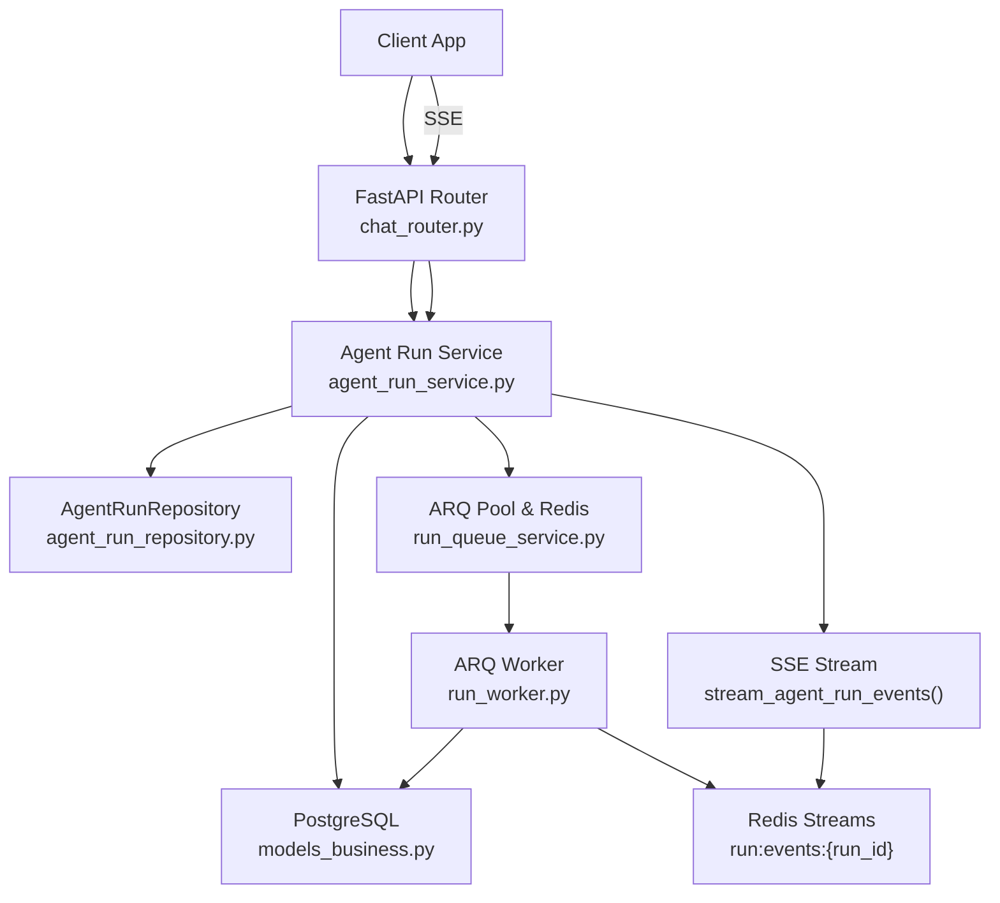
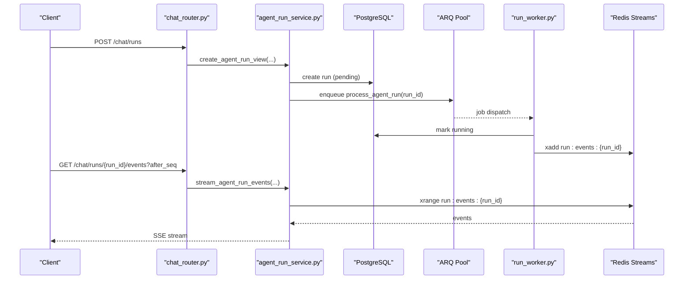
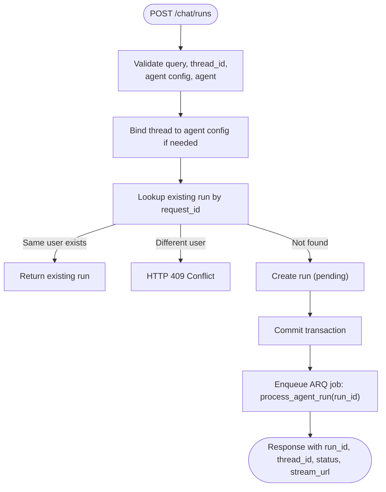
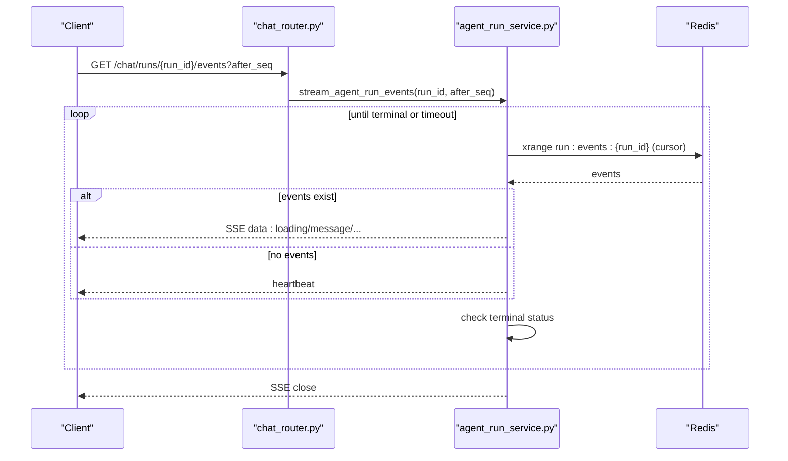
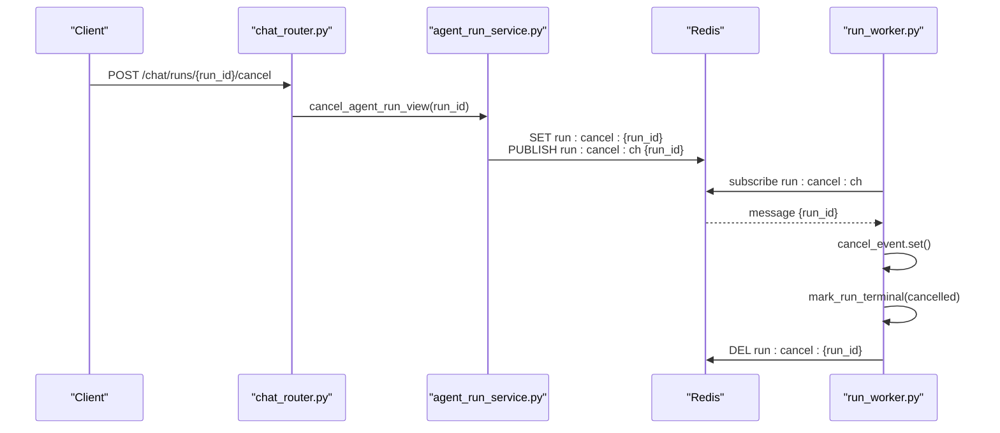
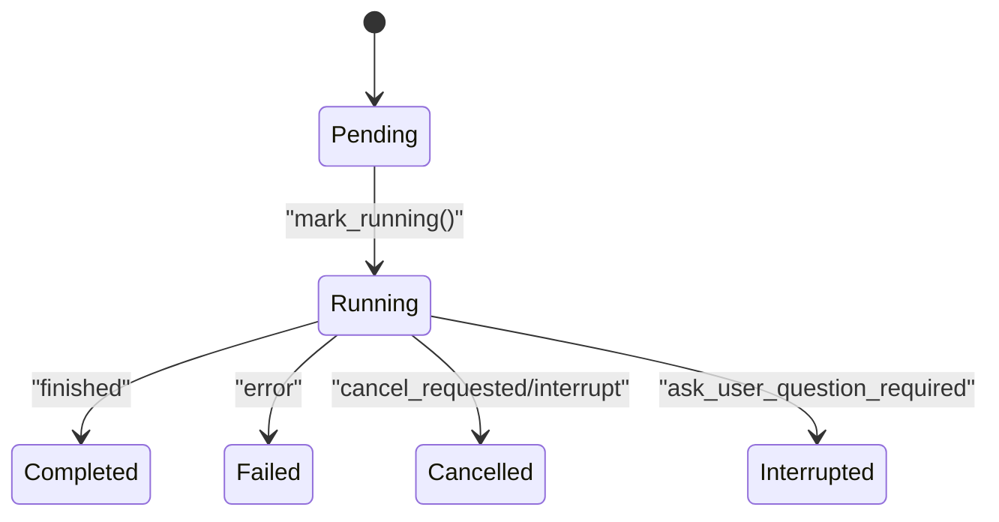
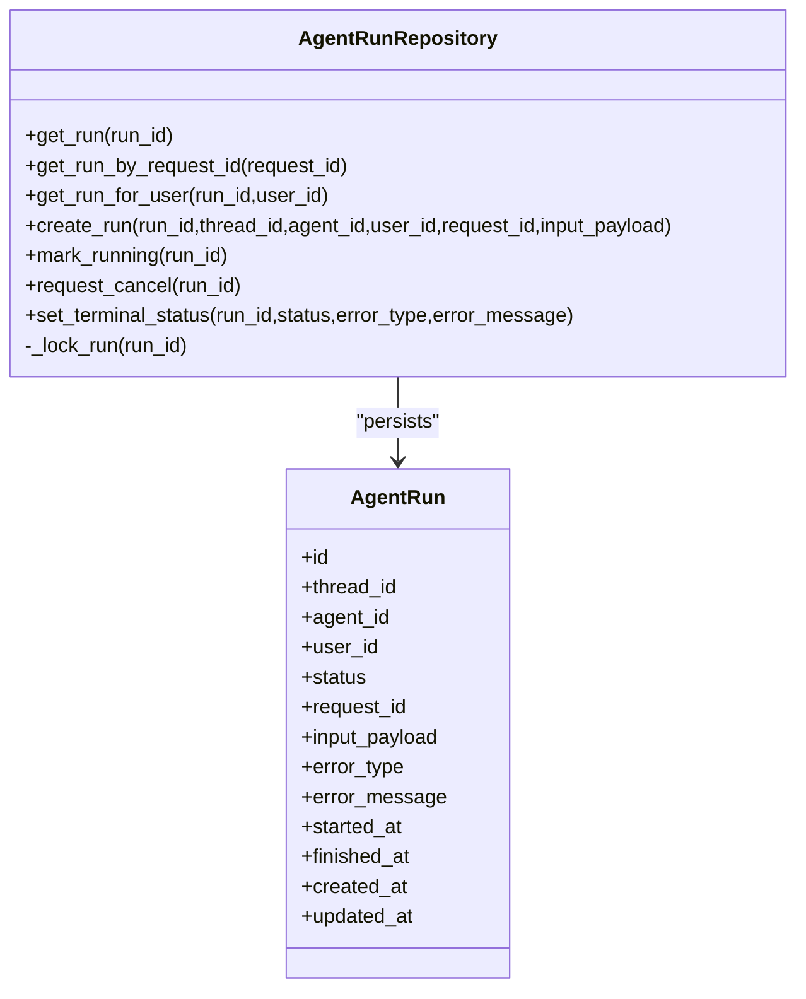
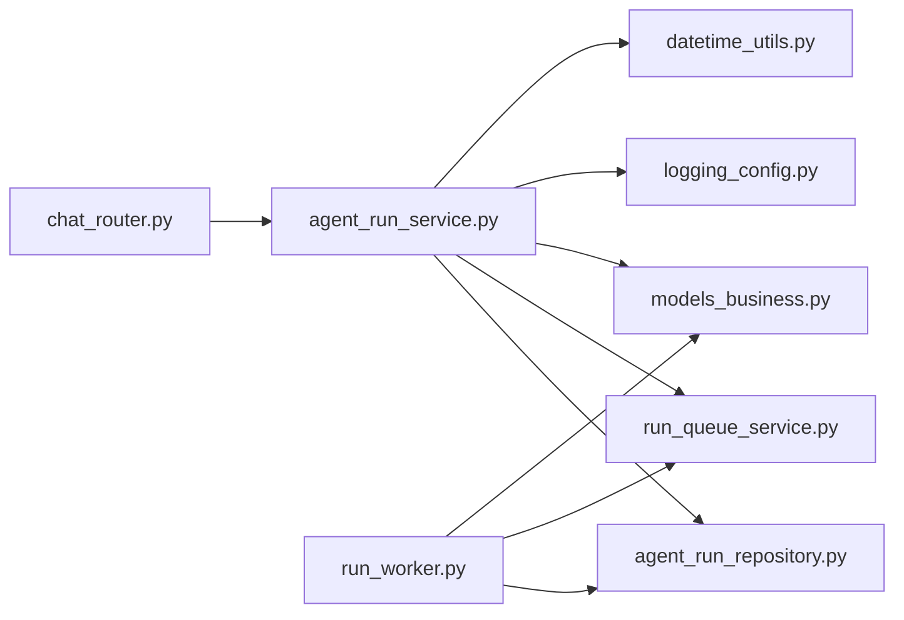

# Agent Run Service

<cite>
**Referenced Files in This Document**
- [agent_run_service.py](file://backend/package/yuxi/services/agent_run_service.py)
- [run_queue_service.py](file://backend/package/yuxi/services/run_queue_service.py)
- [run_worker.py](file://backend/package/yuxi/services/run_worker.py)
- [chat_router.py](file://backend/server/routers/chat_router.py)
- [agent_run_repository.py](file://backend/package/yuxi/repositories/agent_run_repository.py)
- [models_business.py](file://backend/package/yuxi/storage/postgres/models_business.py)
- [datetime_utils.py](file://backend/package/yuxi/utils/datetime_utils.py)
- [logging_config.py](file://backend/package/yuxi/utils/logging_config.py)
- [test_agent_run_service.py](file://backend/test/unit/services/test_agent_run_service.py)
- [test_run_worker.py](file://backend/test/unit/services/test_run_worker.py)
</cite>

## Table of Contents
1. [Introduction](#introduction)
2. [Project Structure](#project-structure)
3. [Core Components](#core-components)
4. [Architecture Overview](#architecture-overview)
5. [Detailed Component Analysis](#detailed-component-analysis)
6. [Dependency Analysis](#dependency-analysis)
7. [Performance Considerations](#performance-considerations)
8. [Troubleshooting Guide](#troubleshooting-guide)
9. [Conclusion](#conclusion)

## Introduction
This document describes the Agent Run Service responsible for managing intelligent agent execution workflows. It covers:
- Run creation with request validation, thread binding, and duplicate request handling
- Server-Sent Events (SSE) streaming with heartbeat and connection lifecycle
- Cancellation workflow, status tracking, and terminal state handling
- Integration with ARQ job queue, database transactions, and repository patterns
- Error handling strategies, connection timeouts, and performance considerations for long-running runs

## Project Structure
The Agent Run Service spans several modules:
- FastAPI router endpoints for run creation, cancellation, polling, and SSE streaming
- Service layer orchestrating validation, persistence, and queue integration
- Repository layer encapsulating database operations and transaction semantics
- ARQ worker processing runs asynchronously and publishing events to Redis streams
- Run queue utilities for Redis-backed event streams and cancellation signaling

**Diagram sources**
- [chat_router.py:399-456](file://backend/server/routers/chat_router.py#L399-L456)
- [agent_run_service.py:53-130](file://backend/package/yuxi/services/agent_run_service.py#L53-L130)
- [agent_run_repository.py:14-103](file://backend/package/yuxi/repositories/agent_run_repository.py#L14-L103)
- [models_business.py:665-706](file://backend/package/yuxi/storage/postgres/models_business.py#L665-L706)
- [run_queue_service.py:85-97](file://backend/package/yuxi/services/run_queue_service.py#L85-L97)
- [run_worker.py:189-362](file://backend/package/yuxi/services/run_worker.py#L189-L362)

**Section sources**
- [chat_router.py:399-456](file://backend/server/routers/chat_router.py#L399-L456)
- [agent_run_service.py:53-130](file://backend/package/yuxi/services/agent_run_service.py#L53-L130)
- [agent_run_repository.py:14-103](file://backend/package/yuxi/repositories/agent_run_repository.py#L14-L103)
- [models_business.py:665-706](file://backend/package/yuxi/storage/postgres/models_business.py#L665-L706)
- [run_queue_service.py:85-97](file://backend/package/yuxi/services/run_queue_service.py#L85-L97)
- [run_worker.py:189-362](file://backend/package/yuxi/services/run_worker.py#L189-L362)

## Core Components
- Agent Run Service: Validates requests, binds conversations to threads, prevents duplicate runs via request_id, persists runs, enqueues ARQ jobs, and streams events via SSE.
- Agent Run Repository: Encapsulates run CRUD, status transitions, and locking for safe concurrency.
- Run Queue Service: Manages Redis clients, ARQ pool, cancellation signals, and event streams.
- ARQ Worker: Executes runs, handles cancellation, publishes events, and marks terminal statuses.
- Router Endpoints: Expose run creation, cancellation, polling, and SSE endpoints.

**Section sources**
- [agent_run_service.py:53-130](file://backend/package/yuxi/services/agent_run_service.py#L53-L130)
- [agent_run_repository.py:14-103](file://backend/package/yuxi/repositories/agent_run_repository.py#L14-L103)
- [run_queue_service.py:114-224](file://backend/package/yuxi/services/run_queue_service.py#L114-L224)
- [run_worker.py:189-362](file://backend/package/yuxi/services/run_worker.py#L189-L362)
- [chat_router.py:399-456](file://backend/server/routers/chat_router.py#L399-L456)

## Architecture Overview
The system uses a hybrid synchronous request-response for run creation and asynchronous streaming for progress and results. The ARQ worker performs long-running tasks and emits events to Redis streams, which the SSE endpoint reads and forwards to clients.

**Diagram sources**
- [chat_router.py:399-456](file://backend/server/routers/chat_router.py#L399-L456)
- [agent_run_service.py:53-130](file://backend/package/yuxi/services/agent_run_service.py#L53-L130)
- [run_queue_service.py:165-183](file://backend/package/yuxi/services/run_queue_service.py#L165-L183)
- [run_worker.py:225-300](file://backend/package/yuxi/services/run_worker.py#L225-L300)

## Detailed Component Analysis

### Run Creation Workflow
- Validation: Ensures query and thread_id are present; verifies agent config and agent existence; binds thread to agent config if needed.
- Duplicate handling: Uses request_id uniqueness to avoid duplicate runs for the same user; returns existing run if conflict is detected for the same user, otherwise raises conflict for different users.
- Persistence: Creates a run with status pending and commits before enqueuing to guarantee visibility.
- Queue: Enqueues ARQ job with idempotent key run:{run_id}.

**Diagram sources**
- [agent_run_service.py:53-130](file://backend/package/yuxi/services/agent_run_service.py#L53-L130)
- [chat_router.py:399-414](file://backend/server/routers/chat_router.py#L399-L414)

**Section sources**
- [agent_run_service.py:53-130](file://backend/package/yuxi/services/agent_run_service.py#L53-L130)
- [test_agent_run_service.py:105-177](file://backend/test/unit/services/test_agent_run_service.py#L105-L177)

### SSE Event Streaming (Server-Sent Events)
- Endpoint: GET /chat/runs/{run_id}/events with optional after_seq cursor.
- Behavior:
  - Polls Redis stream run:events:{run_id} for new events.
  - Emits events with event type and data payload; heartbeat events periodically.
  - Closes stream on terminal status or connection timeout.
  - Handles DB and Redis errors by emitting error events and closing.
- Cursor normalization: Accepts "0", "0-0", empty, or invalid sequences and normalizes to "0-0".

**Diagram sources**
- [chat_router.py:437-456](file://backend/server/routers/chat_router.py#L437-L456)
- [agent_run_service.py:152-242](file://backend/package/yuxi/services/agent_run_service.py#L152-L242)
- [run_queue_service.py:185-224](file://backend/package/yuxi/services/run_queue_service.py#L185-L224)

**Section sources**
- [agent_run_service.py:152-242](file://backend/package/yuxi/services/agent_run_service.py#L152-L242)
- [run_queue_service.py:44-58](file://backend/package/yuxi/services/run_queue_service.py#L44-L58)
- [test_agent_run_service.py:21-102](file://backend/test/unit/services/test_agent_run_service.py#L21-L102)

### Cancellation Workflow
- Request: POST /chat/runs/{run_id}/cancel updates run status to cancel_requested and publishes a Redis cancel signal.
- Worker detection: Worker polls Redis channel and sets a cancellation event; the consumer loop aborts on cancellation.
- Cleanup: Worker clears cancel signal and marks run as cancelled upon interruption.

**Diagram sources**
- [chat_router.py:427-434](file://backend/server/routers/chat_router.py#L427-L434)
- [agent_run_service.py:141-149](file://backend/package/yuxi/services/agent_run_service.py#L141-L149)
- [run_queue_service.py:114-131](file://backend/package/yuxi/services/run_queue_service.py#L114-L131)
- [run_worker.py:301-310](file://backend/package/yuxi/services/run_worker.py#L301-L310)

**Section sources**
- [agent_run_service.py:141-149](file://backend/package/yuxi/services/agent_run_service.py#L141-L149)
- [run_queue_service.py:114-131](file://backend/package/yuxi/services/run_queue_service.py#L114-L131)
- [run_worker.py:301-310](file://backend/package/yuxi/services/run_worker.py#L301-L310)
- [test_run_worker.py:86-113](file://backend/test/unit/services/test_run_worker.py#L86-L113)

### Status Tracking and Terminal States
- Status transitions:
  - Pending → Running (worker marks running)
  - Running → Completed/Failed/Cancelled/Interrupted
- Terminal statuses: completed, failed, cancelled, interrupted.
- Worker sets terminal status and appends error or completion events.

**Diagram sources**
- [agent_run_repository.py](file://backend/package/yuxi/repositories/agent_run_repository.py#L11)
- [run_worker.py:257-291](file://backend/package/yuxi/services/run_worker.py#L257-L291)

**Section sources**
- [agent_run_repository.py](file://backend/package/yuxi/repositories/agent_run_repository.py#L11)
- [run_worker.py:257-291](file://backend/package/yuxi/services/run_worker.py#L257-L291)

### Database Transactions and Repository Pattern
- Repository methods operate within SQLAlchemy async sessions.
- Locking: SELECT ... WITH FOR UPDATE ensures atomic status transitions.
- Idempotency: request_id uniqueness enforced at DB level; service handles IntegrityError and dedup logic.

**Diagram sources**
- [agent_run_repository.py:14-103](file://backend/package/yuxi/repositories/agent_run_repository.py#L14-L103)
- [models_business.py:665-706](file://backend/package/yuxi/storage/postgres/models_business.py#L665-L706)

**Section sources**
- [agent_run_repository.py:14-103](file://backend/package/yuxi/repositories/agent_run_repository.py#L14-L103)
- [models_business.py:665-706](file://backend/package/yuxi/storage/postgres/models_business.py#L665-L706)
- [test_agent_run_service.py:180-255](file://backend/test/unit/services/test_agent_run_service.py#L180-L255)

### Integration with ARQ Job Queue and Redis Streams
- ARQ pool: Created once globally; used to enqueue jobs.
- Redis streams: run:events:{run_id} stores structured events with sequence ids; TTL controls retention.
- Cancellation: Dedicated key and channel for signaling; worker watches channel and local key.

**Section sources**
- [run_queue_service.py:85-97](file://backend/package/yuxi/services/run_queue_service.py#L85-L97)
- [run_queue_service.py:165-183](file://backend/package/yuxi/services/run_queue_service.py#L165-L183)
- [run_queue_service.py:114-131](file://backend/package/yuxi/services/run_queue_service.py#L114-L131)
- [run_worker.py:189-362](file://backend/package/yuxi/services/run_worker.py#L189-L362)

### Examples

- Run creation
  - Endpoint: POST /chat/runs
  - Request body includes query, agent_config_id, thread_id, optional meta/request_id, optional image_content
  - Response includes run_id, thread_id, status, and stream_url for SSE

  **Section sources**
  - [chat_router.py:399-414](file://backend/server/routers/chat_router.py#L399-L414)
  - [agent_run_service.py:53-130](file://backend/package/yuxi/services/agent_run_service.py#L53-L130)

- SSE event streaming
  - Endpoint: GET /chat/runs/{run_id}/events?after_seq
  - Emits events with event types (e.g., loading, message) and payloads; includes heartbeat and close events

  **Section sources**
  - [chat_router.py:437-456](file://backend/server/routers/chat_router.py#L437-L456)
  - [agent_run_service.py:152-242](file://backend/package/yuxi/services/agent_run_service.py#L152-L242)

- Cancellation
  - Endpoint: POST /chat/runs/{run_id}/cancel
  - Publishes cancel signal; worker detects and terminates run

  **Section sources**
  - [chat_router.py:427-434](file://backend/server/routers/chat_router.py#L427-L434)
  - [agent_run_service.py:141-149](file://backend/package/yuxi/services/agent_run_service.py#L141-L149)
  - [run_worker.py:301-310](file://backend/package/yuxi/services/run_worker.py#L301-L310)

## Dependency Analysis
- Router depends on service layer for run operations.
- Service depends on repositories for persistence and run_queue_service for Redis/ARQ.
- Worker depends on repositories and run_queue_service for event publishing and cancellation.
- Logging and datetime utilities support consistent timestamps and logging.

**Diagram sources**
- [chat_router.py:18-25](file://backend/server/routers/chat_router.py#L18-L25)
- [agent_run_service.py:11-27](file://backend/package/yuxi/services/agent_run_service.py#L11-L27)
- [run_worker.py:11-24](file://backend/package/yuxi/services/run_worker.py#L11-L24)
- [logging_config.py:92-98](file://backend/package/yuxi/utils/logging_config.py#L92-L98)
- [datetime_utils.py:20-28](file://backend/package/yuxi/utils/datetime_utils.py#L20-L28)

**Section sources**
- [chat_router.py:18-25](file://backend/server/routers/chat_router.py#L18-L25)
- [agent_run_service.py:11-27](file://backend/package/yuxi/services/agent_run_service.py#L11-L27)
- [run_worker.py:11-24](file://backend/package/yuxi/services/run_worker.py#L11-L24)
- [logging_config.py:92-98](file://backend/package/yuxi/utils/logging_config.py#L92-L98)
- [datetime_utils.py:20-28](file://backend/package/yuxi/utils/datetime_utils.py#L20-L28)

## Performance Considerations
- SSE polling interval and heartbeat intervals are configurable via environment variables to balance responsiveness and resource usage.
- Redis stream TTL and maxlen help manage memory footprint for long-running runs.
- Chunked event writer buffers small incremental updates to reduce Redis write overhead.
- ARQ job timeout and retry settings prevent runaway workers and improve resilience.

[No sources needed since this section provides general guidance]

## Troubleshooting Guide
- SSE temporarily unavailable:
  - Service emits error events with reason "db_error" or "redis_error" and closes the stream; clients should reconnect.
- Long-lived connections:
  - Max connection minutes and heartbeat events ensure clients detect stale connections and reconnect.
- Duplicate run creation:
  - IntegrityError fallback returns existing run for same user; for different users, returns HTTP 409.
- Worker failures:
  - Retryable errors trigger ARQ retries; non-retryable errors mark run as failed immediately.
- Cancellation not taking effect:
  - Verify Redis cancel key/channel presence and that worker is subscribed; ensure request_cancel was invoked.

**Section sources**
- [agent_run_service.py:175-186](file://backend/package/yuxi/services/agent_run_service.py#L175-L186)
- [run_queue_service.py:114-131](file://backend/package/yuxi/services/run_queue_service.py#L114-L131)
- [test_agent_run_service.py:21-49](file://backend/test/unit/services/test_agent_run_service.py#L21-L49)
- [test_agent_run_service.py:180-255](file://backend/test/unit/services/test_agent_run_service.py#L180-L255)
- [test_run_worker.py:115-154](file://backend/test/unit/services/test_run_worker.py#L115-L154)

## Conclusion
The Agent Run Service provides a robust, asynchronous execution pipeline with strong guarantees around idempotency, cancellation, and event streaming. Its modular design integrates cleanly with PostgreSQL, Redis, and ARQ, enabling scalable long-running agent workflows with clear status tracking and resilient error handling.