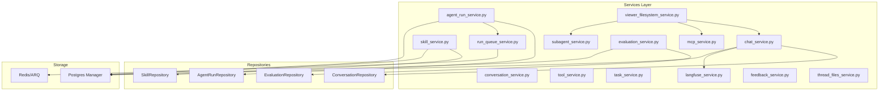
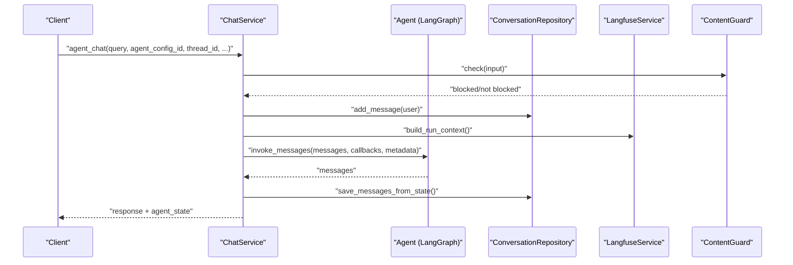
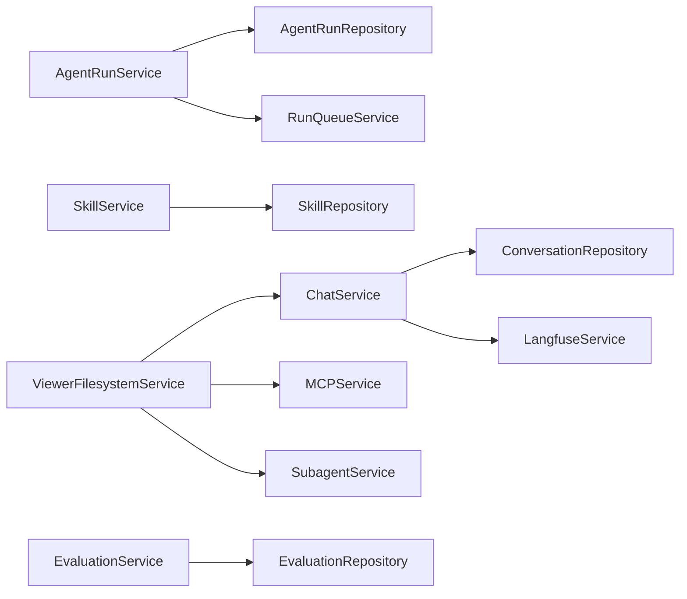

# Business Logic Services

<cite>
**Referenced Files in This Document**
- [chat_service.py](file://backend/package/yuxi/services/chat_service.py)
- [conversation_service.py](file://backend/package/yuxi/services/conversation_service.py)
- [agent_run_service.py](file://backend/package/yuxi/services/agent_run_service.py)
- [skill_service.py](file://backend/package/yuxi/services/skill_service.py)
- [tool_service.py](file://backend/package/yuxi/services/tool_service.py)
- [task_service.py](file://backend/package/yuxi/services/task_service.py)
- [subagent_service.py](file://backend/package/yuxi/services/subagent_service.py)
- [mcp_service.py](file://backend/package/yuxi/services/mcp_service.py)
- [run_queue_service.py](file://backend/package/yuxi/services/run_queue_service.py)
- [langfuse_service.py](file://backend/package/yuxi/services/langfuse_service.py)
- [evaluation_service.py](file://backend/package/yuxi/services/evaluation_service.py)
- [feedback_service.py](file://backend/package/yuxi/services/feedback_service.py)
- [thread_files_service.py](file://backend/package/yuxi/services/thread_files_service.py)
- [viewer_filesystem_service.py](file://backend/package/yuxi/services/viewer_filesystem_service.py)
</cite>

## Table of Contents
1. [Introduction](#introduction)
2. [Project Structure](#project-structure)
3. [Core Components](#core-components)
4. [Architecture Overview](#architecture-overview)
5. [Detailed Component Analysis](#detailed-component-analysis)
6. [Dependency Analysis](#dependency-analysis)
7. [Performance Considerations](#performance-considerations)
8. [Troubleshooting Guide](#troubleshooting-guide)
9. [Conclusion](#conclusion)
10. [Appendices](#appendices)

## Introduction
This document describes the business logic services layer of Yuxi’s backend. It focuses on orchestration patterns, dependency injection mechanisms, and service composition strategies across the chat, conversation, agent runs, skills, tools, MCP integration, task coordination, evaluation, feedback, and filesystem services. It explains service interfaces, method signatures, parameter validation, return value structures, error handling, transaction management, asynchronous operation patterns, lifecycle and resource management, and performance optimization techniques. Examples and integration patterns are included to guide developers extending or integrating with the services.

## Project Structure
The services are organized under backend/package/yuxi/services and coordinate with repositories, agents, storage, and middlewares. They expose synchronous and asynchronous APIs for chat, runs, skills, tasks, and filesystem operations, and integrate with external systems such as Redis/ARQ for streaming events and Langfuse for observability.

**Diagram sources**
- [chat_service.py](file://backend/package/yuxi/services/chat_service.py)
- [conversation_service.py](file://backend/package/yuxi/services/conversation_service.py)
- [agent_run_service.py](file://backend/package/yuxi/services/agent_run_service.py)
- [skill_service.py](file://backend/package/yuxi/services/skill_service.py)
- [evaluation_service.py](file://backend/package/yuxi/services/evaluation_service.py)
- [run_queue_service.py](file://backend/package/yuxi/services/run_queue_service.py)
- [langfuse_service.py](file://backend/package/yuxi/services/langfuse_service.py)
- [viewer_filesystem_service.py](file://backend/package/yuxi/services/viewer_filesystem_service.py)

**Section sources**
- [chat_service.py](file://backend/package/yuxi/services/chat_service.py)
- [conversation_service.py](file://backend/package/yuxi/services/conversation_service.py)
- [agent_run_service.py](file://backend/package/yuxi/services/agent_run_service.py)
- [skill_service.py](file://backend/package/yuxi/services/skill_service.py)
- [evaluation_service.py](file://backend/package/yuxi/services/evaluation_service.py)
- [run_queue_service.py](file://backend/package/yuxi/services/run_queue_service.py)
- [langfuse_service.py](file://backend/package/yuxi/services/langfuse_service.py)
- [viewer_filesystem_service.py](file://backend/package/yuxi/services/viewer_filesystem_service.py)

## Core Components
- Chat orchestration: Synchronous and streaming chat with LangGraph, content guard, Langfuse tracing, and state persistence.
- Conversation management: Thread lifecycle, attachments, markdown conversion, artifact URLs, and history retrieval.
- Agent run orchestration: Request creation, cancellation, and SSE-based event streaming via Redis/ARQ.
- Skills management: Import/export, dependency validation, tree browsing, and thread-scoped visibility.
- Tools discovery: Lazy-loading tool metadata with categories and tags.
- Task coordination: In-memory tasker with persistence, progress tracking, cancellation, and result aggregation.
- Subagents: Built-in and custom subagent definitions with tool resolution and caching.
- MCP integration: Unified server configuration CRUD, tool fetching, filtering, and stats.
- Evaluation: Benchmark generation and RAG evaluation with metrics calculation and progress updates.
- Feedback: Message feedback submission and retrieval.
- Filesystem services: Thread file listing, content reading, artifact resolution, and viewer filesystem tree/content.

**Section sources**
- [chat_service.py](file://backend/package/yuxi/services/chat_service.py)
- [conversation_service.py](file://backend/package/yuxi/services/conversation_service.py)
- [agent_run_service.py](file://backend/package/yuxi/services/agent_run_service.py)
- [skill_service.py](file://backend/package/yuxi/services/skill_service.py)
- [tool_service.py](file://backend/package/yuxi/services/tool_service.py)
- [task_service.py](file://backend/package/yuxi/services/task_service.py)
- [subagent_service.py](file://backend/package/yuxi/services/subagent_service.py)
- [mcp_service.py](file://backend/package/yuxi/services/mcp_service.py)
- [evaluation_service.py](file://backend/package/yuxi/services/evaluation_service.py)
- [feedback_service.py](file://backend/package/yuxi/services/feedback_service.py)
- [thread_files_service.py](file://backend/package/yuxi/services/thread_files_service.py)
- [viewer_filesystem_service.py](file://backend/package/yuxi/services/viewer_filesystem_service.py)

## Architecture Overview
Yuxi’s services layer follows a layered architecture:
- Orchestration services coordinate long-running workflows (chat, runs, evaluations).
- Repositories encapsulate persistence and transactions.
- Storage managers provide database connections and Redis clients.
- Middleware and agent backends supply runtime context (LangGraph, skills, MCP).
- Observability integrates via Langfuse tracing.

**Diagram sources**
- [chat_service.py](file://backend/package/yuxi/services/chat_service.py)
- [langfuse_service.py](file://backend/package/yuxi/services/langfuse_service.py)

**Section sources**
- [chat_service.py](file://backend/package/yuxi/services/chat_service.py)
- [langfuse_service.py](file://backend/package/yuxi/services/langfuse_service.py)

## Detailed Component Analysis

### Chat Orchestration Service
Responsibilities:
- Validate user and department context.
- Resolve agent configuration and bind to thread.
- Stream or return full chat responses.
- Persist messages, tool calls, and partial messages on interrupts.
- Integrate Langfuse tracing and content guard checks.

Key methods and behaviors:
- Synchronous chat: [agent_chat](file://backend/package/yuxi/services/chat_service.py)
- Streaming chat: [stream_agent_chat](file://backend/package/yuxi/services/chat_service.py)
- Interrupt detection and payload building: [check_and_handle_interrupts](file://backend/package/yuxi/services/chat_service.py)
- Message persistence helpers: [save_messages_from_langgraph_state](file://backend/package/yuxi/services/chat_service.py), [save_partial_message](file://backend/package/yuxi/services/chat_service.py)
- Attachment-to-state conversion: [_build_state_files](file://backend/package/yuxi/services/chat_service.py)

Validation and error handling:
- Validates request_id, agent existence, department binding, and content guard.
- Returns structured error responses with error_type and error_message.

Asynchronous patterns:
- Uses async generators for streaming and async I/O for repository operations.

Observability:
- Builds Langfuse run context and flushes traces.

**Section sources**
- [chat_service.py](file://backend/package/yuxi/services/chat_service.py)

### Conversation Management Service
Responsibilities:
- Thread lifecycle: create/list/delete/update threads.
- Attachment handling: upload, parse to markdown, materialize files, and sync to agent state.
- History retrieval with feedback and tool call metadata.
- Artifact URL generation and virtual path mapping.

Key methods and behaviors:
- Thread views: [create_thread_view](file://backend/package/yuxi/services/conversation_service.py), [list_threads_view](file://backend/package/yuxi/services/conversation_service.py), [delete_thread_view](file://backend/package/yuxi/services/conversation_service.py), [update_thread_view](file://backend/package/yuxi/services/conversation_service.py)
- Attachment operations: [upload_thread_attachment_view](file://backend/package/yuxi/services/conversation_service.py), [list_thread_attachments_view](file://backend/package/yuxi/services/conversation_service.py), [delete_thread_attachment_view](file://backend/package/yuxi/services/conversation_service.py)
- History retrieval: [get_thread_history_view](file://backend/package/yuxi/services/conversation_service.py)
- Attachment materialization and markdown conversion: [_materialize_attachment_files](file://backend/package/yuxi/services/conversation_service.py), [_convert_upload_to_markdown](file://backend/package/yuxi/services/conversation_service.py)

Validation and error handling:
- Enforces allowed extensions, size limits, and user ownership.
- Raises HTTP exceptions for invalid inputs and missing resources.

**Section sources**
- [conversation_service.py](file://backend/package/yuxi/services/conversation_service.py)

### Agent Run Orchestration Service
Responsibilities:
- Create runs with deduplication by request_id.
- Enqueue jobs via ARQ and publish cancel signals via Redis.
- Poll run events via SSE with heartbeat and termination detection.
- Cancel runs and propagate cancellation to workers.

Key methods and behaviors:
- Run creation: [create_agent_run_view](file://backend/package/yuxi/services/agent_run_service.py)
- Run retrieval and cancellation: [get_agent_run_view](file://backend/package/yuxi/services/agent_run_service.py), [cancel_agent_run_view](file://backend/package/yuxi/services/agent_run_service.py)
- Event streaming: [stream_agent_run_events](file://backend/package/yuxi/services/agent_run_service.py)
- Active run lookup: [get_active_run_by_thread](file://backend/package/yuxi/services/agent_run_service.py)

Queue and Redis helpers:
- Redis/ARQ clients and event publishing: [run_queue_service.py](file://backend/package/yuxi/services/run_queue_service.py)

**Section sources**
- [agent_run_service.py](file://backend/package/yuxi/services/agent_run_service.py)
- [run_queue_service.py](file://backend/package/yuxi/services/run_queue_service.py)

### Skills Management Service
Responsibilities:
- Import skills from ZIP or directory, validate metadata, and manage dependencies.
- Sync thread-visible skills via symlinked directories.
- Browse skill tree, read/write files, and export as ZIP.
- Validate slugs and paths, compute hashes, and enforce text-only file types.

Key methods and behaviors:
- Import/export: [import_skill_zip](file://backend/package/yuxi/services/skill_service.py), [import_skill_dir](file://backend/package/yuxi/services/skill_service.py), [export_skill_zip](file://backend/package/yuxi/services/skill_service.py)
- Tree and file operations: [get_skill_tree](file://backend/package/yuxi/services/skill_service.py), [read_skill_file](file://backend/package/yuxi/services/skill_service.py), [create_skill_node](file://backend/package/yuxi/services/skill_service.py), [update_skill_file](file://backend/package/yuxi/services/skill_service.py), [delete_skill_node](file://backend/package/yuxi/services/skill_service.py)
- Dependencies: [update_skill_dependencies](file://backend/package/yuxi/services/skill_service.py), [get_skill_dependency_options](file://backend/package/yuxi/services/skill_service.py)
- Thread visibility: [sync_thread_visible_skills](file://backend/package/yuxi/services/skill_service.py)

Validation and error handling:
- Slug validation, path traversal checks, and file type restrictions.

**Section sources**
- [skill_service.py](file://backend/package/yuxi/services/skill_service.py)

### Tools Discovery Service
Responsibilities:
- Lazy-load tool metadata from toolkits and merge with extra metadata.
- Provide categorized tool lists for UI and agent configuration.

Key methods and behaviors:
- Metadata loading and caching: [get_tool_metadata](file://backend/package/yuxi/services/tool_service.py)

**Section sources**
- [tool_service.py](file://backend/package/yuxi/services/tool_service.py)

### Task Coordination Service
Responsibilities:
- In-memory tasker with persistent storage for task lifecycle.
- Progress tracking, cancellation, and result aggregation.
- Worker loop with concurrency control and graceful shutdown.

Key classes and behaviors:
- Tasker: [Tasker](file://backend/package/yuxi/services/task_service.py), [enqueue](file://backend/package/yuxi/services/task_service.py), [list_tasks](file://backend/package/yuxi/services/task_service.py), [get_task](file://backend/package/yuxi/services/task_service.py), [cancel_task](file://backend/package/yuxi/services/task_service.py), [delete_task](file://backend/package/yuxi/services/task_service.py)
- Task context: [TaskContext](file://backend/package/yuxi/services/task_service.py)
- Persistence and counters: [TaskRepository](file://backend/package/yuxi/services/task_service.py)

**Section sources**
- [task_service.py](file://backend/package/yuxi/services/task_service.py)

### Subagents Service
Responsibilities:
- Initialize and maintain built-in subagents.
- Retrieve and resolve subagent specs with tools.
- CRUD operations for custom subagents.

Key methods and behaviors:
- Initialization and cache: [init_builtin_subagents](file://backend/package/yuxi/services/subagent_service.py), [clear_specs_cache](file://backend/package/yuxi/services/subagent_service.py)
- Specs retrieval and resolution: [get_subagent_specs](file://backend/package/yuxi/services/subagent_service.py), [get_subagents_from_names](file://backend/package/yuxi/services/subagent_service.py)
- CRUD: [get_all_subagents](file://backend/package/yuxi/services/subagent_service.py), [get_subagent](file://backend/package/yuxi/services/subagent_service.py), [create_subagent](file://backend/package/yuxi/services/subagent_service.py), [update_subagent](file://backend/package/yuxi/services/subagent_service.py), [delete_subagent](file://backend/package/yuxi/services/subagent_service.py), [set_subagent_enabled](file://backend/package/yuxi/services/subagent_service.py)

**Section sources**
- [subagent_service.py](file://backend/package/yuxi/services/subagent_service.py)

### MCP Integration Service
Responsibilities:
- Manage MCP server configurations (CRUD, enable/disable).
- Fetch and cache MCP tools with filtering and stats.
- Provide unified entry points for agent tool retrieval.

Key methods and behaviors:
- Server management: [get_mcp_server](file://backend/package/yuxi/services/mcp_service.py), [get_all_mcp_servers](file://backend/package/yuxi/services/mcp_service.py), [create_mcp_server](file://backend/package/yuxi/services/mcp_service.py), [update_mcp_server](file://backend/package/yuxi/services/mcp_service.py), [delete_mcp_server](file://backend/package/yuxi/services/mcp_service.py), [set_server_enabled](file://backend/package/yuxi/services/mcp_service.py)
- Tool management: [get_mcp_tools](file://backend/package/yuxi/services/mcp_service.py), [get_enabled_mcp_tools](file://backend/package/yuxi/services/mcp_service.py), [toggle_tool_enabled](file://backend/package/yuxi/services/mcp_service.py), [get_all_mcp_tools](file://backend/package/yuxi/services/mcp_service.py)
- Cache and state: [load_mcp_servers_from_db](file://backend/package/yuxi/services/mcp_service.py), [init_mcp_servers](file://backend/package/yuxi/services/mcp_service.py), [clear_mcp_cache](file://backend/package/yuxi/services/mcp_service.py)

**Section sources**
- [mcp_service.py](file://backend/package/yuxi/services/mcp_service.py)

### Evaluation Service
Responsibilities:
- Benchmark generation and upload.
- RAG evaluation with retrieval and answer metrics.
- Task-based orchestration with progress and cancellation support.

Key methods and behaviors:
- Benchmark: [upload_benchmark](file://backend/package/yuxi/services/evaluation_service.py), [get_benchmarks](file://backend/package/yuxi/services/evaluation_service.py), [get_benchmark_detail](file://backend/package/yuxi/services/evaluation_service.py), [get_benchmark_detail_by_db](file://backend/package/yuxi/services/evaluation_service.py), [get_benchmark_download_info](file://backend/package/yuxi/services/evaluation_service.py), [delete_benchmark](file://backend/package/yuxi/services/evaluation_service.py)
- Evaluation: [run_evaluation](file://backend/package/yuxi/services/evaluation_service.py), [_run_evaluation_task](file://backend/package/yuxi/services/evaluation_service.py)
- Generation: [generate_benchmark](file://backend/package/yuxi/services/evaluation_service.py), [_generate_benchmark_task](file://backend/package/yuxi/services/evaluation_service.py)
- Results: [get_evaluation_results](file://backend/package/yuxi/services/evaluation_service.py), [get_evaluation_history](file://backend/package/yuxi/services/evaluation_service.py), [get_evaluation_results_by_db](file://backend/package/yuxi/services/evaluation_service.py)

**Section sources**
- [evaluation_service.py](file://backend/package/yuxi/services/evaluation_service.py)

### Feedback Service
Responsibilities:
- Submit and retrieve message feedback with uniqueness constraints.

Key methods and behaviors:
- Submission: [submit_message_feedback_view](file://backend/package/yuxi/services/feedback_service.py)
- Retrieval: [get_message_feedback_view](file://backend/package/yuxi/services/feedback_service.py)

**Section sources**
- [feedback_service.py](file://backend/package/yuxi/services/feedback_service.py)

### Thread Files Service
Responsibilities:
- List thread files, read content with pagination, resolve artifacts, and save artifacts to workspace.

Key methods and behaviors:
- Listing: [list_thread_files_view](file://backend/package/yuxi/services/thread_files_service.py)
- Content reading: [read_thread_file_content_view](file://backend/package/yuxi/services/thread_files_service.py)
- Artifact resolution: [resolve_thread_artifact_view](file://backend/package/yuxi/services/thread_files_service.py)
- Save to workspace: [save_thread_artifact_to_workspace_view](file://backend/package/yuxi/services/thread_files_service.py)

**Section sources**
- [thread_files_service.py](file://backend/package/yuxi/services/thread_files_service.py)

### Viewer Filesystem Service
Responsibilities:
- Provide a unified tree and content access for user-data, skills, and knowledge bases.
- Detect preview types and handle downloads/streaming.
- Enforce path safety and protected directories.

Key methods and behaviors:
- Tree listing: [list_viewer_filesystem_tree](file://backend/package/yuxi/services/viewer_filesystem_service.py)
- Content reading: [read_viewer_file_content](file://backend/package/yuxi/services/viewer_filesystem_service.py)
- Downloads: [download_viewer_file](file://backend/package/yuxi/services/viewer_filesystem_service.py)
- Deletion: [delete_viewer_file](file://backend/package/yuxi/services/viewer_filesystem_service.py)

**Section sources**
- [viewer_filesystem_service.py](file://backend/package/yuxi/services/viewer_filesystem_service.py)

## Dependency Analysis
- Repositories: ConversationRepository, AgentRunRepository, SkillRepository, EvaluationRepository encapsulate persistence and are injected into services via SQLAlchemy sessions.
- Storage: Postgres manager for DB sessions and Redis/ARQ for run queues and event streams.
- Agent backends: LangGraph, sandbox, skills, and knowledge base backends provide runtime context.
- Observability: Langfuse client and handlers for tracing.

**Diagram sources**
- [chat_service.py](file://backend/package/yuxi/services/chat_service.py)
- [agent_run_service.py](file://backend/package/yuxi/services/agent_run_service.py)
- [skill_service.py](file://backend/package/yuxi/services/skill_service.py)
- [evaluation_service.py](file://backend/package/yuxi/services/evaluation_service.py)
- [viewer_filesystem_service.py](file://backend/package/yuxi/services/viewer_filesystem_service.py)

**Section sources**
- [chat_service.py](file://backend/package/yuxi/services/chat_service.py)
- [agent_run_service.py](file://backend/package/yuxi/services/agent_run_service.py)
- [skill_service.py](file://backend/package/yuxi/services/skill_service.py)
- [evaluation_service.py](file://backend/package/yuxi/services/evaluation_service.py)
- [viewer_filesystem_service.py](file://backend/package/yuxi/services/viewer_filesystem_service.py)

## Performance Considerations
- Asynchronous I/O: Services extensively use async I/O for repository operations, Redis/ARQ, and LangGraph invocations.
- Caching: Tool metadata, MCP tools cache, and subagent specs cache reduce repeated lookups.
- Batch operations: Embeddings and evaluation metrics are computed in batches where applicable.
- Streaming: SSE-based run events and chat streaming minimize memory overhead.
- Resource cleanup: Langfuse flushing and Redis/ARQ client lifecycle management prevent leaks.

[No sources needed since this section provides general guidance]

## Troubleshooting Guide
Common issues and resolutions:
- Content guard blocks: Chat services return error_type content_guard_blocked; adjust guard configuration or input.
- Invalid agent configuration: Ensure agent_config_id belongs to the user’s department and matches agent_id.
- Missing request_id: Services auto-generate request_id; ensure client passes a valid request_id for idempotency.
- Redis connectivity: Run queue service validates Redis connectivity and raises explicit errors; check REDIS_URL and network.
- MCP tool fetching failures: Verify server configs and network; tools cache is cleared on config changes.
- Evaluation timeouts: Long-running tasks can be cancelled; monitor Tasker progress and logs.

**Section sources**
- [chat_service.py](file://backend/package/yuxi/services/chat_service.py)
- [run_queue_service.py](file://backend/package/yuxi/services/run_queue_service.py)
- [mcp_service.py](file://backend/package/yuxi/services/mcp_service.py)
- [task_service.py](file://backend/package/yuxi/services/task_service.py)

## Conclusion
Yuxi’s business logic services layer orchestrates complex workflows with clear separation of concerns. Services leverage async patterns, robust validation, and observability to deliver reliable chat, run orchestration, skills management, MCP integration, evaluation, and filesystem operations. The design supports extension and customization through repositories, middleware, and pluggable backends.

[No sources needed since this section summarizes without analyzing specific files]

## Appendices

### Service Interfaces and Method Signatures (Selected)
- Chat
  - [agent_chat](file://backend/package/yuxi/services/chat_service.py)
  - [stream_agent_chat](file://backend/package/yuxi/services/chat_service.py)
- Conversation
  - [upload_thread_attachment_view](file://backend/package/yuxi/services/conversation_service.py)
  - [get_thread_history_view](file://backend/package/yuxi/services/conversation_service.py)
- Agent Run
  - [create_agent_run_view](file://backend/package/yuxi/services/agent_run_service.py)
  - [stream_agent_run_events](file://backend/package/yuxi/services/agent_run_service.py)
- Skills
  - [import_skill_zip](file://backend/package/yuxi/services/skill_service.py)
  - [get_skill_tree](file://backend/package/yuxi/services/skill_service.py)
- Tools
  - [get_tool_metadata](file://backend/package/yuxi/services/tool_service.py)
- Tasker
  - [Tasker.enqueue](file://backend/package/yuxi/services/task_service.py)
- Subagents
  - [get_subagents_from_names](file://backend/package/yuxi/services/subagent_service.py)
- MCP
  - [get_enabled_mcp_tools](file://backend/package/yuxi/services/mcp_service.py)
- Evaluation
  - [run_evaluation](file://backend/package/yuxi/services/evaluation_service.py)
- Feedback
  - [submit_message_feedback_view](file://backend/package/yuxi/services/feedback_service.py)
- Thread Files
  - [list_thread_files_view](file://backend/package/yuxi/services/thread_files_service.py)
- Viewer Filesystem
  - [list_viewer_filesystem_tree](file://backend/package/yuxi/services/viewer_filesystem_service.py)

[No sources needed since this section aggregates references already cited above]