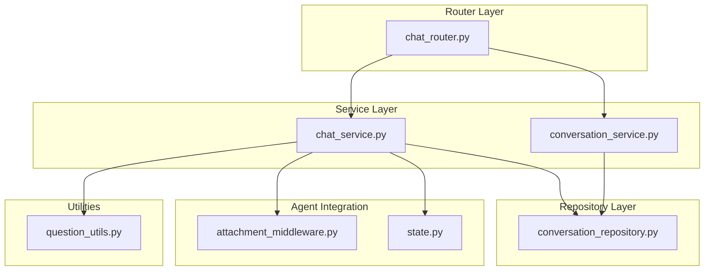
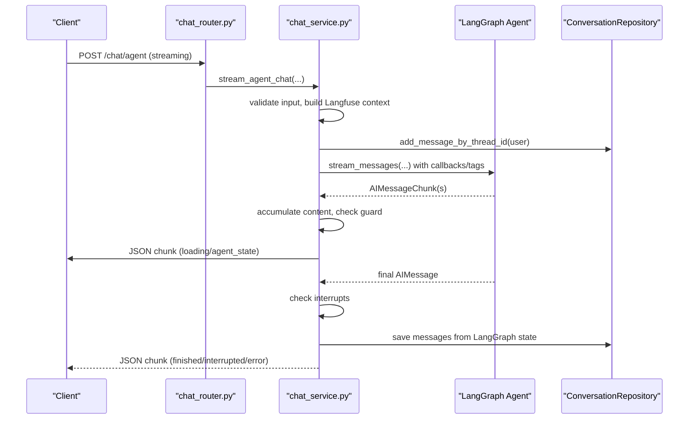
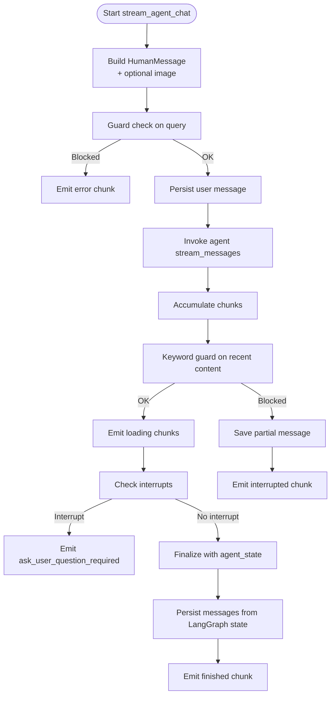
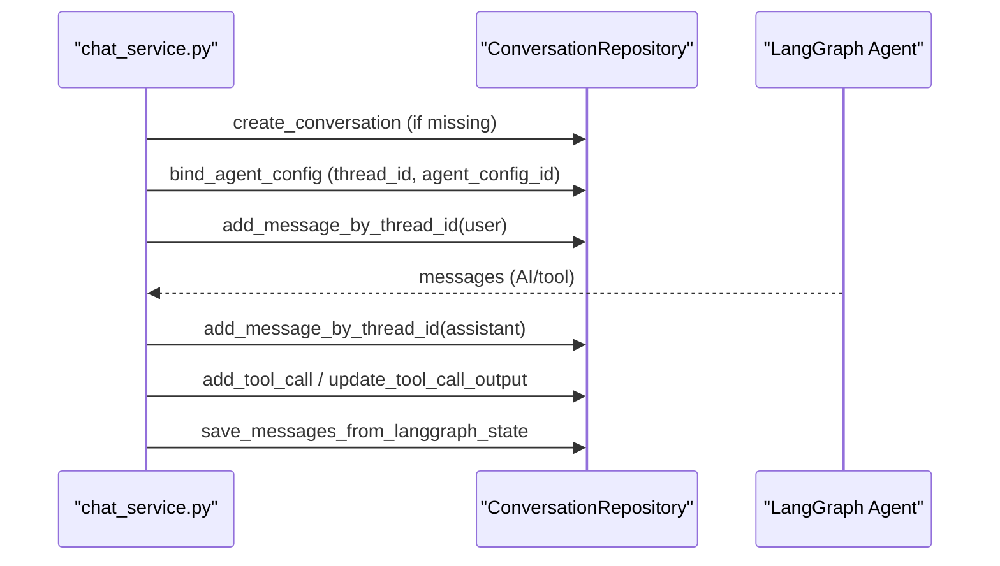
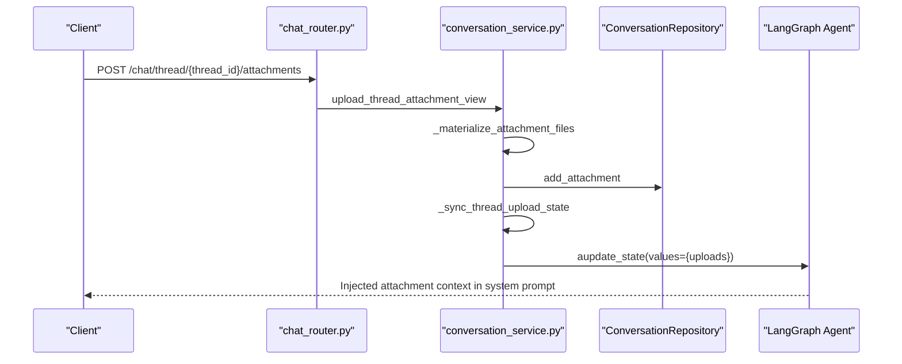
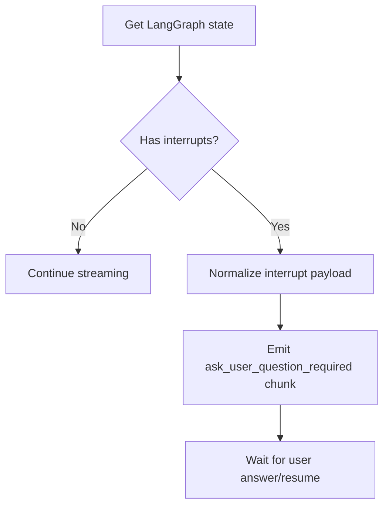
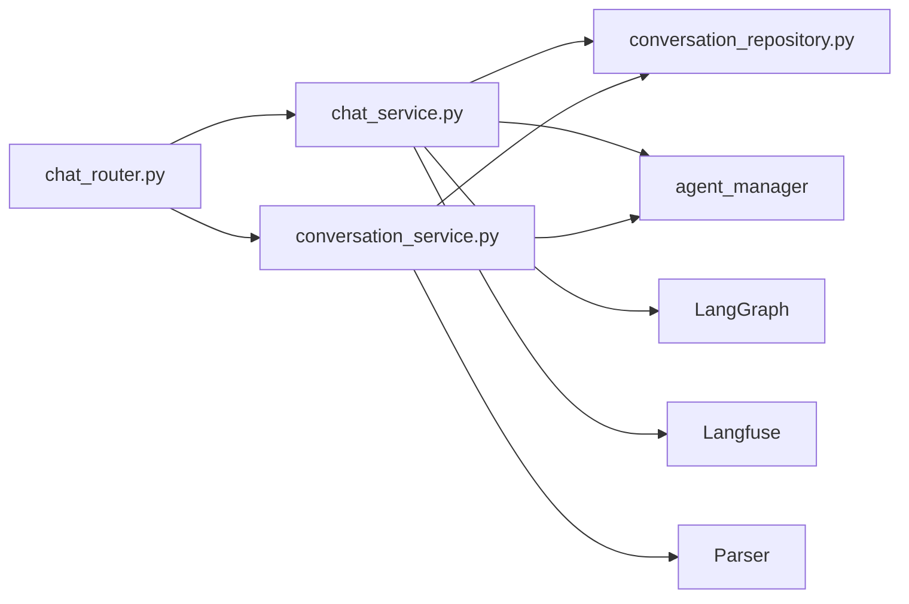

# Chat Service

<cite>
**Referenced Files in This Document**
- [chat_service.py](file://backend/package/yuxi/services/chat_service.py)
- [chat_router.py](file://backend/server/routers/chat_router.py)
- [conversation_repository.py](file://backend/package/yuxi/repositories/conversation_repository.py)
- [conversation_service.py](file://backend/package/yuxi/services/conversation_service.py)
- [attachment_middleware.py](file://backend/package/yuxi/agents/middlewares/attachment_middleware.py)
- [state.py](file://backend/package/yuxi/agents/state.py)
- [question_utils.py](file://backend/package/yuxi/utils/question_utils.py)
- [test_chat_service_sync.py](file://backend/test/unit/services/test_chat_service_sync.py)
- [test_chat_service_langfuse_stream.py](file://backend/test/unit/services/test_chat_service_langfuse_stream.py)
- [test_chat_agent_sync.py](file://backend/test/integration/api/test_chat_agent_sync.py)
- [test_chat_stream_interrupt.py](file://backend/test/unit/services/test_chat_stream_interrupt.py)
</cite>

## Table of Contents
1. [Introduction](#introduction)
2. [Project Structure](#project-structure)
3. [Core Components](#core-components)
4. [Architecture Overview](#architecture-overview)
5. [Detailed Component Analysis](#detailed-component-analysis)
6. [Dependency Analysis](#dependency-analysis)
7. [Performance Considerations](#performance-considerations)
8. [Troubleshooting Guide](#troubleshooting-guide)
9. [Conclusion](#conclusion)
10. [Appendices](#appendices)

## Introduction
This document describes the Chat Service responsible for real-time conversational workflows. It covers the message processing pipeline, validation, conversation threading, response generation, agent integration, persistence, state management, streaming, attachments, and multimedia support. It also documents examples of initiating chats, exchanging messages, continuing conversations, handling concurrent scenarios, maintaining message ordering, and managing conversation lifecycles.

## Project Structure
The Chat Service spans several modules:
- Router layer: FastAPI routes for chat endpoints, thread management, and attachment handling.
- Service layer: Chat orchestration, streaming, agent invocation, interrupt handling, and state extraction.
- Repository layer: Conversation persistence, message CRUD, tool-call tracking, and attachment metadata.
- Middleware and state: Attachment context injection and agent state structures.
- Utilities: Question normalization for user interrupts.

**Diagram sources**
- [chat_router.py:1-985](file://backend/server/routers/chat_router.py#L1-L985)
- [chat_service.py:1-1103](file://backend/package/yuxi/services/chat_service.py#L1-L1103)
- [conversation_repository.py:1-464](file://backend/package/yuxi/repositories/conversation_repository.py#L1-L464)
- [conversation_service.py:1-550](file://backend/package/yuxi/services/conversation_service.py#L1-L550)
- [attachment_middleware.py:1-90](file://backend/package/yuxi/agents/middlewares/attachment_middleware.py#L1-L90)
- [state.py:1-31](file://backend/package/yuxi/agents/state.py#L1-L31)
- [question_utils.py:1-80](file://backend/package/yuxi/utils/question_utils.py#L1-L80)

**Section sources**
- [chat_router.py:1-985](file://backend/server/routers/chat_router.py#L1-L985)
- [chat_service.py:1-1103](file://backend/package/yuxi/services/chat_service.py#L1-L1103)
- [conversation_repository.py:1-464](file://backend/package/yuxi/repositories/conversation_repository.py#L1-L464)
- [conversation_service.py:1-550](file://backend/package/yuxi/services/conversation_service.py#L1-L550)
- [attachment_middleware.py:1-90](file://backend/package/yuxi/agents/middlewares/attachment_middleware.py#L1-L90)
- [state.py:1-31](file://backend/package/yuxi/agents/state.py#L1-L31)
- [question_utils.py:1-80](file://backend/package/yuxi/utils/question_utils.py#L1-L80)

## Core Components
- Chat orchestration and streaming:
  - Non-streaming chat: agent_chat
  - Streaming chat: stream_agent_chat
  - Resume chat after interruption: stream_agent_resume
- Conversation persistence:
  - ConversationRepository: create, bind agent config, add messages, tool calls, attachments, fetch history
- Attachment handling:
  - conversation_service: upload, materialize, list, delete, and sync attachments to agent state
  - attachment_middleware: inject attachment context into agent prompts
- Interrupt handling:
  - Extract and normalize interrupt payloads into structured questions for user approval
- Agent state management:
  - Extract agent state from LangGraph and emit incremental updates
- Validation and safety:
  - Content guard checks during streaming and post-generation
- Routing:
  - chat_router: endpoints for chat, threads, attachments, and run management

**Section sources**
- [chat_service.py:464-1103](file://backend/package/yuxi/services/chat_service.py#L464-L1103)
- [conversation_repository.py:18-464](file://backend/package/yuxi/repositories/conversation_repository.py#L18-L464)
- [conversation_service.py:367-550](file://backend/package/yuxi/services/conversation_service.py#L367-L550)
- [attachment_middleware.py:54-90](file://backend/package/yuxi/agents/middlewares/attachment_middleware.py#L54-L90)
- [state.py:19-31](file://backend/package/yuxi/agents/state.py#L19-L31)
- [question_utils.py:25-80](file://backend/package/yuxi/utils/question_utils.py#L25-L80)
- [chat_router.py:347-576](file://backend/server/routers/chat_router.py#L347-L576)

## Architecture Overview
The Chat Service integrates FastAPI routes, agent execution via LangGraph, and persistent storage. It supports:
- Real-time streaming responses with JSON chunks
- Multimodal inputs (text + image)
- Attachment ingestion and agent-aware context injection
- Interrupt-driven workflows requiring user approval
- Agent state snapshots emitted during streaming
- Content safety checks with guardrails

**Diagram sources**
- [chat_router.py:347-373](file://backend/server/routers/chat_router.py#L347-L373)
- [chat_service.py:657-929](file://backend/package/yuxi/services/chat_service.py#L657-L929)
- [conversation_repository.py:136-157](file://backend/package/yuxi/repositories/conversation_repository.py#L136-L157)

## Detailed Component Analysis

### Chat Orchestration and Streaming
- Non-streaming agent_chat:
  - Builds HumanMessage (text or multimodal)
  - Validates user department and agent config
  - Persists user message, invokes agent, extracts final AI message, saves LangGraph state, and returns a structured response
- Streaming stream_agent_chat:
  - Emits init, loading, agent_state, interrupted, finished, error chunks
  - Accumulates content, performs keyword-based guard checks, and persists partial messages on interruption
  - Syncs agent state snapshots and emits them as chunks
- Resume after interruption:
  - stream_agent_resume resumes the graph with a resume command and streams again

**Diagram sources**
- [chat_service.py:657-929](file://backend/package/yuxi/services/chat_service.py#L657-L929)
- [chat_service.py:418-441](file://backend/package/yuxi/services/chat_service.py#L418-L441)

**Section sources**
- [chat_service.py:464-656](file://backend/package/yuxi/services/chat_service.py#L464-L656)
- [chat_service.py:657-929](file://backend/package/yuxi/services/chat_service.py#L657-L929)
- [chat_service.py:931-1081](file://backend/package/yuxi/services/chat_service.py#L931-L1081)

### Message Validation and Safety
- Content guard checks:
  - Pre-invocation guard on initial query
  - Keyword-based guard during streaming accumulation
  - Post-generation guard on final AIMessage
- On detection, partial messages are persisted with metadata indicating the interruption type.

**Section sources**
- [chat_service.py:489-503](file://backend/package/yuxi/services/chat_service.py#L489-L503)
- [chat_service.py:817-829](file://backend/package/yuxi/services/chat_service.py#L817-L829)
- [chat_service.py:840-850](file://backend/package/yuxi/services/chat_service.py#L840-L850)

### Conversation Threading and Lifecycle
- Thread creation and binding:
  - Ensures a thread exists and binds agent config to the conversation
- Message persistence:
  - add_message_by_thread_id persists user and assistant messages
  - save_messages_from_langgraph_state persists AI and tool messages
- Tool-call tracking:
  - add_tool_call and update_tool_call_output track tool execution outcomes
- Attachment metadata:
  - add_attachment and update_attachment_status manage attachment records per thread

**Diagram sources**
- [chat_service.py:443-462](file://backend/package/yuxi/services/chat_service.py#L443-L462)
- [chat_service.py:241-270](file://backend/package/yuxi/services/chat_service.py#L241-L270)
- [conversation_repository.py:136-193](file://backend/package/yuxi/repositories/conversation_repository.py#L136-L193)

**Section sources**
- [chat_service.py:443-462](file://backend/package/yuxi/services/chat_service.py#L443-L462)
- [chat_service.py:241-270](file://backend/package/yuxi/services/chat_service.py#L241-L270)
- [conversation_repository.py:35-193](file://backend/package/yuxi/repositories/conversation_repository.py#L35-L193)

### Response Generation and Streaming
- Streaming chunks:
  - status: init/loading/agent_state/interrupted/finished/error
  - meta: request_id, thread_id, user_id, agent_id, time_cost
  - msg: serialized message payload for rendering
- Agent state snapshots:
  - Emitted when state signature changes during streaming
- Cleanup on client disconnect:
  - Partial messages saved with interruption metadata

**Section sources**
- [chat_service.py:669-764](file://backend/package/yuxi/services/chat_service.py#L669-L764)
- [chat_service.py:804-810](file://backend/package/yuxi/services/chat_service.py#L804-L810)
- [chat_service.py:879-906](file://backend/package/yuxi/services/chat_service.py#L879-L906)

### Attachment Handling and Multimodal Support
- Upload and materialization:
  - conversation_service: upload_thread_attachment_view converts uploads to markdown, writes to disk, and updates attachment metadata
  - Syncs agent state uploads via _sync_thread_upload_state
- Agent context injection:
  - attachment_middleware injects a marker block with readable file paths into the system prompt
- State files:
  - _build_state_files transforms parsed attachments into StateBackend-compatible files dictionary

**Diagram sources**
- [chat_router.py:772-785](file://backend/server/routers/chat_router.py#L772-L785)
- [conversation_service.py:367-422](file://backend/package/yuxi/services/conversation_service.py#L367-L422)
- [conversation_service.py:166-190](file://backend/package/yuxi/services/conversation_service.py#L166-L190)
- [attachment_middleware.py:59-85](file://backend/package/yuxi/agents/middlewares/attachment_middleware.py#L59-L85)

**Section sources**
- [conversation_service.py:367-422](file://backend/package/yuxi/services/conversation_service.py#L367-L422)
- [conversation_service.py:166-190](file://backend/package/yuxi/services/conversation_service.py#L166-L190)
- [attachment_middleware.py:54-90](file://backend/package/yuxi/agents/middlewares/attachment_middleware.py#L54-L90)
- [chat_service.py:34-66](file://backend/package/yuxi/services/chat_service.py#L34-L66)

### Interrupt Handling and User Approval
- Interrupt detection:
  - check_and_handle_interrupts reads LangGraph state and emits ask_user_question_required when interrupts are present
- Payload normalization:
  - _build_ask_user_question_payload normalizes interrupt info into structured questions with options, multi-select, allow-other, and operation
  - question_utils provides normalization helpers for options and questions

**Diagram sources**
- [chat_service.py:418-441](file://backend/package/yuxi/services/chat_service.py#L418-L441)
- [chat_service.py:323-360](file://backend/package/yuxi/services/chat_service.py#L323-L360)
- [question_utils.py:25-80](file://backend/package/yuxi/utils/question_utils.py#L25-L80)

**Section sources**
- [chat_service.py:418-441](file://backend/package/yuxi/services/chat_service.py#L418-L441)
- [chat_service.py:323-360](file://backend/package/yuxi/services/chat_service.py#L323-L360)
- [question_utils.py:25-80](file://backend/package/yuxi/utils/question_utils.py#L25-L80)

### Agent State Management
- State extraction:
  - extract_agent_state maps LangGraph values to AgentStatePayload (todos, files, artifacts)
- Signature-based emission:
  - _agent_state_signature computes a stable signature; only changed states are emitted during streaming
- Frontend consumption:
  - get_agent_state_view retrieves current state for a thread

**Section sources**
- [chat_service.py:104-128](file://backend/package/yuxi/services/chat_service.py#L104-L128)
- [chat_service.py:804-810](file://backend/package/yuxi/services/chat_service.py#L804-L810)
- [state.py:19-31](file://backend/package/yuxi/agents/state.py#L19-L31)
- [chat_service.py:1083-1103](file://backend/package/yuxi/services/chat_service.py#L1083-L1103)

### Routing and Examples
- Endpoints:
  - POST /chat/agent (streaming)
  - POST /chat/agent/sync (non-streaming)
  - POST /chat/thread/{thread_id}/resume (resume after interrupt)
  - GET /chat/thread/{thread_id}/history (thread history)
  - POST /chat/thread/{thread_id}/attachments (upload attachments)
- Example workflows:
  - Initiate chat: send POST /chat/agent with query and agent_config_id
  - Continue conversation: reuse thread_id across requests
  - Resume after approval: send POST /chat/thread/{thread_id}/resume with answers/approval
  - Fetch history: GET /chat/thread/{thread_id}/history

**Section sources**
- [chat_router.py:347-576](file://backend/server/routers/chat_router.py#L347-L576)
- [test_chat_agent_sync.py:43-201](file://backend/test/integration/api/test_chat_agent_sync.py#L43-L201)

## Dependency Analysis
- chat_router depends on:
  - chat_service for orchestration
  - conversation_service for thread and attachment operations
- chat_service depends on:
  - ConversationRepository for persistence
  - agent_manager for agent retrieval
  - LangGraph for state and streaming
  - Langfuse for tracing
  - Content guard for safety
- conversation_service depends on:
  - Parser for converting uploads to markdown
  - Sandbox directories for materializing attachments
  - agent_manager to sync uploads to agent state

**Diagram sources**
- [chat_router.py:17-43](file://backend/server/routers/chat_router.py#L17-L43)
- [chat_service.py:12-25](file://backend/package/yuxi/services/chat_service.py#L12-L25)
- [conversation_service.py:8-18](file://backend/package/yuxi/services/conversation_service.py#L8-L18)

**Section sources**
- [chat_router.py:17-43](file://backend/server/routers/chat_router.py#L17-L43)
- [chat_service.py:12-25](file://backend/package/yuxi/services/chat_service.py#L12-L25)
- [conversation_service.py:8-18](file://backend/package/yuxi/services/conversation_service.py#L8-L18)

## Performance Considerations
- Streaming:
  - Emit chunks incrementally to reduce perceived latency
  - Accumulate minimal recent content for keyword guard checks
- Persistence:
  - Persist messages after streaming completes to avoid race conditions
  - Use batched operations where possible (e.g., save_messages_from_langgraph_state)
- Attachments:
  - Limit attachment sizes and enforce truncation thresholds
  - Materialize only necessary copies (original and markdown) to disk
- Concurrency:
  - Use thread_id to isolate conversations and avoid cross-thread interference
  - Ensure atomic updates to conversation metadata and attachments

## Troubleshooting Guide
- Content guard blocked:
  - Symptom: error or interrupted status with guard-related error_type
  - Action: review guard configuration and adjust content policy
- Missing thread_id:
  - Symptom: auto-generated thread_id warning
  - Action: pass a valid thread_id to maintain continuity
- Invalid agent config:
  - Symptom: invalid_config error
  - Action: verify agent_config_id belongs to the user’s department and matches agent_id
- Interrupted output:
  - Symptom: interrupted chunk emitted
  - Action: handle ask_user_question_required and resume with answers
- Client disconnect:
  - Symptom: interrupted chunk and partial message saved
  - Action: resume conversation using thread_id and /chat/thread/{thread_id}/resume

**Section sources**
- [chat_service.py:489-503](file://backend/package/yuxi/services/chat_service.py#L489-L503)
- [chat_service.py:817-829](file://backend/package/yuxi/services/chat_service.py#L817-L829)
- [chat_service.py:879-906](file://backend/package/yuxi/services/chat_service.py#L879-L906)
- [chat_service.py:418-441](file://backend/package/yuxi/services/chat_service.py#L418-L441)

## Conclusion
The Chat Service provides a robust, streaming-first conversational platform with strong integration to agents, persistent conversation state, and safety controls. It supports multimodal inputs, attachments, and user-driven interruptions, enabling flexible, real-time workflows while maintaining message ordering and lifecycle integrity.

## Appendices

### API Endpoints Summary
- POST /chat/agent: Streaming chat
- POST /chat/agent/sync: Non-streaming chat
- POST /chat/thread/{thread_id}/resume: Resume after interrupt
- GET /chat/thread/{thread_id}/history: Retrieve conversation history
- POST /chat/thread/{thread_id}/attachments: Upload attachments
- GET /chat/thread/{thread_id}/state: Get current agent state

**Section sources**
- [chat_router.py:347-576](file://backend/server/routers/chat_router.py#L347-L576)

### Tests and Examples
- Unit tests demonstrate:
  - Non-streaming chat behavior and state persistence
  - Streaming with Langfuse callbacks and agent state emission
  - Interrupt payload normalization and question building
- Integration tests verify:
  - Authentication requirements
  - Basic conversation flow
  - Consistency between streaming and non-streaming modes

**Section sources**
- [test_chat_service_sync.py:62-217](file://backend/test/unit/services/test_chat_service_sync.py#L62-L217)
- [test_chat_service_langfuse_stream.py:62-223](file://backend/test/unit/services/test_chat_service_langfuse_stream.py#L62-L223)
- [test_chat_stream_interrupt.py:16-214](file://backend/test/unit/services/test_chat_stream_interrupt.py#L16-L214)
- [test_chat_agent_sync.py:37-201](file://backend/test/integration/api/test_chat_agent_sync.py#L37-L201)