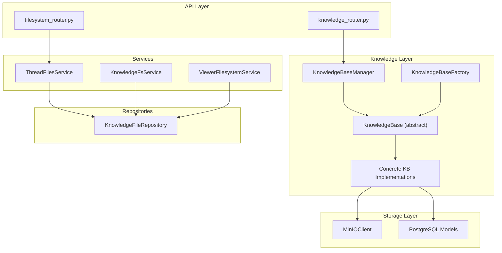
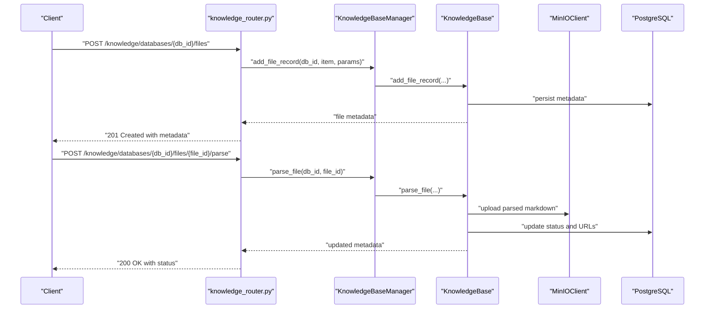
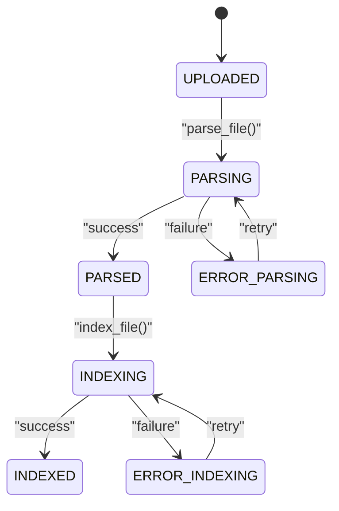
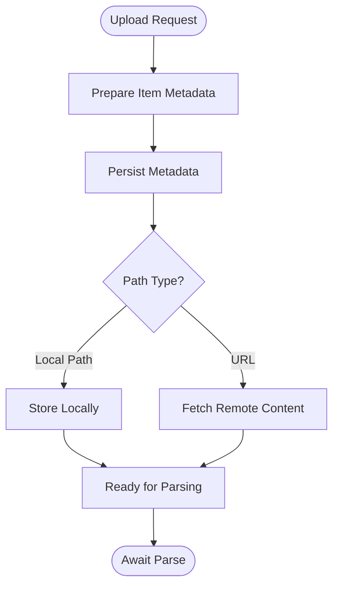
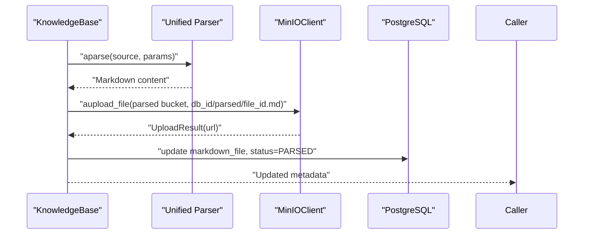
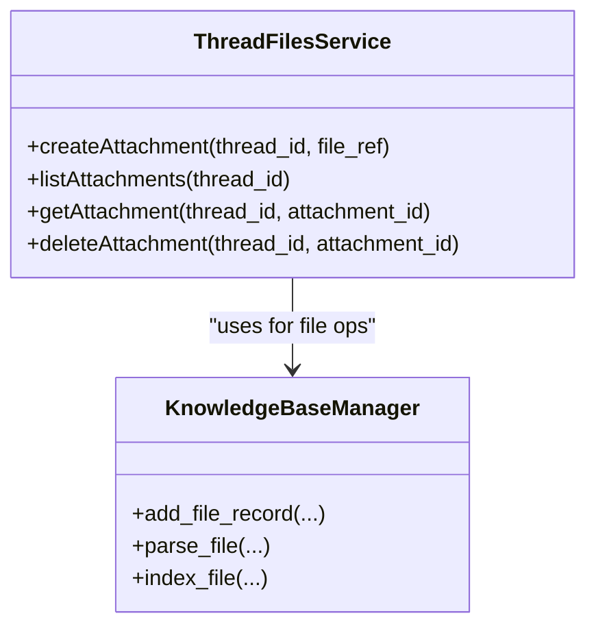
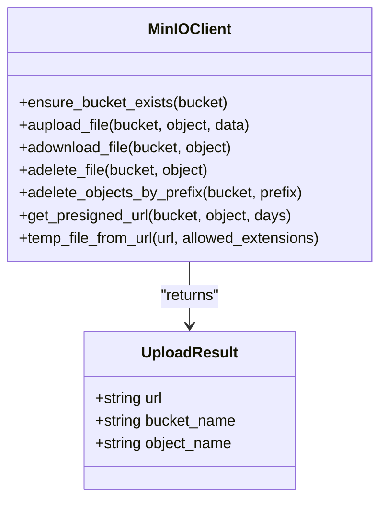
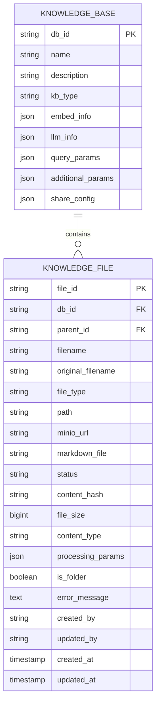
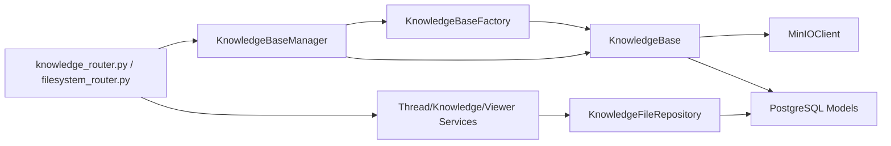

# Knowledge File Service

<cite>
**Referenced Files in This Document**
- [base.py](file://backend/package/yuxi/knowledge/base.py)
- [manager.py](file://backend/package/yuxi/knowledge/manager.py)
- [factory.py](file://backend/package/yuxi/knowledge/factory.py)
- [client.py](file://backend/package/yuxi/storage/minio/client.py)
- [utils.py](file://backend/package/yuxi/storage/minio/utils.py)
- [models_knowledge.py](file://backend/package/yuxi/storage/postgres/models_knowledge.py)
- [models_business.py](file://backend/package/yuxi/storage/postgres/models_business.py)
- [thread_files_service.py](file://backend/package/yuxi/services/thread_files_service.py)
- [knowledge_fs_service.py](file://backend/package/yuxi/services/knowledge_fs_service.py)
- [viewer_filesystem_service.py](file://backend/package/yuxi/services/viewer_filesystem_service.py)
- [knowledge_file_repository.py](file://backend/package/yuxi/repositories/knowledge_file_repository.py)
- [knowledge_router.py](file://backend/server/routers/knowledge_router.py)
- [filesystem_router.py](file://backend/server/routers/filesystem_router.py)
- [upload_graph_service.py](file://backend/package/yuxi/knowledge/graphs/upload_graph_service.py)
</cite>

## Table of Contents
1. [Introduction](#introduction)
2. [Project Structure](#project-structure)
3. [Core Components](#core-components)
4. [Architecture Overview](#architecture-overview)
5. [Detailed Component Analysis](#detailed-component-analysis)
6. [Dependency Analysis](#dependency-analysis)
7. [Performance Considerations](#performance-considerations)
8. [Troubleshooting Guide](#troubleshooting-guide)
9. [Conclusion](#conclusion)
10. [Appendices](#appendices)

## Introduction
This document describes the Knowledge File Service responsible for managing document upload, processing, and retrieval workflows. It covers the end-to-end lifecycle from file ingestion to content indexing, including validation, security scanning, MinIO object storage integration, and thread-specific file management. It also documents the integration with knowledge base operations, metadata extraction, and content indexing, along with examples of upload, status monitoring, and retrieval operations.

## Project Structure
The Knowledge File Service spans several modules:
- Knowledge base abstraction and implementations
- MinIO client and utilities
- PostgreSQL models for knowledge metadata
- Services for thread-specific and viewer filesystem operations
- Repositories for persistence
- Server routers exposing APIs for knowledge and filesystem operations

**Diagram sources**
- [manager.py:15-102](file://backend/package/yuxi/knowledge/manager.py#L15-L102)
- [base.py:46-180](file://backend/package/yuxi/knowledge/base.py#L46-L180)
- [factory.py:5-108](file://backend/package/yuxi/knowledge/factory.py#L5-L108)
- [client.py:40-86](file://backend/package/yuxi/storage/minio/client.py#L40-L86)
- [models_knowledge.py:23-72](file://backend/package/yuxi/storage/postgres/models_knowledge.py#L23-L72)
- [thread_files_service.py](file://backend/package/yuxi/services/thread_files_service.py)
- [knowledge_fs_service.py](file://backend/package/yuxi/services/knowledge_fs_service.py)
- [viewer_filesystem_service.py](file://backend/package/yuxi/services/viewer_filesystem_service.py)
- [knowledge_file_repository.py](file://backend/package/yuxi/repositories/knowledge_file_repository.py)
- [knowledge_router.py](file://backend/server/routers/knowledge_router.py)
- [filesystem_router.py](file://backend/server/routers/filesystem_router.py)

**Section sources**
- [manager.py:15-102](file://backend/package/yuxi/knowledge/manager.py#L15-L102)
- [base.py:46-180](file://backend/package/yuxi/knowledge/base.py#L46-L180)
- [factory.py:5-108](file://backend/package/yuxi/knowledge/factory.py#L5-L108)
- [client.py:40-86](file://backend/package/yuxi/storage/minio/client.py#L40-L86)
- [models_knowledge.py:23-72](file://backend/package/yuxi/storage/postgres/models_knowledge.py#L23-L72)
- [thread_files_service.py](file://backend/package/yuxi/services/thread_files_service.py)
- [knowledge_fs_service.py](file://backend/package/yuxi/services/knowledge_fs_service.py)
- [viewer_filesystem_service.py](file://backend/package/yuxi/services/viewer_filesystem_service.py)
- [knowledge_file_repository.py](file://backend/package/yuxi/repositories/knowledge_file_repository.py)

## Core Components
- KnowledgeBaseManager: Central coordinator for knowledge base instances, metadata loading, and routing operations to specific implementations.
- KnowledgeBase (abstract): Defines the file lifecycle (upload, parse, index) and integrates with MinIO and PostgreSQL.
- KnowledgeBaseFactory: Creates concrete knowledge base implementations based on type.
- MinIOClient: Provides asynchronous upload/download/delete operations and bucket management.
- PostgreSQL models: Persist knowledge base, file metadata, and evaluation records.
- ThreadFilesService, KnowledgeFsService, ViewerFilesystemService: Services for thread-scoped file operations and filesystem access.
- Repositories: Encapsulate persistence logic for knowledge files and bases.

**Section sources**
- [manager.py:15-102](file://backend/package/yuxi/knowledge/manager.py#L15-L102)
- [base.py:46-180](file://backend/package/yuxi/knowledge/base.py#L46-L180)
- [factory.py:5-108](file://backend/package/yuxi/knowledge/factory.py#L5-L108)
- [client.py:40-86](file://backend/package/yuxi/storage/minio/client.py#L40-L86)
- [models_knowledge.py:23-72](file://backend/package/yuxi/storage/postgres/models_knowledge.py#L23-L72)
- [thread_files_service.py](file://backend/package/yuxi/services/thread_files_service.py)
- [knowledge_fs_service.py](file://backend/package/yuxi/services/knowledge_fs_service.py)
- [viewer_filesystem_service.py](file://backend/package/yuxi/services/viewer_filesystem_service.py)
- [knowledge_file_repository.py](file://backend/package/yuxi/repositories/knowledge_file_repository.py)

## Architecture Overview
The Knowledge File Service follows a layered architecture:
- API Layer: Exposes endpoints for knowledge and filesystem operations.
- Service Layer: Implements business logic for threads, filesystem, and knowledge operations.
- Knowledge Layer: Manages knowledge base instances and file lifecycle.
- Storage Layer: Integrates MinIO for object storage and PostgreSQL for metadata persistence.

**Diagram sources**
- [knowledge_router.py](file://backend/server/routers/knowledge_router.py)
- [manager.py:406-426](file://backend/package/yuxi/knowledge/manager.py#L406-L426)
- [base.py:192-324](file://backend/package/yuxi/knowledge/base.py#L192-L324)
- [client.py:136-146](file://backend/package/yuxi/storage/minio/client.py#L136-L146)
- [models_knowledge.py:45-72](file://backend/package/yuxi/storage/postgres/models_knowledge.py#L45-L72)

## Detailed Component Analysis

### File Lifecycle and Status Management
The file lifecycle is governed by a finite state machine with explicit transitions:
- UPLOADED → PARSING → PARSED/ERROR_PARSING
- UPLOADED → INDEXING → INDEXED/ERROR_INDEXING
- Legacy mapping: DONE → INDEXED, FAILED → generic failure

**Diagram sources**
- [base.py:15-26](file://backend/package/yuxi/knowledge/base.py#L15-L26)
- [base.py:233-324](file://backend/package/yuxi/knowledge/base.py#L233-L324)

**Section sources**
- [base.py:15-26](file://backend/package/yuxi/knowledge/base.py#L15-L26)
- [base.py:233-324](file://backend/package/yuxi/knowledge/base.py#L233-L324)

### File Upload Pipeline
- Metadata preparation: Validates content type and prepares metadata with processing parameters.
- Persistence: Saves initial metadata to PostgreSQL-backed in-memory structures and persists to disk.
- Path selection: Supports local paths or URLs; ensures safe handling of MinIO URLs.
- Security scanning: The parser facade orchestrates OCR and content extraction; security scanning is integrated via the parser pipeline.

**Diagram sources**
- [base.py:192-231](file://backend/package/yuxi/knowledge/base.py#L192-L231)
- [base.py:233-324](file://backend/package/yuxi/knowledge/base.py#L233-L324)

**Section sources**
- [base.py:192-231](file://backend/package/yuxi/knowledge/base.py#L192-L231)
- [base.py:233-324](file://backend/package/yuxi/knowledge/base.py#L233-L324)

### File Processing Workflow
- Parser integration: Uses a unified parser to convert files to Markdown, with image extraction to a public bucket.
- MinIO storage: Stores parsed Markdown under a structured path and returns a public HTTP URL.
- Metadata updates: Records the Markdown URL and transitions status to PARSED.

**Diagram sources**
- [base.py:282-324](file://backend/package/yuxi/knowledge/base.py#L282-L324)
- [base.py:354-373](file://backend/package/yuxi/knowledge/base.py#L354-L373)
- [client.py:136-146](file://backend/package/yuxi/storage/minio/client.py#L136-L146)

**Section sources**
- [base.py:282-324](file://backend/package/yuxi/knowledge/base.py#L282-L324)
- [base.py:354-373](file://backend/package/yuxi/knowledge/base.py#L354-L373)
- [client.py:136-146](file://backend/package/yuxi/storage/minio/client.py#L136-L146)

### Thread-Specific File Management
- ThreadFilesService: Manages per-thread attachments and artifacts, enabling scoped file operations.
- Integration points: Coordinates with knowledge base operations for thread-scoped uploads and retrieval.

**Diagram sources**
- [thread_files_service.py](file://backend/package/yuxi/services/thread_files_service.py)
- [manager.py:406-426](file://backend/package/yuxi/knowledge/manager.py#L406-L426)

**Section sources**
- [thread_files_service.py](file://backend/package/yuxi/services/thread_files_service.py)
- [manager.py:406-426](file://backend/package/yuxi/knowledge/manager.py#L406-L426)

### MinIO Client Integration
- Bucket configuration: Documents, parsed Markdown, and images buckets are mapped for knowledge base operations.
- Public access: Public bucket configured with read policy; public endpoint determined by environment.
- Async operations: All MinIO operations are exposed as async methods for non-blocking I/O.
- Security checks: URL validation prevents path traversal and enforces allowed extensions in temporary file downloads.

**Diagram sources**
- [client.py:40-86](file://backend/package/yuxi/storage/minio/client.py#L40-L86)
- [client.py:31-38](file://backend/package/yuxi/storage/minio/client.py#L31-L38)

**Section sources**
- [client.py:40-86](file://backend/package/yuxi/storage/minio/client.py#L40-L86)
- [client.py:316-343](file://backend/package/yuxi/storage/minio/client.py#L316-L343)
- [client.py:345-426](file://backend/package/yuxi/storage/minio/client.py#L345-L426)

### File Metadata Extraction and Content Indexing
- Metadata schema: Stores file identity, path, content hash, size, type, status, and processing parameters.
- Indexing: Implemented by concrete knowledge base types; transitions to INDEXED upon successful indexing.
- Query support: Implementations expose asynchronous query capabilities.

**Diagram sources**
- [models_knowledge.py:23-72](file://backend/package/yuxi/storage/postgres/models_knowledge.py#L23-L72)

**Section sources**
- [models_knowledge.py:23-72](file://backend/package/yuxi/storage/postgres/models_knowledge.py#L23-L72)
- [base.py:388-401](file://backend/package/yuxi/knowledge/base.py#L388-L401)

### API Examples

- Upload a file to a knowledge base:
  - Endpoint: POST /knowledge/databases/{db_id}/files
  - Body: item (path or URL), params (content_type, processing_params)
  - Response: file metadata with initial status UPLOADED

- Monitor parsing status:
  - Endpoint: POST /knowledge/databases/{db_id}/files/{file_id}/parse
  - Response: updated metadata reflecting PARSING, PARSED, or ERROR_PARSING

- Retrieve parsed content:
  - Endpoint: GET /knowledge/databases/{db_id}/files/{file_id}
  - Response: file info including markdown_file URL

- Thread-scoped operations:
  - Endpoint: POST /filesystem/threads/{thread_id}/attachments
  - Response: attachment reference for downstream retrieval

Note: Replace placeholders with actual IDs and ensure proper authentication headers.

**Section sources**
- [knowledge_router.py](file://backend/server/routers/knowledge_router.py)
- [filesystem_router.py](file://backend/server/routers/filesystem_router.py)
- [manager.py:406-426](file://backend/package/yuxi/knowledge/manager.py#L406-L426)
- [base.py:192-324](file://backend/package/yuxi/knowledge/base.py#L192-L324)

## Dependency Analysis
- KnowledgeBaseManager depends on KnowledgeBaseFactory and repositories to orchestrate operations.
- KnowledgeBase implementations depend on MinIOClient for storage and PostgreSQL models for persistence.
- Services rely on repositories for metadata operations.
- Routers delegate to managers and services for business logic.

**Diagram sources**
- [factory.py:5-108](file://backend/package/yuxi/knowledge/factory.py#L5-L108)
- [manager.py:15-102](file://backend/package/yuxi/knowledge/manager.py#L15-L102)
- [client.py:40-86](file://backend/package/yuxi/storage/minio/client.py#L40-L86)
- [models_knowledge.py:23-72](file://backend/package/yuxi/storage/postgres/models_knowledge.py#L23-L72)
- [knowledge_router.py](file://backend/server/routers/knowledge_router.py)
- [filesystem_router.py](file://backend/server/routers/filesystem_router.py)

**Section sources**
- [factory.py:5-108](file://backend/package/yuxi/knowledge/factory.py#L5-L108)
- [manager.py:15-102](file://backend/package/yuxi/knowledge/manager.py#L15-L102)
- [client.py:40-86](file://backend/package/yuxi/storage/minio/client.py#L40-L86)
- [models_knowledge.py:23-72](file://backend/package/yuxi/storage/postgres/models_knowledge.py#L23-L72)
- [knowledge_router.py](file://backend/server/routers/knowledge_router.py)
- [filesystem_router.py](file://backend/server/routers/filesystem_router.py)

## Performance Considerations
- Asynchronous I/O: MinIO operations are async to avoid blocking the event loop.
- Bucket existence checks: Ensures buckets exist before operations to prevent repeated failures.
- Content-type detection: MIME guessing reduces misconfiguration overhead.
- Processing queue: Class-level lock and set manage concurrent file processing to avoid race conditions.
- Cleanup tasks: Parallel deletion of objects by prefix minimizes cleanup time.

[No sources needed since this section provides general guidance]

## Troubleshooting Guide
- MinIO errors: Verify endpoint, credentials, and bucket policies. Use get_presigned_url for external access.
- File not found: Check object name and bucket prefix; ensure uploads succeeded.
- Permission denied: Confirm public bucket policy and allowed extensions in temp_file_from_url.
- Database deletion: Ensure all associated MinIO objects are cleaned up before removing database records.

**Section sources**
- [client.py:109-135](file://backend/package/yuxi/storage/minio/client.py#L109-L135)
- [client.py:225-230](file://backend/package/yuxi/storage/minio/client.py#L225-L230)
- [client.py:316-343](file://backend/package/yuxi/storage/minio/client.py#L316-L343)
- [base.py:458-520](file://backend/package/yuxi/knowledge/base.py#L458-L520)

## Conclusion
The Knowledge File Service provides a robust, extensible framework for document ingestion, parsing, and indexing. It integrates MinIO for scalable object storage and PostgreSQL for durable metadata persistence, while offering thread-scoped operations and strong security controls. The modular design supports multiple knowledge base implementations and enables efficient scaling through asynchronous operations and optimized cleanup routines.

## Appendices

### Large File Handling and Multipart Uploads
- Current implementation uploads entire content as bytes. For very large files, consider:
  - Streaming uploads to reduce memory pressure
  - Multipart upload APIs if supported by MinIO client library
  - Chunked processing in the parser to limit in-memory footprint

[No sources needed since this section provides general guidance]

### File Cleanup Procedures
- On database deletion: Delete associated MinIO objects by db_id prefix across documents, parsed, and images buckets.
- On file deletion: Remove parsed Markdown and any derived images from MinIO; update metadata accordingly.

**Section sources**
- [base.py:458-520](file://backend/package/yuxi/knowledge/base.py#L458-L520)
- [client.py:254-281](file://backend/package/yuxi/storage/minio/client.py#L254-L281)