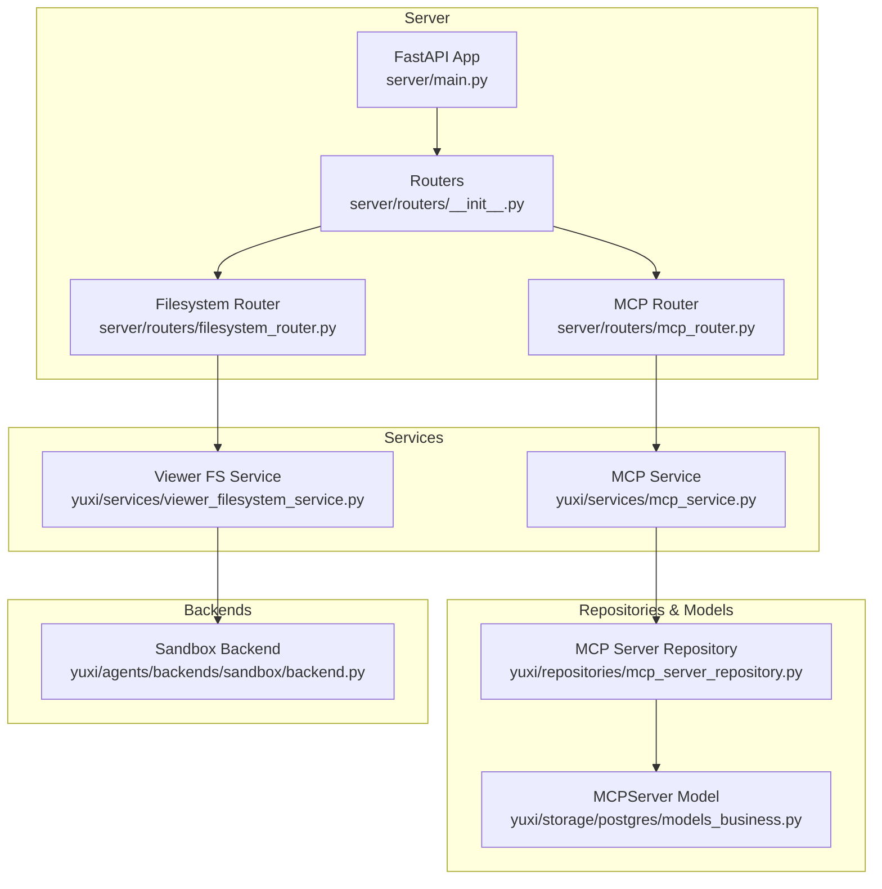
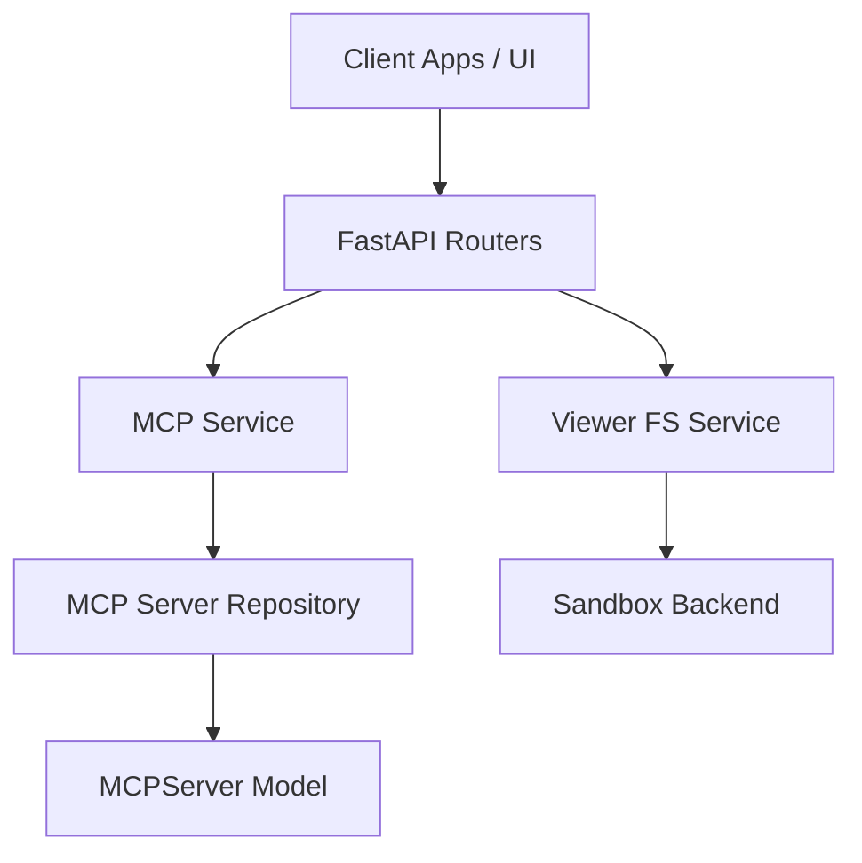
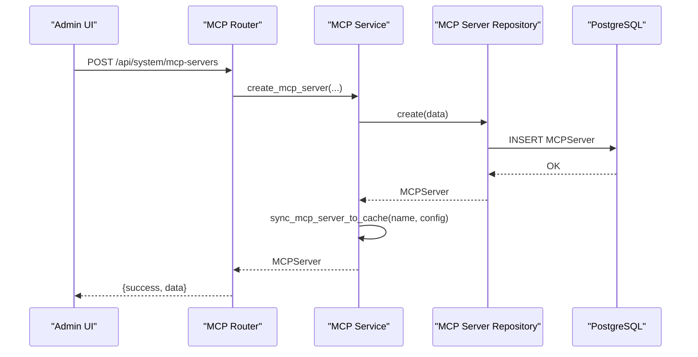
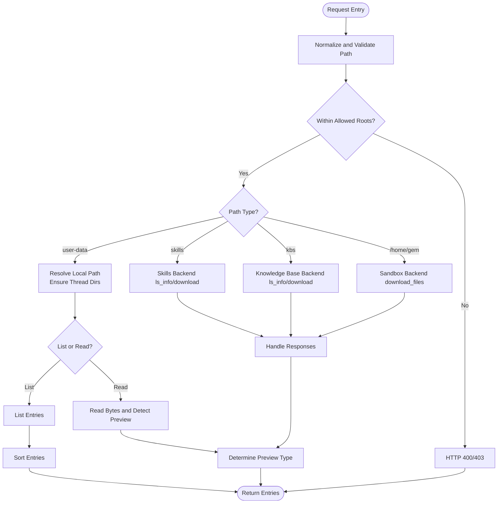
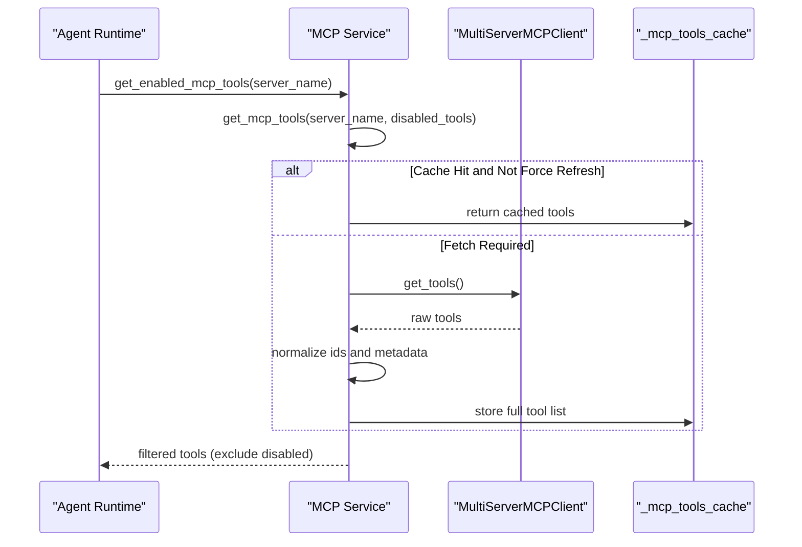
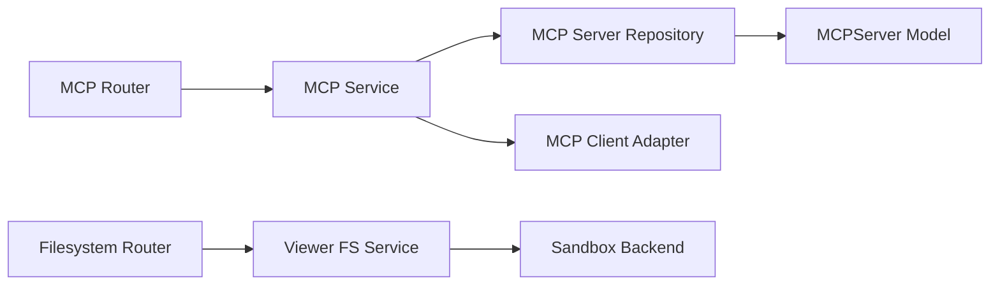

# MCP and Viewer Services

<cite>
**Referenced Files in This Document**
- [mcp_server_repository.py](file://backend/package/yuxi/repositories/mcp_server_repository.py)
- [mcp_service.py](file://backend/package/yuxi/services/mcp_service.py)
- [viewer_filesystem_service.py](file://backend/package/yuxi/services/viewer_filesystem_service.py)
- [mcp_router.py](file://backend/server/routers/mcp_router.py)
- [filesystem_router.py](file://backend/server/routers/filesystem_router.py)
- [models_business.py](file://backend/package/yuxi/storage/postgres/models_business.py)
- [backend.py](file://backend/package/yuxi/agents/backends/sandbox/backend.py)
- [mcp-integration.md](file://docs/agents/mcp-integration.md)
- [main.py](file://backend/server/main.py)
- [lifespan.py](file://backend/server/utils/lifespan.py)
- [logging_config.py](file://backend/package/yuxi/utils/logging_config.py)
</cite>

## Table of Contents
1. [Introduction](#introduction)
2. [Project Structure](#project-structure)
3. [Core Components](#core-components)
4. [Architecture Overview](#architecture-overview)
5. [Detailed Component Analysis](#detailed-component-analysis)
6. [Dependency Analysis](#dependency-analysis)
7. [Performance Considerations](#performance-considerations)
8. [Troubleshooting Guide](#troubleshooting-guide)
9. [Conclusion](#conclusion)
10. [Appendices](#appendices)

## Introduction
This document explains the Model Context Protocol (MCP) and Viewer Services that power external integrations and secure file system operations within sandboxed environments. It covers MCP server management (registration, health monitoring, tool integration), the viewer filesystem service for safe browsing and manipulation, repository patterns, server lifecycle, security controls, auditing, protocol compliance, scaling, and troubleshooting.

## Project Structure
The MCP and Viewer Services span backend packages and server routers:
- MCP server management is implemented in a service layer with a repository for persistence and FastAPI routes for administration.
- The viewer filesystem service exposes read-only operations for thread-scoped sandboxes, skills, and knowledge bases with strict path validation and permission checks.
- Application lifecycle initializes MCP server configurations and sandbox providers.

**Diagram sources**
- [main.py:1-150](file://backend/server/main.py#L1-L150)
- [__init__.py:1-49](file://backend/server/routers/__init__.py#L1-L49)
- [mcp_router.py:1-394](file://backend/server/routers/mcp_router.py#L1-L394)
- [filesystem_router.py:1-98](file://backend/server/routers/filesystem_router.py#L1-L98)
- [mcp_service.py:1-650](file://backend/package/yuxi/services/mcp_service.py#L1-L650)
- [viewer_filesystem_service.py:1-582](file://backend/package/yuxi/services/viewer_filesystem_service.py#L1-L582)
- [mcp_server_repository.py:1-82](file://backend/package/yuxi/repositories/mcp_server_repository.py#L1-L82)
- [models_business.py:426-526](file://backend/package/yuxi/storage/postgres/models_business.py#L426-L526)
- [backend.py:1-200](file://backend/package/yuxi/agents/backends/sandbox/backend.py#L1-L200)

**Section sources**
- [main.py:1-150](file://backend/server/main.py#L1-L150)
- [__init__.py:1-49](file://backend/server/routers/__init__.py#L1-L49)

## Core Components
- MCP Service: Centralizes MCP server configuration, caching, tool discovery, and filtering. Provides CRUD operations and runtime state management.
- MCP Server Repository: Data access layer for MCP server records in PostgreSQL.
- MCP Router: Admin endpoints for creating/updating/deleting servers, toggling status, listing tools, and refreshing tool caches.
- Viewer Filesystem Service: Secure, read-only file browsing and downloads for thread-scoped sandboxes, skills, and knowledge bases with strict path validation and permission enforcement.
- Filesystem Router: Public endpoints for tree listing, file content retrieval, downloads, and deletions.
- Sandbox Backend: Underlying sandbox provider integration for file operations and command execution.
- Lifecycle: Application startup initializes MCP servers and sandbox provider.

**Section sources**
- [mcp_service.py:1-650](file://backend/package/yuxi/services/mcp_service.py#L1-L650)
- [mcp_server_repository.py:1-82](file://backend/package/yuxi/repositories/mcp_server_repository.py#L1-L82)
- [mcp_router.py:1-394](file://backend/server/routers/mcp_router.py#L1-L394)
- [viewer_filesystem_service.py:1-582](file://backend/package/yuxi/services/viewer_filesystem_service.py#L1-L582)
- [filesystem_router.py:1-98](file://backend/server/routers/filesystem_router.py#L1-L98)
- [backend.py:1-200](file://backend/package/yuxi/agents/backends/sandbox/backend.py#L1-L200)
- [lifespan.py:1-89](file://backend/server/utils/lifespan.py#L1-L89)

## Architecture Overview
The system follows a layered architecture:
- Presentation: FastAPI routers expose admin and viewer endpoints.
- Application: Services encapsulate business logic for MCP and viewer filesystem operations.
- Persistence: SQLAlchemy ORM models and repositories manage MCP server configurations.
- Infrastructure: Sandbox backend integrates with external sandbox providers for secure file operations.

**Diagram sources**
- [mcp_router.py:1-394](file://backend/server/routers/mcp_router.py#L1-L394)
- [filesystem_router.py:1-98](file://backend/server/routers/filesystem_router.py#L1-L98)
- [mcp_service.py:1-650](file://backend/package/yuxi/services/mcp_service.py#L1-L650)
- [viewer_filesystem_service.py:1-582](file://backend/package/yuxi/services/viewer_filesystem_service.py#L1-L582)
- [mcp_server_repository.py:1-82](file://backend/package/yuxi/repositories/mcp_server_repository.py#L1-L82)
- [models_business.py:426-526](file://backend/package/yuxi/storage/postgres/models_business.py#L426-L526)
- [backend.py:1-200](file://backend/package/yuxi/agents/backends/sandbox/backend.py#L1-L200)

## Detailed Component Analysis

### MCP Server Management
- Initialization and Synchronization
  - On startup, the application loads enabled MCP servers from the database into a global cache and ensures built-in defaults exist.
  - Changes to server configurations are synchronized to the cache atomically with a lock.
- Configuration CRUD
  - Create, update, delete, and toggle server enabled status are exposed via admin endpoints.
  - Updates commit to the database and synchronize to the runtime cache.
- Tool Discovery and Caching
  - Tools are fetched from MCP servers and cached per server.
  - Tool IDs are normalized to a unique format; filtering excludes disabled tools.
  - Statistics track enabled/disabled counts per server.
- Security and Compliance
  - Transport types include streamable HTTP, SSE, and stdio; validation enforces required fields per transport.
  - Built-in servers are protected from deletion to maintain system stability.

**Diagram sources**
- [mcp_router.py:95-136](file://backend/server/routers/mcp_router.py#L95-L136)
- [mcp_service.py:391-438](file://backend/package/yuxi/services/mcp_service.py#L391-L438)
- [mcp_server_repository.py:32-37](file://backend/package/yuxi/repositories/mcp_server_repository.py#L32-L37)

**Section sources**
- [mcp_service.py:77-205](file://backend/package/yuxi/services/mcp_service.py#L77-L205)
- [mcp_service.py:379-512](file://backend/package/yuxi/services/mcp_service.py#L379-L512)
- [mcp_router.py:81-220](file://backend/server/routers/mcp_router.py#L81-L220)
- [models_business.py:426-526](file://backend/package/yuxi/storage/postgres/models_business.py#L426-L526)

### Viewer Filesystem Service
- Namespace and Permissions
  - Exposes three virtual namespaces: user-data, skills, and kbs, scoped to the current thread and user.
  - Paths are validated against allowed roots; attempts outside the namespace are rejected.
- Listing and Content Retrieval
  - Directory listings are sorted with folders first, then files.
  - Content detection determines whether a file is text, image, PDF, or unsupported.
  - Downloads return either a streaming response or a file response depending on content type.
- Deletion Controls
  - Deletions are restricted to user-data paths and protected roots are blocked.
- Sandbox Integration
  - Reads and writes route through the sandbox backend for thread workspaces and home/gem paths.

**Diagram sources**
- [viewer_filesystem_service.py:313-582](file://backend/package/yuxi/services/viewer_filesystem_service.py#L313-L582)
- [backend.py:107-200](file://backend/package/yuxi/agents/backends/sandbox/backend.py#L107-L200)

**Section sources**
- [viewer_filesystem_service.py:1-582](file://backend/package/yuxi/services/viewer_filesystem_service.py#L1-L582)
- [filesystem_router.py:1-98](file://backend/server/routers/filesystem_router.py#L1-L98)
- [backend.py:1-200](file://backend/package/yuxi/agents/backends/sandbox/backend.py#L1-L200)

### MCP Tool Integration and Filtering
- Unique Tool IDs
  - Tool names are normalized to camelCase and prefixed with a unique identifier derived from server and tool names.
- Disabled Tools
  - Global disabled list per server is applied at retrieval time; cache stores full tool lists for performance.
- Statistics
  - Enabled/disabled counts are tracked per server to support UI reporting.

**Diagram sources**
- [mcp_service.py:231-332](file://backend/package/yuxi/services/mcp_service.py#L231-L332)

**Section sources**
- [mcp_service.py:220-332](file://backend/package/yuxi/services/mcp_service.py#L220-L332)

## Dependency Analysis
- MCP Service depends on:
  - SQLAlchemy models and repository for persistence.
  - A global cache guarded by an asyncio lock for thread safety.
  - An MCP client adapter for multi-server connections.
- Viewer Filesystem Service depends on:
  - Thread-scoped sandbox backends for skills, knowledge base, and sandboxed file operations.
  - Path resolution utilities to ensure safe navigation within allowed roots.
- Router dependencies:
  - MCP Router depends on MCP Service for CRUD and tool operations.
  - Filesystem Router depends on Viewer Filesystem Service for read-only operations.

**Diagram sources**
- [mcp_service.py:1-650](file://backend/package/yuxi/services/mcp_service.py#L1-L650)
- [mcp_server_repository.py:1-82](file://backend/package/yuxi/repositories/mcp_server_repository.py#L1-L82)
- [models_business.py:426-526](file://backend/package/yuxi/storage/postgres/models_business.py#L426-L526)
- [viewer_filesystem_service.py:1-582](file://backend/package/yuxi/services/viewer_filesystem_service.py#L1-L582)
- [backend.py:1-200](file://backend/package/yuxi/agents/backends/sandbox/backend.py#L1-L200)
- [mcp_router.py:1-394](file://backend/server/routers/mcp_router.py#L1-L394)
- [filesystem_router.py:1-98](file://backend/server/routers/filesystem_router.py#L1-L98)

**Section sources**
- [mcp_service.py:1-650](file://backend/package/yuxi/services/mcp_service.py#L1-L650)
- [viewer_filesystem_service.py:1-582](file://backend/package/yuxi/services/viewer_filesystem_service.py#L1-L582)
- [mcp_router.py:1-394](file://backend/server/routers/mcp_router.py#L1-L394)
- [filesystem_router.py:1-98](file://backend/server/routers/filesystem_router.py#L1-L98)

## Performance Considerations
- Caching
  - Tools are cached per server to avoid repeated network calls; cache is cleared when server configs change.
- Concurrency
  - A global lock guards MCP configuration updates and cache modifications to prevent race conditions.
- I/O Bound Operations
  - Filesystem operations are offloaded to threads to avoid blocking the event loop.
- Network Timeouts
  - MCP client timeouts and SSE read timeouts are configurable per server to balance responsiveness and reliability.

[No sources needed since this section provides general guidance]

## Troubleshooting Guide
- MCP Server Connectivity
  - Use the test endpoint to verify connectivity and count discovered tools.
  - If connection fails, review transport type and required fields; check logs for detailed errors.
- Tool Visibility Issues
  - Confirm server enabled status and disabled tools list; refresh tools to rebuild cache.
  - Verify unique tool IDs and parameter schemas are populated for UI rendering.
- Viewer Filesystem Access Denied
  - Ensure the path is within the allowed virtual namespace (user-data, skills, kbs).
  - Confirm thread and user context; protected roots cannot be deleted.
- Sandbox Backend Errors
  - Validate path normalization and absence of path traversal; inspect sandbox provider availability and permissions.
- Logging and Auditing
  - Application logs are routed through a bridge to a structured logger; review logs for detailed error traces.

**Section sources**
- [mcp_router.py:227-251](file://backend/server/routers/mcp_router.py#L227-L251)
- [mcp_router.py:332-371](file://backend/server/routers/mcp_router.py#L332-L371)
- [viewer_filesystem_service.py:371-377](file://backend/package/yuxi/services/viewer_filesystem_service.py#L371-L377)
- [backend.py:37-50](file://backend/package/yuxi/agents/backends/sandbox/backend.py#L37-L50)
- [logging_config.py:1-99](file://backend/package/yuxi/utils/logging_config.py#L1-L99)

## Conclusion
The MCP and Viewer Services provide a robust, secure, and scalable foundation for integrating external tools and enabling controlled file system operations within sandboxed environments. The design emphasizes configuration-driven server management, efficient caching, strict path validation, and comprehensive logging for operational visibility.

[No sources needed since this section summarizes without analyzing specific files]

## Appendices

### MCP Protocol Compliance and Transport Types
- Supported transports: streamable HTTP, SSE, stdio.
- Validation ensures required fields per transport type.
- Built-in servers are maintained as code-of-record; database retains enabled state and tool-level disabled lists.

**Section sources**
- [mcp-integration.md:7-14](file://docs/agents/mcp-integration.md#L7-L14)
- [mcp_router.py:103-112](file://backend/server/routers/mcp_router.py#L103-L112)
- [mcp_service.py:40-56](file://backend/package/yuxi/services/mcp_service.py#L40-L56)

### Server Lifecycle and Startup
- Application startup initializes database schemas, MCP server configurations, sandbox provider, and LangGraph checkpoint tables.
- MCP server cache is primed from the database and kept in sync with configuration changes.

**Section sources**
- [lifespan.py:17-89](file://backend/server/utils/lifespan.py#L17-L89)
- [mcp_service.py:120-205](file://backend/package/yuxi/services/mcp_service.py#L120-L205)