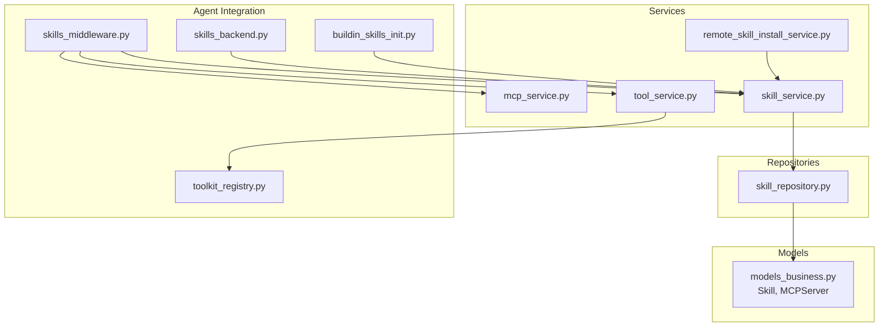
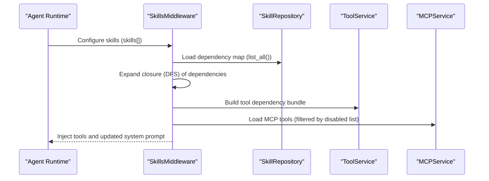
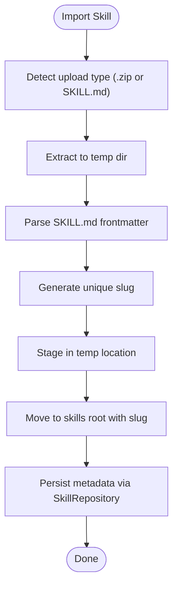
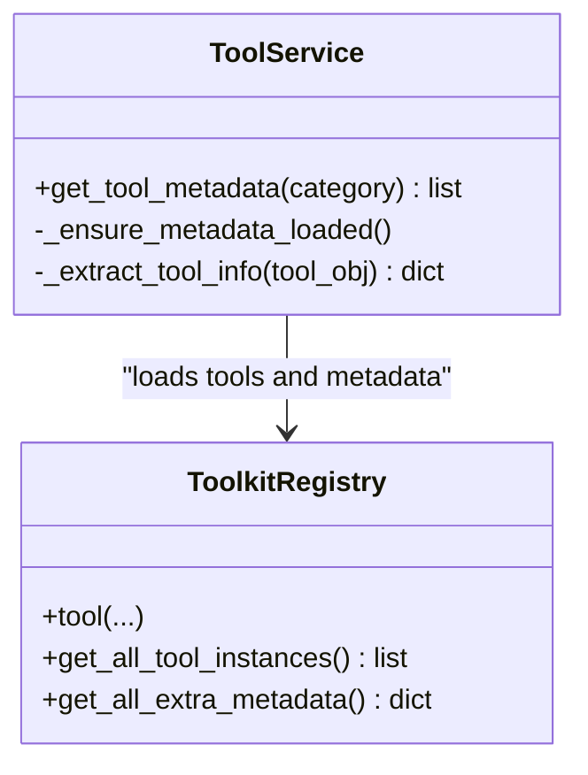
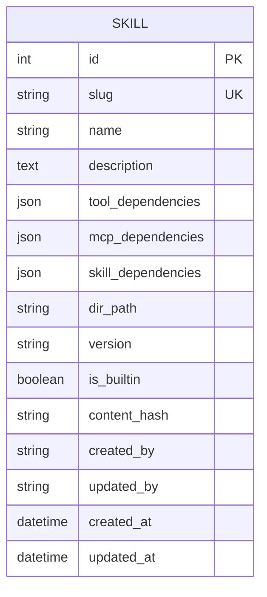
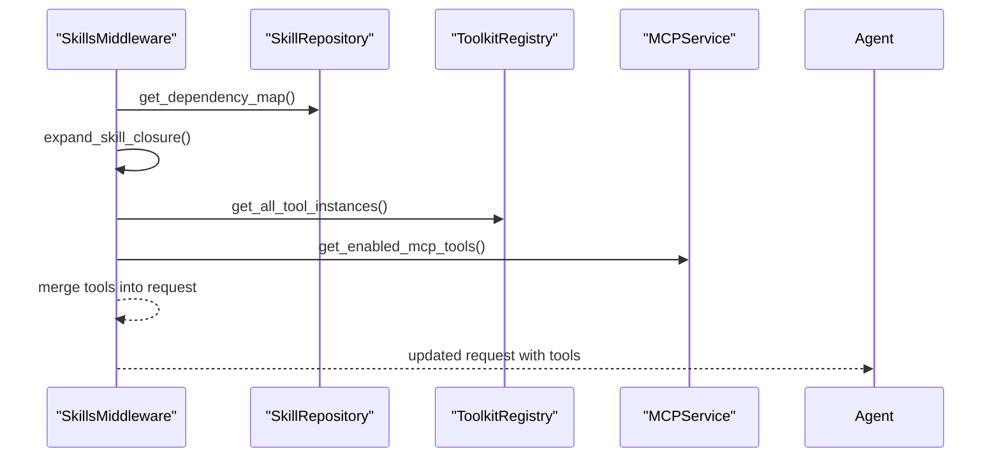
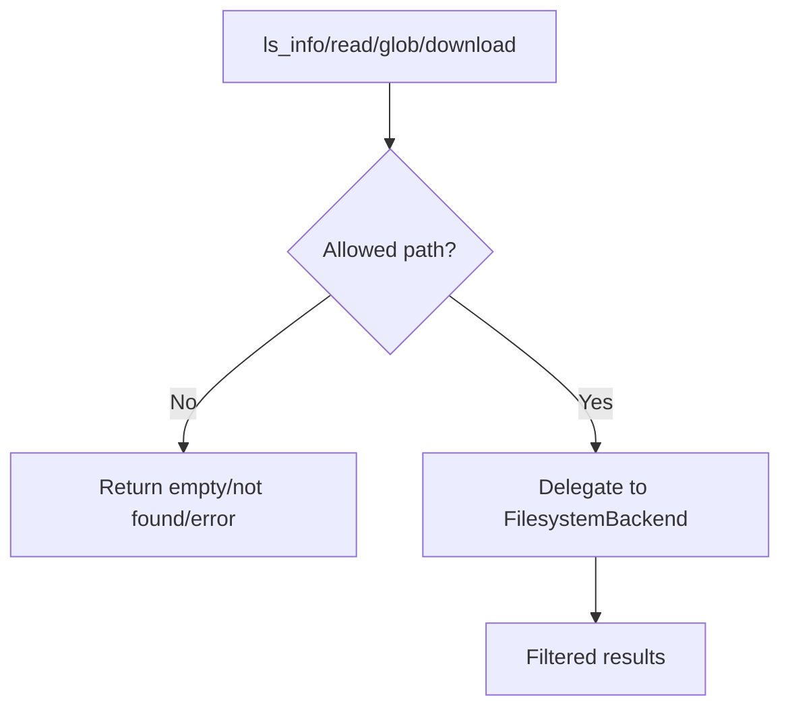
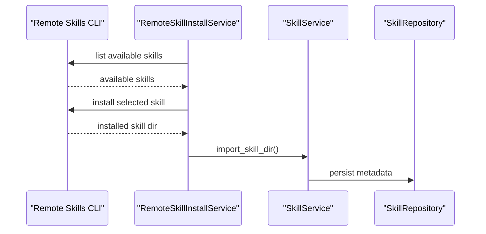
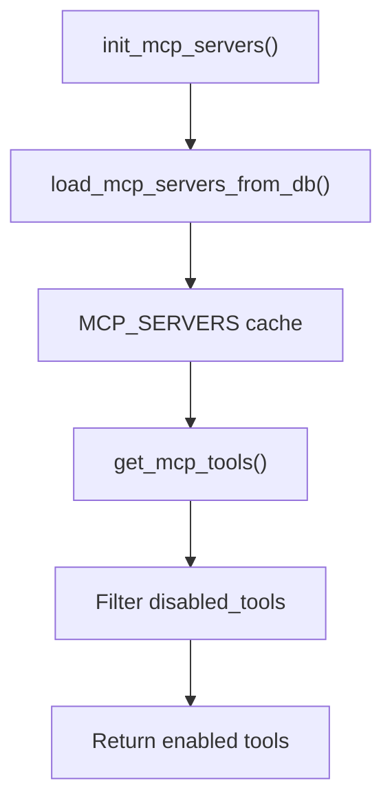
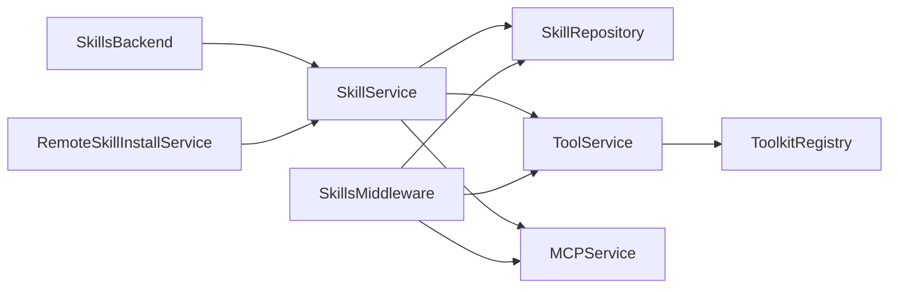

# Skill and Tool Services

<cite>
**Referenced Files in This Document**
- [skill_service.py](file://backend/package/yuxi/services/skill_service.py)
- [tool_service.py](file://backend/package/yuxi/services/tool_service.py)
- [skill_repository.py](file://backend/package/yuxi/repositories/skill_repository.py)
- [skills_backend.py](file://backend/package/yuxi/agents/backends/skills_backend.py)
- [skills_middleware.py](file://backend/package/yuxi/agents/middlewares/skills_middleware.py)
- [buildin_skills_init.py](file://backend/package/yuxi/agents/skills/buildin/__init__.py)
- [toolkit_registry.py](file://backend/package/yuxi/agents/toolkits/registry.py)
- [remote_skill_install_service.py](file://backend/package/yuxi/services/remote_skill_install_service.py)
- [mcp_service.py](file://backend/package/yuxi/services/mcp_service.py)
- [models_business.py](file://backend/package/yuxi/storage/postgres/models_business.py)
- [mysql_toolkit.py](file://backend/package/yuxi/agents/toolkits/mysql/tools.py)
</cite>

## Table of Contents
1. [Introduction](#introduction)
2. [Project Structure](#project-structure)
3. [Core Components](#core-components)
4. [Architecture Overview](#architecture-overview)
5. [Detailed Component Analysis](#detailed-component-analysis)
6. [Dependency Analysis](#dependency-analysis)
7. [Performance Considerations](#performance-considerations)
8. [Troubleshooting Guide](#troubleshooting-guide)
9. [Conclusion](#conclusion)

## Introduction
This document describes the Skill and Tool Services that power extensible agent capabilities. It covers:
- Skill registration and discovery, including validation, dependency resolution, and lifecycle management
- Tool integration framework, execution patterns, and result processing
- Repository patterns for skill persistence (CRUD and search)
- Examples of skill installation, tool invocation, and capability extension
- Integration with agent backends, middleware systems, and custom skill development
- Versioning, compatibility checks, and performance optimization for tool execution

## Project Structure
The skill and tool subsystem spans services, repositories, models, toolkits, MCP integration, and agent middleware/backend layers. The following diagram shows the high-level layout of the relevant modules.

**Diagram sources**
- [skill_service.py:1-939](file://backend/package/yuxi/services/skill_service.py#L1-L939)
- [tool_service.py:1-80](file://backend/package/yuxi/services/tool_service.py#L1-L80)
- [remote_skill_install_service.py:1-212](file://backend/package/yuxi/services/remote_skill_install_service.py#L1-L212)
- [mcp_service.py:1-650](file://backend/package/yuxi/services/mcp_service.py#L1-L650)
- [skill_repository.py:1-116](file://backend/package/yuxi/repositories/skill_repository.py#L1-L116)
- [models_business.py:187-200](file://backend/package/yuxi/storage/postgres/models_business.py#L187-L200)
- [skills_middleware.py:1-477](file://backend/package/yuxi/agents/middlewares/skills_middleware.py#L1-L477)
- [skills_backend.py:1-115](file://backend/package/yuxi/agents/backends/skills_backend.py#L1-L115)
- [toolkit_registry.py:1-97](file://backend/package/yuxi/agents/toolkits/registry.py#L1-L97)
- [buildin_skills_init.py:1-40](file://backend/package/yuxi/agents/skills/buildin/__init__.py#L1-L40)

**Section sources**
- [skill_service.py:1-939](file://backend/package/yuxi/services/skill_service.py#L1-L939)
- [tool_service.py:1-80](file://backend/package/yuxi/services/tool_service.py#L1-L80)
- [skill_repository.py:1-116](file://backend/package/yuxi/repositories/skill_repository.py#L1-L116)
- [models_business.py:187-200](file://backend/package/yuxi/storage/postgres/models_business.py#L187-L200)
- [skills_middleware.py:1-477](file://backend/package/yuxi/agents/middlewares/skills_middleware.py#L1-L477)
- [skills_backend.py:1-115](file://backend/package/yuxi/agents/backends/skills_backend.py#L1-L115)
- [toolkit_registry.py:1-97](file://backend/package/yuxi/agents/toolkits/registry.py#L1-L97)
- [buildin_skills_init.py:1-40](file://backend/package/yuxi/agents/skills/buildin/__init__.py#L1-L40)
- [remote_skill_install_service.py:1-212](file://backend/package/yuxi/services/remote_skill_install_service.py#L1-L212)
- [mcp_service.py:1-650](file://backend/package/yuxi/services/mcp_service.py#L1-L650)

## Core Components
- Skill Service: Manages skill import, validation, dependency resolution, file operations, tree browsing, and deletion. Provides thread-scoped visibility and built-in skill initialization.
- Tool Service: Lazily loads tool metadata from toolkits and merges extra metadata for categorization and display.
- Skill Repository: ORM-backed CRUD for skill metadata, including dependencies and versioning.
- Skills Middleware: Injects skill prompts, expands dependencies, dynamically activates skills, and injects tools/MCPs.
- Skills Backend: Read-only filesystem backend exposing only selected skills to agent runtimes.
- Toolkits Registry: Decorator-driven tool registration and metadata collection.
- Remote Skill Install Service: Installs skills via a remote CLI into a sandboxed environment and imports them locally.
- MCP Service: Centralizes MCP server configuration, caching, and tool retrieval with filtering and stats.

**Section sources**
- [skill_service.py:247-346](file://backend/package/yuxi/services/skill_service.py#L247-L346)
- [tool_service.py:73-80](file://backend/package/yuxi/services/tool_service.py#L73-L80)
- [skill_repository.py:14-116](file://backend/package/yuxi/repositories/skill_repository.py#L14-L116)
- [skills_middleware.py:145-272](file://backend/package/yuxi/agents/middlewares/skills_middleware.py#L145-L272)
- [skills_backend.py:12-115](file://backend/package/yuxi/agents/backends/skills_backend.py#L12-L115)
- [toolkit_registry.py:39-97](file://backend/package/yuxi/agents/toolkits/registry.py#L39-L97)
- [remote_skill_install_service.py:152-212](file://backend/package/yuxi/services/remote_skill_install_service.py#L152-L212)
- [mcp_service.py:231-341](file://backend/package/yuxi/services/mcp_service.py#L231-L341)

## Architecture Overview
The system orchestrates skills and tools across three planes:
- Persistence plane: SQLAlchemy models and repository encapsulate CRUD and dependency updates.
- Runtime plane: Middleware composes skill prompts, resolves dependencies, and injects tools/MCPs.
- Execution plane: Backends expose a constrained filesystem and toolkits provide callable tools.

**Diagram sources**
- [skills_middleware.py:175-272](file://backend/package/yuxi/agents/middlewares/skills_middleware.py#L175-L272)
- [skill_repository.py:14-24](file://backend/package/yuxi/repositories/skill_repository.py#L14-L24)
- [tool_service.py:73-80](file://backend/package/yuxi/services/tool_service.py#L73-L80)
- [mcp_service.py:596-617](file://backend/package/yuxi/services/mcp_service.py#L596-L617)

## Detailed Component Analysis

### Skill Service
Responsibilities:
- Import skills from ZIP/SKILL.md or local directories, validating structure and slug uniqueness
- Parse SKILL.md frontmatter, compute content hashes, and enforce slug/name rules
- Manage thread-scoped visibility of skills via symlinked directories
- CRUD-like operations on skill metadata and file operations under constraints
- Export skills as ZIP archives

Key behaviors:
- Slug normalization and validation
- Dependency validation against available tools, MCP servers, and other skills
- Safe file operations with path confinement and text-file enforcement
- Built-in skill initialization and verification

**Diagram sources**
- [skill_service.py:545-608](file://backend/package/yuxi/services/skill_service.py#L545-L608)
- [skill_service.py:432-487](file://backend/package/yuxi/services/skill_service.py#L432-L487)

**Section sources**
- [skill_service.py:91-164](file://backend/package/yuxi/services/skill_service.py#L91-L164)
- [skill_service.py:285-346](file://backend/package/yuxi/services/skill_service.py#L285-L346)
- [skill_service.py:545-608](file://backend/package/yuxi/services/skill_service.py#L545-L608)
- [skill_service.py:610-778](file://backend/package/yuxi/services/skill_service.py#L610-L778)

### Tool Service and Toolkit Registry
- Tool Service lazily loads tool instances and merges extra metadata (category, tags, display name, config guide).
- Toolkit Registry provides a decorator to register tools and maintain a global registry and instance list.

**Diagram sources**
- [tool_service.py:33-80](file://backend/package/yuxi/services/tool_service.py#L33-L80)
- [toolkit_registry.py:39-97](file://backend/package/yuxi/agents/toolkits/registry.py#L39-L97)

**Section sources**
- [tool_service.py:73-80](file://backend/package/yuxi/services/tool_service.py#L73-L80)
- [toolkit_registry.py:39-97](file://backend/package/yuxi/agents/toolkits/registry.py#L39-L97)

### Skill Repository and Models
- SkillRepository encapsulates list, get, create, update dependencies/metadata, and delete.
- Skill model stores slug, name, description, dependencies (tools/MCP/skills), directory path, version, builtin flag, and timestamps.

**Diagram sources**
- [models_business.py:187-200](file://backend/package/yuxi/storage/postgres/models_business.py#L187-L200)
- [skill_repository.py:14-116](file://backend/package/yuxi/repositories/skill_repository.py#L14-L116)

**Section sources**
- [models_business.py:187-200](file://backend/package/yuxi/storage/postgres/models_business.py#L187-L200)
- [skill_repository.py:14-116](file://backend/package/yuxi/repositories/skill_repository.py#L14-L116)

### Skills Middleware
- Loads dependency map and prompt metadata from DB
- Expands dependency closure from configured and activated skills
- Builds a skills section injected into the system prompt
- Dynamically injects tools and MCP tools based on activated skills
- Handles dynamic activation via tool call results (e.g., reading a skill’s SKILL.md)

**Diagram sources**
- [skills_middleware.py:175-272](file://backend/package/yuxi/agents/middlewares/skills_middleware.py#L175-L272)
- [skills_middleware.py:273-296](file://backend/package/yuxi/agents/middlewares/skills_middleware.py#L273-L296)
- [skills_middleware.py:320-359](file://backend/package/yuxi/agents/middlewares/skills_middleware.py#L320-L359)

**Section sources**
- [skills_middleware.py:69-121](file://backend/package/yuxi/agents/middlewares/skills_middleware.py#L69-L121)
- [skills_middleware.py:175-272](file://backend/package/yuxi/agents/middlewares/skills_middleware.py#L175-L272)
- [skills_middleware.py:320-359](file://backend/package/yuxi/agents/middlewares/skills_middleware.py#L320-L359)

### Skills Backend
- Exposes a read-only filesystem backend restricted to selected skills
- Validates allowed paths and files, and supports globbing and downloads

**Diagram sources**
- [skills_backend.py:43-115](file://backend/package/yuxi/agents/backends/skills_backend.py#L43-L115)

**Section sources**
- [skills_backend.py:12-115](file://backend/package/yuxi/agents/backends/skills_backend.py#L12-L115)

### Built-in Skills Initialization
- Defines built-in skill specs with slug, source directory, description, version, and dependencies
- Used by Skill Service to initialize built-in skills

**Section sources**
- [buildin_skills_init.py:23-40](file://backend/package/yuxi/agents/skills/buildin/__init__.py#L23-L40)
- [skill_service.py:780-800](file://backend/package/yuxi/services/skill_service.py#L780-L800)

### Remote Skill Installation
- Runs a remote CLI in an isolated environment to list and install skills
- Parses CLI output, validates skill availability, and imports the installed skill directory

**Diagram sources**
- [remote_skill_install_service.py:133-149](file://backend/package/yuxi/services/remote_skill_install_service.py#L133-L149)
- [remote_skill_install_service.py:152-212](file://backend/package/yuxi/services/remote_skill_install_service.py#L152-L212)
- [skill_service.py:590-608](file://backend/package/yuxi/services/skill_service.py#L590-L608)

**Section sources**
- [remote_skill_install_service.py:133-212](file://backend/package/yuxi/services/remote_skill_install_service.py#L133-L212)
- [skill_service.py:590-608](file://backend/package/yuxi/services/skill_service.py#L590-L608)

### MCP Service
- Manages MCP server configurations (DB-backed) and caches them in memory
- Provides unified entry points to fetch tools per server, with filtering by disabled tools
- Supports batch operations and statistics

**Diagram sources**
- [mcp_service.py:120-205](file://backend/package/yuxi/services/mcp_service.py#L120-L205)
- [mcp_service.py:231-341](file://backend/package/yuxi/services/mcp_service.py#L231-L341)
- [mcp_service.py:596-617](file://backend/package/yuxi/services/mcp_service.py#L596-L617)

**Section sources**
- [mcp_service.py:77-205](file://backend/package/yuxi/services/mcp_service.py#L77-L205)
- [mcp_service.py:231-341](file://backend/package/yuxi/services/mcp_service.py#L231-L341)
- [mcp_service.py:596-617](file://backend/package/yuxi/services/mcp_service.py#L596-L617)

## Dependency Analysis
- Skill Service depends on:
  - SkillRepository for persistence
  - ToolService for tool metadata
  - MCP service for server names and enabled tools
- Skills Middleware depends on:
  - SkillRepository for dependency map
  - ToolService and MCP service for dynamic tool injection
- Tool Service depends on Toolkit Registry for tool instances and metadata
- Skills Backend depends on Skill Service for root directory and slug validation
- Remote Skill Install Service depends on Skill Service for importing installed directories

**Diagram sources**
- [skill_service.py:247-269](file://backend/package/yuxi/services/skill_service.py#L247-L269)
- [skills_middleware.py:45-54](file://backend/package/yuxi/agents/middlewares/skills_middleware.py#L45-L54)
- [tool_service.py:33-71](file://backend/package/yuxi/services/tool_service.py#L33-L71)
- [skills_backend.py:9-21](file://backend/package/yuxi/agents/backends/skills_backend.py#L9-L21)
- [remote_skill_install_service.py:12-12](file://backend/package/yuxi/services/remote_skill_install_service.py#L12-L12)

**Section sources**
- [skill_service.py:247-269](file://backend/package/yuxi/services/skill_service.py#L247-L269)
- [skills_middleware.py:45-54](file://backend/package/yuxi/agents/middlewares/skills_middleware.py#L45-L54)
- [tool_service.py:33-71](file://backend/package/yuxi/services/tool_service.py#L33-L71)
- [skills_backend.py:9-21](file://backend/package/yuxi/agents/backends/skills_backend.py#L9-L21)
- [remote_skill_install_service.py:12-12](file://backend/package/yuxi/services/remote_skill_install_service.py#L12-L12)

## Performance Considerations
- Lazy loading of tool metadata reduces startup overhead until tools are accessed.
- Parallelism:
  - Dependency options are fetched concurrently (skills, tools, MCP servers).
  - MCP tools are fetched concurrently per server.
- Caching:
  - MCP tools cache stores full tool lists; filtering is applied on return.
  - Thread-scoped skill visibility avoids redundant copies by using temporary directories and atomic renames.
- I/O:
  - ZIP extraction and directory copying are performed in temporary locations and committed atomically to minimize partial states.
- Validation:
  - Early validation of slugs, paths, and frontmatter prevents expensive operations on invalid inputs.

[No sources needed since this section provides general guidance]

## Troubleshooting Guide
Common issues and resolutions:
- Invalid skill slug or name:
  - Ensure slug/name match allowed patterns and lengths.
- Missing or invalid SKILL.md:
  - Confirm presence of frontmatter with name and description.
- Dependency validation failures:
  - Verify tool names, MCP server names, and dependent skill slugs exist and are valid.
- Permission errors when editing skill files:
  - Built-in skills are read-only; only user-installed skills can be modified.
- Access denied in Skills Backend:
  - Only selected skills are exposed; ensure the skill slug is included in the configured selection.
- MCP tool loading failures:
  - Confirm server is enabled and reachable; check disabled tools list and logs.

**Section sources**
- [skill_service.py:91-95](file://backend/package/yuxi/services/skill_service.py#L91-L95)
- [skill_service.py:382-398](file://backend/package/yuxi/services/skill_service.py#L382-L398)
- [skills_middleware.py:318-359](file://backend/package/yuxi/agents/middlewares/skills_middleware.py#L318-L359)
- [skills_backend.py:91-99](file://backend/package/yuxi/agents/backends/skills_backend.py#L91-L99)

## Conclusion
The Skill and Tool Services provide a robust, extensible foundation for agent capabilities:
- Skills are validated, persisted, and dynamically injected into agent prompts and toolsets
- Tools and MCP servers are integrated with lazy loading and caching for performance
- Built-in and remote installations streamline capability onboarding
- Thread-scoped visibility and backend restrictions ensure safe, controlled access
- Dependency resolution and lifecycle management support scalable customization