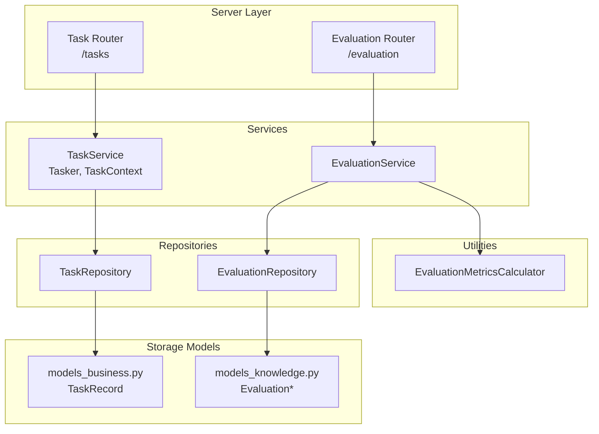
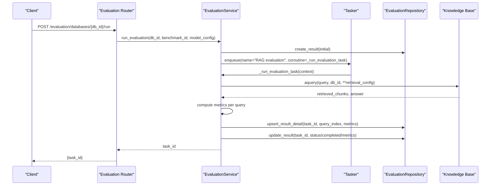
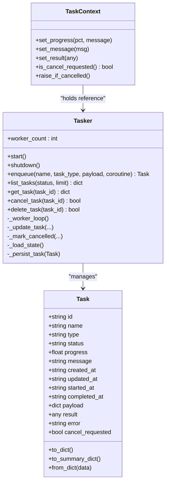
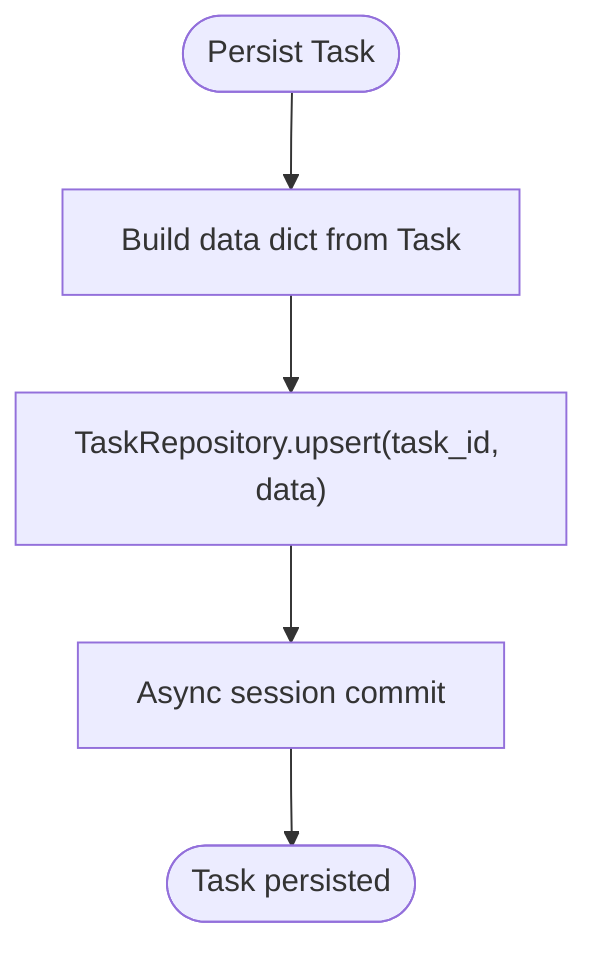
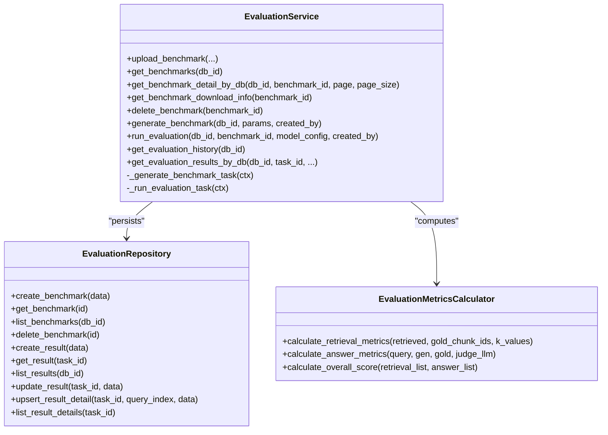
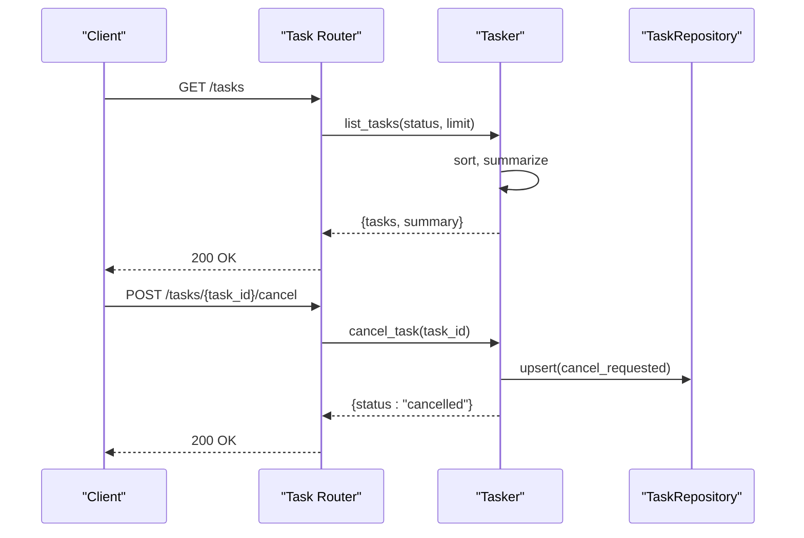
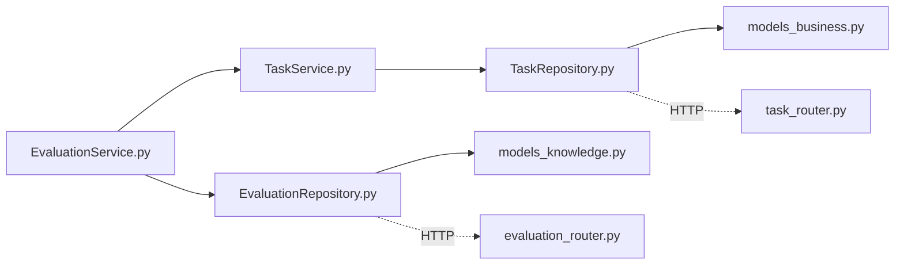

# Task and Evaluation Services

<cite>
**Referenced Files in This Document**
- [task_service.py](file://backend/package/yuxi/services/task_service.py)
- [task_repository.py](file://backend/package/yuxi/repositories/task_repository.py)
- [evaluation_service.py](file://backend/package/yuxi/services/evaluation_service.py)
- [evaluation_repository.py](file://backend/package/yuxi/repositories/evaluation_repository.py)
- [evaluation_metrics.py](file://backend/package/yuxi/utils/evaluation_metrics.py)
- [task_router.py](file://backend/server/routers/task_router.py)
- [evaluation_router.py](file://backend/server/routers/evaluation_router.py)
- [models_business.py](file://backend/package/yuxi/storage/postgres/models_business.py)
- [models_knowledge.py](file://backend/package/yuxi/storage/postgres/models_knowledge.py)
- [run_queue_service.py](file://backend/package/yuxi/services/run_queue_service.py)
- [test_task_router.py](file://backend/test/integration/api/test_task_router.py)
- [test_evaluation_router.py](file://backend/test/integration/api/test_evaluation_router.py)
</cite>

## Table of Contents
1. [Introduction](#introduction)
2. [Project Structure](#project-structure)
3. [Core Components](#core-components)
4. [Architecture Overview](#architecture-overview)
5. [Detailed Component Analysis](#detailed-component-analysis)
6. [Dependency Analysis](#dependency-analysis)
7. [Performance Considerations](#performance-considerations)
8. [Troubleshooting Guide](#troubleshooting-guide)
9. [Conclusion](#conclusion)
10. [Appendices](#appendices)

## Introduction
This document describes the Task and Evaluation Services that power automated workflows and performance assessment in the system. It covers:
- Task scheduling and execution framework: task definition, lifecycle, progress tracking, cancellation, and persistence.
- Evaluation system for RAG performance: benchmarking, metrics computation, result aggregation, and reporting.
- Repository patterns for persistence: status tracking, historical data, and cleanup.
- Integration with agent runs, performance metrics collection, and automated testing workflows.
- Examples of task creation, execution monitoring, and evaluation scoring.
- Task queuing, retry mechanisms, and evaluation data analysis.

## Project Structure
The Task and Evaluation Services are implemented as Python packages with clear separation of concerns:
- Services encapsulate business logic for task orchestration and evaluation.
- Repositories abstract persistence against PostgreSQL models.
- Routers expose REST endpoints for external clients.
- Utilities provide metrics calculation helpers.
- Tests validate integration and behavior.

**Diagram sources**
- [task_router.py:1-45](file://backend/server/routers/task_router.py#L1-L45)
- [evaluation_router.py:1-227](file://backend/server/routers/evaluation_router.py#L1-L227)
- [task_service.py:95-339](file://backend/package/yuxi/services/task_service.py#L95-L339)
- [evaluation_service.py:18-853](file://backend/package/yuxi/services/evaluation_service.py#L18-L853)
- [task_repository.py:11-52](file://backend/package/yuxi/repositories/task_repository.py#L11-L52)
- [evaluation_repository.py:11-119](file://backend/package/yuxi/repositories/evaluation_repository.py#L11-L119)
- [models_business.py:528-570](file://backend/package/yuxi/storage/postgres/models_business.py#L528-L570)
- [models_knowledge.py:74-139](file://backend/package/yuxi/storage/postgres/models_knowledge.py#L74-L139)
- [evaluation_metrics.py:95-153](file://backend/package/yuxi/utils/evaluation_metrics.py#L95-L153)

**Section sources**
- [task_service.py:1-339](file://backend/package/yuxi/services/task_service.py#L1-L339)
- [evaluation_service.py:1-853](file://backend/package/yuxi/services/evaluation_service.py#L1-L853)
- [task_repository.py:1-52](file://backend/package/yuxi/repositories/task_repository.py#L1-L52)
- [evaluation_repository.py:1-119](file://backend/package/yuxi/repositories/evaluation_repository.py#L1-L119)
- [models_business.py:528-570](file://backend/package/yuxi/storage/postgres/models_business.py#L528-L570)
- [models_knowledge.py:74-139](file://backend/package/yuxi/storage/postgres/models_knowledge.py#L74-L139)
- [evaluation_metrics.py:1-153](file://backend/package/yuxi/utils/evaluation_metrics.py#L1-L153)
- [task_router.py:1-45](file://backend/server/routers/task_router.py#L1-L45)
- [evaluation_router.py:1-227](file://backend/server/routers/evaluation_router.py#L1-L227)

## Core Components
- Tasker and TaskContext: asynchronous task executor with progress, cancellation, and persistence hooks.
- TaskRepository: CRUD and list operations for TaskRecord.
- EvaluationService: orchestrates benchmark generation and RAG evaluation, integrates with knowledge base and metrics.
- EvaluationRepository: manages EvaluationBenchmark, EvaluationResult, and EvaluationResultDetail.
- EvaluationMetricsCalculator: computes retrieval and answer metrics and overall score.
- Routers: FastAPI endpoints for task listing/cancellation/deletion and evaluation benchmark/result management.

Key capabilities:
- Enqueue arbitrary coroutines as tasks with typed payloads.
- Track progress and status in-memory and persist to Postgres.
- Cancel tasks gracefully via TaskContext checks.
- Compute retrieval metrics (Recall@K, F1@K) and answer correctness via LLM judge.
- Stream evaluation progress via Tasker result updates.

**Section sources**
- [task_service.py:95-339](file://backend/package/yuxi/services/task_service.py#L95-L339)
- [task_repository.py:11-52](file://backend/package/yuxi/repositories/task_repository.py#L11-L52)
- [evaluation_service.py:18-853](file://backend/package/yuxi/services/evaluation_service.py#L18-L853)
- [evaluation_repository.py:11-119](file://backend/package/yuxi/repositories/evaluation_repository.py#L11-L119)
- [evaluation_metrics.py:95-153](file://backend/package/yuxi/utils/evaluation_metrics.py#L95-L153)

## Architecture Overview
The system uses a hybrid architecture:
- Synchronous API layer (FastAPI routers) delegates work to asynchronous services.
- Tasker runs tasks concurrently using asyncio queues and locks.
- EvaluationService coordinates knowledge base queries, model calls, and metrics computation.
- Repositories persist structured data to PostgreSQL with SQLAlchemy ORM models.

**Diagram sources**
- [evaluation_router.py:196-213](file://backend/server/routers/evaluation_router.py#L196-L213)
- [evaluation_service.py:461-522](file://backend/package/yuxi/services/evaluation_service.py#L461-L522)
- [evaluation_service.py:523-751](file://backend/package/yuxi/services/evaluation_service.py#L523-L751)
- [evaluation_repository.py:49-77](file://backend/package/yuxi/repositories/evaluation_repository.py#L49-L77)
- [task_service.py:127-142](file://backend/package/yuxi/services/task_service.py#L127-L142)

## Detailed Component Analysis

### Task Execution Framework
- Task data model: immutable fields plus mutable state (progress, status, timestamps, result/error).
- Tasker:
  - Maintains an in-memory state and an asyncio queue.
  - Starts N worker tasks; each pulls a task and executes its coroutine.
  - Updates persisted state atomically under a lock.
  - Supports cancellation via cancel_requested flag and TaskContext.is_cancel_requested.
- Persistence:
  - Upserts TaskRecord on each state change.
  - Loads persisted tasks on startup and transitions stale running tasks to failed.

**Diagram sources**
- [task_service.py:23-67](file://backend/package/yuxi/services/task_service.py#L23-L67)
- [task_service.py:69-93](file://backend/package/yuxi/services/task_service.py#L69-L93)
- [task_service.py:95-339](file://backend/package/yuxi/services/task_service.py#L95-L339)

**Section sources**
- [task_service.py:95-339](file://backend/package/yuxi/services/task_service.py#L95-L339)
- [models_business.py:528-570](file://backend/package/yuxi/storage/postgres/models_business.py#L528-L570)

### Task Persistence and Status Tracking
- TaskRepository:
  - get_by_id, list, list_all, upsert, delete.
  - Uses async SQLAlchemy sessions and TaskRecord model.
- Status lifecycle:
  - pending -> running -> success/failed/cancelled.
  - On restart, running tasks are marked failed to prevent orphaned states.

**Diagram sources**
- [task_service.py:316-332](file://backend/package/yuxi/services/task_service.py#L316-L332)
- [task_repository.py:31-41](file://backend/package/yuxi/repositories/task_repository.py#L31-L41)
- [models_business.py:528-570](file://backend/package/yuxi/storage/postgres/models_business.py#L528-L570)

**Section sources**
- [task_repository.py:11-52](file://backend/package/yuxi/repositories/task_repository.py#L11-L52)
- [models_business.py:528-570](file://backend/package/yuxi/storage/postgres/models_business.py#L528-L570)

### Evaluation Orchestration and Metrics
- EvaluationService:
  - Benchmark management: upload, generate, list, detail, download, delete.
  - Evaluation run: creates result record, enqueues task, streams progress via Tasker result.
  - Metrics: retrieval (Recall@K, F1@K), answer correctness via LLM judge, overall score average.
- EvaluationRepository:
  - Benchmarks, results, and per-query details stored separately for auditability.
- Metrics calculator:
  - RetrievalMetrics: precision/recall/F1 at K.
  - AnswerMetrics: LLM-based judge correctness.
  - Overall score: arithmetic mean across all metrics.

**Diagram sources**
- [evaluation_service.py:18-853](file://backend/package/yuxi/services/evaluation_service.py#L18-L853)
- [evaluation_repository.py:11-119](file://backend/package/yuxi/repositories/evaluation_repository.py#L11-L119)
- [evaluation_metrics.py:95-153](file://backend/package/yuxi/utils/evaluation_metrics.py#L95-L153)

**Section sources**
- [evaluation_service.py:18-853](file://backend/package/yuxi/services/evaluation_service.py#L18-L853)
- [evaluation_repository.py:11-119](file://backend/package/yuxi/repositories/evaluation_repository.py#L11-L119)
- [evaluation_metrics.py:1-153](file://backend/package/yuxi/utils/evaluation_metrics.py#L1-L153)
- [models_knowledge.py:74-139](file://backend/package/yuxi/storage/postgres/models_knowledge.py#L74-L139)

### API Workflows and Monitoring
- Task endpoints:
  - GET /tasks: list with counts and summaries.
  - GET /tasks/{task_id}: fetch task details.
  - POST /tasks/{task_id}/cancel: request cancellation.
  - DELETE /tasks/{task_id}: delete task.
- Evaluation endpoints:
  - Upload/download benchmarks.
  - Generate benchmarks programmatically.
  - Run evaluation and fetch results/history.

**Diagram sources**
- [task_router.py:10-45](file://backend/server/routers/task_router.py#L10-L45)
- [task_service.py:144-187](file://backend/package/yuxi/services/task_service.py#L144-L187)
- [task_repository.py:31-41](file://backend/package/yuxi/repositories/task_repository.py#L31-L41)

**Section sources**
- [task_router.py:1-45](file://backend/server/routers/task_router.py#L1-L45)
- [evaluation_router.py:1-227](file://backend/server/routers/evaluation_router.py#L1-L227)

### Integration with Agent Runs and Automated Testing
- Agent runs and tasks coexist; tasks are tracked independently with their own lifecycle and persistence.
- Automated tests validate:
  - Access control for task routes (admin-only).
  - Task creation and visibility in list/detail endpoints.
  - Evaluation benchmark upload/download and run workflow.

**Section sources**
- [test_task_router.py:1-123](file://backend/test/integration/api/test_task_router.py#L1-L123)
- [test_evaluation_router.py:1-62](file://backend/test/integration/api/test_evaluation_router.py#L1-L62)

## Dependency Analysis
- Tasker depends on TaskRepository and uses asyncio primitives for concurrency.
- EvaluationService depends on Tasker for queued execution, Knowledge Base for retrieval, and EvaluationRepository for persistence.
- Both services depend on SQLAlchemy models for persistence and FastAPI routers for API exposure.

**Diagram sources**
- [task_service.py:95-339](file://backend/package/yuxi/services/task_service.py#L95-L339)
- [task_repository.py:11-52](file://backend/package/yuxi/repositories/task_repository.py#L11-L52)
- [models_business.py:528-570](file://backend/package/yuxi/storage/postgres/models_business.py#L528-L570)
- [evaluation_service.py:18-853](file://backend/package/yuxi/services/evaluation_service.py#L18-L853)
- [evaluation_repository.py:11-119](file://backend/package/yuxi/repositories/evaluation_repository.py#L11-L119)
- [models_knowledge.py:74-139](file://backend/package/yuxi/storage/postgres/models_knowledge.py#L74-L139)
- [task_router.py:1-45](file://backend/server/routers/task_router.py#L1-L45)
- [evaluation_router.py:1-227](file://backend/server/routers/evaluation_router.py#L1-L227)

**Section sources**
- [task_service.py:95-339](file://backend/package/yuxi/services/task_service.py#L95-L339)
- [evaluation_service.py:18-853](file://backend/package/yuxi/services/evaluation_service.py#L18-L853)
- [task_repository.py:11-52](file://backend/package/yuxi/repositories/task_repository.py#L11-L52)
- [evaluation_repository.py:11-119](file://backend/package/yuxi/repositories/evaluation_repository.py#L11-L119)

## Performance Considerations
- Concurrency: Tasker spawns N workers; tune worker_count based on CPU and I/O characteristics.
- Persistence overhead: Each state change persists; batching updates (e.g., periodic flush) could reduce write amplification.
- Evaluation embedding cost: Generating benchmarks re-embeds all chunks; consider caching or reusing embeddings for large knowledge bases.
- Metrics computation: LLM judge calls are expensive; cache judgements when inputs are identical and avoid redundant calls.
- Queue pressure: Monitor queue length and worker lag; scale horizontally if needed.

## Troubleshooting Guide
Common issues and resolutions:
- Task stuck in running after restart:
  - Cause: Service interruption mid-execution.
  - Resolution: Tasker loads persisted tasks and marks stale running tasks as failed on startup.
- Cancellation not taking effect:
  - Cause: Coroutine does not check TaskContext.is_cancel_requested or raise CancelledError.
  - Resolution: Ensure periodic checks using TaskContext.raise_if_cancelled.
- Evaluation fails due to missing judge model:
  - Cause: No judge_llm configured when gold answers exist.
  - Resolution: Provide judge_llm in retrieval_config or disable answer metrics.
- Benchmark file not found:
  - Cause: Deleted or moved data file.
  - Resolution: Recreate benchmark or restore file; verify data_file_path integrity.

Operational tips:
- Use GET /tasks/{task_id} to inspect progress and error messages.
- Use GET /evaluation/databases/{db_id}/history to review past runs.
- For evaluation results, use GET /evaluation/databases/{db_id}/results/{task_id} with pagination.

**Section sources**
- [task_service.py:295-314](file://backend/package/yuxi/services/task_service.py#L295-L314)
- [evaluation_service.py:560-570](file://backend/package/yuxi/services/evaluation_service.py#L560-L570)
- [evaluation_service.py:738-750](file://backend/package/yuxi/services/evaluation_service.py#L738-L750)

## Conclusion
The Task and Evaluation Services provide a robust foundation for asynchronous workflows and performance assessment:
- Tasks are scheduled, executed, monitored, and persisted reliably.
- Evaluations integrate retrieval and answer quality metrics with configurable LLM judges.
- The architecture supports scalability, observability, and maintainability through clear separation of concerns and persistent state.

## Appendices

### Example Workflows

- Create a task and monitor progress:
  - Enqueue a coroutine via Tasker.enqueue.
  - Poll GET /tasks/{task_id} until terminal status.
  - Optionally cancel via POST /tasks/{task_id}/cancel.

- Generate and run an evaluation:
  - Upload or generate a benchmark.
  - Run evaluation via POST /evaluation/databases/{db_id}/run.
  - Stream progress via Tasker result updates and fetch final metrics via GET /evaluation/databases/{db_id}/results/{task_id}.

- Analyze evaluation data:
  - Use GET /evaluation/databases/{db_id}/history for historical runs.
  - Inspect per-query details and aggregated metrics in EvaluationResultDetail and EvaluationResult.

**Section sources**
- [task_router.py:10-45](file://backend/server/routers/task_router.py#L10-L45)
- [evaluation_router.py:196-227](file://backend/server/routers/evaluation_router.py#L196-L227)
- [evaluation_service.py:523-751](file://backend/package/yuxi/services/evaluation_service.py#L523-L751)