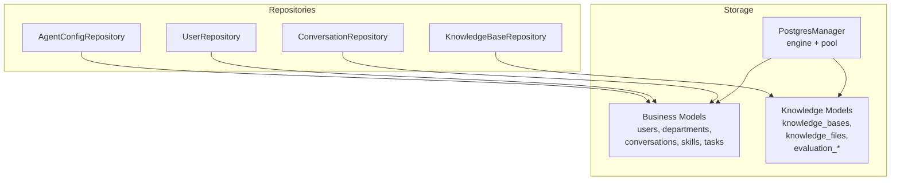
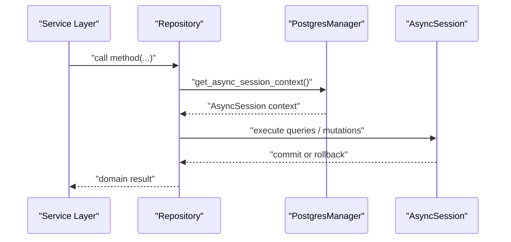
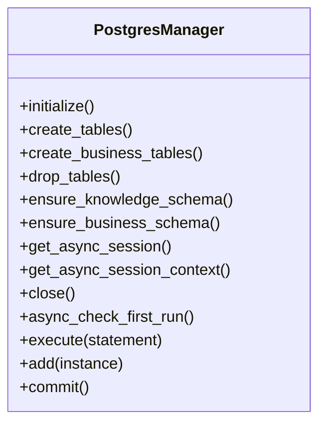
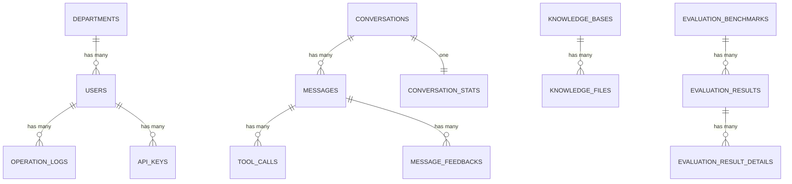
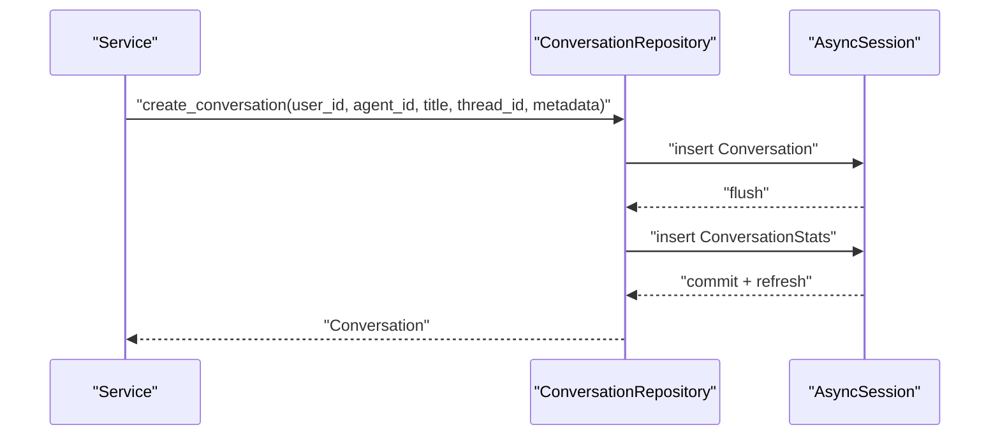
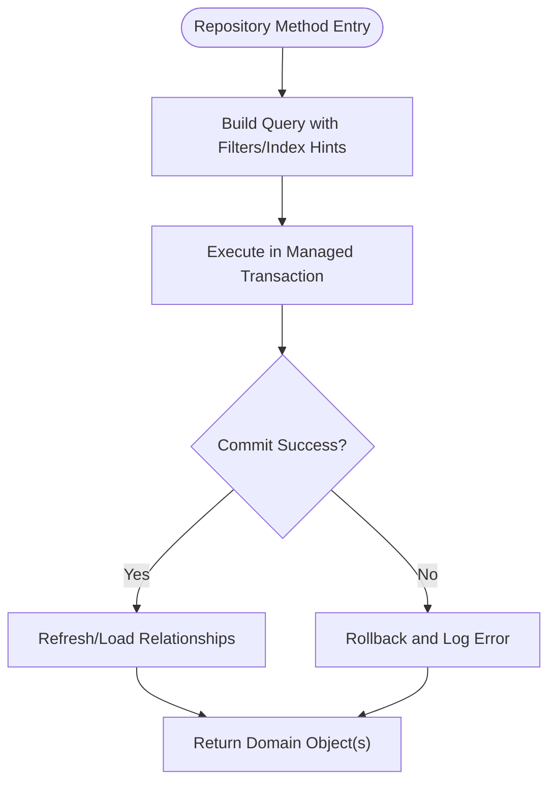
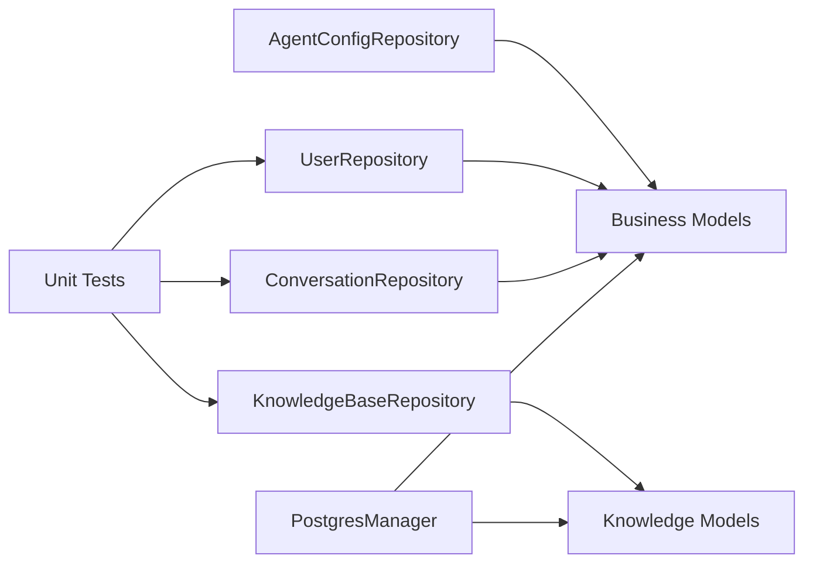

# Data Access Layer & Repository Pattern

<cite>
**Referenced Files in This Document**
- [manager.py](file://backend/package/yuxi/storage/postgres/manager.py)
- [models_business.py](file://backend/package/yuxi/storage/postgres/models_business.py)
- [models_knowledge.py](file://backend/package/yuxi/storage/postgres/models_knowledge.py)
- [conversation_repository.py](file://backend/package/yuxi/repositories/conversation_repository.py)
- [user_repository.py](file://backend/package/yuxi/repositories/user_repository.py)
- [knowledge_base_repository.py](file://backend/package/yuxi/repositories/knowledge_base_repository.py)
- [agent_config_repository.py](file://backend/package/yuxi/repositories/agent_config_repository.py)
- [test_conversation_repository.py](file://backend/test/unit/storage/test_conversation_repository.py)
</cite>

## Table of Contents
1. [Introduction](#introduction)
2. [Project Structure](#project-structure)
3. [Core Components](#core-components)
4. [Architecture Overview](#architecture-overview)
5. [Detailed Component Analysis](#detailed-component-analysis)
6. [Dependency Analysis](#dependency-analysis)
7. [Performance Considerations](#performance-considerations)
8. [Troubleshooting Guide](#troubleshooting-guide)
9. [Conclusion](#conclusion)
10. [Appendices](#appendices)

## Introduction
This document describes the data access layer implementing the repository pattern for Yuxi’s backend. It covers PostgreSQL integration via SQLAlchemy and asyncpg, ORM models for both business and knowledge domains, and repository classes that encapsulate CRUD and query operations. It also documents schema relationships, indexing strategies, migration procedures, connection pooling, transaction management, and validation patterns. Practical usage examples and performance optimization techniques are included to guide developers building on or extending the system.

## Project Structure
The data access layer is organized around:
- A shared PostgreSQL manager that initializes async SQLAlchemy engine and a dedicated connection pool for LangGraph checkpoints
- Two sets of ORM models: business domain (users, departments, conversations, skills, tasks, etc.) and knowledge domain (knowledge bases, files, evaluations)
- Repository classes per domain that encapsulate persistence logic and expose typed operations

**Diagram sources**
- [manager.py:28-291](file://backend/package/yuxi/storage/postgres/manager.py#L28-L291)
- [models_business.py:29-706](file://backend/package/yuxi/storage/postgres/models_business.py#L29-L706)
- [models_knowledge.py:23-139](file://backend/package/yuxi/storage/postgres/models_knowledge.py#L23-L139)
- [conversation_repository.py:18-464](file://backend/package/yuxi/repositories/conversation_repository.py#L18-L464)
- [user_repository.py:16-148](file://backend/package/yuxi/repositories/user_repository.py#L16-L148)
- [knowledge_base_repository.py:11-44](file://backend/package/yuxi/repositories/knowledge_base_repository.py#L11-L44)
- [agent_config_repository.py:13-230](file://backend/package/yuxi/repositories/agent_config_repository.py#L13-L230)

**Section sources**
- [manager.py:28-291](file://backend/package/yuxi/storage/postgres/manager.py#L28-L291)
- [models_business.py:29-706](file://backend/package/yuxi/storage/postgres/models_business.py#L29-L706)
- [models_knowledge.py:23-139](file://backend/package/yuxi/storage/postgres/models_knowledge.py#L23-L139)

## Core Components
- PostgreSQL Manager
  - Initializes async SQLAlchemy engine with JSON serialization hooks and pool pre-ping/recycle
  - Creates a dedicated async connection pool for LangGraph checkpoints with autocommit enabled
  - Provides table creation/drop and schema migration helpers for both business and knowledge domains
  - Exposes async session factory and context manager for safe transactions
- Business Models
  - Departments, Users, AgentConfigs, Skills, Conversations, Messages, ToolCalls, ConversationStats, OperationLogs, MessageFeedback, MCPServers, Tasks, SubAgents, APIKeys, AgentRuns
- Knowledge Models
  - KnowledgeBase, KnowledgeFile, EvaluationBenchmark, EvaluationResult, EvaluationResultDetail
- Repositories
  - ConversationRepository: manage threads, messages, tool calls, stats, and attachments
  - UserRepository: CRUD and queries for users with soft-delete semantics
  - KnowledgeBaseRepository: CRUD for knowledge bases
  - AgentConfigRepository: manage agent configurations with default selection and uniqueness enforcement

**Section sources**
- [manager.py:40-291](file://backend/package/yuxi/storage/postgres/manager.py#L40-L291)
- [models_business.py:29-706](file://backend/package/yuxi/storage/postgres/models_business.py#L29-L706)
- [models_knowledge.py:23-139](file://backend/package/yuxi/storage/postgres/models_knowledge.py#L23-L139)
- [conversation_repository.py:18-464](file://backend/package/yuxi/repositories/conversation_repository.py#L18-L464)
- [user_repository.py:16-148](file://backend/package/yuxi/repositories/user_repository.py#L16-L148)
- [knowledge_base_repository.py:11-44](file://backend/package/yuxi/repositories/knowledge_base_repository.py#L11-L44)
- [agent_config_repository.py:13-230](file://backend/package/yuxi/repositories/agent_config_repository.py#L13-L230)

## Architecture Overview
The repository pattern isolates persistence concerns behind typed interfaces. Repositories receive an async SQLAlchemy session and operate within managed transactions. The manager centralizes connection configuration and provides a context manager to ensure commit/rollback semantics.

**Diagram sources**
- [manager.py:235-248](file://backend/package/yuxi/storage/postgres/manager.py#L235-L248)
- [conversation_repository.py:35-69](file://backend/package/yuxi/repositories/conversation_repository.py#L35-L69)
- [user_repository.py:71-78](file://backend/package/yuxi/repositories/user_repository.py#L71-L78)

## Detailed Component Analysis

### PostgreSQL Manager
Responsibilities:
- Initialize async SQLAlchemy engine with JSON serializer/deserializer and pool settings
- Create a dedicated async connection pool for LangGraph with autocommit
- Provide table lifecycle operations (create/drop) and schema migration helpers
- Offer async session factory and context manager with automatic commit/rollback

Key behaviors:
- Environment-driven database URL for knowledge base database
- Combined metadata registration to unify business and knowledge models under one Base
- Schema migration statements for evolving fields and indexes
- Safe-first-run check by inspecting user table count

**Diagram sources**
- [manager.py:28-291](file://backend/package/yuxi/storage/postgres/manager.py#L28-L291)

**Section sources**
- [manager.py:40-291](file://backend/package/yuxi/storage/postgres/manager.py#L40-L291)

### Business Domain Models
Highlights:
- Departments and Users with soft-deleted semantics and login lockout controls
- AgentConfig with unique constraints enforcing one default per department-agent pair
- Conversations with pinned flag and metadata; Messages with tool-call and feedback relationships
- ToolCall and ConversationStats for execution tracking and analytics
- Skills, SubAgents, MCPServers, Tasks, APIKeys, AgentRuns for orchestration and administration
- OperationLog for audit trails

Indexing and constraints:
- Extensive indexes on foreign keys, unique identifiers, and frequently filtered fields
- Unique constraints on db_id for knowledge entities and composite constraints for agent configs

**Diagram sources**
- [models_business.py:29-706](file://backend/package/yuxi/storage/postgres/models_business.py#L29-L706)
- [models_knowledge.py:23-139](file://backend/package/yuxi/storage/postgres/models_knowledge.py#L23-L139)

**Section sources**
- [models_business.py:29-706](file://backend/package/yuxi/storage/postgres/models_business.py#L29-L706)
- [models_knowledge.py:23-139](file://backend/package/yuxi/storage/postgres/models_knowledge.py#L23-L139)

### ConversationRepository
Capabilities:
- Create conversations with normalized titles and default metadata
- Add messages and tool calls with deduplication by LangGraph tool call id
- Load conversations with eager loading of messages and feedbacks
- List conversations prioritizing pinned items
- Update conversation metadata, pinning, and status
- Manage attachments stored in conversation metadata
- Update stats counters and handle token usage
- Soft-delete conversations

Optimization techniques:
- selectinload for message relationships to reduce N+1 queries
- Index-aware ordering by updated_at and pinned flag
- Idempotent tool call insertion by LangGraph id

**Diagram sources**
- [conversation_repository.py:35-69](file://backend/package/yuxi/repositories/conversation_repository.py#L35-L69)

**Section sources**
- [conversation_repository.py:18-464](file://backend/package/yuxi/repositories/conversation_repository.py#L18-L464)

### UserRepository
Capabilities:
- Fetch users by id, user_id, or phone number
- List users with optional filters and joins to department names
- Create, update, and soft-delete users
- Existence checks and counts with department and role filters
- Retrieve all user ids and count admins in a department

Validation patterns:
- Soft-delete by setting is_deleted and clearing sensitive fields
- Normalized timestamps using naive UTC conversion for PostgreSQL compatibility

**Section sources**
- [user_repository.py:16-148](file://backend/package/yuxi/repositories/user_repository.py#L16-L148)

### KnowledgeBaseRepository
Capabilities:
- List, fetch by db_id, create, update, and delete knowledge bases

Usage pattern:
- Uses global PostgresManager context for all operations

**Section sources**
- [knowledge_base_repository.py:11-44](file://backend/package/yuxi/repositories/knowledge_base_repository.py#L11-L44)

### AgentConfigRepository
Capabilities:
- List configurations by department and agent
- Set/get default configuration with atomic updates
- Ensure unique names with suffixing
- Create/update/delete configurations with audit fields

Constraints:
- Unique constraint ensures only one default per department-agent pair
- Composite indexes support efficient lookups

**Section sources**
- [agent_config_repository.py:13-230](file://backend/package/yuxi/repositories/agent_config_repository.py#L13-L230)

### Conceptual Overview
The repository pattern centralizes persistence logic, enabling:
- Clear separation between service logic and database operations
- Consistent transaction boundaries via the manager’s context
- Reusable query patterns and validations
- Easy testing by swapping sessions or mocking repositories

[No sources needed since this diagram shows conceptual workflow, not actual code structure]

## Dependency Analysis
- Repositories depend on:
  - AsyncSession from PostgresManager
  - ORM models from business and knowledge domains
- Managers coordinate:
  - Engine initialization and connection pooling
  - Schema migrations and table lifecycle
- Tests validate repository behavior against real models

**Diagram sources**
- [manager.py:28-291](file://backend/package/yuxi/storage/postgres/manager.py#L28-L291)
- [conversation_repository.py:18-464](file://backend/package/yuxi/repositories/conversation_repository.py#L18-L464)
- [user_repository.py:16-148](file://backend/package/yuxi/repositories/user_repository.py#L16-L148)
- [knowledge_base_repository.py:11-44](file://backend/package/yuxi/repositories/knowledge_base_repository.py#L11-L44)
- [test_conversation_repository.py](file://backend/test/unit/storage/test_conversation_repository.py)

**Section sources**
- [manager.py:28-291](file://backend/package/yuxi/storage/postgres/manager.py#L28-L291)
- [conversation_repository.py:18-464](file://backend/package/yuxi/repositories/conversation_repository.py#L18-L464)
- [user_repository.py:16-148](file://backend/package/yuxi/repositories/user_repository.py#L16-L148)
- [knowledge_base_repository.py:11-44](file://backend/package/yuxi/repositories/knowledge_base_repository.py#L11-L44)
- [test_conversation_repository.py](file://backend/test/unit/storage/test_conversation_repository.py)

## Performance Considerations
- Connection pooling
  - Async engine configured with pre-ping and recycle to maintain healthy connections
  - Dedicated pool for LangGraph checkpoints with autocommit to satisfy checkpoint requirements
- Indexing strategies
  - Business: indexes on user identifiers, department foreign keys, conversation pinned flag, task status, agent runs user/thread/status
  - Knowledge: indexes on db_id, parent_id, status, content_hash, evaluation result status and timestamps
- Query optimization
  - selectinload for relationships to avoid N+1 selects
  - Limit/offset applied after pinned items to ensure pinned conversations remain visible
  - JSON fields stored as JSONB for knowledge models to leverage PostgreSQL-specific optimizations
- Transaction management
  - Context manager ensures commit or rollback; avoid long-running transactions
  - Batch operations grouped within a single transaction where appropriate

[No sources needed since this section provides general guidance]

## Troubleshooting Guide
Common issues and resolutions:
- Initialization failures
  - Verify POSTGRES_URL environment variable is set and reachable
  - Check logs for initialization errors and ensure database is running
- Migration errors
  - Run schema migration helpers to add missing columns and indexes
  - Confirm table ownership and permissions for migration statements
- Transaction anomalies
  - Ensure repository methods are executed within the manager’s session context
  - Handle exceptions to trigger rollback and log errors
- Query performance
  - Confirm indexes exist for filtered fields (user_id, thread_id, status)
  - Use limit/offset judiciously and prefer indexed ordering

**Section sources**
- [manager.py:40-90](file://backend/package/yuxi/storage/postgres/manager.py#L40-L90)
- [manager.py:119-221](file://backend/package/yuxi/storage/postgres/manager.py#L119-L221)

## Conclusion
Yuxi’s data access layer cleanly separates persistence concerns through repositories backed by a robust PostgreSQL manager. The combination of async SQLAlchemy, careful indexing, and explicit transaction management enables scalable and maintainable data operations across business and knowledge domains. Repositories encapsulate domain-specific logic, ensuring consistent validations, query patterns, and performance characteristics.

## Appendices

### Database Schema Relationships
- Departments ↔ Users (one-to-many)
- Users ↔ APIKeys (one-to-many)
- Users ↔ OperationLogs (one-to-many)
- Conversations ↔ Messages (one-to-many)
- Conversations ↔ ConversationStats (one-to-one)
- Messages ↔ ToolCalls (one-to-many)
- Messages ↔ MessageFeedbacks (one-to-many)
- KnowledgeBases ↔ KnowledgeFiles (one-to-many, cascading deletes)
- EvaluationBenchmarks ↔ EvaluationResults (one-to-many)
- EvaluationResults ↔ EvaluationResultDetails (one-to-many)

**Section sources**
- [models_business.py:29-706](file://backend/package/yuxi/storage/postgres/models_business.py#L29-L706)
- [models_knowledge.py:23-139](file://backend/package/yuxi/storage/postgres/models_knowledge.py#L23-L139)

### Migration Procedures
- Business schema migrations
  - Add new columns and indexes for skills, subagents, conversations, MCP servers, agent runs
  - Create agent_runs table with supporting indexes
- Knowledge schema migrations
  - Add JSONB fields for embeddings and metadata
  - Extend file metadata with processing params, content hash, size, and status
  - Adjust db_id length to accommodate longer identifiers
  - Create indexes on knowledge-related fields for performance

**Section sources**
- [manager.py:119-221](file://backend/package/yuxi/storage/postgres/manager.py#L119-L221)

### Storage Manager Architecture
- Async SQLAlchemy engine with JSON serialization hooks
- Combined metadata registry for unified table discovery
- Dedicated LangGraph pool with autocommit for checkpoint compatibility
- Session context manager for consistent commit/rollback semantics

**Section sources**
- [manager.py:28-291](file://backend/package/yuxi/storage/postgres/manager.py#L28-L291)

### Examples of Repository Usage
- Creating a conversation and initial stats
  - See [conversation_repository.py:35-69](file://backend/package/yuxi/repositories/conversation_repository.py#L35-L69)
- Adding a message to a conversation
  - See [conversation_repository.py:105-134](file://backend/package/yuxi/repositories/conversation_repository.py#L105-L134)
- Listing conversations with pinned items prioritized
  - See [conversation_repository.py:222-278](file://backend/package/yuxi/repositories/conversation_repository.py#L222-L278)
- Creating a user
  - See [user_repository.py:71-78](file://backend/package/yuxi/repositories/user_repository.py#L71-L78)
- Managing agent configurations with defaults
  - See [agent_config_repository.py:29-52](file://backend/package/yuxi/repositories/agent_config_repository.py#L29-L52)