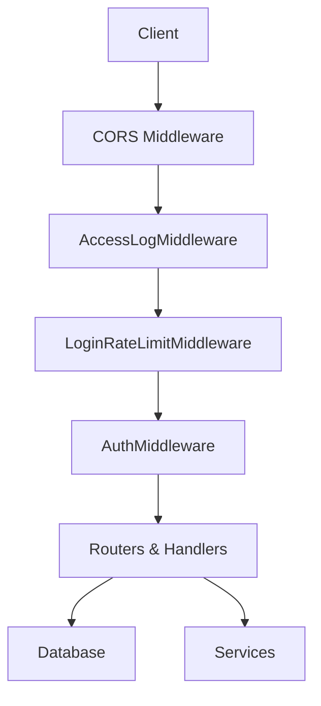
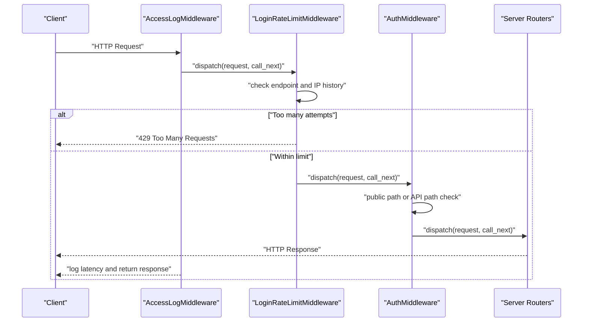
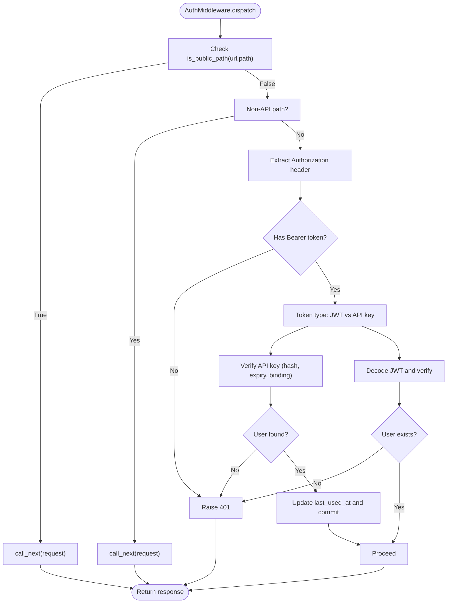
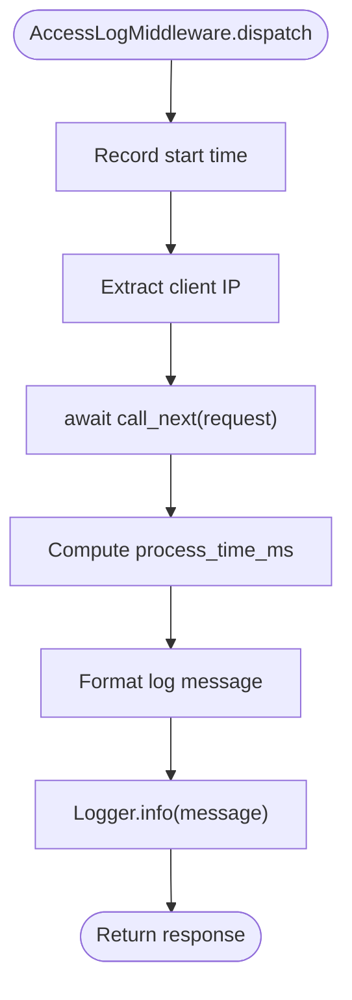
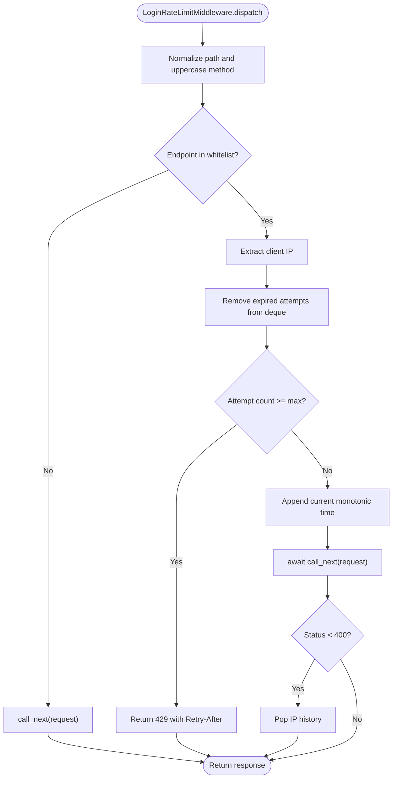
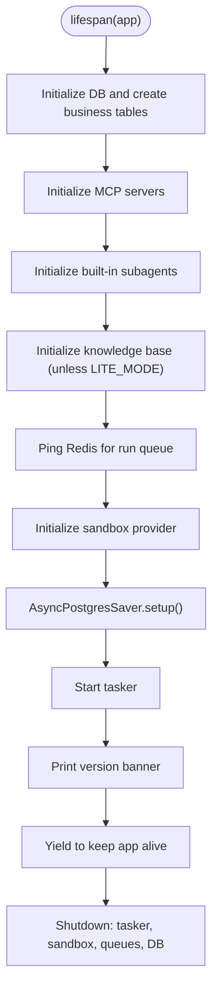
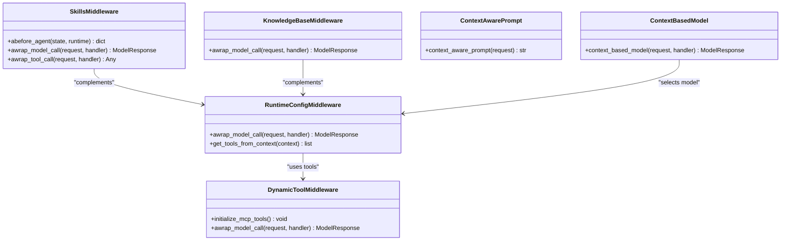
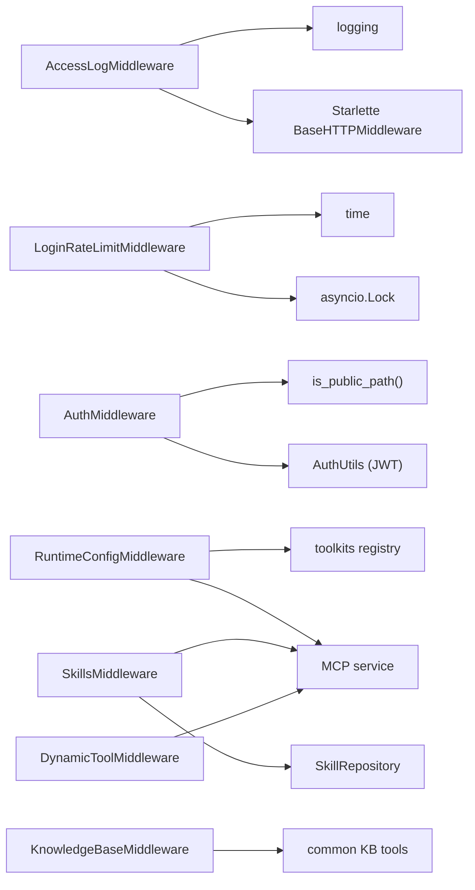

# Middleware & Request Processing

<cite>
**Referenced Files in This Document**
- [auth_middleware.py](file://backend/server/utils/auth_middleware.py)
- [access_log_middleware.py](file://backend/server/utils/access_log_middleware.py)
- [lifespan.py](file://backend/server/utils/lifespan.py)
- [main.py](file://backend/server/main.py)
- [context_middlewares.py](file://backend/package/yuxi/agents/middlewares/context_middlewares.py)
- [runtime_config_middleware.py](file://backend/package/yuxi/agents/middlewares/runtime_config_middleware.py)
- [skills_middleware.py](file://backend/package/yuxi/agents/middlewares/skills_middleware.py)
- [knowledge_base_middleware.py](file://backend/package/yuxi/agents/middlewares/knowledge_base_middleware.py)
- [dynamic_tool_middleware.py](file://backend/package/yuxi/agents/middlewares/dynamic_tool_middleware.py)
</cite>

## Table of Contents
1. [Introduction](#introduction)
2. [Project Structure](#project-structure)
3. [Core Components](#core-components)
4. [Architecture Overview](#architecture-overview)
5. [Detailed Component Analysis](#detailed-component-analysis)
6. [Dependency Analysis](#dependency-analysis)
7. [Performance Considerations](#performance-considerations)
8. [Troubleshooting Guide](#troubleshooting-guide)
9. [Conclusion](#conclusion)
10. [Appendices](#appendices)

## Introduction
This document explains Yuxi’s middleware stack and request processing pipeline. It focuses on authentication middleware, access logging with timing metrics, rate limiting for login attempts, and request preprocessing mechanisms. It also covers middleware chain execution order, request/response transformation, error propagation strategies, security considerations, performance impact, customization patterns, and debugging techniques.

## Project Structure
The HTTP request lifecycle in the backend is orchestrated by FastAPI with Starlette-compatible middleware. The server wires:
- CORS
- Access logging middleware
- Login rate limit middleware
- Authentication middleware
- Application lifespan hooks

Agent-side middleware operates within LangChain agent execution and is orthogonal to HTTP middleware.

**Diagram sources**
- [main.py:44-137](file://backend/server/main.py#L44-L137)

**Section sources**
- [main.py:40-150](file://backend/server/main.py#L40-L150)

## Core Components
- Authentication middleware: Validates tokens and API keys, enforces role checks, and supports public paths.
- Access logging middleware: Records request method, path, status code, and processing time.
- Login rate limit middleware: Enforces per-IP limits for login endpoint to mitigate brute force.
- Request preprocessing: Public path detection and early bypass for unauthenticated routes.
- Lifespan management: Initializes database, knowledge base, MCP servers, and queues.

**Section sources**
- [auth_middleware.py:15-169](file://backend/server/utils/auth_middleware.py#L15-L169)
- [access_log_middleware.py:34-68](file://backend/server/utils/access_log_middleware.py#L34-L68)
- [main.py:63-130](file://backend/server/main.py#L63-L130)
- [lifespan.py:17-89](file://backend/server/utils/lifespan.py#L17-L89)

## Architecture Overview
The HTTP middleware chain runs in the order added to the FastAPI app. The agent middleware stack is separate and applies during agent execution.

**Diagram sources**
- [main.py:132-137](file://backend/server/main.py#L132-L137)
- [access_log_middleware.py:41-67](file://backend/server/utils/access_log_middleware.py#L41-L67)
- [main.py:63-96](file://backend/server/main.py#L63-L96)
- [auth_middleware.py:162-169](file://backend/server/utils/auth_middleware.py#L162-L169)

## Detailed Component Analysis

### Authentication Middleware
Responsibilities:
- Public path detection to bypass authentication.
- Token extraction and validation for JWT and API key flows.
- Role-based access enforcement (admin, superadmin).
- User lookup and department binding validation.

Execution flow:
- If path matches public patterns, skip authentication.
- Otherwise, extract Authorization header and determine auth type by token prefix.
- For API key: hash and validate against stored records, update last-used timestamp.
- For JWT: decode and verify via shared utilities, fetch user record.
- Enforce required user and department binding.

Security considerations:
- API key hashing prevents plaintext leakage.
- Expiration and soft-deleted user checks prevent stale or revoked access.
- Department-bound user validation ensures organizational scoping.
- Public paths are carefully curated to avoid leaking sensitive endpoints.

Error propagation:
- Raises HTTP 401 for invalid credentials.
- Raises HTTP 400 for missing department binding.
- Raises HTTP 403 for insufficient roles.

**Diagram sources**
- [auth_middleware.py:74-139](file://backend/server/utils/auth_middleware.py#L74-L139)
- [auth_middleware.py:162-169](file://backend/server/utils/auth_middleware.py#L162-L169)

**Section sources**
- [auth_middleware.py:15-169](file://backend/server/utils/auth_middleware.py#L15-L169)

### Access Logging Middleware
Responsibilities:
- Measure per-request processing time using high-resolution timers.
- Extract client IP from headers or socket.
- Log standardized messages with timestamp, method, path, query, HTTP version, status code, and latency.

Behavior:
- Uses a dedicated logger to avoid duplication.
- Formats a concise access log line with millisecond latency.

**Diagram sources**
- [access_log_middleware.py:41-67](file://backend/server/utils/access_log_middleware.py#L41-L67)

**Section sources**
- [access_log_middleware.py:1-68](file://backend/server/utils/access_log_middleware.py#L1-L68)

### Login Rate Limit Middleware
Responsibilities:
- Enforce a sliding-window rate limit for the login endpoint.
- Track attempts per client IP and purge expired entries.
- Return 429 with Retry-After header when threshold exceeded.

Configuration:
- Max attempts, window seconds, and target endpoint are defined at module level.

Operational notes:
- Uses an in-memory deque per IP with a lock to ensure thread safety.
- Clears history on successful login to reset counters.

**Diagram sources**
- [main.py:63-96](file://backend/server/main.py#L63-L96)

**Section sources**
- [main.py:32-38](file://backend/server/main.py#L32-L38)
- [main.py:63-96](file://backend/server/main.py#L63-L96)

### Request Preprocessing and Public Paths
- Public paths are whitelisted to bypass authentication.
- Non-API paths (e.g., frontend routes) are passed through without enforcing auth headers.

Validation:
- Path normalization removes trailing slashes for consistent matching.
- Early return avoids unnecessary downstream processing.

**Section sources**
- [auth_middleware.py:18-26](file://backend/server/utils/auth_middleware.py#L18-L26)
- [auth_middleware.py:162-169](file://backend/server/utils/auth_middleware.py#L162-L169)
- [main.py:100-129](file://backend/server/main.py#L100-L129)

### Lifespan Management
Responsibilities:
- Initialize database connections and schemas.
- Bootstrap MCP servers, built-in subagents, and knowledge base.
- Warm Redis for run queues.
- Initialize sandbox provider.
- Start tasker and print banner.
- Graceful shutdown on exit.

**Diagram sources**
- [lifespan.py:17-89](file://backend/server/utils/lifespan.py#L17-L89)

**Section sources**
- [lifespan.py:17-89](file://backend/server/utils/lifespan.py#L17-L89)

### Agent Middleware Stack (LangChain)
While orthogonal to HTTP middleware, agent middleware participates in request-like processing during agent execution. It transforms model requests and tool selections dynamically.

- RuntimeConfigMiddleware: Applies model/tool/MCP/system prompt overrides from runtime context.
- SkillsMiddleware: Injects skills prompts, expands dependencies, and dynamically activates skills.
- KnowledgeBaseMiddleware: Resolves visible knowledge bases and registers common KB tools.
- DynamicToolMiddleware: Filters tools based on runtime context, leveraging preloaded MCP sets.
- ContextMiddlewares: Provides dynamic prompt and model selection based on runtime context.

**Diagram sources**
- [runtime_config_middleware.py:16-162](file://backend/package/yuxi/agents/middlewares/runtime_config_middleware.py#L16-L162)
- [skills_middleware.py:145-477](file://backend/package/yuxi/agents/middlewares/skills_middleware.py#L145-L477)
- [knowledge_base_middleware.py:12-33](file://backend/package/yuxi/agents/middlewares/knowledge_base_middleware.py#L12-L33)
- [dynamic_tool_middleware.py:10-70](file://backend/package/yuxi/agents/middlewares/dynamic_tool_middleware.py#L10-L70)
- [context_middlewares.py:11-26](file://backend/package/yuxi/agents/middlewares/context_middlewares.py#L11-L26)

**Section sources**
- [runtime_config_middleware.py:16-162](file://backend/package/yuxi/agents/middlewares/runtime_config_middleware.py#L16-L162)
- [skills_middleware.py:145-477](file://backend/package/yuxi/agents/middlewares/skills_middleware.py#L145-L477)
- [knowledge_base_middleware.py:12-33](file://backend/package/yuxi/agents/middlewares/knowledge_base_middleware.py#L12-L33)
- [dynamic_tool_middleware.py:10-70](file://backend/package/yuxi/agents/middlewares/dynamic_tool_middleware.py#L10-L70)
- [context_middlewares.py:11-26](file://backend/package/yuxi/agents/middlewares/context_middlewares.py#L11-L26)

## Dependency Analysis
- HTTP middleware dependencies:
  - AccessLogMiddleware depends on logging configuration and Starlette BaseHTTPMiddleware.
  - LoginRateLimitMiddleware depends on time and asyncio primitives for sliding window tracking.
  - AuthMiddleware depends on public path detection and server auth utilities.
- Agent middleware dependencies:
  - All agent middlewares depend on runtime context, toolkits, MCP service, and database sessions.

**Diagram sources**
- [access_log_middleware.py:10-21](file://backend/server/utils/access_log_middleware.py#L10-L21)
- [main.py:63-96](file://backend/server/main.py#L63-L96)
- [auth_middleware.py:162-169](file://backend/server/utils/auth_middleware.py#L162-L169)
- [runtime_config_middleware.py:9-13](file://backend/package/yuxi/agents/middlewares/runtime_config_middleware.py#L9-L13)
- [skills_middleware.py:16-21](file://backend/package/yuxi/agents/middlewares/skills_middleware.py#L16-L21)
- [knowledge_base_middleware.py:7-9](file://backend/package/yuxi/agents/middlewares/knowledge_base_middleware.py#L7-L9)
- [dynamic_tool_middleware.py:6](file://backend/package/yuxi/agents/middlewares/dynamic_tool_middleware.py#L6)

**Section sources**
- [access_log_middleware.py:10-21](file://backend/server/utils/access_log_middleware.py#L10-L21)
- [main.py:63-96](file://backend/server/main.py#L63-L96)
- [auth_middleware.py:162-169](file://backend/server/utils/auth_middleware.py#L162-L169)
- [runtime_config_middleware.py:9-13](file://backend/package/yuxi/agents/middlewares/runtime_config_middleware.py#L9-L13)
- [skills_middleware.py:16-21](file://backend/package/yuxi/agents/middlewares/skills_middleware.py#L16-L21)
- [knowledge_base_middleware.py:7-9](file://backend/package/yuxi/agents/middlewares/knowledge_base_middleware.py#L7-L9)
- [dynamic_tool_middleware.py:6](file://backend/package/yuxi/agents/middlewares/dynamic_tool_middleware.py#L6)

## Performance Considerations
- Access logging overhead is minimal; it uses high-resolution timers and a dedicated logger to avoid duplication.
- Login rate limiting uses an in-memory deque per IP with O(n) cleanup per request; acceptable for moderate concurrency.
- Authentication middleware performs database queries for API key and user resolution; ensure database connection pooling and indexing are tuned.
- Agent middleware adds CPU and memory overhead for prompt construction, tool loading, and dependency expansion; cache where possible and pre-load MCP tools.

[No sources needed since this section provides general guidance]

## Troubleshooting Guide
Common issues and remedies:
- 401 Unauthorized on protected endpoints:
  - Verify Authorization header format and token validity.
  - Confirm user is not deleted and has a department bound.
- 403 Forbidden:
  - Ensure user role meets admin or superadmin requirements.
- 429 Too Many Requests:
  - Reduce login attempts or wait for the window to refresh.
  - Consider increasing thresholds or using per-user rate limiting.
- Access logs not appearing:
  - Ensure logging is initialized and the dedicated logger is configured.
- Agent middleware not applying tools:
  - Confirm runtime context fields match expected names and values.
  - Verify MCP servers are preloaded and enabled.

**Section sources**
- [auth_middleware.py:126-159](file://backend/server/utils/auth_middleware.py#L126-L159)
- [main.py:80-84](file://backend/server/main.py#L80-L84)
- [access_log_middleware.py:14-21](file://backend/server/utils/access_log_middleware.py#L14-L21)
- [runtime_config_middleware.py:66-73](file://backend/package/yuxi/agents/middlewares/runtime_config_middleware.py#L66-L73)

## Conclusion
Yuxi’s middleware stack provides robust authentication, observability, and protection against brute force attacks at the HTTP layer, alongside a flexible agent middleware stack for dynamic prompt and tool configuration. The design emphasizes explicit configuration, clear error propagation, and performance-conscious defaults.

[No sources needed since this section summarizes without analyzing specific files]

## Appendices

### Middleware Chain Execution Order
- Add order in the server app:
  1) AccessLogMiddleware
  2) LoginRateLimitMiddleware
  3) AuthMiddleware

This order ensures logging occurs after rate limiting and authentication decisions are made.

**Section sources**
- [main.py:132-137](file://backend/server/main.py#L132-L137)

### Security Considerations
- API key hashing and expiration checks.
- JWT verification and strict error handling.
- Public path curation to minimize exposure.
- Department-bound user validation.
- Rate limiting for login attempts.

**Section sources**
- [auth_middleware.py:35-70](file://backend/server/utils/auth_middleware.py#L35-L70)
- [auth_middleware.py:104-123](file://backend/server/utils/auth_middleware.py#L104-L123)
- [auth_middleware.py:18-26](file://backend/server/utils/auth_middleware.py#L18-L26)
- [main.py:63-96](file://backend/server/main.py#L63-L96)

### Performance Impact Analysis
- Access logging: negligible overhead.
- Rate limiting: constant-time deque operations with O(n) cleanup per request.
- Authentication: database round trips for API key and user lookup.
- Agent middleware: prompt building, tool discovery, and MCP loading; optimize with caching and preloading.

**Section sources**
- [access_log_middleware.py:41-67](file://backend/server/utils/access_log_middleware.py#L41-L67)
- [main.py:63-96](file://backend/server/main.py#L63-L96)
- [auth_middleware.py:35-70](file://backend/server/utils/auth_middleware.py#L35-L70)
- [runtime_config_middleware.py:66-73](file://backend/package/yuxi/agents/middlewares/runtime_config_middleware.py#L66-L73)

### Middleware Customization Patterns
- HTTP middleware:
  - Add new BaseHTTPMiddleware instances before AuthMiddleware to ensure logging and rate limiting still apply.
  - Use public path patterns to exclude routes from authentication.
- Agent middleware:
  - Customize context field names to support different runtime contexts.
  - Preload MCP tools to avoid runtime delays.
  - Extend skills prompts and dependency resolution for domain-specific needs.

**Section sources**
- [main.py:132-137](file://backend/server/main.py#L132-L137)
- [runtime_config_middleware.py:25-51](file://backend/package/yuxi/agents/middlewares/runtime_config_middleware.py#L25-L51)
- [dynamic_tool_middleware.py:17-39](file://backend/package/yuxi/agents/middlewares/dynamic_tool_middleware.py#L17-L39)
- [skills_middleware.py:156-174](file://backend/package/yuxi/agents/middlewares/skills_middleware.py#L156-L174)

### Examples and Debugging Techniques
- Configuring rate limiting:
  - Adjust max attempts and window seconds; define target endpoints.
- Adding a custom HTTP middleware:
  - Define a BaseHTTPMiddleware subclass and register it before AuthMiddleware.
- Debugging agent middleware:
  - Enable debug logs for middleware components.
  - Inspect runtime context fields and tool availability.

**Section sources**
- [main.py:32-38](file://backend/server/main.py#L32-L38)
- [main.py:63-96](file://backend/server/main.py#L63-L96)
- [runtime_config_middleware.py:13, 66-73](file://backend/package/yuxi/agents/middlewares/runtime_config_middleware.py#L13)
- [skills_middleware.py:342-359](file://backend/package/yuxi/agents/middlewares/skills_middleware.py#L342-L359)