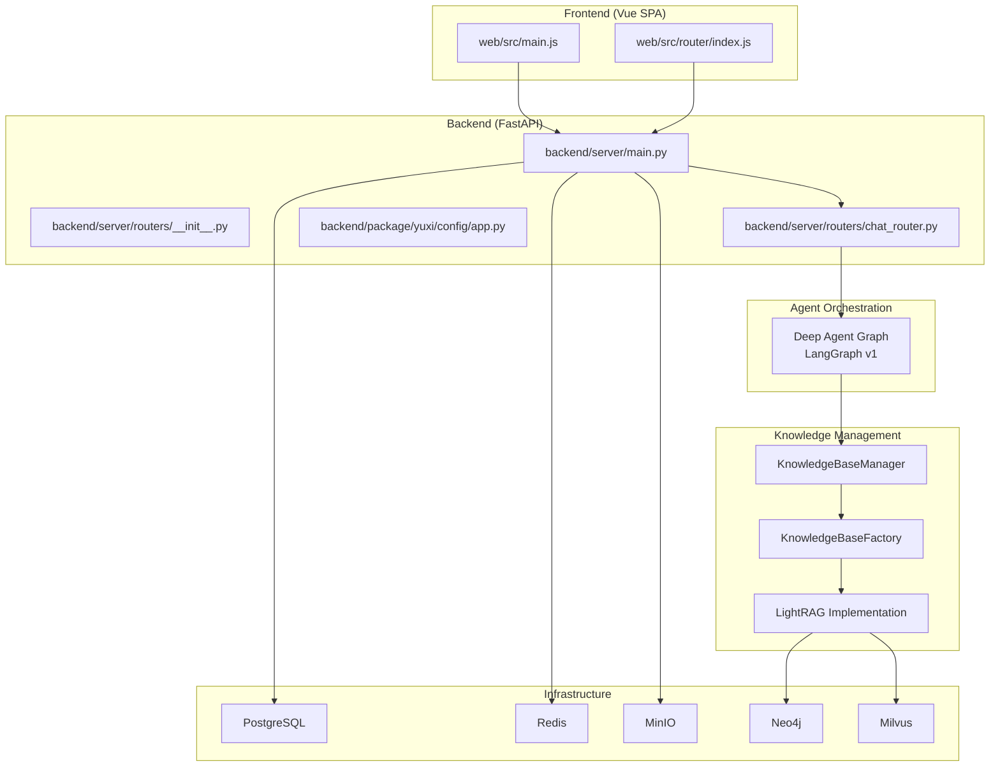
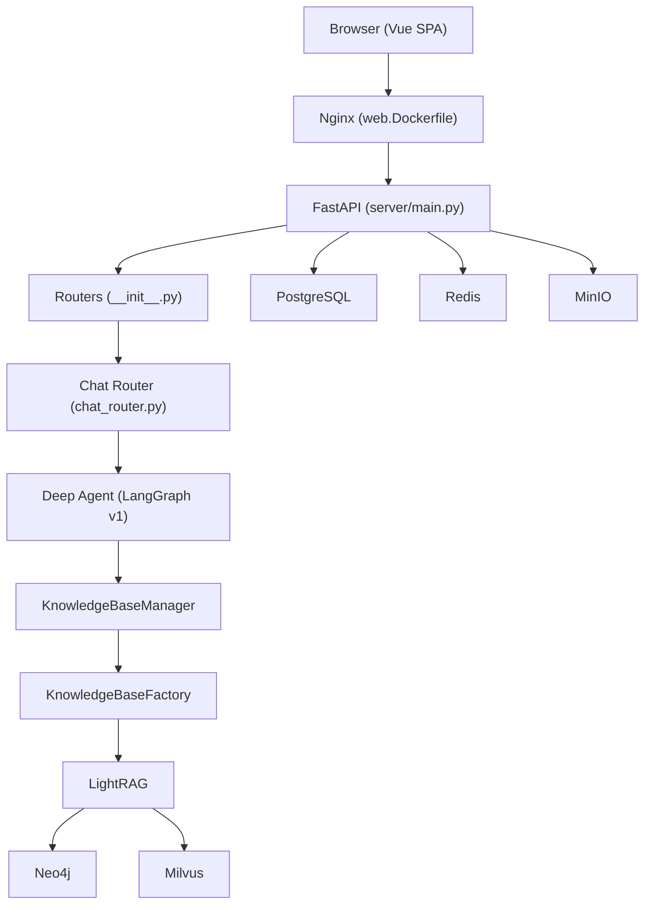
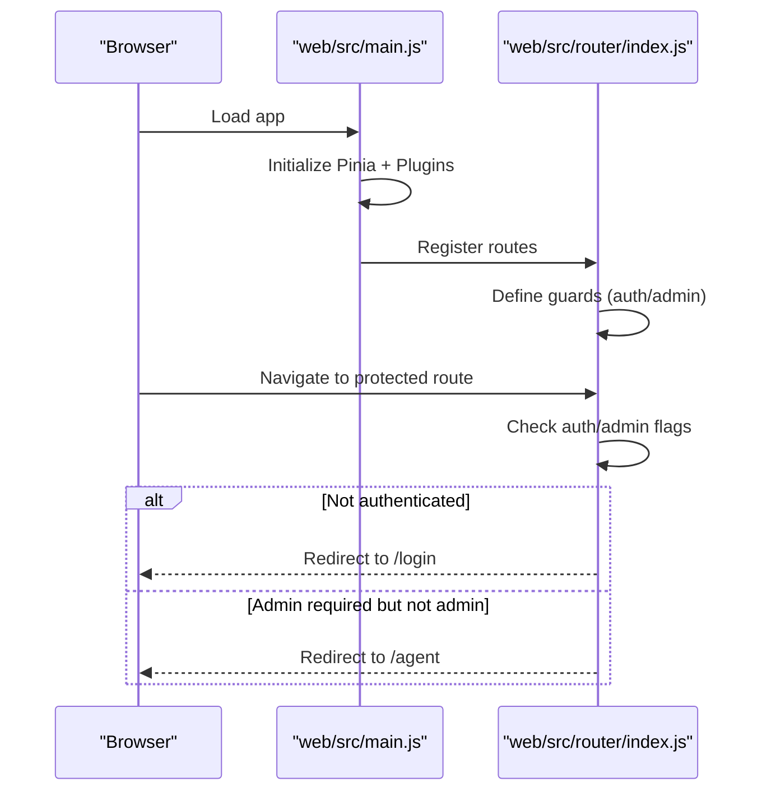
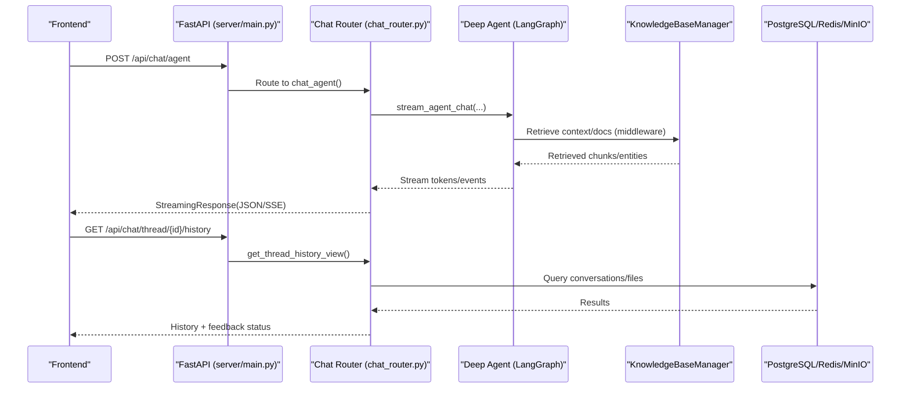
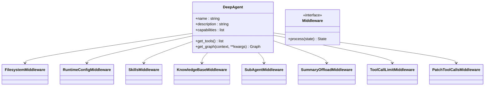
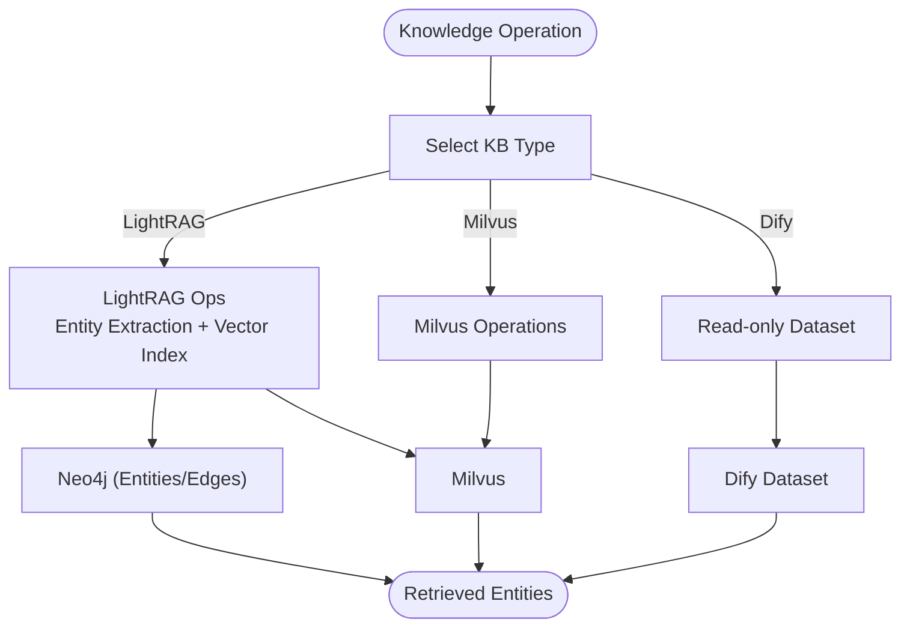
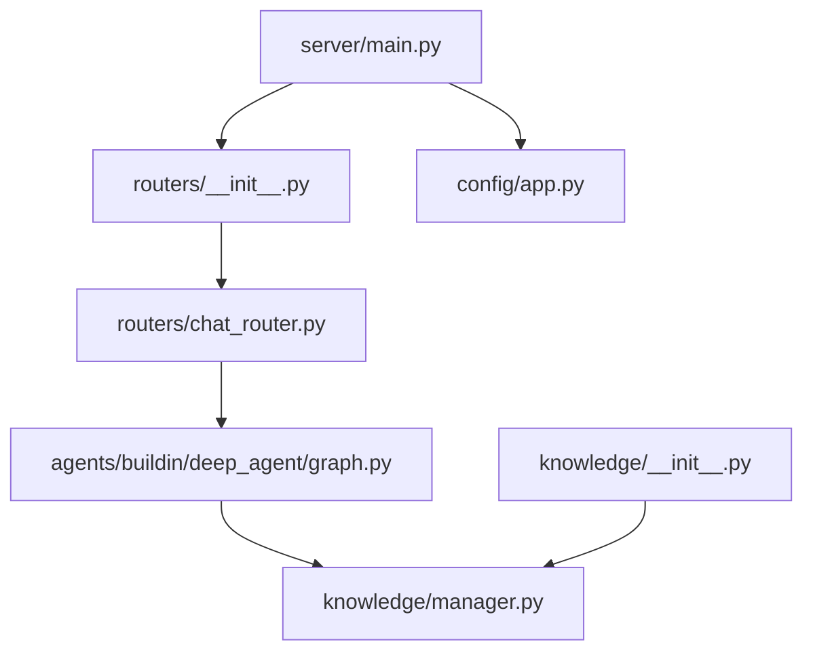
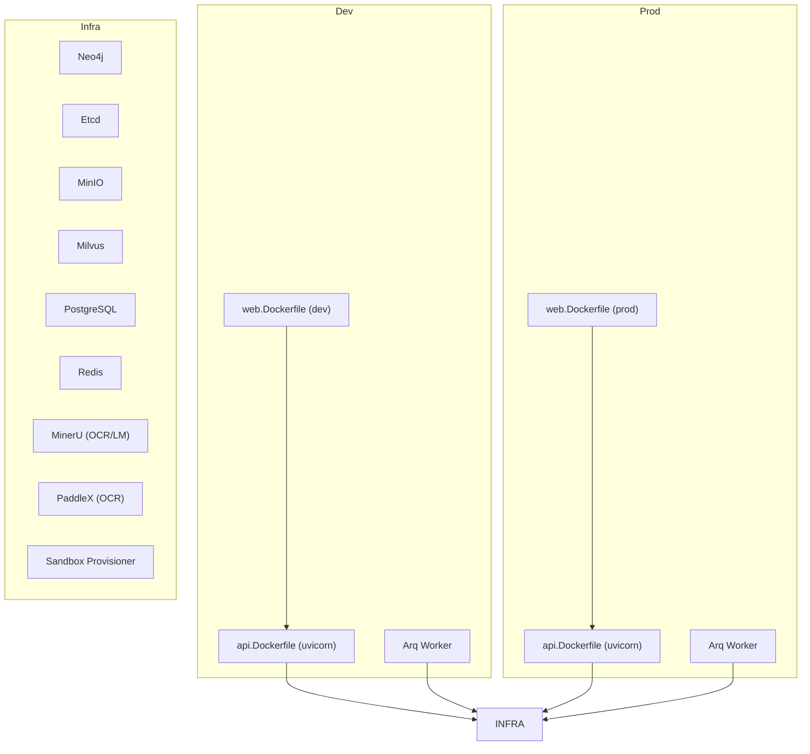

# Core Systems Architecture

<cite>
**Referenced Files in This Document**
- [backend/server/main.py](file://backend/server/main.py)
- [backend/server/routers/__init__.py](file://backend/server/routers/__init__.py)
- [backend/server/routers/chat_router.py](file://backend/server/routers/chat_router.py)
- [backend/package/yuxi/agents/buildin/deep_agent/graph.py](file://backend/package/yuxi/agents/buildin/deep_agent/graph.py)
- [backend/package/yuxi/knowledge/__init__.py](file://backend/package/yuxi/knowledge/__init__.py)
- [backend/package/yuxi/knowledge/manager.py](file://backend/package/yuxi/knowledge/manager.py)
- [backend/package/yuxi/config/app.py](file://backend/package/yuxi/config/app.py)
- [web/src/main.js](file://web/src/main.js)
- [web/src/router/index.js](file://web/src/router/index.js)
- [docker/api.Dockerfile](file://docker/api.Dockerfile)
- [docker/web.Dockerfile](file://docker/web.Dockerfile)
- [docker-compose.yml](file://docker-compose.yml)
- [docker-compose.prod.yml](file://docker-compose.prod.yml)
</cite>

## Table of Contents
1. [Introduction](#introduction)
2. [Project Structure](#project-structure)
3. [Core Components](#core-components)
4. [Architecture Overview](#architecture-overview)
5. [Detailed Component Analysis](#detailed-component-analysis)
6. [Dependency Analysis](#dependency-analysis)
7. [Performance Considerations](#performance-considerations)
8. [Troubleshooting Guide](#troubleshooting-guide)
9. [Conclusion](#conclusion)
10. [Appendices](#appendices)

## Introduction
This document describes the architectural design of Yuxi’s core systems, focusing on the integration between the Vue.js frontend, the FastAPI backend, and the LangGraph-based agent orchestration. It explains the microservices boundaries, component interactions, and data flows across the frontend Single Page Application (SPA), the API layer, business services, and external integrations such as vector databases, graph databases, and model providers. It also documents the knowledge management architecture with a Retrieval-Augmented Generation (RAG) pipeline and knowledge graph construction using LightRAG, along with infrastructure requirements, scalability considerations, and deployment topology.

## Project Structure
Yuxi is organized into three primary layers:
- Frontend (Vue.js SPA): Provides the user interface, routing, and client-side state management.
- Backend (FastAPI microservices): Exposes REST APIs, orchestrates agents, manages conversations, and coordinates knowledge processing.
- Supporting Infrastructure: Includes PostgreSQL, Redis, MinIO, Neo4j, Milvus, and optional OCR/model services.

**Diagram sources**
- [backend/server/main.py:1-150](file://backend/server/main.py#L1-L150)
- [backend/server/routers/__init__.py:1-49](file://backend/server/routers/__init__.py#L1-L49)
- [backend/server/routers/chat_router.py:1-985](file://backend/server/routers/chat_router.py#L1-L985)
- [backend/package/yuxi/agents/buildin/deep_agent/graph.py:1-124](file://backend/package/yuxi/agents/buildin/deep_agent/graph.py#L1-L124)
- [backend/package/yuxi/knowledge/__init__.py:1-52](file://backend/package/yuxi/knowledge/__init__.py#L1-L52)
- [backend/package/yuxi/knowledge/manager.py:1-955](file://backend/package/yuxi/knowledge/manager.py#L1-L955)
- [web/src/main.js:1-26](file://web/src/main.js#L1-L26)
- [web/src/router/index.js:1-200](file://web/src/router/index.js#L1-L200)

**Section sources**
- [backend/server/main.py:1-150](file://backend/server/main.py#L1-L150)
- [backend/server/routers/__init__.py:1-49](file://backend/server/routers/__init__.py#L1-L49)
- [backend/server/routers/chat_router.py:1-985](file://backend/server/routers/chat_router.py#L1-L985)
- [backend/package/yuxi/agents/buildin/deep_agent/graph.py:1-124](file://backend/package/yuxi/agents/buildin/deep_agent/graph.py#L1-L124)
- [backend/package/yuxi/knowledge/__init__.py:1-52](file://backend/package/yuxi/knowledge/__init__.py#L1-L52)
- [backend/package/yuxi/knowledge/manager.py:1-955](file://backend/package/yuxi/knowledge/manager.py#L1-L955)
- [web/src/main.js:1-26](file://web/src/main.js#L1-L26)
- [web/src/router/index.js:1-200](file://web/src/router/index.js#L1-L200)

## Core Components
- Vue.js Frontend SPA
  - Initializes the app, Pinia store, and Ant Design Vue plugin.
  - Routes define protected/admin-only pages and handle navigation guards.
  - Integrates with backend via API endpoints under /api.

- FastAPI Backend
  - Central application entry with CORS, rate limiting, and middleware.
  - Aggregates routers for system, auth, chat, dashboard, knowledge, and graph domains.
  - Exposes streaming and synchronous chat endpoints, thread management, and agent run orchestration.

- Agent Orchestration (LangGraph v1)
  - Deep Agent composes a LangGraph-based agent with middleware for filesystem, skills, knowledge base, subagents, and tool-call limits.
  - Uses configurable models and MCP tool discovery to extend capabilities.

- Knowledge Management (RAG + LightRAG)
  - Factory pattern registers Milvus, LightRAG, and Dify knowledge base implementations.
  - Manager coordinates database lifecycle, permissions, and retrieval across implementations.
  - Supports chunking, parsing, indexing, and querying with pluggable backends.

- Configuration
  - Centralized Pydantic-based configuration supports model providers, sandbox settings, and feature toggles.

**Section sources**
- [web/src/main.js:1-26](file://web/src/main.js#L1-L26)
- [web/src/router/index.js:1-200](file://web/src/router/index.js#L1-L200)
- [backend/server/main.py:1-150](file://backend/server/main.py#L1-L150)
- [backend/server/routers/__init__.py:1-49](file://backend/server/routers/__init__.py#L1-L49)
- [backend/server/routers/chat_router.py:1-985](file://backend/server/routers/chat_router.py#L1-L985)
- [backend/package/yuxi/agents/buildin/deep_agent/graph.py:1-124](file://backend/package/yuxi/agents/buildin/deep_agent/graph.py#L1-L124)
- [backend/package/yuxi/knowledge/__init__.py:1-52](file://backend/package/yuxi/knowledge/__init__.py#L1-L52)
- [backend/package/yuxi/knowledge/manager.py:1-955](file://backend/package/yuxi/knowledge/manager.py#L1-L955)
- [backend/package/yuxi/config/app.py:1-598](file://backend/package/yuxi/config/app.py#L1-L598)

## Architecture Overview
The system follows a microservices architecture with clear separation:
- Frontend: Vue SPA served by Nginx in production; development served via Vite.
- Backend: FastAPI service with modular routers and middleware for auth, rate-limiting, and access logging.
- Agents: LangGraph-based orchestrators with middleware for skills, knowledge, and subagents.
- Knowledge: Pluggable knowledge base implementations with a central manager and factory.
- Infrastructure: PostgreSQL for business data, Redis for caching/streaming, MinIO for object storage, Neo4j/Milvus for graph/vector storage.

**Diagram sources**
- [docker/web.Dockerfile:1-49](file://docker/web.Dockerfile#L1-L49)
- [backend/server/main.py:1-150](file://backend/server/main.py#L1-L150)
- [backend/server/routers/__init__.py:1-49](file://backend/server/routers/__init__.py#L1-L49)
- [backend/server/routers/chat_router.py:1-985](file://backend/server/routers/chat_router.py#L1-L985)
- [backend/package/yuxi/agents/buildin/deep_agent/graph.py:1-124](file://backend/package/yuxi/agents/buildin/deep_agent/graph.py#L1-L124)
- [backend/package/yuxi/knowledge/manager.py:1-955](file://backend/package/yuxi/knowledge/manager.py#L1-L955)
- [backend/package/yuxi/knowledge/__init__.py:1-52](file://backend/package/yuxi/knowledge/__init__.py#L1-L52)

## Detailed Component Analysis

### Frontend SPA Communication Flow
The SPA initializes the app, sets up Pinia/Pinia Persisted State, and mounts the router and UI framework. Navigation guards enforce authentication and admin roles, redirecting unauthenticated users to login and restricting sensitive routes.

**Diagram sources**
- [web/src/main.js:1-26](file://web/src/main.js#L1-L26)
- [web/src/router/index.js:125-197](file://web/src/router/index.js#L125-L197)

**Section sources**
- [web/src/main.js:1-26](file://web/src/main.js#L1-L26)
- [web/src/router/index.js:1-200](file://web/src/router/index.js#L1-L200)

### Backend API Layer and Chat Orchestration
The backend exposes a unified /api prefix with modular routers. The chat router handles:
- Agent configuration and selection
- Synchronous and streaming chat responses
- Thread creation/history/state management
- Attachment upload and artifact resolution
- Asynchronous run creation, cancellation, and event streaming

**Diagram sources**
- [backend/server/main.py:40-150](file://backend/server/main.py#L40-L150)
- [backend/server/routers/chat_router.py:347-624](file://backend/server/routers/chat_router.py#L347-L624)
- [backend/package/yuxi/agents/buildin/deep_agent/graph.py:52-124](file://backend/package/yuxi/agents/buildin/deep_agent/graph.py#L52-L124)
- [backend/package/yuxi/knowledge/manager.py:428-441](file://backend/package/yuxi/knowledge/manager.py#L428-L441)

**Section sources**
- [backend/server/main.py:1-150](file://backend/server/main.py#L1-L150)
- [backend/server/routers/chat_router.py:1-985](file://backend/server/routers/chat_router.py#L1-L985)
- [backend/package/yuxi/agents/buildin/deep_agent/graph.py:1-124](file://backend/package/yuxi/agents/buildin/deep_agent/graph.py#L1-L124)
- [backend/package/yuxi/knowledge/manager.py:1-955](file://backend/package/yuxi/knowledge/manager.py#L1-L955)

### Agent System Design Using LangGraph v1
The Deep Agent composes a LangGraph with middleware:
- Filesystem and patch tool-calls for robust execution
- Runtime configuration and skills injection
- Knowledge base middleware for retrieval-augmented prompts
- Sub-agent middleware enabling collaborative planning
- Tool-call limits to prevent runaway loops
- Summary offload middleware to manage long-context windows

**Diagram sources**
- [backend/package/yuxi/agents/buildin/deep_agent/graph.py:27-124](file://backend/package/yuxi/agents/buildin/deep_agent/graph.py#L27-L124)

**Section sources**
- [backend/package/yuxi/agents/buildin/deep_agent/graph.py:1-124](file://backend/package/yuxi/agents/buildin/deep_agent/graph.py#L1-L124)

### Knowledge Management Architecture and LightRAG Integration
The knowledge subsystem:
- Registers multiple knowledge base backends (Milvus, LightRAG, Dify).
- Provides a centralized manager to create, query, and maintain databases.
- Supports chunking, parsing, indexing, and permission-aware access.
- LightRAG integrates with Neo4j and Milvus for entity relationship extraction and vector retrieval.

**Diagram sources**
- [backend/package/yuxi/knowledge/__init__.py:16-51](file://backend/package/yuxi/knowledge/__init__.py#L16-L51)
- [backend/package/yuxi/knowledge/manager.py:15-102](file://backend/package/yuxi/knowledge/manager.py#L15-L102)

**Section sources**
- [backend/package/yuxi/knowledge/__init__.py:1-52](file://backend/package/yuxi/knowledge/__init__.py#L1-L52)
- [backend/package/yuxi/knowledge/manager.py:1-955](file://backend/package/yuxi/knowledge/manager.py#L1-L955)

### Configuration and Feature Flags
Centralized configuration supports:
- Model providers and availability checks
- Sandbox settings and timeouts
- Feature toggles (web search, reranking, content guard)
- Persistence of user-modified settings

**Section sources**
- [backend/package/yuxi/config/app.py:1-598](file://backend/package/yuxi/config/app.py#L1-L598)

## Dependency Analysis
The backend composes routers dynamically and conditionally includes knowledge/graph endpoints based on LITE_MODE. The agent relies on MCP tool discovery and subagent specifications. The knowledge manager delegates to registered implementations.

**Diagram sources**
- [backend/server/main.py:40-150](file://backend/server/main.py#L40-L150)
- [backend/server/routers/__init__.py:18-49](file://backend/server/routers/__init__.py#L18-L49)
- [backend/server/routers/chat_router.py:14-46](file://backend/server/routers/chat_router.py#L14-L46)
- [backend/package/yuxi/agents/buildin/deep_agent/graph.py:10-24](file://backend/package/yuxi/agents/buildin/deep_agent/graph.py#L10-L24)
- [backend/package/yuxi/knowledge/__init__.py:8-51](file://backend/package/yuxi/knowledge/__init__.py#L8-L51)
- [backend/package/yuxi/knowledge/manager.py:15-102](file://backend/package/yuxi/knowledge/manager.py#L15-L102)
- [backend/package/yuxi/config/app.py:127-273](file://backend/package/yuxi/config/app.py#L127-L273)

**Section sources**
- [backend/server/routers/__init__.py:1-49](file://backend/server/routers/__init__.py#L1-L49)
- [backend/package/yuxi/knowledge/__init__.py:1-52](file://backend/package/yuxi/knowledge/__init__.py#L1-L52)
- [backend/package/yuxi/knowledge/manager.py:1-955](file://backend/package/yuxi/knowledge/manager.py#L1-L955)
- [backend/package/yuxi/config/app.py:1-598](file://backend/package/yuxi/config/app.py#L1-L598)

## Performance Considerations
- Streaming Responses: Chat endpoints use StreamingResponse to reduce latency and improve UX.
- Middleware Limits: Tool-call and run limits prevent resource exhaustion.
- Summary Offload: Long conversations compress context to fit model windows.
- Caching and Queues: Redis and Arq worker support asynchronous runs and event streaming.
- Vector and Graph Scaling: Milvus and Neo4j are suitable for large-scale retrieval and graph analytics.

[No sources needed since this section provides general guidance]

## Troubleshooting Guide
Common areas to inspect:
- Authentication and Authorization: Ensure tokens are present and routes enforce guards.
- Rate Limiting: Login attempts are throttled; excessive failures return 429.
- Health Checks: Services expose health endpoints for readiness/liveness.
- Environment Variables: Confirm model provider keys, sandbox URLs, and database URIs.

**Section sources**
- [backend/server/main.py:63-96](file://backend/server/main.py#L63-L96)
- [web/src/router/index.js:125-197](file://web/src/router/index.js#L125-L197)
- [docker-compose.yml:69-83](file://docker-compose.yml#L69-L83)
- [docker-compose.prod.yml:51-65](file://docker-compose.prod.yml#L51-L65)

## Conclusion
Yuxi’s architecture cleanly separates concerns across the Vue SPA, FastAPI backend, and supporting infrastructure. The LangGraph-based agent orchestrator integrates middleware for skills, knowledge, and subagents, while the knowledge management layer provides a flexible, pluggable RAG pipeline with LightRAG powering entity-aware retrieval. The deployment topology leverages Docker Compose for development and production, ensuring scalable and observable operations.

[No sources needed since this section summarizes without analyzing specific files]

## Appendices

### Deployment Topology and Containers
- Development: Nginx serves the SPA; Vite hot-reloads frontend; Uvicorn runs FastAPI with reload; Arq worker processes jobs.
- Production: Nginx serves SPA statically; Uvicorn runs FastAPI; separate containers for graph, etcd, minio, milvus, postgres, redis, mineru, paddlex, and sandbox provisioner.

**Diagram sources**
- [docker/web.Dockerfile:1-49](file://docker/web.Dockerfile#L1-L49)
- [docker/api.Dockerfile:1-59](file://docker/api.Dockerfile#L1-L59)
- [docker-compose.yml:37-436](file://docker-compose.yml#L37-L436)
- [docker-compose.prod.yml:29-373](file://docker-compose.prod.yml#L29-L373)

**Section sources**
- [docker/web.Dockerfile:1-49](file://docker/web.Dockerfile#L1-L49)
- [docker/api.Dockerfile:1-59](file://docker/api.Dockerfile#L1-L59)
- [docker-compose.yml:1-436](file://docker-compose.yml#L1-L436)
- [docker-compose.prod.yml:1-373](file://docker-compose.prod.yml#L1-L373)