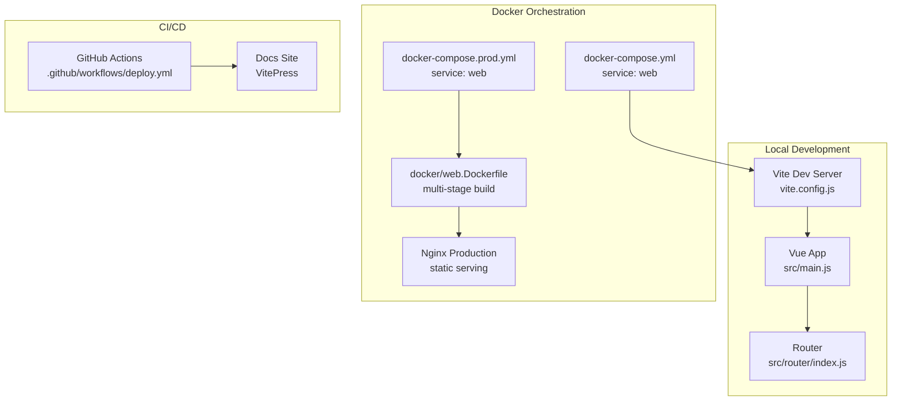
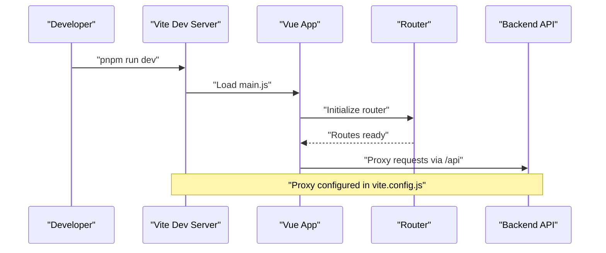
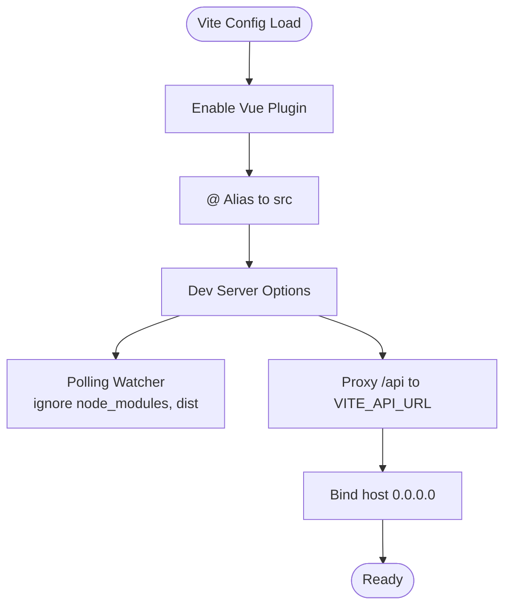
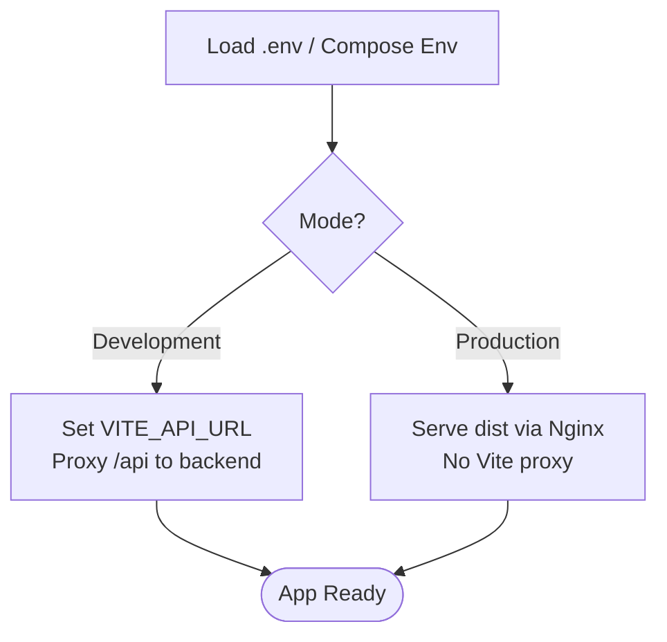
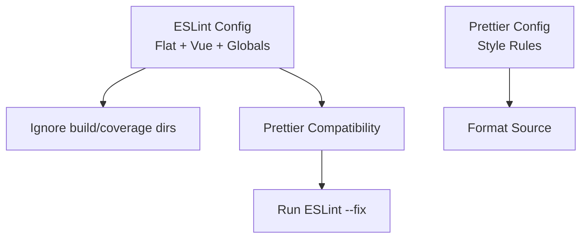
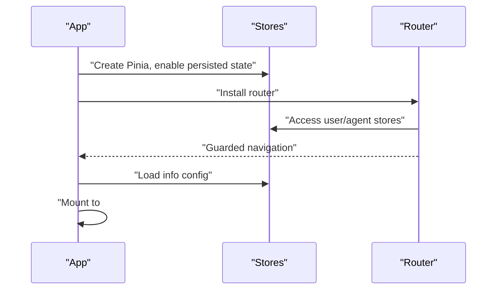
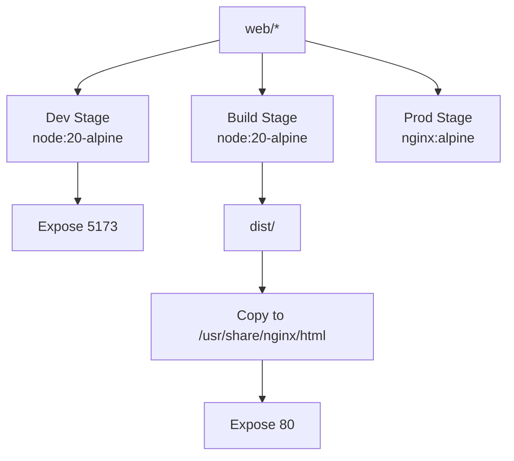
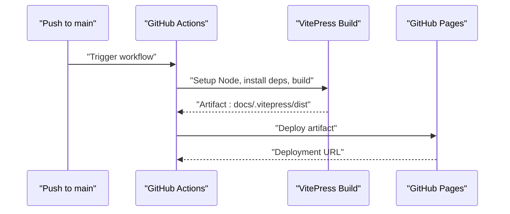
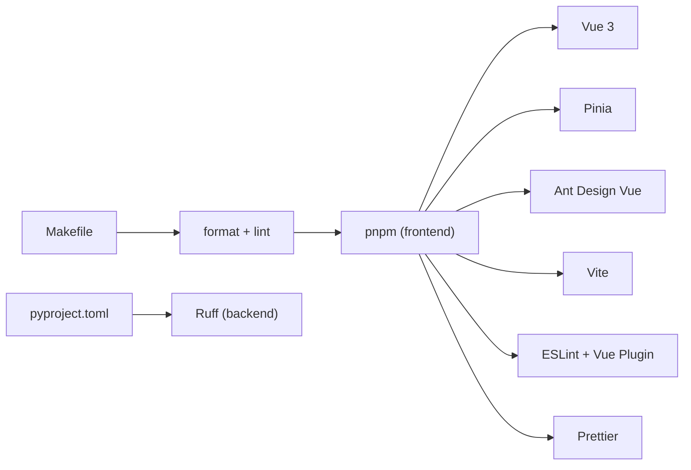

# Build Process and Deployment

<cite>
**Referenced Files in This Document**
- [package.json](file://web/package.json)
- [vite.config.js](file://web/vite.config.js)
- [.prettierrc.json](file://web/.prettierrc.json)
- [eslint.config.js](file://web/eslint.config.js)
- [main.js](file://web/src/main.js)
- [index.js](file://web/src/router/index.js)
- [docker-compose.yml](file://docker-compose.yml)
- [docker-compose.prod.yml](file://docker-compose.prod.yml)
- [web.Dockerfile](file://docker/web.Dockerfile)
- [Makefile](file://Makefile)
- [pyproject.toml](file://backend/pyproject.toml)
- [deploy.yml](file://.github/workflows/deploy.yml)
</cite>

## Table of Contents
1. [Introduction](#introduction)
2. [Project Structure](#project-structure)
3. [Core Components](#core-components)
4. [Architecture Overview](#architecture-overview)
5. [Detailed Component Analysis](#detailed-component-analysis)
6. [Dependency Analysis](#dependency-analysis)
7. [Performance Considerations](#performance-considerations)
8. [Troubleshooting Guide](#troubleshooting-guide)
9. [Conclusion](#conclusion)
10. [Appendices](#appendices)

## Introduction
This document explains the Yuxi frontend build process and deployment strategy. It covers Vite configuration, development server setup, build pipeline, dependency management, code quality tools (ESLint, Prettier), environment variable handling, proxy configuration for API requests, production optimizations, and CI/CD integration for documentation. It also outlines deployment strategies across development and production environments, along with asset handling and CDN considerations.

## Project Structure
The frontend is a Vue 3 application under the web directory. It uses Vite for development and build, with ESLint and Prettier for code quality. Docker Compose orchestrates development and production deployments, while GitHub Actions deploys the documentation site to GitHub Pages.

**Diagram sources**
- [vite.config.js:1-30](file://web/vite.config.js#L1-L30)
- [main.js:1-26](file://web/src/main.js#L1-L26)
- [index.js:1-200](file://web/src/router/index.js#L1-L200)
- [docker-compose.yml:176-200](file://docker-compose.yml#L176-L200)
- [docker-compose.prod.yml:141-158](file://docker-compose.prod.yml#L141-L158)
- [web.Dockerfile:1-49](file://docker/web.Dockerfile#L1-L49)
- [deploy.yml:1-63](file://.github/workflows/deploy.yml#L1-L63)

**Section sources**
- [package.json:1-51](file://web/package.json#L1-L51)
- [vite.config.js:1-30](file://web/vite.config.js#L1-L30)
- [docker-compose.yml:176-200](file://docker-compose.yml#L176-L200)
- [docker-compose.prod.yml:141-158](file://docker-compose.prod.yml#L141-L158)
- [web.Dockerfile:1-49](file://docker/web.Dockerfile#L1-L49)
- [deploy.yml:1-63](file://.github/workflows/deploy.yml#L1-L63)

## Core Components
- Vite configuration defines the Vue plugin, path alias, development server, proxy, and file watching behavior.
- Package scripts orchestrate development, production preview, building, linting, and formatting.
- Code quality tools enforce consistent formatting and linting rules.
- Docker multi-stage builds produce optimized static assets served by Nginx in production.
- GitHub Actions automates documentation site deployment to GitHub Pages.

**Section sources**
- [vite.config.js:5-29](file://web/vite.config.js#L5-L29)
- [package.json:5-13](file://web/package.json#L5-L13)
- [eslint.config.js:1-28](file://web/eslint.config.js#L1-L28)
- [.prettierrc.json:1-8](file://web/.prettierrc.json#L1-L8)
- [web.Dockerfile:24-49](file://docker/web.Dockerfile#L24-L49)
- [deploy.yml:26-63](file://.github/workflows/deploy.yml#L26-L63)

## Architecture Overview
The frontend build and deployment pipeline integrates Vite, Docker, and GitHub Actions:

**Diagram sources**
- [package.json:5-13](file://web/package.json#L5-L13)
- [vite.config.js:15-27](file://web/vite.config.js#L15-L27)
- [main.js:1-26](file://web/src/main.js#L1-L26)
- [index.js:1-200](file://web/src/router/index.js#L1-L200)

## Detailed Component Analysis

### Vite Configuration and Build Pipeline
- Plugin and aliases: The Vue plugin is enabled, and the @ alias resolves to the src directory.
- Development server: Host binding, polling-based file watching, and proxying API traffic to the backend.
- Proxy: Requests matching /api are proxied to the target defined by VITE_API_URL with origin rewriting.
- Build script: The build script invokes Vite to generate static assets.

**Diagram sources**
- [vite.config.js:5-29](file://web/vite.config.js#L5-L29)

**Section sources**
- [vite.config.js:5-29](file://web/vite.config.js#L5-L29)
- [package.json:9-13](file://web/package.json#L9-L13)

### Environment Variables and Proxy Configuration
- VITE_API_URL controls the backend target for API proxy during development.
- In development, the web service sets VITE_API_URL to the internal API service address.
- In production, the web service runs Nginx and does not rely on Vite’s proxy.

**Diagram sources**
- [vite.config.js:16-21](file://web/vite.config.js#L16-L21)
- [docker-compose.yml:194-199](file://docker-compose.yml#L194-L199)
- [docker-compose.prod.yml:154-157](file://docker-compose.prod.yml#L154-L157)

**Section sources**
- [vite.config.js:16-21](file://web/vite.config.js#L16-L21)
- [docker-compose.yml:194-199](file://docker-compose.yml#L194-L199)
- [docker-compose.prod.yml:154-157](file://docker-compose.prod.yml#L154-L157)

### Dependency Management and Scripts
- Dependencies include Vue 3, Pinia, Ant Design Vue, and various visualization libraries.
- Dev dependencies include Vite, the Vue plugin, ESLint, and Prettier.
- Scripts:
  - dev: start Vite dev server
  - server: serve with host binding
  - server:prod: serve on port 8080 with host binding
  - build: build static assets
  - preview: preview built assets
  - lint: run ESLint with caching and auto-fix
  - format: format source code with Prettier

**Section sources**
- [package.json:14-49](file://web/package.json#L14-L49)
- [package.json:5-13](file://web/package.json#L5-L13)

### Code Quality Tools: ESLint and Prettier
- ESLint configuration:
  - Flat config with recommended JS and Vue essentials.
  - Browser globals enabled.
  - Ignores dist, dist-ssr, and coverage directories.
  - Uses @vue/eslint-config-prettier/skip-formatting to avoid conflicts.
- Prettier configuration:
  - Uses semicolons off, tab width 2, single quote, print width 100, trailing comma none.

**Diagram sources**
- [eslint.config.js:1-28](file://web/eslint.config.js#L1-L28)
- [.prettierrc.json:1-8](file://web/.prettierrc.json#L1-L8)

**Section sources**
- [eslint.config.js:1-28](file://web/eslint.config.js#L1-L28)
- [.prettierrc.json:1-8](file://web/.prettierrc.json#L1-L8)
- [package.json:11-12](file://web/package.json#L11-L12)

### Router and Application Bootstrap
- History mode uses BASE_URL from import.meta.env.
- Global navigation guards handle authentication, admin, and super admin checks, with redirects and initialization flows.
- App bootstrap initializes Pinia, router, Ant Design Vue, and loads initial configuration.

**Diagram sources**
- [main.js:1-26](file://web/src/main.js#L1-L26)
- [index.js:125-197](file://web/src/router/index.js#L125-L197)

**Section sources**
- [main.js:1-26](file://web/src/main.js#L1-L26)
- [index.js:1-200](file://web/src/router/index.js#L1-L200)

### Docker-Based Build and Deployment
- Multi-stage Dockerfile:
  - Development stage: installs pnpm, copies dependencies, exposes 5173, and defers command to compose.
  - Build stage: frozen lockfile install, builds with pnpm run build.
  - Production stage: Nginx Alpine serves /usr/share/nginx/html from dist, with custom nginx.conf and default.conf.
- Compose:
  - Development: web service binds 5173, sets VITE_API_URL, runs pnpm run server.
  - Production: web service targets production stage, binds 80, runs nginx -g "daemon off;".

**Diagram sources**
- [web.Dockerfile:1-49](file://docker/web.Dockerfile#L1-L49)
- [docker-compose.yml:176-200](file://docker-compose.yml#L176-L200)
- [docker-compose.prod.yml:141-158](file://docker-compose.prod.yml#L141-L158)

**Section sources**
- [web.Dockerfile:1-49](file://docker/web.Dockerfile#L1-L49)
- [docker-compose.yml:176-200](file://docker-compose.yml#L176-L200)
- [docker-compose.prod.yml:141-158](file://docker-compose.prod.yml#L141-L158)

### CI/CD Integration for Documentation
- GitHub Actions workflow:
  - Builds the VitePress site in the docs directory.
  - Deploys the built artifacts to GitHub Pages.
  - Permissions include read/write for Pages and ID token.

**Diagram sources**
- [deploy.yml:26-63](file://.github/workflows/deploy.yml#L26-L63)

**Section sources**
- [deploy.yml:1-63](file://.github/workflows/deploy.yml#L1-L63)

## Dependency Analysis
- Frontend dependencies are managed via pnpm, with Vue ecosystem packages and visualization libraries.
- Backend Python dependencies and testing are configured in pyproject.toml, complementing frontend formatting and linting via Makefile.

**Diagram sources**
- [package.json:14-49](file://web/package.json#L14-L49)
- [Makefile:33-38](file://Makefile#L33-L38)
- [pyproject.toml:13-66](file://backend/pyproject.toml#L13-L66)

**Section sources**
- [package.json:14-49](file://web/package.json#L14-L49)
- [Makefile:33-38](file://Makefile#L33-L38)
- [pyproject.toml:13-66](file://backend/pyproject.toml#L13-L66)

## Performance Considerations
- Development:
  - Polling watcher reduces CPU usage on certain systems; ignores node_modules and dist to minimize overhead.
  - Host binding enables external access for containerized development.
- Production:
  - Multi-stage build ensures minimal production image size.
  - Nginx serves static assets efficiently; configure gzip/static caching at the reverse proxy level if integrating a CDN.
- Asset optimization:
  - Vite build generates hashed filenames by default; enable long-term caching and cache-busting via CDN-managed immutable URLs.
  - Consider enabling Vite’s built-in compression plugins and pre-bundling strategies if bundle sizes grow.

[No sources needed since this section provides general guidance]

## Troubleshooting Guide
- Proxy not working:
  - Verify VITE_API_URL is set in development compose or .env.
  - Confirm proxy pattern matches /api and changeOrigin is enabled.
- Hot reload issues:
  - Check watcher settings and ignored paths in vite.config.js.
- Build failures:
  - Ensure pnpm install completes in the build stage and lockfile is present.
  - Validate that dist is copied into the Nginx stage.
- CI/CD deployment:
  - Confirm workflow runs on main branch and Pages permissions are granted.
  - Check artifact path matches docs/.vitepress/dist.

**Section sources**
- [vite.config.js:15-27](file://web/vite.config.js#L15-L27)
- [docker-compose.yml:194-199](file://docker-compose.yml#L194-L199)
- [web.Dockerfile:35-48](file://docker/web.Dockerfile#L35-L48)
- [deploy.yml:26-63](file://.github/workflows/deploy.yml#L26-L63)

## Conclusion
The Yuxi frontend leverages Vite for a fast development experience, robust ESLint/Prettier enforcement for code quality, and a streamlined Docker-based production pipeline that serves optimized static assets via Nginx. GitHub Actions automates documentation site deployment to GitHub Pages. The proxy configuration centralizes API routing during development, while production relies on Nginx for scalable static delivery.

[No sources needed since this section summarizes without analyzing specific files]

## Appendices

### Appendix A: Environment Variable Reference
- VITE_API_URL: Target backend for API proxy during development.
- NODE_ENV: Controls development vs production behavior.
- VITE_USE_RUNS_API, VITE_LITE_MODE: Feature flags injected into the frontend build.

**Section sources**
- [vite.config.js:16-21](file://web/vite.config.js#L16-L21)
- [docker-compose.yml:194-199](file://docker-compose.yml#L194-L199)
- [docker-compose.prod.yml:154-157](file://docker-compose.prod.yml#L154-L157)

### Appendix B: Build and Preview Commands
- Development: pnpm run dev or pnpm run server
- Production preview: pnpm run server:prod
- Build: pnpm run build
- Lint and format: pnpm run lint, pnpm run format

**Section sources**
- [package.json:5-13](file://web/package.json#L5-L13)