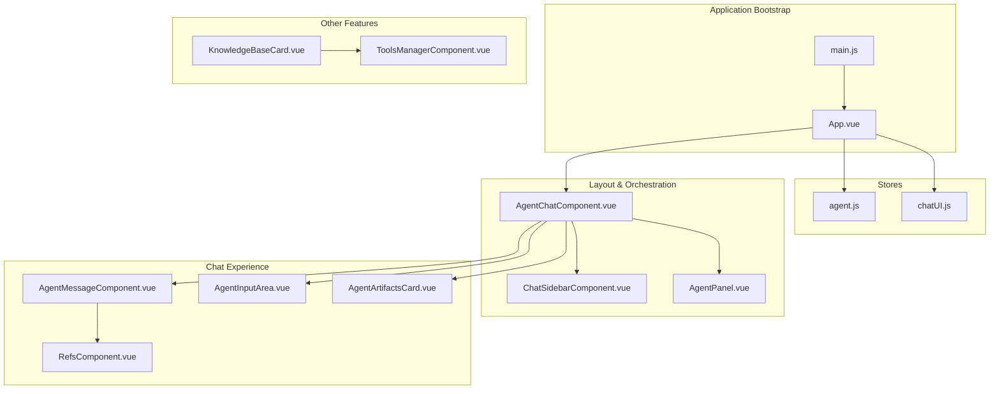
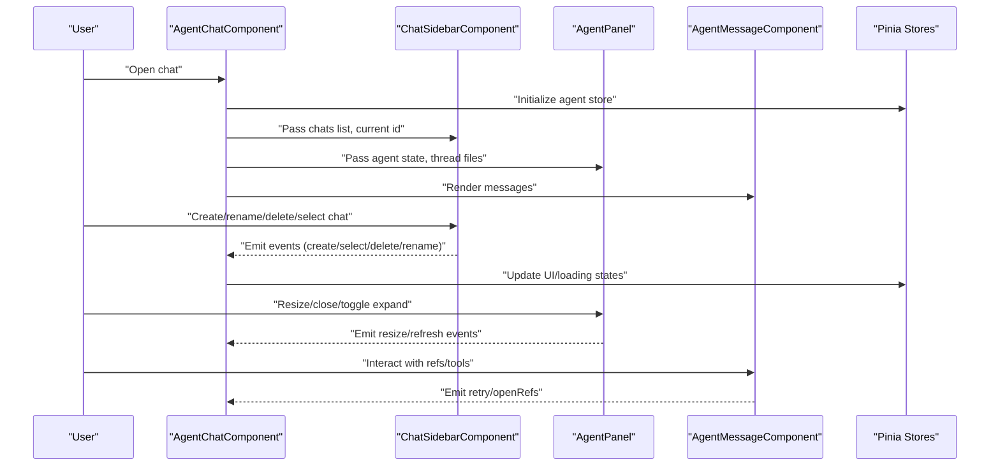
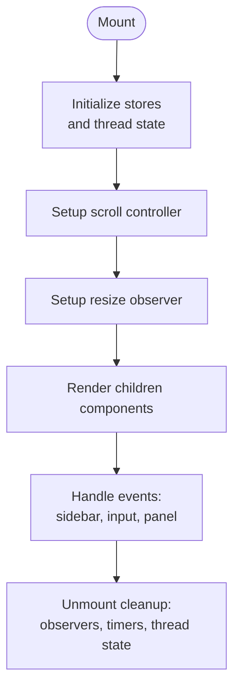
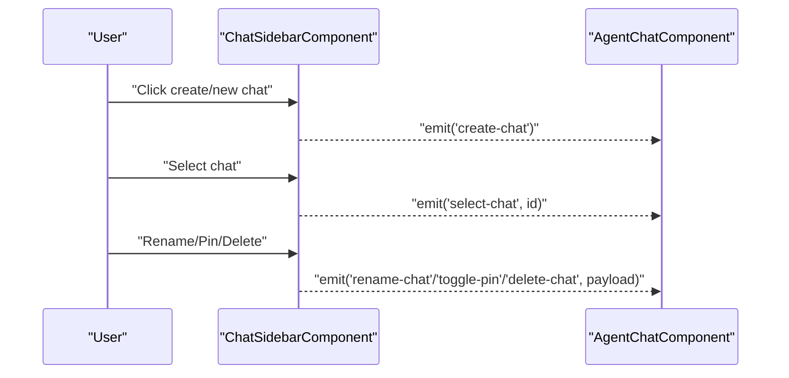
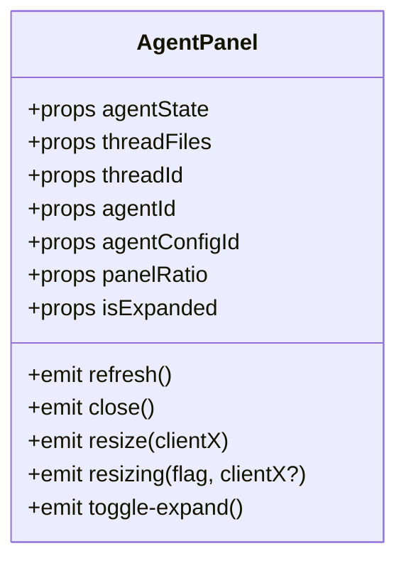
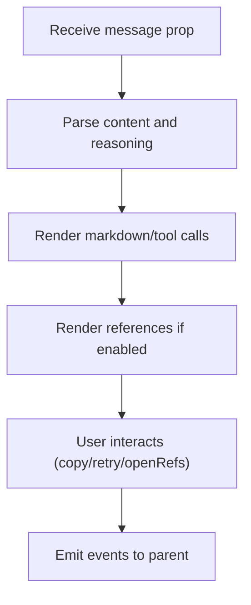
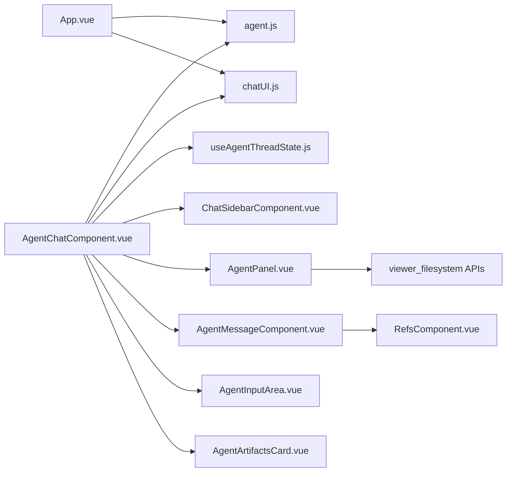

# Component Architecture

<cite>
**Referenced Files in This Document**
- [AgentChatComponent.vue](file://web/src/components/AgentChatComponent.vue)
- [AgentPanel.vue](file://web/src/components/AgentPanel.vue)
- [ChatSidebarComponent.vue](file://web/src/components/ChatSidebarComponent.vue)
- [KnowledgeBaseCard.vue](file://web/src/components/KnowledgeBaseCard.vue)
- [ToolsManagerComponent.vue](file://web/src/components/ToolsManagerComponent.vue)
- [AgentMessageComponent.vue](file://web/src/components/AgentMessageComponent.vue)
- [AgentInputArea.vue](file://web/src/components/AgentInputArea.vue)
- [AgentArtifactsCard.vue](file://web/src/components/AgentArtifactsCard.vue)
- [RefsComponent.vue](file://web/src/components/RefsComponent.vue)
- [agent.js](file://web/src/stores/agent.js)
- [chatUI.js](file://web/src/stores/chatUI.js)
- [useAgentThreadState.js](file://web/src/composables/useAgentThreadState.js)
- [main.js](file://web/src/main.js)
- [App.vue](file://web/src/App.vue)
- [messageProcessor.spec.js](file://web/src/utils/__tests__/messageProcessor.spec.js)
</cite>

## Table of Contents
1. [Introduction](#introduction)
2. [Project Structure](#project-structure)
3. [Core Components](#core-components)
4. [Architecture Overview](#architecture-overview)
5. [Detailed Component Analysis](#detailed-component-analysis)
6. [Dependency Analysis](#dependency-analysis)
7. [Performance Considerations](#performance-considerations)
8. [Troubleshooting Guide](#troubleshooting-guide)
9. [Conclusion](#conclusion)
10. [Appendices](#appendices)

## Introduction
This document describes the Vue.js component architecture used in the Yuxi chat application. It focuses on the hierarchical structure from layout and orchestration components down to specialized UI elements, including AgentChatComponent, AgentPanel, ChatSidebarComponent, KnowledgeBaseCard, and ToolsManagerComponent. The guide explains component composition patterns, prop passing, event handling, slots, lifecycle management, reactive data binding, computed properties, shared state via Pinia stores, dynamic component loading, performance optimizations, and testing strategies.

## Project Structure
The frontend is organized around a modular component library under web/src/components, with dedicated stores under web/src/stores, composables under web/src/composables, and utilities under web/src/utils. The application bootstraps Pinia and registers Ant Design Vue globally.

**Diagram sources**
- [main.js:1-26](file://web/src/main.js#L1-L26)
- [App.vue:1-23](file://web/src/App.vue#L1-L23)
- [AgentChatComponent.vue:1-237](file://web/src/components/AgentChatComponent.vue#L1-L237)
- [ChatSidebarComponent.vue:1-108](file://web/src/components/ChatSidebarComponent.vue#L1-L108)
- [AgentPanel.vue:1-127](file://web/src/components/AgentPanel.vue#L1-L127)
- [AgentMessageComponent.vue:1-107](file://web/src/components/AgentMessageComponent.vue#L1-L107)
- [AgentInputArea.vue:1-104](file://web/src/components/AgentInputArea.vue#L1-L104)
- [AgentArtifactsCard.vue:1-77](file://web/src/components/AgentArtifactsCard.vue#L1-L77)
- [RefsComponent.vue:1-90](file://web/src/components/RefsComponent.vue#L1-L90)
- [KnowledgeBaseCard.vue:1-521](file://web/src/components/KnowledgeBaseCard.vue#L1-L521)
- [ToolsManagerComponent.vue:1-158](file://web/src/components/ToolsManagerComponent.vue#L1-L158)
- [agent.js:1-567](file://web/src/stores/agent.js#L1-L567)
- [chatUI.js:1-82](file://web/src/stores/chatUI.js#L1-L82)

**Section sources**
- [main.js:1-26](file://web/src/main.js#L1-L26)
- [App.vue:1-23](file://web/src/App.vue#L1-L23)

## Core Components
This section highlights the primary components and their roles in the chat experience and supporting features.

- AgentChatComponent: Orchestrates the chat interface, manages threads, UI state, streaming, and integrates the sidebar, panel, input area, and message rendering.
- ChatSidebarComponent: Manages conversation list, creation, deletion, renaming, pinning, and toggling the sidebar.
- AgentPanel: Provides a resizable file system panel for agent artifacts and working files.
- AgentMessageComponent: Renders AI/human/system messages, tool call blocks, markdown previews, and references.
- AgentInputArea: Encapsulates message input, attachments, mentions, and actions like file panel toggle and todo popover.
- AgentArtifactsCard: Lists and manages agent-generated artifacts with preview, download, and workspace save actions.
- RefsComponent: Displays model attribution, feedback controls, copy, retry, and source details.
- KnowledgeBaseCard: Presents knowledge base metadata and editing UI with validation and sharing configuration.
- ToolsManagerComponent: Browses and inspects available tools with filtering and categorization.

**Section sources**
- [AgentChatComponent.vue:270-566](file://web/src/components/AgentChatComponent.vue#L270-L566)
- [ChatSidebarComponent.vue:136-188](file://web/src/components/ChatSidebarComponent.vue#L136-L188)
- [AgentPanel.vue:150-181](file://web/src/components/AgentPanel.vue#L150-L181)
- [AgentMessageComponent.vue:124-155](file://web/src/components/AgentMessageComponent.vue#L124-L155)
- [AgentInputArea.vue:120-141](file://web/src/components/AgentInputArea.vue#L120-L141)
- [AgentArtifactsCard.vue:89-107](file://web/src/components/AgentArtifactsCard.vue#L89-L107)
- [RefsComponent.vue:111-125](file://web/src/components/RefsComponent.vue#L111-L125)
- [KnowledgeBaseCard.vue:156-174](file://web/src/components/KnowledgeBaseCard.vue#L156-L174)
- [ToolsManagerComponent.vue:160-246](file://web/src/components/ToolsManagerComponent.vue#L160-L246)

## Architecture Overview
The architecture follows a parent–child composition pattern with centralized reactive state managed by Pinia stores. AgentChatComponent acts as the orchestrator, delegating concerns to specialized components while maintaining local UI state and thread-scoped state via a composable.

**Diagram sources**
- [AgentChatComponent.vue:270-566](file://web/src/components/AgentChatComponent.vue#L270-L566)
- [ChatSidebarComponent.vue:179-188](file://web/src/components/ChatSidebarComponent.vue#L179-L188)
- [AgentPanel.vue:181-181](file://web/src/components/AgentPanel.vue#L181-L181)
- [AgentMessageComponent.vue:159-159](file://web/src/components/AgentMessageComponent.vue#L159-L159)

## Detailed Component Analysis

### AgentChatComponent
- Composition: Hosts the chat UI, renders sidebar, message list, input area, and agent panel. Integrates artifacts card and approval modal.
- Props and emits: Accepts agentId and singleMode; emits thread-change.
- Reactive state: Maintains local UI flags, agent panel visibility and ratio, scroll controller, and thread-scoped state via useAgentThreadState.
- Computed properties: Derives current agent, thread, messages, artifacts, todos, and visibility conditions for UI elements.
- Events: Handles create/select/delete/rename/toggle-pin/load-more from sidebar; sends/receives retry from messages; toggles panel and handles artifact saves.
- Lifecycle: Initializes on mount, sets up scroll and resize observers, cleans up on unmount, and manages send cooldown timers.

**Diagram sources**
- [AgentChatComponent.vue:585-632](file://web/src/components/AgentChatComponent.vue#L585-L632)

**Section sources**
- [AgentChatComponent.vue:270-566](file://web/src/components/AgentChatComponent.vue#L270-L566)
- [AgentChatComponent.vue:585-632](file://web/src/components/AgentChatComponent.vue#L585-L632)
- [useAgentThreadState.js:1-101](file://web/src/composables/useAgentThreadState.js#L1-L101)

### ChatSidebarComponent
- Purpose: Conversation list management with sorting, pinning, and actions.
- Props: Receives current agent/thread ids, chats list, floating mode, and flags.
- Emits: create-chat, select-chat, delete-chat, rename-chat, toggle-pin, toggle-sidebar, open-agent-modal, load-more-chats.
- Behavior: Sorts chats by pinned and recency; opens rename modal; handles middle-click delete; collapses on selection in floating mode.

**Diagram sources**
- [ChatSidebarComponent.vue:179-188](file://web/src/components/ChatSidebarComponent.vue#L179-L188)

**Section sources**
- [ChatSidebarComponent.vue:136-188](file://web/src/components/ChatSidebarComponent.vue#L136-L188)

### AgentPanel
- Purpose: Resizable file system panel for agent artifacts and working files.
- Props: agentState, threadFiles, threadId, agentId, agentConfigId, panelRatio, isExpanded.
- Emits: refresh, close, resize, resizing, toggle-expand.
- Behavior: Loads file tree dynamically, supports inline preview or modal preview, downloads, deletes, and refreshes on thread change.

**Diagram sources**
- [AgentPanel.vue:150-181](file://web/src/components/AgentPanel.vue#L150-L181)

**Section sources**
- [AgentPanel.vue:1-127](file://web/src/components/AgentPanel.vue#L1-L127)

### AgentMessageComponent
- Purpose: Renders AI/human/system messages with markdown, tool calls, reasoning, and references.
- Props: message, isProcessing, customClasses, showRefs, isLatestMessage.
- Emits: retry, retryStoppedMessage, openRefs.
- Behavior: Parses reasoning blocks, extracts sources, supports copy, error hints, and tool call rendering.

**Diagram sources**
- [AgentMessageComponent.vue:124-288](file://web/src/components/AgentMessageComponent.vue#L124-L288)

**Section sources**
- [AgentMessageComponent.vue:1-107](file://web/src/components/AgentMessageComponent.vue#L1-L107)
- [RefsComponent.vue:111-125](file://web/src/components/RefsComponent.vue#L111-L125)

### AgentInputArea
- Purpose: Unified input area with attachments, mentions, and actions.
- Props: modelValue, isLoading, disabled, sendButtonDisabled, mention, supportsFileUpload, isPanelOpen, hasActiveThread, todos.
- Emits: update:modelValue, send, keydown, upload-attachment, toggle-panel.
- Behavior: Handles Enter-to-send, image preview, todo popover, and forwards actions to parent.

**Section sources**
- [AgentInputArea.vue:120-222](file://web/src/components/AgentInputArea.vue#L120-L222)

### AgentArtifactsCard
- Purpose: Displays and manages agent artifacts with preview, download, and workspace save.
- Props: artifacts, threadId, agentId, agentConfigId.
- Emits: saved.
- Behavior: Normalizes artifacts, previews content, downloads files, saves to workspace, and manages modal state.

**Section sources**
- [AgentArtifactsCard.vue:89-274](file://web/src/components/AgentArtifactsCard.vue#L89-L274)

### KnowledgeBaseCard
- Purpose: Displays knowledge base metadata and editing UI.
- Behavior: Loads departments, computes share config display, validates forms, and updates database info.

**Section sources**
- [KnowledgeBaseCard.vue:156-417](file://web/src/components/KnowledgeBaseCard.vue#L156-L417)

### ToolsManagerComponent
- Purpose: Browse and inspect tools with filtering and categorization.
- Behavior: Fetches tools, filters by category/search, selects tool, and exposes fetchTools method.

**Section sources**
- [ToolsManagerComponent.vue:160-246](file://web/src/components/ToolsManagerComponent.vue#L160-L246)

## Dependency Analysis
- Store dependencies:
  - AgentChatComponent depends on agent.js for agent lists, selected agent, configs, and mention resources; uses chatUI.js for sidebar and loading states; uses useAgentThreadState for per-thread state.
  - AgentPanel depends on viewer filesystem APIs and threadId/agentId/agentConfigId to render file tree and content.
  - AgentMessageComponent depends on agent.js for knowledge base metadata and theme store for dark/light mode.
- Cross-component communication:
  - Parent-to-child via props (e.g., AgentChatComponent passes chats, agent state, and thread files).
  - Child-to-parent via emits (e.g., ChatSidebarComponent emits selection and management actions).
  - Shared state via Pinia (agent store, chat UI store).

**Diagram sources**
- [AgentChatComponent.vue:270-566](file://web/src/components/AgentChatComponent.vue#L270-L566)
- [agent.js:1-567](file://web/src/stores/agent.js#L1-L567)
- [chatUI.js:1-82](file://web/src/stores/chatUI.js#L1-L82)
- [useAgentThreadState.js:1-101](file://web/src/composables/useAgentThreadState.js#L1-L101)
- [AgentPanel.vue:332-352](file://web/src/components/AgentPanel.vue#L332-L352)
- [AgentMessageComponent.vue:227-231](file://web/src/components/AgentMessageComponent.vue#L227-L231)

**Section sources**
- [agent.js:1-567](file://web/src/stores/agent.js#L1-L567)
- [chatUI.js:1-82](file://web/src/stores/chatUI.js#L1-L82)
- [useAgentThreadState.js:1-101](file://web/src/composables/useAgentThreadState.js#L1-L101)

## Performance Considerations
- Reactive granularity: Prefer computed properties for derived data to minimize recomputation (e.g., conversations, artifacts, todos).
- Local vs global state: Keep UI-only flags local (e.g., isAgentPanelOpen, isResizing) and thread-scoped state in component-local reactive objects to avoid unnecessary store updates.
- Streaming and aborts: Thread state includes AbortControllers to cancel ongoing streams and resets on unmount to prevent memory leaks.
- Rendering optimizations:
  - Conditional rendering for generating status and empty states.
  - Lazy loading of file tree and content in AgentPanel.
  - Debounce or throttle heavy UI interactions (e.g., resize handlers).
- Resize observers and scroll listeners: Clean up observers and listeners on unmount to prevent leaks.

[No sources needed since this section provides general guidance]

## Troubleshooting Guide
- Event handling:
  - Ensure emits are declared and handled consistently between parent and child components (e.g., sidebar emits, parent listens).
- State synchronization:
  - Verify that thread-specific state is reset/cleaned when switching threads or unmounting.
- API errors:
  - Centralized error handling utilities are used across components; check console logs for failed requests and surface user-friendly messages.
- Testing:
  - Unit tests validate message processing logic for knowledge chunk extraction and deduplication/sorting behavior.

**Section sources**
- [AgentChatComponent.vue:585-632](file://web/src/components/AgentChatComponent.vue#L585-L632)
- [messageProcessor.spec.js:1-99](file://web/src/utils/__tests__/messageProcessor.spec.js#L1-L99)

## Conclusion
The Yuxi Vue.js architecture centers on a clear separation of concerns: AgentChatComponent orchestrates the chat experience, specialized components handle distinct UI domains, and Pinia stores manage shared state. The design emphasizes composability, reactive data binding, and robust event-driven communication, enabling maintainable and scalable enhancements.

[No sources needed since this section summarizes without analyzing specific files]

## Appendices

### Component Registration and Dynamic Loading
- Global registration: Ant Design Vue and Pinia are registered in main.js; routes and views are configured in router/index.js.
- Dynamic components: The codebase does not rely on dynamic component registration via v-bind:is; components are imported and used statically.

**Section sources**
- [main.js:1-26](file://web/src/main.js#L1-L26)
- [App.vue:1-23](file://web/src/App.vue#L1-L23)

### Component Communication Patterns
- Props: Top-down data flow for configuration and state (e.g., AgentChatComponent passes agent state to AgentPanel).
- Events: Bottom-up signaling for actions (e.g., ChatSidebarComponent emits selection events).
- Slots: Flexible content insertion (e.g., AgentChatComponent provides header-left/right slots; AgentInputArea exposes actions-left slots).
- Shared state: Pinia stores coordinate cross-component state (agent, chat UI).

**Section sources**
- [AgentChatComponent.vue:30-81](file://web/src/components/AgentChatComponent.vue#L30-L81)
- [AgentInputArea.vue:14-103](file://web/src/components/AgentInputArea.vue#L14-L103)

### Testing Strategies
- Unit tests: Validate domain logic (e.g., message processor’s knowledge chunk extraction).
- Store initialization: Initialize stores during app mount to ensure agent metadata and resources are available.

**Section sources**
- [messageProcessor.spec.js:1-99](file://web/src/utils/__tests__/messageProcessor.spec.js#L1-L99)
- [App.vue:12-16](file://web/src/App.vue#L12-L16)