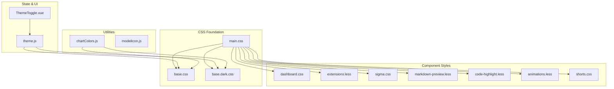
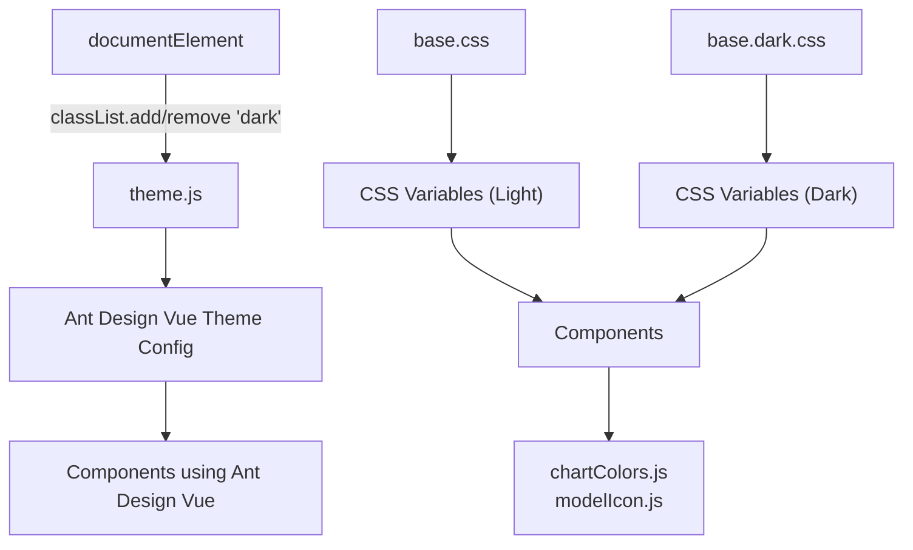
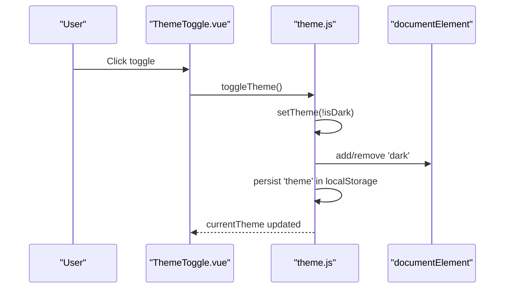
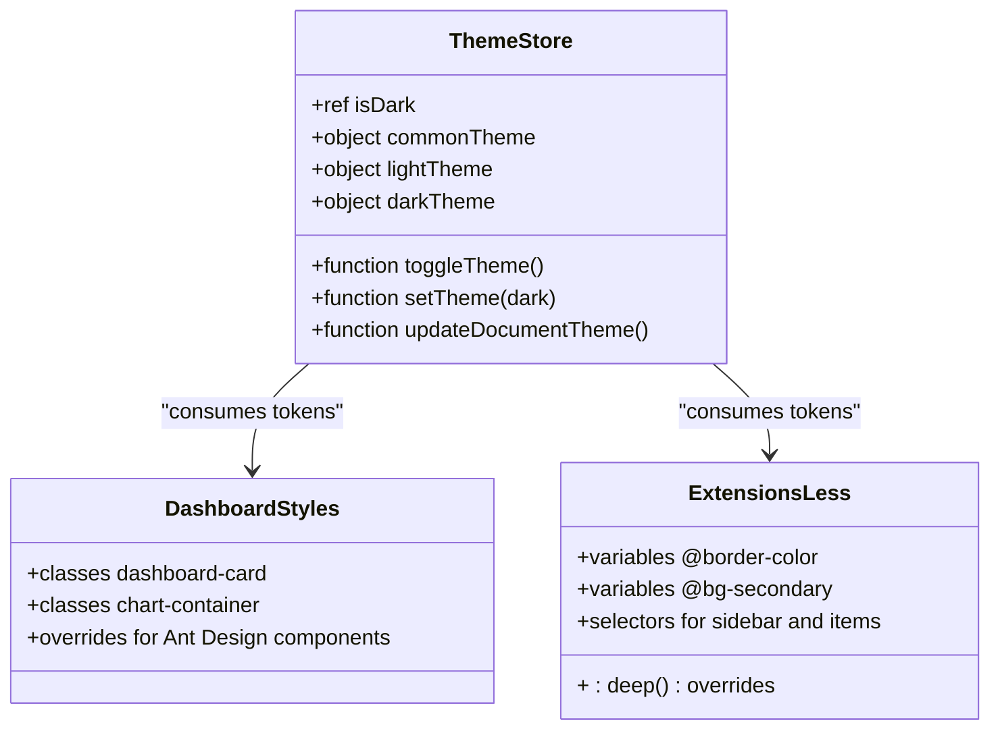
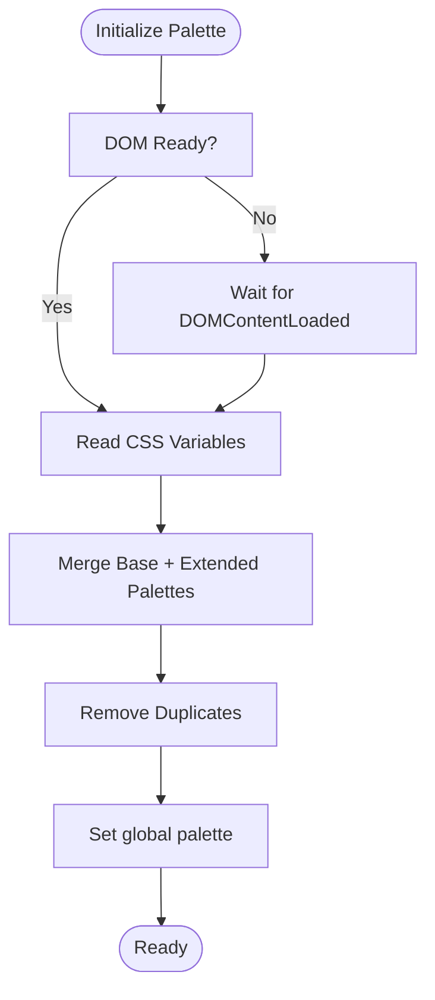
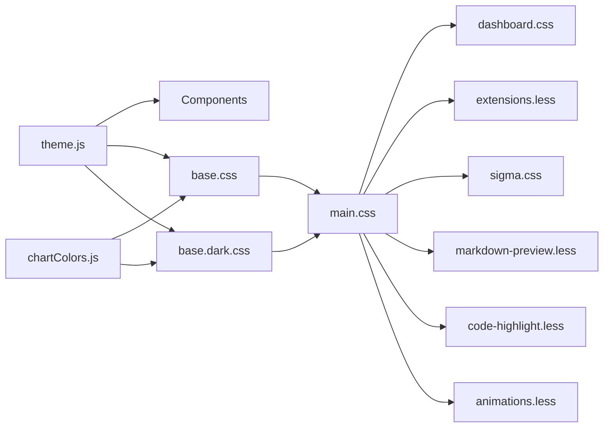
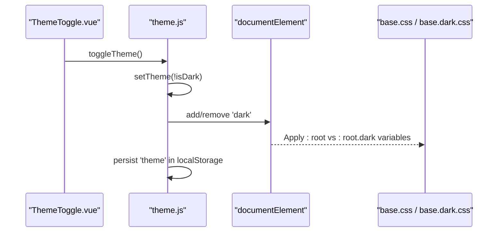

# Design System and Theming

<cite>
**Referenced Files in This Document**
- [base.css](file://web/src/assets/css/base.css)
- [base.dark.css](file://web/src/assets/css/base.dark.css)
- [main.css](file://web/src/assets/css/main.css)
- [dashboard.css](file://web/src/assets/css/dashboard.css)
- [shorts.css](file://web/src/assets/css/shorts.css)
- [sigma.css](file://web/src/assets/css/sigma.css)
- [extensions.less](file://web/src/assets/css/extensions.less)
- [code-highlight.less](file://web/src/assets/css/code-highlight.less)
- [markdown-preview.less](file://web/src/assets/css/markdown-preview.less)
- [animations.less](file://web/src/assets/css/animations.less)
- [chartColors.js](file://web/src/utils/chartColors.js)
- [modelIcon.js](file://web/src/utils/modelIcon.js)
- [theme.js](file://web/src/stores/theme.js)
- [ThemeToggle.vue](file://web/src/components/ThemeToggle.vue)
</cite>

## Table of Contents
1. [Introduction](#introduction)
2. [Project Structure](#project-structure)
3. [Core Components](#core-components)
4. [Architecture Overview](#architecture-overview)
5. [Detailed Component Analysis](#detailed-component-analysis)
6. [Dependency Analysis](#dependency-analysis)
7. [Performance Considerations](#performance-considerations)
8. [Troubleshooting Guide](#troubleshooting-guide)
9. [Conclusion](#conclusion)
10. [Appendices](#appendices)

## Introduction
This document describes Yuxi’s design system and theming capabilities. It explains the CSS architecture (base styles, component-specific styling, and utility classes), the dark/light theme implementation, the color system, typography scale, spacing conventions, Ant Design Vue integration, custom component styling, responsive design patterns, and chart/icon theming. It also covers theme customization via CSS variables, dynamic theme switching, and build-time considerations for production deployment.

## Project Structure
Yuxi organizes its design system primarily under the web frontend assets and utilities:
- Global CSS foundation: base styles, dark mode overrides, and imported bundles
- Component-specific styles: dashboard, extensions, sigma graph, markdown preview, code highlighting, and animations
- Utilities: chart color palette and model icon mapping
- State management: theme store controlling Ant Design Vue theme and document class toggling
- UI component: theme toggle button

**Diagram sources**
- [main.css:1-12](file://web/src/assets/css/main.css#L1-L12)
- [base.css:1-152](file://web/src/assets/css/base.css#L1-L152)
- [base.dark.css:1-135](file://web/src/assets/css/base.dark.css#L1-L135)
- [dashboard.css:1-222](file://web/src/assets/css/dashboard.css#L1-L222)
- [extensions.less:1-805](file://web/src/assets/css/extensions.less#L1-L805)
- [sigma.css:1-88](file://web/src/assets/css/sigma.css#L1-L88)
- [markdown-preview.less:1-53](file://web/src/assets/css/markdown-preview.less#L1-L53)
- [code-highlight.less:1-8](file://web/src/assets/css/code-highlight.less#L1-L8)
- [animations.less:1-88](file://web/src/assets/css/animations.less#L1-L88)
- [shorts.css:1-45](file://web/src/assets/css/shorts.css#L1-L45)
- [chartColors.js:1-127](file://web/src/utils/chartColors.js#L1-L127)
- [modelIcon.js:1-26](file://web/src/utils/modelIcon.js#L1-L26)
- [theme.js:1-66](file://web/src/stores/theme.js#L1-L66)
- [ThemeToggle.vue:1-30](file://web/src/components/ThemeToggle.vue#L1-L30)

**Section sources**
- [main.css:1-59](file://web/src/assets/css/main.css#L1-L59)
- [base.css:1-185](file://web/src/assets/css/base.css#L1-L185)
- [base.dark.css:1-154](file://web/src/assets/css/base.dark.css#L1-L154)

## Core Components
- CSS Variables Foundation: Defines primary, secondary, semantic, accent, and chart palettes; transparency scales; shadows; and Ant Design compatibility variables.
- Dark/Light Mode: Dual roots (:root and :root.dark) with mirrored color scales and adjusted contrast.
- Component Styles: Dashboard cards, charts, tables, progress bars; Extensions sidebar and panels; Sigma graph visuals; Markdown preview; code highlighting themes; and reusable animations.
- Utilities: Chart color palette builder and model icon registry.
- Theme Store: Manages Ant Design Vue theme configuration and toggles the dark class on document root.
- Theme Toggle: UI control to switch themes and persist preference.

**Section sources**
- [base.css:1-185](file://web/src/assets/css/base.css#L1-L185)
- [base.dark.css:1-154](file://web/src/assets/css/base.dark.css#L1-L154)
- [dashboard.css:1-222](file://web/src/assets/css/dashboard.css#L1-L222)
- [extensions.less:1-805](file://web/src/assets/css/extensions.less#L1-L805)
- [sigma.css:1-88](file://web/src/assets/css/sigma.css#L1-L88)
- [chartColors.js:1-127](file://web/src/utils/chartColors.js#L1-L127)
- [modelIcon.js:1-26](file://web/src/utils/modelIcon.js#L1-L26)
- [theme.js:1-66](file://web/src/stores/theme.js#L1-L66)
- [ThemeToggle.vue:1-30](file://web/src/components/ThemeToggle.vue#L1-L30)

## Architecture Overview
The design system is built around CSS custom properties and layered stylesheets. The theme store controls the active theme and applies a “dark” class to the document element. Component styles consume CSS variables and Ant Design Vue tokens to maintain consistency across light and dark modes.

**Diagram sources**
- [theme.js:1-66](file://web/src/stores/theme.js#L1-L66)
- [base.css:1-152](file://web/src/assets/css/base.css#L1-L152)
- [base.dark.css:1-135](file://web/src/assets/css/base.dark.css#L1-L135)
- [chartColors.js:1-127](file://web/src/utils/chartColors.js#L1-L127)
- [modelIcon.js:1-26](file://web/src/utils/modelIcon.js#L1-L26)

## Detailed Component Analysis

### CSS Architecture and Base Styles
- Color System: Five-tier primary palette, five-tier secondary palette, plus semantic colors (success, error, warning, info, accent). Chart palette variables are defined for consistent chart theming.
- Transparency Scale: Predefined alpha blends for light and dark overlays.
- Shadows: A 0–5 tier shadow system for depth cues.
- Ant Design Compatibility: Tokens and color variables aligned with Ant Design Vue defaults.
- Scrollbar: Unified thin scrollbar with themed track and thumb.

**Section sources**
- [base.css:1-185](file://web/src/assets/css/base.css#L1-L185)
- [base.dark.css:1-154](file://web/src/assets/css/base.dark.css#L1-L154)

### Dark/Light Theme Implementation
- Light mode variables are defined in :root.
- Dark mode variables are defined under :root.dark, mirroring and inverting color scales for readability and contrast.
- The theme store toggles the “dark” class on documentElement and persists user preference in localStorage.
- Ant Design Vue theme algorithm switches between light and dark modes.

**Diagram sources**
- [ThemeToggle.vue:1-30](file://web/src/components/ThemeToggle.vue#L1-L30)
- [theme.js:1-66](file://web/src/stores/theme.js#L1-L66)

**Section sources**
- [theme.js:1-66](file://web/src/stores/theme.js#L1-L66)
- [ThemeToggle.vue:1-30](file://web/src/components/ThemeToggle.vue#L1-L30)

### Typography Scale and Spacing Conventions
- Body and headings: Defined in main.css with optimized font rendering and line heights.
- Spacing utilities: A compact set of margin utilities (m-2, mt-2, mb-2, ml-2, mr-2, m-3, mt-3, etc.) for rapid layout composition.

**Section sources**
- [main.css:23-36](file://web/src/assets/css/main.css#L23-L36)
- [shorts.css:1-45](file://web/src/assets/css/shorts.css#L1-L45)

### Ant Design Vue Integration and Custom Styling
- Theme Store: Centralizes Ant Design Vue tokens (font family, primary color, border radius) and algorithm selection for dark mode.
- Dashboard Styles: Extensive overrides for Ant Design components (cards, statistics, tables, progress) to align with the design system.
- Extensions Styles: Deep selectors (:deep) to style Ant Design inputs, tabs, and form elements consistently.

**Diagram sources**
- [theme.js:1-66](file://web/src/stores/theme.js#L1-L66)
- [dashboard.css:55-222](file://web/src/assets/css/dashboard.css#L55-L222)
- [extensions.less:1-805](file://web/src/assets/css/extensions.less#L1-L805)

**Section sources**
- [theme.js:1-66](file://web/src/stores/theme.js#L1-L66)
- [dashboard.css:55-222](file://web/src/assets/css/dashboard.css#L55-L222)
- [extensions.less:1-805](file://web/src/assets/css/extensions.less#L1-L805)

### Chart Theming with chartColors.js
- Dynamic Palette Builder: Reads CSS variables from base.css and base.dark.css to construct a unified palette.
- Priority and Deduplication: Palette colors are merged with base colors, deduplicated, and exposed via getters.
- Initialization: Automatically initializes on DOMContentLoaded or on first use.

**Diagram sources**
- [chartColors.js:14-74](file://web/src/utils/chartColors.js#L14-L74)

**Section sources**
- [chartColors.js:1-127](file://web/src/utils/chartColors.js#L1-L127)
- [base.css:94-104](file://web/src/assets/css/base.css#L94-L104)
- [base.dark.css:79-88](file://web/src/assets/css/base.dark.css#L79-L88)

### Icon Systems with modelIcon.js
- Provider Icons: A registry mapping provider keys to SVG assets for consistent iconography across models and tools.

**Section sources**
- [modelIcon.js:1-26](file://web/src/utils/modelIcon.js#L1-L26)

### Responsive Design Patterns
- Container and Tooltip Scaling: Sigma graph adjusts font sizes and tooltip padding at smaller widths.
- Breakpoints: Media queries ensure readable and usable UI on mobile devices.

**Section sources**
- [sigma.css:77-87](file://web/src/assets/css/sigma.css#L77-L87)

### Accessibility Considerations
- Contrast and Readability: Dark mode variables invert color scales to preserve readability and reduce eye strain.
- Semantic Colors: Distinct semantic hues for success, warning, error, and info afford clear meaning.
- Focus States: Hover and focus states are defined in component styles to support keyboard navigation.

**Section sources**
- [base.dark.css:26-42](file://web/src/assets/css/base.dark.css#L26-L42)
- [dashboard.css:163-222](file://web/src/assets/css/dashboard.css#L163-L222)
- [extensions.less:141-150](file://web/src/assets/css/extensions.less#L141-L150)

## Dependency Analysis
- CSS Layering: main.css imports base.css and base.dark.css, ensuring both light and dark variables are available. Component styles depend on these variables.
- Theme Store Dependency: Components rely on theme.js for Ant Design tokens and dark mode class application.
- Utility Dependencies: chartColors.js depends on CSS variable availability; modelIcon.js is a pure asset registry.

**Diagram sources**
- [main.css:1-8](file://web/src/assets/css/main.css#L1-L8)
- [base.css:1-152](file://web/src/assets/css/base.css#L1-L152)
- [base.dark.css:1-135](file://web/src/assets/css/base.dark.css#L1-L135)
- [dashboard.css:1-222](file://web/src/assets/css/dashboard.css#L1-L222)
- [extensions.less:1-805](file://web/src/assets/css/extensions.less#L1-L805)
- [sigma.css:1-88](file://web/src/assets/css/sigma.css#L1-L88)
- [markdown-preview.less:1-53](file://web/src/assets/css/markdown-preview.less#L1-L53)
- [code-highlight.less:1-8](file://web/src/assets/css/code-highlight.less#L1-L8)
- [animations.less:1-88](file://web/src/assets/css/animations.less#L1-L88)
- [theme.js:1-66](file://web/src/stores/theme.js#L1-L66)
- [chartColors.js:1-127](file://web/src/utils/chartColors.js#L1-L127)

**Section sources**
- [main.css:1-8](file://web/src/assets/css/main.css#L1-L8)
- [theme.js:1-66](file://web/src/stores/theme.js#L1-L66)
- [chartColors.js:1-127](file://web/src/utils/chartColors.js#L1-L127)

## Performance Considerations
- CSS Variable Usage: Prefer CSS variables for theme colors to avoid reflows and enable efficient runtime switching.
- Minimize Deep Selectors: Reduce reliance on :deep() to improve specificity and maintainability.
- Lazy Initialization: chartColors.js initializes on first use or DOMContentLoaded to avoid blocking render.
- Asset Bundling: Ensure CSS imports are bundled efficiently; consider extracting vendor CSS and splitting chunks for production builds.

[No sources needed since this section provides general guidance]

## Troubleshooting Guide
- Theme Not Switching: Verify the “dark” class is applied to documentElement and localStorage contains the expected theme value.
- Ant Design Overrides Not Applying: Confirm component selectors match Ant Design’s generated classes and use appropriate specificity or :deep().
- Chart Colors Incorrect: Ensure CSS variables are present in both base.css and base.dark.css; confirm chartColors.js initialization runs after DOM is ready.
- Icons Missing: Check modelIcon.js mapping keys and asset paths.

**Section sources**
- [theme.js:34-57](file://web/src/stores/theme.js#L34-L57)
- [dashboard.css:71-222](file://web/src/assets/css/dashboard.css#L71-L222)
- [chartColors.js:117-127](file://web/src/utils/chartColors.js#L117-L127)
- [modelIcon.js:13-25](file://web/src/utils/modelIcon.js#L13-L25)

## Conclusion
Yuxi’s design system centers on a robust CSS variable foundation with dual light/dark modes, a consistent color and shadow system, and Ant Design Vue integration. Utilities like chartColors.js and modelIcon.js streamline theming and iconography. The theme store and toggle component provide seamless, persistent theme switching. Component styles leverage these primitives to deliver cohesive UI experiences across dashboards, extensions, graphs, and markdown previews.

[No sources needed since this section summarizes without analyzing specific files]

## Appendices

### Theme Customization Examples
- CSS Variables: Adjust primary, secondary, and semantic variables in base.css and base.dark.css to reflect brand changes.
- Ant Design Tokens: Modify tokens in theme.js to change fonts, radii, and primary color globally.
- Chart Palette: Extend chart palette variables to introduce new series colors consistently.

**Section sources**
- [base.css:45-104](file://web/src/assets/css/base.css#L45-L104)
- [base.dark.css:44-88](file://web/src/assets/css/base.dark.css#L44-L88)
- [theme.js:10-29](file://web/src/stores/theme.js#L10-L29)
- [chartColors.js:24-45](file://web/src/utils/chartColors.js#L24-L45)

### Dynamic Theme Switching Workflow

**Diagram sources**
- [ThemeToggle.vue:1-30](file://web/src/components/ThemeToggle.vue#L1-L30)
- [theme.js:34-57](file://web/src/stores/theme.js#L34-L57)
- [base.css:154-156](file://web/src/assets/css/base.css#L154-L156)
- [base.dark.css:2-20](file://web/src/assets/css/base.dark.css#L2-L20)