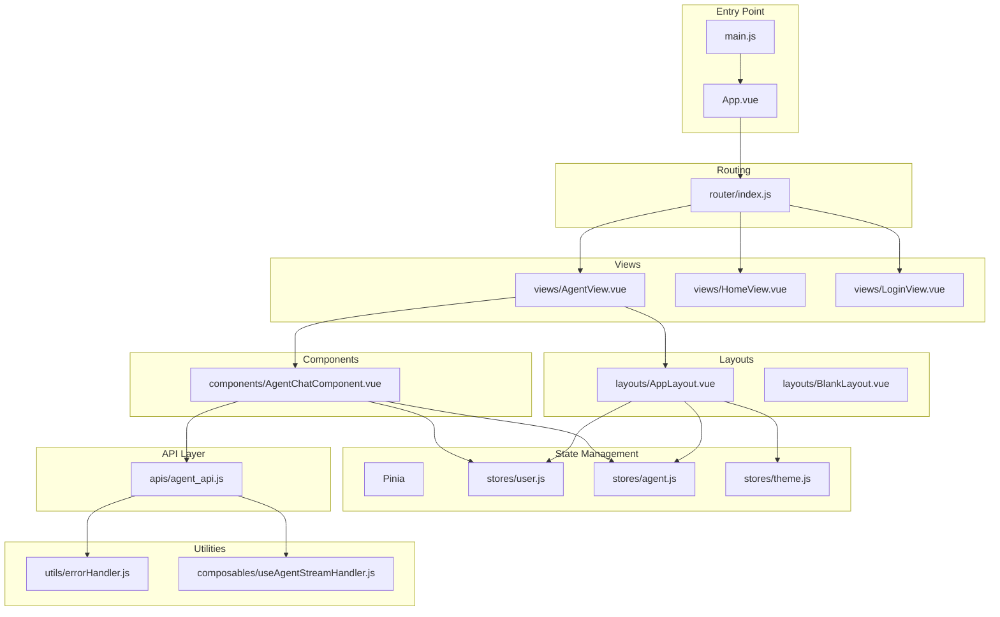
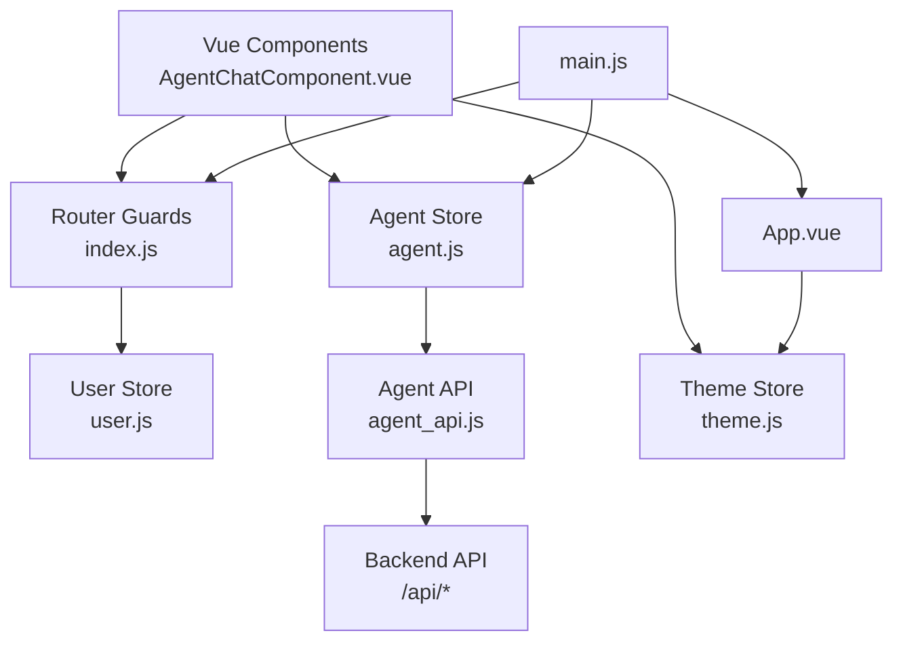
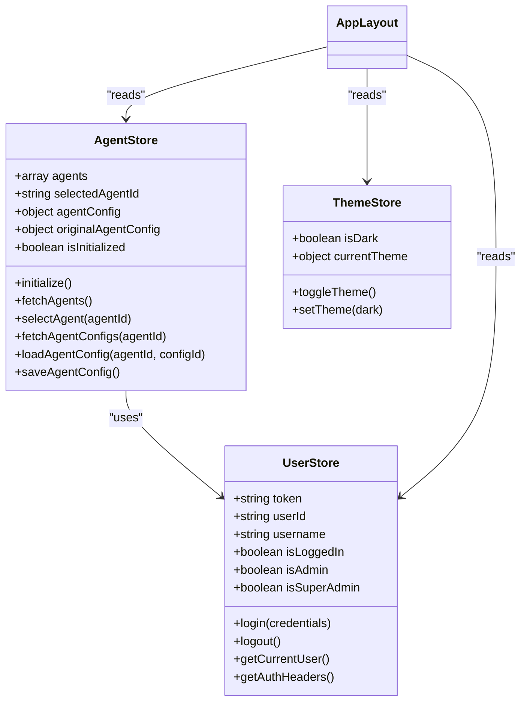
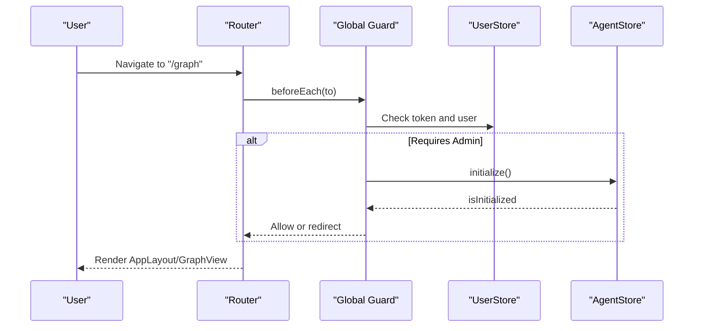
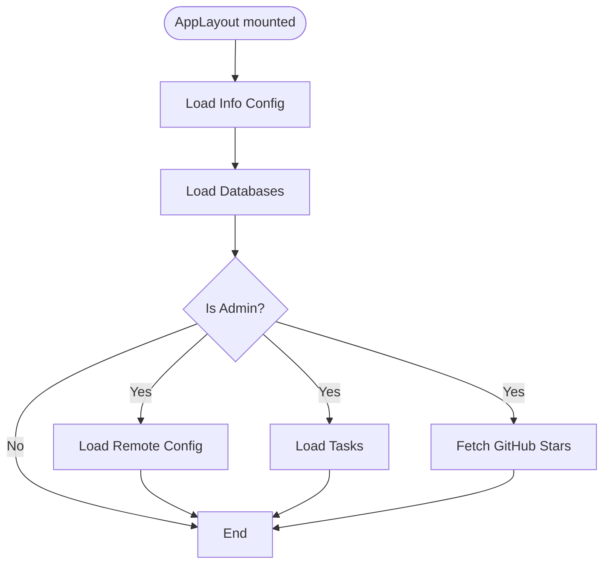
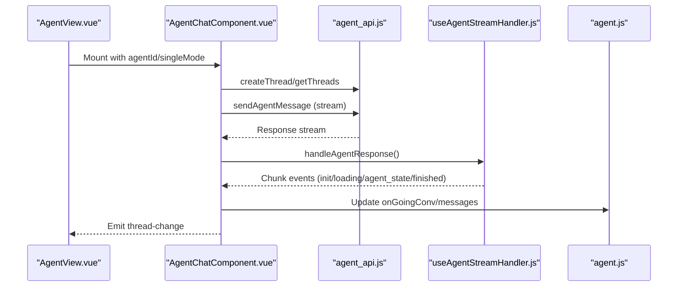
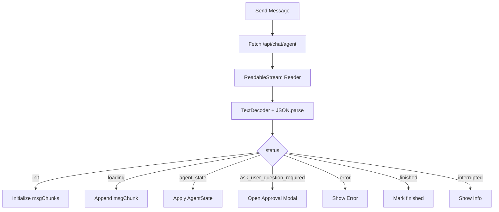
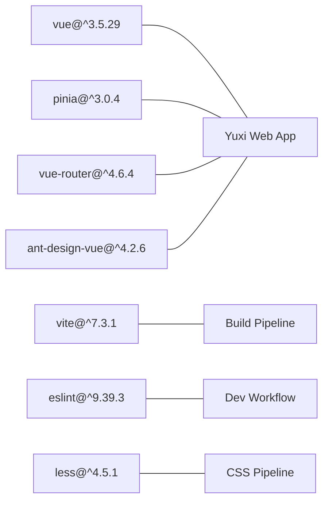

# Frontend Application Architecture

<cite>
**Referenced Files in This Document**
- [main.js](file://web/src/main.js)
- [App.vue](file://web/src/App.vue)
- [index.js](file://web/src/router/index.js)
- [package.json](file://web/package.json)
- [vite.config.js](file://web/vite.config.js)
- [agent.js](file://web/src/stores/agent.js)
- [user.js](file://web/src/stores/user.js)
- [theme.js](file://web/src/stores/theme.js)
- [AppLayout.vue](file://web/src/layouts/AppLayout.vue)
- [AgentView.vue](file://web/src/views/AgentView.vue)
- [AgentChatComponent.vue](file://web/src/components/AgentChatComponent.vue)
- [agent_api.js](file://web/src/apis/agent_api.js)
- [errorHandler.js](file://web/src/utils/errorHandler.js)
- [main.css](file://web/src/assets/css/main.css)
- [useAgentStreamHandler.js](file://web/src/composables/useAgentStreamHandler.js)
</cite>

## Table of Contents
1. [Introduction](#introduction)
2. [Project Structure](#project-structure)
3. [Core Components](#core-components)
4. [Architecture Overview](#architecture-overview)
5. [Detailed Component Analysis](#detailed-component-analysis)
6. [Dependency Analysis](#dependency-analysis)
7. [Performance Considerations](#performance-considerations)
8. [Troubleshooting Guide](#troubleshooting-guide)
9. [Conclusion](#conclusion)
10. [Appendices](#appendices)

## Introduction
This document describes the frontend architecture of Yuxi’s Vue.js single-page application. It covers the component-based design, state management with Pinia, routing system, and the integration with backend APIs. It also documents the application state flow, data binding patterns, reactive programming concepts, real-time communication, error handling strategies, design system and theming, responsive design, and the build and deployment pipeline.

## Project Structure
The frontend is organized around a modern Vue 3 + Vite stack with Pinia for state management and Ant Design Vue for UI primitives. The application follows a feature-based structure under src/, with dedicated folders for views, components, stores, APIs, composables, layouts, and assets.

**Diagram sources**
- [main.js:1-26](file://web/src/main.js#L1-L26)
- [App.vue:1-23](file://web/src/App.vue#L1-L23)
- [index.js:1-200](file://web/src/router/index.js#L1-L200)
- [agent.js:1-567](file://web/src/stores/agent.js#L1-L567)
- [user.js:1-404](file://web/src/stores/user.js#L1-L404)
- [theme.js:1-66](file://web/src/stores/theme.js#L1-L66)
- [AppLayout.vue:1-545](file://web/src/layouts/AppLayout.vue#L1-L545)
- [AgentView.vue:1-384](file://web/src/views/AgentView.vue#L1-L384)
- [AgentChatComponent.vue:1-800](file://web/src/components/AgentChatComponent.vue#L1-L800)
- [agent_api.js:1-419](file://web/src/apis/agent_api.js#L1-L419)
- [errorHandler.js:1-148](file://web/src/utils/errorHandler.js#L1-L148)
- [useAgentStreamHandler.js:1-236](file://web/src/composables/useAgentStreamHandler.js#L1-L236)

**Section sources**
- [main.js:1-26](file://web/src/main.js#L1-L26)
- [package.json:1-51](file://web/package.json#L1-L51)
- [vite.config.js:1-30](file://web/vite.config.js#L1-L30)

## Core Components
- Application bootstrap initializes Vue, Pinia, Ant Design Vue, and global styles. It preloads configuration via the info store.
- App.vue wires theme and locale providers and mounts the router outlet.
- Router defines nested layouts, protected routes, and guards for authentication and role checks.
- Stores encapsulate domain logic: user session, agent configuration and state, theme selection, and UI flags.
- Views and components implement feature areas: agent chat, configuration sidebar, and admin dashboards.
- API module abstracts backend endpoints and integrates with user authentication headers.
- Utilities centralize error handling and streaming response processing.

**Section sources**
- [main.js:1-26](file://web/src/main.js#L1-L26)
- [App.vue:1-23](file://web/src/App.vue#L1-L23)
- [index.js:1-200](file://web/src/router/index.js#L1-L200)
- [agent.js:1-567](file://web/src/stores/agent.js#L1-L567)
- [user.js:1-404](file://web/src/stores/user.js#L1-L404)
- [theme.js:1-66](file://web/src/stores/theme.js#L1-L66)
- [agent_api.js:1-419](file://web/src/apis/agent_api.js#L1-L419)
- [errorHandler.js:1-148](file://web/src/utils/errorHandler.js#L1-L148)

## Architecture Overview
The application follows a layered architecture:
- Presentation layer: Vue components and views
- Routing layer: Vue Router with guards
- State layer: Pinia stores with persistence
- Service layer: API modules and composables
- Infrastructure: Vite build toolchain, proxy configuration, and environment variables

**Diagram sources**
- [index.js:125-197](file://web/src/router/index.js#L125-L197)
- [user.js:1-404](file://web/src/stores/user.js#L1-L404)
- [agent.js:1-567](file://web/src/stores/agent.js#L1-L567)
- [agent_api.js:1-419](file://web/src/apis/agent_api.js#L1-L419)
- [App.vue:18-22](file://web/src/App.vue#L18-L22)
- [main.js:12-25](file://web/src/main.js#L12-L25)

## Detailed Component Analysis

### State Management with Pinia
- Agent store manages agents, configurations, mentions, and initialization lifecycle. It persists selected agent and config selections to localStorage.
- User store handles authentication state, roles, and API requests with bearer tokens.
- Theme store controls light/dark themes and applies CSS classes to document root.

**Diagram sources**
- [user.js:1-404](file://web/src/stores/user.js#L1-L404)
- [agent.js:1-567](file://web/src/stores/agent.js#L1-L567)
- [theme.js:1-66](file://web/src/stores/theme.js#L1-L66)

**Section sources**
- [agent.js:117-176](file://web/src/stores/agent.js#L117-L176)
- [user.js:23-90](file://web/src/stores/user.js#L23-L90)
- [theme.js:34-58](file://web/src/stores/theme.js#L34-L58)

### Routing and Navigation
- Routes define nested layouts (AppLayout/BlankLayout), protected pages, and redirects.
- Global beforeEach guard enforces authentication and role checks, hydrates user info, and redirects appropriately.

**Diagram sources**
- [index.js:125-197](file://web/src/router/index.js#L125-L197)
- [agent.js:120-176](file://web/src/stores/agent.js#L120-L176)

**Section sources**
- [index.js:9-123](file://web/src/router/index.js#L9-L123)
- [index.js:125-197](file://web/src/router/index.js#L125-L197)

### Layout and Navigation
- AppLayout provides a responsive navigation bar, conditional menus based on roles, and keeps-alive routing for performance.
- It initializes system info, database lists, and tasks for administrators.

**Diagram sources**
- [AppLayout.vue:82-93](file://web/src/layouts/AppLayout.vue#L82-L93)

**Section sources**
- [AppLayout.vue:104-150](file://web/src/layouts/AppLayout.vue#L104-L150)
- [AppLayout.vue:221-227](file://web/src/layouts/AppLayout.vue#L221-L227)

### Agent Chat Interface
- AgentChatComponent orchestrates chat threads, messages, agent panels, and streaming responses.
- It computes conversations from history and ongoing chunks, manages approvals, and exposes actions to the parent view.

**Diagram sources**
- [AgentView.vue:120-172](file://web/src/views/AgentView.vue#L120-L172)
- [AgentChatComponent.vue:634-800](file://web/src/components/AgentChatComponent.vue#L634-L800)
- [agent_api.js:28-45](file://web/src/apis/agent_api.js#L28-L45)
- [useAgentStreamHandler.js:208-234](file://web/src/composables/useAgentStreamHandler.js#L208-L234)

**Section sources**
- [AgentChatComponent.vue:373-566](file://web/src/components/AgentChatComponent.vue#L373-L566)
- [AgentChatComponent.vue:634-800](file://web/src/components/AgentChatComponent.vue#L634-L800)

### API Integration and Real-Time Streaming
- agent_api.js abstracts chat endpoints, runs, SSE events, and thread/file operations.
- useAgentStreamHandler.js parses server-sent chunks, manages state transitions, and coordinates approvals.

**Diagram sources**
- [agent_api.js:28-45](file://web/src/apis/agent_api.js#L28-L45)
- [useAgentStreamHandler.js:10-63](file://web/src/composables/useAgentStreamHandler.js#L10-L63)
- [useAgentStreamHandler.js:79-200](file://web/src/composables/useAgentStreamHandler.js#L79-L200)

**Section sources**
- [agent_api.js:13-243](file://web/src/apis/agent_api.js#L13-L243)
- [useAgentStreamHandler.js:208-234](file://web/src/composables/useAgentStreamHandler.js#L208-L234)

### Error Handling Strategy
- Centralized ErrorHandler provides severity-aware messaging and context-specific handlers for chat operations.
- Stores and components surface errors via message notifications and state flags.

**Section sources**
- [errorHandler.js:65-101](file://web/src/utils/errorHandler.js#L65-L101)
- [agent.js:170-175](file://web/src/stores/agent.js#L170-L175)

### Design System, Theming, and Responsive Patterns
- Theme store toggles dark/light modes and updates document classes for CSS scoping.
- App.vue wraps the app with Ant Design’s ConfigProvider and sets locale.
- main.css imports base, dark, and feature-specific styles; components use Less for scoped styles and responsive breakpoints.

**Section sources**
- [theme.js:34-58](file://web/src/stores/theme.js#L34-L58)
- [App.vue:18-22](file://web/src/App.vue#L18-L22)
- [main.css:1-59](file://web/src/assets/css/main.css#L1-L59)
- [AppLayout.vue:424-543](file://web/src/layouts/AppLayout.vue#L424-L543)

## Dependency Analysis
- Runtime dependencies include Vue 3, Pinia, Vue Router, Ant Design Vue, and visualization libraries.
- Build-time dependencies include Vite, Vue plugin, ESLint/Prettier, and Less.
- Vite proxy forwards /api to backend service with hot-reload watching tuned for development.

**Diagram sources**
- [package.json:14-49](file://web/package.json#L14-L49)
- [vite.config.js:1-30](file://web/vite.config.js#L1-L30)

**Section sources**
- [package.json:14-49](file://web/package.json#L14-L49)
- [vite.config.js:15-27](file://web/vite.config.js#L15-L27)

## Performance Considerations
- Keep-alive routing reduces reinitialization costs for frequently visited views.
- Pinia persisted state avoids redundant network calls on page reload.
- Streaming response parsing decodes incrementally and flushes buffers to minimize memory pressure.
- Resize observers and debounced scroll handlers improve responsiveness on smaller screens.

## Troubleshooting Guide
- Authentication failures: Verify token presence and user hydration in the global guard; clear stale tokens on 401.
- Initialization errors: Check agent store initialization and fallback to default agent selection.
- Streaming interruptions: Inspect status transitions and abort controllers; confirm backend SSE connectivity.
- UI state inconsistencies: Confirm keep-alive behavior and route param synchronization in AgentView.

**Section sources**
- [index.js:134-143](file://web/src/router/index.js#L134-L143)
- [agent.js:120-176](file://web/src/stores/agent.js#L120-L176)
- [useAgentStreamHandler.js:103-116](file://web/src/composables/useAgentStreamHandler.js#L103-L116)
- [AgentView.vue:120-172](file://web/src/views/AgentView.vue#L120-L172)

## Conclusion
Yuxi’s frontend leverages Vue 3’s Composition API, Pinia for predictable state, and Vue Router for structured navigation. The agent-centric chat interface integrates tightly with backend streaming APIs, while robust error handling and theming provide a polished user experience. The modular component architecture and build tooling support maintainability and scalability.

## Appendices

### Build and Deployment Notes
- Scripts: dev, server, server:prod, build, preview, lint, format.
- Proxy: /api forwarded to backend service with changeOrigin enabled.
- Environment: VITE_* variables consumed via loadEnv; BASE_URL injected by Vite history mode.

**Section sources**
- [package.json:5-13](file://web/package.json#L5-L13)
- [vite.config.js:15-21](file://web/vite.config.js#L15-L21)