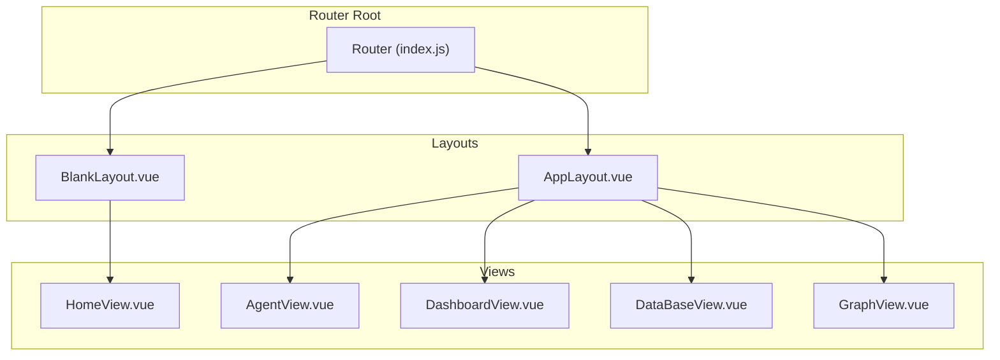
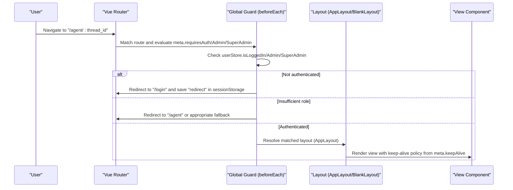
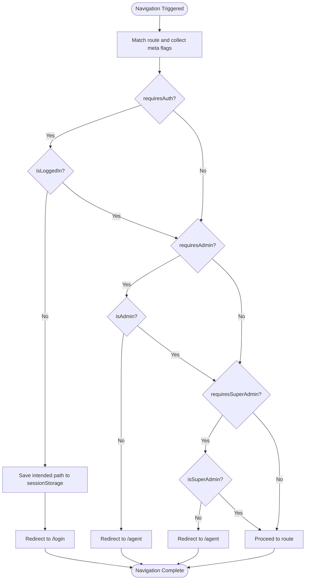
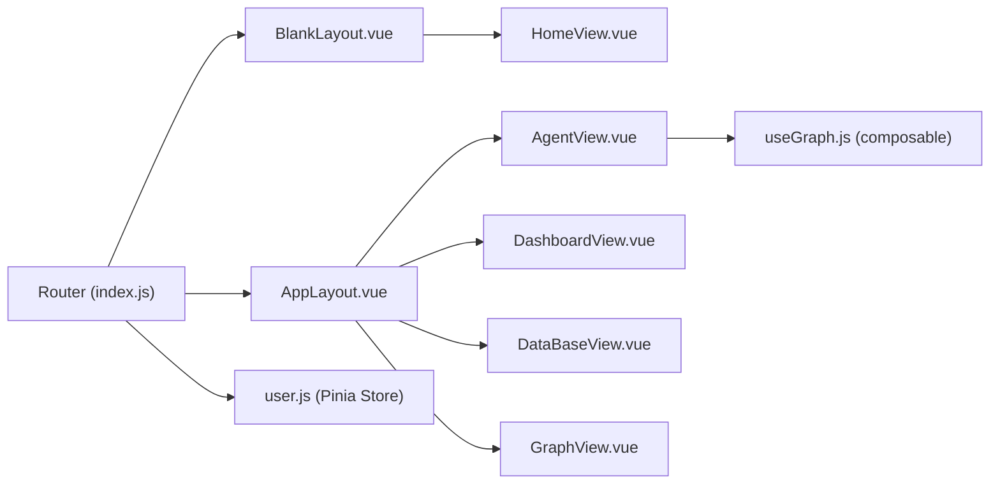

# Routing and Navigation

<cite>
**Referenced Files in This Document**
- [index.js](file://web/src/router/index.js)
- [AppLayout.vue](file://web/src/layouts/AppLayout.vue)
- [BlankLayout.vue](file://web/src/layouts/BlankLayout.vue)
- [HomeView.vue](file://web/src/views/HomeView.vue)
- [AgentView.vue](file://web/src/views/AgentView.vue)
- [DashboardView.vue](file://web/src/views/DashboardView.vue)
- [DataBaseView.vue](file://web/src/views/DataBaseView.vue)
- [GraphView.vue](file://web/src/views/GraphView.vue)
- [user.js](file://web/src/stores/user.js)
- [useGraph.js](file://web/src/composables/useGraph.js)
- [main.js](file://web/src/main.js)
- [App.vue](file://web/src/App.vue)
</cite>

## Table of Contents
1. [Introduction](#introduction)
2. [Project Structure](#project-structure)
3. [Core Components](#core-components)
4. [Architecture Overview](#architecture-overview)
5. [Detailed Component Analysis](#detailed-component-analysis)
6. [Dependency Analysis](#dependency-analysis)
7. [Performance Considerations](#performance-considerations)
8. [Troubleshooting Guide](#troubleshooting-guide)
9. [Conclusion](#conclusion)

## Introduction
This document explains the Vue Router implementation powering Yuxi’s navigation and routing. It covers route configuration for HomeView, AgentView, DashboardView, DataBaseView, and GraphView; authentication-based routing via global navigation guards; programmatic navigation patterns; route parameters and query handling; route meta fields and lazy loading; and integration with Ant Design Vue for navigation UI. It also documents responsive navigation patterns and how the application manages navigation state.

## Project Structure
Yuxi organizes routing around two layouts:
- BlankLayout: Used for the landing page and login flow.
- AppLayout: Used for authenticated sections and provides a persistent sidebar navigation.

**Diagram sources**
- [index.js:1-123](file://web/src/router/index.js#L1-L123)
- [BlankLayout.vue:1-10](file://web/src/layouts/BlankLayout.vue#L1-L10)
- [AppLayout.vue:158-244](file://web/src/layouts/AppLayout.vue#L158-L244)

**Section sources**
- [index.js:1-123](file://web/src/router/index.js#L1-L123)
- [BlankLayout.vue:1-10](file://web/src/layouts/BlankLayout.vue#L1-L10)
- [AppLayout.vue:158-244](file://web/src/layouts/AppLayout.vue#L158-L244)

## Core Components
- Router configuration defines routes, nested layouts, lazy-loaded views, and route meta flags.
- Global navigation guards enforce authentication and role-based access.
- Layouts render persistent navigation and integrate with Ant Design Vue components.
- Views implement programmatic navigation, route parameters, and state synchronization.

Key routing highlights:
- Lazy loading via dynamic imports for all views.
- Route meta fields for keep-alive and permission gating.
- Programmatic navigation using useRouter and router.push/router.replace.
- Dynamic route segments for threads and database IDs.

**Section sources**
- [index.js:7-123](file://web/src/router/index.js#L7-L123)
- [user.js:18-20](file://web/src/stores/user.js#L18-L20)
- [AgentView.vue:106-172](file://web/src/views/AgentView.vue#L106-L172)
- [GraphView.vue:229-608](file://web/src/views/GraphView.vue#L229-L608)
- [DataBaseView.vue:252-489](file://web/src/views/DataBaseView.vue#L252-L489)

## Architecture Overview
The routing architecture enforces authentication and roles globally while delegating UI navigation to AppLayout. The router initializes with history mode and a BASE_URL. Global beforeEach checks route meta flags and user state to redirect appropriately.

**Diagram sources**
- [index.js:125-197](file://web/src/router/index.js#L125-L197)
- [AppLayout.vue:221-226](file://web/src/layouts/AppLayout.vue#L221-L226)
- [user.js:18-20](file://web/src/stores/user.js#L18-L20)

**Section sources**
- [index.js:125-197](file://web/src/router/index.js#L125-L197)
- [AppLayout.vue:221-226](file://web/src/layouts/AppLayout.vue#L221-L226)

## Detailed Component Analysis

### Route Configuration and Meta Fields
- Routes are defined with nested children under BlankLayout and AppLayout.
- Meta fields:
  - keepAlive: controls whether views are wrapped in keep-alive.
  - requiresAuth: gates access behind authentication.
  - requiresAdmin: restricts to admin/superadmin.
  - requiresSuperAdmin: restricts to superadmin.
- Lazy loading:
  - All views use dynamic imports for on-demand loading.

Examples of route definitions and meta usage:
- Home route under BlankLayout with keepAlive enabled and requiresAuth false.
- Agent route with optional thread_id param and keepAlive enabled.
- Graph route restricted to admin/superadmin with keepAlive disabled.
- Database route with database_id param and admin/superadmin restrictions.
- Dashboard and Extensions routes with admin/superadmin and superadmin-only flags.

**Section sources**
- [index.js:9-123](file://web/src/router/index.js#L9-L123)

### Authentication-Based Routing and Global Guards
- Global beforeEach evaluates:
  - requiresAuth: redirects to login and saves intended path.
  - requiresAdmin: redirects to /agent for non-admins.
  - requiresSuperAdmin: redirects to /agent for non-superadmins.
  - Login protection: redirects logged-in users away from /login.
- User state management:
  - Token and role derived from user store.
  - On missing user info, attempts to refresh via getCurrentUser.

**Diagram sources**
- [index.js:125-197](file://web/src/router/index.js#L125-L197)
- [user.js:291-320](file://web/src/stores/user.js#L291-L320)

**Section sources**
- [index.js:125-197](file://web/src/router/index.js#L125-L197)
- [user.js:291-320](file://web/src/stores/user.js#L291-L320)

### Programmatic Navigation and Route Parameters
- AgentView:
  - Reads route.params.thread_id and synchronizes with chat component.
  - Uses router.replace to maintain canonical URLs for thread routes.
- GraphView:
  - Navigates to /database/:databaseId when needed.
- HomeView:
  - Pushes to /login with redirect intent stored in sessionStorage.
  - Navigates to /agent or default agent based on user role.
- DatabaseView:
  - Navigates to /database/:databaseId upon selection.

Common patterns:
- useRoute/useRouter hooks to read/write route state.
- router.push for navigation; router.replace for canonical updates.
- Conditional navigation based on user role and store state.

**Section sources**
- [AgentView.vue:106-172](file://web/src/views/AgentView.vue#L106-L172)
- [GraphView.vue:594-608](file://web/src/views/GraphView.vue#L594-L608)
- [HomeView.vue:358-388](file://web/src/views/HomeView.vue#L358-L388)
- [DataBaseView.vue:487-489](file://web/src/views/DataBaseView.vue#L487-L489)

### Route Meta Fields and Keep-Alive
- keepAlive: true/false in meta determines whether a view is wrapped in keep-alive during layout rendering.
- AppLayout conditionally wraps router-view with keep-alive based on route.meta.keepAlive.

Implications:
- Improves UX by preserving component state across navigations.
- Reduces unnecessary re-fetching for cached views.

**Section sources**
- [index.js:19, 38, 57, 70, 89, 106:19-107](file://web/src/router/index.js#L19-L107)
- [AppLayout.vue:221-226](file://web/src/layouts/AppLayout.vue#L221-L226)

### Lazy Loading Routes
- All views are loaded lazily via dynamic imports in the router configuration.
- Benefits: reduced initial bundle size, faster first paint.

**Section sources**
- [index.js:18, 37, 56, 69, 88, 101:18-101](file://web/src/router/index.js#L18-L101)

### Dynamic Route Generation
- Thread-based routing:
  - Pattern: /agent/:thread_id
  - Synchronization: AgentView watches route.params.thread_id and updates internal state accordingly.
- Database-based routing:
  - Pattern: /database/:database_id
  - Selection: DatabaseView navigates to /database/:databaseId when a database is chosen.

**Section sources**
- [index.js:41-45](file://web/src/router/index.js#L41-L45)
- [AgentView.vue:115-154](file://web/src/views/AgentView.vue#L115-L154)
- [DataBaseView.vue:487-489](file://web/src/views/DataBaseView.vue#L487-L489)

### Breadcrumb Navigation and Active Link Highlighting
- Breadcrumbs:
  - Implemented in individual views (e.g., GraphView and DatabaseView) using Ant Design Vue components and custom headers.
- Active link highlighting:
  - AppLayout computes navigation items and applies active-class to RouterLink based on route.path.
  - Icons reflect active state using route.path comparisons.

Responsive patterns:
- AppLayout supports a compact vertical sidebar and a top bar variant, adapting navigation presentation based on layout settings.

**Section sources**
- [AppLayout.vue:104-150](file://web/src/layouts/AppLayout.vue#L104-L150)
- [AppLayout.vue:168-184](file://web/src/layouts/AppLayout.vue#L168-L184)
- [GraphView.vue:10-46](file://web/src/views/GraphView.vue#L10-L46)
- [DataBaseView.vue:3-7](file://web/src/views/DataBaseView.vue#L3-L7)

### Navigation State Management
- User store encapsulates authentication state and role checks.
- App initialization ensures user info is loaded and agent store is initialized when applicable.
- Graph composable centralizes graph-related UI state for GraphView.

**Section sources**
- [user.js:18-20](file://web/src/stores/user.js#L18-L20)
- [App.vue:12-16](file://web/src/App.vue#L12-L16)
- [useGraph.js:3-72](file://web/src/composables/useGraph.js#L3-L72)

### Integration with Ant Design Vue Components for Navigation
- AppLayout integrates Ant Design Vue icons and tooltips for navigation items.
- UserInfoComponent provides dropdown menus with navigation actions (docs, theme toggle, settings, logout).
- GraphView and DatabaseView use Ant Design Vue components for modals, selects, inputs, and buttons.

**Section sources**
- [AppLayout.vue:5, 176-183:5-183](file://web/src/layouts/AppLayout.vue#L5-L183)
- [UserInfoComponent.vue:17-62](file://web/src/components/UserInfoComponent.vue#L17-L62)
- [GraphView.vue:112-196](file://web/src/views/GraphView.vue#L112-L196)
- [DataBaseView.vue:9-162](file://web/src/views/DataBaseView.vue#L9-L162)

## Dependency Analysis
The routing system depends on:
- Router configuration for route definitions and lazy loading.
- Global guards for authentication and role enforcement.
- Layouts for persistent navigation and keep-alive behavior.
- Stores for user state and role checks.
- View components for programmatic navigation and route parameter handling.

**Diagram sources**
- [index.js:1-123](file://web/src/router/index.js#L1-L123)
- [BlankLayout.vue:1-10](file://web/src/layouts/BlankLayout.vue#L1-L10)
- [AppLayout.vue:158-244](file://web/src/layouts/AppLayout.vue#L158-L244)
- [HomeView.vue:127-149](file://web/src/views/HomeView.vue#L127-L149)
- [AgentView.vue:80-107](file://web/src/views/AgentView.vue#L80-L107)
- [DashboardView.vue:58-71](file://web/src/views/DashboardView.vue#L58-L71)
- [DataBaseView.vue:234-255](file://web/src/views/DataBaseView.vue#L234-L255)
- [GraphView.vue:199-235](file://web/src/views/GraphView.vue#L199-L235)
- [user.js:1-404](file://web/src/stores/user.js#L1-L404)
- [useGraph.js:1-73](file://web/src/composables/useGraph.js#L1-L73)

**Section sources**
- [index.js:1-123](file://web/src/router/index.js#L1-L123)
- [user.js:1-404](file://web/src/stores/user.js#L1-L404)
- [useGraph.js:1-73](file://web/src/composables/useGraph.js#L1-L73)

## Performance Considerations
- Lazy loading routes reduces initial payload and improves startup performance.
- keepAlive meta enables state preservation for frequently accessed views, reducing redundant network requests.
- Global guards avoid unnecessary work by short-circuiting navigation early when permissions are insufficient.
- Avoid excessive re-renders by leveraging route.params watchers and replace semantics for canonical URLs.

## Troubleshooting Guide
Common issues and resolutions:
- Redirect loops to /login:
  - Ensure token exists and user info is loaded; global guard triggers redirect when requiresAuth is true and user is not logged in.
- Permission errors:
  - If route requires admin/superadmin and user lacks role, navigation is redirected to /agent; verify user role in user store.
- Stale thread routes:
  - AgentView synchronizes route.params.thread_id with internal state; if route is invalid, it replaces to canonical form.
- Graph navigation:
  - When switching databases, GraphView clears graph data and reloads; ensure selectedDbId is valid and database options are loaded.

**Section sources**
- [index.js:125-197](file://web/src/router/index.js#L125-L197)
- [AgentView.vue:120-146](file://web/src/views/AgentView.vue#L120-L146)
- [GraphView.vue:312-325](file://web/src/views/GraphView.vue#L312-L325)

## Conclusion
Yuxi’s routing system combines a clean route configuration with robust global guards to enforce authentication and role-based access. It leverages lazy loading, keep-alive policies, and programmatic navigation to deliver a responsive, secure, and user-friendly navigation experience. The integration with Ant Design Vue enhances the UI and provides consistent navigation patterns across the application.