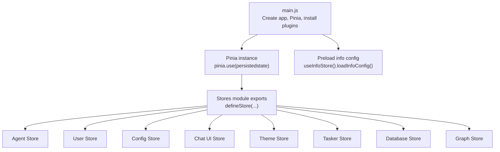
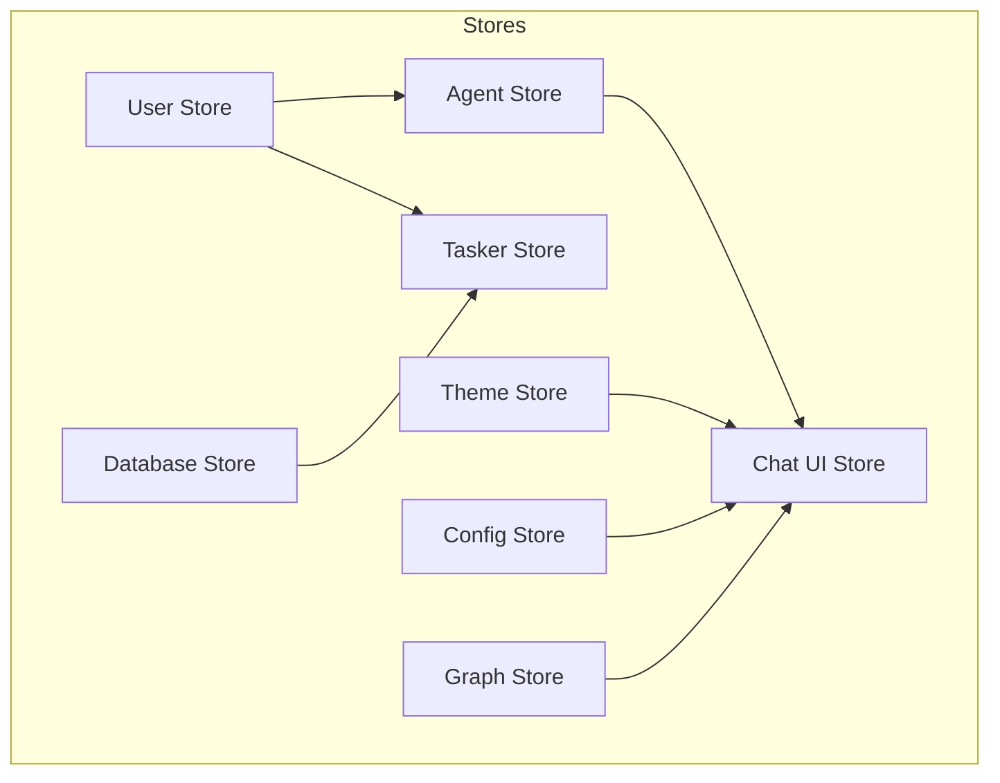
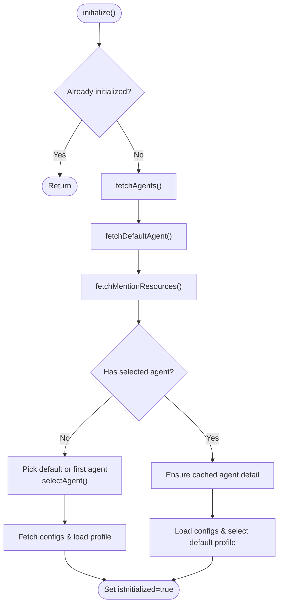
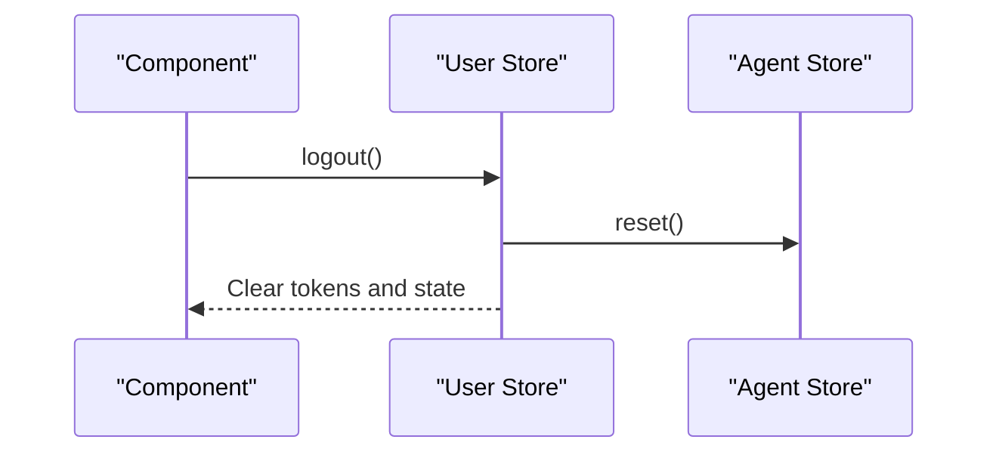
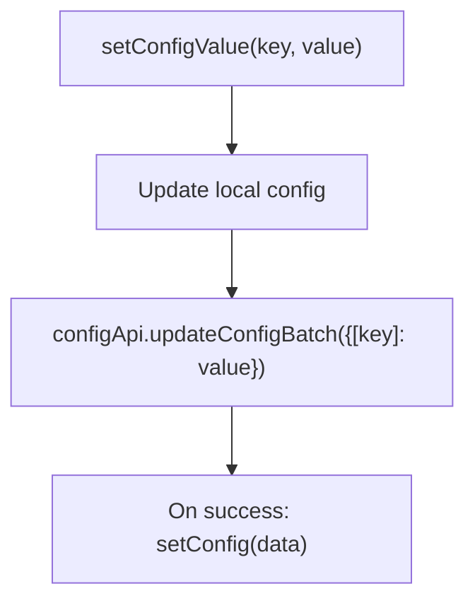
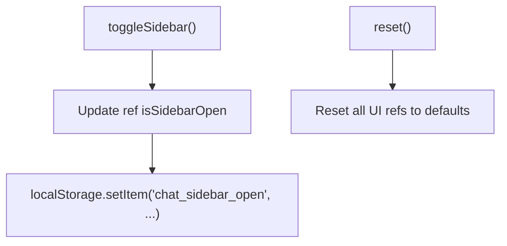
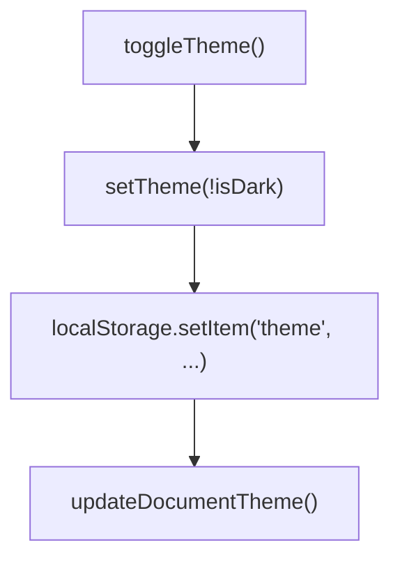
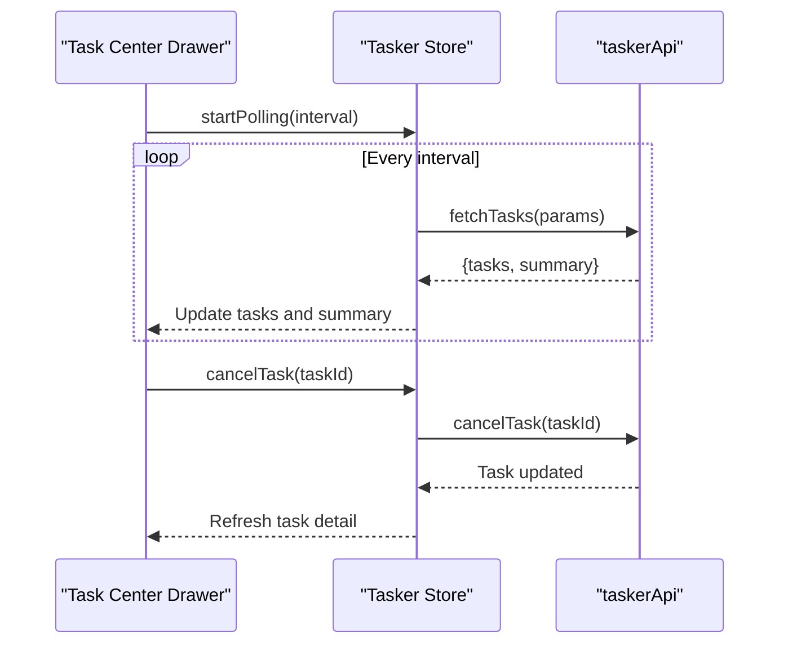
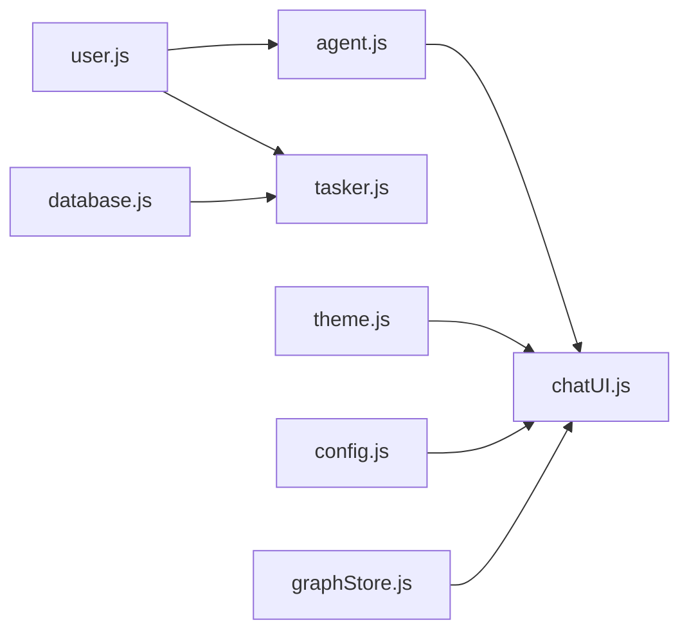

# State Management with Pinia

<cite>
**Referenced Files in This Document**
- [main.js](file://web/src/main.js)
- [agent.js](file://web/src/stores/agent.js)
- [user.js](file://web/src/stores/user.js)
- [config.js](file://web/src/stores/config.js)
- [chatUI.js](file://web/src/stores/chatUI.js)
- [theme.js](file://web/src/stores/theme.js)
- [tasker.js](file://web/src/stores/tasker.js)
- [database.js](file://web/src/stores/database.js)
- [graphStore.js](file://web/src/stores/graphStore.js)
- [info.js](file://web/src/stores/info.js)
- [package.json](file://web/package.json)
</cite>

## Table of Contents
1. [Introduction](#introduction)
2. [Project Structure](#project-structure)
3. [Core Components](#core-components)
4. [Architecture Overview](#architecture-overview)
5. [Detailed Component Analysis](#detailed-component-analysis)
6. [Dependency Analysis](#dependency-analysis)
7. [Performance Considerations](#performance-considerations)
8. [Troubleshooting Guide](#troubleshooting-guide)
9. [Conclusion](#conclusion)
10. [Appendices](#appendices)

## Introduction
This document explains Yuxi’s state management system built with Pinia. It focuses on the store modules agent.js, user.js, config.js, chatUI.js, theme.js, and tasker.js, detailing state definition patterns, actions for state mutations, getters for computed state, and store composition. It also documents reactive state flow from user interactions to component updates, examples of async actions, state persistence strategies, cross-store communication, state hydration, server-side rendering considerations, and performance optimization techniques. Finally, it provides guidelines for adding new stores and maintaining state consistency.

## Project Structure
Yuxi’s frontend initializes Pinia and enables persisted state globally. Stores are defined under web/src/stores and exported via composable-like factories. The main application bootstraps Pinia, registers the plugin for persistence, and mounts the Vue app. Initialization sequences include preloading system information.

**Diagram sources**
- [main.js:12-25](file://web/src/main.js#L12-L25)
- [info.js:60-84](file://web/src/stores/info.js#L60-L84)

**Section sources**
- [main.js:12-25](file://web/src/main.js#L12-L25)
- [package.json:34-35](file://web/package.json#L34-L35)

## Core Components
This section summarizes the six primary stores and their roles in the state management system.

- Agent Store: Manages agent lists, default agent, agent configuration profiles, and related resources. Provides initialization, selection, and persistence of selected agent and config.
- User Store: Handles authentication state, permissions, and user metadata. Integrates with agent store reset on logout.
- Config Store: Centralizes configuration state and batch updates to the backend.
- Chat UI Store: Controls UI state for chat interface, including sidebar visibility and menus.
- Theme Store: Manages theme mode and applies it to the document element.
- Tasker Store: Tracks background tasks, supports polling, cancellation, and admin-only operations.

**Section sources**
- [agent.js:7-567](file://web/src/stores/agent.js#L7-L567)
- [user.js:5-404](file://web/src/stores/user.js#L5-L404)
- [config.js:15-51](file://web/src/stores/config.js#L15-L51)
- [chatUI.js:4-82](file://web/src/stores/chatUI.js#L4-L82)
- [theme.js:5-66](file://web/src/stores/theme.js#L5-L66)
- [tasker.js:35-230](file://web/src/stores/tasker.js#L35-230)

## Architecture Overview
The state management architecture follows a modular Pinia design with explicit separation of concerns:
- Reactive state is declared with ref and reactive.
- Computed getters derive derived state from reactive sources.
- Actions encapsulate async and sync mutations.
- Cross-store communication occurs via direct store instantiation inside actions.
- Persistence is configured per store using persistedstate.

**Diagram sources**
- [agent.js:10](file://web/src/stores/agent.js#L10)
- [user.js:85-86](file://web/src/stores/user.js#L85-L86)
- [database.js:12-13](file://web/src/stores/database.js#L12-L13)
- [tasker.js:36](file://web/src/stores/tasker.js#L36)

## Detailed Component Analysis

### Agent Store
The Agent Store coordinates agent lifecycle, configuration profiles, and related resources. It defines reactive state for agents, default agent, available resources, and configuration profiles. It exposes computed getters for selected/default agents, configurable items, and summary of selected config. Actions include initialization, fetching agents and details, selecting agents, managing configuration profiles, and saving/restoring configurations. Persistence is configured to persist selected agent identifiers.

**Diagram sources**
- [agent.js:120-176](file://web/src/stores/agent.js#L120-L176)
- [agent.js:259-292](file://web/src/stores/agent.js#L259-L292)
- [agent.js:297-315](file://web/src/stores/agent.js#L297-L315)
- [agent.js:317-370](file://web/src/stores/agent.js#L317-L370)

Key patterns:
- Async initialization with guarded concurrency flags.
- Parallel resource fetching for performance.
- Hydration via persisted identifiers and selective loading of dependent state.
- Admin-guarded configuration operations.

Cross-store communication:
- Uses User Store to gate configuration operations.
- Loads agent details/configs in parallel during selection.

Persistence:
- Persisted keys: selectedAgentId, selectedAgentConfigId.

**Section sources**
- [agent.js:7-567](file://web/src/stores/agent.js#L7-L567)
- [user.js:18-20](file://web/src/stores/user.js#L18-L20)

### User Store
The User Store manages authentication state, permissions, and user metadata. It exposes login/logout flows, initialization, and permission checks. On logout, it resets the Agent Store to ensure clean state on re-authentication. It also provides helpers for API requests and user management.

**Diagram sources**
- [user.js:72-90](file://web/src/stores/user.js#L72-L90)
- [user.js:84-86](file://web/src/stores/user.js#L84-L86)
- [agent.js:485-504](file://web/src/stores/agent.js#L485-L504)

Permissions:
- isAdmin/isSuperAdmin computed from role.
- Guarded actions enforce admin-only operations.

**Section sources**
- [user.js:5-404](file://web/src/stores/user.js#L5-L404)

### Config Store
The Config Store centralizes configuration state and exposes methods to set values locally and synchronize with the backend. It supports batch updates and refresh from the server.

**Diagram sources**
- [config.js:21-27](file://web/src/stores/config.js#L21-L27)
- [config.js:42-47](file://web/src/stores/config.js#L42-L47)

**Section sources**
- [config.js:15-51](file://web/src/stores/config.js#L15-L51)

### Chat UI Store
The Chat UI Store controls UI state for chat-related views, including sidebar visibility, loading states, and contextual menus. It persists sidebar visibility to localStorage and exposes methods to toggle and reset UI state.

**Diagram sources**
- [chatUI.js:29-32](file://web/src/stores/chatUI.js#L29-L32)
- [chatUI.js:54-62](file://web/src/stores/chatUI.js#L54-L62)

**Section sources**
- [chatUI.js:4-82](file://web/src/stores/chatUI.js#L4-L82)

### Theme Store
The Theme Store manages theme mode (light/dark) and applies it to the document element. It maintains a current theme object and toggles persistence in localStorage.

**Diagram sources**
- [theme.js:35-44](file://web/src/stores/theme.js#L35-L44)
- [theme.js:47-54](file://web/src/stores/theme.js#L47-L54)

**Section sources**
- [theme.js:5-66](file://web/src/stores/theme.js#L5-L66)

### Tasker Store
The Tasker Store manages background tasks, supports polling, and integrates with the UI drawer. It computes counts for active, failed, and success statuses and exposes actions to load, refresh, cancel, and delete tasks. Admin-only access gates administrative operations.

**Diagram sources**
- [tasker.js:180-194](file://web/src/stores/tasker.js#L180-L194)
- [tasker.js:84-109](file://web/src/stores/tasker.js#L84-L109)
- [tasker.js:124-134](file://web/src/stores/tasker.js#L124-L134)

**Section sources**
- [tasker.js:35-230](file://web/src/stores/tasker.js#L35-230)

### Additional Stores (for completeness)
While not part of the core objective, the following stores complement the state management ecosystem:
- Database Store: Manages knowledge base CRUD, file operations, and auto-refresh with tasker integration.
- Graph Store: Manages graph data structures and Sigma rendering state.

**Section sources**
- [database.js:10-568](file://web/src/stores/database.js#L10-568)
- [graphStore.js:4-435](file://web/src/stores/graphStore.js#L4-435)
- [info.js:5-129](file://web/src/stores/info.js#L5-129)

## Dependency Analysis
The stores depend on each other through direct instantiation within actions, enabling cross-store communication. The User Store is a foundational dependency for Agent and Tasker operations due to permission gating. The Agent Store depends on the User Store for admin checks and on the Chat UI Store for UI state. The Theme Store influences UI state globally.

**Diagram sources**
- [agent.js:10](file://web/src/stores/agent.js#L10)
- [user.js:85-86](file://web/src/stores/user.js#L85-L86)
- [database.js:12-13](file://web/src/stores/database.js#L12-L13)
- [tasker.js:36](file://web/src/stores/tasker.js#L36)

**Section sources**
- [agent.js:10](file://web/src/stores/agent.js#L10)
- [user.js:85-86](file://web/src/stores/user.js#L85-L86)
- [database.js:12-13](file://web/src/stores/database.js#L12-L13)
- [tasker.js:36](file://web/src/stores/tasker.js#L36)

## Performance Considerations
- Parallel async operations: Agent Store uses Promise.all to fetch resources concurrently, reducing initialization latency.
- Conditional caching: Agent Store caches agent details and avoids redundant loads unless forced.
- Polling control: Tasker Store provides startPolling/stopPolling to manage periodic API calls efficiently.
- Auto-refresh gating: Database Store enables auto-refresh only when processing files are present, minimizing unnecessary network calls.
- Reactive computations: Computed getters avoid recomputation when dependencies are unchanged.

[No sources needed since this section provides general guidance]

## Troubleshooting Guide
Common issues and remedies:
- Initialization failures: Agent Store sets error state and logs; inspect error ref and handle accordingly in components.
- Permission errors: User Store admin checks prevent unauthorized operations; ensure user role is sufficient.
- Persistence conflicts: Verify persisted keys and storage targets; ensure consistent key names across environments.
- UI state drift: Use reset methods on stores to restore defaults when switching contexts (e.g., logout).
- Network errors: Wrap async actions with try/catch and surface user-friendly messages.

**Section sources**
- [agent.js:170-175](file://web/src/stores/agent.js#L170-L175)
- [user.js:390-397](file://web/src/stores/user.js#L390-L397)
- [chatUI.js:54-62](file://web/src/stores/chatUI.js#L54-L62)

## Conclusion
Yuxi’s Pinia-based state management cleanly separates concerns across stores, leverages computed getters for derived state, and uses actions for mutations and side effects. Persistence is configured per store to preserve user-selected contexts. Cross-store communication is explicit and controlled via direct store instantiation. The system balances performance with robustness through parallelization, caching, and polling controls.

[No sources needed since this section summarizes without analyzing specific files]

## Appendices

### State Hydration and Persistence
- Global persistence plugin: Installed in main.js to enable persistedstate across stores.
- Agent Store persistence: Persists selectedAgentId and selectedAgentConfigId to localStorage.
- UI persistence: Chat UI Store persists sidebar visibility to localStorage.
- Theme persistence: Theme Store persists theme mode to localStorage.

**Section sources**
- [main.js:13-14](file://web/src/main.js#L13-L14)
- [agent.js:558-565](file://web/src/stores/agent.js#L558-L565)
- [chatUI.js:7](file://web/src/stores/chatUI.js#L7)
- [theme.js:43](file://web/src/stores/theme.js#L43)

### Server-Side Rendering Considerations
- Avoid accessing window.localStorage on the server; ensure initialization code runs only on the client.
- Initialize stores after mount to prevent hydration mismatches.
- Preload critical configuration (e.g., info store) before mounting to minimize client-only fetches.

**Section sources**
- [main.js:20-25](file://web/src/main.js#L20-L25)
- [info.js:60-84](file://web/src/stores/info.js#L60-L84)

### Guidelines for Adding New Stores
- Define reactive state with ref/reactive and computed getters for derived state.
- Encapsulate async operations in actions; expose minimal public API.
- Gate admin-only actions with user role checks.
- Persist only essential UI/state identifiers; avoid persisting large payloads.
- Integrate with existing stores via direct instantiation when necessary.
- Provide reset methods to clear state cleanly.
- Keep error handling centralized and user-visible.

[No sources needed since this section provides general guidance]