# Entity Extraction & Relationship Building

<cite>
**Referenced Files in This Document**
- [nlp.py](file://backend/package/yuxi/knowledge/chunking/ragflow_like/nlp.py)
- [presets.py](file://backend/package/yuxi/knowledge/chunking/ragflow_like/presets.py)
- [dispatcher.py](file://backend/package/yuxi/knowledge/chunking/ragflow_like/dispatcher.py)
- [general.py](file://backend/package/yuxi/knowledge/chunking/ragflow_like/parsers/general.py)
- [book.py](file://backend/package/yuxi/knowledge/chunking/ragflow_like/parsers/book.py)
- [laws.py](file://backend/package/yuxi/knowledge/chunking/ragflow_like/parsers/laws.py)
- [qa.py](file://backend/package/yuxi/knowledge/chunking/ragflow_like/parsers/qa.py)
- [KnowledgeGraphTool.vue](file://web/src/components/ToolCallingResult/tools/KnowledgeGraphTool.vue)
</cite>

## Table of Contents
1. [Introduction](#introduction)
2. [Project Structure](#project-structure)
3. [Core Components](#core-components)
4. [Architecture Overview](#architecture-overview)
5. [Detailed Component Analysis](#detailed-component-analysis)
6. [Dependency Analysis](#dependency-analysis)
7. [Performance Considerations](#performance-considerations)
8. [Troubleshooting Guide](#troubleshooting-guide)
9. [Conclusion](#conclusion)
10. [Appendices](#appendices)

## Introduction
This document describes the entity extraction and relationship building system implemented in the repository. It focuses on the natural language processing pipeline used to identify entities, relationships, and semantic patterns in text, the chunking strategies and text preprocessing techniques, and the mechanisms for entity resolution and disambiguation. It also covers relationship extraction rules, confidence scoring, and practical examples for customizing entity extraction configurations, relationship building patterns, and linking to external knowledge bases. Finally, it provides performance optimization techniques for large-scale text processing and graph construction.

## Project Structure
The entity and relationship building pipeline is primarily implemented in the backend under the knowledge chunking module. The frontend provides a visualization tool for rendering knowledge graph outputs produced by the backend.

- Backend chunking engine:
  - Preset configuration and parameter resolution
  - Parser dispatch and per-format chunking strategies
  - NLP utilities for text preprocessing and hierarchical merging
- Frontend visualization:
  - Knowledge graph rendering component for triples

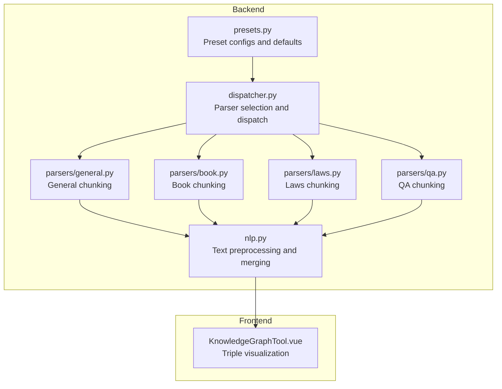

**Diagram sources**
- [presets.py:101-213](file://backend/package/yuxi/knowledge/chunking/ragflow_like/presets.py#L101-L213)
- [dispatcher.py:32-57](file://backend/package/yuxi/knowledge/chunking/ragflow_like/dispatcher.py#L32-L57)
- [general.py:33-46](file://backend/package/yuxi/knowledge/chunking/ragflow_like/parsers/general.py#L33-L46)
- [book.py:26-61](file://backend/package/yuxi/knowledge/chunking/ragflow_like/parsers/book.py#L26-L61)
- [laws.py:169-209](file://backend/package/yuxi/knowledge/chunking/ragflow_like/parsers/laws.py#L169-L209)
- [qa.py:213-260](file://backend/package/yuxi/knowledge/chunking/ragflow_like/parsers/qa.py#L213-L260)
- [nlp.py:411-481](file://backend/package/yuxi/knowledge/chunking/ragflow_like/nlp.py#L411-L481)
- [KnowledgeGraphTool.vue:88-147](file://web/src/components/ToolCallingResult/tools/KnowledgeGraphTool.vue#L88-L147)

**Section sources**
- [presets.py:101-213](file://backend/package/yuxi/knowledge/chunking/ragflow_like/presets.py#L101-L213)
- [dispatcher.py:32-57](file://backend/package/yuxi/knowledge/chunking/ragflow_like/dispatcher.py#L32-L57)
- [general.py:33-46](file://backend/package/yuxi/knowledge/chunking/ragflow_like/parsers/general.py#L33-L46)
- [book.py:26-61](file://backend/package/yuxi/knowledge/chunking/ragflow_like/parsers/book.py#L26-L61)
- [laws.py:169-209](file://backend/package/yuxi/knowledge/chunking/ragflow_like/parsers/laws.py#L169-L209)
- [qa.py:213-260](file://backend/package/yuxi/knowledge/chunking/ragflow_like/parsers/qa.py#L213-L260)
- [nlp.py:411-481](file://backend/package/yuxi/knowledge/chunking/ragflow_like/nlp.py#L411-L481)
- [KnowledgeGraphTool.vue:88-147](file://web/src/components/ToolCallingResult/tools/KnowledgeGraphTool.vue#L88-L147)

## Core Components
- Preset configuration and parameter resolution:
  - Provides preset identifiers and default behaviors for chunking engines.
  - Normalizes and merges user-provided parameters from knowledge base, file, and request scopes.
- Parser dispatch:
  - Routes markdown content to the appropriate parser based on preset ID.
- Per-format parsers:
  - General: straightforward delimiter-based and token-length-aware merging.
  - Book: leverages hierarchical merging guided by detected heading patterns.
  - Laws: enforces legal-article-aware normalization and depth-limited tree merging.
  - QA: extracts question-answer pairs from structured and unstructured formats.
- NLP utilities:
  - Token counting, heading detection heuristics, bullet category classification, hierarchical merging, and naive merging with overlap.
- Frontend visualization:
  - Renders triples returned by the backend into a graph canvas.

**Section sources**
- [presets.py:13-25](file://backend/package/yuxi/knowledge/chunking/ragflow_like/presets.py#L13-L25)
- [presets.py:101-213](file://backend/package/yuxi/knowledge/chunking/ragflow_like/presets.py#L101-L213)
- [dispatcher.py:32-57](file://backend/package/yuxi/knowledge/chunking/ragflow_like/dispatcher.py#L32-L57)
- [general.py:33-46](file://backend/package/yuxi/knowledge/chunking/ragflow_like/parsers/general.py#L33-L46)
- [book.py:26-61](file://backend/package/yuxi/knowledge/chunking/ragflow_like/parsers/book.py#L26-L61)
- [laws.py:169-209](file://backend/package/yuxi/knowledge/chunking/ragflow_like/parsers/laws.py#L169-L209)
- [qa.py:213-260](file://backend/package/yuxi/knowledge/chunking/ragflow_like/parsers/qa.py#L213-L260)
- [nlp.py:49-55](file://backend/package/yuxi/knowledge/chunking/ragflow_like/nlp.py#L49-L55)
- [nlp.py:90-115](file://backend/package/yuxi/knowledge/chunking/ragflow_like/nlp.py#L90-L115)
- [nlp.py:140-178](file://backend/package/yuxi/knowledge/chunking/ragflow_like/nlp.py#L140-L178)
- [nlp.py:254-303](file://backend/package/yuxi/knowledge/chunking/ragflow_like/nlp.py#L254-L303)
- [nlp.py:306-400](file://backend/package/yuxi/knowledge/chunking/ragflow_like/nlp.py#L306-L400)
- [nlp.py:411-481](file://backend/package/yuxi/knowledge/chunking/ragflow_like/nlp.py#L411-L481)
- [KnowledgeGraphTool.vue:88-147](file://web/src/components/ToolCallingResult/tools/KnowledgeGraphTool.vue#L88-L147)

## Architecture Overview
The system transforms raw text into structured chunks and triples, then renders the triples as a knowledge graph. The flow is:

- Parameter resolution selects a preset and merges configuration.
- The dispatcher chooses a parser based on the preset.
- The selected parser applies format-specific preprocessing and chunking.
- NLP utilities perform token-aware merging and hierarchical grouping.
- The resulting chunks/triples are passed to the frontend for visualization.

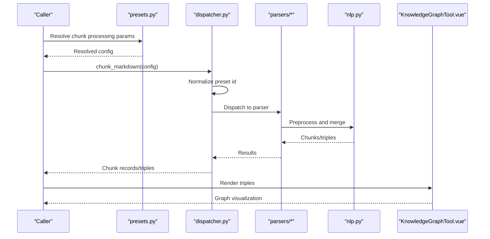

**Diagram sources**
- [presets.py:161-213](file://backend/package/yuxi/knowledge/chunking/ragflow_like/presets.py#L161-L213)
- [dispatcher.py:32-57](file://backend/package/yuxi/knowledge/chunking/ragflow_like/dispatcher.py#L32-L57)
- [general.py:33-46](file://backend/package/yuxi/knowledge/chunking/ragflow_like/parsers/general.py#L33-L46)
- [book.py:26-61](file://backend/package/yuxi/knowledge/chunking/ragflow_like/parsers/book.py#L26-L61)
- [laws.py:169-209](file://backend/package/yuxi/knowledge/chunking/ragflow_like/parsers/laws.py#L169-L209)
- [qa.py:213-260](file://backend/package/yuxi/knowledge/chunking/ragflow_like/parsers/qa.py#L213-L260)
- [nlp.py:411-481](file://backend/package/yuxi/knowledge/chunking/ragflow_like/nlp.py#L411-L481)
- [KnowledgeGraphTool.vue:88-147](file://web/src/components/ToolCallingResult/tools/KnowledgeGraphTool.vue#L88-L147)

## Detailed Component Analysis

### Preset Configuration and Parameter Resolution
- Purpose:
  - Define preset IDs and descriptions.
  - Provide default chunking parameters per preset.
  - Merge parameters from knowledge base, file, and request scopes with precedence.
- Key behaviors:
  - Normalize preset IDs and map internal parser IDs.
  - Deep-merge base defaults with preset-specific defaults.
  - Convert legacy parameters to modern parser config.
  - Produce a processing params snapshot for downstream use.

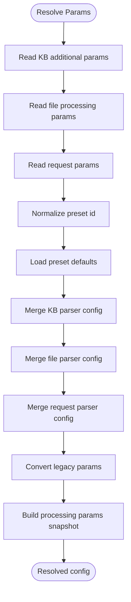

**Diagram sources**
- [presets.py:161-213](file://backend/package/yuxi/knowledge/chunking/ragflow_like/presets.py#L161-L213)

**Section sources**
- [presets.py:13-25](file://backend/package/yuxi/knowledge/chunking/ragflow_like/presets.py#L13-L25)
- [presets.py:69-76](file://backend/package/yuxi/knowledge/chunking/ragflow_like/presets.py#L69-L76)
- [presets.py:79-98](file://backend/package/yuxi/knowledge/chunking/ragflow_like/presets.py#L79-L98)
- [presets.py:101-104](file://backend/package/yuxi/knowledge/chunking/ragflow_like/presets.py#L101-L104)
- [presets.py:116-147](file://backend/package/yuxi/knowledge/chunking/ragflow_like/presets.py#L116-L147)
- [presets.py:150-158](file://backend/package/yuxi/knowledge/chunking/ragflow_like/presets.py#L150-L158)
- [presets.py:161-213](file://backend/package/yuxi/knowledge/chunking/ragflow_like/presets.py#L161-L213)

### Parser Dispatch and Selection
- Purpose:
  - Route markdown content to the correct parser based on preset ID.
- Key behaviors:
  - Map preset to internal parser ID.
  - Dispatch to general, QA, book, or laws parser accordingly.
  - Build chunk records with metadata.

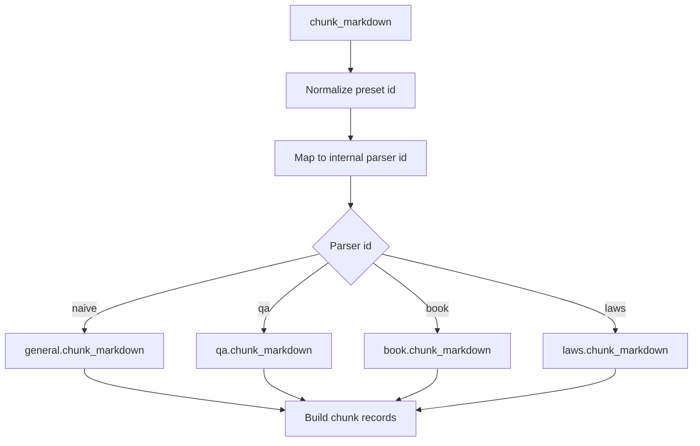

**Diagram sources**
- [dispatcher.py:32-57](file://backend/package/yuxi/knowledge/chunking/ragflow_like/dispatcher.py#L32-L57)

**Section sources**
- [dispatcher.py:32-57](file://backend/package/yuxi/knowledge/chunking/ragflow_like/dispatcher.py#L32-L57)

### General Chunking Parser
- Purpose:
  - Split content into chunks using delimiters and enforce token limits.
- Key behaviors:
  - Unescape delimiter and normalize sections.
  - Apply naive token-aware merging with optional overlap.

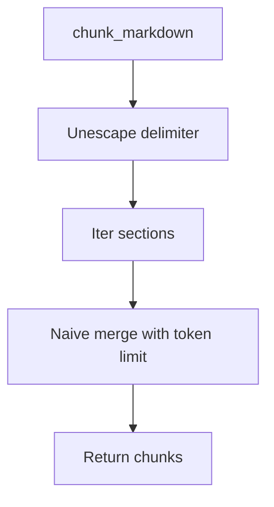

**Diagram sources**
- [general.py:33-46](file://backend/package/yuxi/knowledge/chunking/ragflow_like/parsers/general.py#L33-L46)
- [nlp.py:411-481](file://backend/package/yuxi/knowledge/chunking/ragflow_like/nlp.py#L411-L481)

**Section sources**
- [general.py:33-46](file://backend/package/yuxi/knowledge/chunking/ragflow_like/parsers/general.py#L33-L46)
- [nlp.py:411-481](file://backend/package/yuxi/knowledge/chunking/ragflow_like/nlp.py#L411-L481)

### Book Chunking Parser
- Purpose:
  - Improve chunking for books by detecting headings and merging hierarchically.
- Key behaviors:
  - Remove table of contents and normalize colon-as-title patterns.
  - Detect bullet categories and perform hierarchical merging with a fixed depth.
  - Fall back to naive merging if hierarchy detection fails.

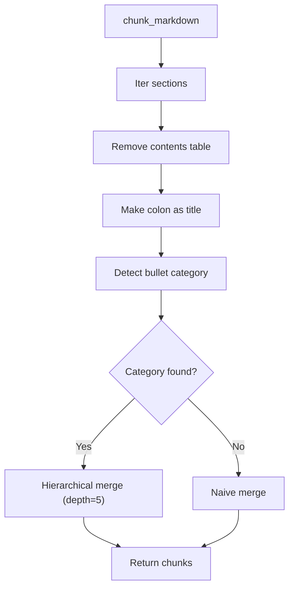

**Diagram sources**
- [book.py:26-61](file://backend/package/yuxi/knowledge/chunking/ragflow_like/parsers/book.py#L26-L61)
- [nlp.py:187-220](file://backend/package/yuxi/knowledge/chunking/ragflow_like/nlp.py#L187-L220)
- [nlp.py:254-303](file://backend/package/yuxi/knowledge/chunking/ragflow_like/nlp.py#L254-L303)
- [nlp.py:306-400](file://backend/package/yuxi/knowledge/chunking/ragflow_like/nlp.py#L306-L400)
- [nlp.py:411-481](file://backend/package/yuxi/knowledge/chunking/ragflow_like/nlp.py#L411-L481)

**Section sources**
- [book.py:26-61](file://backend/package/yuxi/knowledge/chunking/ragflow_like/parsers/book.py#L26-L61)
- [nlp.py:187-220](file://backend/package/yuxi/knowledge/chunking/ragflow_like/nlp.py#L187-L220)
- [nlp.py:254-303](file://backend/package/yuxi/knowledge/chunking/ragflow_like/nlp.py#L254-L303)
- [nlp.py:306-400](file://backend/package/yuxi/knowledge/chunking/ragflow_like/nlp.py#L306-L400)
- [nlp.py:411-481](file://backend/package/yuxi/knowledge/chunking/ragflow_like/nlp.py#L411-L481)

### Laws Chunking Parser
- Purpose:
  - Enforce legal-article-aware normalization and depth-limited merging.
- Key behaviors:
  - Normalize headings and strip decorations for accurate hierarchy.
  - Expand “article” lines into separate title/body entries.
  - Prefer heading-tree splitting for DOCX; otherwise use tree merge with depth=3.
  - Enforce token limits with layered protection (line split, sentence split, hard split).

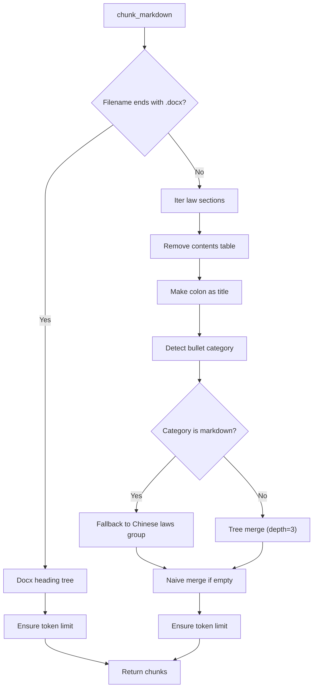

**Diagram sources**
- [laws.py:169-209](file://backend/package/yuxi/knowledge/chunking/ragflow_like/parsers/laws.py#L169-L209)
- [nlp.py:187-220](file://backend/package/yuxi/knowledge/chunking/ragflow_like/nlp.py#L187-L220)
- [nlp.py:254-303](file://backend/package/yuxi/knowledge/chunking/ragflow_like/nlp.py#L254-L303)
- [nlp.py:306-400](file://backend/package/yuxi/knowledge/chunking/ragflow_like/nlp.py#L306-L400)
- [nlp.py:87-110](file://backend/package/yuxi/knowledge/chunking/ragflow_like/nlp.py#L87-L110)
- [nlp.py:113-166](file://backend/package/yuxi/knowledge/chunking/ragflow_like/nlp.py#L113-L166)

**Section sources**
- [laws.py:169-209](file://backend/package/yuxi/knowledge/chunking/ragflow_like/parsers/laws.py#L169-L209)
- [nlp.py:87-110](file://backend/package/yuxi/knowledge/chunking/ragflow_like/nlp.py#L87-L110)
- [nlp.py:113-166](file://backend/package/yuxi/knowledge/chunking/ragflow_like/nlp.py#L113-L166)

### QA Chunking Parser
- Purpose:
  - Extract question-answer pairs from various formats and produce compact chunks.
- Key behaviors:
  - Detect file format and extract pairs via tables, headings, CSV, or delimited text.
  - Deduplicate pairs and apply fallback grouping when needed.
  - Format pairs into standardized chunks.

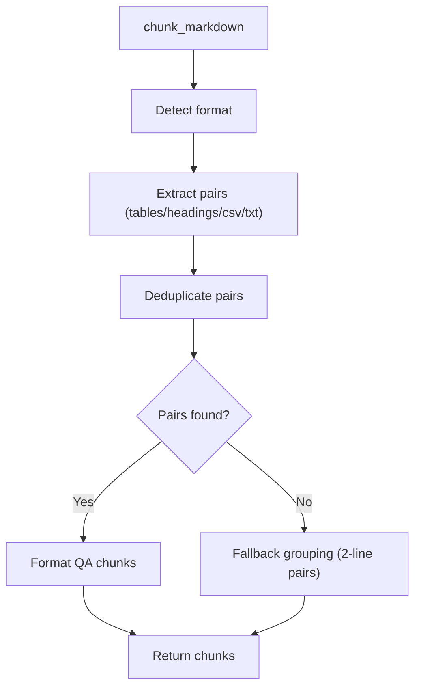

**Diagram sources**
- [qa.py:213-260](file://backend/package/yuxi/knowledge/chunking/ragflow_like/parsers/qa.py#L213-L260)

**Section sources**
- [qa.py:213-260](file://backend/package/yuxi/knowledge/chunking/ragflow_like/parsers/qa.py#L213-L260)

### NLP Utilities for Text Preprocessing and Merging
- Token counting:
  - Approximate token count using word/CJK character heuristics.
- Heading detection:
  - Heuristics to distinguish headings from regular text.
- Bullet category classification:
  - Classify section markers into groups to guide hierarchy detection.
- Hierarchical merging:
  - Build a tree of sections by levels and merge into chunks respecting depth.
- Naive merging:
  - Merge sections with token limits and optional overlap; supports custom delimiters.

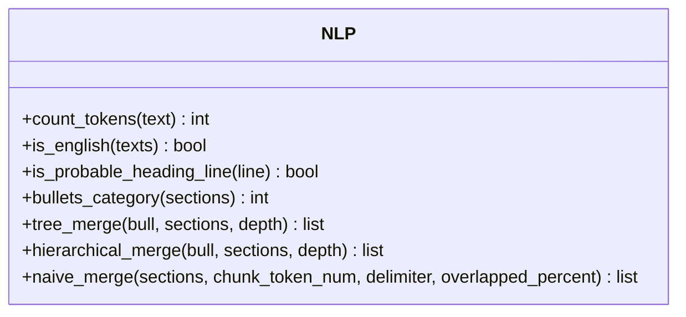

**Diagram sources**
- [nlp.py:49-55](file://backend/package/yuxi/knowledge/chunking/ragflow_like/nlp.py#L49-L55)
- [nlp.py:64-78](file://backend/package/yuxi/knowledge/chunking/ragflow_like/nlp.py#L64-L78)
- [nlp.py:90-115](file://backend/package/yuxi/knowledge/chunking/ragflow_like/nlp.py#L90-L115)
- [nlp.py:140-178](file://backend/package/yuxi/knowledge/chunking/ragflow_like/nlp.py#L140-L178)
- [nlp.py:254-303](file://backend/package/yuxi/knowledge/chunking/ragflow_like/nlp.py#L254-L303)
- [nlp.py:306-400](file://backend/package/yuxi/knowledge/chunking/ragflow_like/nlp.py#L306-L400)
- [nlp.py:411-481](file://backend/package/yuxi/knowledge/chunking/ragflow_like/nlp.py#L411-L481)

**Section sources**
- [nlp.py:49-55](file://backend/package/yuxi/knowledge/chunking/ragflow_like/nlp.py#L49-L55)
- [nlp.py:64-78](file://backend/package/yuxi/knowledge/chunking/ragflow_like/nlp.py#L64-L78)
- [nlp.py:90-115](file://backend/package/yuxi/knowledge/chunking/ragflow_like/nlp.py#L90-L115)
- [nlp.py:140-178](file://backend/package/yuxi/knowledge/chunking/ragflow_like/nlp.py#L140-L178)
- [nlp.py:254-303](file://backend/package/yuxi/knowledge/chunking/ragflow_like/nlp.py#L254-L303)
- [nlp.py:306-400](file://backend/package/yuxi/knowledge/chunking/ragflow_like/nlp.py#L306-L400)
- [nlp.py:411-481](file://backend/package/yuxi/knowledge/chunking/ragflow_like/nlp.py#L411-L481)

### Frontend Triple Visualization
- Purpose:
  - Parse triples returned by the backend and render them as a graph.
- Key behaviors:
  - Parse content into triples.
  - Build nodes and edges from triples.
  - Expose refresh controls and compute counts.

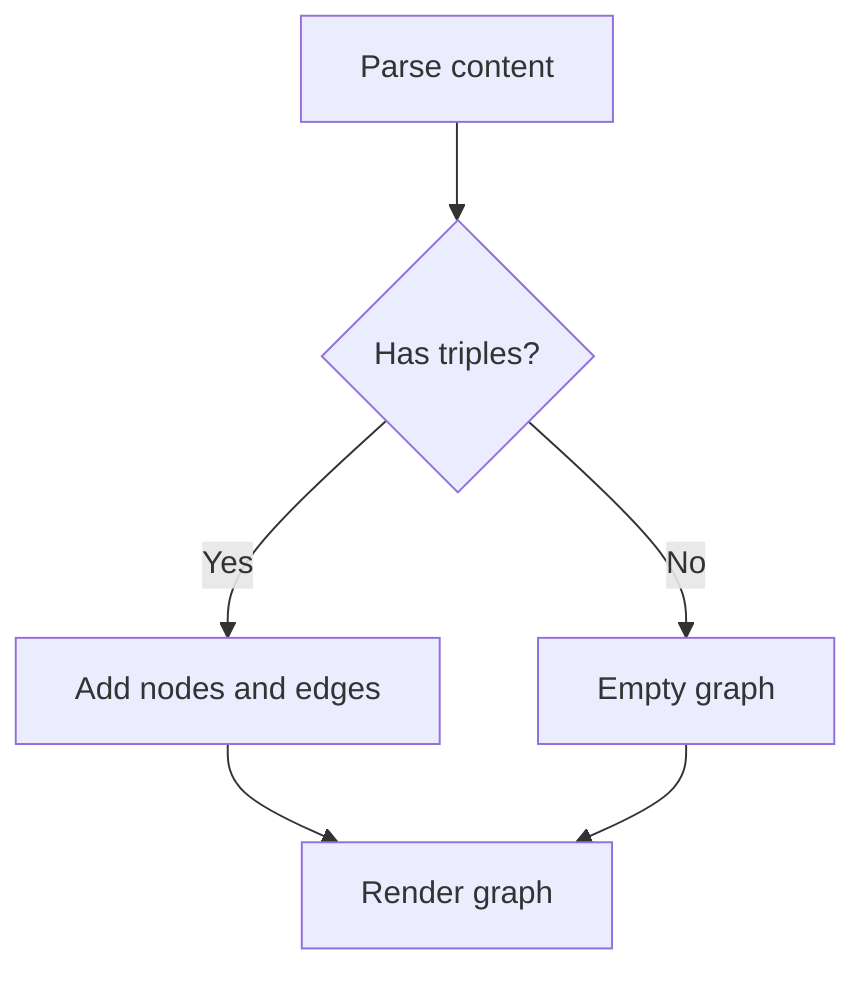

**Diagram sources**
- [KnowledgeGraphTool.vue:88-147](file://web/src/components/ToolCallingResult/tools/KnowledgeGraphTool.vue#L88-L147)

**Section sources**
- [KnowledgeGraphTool.vue:88-147](file://web/src/components/ToolCallingResult/tools/KnowledgeGraphTool.vue#L88-L147)

## Dependency Analysis
- Presets depend on logger for warnings and provide defaults for chunking engines.
- Dispatcher depends on parsers and presets to route content and resolve configuration.
- Parsers depend on NLP utilities for preprocessing and merging.
- Frontend visualization depends on triples produced by the backend.

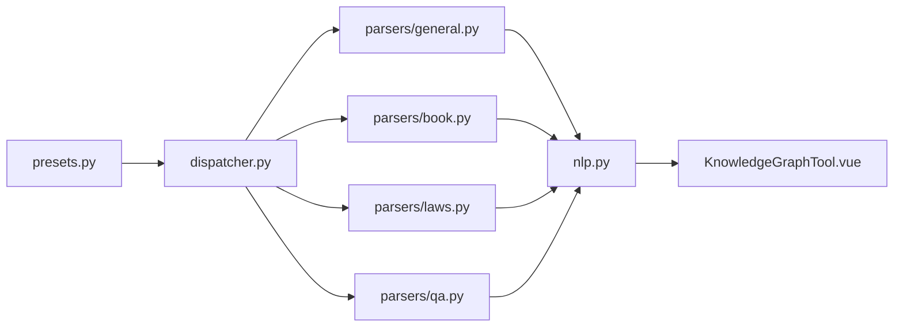

**Diagram sources**
- [presets.py:1-10](file://backend/package/yuxi/knowledge/chunking/ragflow_like/presets.py#L1-L10)
- [dispatcher.py:5-6](file://backend/package/yuxi/knowledge/chunking/ragflow_like/dispatcher.py#L5-L6)
- [general.py](file://backend/package/yuxi/knowledge/chunking/ragflow_like/parsers/general.py#L5)
- [book.py](file://backend/package/yuxi/knowledge/chunking/ragflow_like/parsers/book.py#L5)
- [laws.py](file://backend/package/yuxi/knowledge/chunking/ragflow_like/parsers/laws.py#L6)
- [qa.py:1-6](file://backend/package/yuxi/knowledge/chunking/ragflow_like/parsers/qa.py#L1-L6)
- [nlp.py:1-6](file://backend/package/yuxi/knowledge/chunking/ragflow_like/nlp.py#L1-L6)
- [KnowledgeGraphTool.vue](file://web/src/components/ToolCallingResult/tools/KnowledgeGraphTool.vue#L44)

**Section sources**
- [presets.py:1-10](file://backend/package/yuxi/knowledge/chunking/ragflow_like/presets.py#L1-L10)
- [dispatcher.py:5-6](file://backend/package/yuxi/knowledge/chunking/ragflow_like/dispatcher.py#L5-L6)
- [general.py](file://backend/package/yuxi/knowledge/chunking/ragflow_like/parsers/general.py#L5)
- [book.py](file://backend/package/yuxi/knowledge/chunking/ragflow_like/parsers/book.py#L5)
- [laws.py](file://backend/package/yuxi/knowledge/chunking/ragflow_like/parsers/laws.py#L6)
- [qa.py:1-6](file://backend/package/yuxi/knowledge/chunking/ragflow_like/parsers/qa.py#L1-L6)
- [nlp.py:1-6](file://backend/package/yuxi/knowledge/chunking/ragflow_like/nlp.py#L1-L6)
- [KnowledgeGraphTool.vue](file://web/src/components/ToolCallingResult/tools/KnowledgeGraphTool.vue#L44)

## Performance Considerations
- Token-aware chunking:
  - Use approximate token counting to avoid expensive tokenizer calls.
  - Enforce token limits during merging to prevent oversized inputs.
- Overlap and chunk size:
  - Tune overlapped_percent and chunk_token_num to balance recall and memory usage.
- Hierarchical merging:
  - Prefer hierarchical merging for documents with clear headings to reduce fragmentation.
- Fallback strategies:
  - Provide fallback to naive merging when hierarchy detection fails.
- Large text protection:
  - For laws and other formats, apply layered token limit enforcement (line split, sentence split, hard split) to avoid embedding errors.
- Frontend rendering:
  - Defer graph refresh until container is visible to avoid unnecessary computations.

[No sources needed since this section provides general guidance]

## Troubleshooting Guide
- Unknown preset ID:
  - The system logs a warning and falls back to the general preset.
- Invalid chunk parser config:
  - Invalid values are ignored and replaced with defaults.
- Legacy parameters:
  - Legacy fields are converted to modern equivalents when present.
- QA pair extraction:
  - If no pairs are found, the parser attempts a fallback grouping strategy.
- Graph rendering:
  - The visualization component checks visibility and exposes a refresh method to re-render the graph.

**Section sources**
- [presets.py:90-91](file://backend/package/yuxi/knowledge/chunking/ragflow_like/presets.py#L90-L91)
- [presets.py:154-156](file://backend/package/yuxi/knowledge/chunking/ragflow_like/presets.py#L154-L156)
- [presets.py:188-191](file://backend/package/yuxi/knowledge/chunking/ragflow_like/presets.py#L188-L191)
- [qa.py:252-258](file://backend/package/yuxi/knowledge/chunking/ragflow_like/parsers/qa.py#L252-L258)
- [KnowledgeGraphTool.vue:154-205](file://web/src/components/ToolCallingResult/tools/KnowledgeGraphTool.vue#L154-L205)

## Conclusion
The system provides a robust, preset-driven pipeline for extracting entities and building relationships from text. By combining format-aware parsers with NLP preprocessing and hierarchical merging, it achieves reliable chunking across diverse document types. The frontend visualization enables quick inspection of extracted triples. With tunable parameters and layered protections, it scales to large volumes while maintaining quality.

[No sources needed since this section summarizes without analyzing specific files]

## Appendices

### Custom Entity Extraction Configurations
- Configure presets and parser parameters:
  - Use preset IDs to select general, QA, book, or laws modes.
  - Override defaults via chunk_parser_config in knowledge base, file, or request parameters.
  - Legacy parameters are supported and converted automatically.

**Section sources**
- [presets.py:101-104](file://backend/package/yuxi/knowledge/chunking/ragflow_like/presets.py#L101-L104)
- [presets.py:161-213](file://backend/package/yuxi/knowledge/chunking/ragflow_like/presets.py#L161-L213)
- [presets.py:116-147](file://backend/package/yuxi/knowledge/chunking/ragflow_like/presets.py#L116-L147)

### Relationship Building Patterns
- QA mode:
  - Extracts question-answer pairs and formats them into compact chunks suitable for downstream relationship extraction.
- Book mode:
  - Uses hierarchical merging to preserve chapter/section boundaries, aiding relationship extraction across structured content.
- Laws mode:
  - Normalizes legal articles and enforces depth-limited merging to maintain legal hierarchy.

**Section sources**
- [qa.py:213-260](file://backend/package/yuxi/knowledge/chunking/ragflow_like/parsers/qa.py#L213-L260)
- [book.py:43-51](file://backend/package/yuxi/knowledge/chunking/ragflow_like/parsers/book.py#L43-L51)
- [laws.py:195-208](file://backend/package/yuxi/knowledge/chunking/ragflow_like/parsers/laws.py#L195-L208)

### Entity Linking to External Knowledge Bases
- The frontend component parses triples and renders them as a graph. To integrate external knowledge bases:
  - Extend the backend to emit triples enriched with external identifiers.
  - Ensure the triples format remains compatible with the frontend’s parsing logic.

**Section sources**
- [KnowledgeGraphTool.vue:88-147](file://web/src/components/ToolCallingResult/tools/KnowledgeGraphTool.vue#L88-L147)