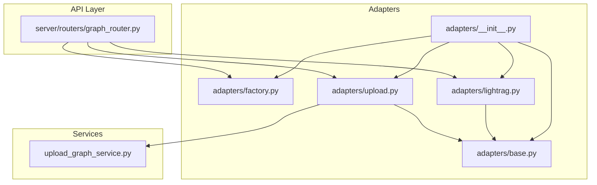
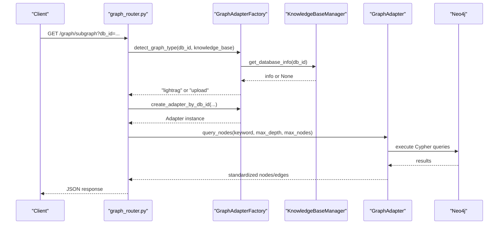
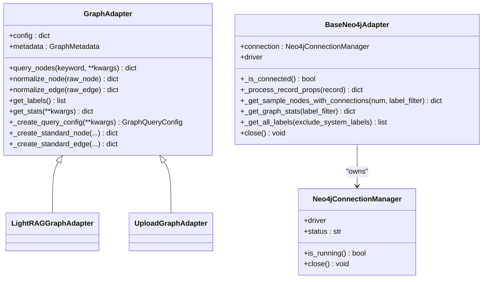
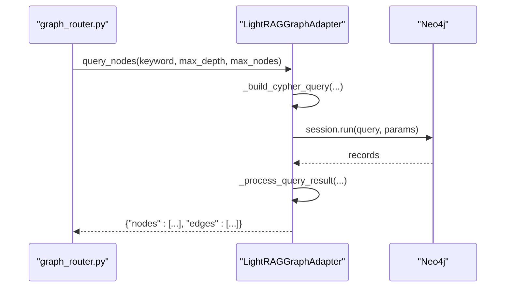
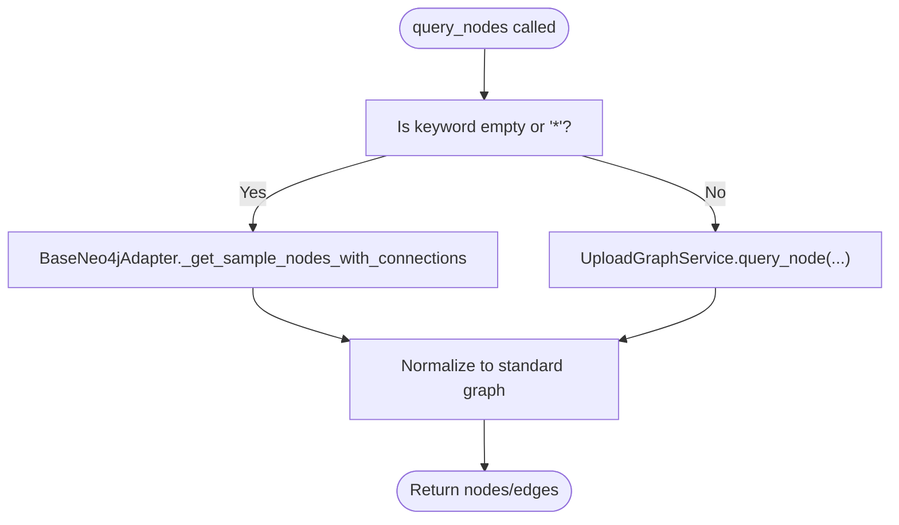
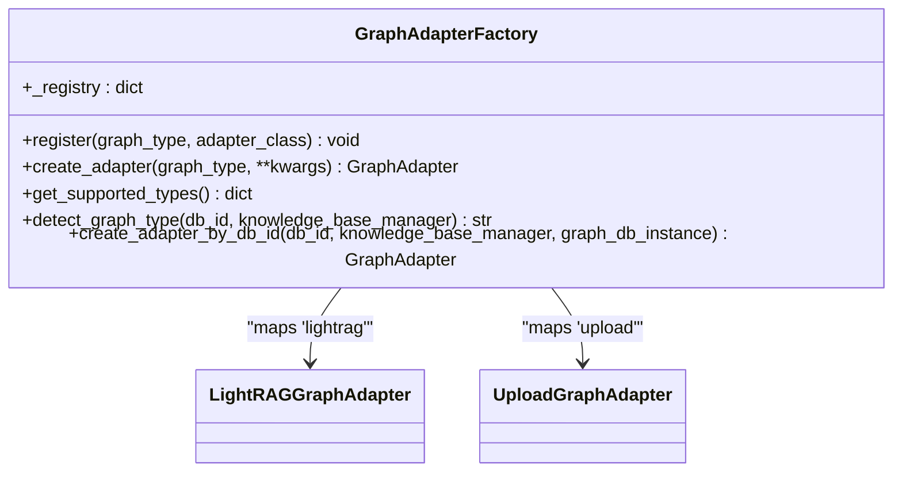
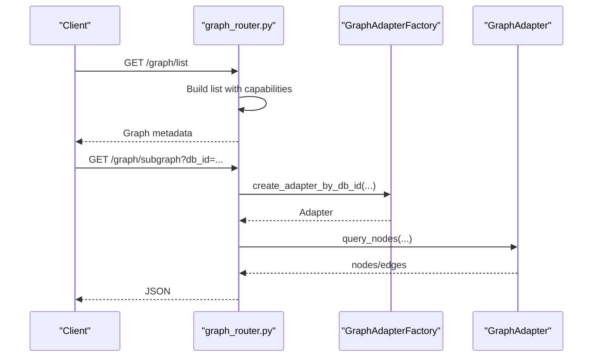
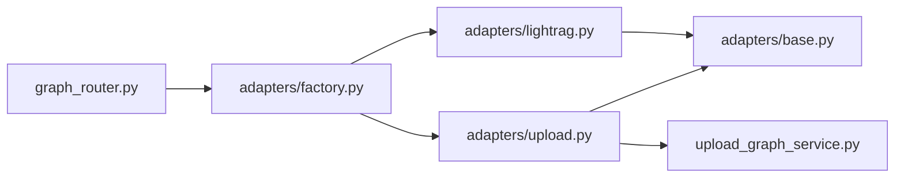

# Graph Database Adapters

<cite>
**Referenced Files in This Document**
- [adapters/__init__.py](file://backend/package/yuxi/knowledge/graphs/adapters/__init__.py)
- [adapters/base.py](file://backend/package/yuxi/knowledge/graphs/adapters/base.py)
- [adapters/factory.py](file://backend/package/yuxi/knowledge/graphs/adapters/factory.py)
- [adapters/lightrag.py](file://backend/package/yuxi/knowledge/graphs/adapters/lightrag.py)
- [adapters/upload.py](file://backend/package/yuxi/knowledge/graphs/adapters/upload.py)
- [upload_graph_service.py](file://backend/package/yuxi/knowledge/graphs/upload_graph_service.py)
- [graph_router.py](file://backend/server/routers/graph_router.py)
- [test_graph_unit.py](file://backend/test/unit/graphs/test_graph_unit.py)
- [test_unified_graph_router.py](file://backend/test/integration/api/test_unified_graph_router.py)
</cite>

## Table of Contents
1. [Introduction](#introduction)
2. [Project Structure](#project-structure)
3. [Core Components](#core-components)
4. [Architecture Overview](#architecture-overview)
5. [Detailed Component Analysis](#detailed-component-analysis)
6. [Dependency Analysis](#dependency-analysis)
7. [Performance Considerations](#performance-considerations)
8. [Troubleshooting Guide](#troubleshooting-guide)
9. [Conclusion](#conclusion)
10. [Appendices](#appendices)

## Introduction
This document explains the graph database adapter system that powers pluggable graph backends in the LightRAG knowledge platform. It covers the adapter pattern, the base adapter interface, the Neo4j-based LightRAG adapter, the upload adapter for managing user-provided knowledge graphs, and the adapter factory for dynamic backend selection. It also includes practical guidance for implementing custom adapters, configuration options, and performance considerations across different graph database engines.

## Project Structure
The graph adapter system resides under the knowledge graphs module and integrates with FastAPI routes for unified graph operations.

**Diagram sources**
- [adapters/__init__.py:1-7](file://backend/package/yuxi/knowledge/graphs/adapters/__init__.py#L1-L7)
- [adapters/base.py:43-147](file://backend/package/yuxi/knowledge/graphs/adapters/base.py#L43-L147)
- [adapters/factory.py:6-93](file://backend/package/yuxi/knowledge/graphs/adapters/factory.py#L6-L93)
- [adapters/lightrag.py:8-329](file://backend/package/yuxi/knowledge/graphs/adapters/lightrag.py#L8-L329)
- [adapters/upload.py:11-123](file://backend/package/yuxi/knowledge/graphs/adapters/upload.py#L11-L123)
- [upload_graph_service.py:18-778](file://backend/package/yuxi/knowledge/graphs/upload_graph_service.py#L18-L778)
- [graph_router.py:1-290](file://backend/server/routers/graph_router.py#L1-L290)

**Section sources**
- [adapters/__init__.py:1-7](file://backend/package/yuxi/knowledge/graphs/adapters/__init__.py#L1-L7)
- [adapters/base.py:43-147](file://backend/package/yuxi/knowledge/graphs/adapters/base.py#L43-L147)
- [adapters/factory.py:6-93](file://backend/package/yuxi/knowledge/graphs/adapters/factory.py#L6-L93)
- [adapters/lightrag.py:8-329](file://backend/package/yuxi/knowledge/graphs/adapters/lightrag.py#L8-L329)
- [adapters/upload.py:11-123](file://backend/package/yuxi/knowledge/graphs/adapters/upload.py#L11-L123)
- [upload_graph_service.py:18-778](file://backend/package/yuxi/knowledge/graphs/upload_graph_service.py#L18-L778)
- [graph_router.py:1-290](file://backend/server/routers/graph_router.py#L1-L290)

## Core Components
- Base adapter interface: Defines the contract for graph operations, normalization helpers, and metadata.
- Neo4j utilities: Shared connection management and reusable graph operations for Neo4j.
- LightRAG adapter: Specialized adapter for LightRAG knowledge bases using kb_id labels.
- Upload adapter: Manages user-uploaded knowledge graphs with vector indexing and hybrid retrieval.
- Adapter factory: Dynamic creation and detection of graph adapters based on database identifiers.

**Section sources**
- [adapters/base.py:43-147](file://backend/package/yuxi/knowledge/graphs/adapters/base.py#L43-L147)
- [adapters/lightrag.py:8-329](file://backend/package/yuxi/knowledge/graphs/adapters/lightrag.py#L8-L329)
- [adapters/upload.py:11-123](file://backend/package/yuxi/knowledge/graphs/adapters/upload.py#L11-L123)
- [adapters/factory.py:6-93](file://backend/package/yuxi/knowledge/graphs/adapters/factory.py#L6-L93)

## Architecture Overview
The system exposes a unified graph API that selects the appropriate adapter based on the database identifier. The router delegates to the factory, which detects whether the target is a LightRAG database or an upload graph, then instantiates the corresponding adapter.

**Diagram sources**
- [graph_router.py:21-42](file://backend/server/routers/graph_router.py#L21-L42)
- [adapters/factory.py:37-92](file://backend/package/yuxi/knowledge/graphs/adapters/factory.py#L37-L92)
- [adapters/lightrag.py:30-48](file://backend/package/yuxi/knowledge/graphs/adapters/lightrag.py#L30-L48)
- [adapters/upload.py:42-63](file://backend/package/yuxi/knowledge/graphs/adapters/upload.py#L42-L63)

## Detailed Component Analysis

### Base Adapter Interface and Utilities
- GraphAdapter defines abstract methods for querying, label retrieval, and statistics, plus shared helpers for standardizing nodes and edges.
- GraphQueryConfig and GraphMetadata encapsulate query parameters and adapter capabilities.
- BaseNeo4jAdapter provides reusable Neo4j operations: connection management, sampling subgraphs, statistics, and label enumeration.
- Neo4jConnectionManager handles environment-driven connectivity and health checks.

**Diagram sources**
- [adapters/base.py:43-147](file://backend/package/yuxi/knowledge/graphs/adapters/base.py#L43-L147)
- [adapters/base.py:149-204](file://backend/package/yuxi/knowledge/graphs/adapters/base.py#L149-L204)
- [adapters/base.py:206-459](file://backend/package/yuxi/knowledge/graphs/adapters/base.py#L206-L459)

**Section sources**
- [adapters/base.py:11-147](file://backend/package/yuxi/knowledge/graphs/adapters/base.py#L11-L147)
- [adapters/base.py:149-459](file://backend/package/yuxi/knowledge/graphs/adapters/base.py#L149-L459)

### LightRAG Graph Adapter
Purpose: Query and normalize entities from LightRAG knowledge bases identified by kb_id labels.

Key behaviors:
- Uses kb_id to constrain queries to a specific knowledge base.
- Builds Cypher queries supporting wildcard keywords and depth-limited subgraphs.
- Normalizes nodes and edges to a standard representation.
- Retrieves labels and statistics scoped to the kb_id.

**Diagram sources**
- [adapters/lightrag.py:30-48](file://backend/package/yuxi/knowledge/graphs/adapters/lightrag.py#L30-L48)
- [adapters/lightrag.py:168-256](file://backend/package/yuxi/knowledge/graphs/adapters/lightrag.py#L168-L256)
- [adapters/lightrag.py:283-329](file://backend/package/yuxi/knowledge/graphs/adapters/lightrag.py#L283-L329)

**Section sources**
- [adapters/lightrag.py:8-329](file://backend/package/yuxi/knowledge/graphs/adapters/lightrag.py#L8-L329)

### Upload Graph Adapter
Purpose: Manage user-uploaded knowledge graphs with vector similarity and threshold-based filtering.

Key behaviors:
- Delegates business logic to UploadGraphService for ingestion, indexing, and hybrid vector/fuzzy queries.
- Supports sampling via BaseNeo4jAdapter when keyword is wildcard or empty.
- Normalizes results into a standard graph format with Upload-specific labels.
- Exposes capabilities for embedding support and threshold filtering.

**Diagram sources**
- [adapters/upload.py:42-63](file://backend/package/yuxi/knowledge/graphs/adapters/upload.py#L42-L63)
- [adapters/upload.py:119-123](file://backend/package/yuxi/knowledge/graphs/adapters/upload.py#L119-L123)
- [upload_graph_service.py:525-609](file://backend/package/yuxi/knowledge/graphs/upload_graph_service.py#L525-L609)

**Section sources**
- [adapters/upload.py:11-123](file://backend/package/yuxi/knowledge/graphs/adapters/upload.py#L11-L123)
- [upload_graph_service.py:18-778](file://backend/package/yuxi/knowledge/graphs/upload_graph_service.py#L18-L778)

### Adapter Factory Pattern
Purpose: Dynamically select and instantiate adapters based on db_id and environment.

Capabilities:
- Registry mapping graph types to adapter classes.
- Automatic detection between LightRAG and upload graphs.
- Creation of adapters with proper configuration (kb_id vs kgdb_name).

**Diagram sources**
- [adapters/factory.py:6-93](file://backend/package/yuxi/knowledge/graphs/adapters/factory.py#L6-L93)
- [adapters/__init__.py:1-7](file://backend/package/yuxi/knowledge/graphs/adapters/__init__.py#L1-L7)

**Section sources**
- [adapters/factory.py:6-93](file://backend/package/yuxi/knowledge/graphs/adapters/factory.py#L6-L93)
- [adapters/__init__.py:1-7](file://backend/package/yuxi/knowledge/graphs/adapters/__init__.py#L1-L7)

### Unified Graph API Integration
The FastAPI router provides:
- Listing graphs with capabilities derived from adapter metadata.
- Subgraph queries routed to the correct adapter.
- Label and statistics endpoints with type-aware logic.
- Deprecated Neo4j endpoints retained for compatibility.

**Diagram sources**
- [graph_router.py:52-157](file://backend/server/routers/graph_router.py#L52-L157)
- [adapters/factory.py:61-92](file://backend/package/yuxi/knowledge/graphs/adapters/factory.py#L61-L92)

**Section sources**
- [graph_router.py:1-290](file://backend/server/routers/graph_router.py#L1-L290)

## Dependency Analysis
- Adapters depend on BaseNeo4jAdapter for Neo4j connectivity and common operations.
- Upload adapter depends on UploadGraphService for ingestion and hybrid queries.
- Router depends on the factory for adapter instantiation and detection.
- Tests validate adapter behavior and API integration.

**Diagram sources**
- [graph_router.py:1-290](file://backend/server/routers/graph_router.py#L1-L290)
- [adapters/factory.py:6-93](file://backend/package/yuxi/knowledge/graphs/adapters/factory.py#L6-L93)
- [adapters/lightrag.py:8-329](file://backend/package/yuxi/knowledge/graphs/adapters/lightrag.py#L8-L329)
- [adapters/upload.py:11-123](file://backend/package/yuxi/knowledge/graphs/adapters/upload.py#L11-L123)
- [adapters/base.py:206-459](file://backend/package/yuxi/knowledge/graphs/adapters/base.py#L206-L459)
- [upload_graph_service.py:18-778](file://backend/package/yuxi/knowledge/graphs/upload_graph_service.py#L18-L778)

**Section sources**
- [graph_router.py:1-290](file://backend/server/routers/graph_router.py#L1-L290)
- [adapters/factory.py:6-93](file://backend/package/yuxi/knowledge/graphs/adapters/factory.py#L6-L93)
- [adapters/lightrag.py:8-329](file://backend/package/yuxi/knowledge/graphs/adapters/lightrag.py#L8-L329)
- [adapters/upload.py:11-123](file://backend/package/yuxi/knowledge/graphs/adapters/upload.py#L11-L123)
- [adapters/base.py:206-459](file://backend/package/yuxi/knowledge/graphs/adapters/base.py#L206-L459)
- [upload_graph_service.py:18-778](file://backend/package/yuxi/knowledge/graphs/upload_graph_service.py#L18-L778)

## Performance Considerations
- Sampling subgraphs: BaseNeo4jAdapter’s sampling reduces result size for large graphs while preserving connectivity.
- Embedding vectors: UploadGraphService creates vector indexes and batches embedding computations to manage memory and throughput.
- Query limits: Adapters enforce node limits and filter invalid identifiers to avoid heavy queries.
- Connection reuse: Neo4jConnectionManager maintains a single driver instance and validates connections to minimize overhead.
- Threshold tuning: Upload adapter thresholds balance precision and recall for vector similarity.

[No sources needed since this section provides general guidance]

## Troubleshooting Guide
Common issues and resolutions:
- Neo4j connectivity failures: Check environment variables and connection status; the connection manager logs errors and raises on failure.
- Missing vector index: UploadGraphService enforces index existence before vector queries; ensure ingestion completes and indexes are created.
- Invalid kb_id format: LightRAG adapter validates identifiers and returns empty stats for malformed inputs.
- Deprecated endpoints: Neo4j endpoints remain for compatibility; prefer unified endpoints for future-proofing.

**Section sources**
- [adapters/base.py:163-182](file://backend/package/yuxi/knowledge/graphs/adapters/base.py#L163-L182)
- [upload_graph_service.py:645-666](file://backend/package/yuxi/knowledge/graphs/upload_graph_service.py#L645-L666)
- [adapters/lightrag.py:66-68](file://backend/package/yuxi/knowledge/graphs/adapters/lightrag.py#L66-L68)
- [graph_router.py:213-231](file://backend/server/routers/graph_router.py#L213-L231)

## Conclusion
The adapter system cleanly separates graph backends behind a unified interface, enabling seamless switching between LightRAG and upload graphs. The factory automates backend selection, while shared Neo4j utilities and robust ingestion services ensure reliable performance and scalability.

[No sources needed since this section summarizes without analyzing specific files]

## Appendices

### Implementing a Custom Graph Adapter
Steps:
- Define a subclass of GraphAdapter and implement abstract methods: query_nodes, normalize_node, normalize_edge, get_labels.
- Use BaseNeo4jAdapter for Neo4j-backed operations or integrate another backend.
- Register capabilities in GraphMetadata.
- Optionally expose a factory registration for dynamic instantiation.

References:
- [adapters/base.py:43-147](file://backend/package/yuxi/knowledge/graphs/adapters/base.py#L43-L147)
- [adapters/factory.py:14-26](file://backend/package/yuxi/knowledge/graphs/adapters/factory.py#L14-L26)

**Section sources**
- [adapters/base.py:43-147](file://backend/package/yuxi/knowledge/graphs/adapters/base.py#L43-L147)
- [adapters/factory.py:14-26](file://backend/package/yuxi/knowledge/graphs/adapters/factory.py#L14-L26)

### Adapter Configuration Options
- LightRAG adapter:
  - kb_id: knowledge base identifier used as a label filter.
  - max_nodes, max_depth, hops: query constraints.
- Upload adapter:
  - kgdb_name: graph database name for ingestion and queries.
  - threshold: similarity threshold for vector search.
  - hops/max_depth: neighborhood expansion for hybrid queries.

References:
- [adapters/lightrag.py:11-28](file://backend/package/yuxi/knowledge/graphs/adapters/lightrag.py#L11-L28)
- [adapters/upload.py:14-40](file://backend/package/yuxi/knowledge/graphs/adapters/upload.py#L14-L40)
- [adapters/upload.py:104-117](file://backend/package/yuxi/knowledge/graphs/adapters/upload.py#L104-L117)

**Section sources**
- [adapters/lightrag.py:11-28](file://backend/package/yuxi/knowledge/graphs/adapters/lightrag.py#L11-L28)
- [adapters/upload.py:14-40](file://backend/package/yuxi/knowledge/graphs/adapters/upload.py#L14-L40)
- [adapters/upload.py:104-117](file://backend/package/yuxi/knowledge/graphs/adapters/upload.py#L104-L117)

### API Usage Examples
- Unified subgraph query: Use /graph/subgraph with db_id, keyword, max_depth, max_nodes.
- Labels and stats: Use /graph/labels and /graph/stats with db_id.
- Deprecated Neo4j endpoints: /graph/neo4j/nodes and /graph/neo4j/node for compatibility.

References:
- [graph_router.py:116-231](file://backend/server/routers/graph_router.py#L116-L231)
- [test_unified_graph_router.py:24-136](file://backend/test/integration/api/test_unified_graph_router.py#L24-L136)

**Section sources**
- [graph_router.py:116-231](file://backend/server/routers/graph_router.py#L116-L231)
- [test_unified_graph_router.py:24-136](file://backend/test/integration/api/test_unified_graph_router.py#L24-L136)