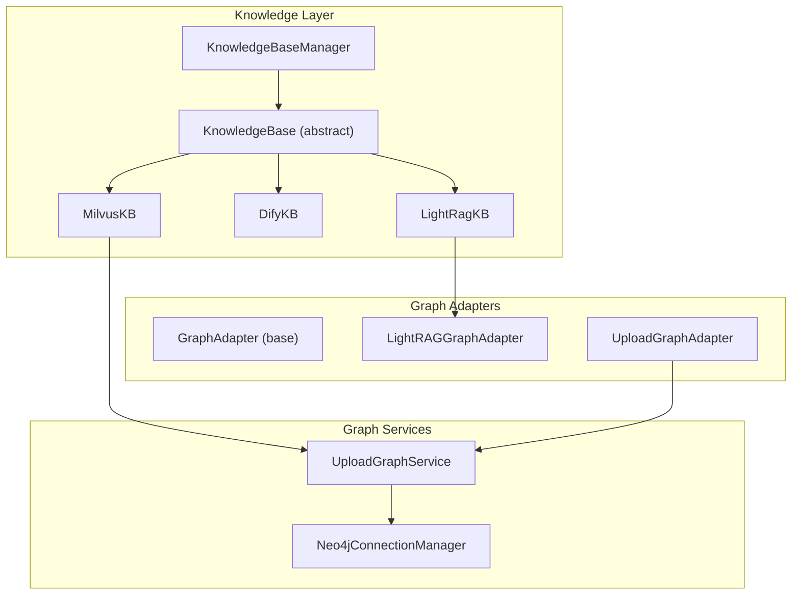
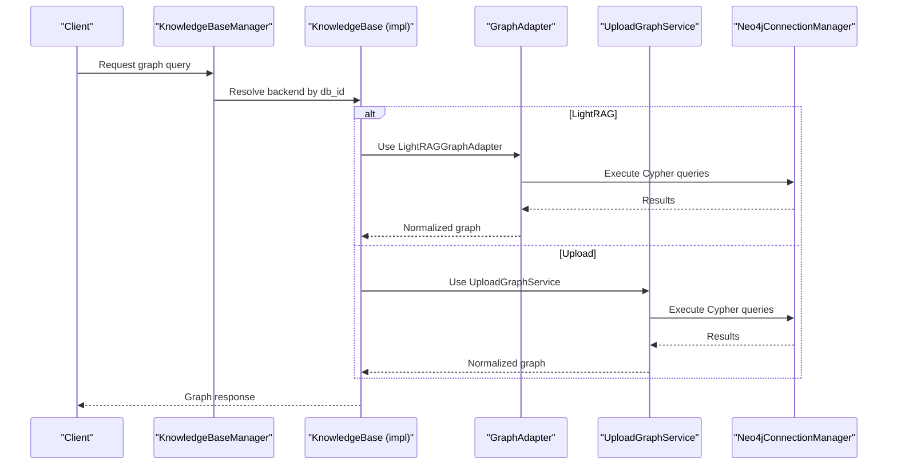
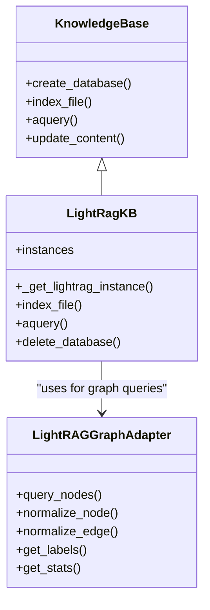
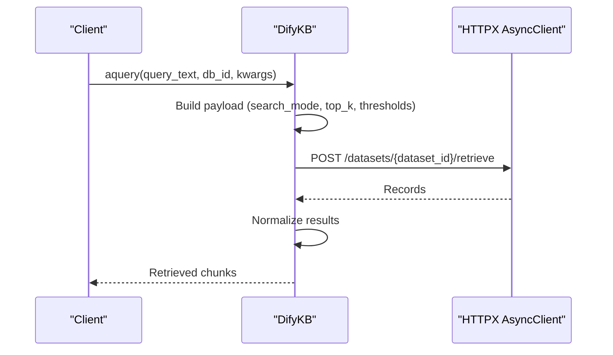
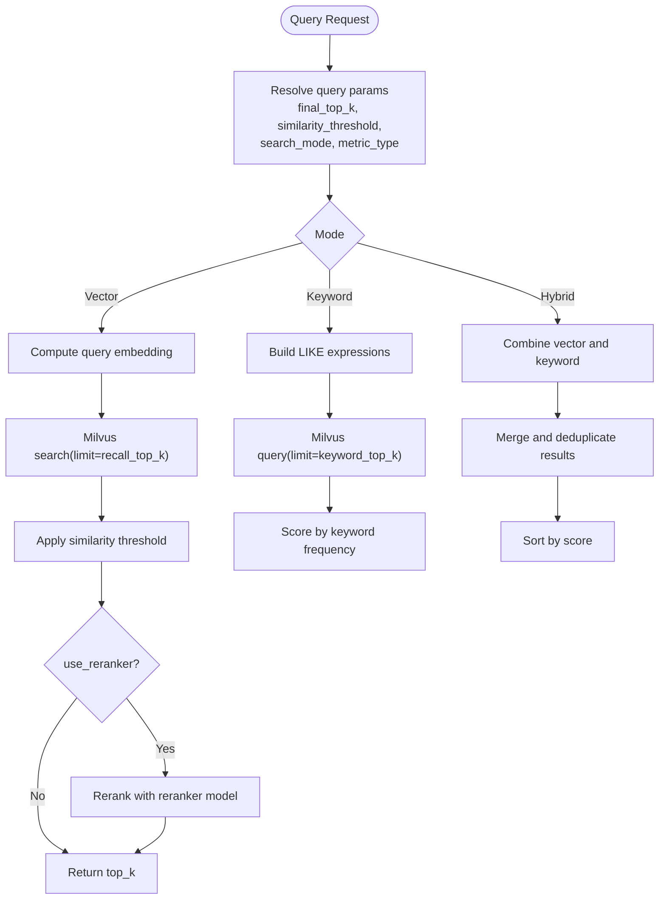
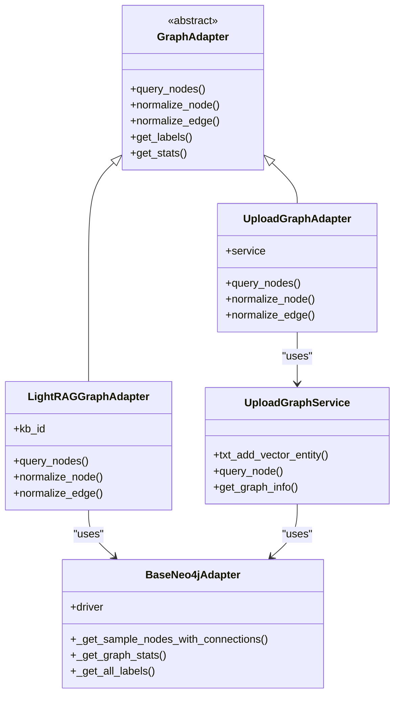
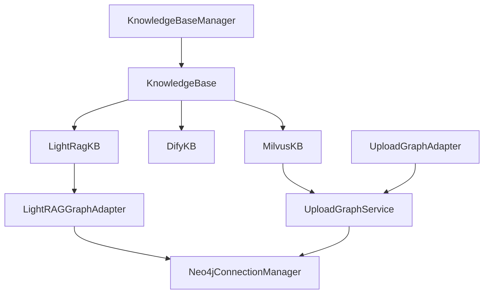

# Graph Implementation Backends

<cite>
**Referenced Files in This Document**
- [base.py](file://backend/package/yuxi/knowledge/base.py)
- [manager.py](file://backend/package/yuxi/knowledge/manager.py)
- [lightrag.py](file://backend/package/yuxi/knowledge/implementations/lightrag.py)
- [dify.py](file://backend/package/yuxi/knowledge/implementations/dify.py)
- [milvus.py](file://backend/package/yuxi/knowledge/implementations/milvus.py)
- [base.py](file://backend/package/yuxi/knowledge/graphs/adapters/base.py)
- [lightrag.py](file://backend/package/yuxi/knowledge/graphs/adapters/lightrag.py)
- [upload.py](file://backend/package/yuxi/knowledge/graphs/adapters/upload.py)
- [upload_graph_service.py](file://backend/package/yuxi/knowledge/graphs/upload_graph_service.py)
- [kb_utils.py](file://backend/package/yuxi/knowledge/utils/kb_utils.py)
</cite>

## Table of Contents
1. [Introduction](#introduction)
2. [Project Structure](#project-structure)
3. [Core Components](#core-components)
4. [Architecture Overview](#architecture-overview)
5. [Detailed Component Analysis](#detailed-component-analysis)
6. [Dependency Analysis](#dependency-analysis)
7. [Performance Considerations](#performance-considerations)
8. [Troubleshooting Guide](#troubleshooting-guide)
9. [Conclusion](#conclusion)

## Introduction
This document explains the graph implementation backends in the system, focusing on three primary pathways:
- LightRAG-based knowledge graph construction with entity extraction, relationship building, and graph storage
- Dify integration for enhanced graph capabilities and external service connectivity
- Milvus vector database integration for semantic search and similarity calculations within the graph context

It covers backend selection criteria, configuration options, performance characteristics, optimization strategies, migration approaches, and troubleshooting guidance.

## Project Structure
The graph backends are organized under the knowledge module with clear separation of concerns:
- Knowledge base abstraction and management
- Backend implementations (LightRAG, Dify, Milvus)
- Graph adapters for Neo4j-based graph storage and upload-based graph services
- Utilities for embedding configuration and file handling

**Diagram sources**
- [manager.py:15-102](file://backend/package/yuxi/knowledge/manager.py#L15-L102)
- [base.py:46-190](file://backend/package/yuxi/knowledge/base.py#L46-L190)
- [lightrag.py:23-779](file://backend/package/yuxi/knowledge/implementations/lightrag.py#L23-L779)
- [dify.py:10-221](file://backend/package/yuxi/knowledge/implementations/dify.py#L10-L221)
- [milvus.py:24-897](file://backend/package/yuxi/knowledge/implementations/milvus.py#L24-L897)
- [base.py:43-147](file://backend/package/yuxi/knowledge/graphs/adapters/base.py#L43-L147)
- [lightrag.py:8-329](file://backend/package/yuxi/knowledge/graphs/adapters/lightrag.py#L8-L329)
- [upload.py:11-123](file://backend/package/yuxi/knowledge/graphs/adapters/upload.py#L11-L123)
- [upload_graph_service.py:18-778](file://backend/package/yuxi/knowledge/graphs/upload_graph_service.py#L18-L778)

**Section sources**
- [manager.py:15-102](file://backend/package/yuxi/knowledge/manager.py#L15-L102)
- [base.py:46-190](file://backend/package/yuxi/knowledge/base.py#L46-L190)

## Core Components
- KnowledgeBaseManager: Central orchestrator for database lifecycle, routing queries to appropriate knowledge base implementations, and metadata synchronization.
- KnowledgeBase (abstract): Defines the unified interface for indexing, querying, and managing knowledge base instances.
- LightRagKB: Implements LightRAG-based knowledge graph with entity extraction, relationship building, and dual storage via Neo4j and Milvus.
- DifyKB: Provides read-only retrieval against external Dify Dataset APIs.
- MilvusKB: Offers production-grade vector storage with configurable embedding models, chunking, and hybrid search.
- GraphAdapter family: Standardizes graph querying and normalization across different graph backends (Neo4j-based adapters).
- UploadGraphService: Manages upload-based graph ingestion, vector indexing, and hybrid retrieval.

**Section sources**
- [manager.py:15-102](file://backend/package/yuxi/knowledge/manager.py#L15-L102)
- [base.py:46-190](file://backend/package/yuxi/knowledge/base.py#L46-L190)
- [lightrag.py:23-779](file://backend/package/yuxi/knowledge/implementations/lightrag.py#L23-L779)
- [dify.py:10-221](file://backend/package/yuxi/knowledge/implementations/dify.py#L10-L221)
- [milvus.py:24-897](file://backend/package/yuxi/knowledge/implementations/milvus.py#L24-L897)
- [base.py:43-147](file://backend/package/yuxi/knowledge/graphs/adapters/base.py#L43-L147)
- [upload_graph_service.py:18-778](file://backend/package/yuxi/knowledge/graphs/upload_graph_service.py#L18-L778)

## Architecture Overview
The system routes requests through KnowledgeBaseManager to the appropriate backend implementation. For graph-related operations, adapters encapsulate Neo4j interactions and upload graph services handle ingestion and retrieval.

**Diagram sources**
- [manager.py:111-137](file://backend/package/yuxi/knowledge/manager.py#L111-L137)
- [lightrag.py:23-779](file://backend/package/yuxi/knowledge/implementations/lightrag.py#L23-L779)
- [base.py:8-329](file://backend/package/yuxi/knowledge/graphs/adapters/lightrag.py#L8-L329)
- [upload.py:11-123](file://backend/package/yuxi/knowledge/graphs/adapters/upload.py#L11-L123)
- [upload_graph_service.py:18-778](file://backend/package/yuxi/knowledge/graphs/upload_graph_service.py#L18-L778)
- [base.py:149-204](file://backend/package/yuxi/knowledge/graphs/adapters/base.py#L149-L204)

## Detailed Component Analysis

### LightRAG Implementation
LightRagKB integrates LightRAG for knowledge graph construction:
- Entity extraction and relationship building are performed asynchronously during indexing.
- Dual storage: Neo4j for graph entities and relationships; Milvus for vector embeddings.
- Supports LLM and embedding model configuration, with caching and lock guards for concurrent operations.
- Query support includes graph-scoped retrieval with configurable modes and top-k limits.

Key implementation highlights:
- Asynchronous indexing pipeline with status tracking and error handling.
- Retrieval with configurable modes (local/global/hybrid/naive/mix) and content scope.
- Export disabled due to upstream Milvus compatibility issues.

**Diagram sources**
- [base.py:46-190](file://backend/package/yuxi/knowledge/base.py#L46-L190)
- [lightrag.py:23-779](file://backend/package/yuxi/knowledge/implementations/lightrag.py#L23-L779)
- [lightrag.py:8-329](file://backend/package/yuxi/knowledge/graphs/adapters/lightrag.py#L8-L329)

**Section sources**
- [lightrag.py:23-779](file://backend/package/yuxi/knowledge/implementations/lightrag.py#L23-L779)
- [lightrag.py:8-329](file://backend/package/yuxi/knowledge/graphs/adapters/lightrag.py#L8-L329)

### Dify Integration
DifyKB provides read-only retrieval against external Dify Dataset APIs:
- Configured via metadata fields: API URL, token, and dataset ID.
- Supports vector, keyword, and hybrid search modes mapped to Dify’s retrieval model.
- Includes fallback logic to degrade gracefully when advanced retrieval parameters are unsupported.

**Diagram sources**
- [dify.py:69-162](file://backend/package/yuxi/knowledge/implementations/dify.py#L69-L162)

**Section sources**
- [dify.py:10-221](file://backend/package/yuxi/knowledge/implementations/dify.py#L10-L221)

### Milvus Vector Database Integration
MilvusKB offers production-grade vector storage:
- Dynamic collection creation per database with embedding dimension and model validation.
- Supports vector, keyword, and hybrid search modes with configurable thresholds and reranking.
- Batch embedding generation with configurable batch sizes and async execution.
- Robust query parameter configuration including metric types, recall/top-k controls, and optional reranking.

**Diagram sources**
- [milvus.py:471-676](file://backend/package/yuxi/knowledge/implementations/milvus.py#L471-L676)

**Section sources**
- [milvus.py:24-897](file://backend/package/yuxi/knowledge/implementations/milvus.py#L24-L897)

### Graph Adapters and Upload Graph Service
Graph adapters standardize graph querying and normalization:
- BaseNeo4jAdapter provides reusable Neo4j connection management and common graph operations.
- LightRAGGraphAdapter leverages kb_id-based labels and Cypher queries for graph exploration.
- UploadGraphAdapter integrates with UploadGraphService for vector-enabled upload graphs with embedding indices.

**Diagram sources**
- [base.py:43-147](file://backend/package/yuxi/knowledge/graphs/adapters/base.py#L43-L147)
- [lightrag.py:8-329](file://backend/package/yuxi/knowledge/graphs/adapters/lightrag.py#L8-L329)
- [upload.py:11-123](file://backend/package/yuxi/knowledge/graphs/adapters/upload.py#L11-L123)
- [upload_graph_service.py:18-778](file://backend/package/yuxi/knowledge/graphs/upload_graph_service.py#L18-L778)

**Section sources**
- [base.py:149-459](file://backend/package/yuxi/knowledge/graphs/adapters/base.py#L149-L459)
- [lightrag.py:8-329](file://backend/package/yuxi/knowledge/graphs/adapters/lightrag.py#L8-L329)
- [upload.py:11-123](file://backend/package/yuxi/knowledge/graphs/adapters/upload.py#L11-L123)
- [upload_graph_service.py:18-778](file://backend/package/yuxi/knowledge/graphs/upload_graph_service.py#L18-L778)

## Dependency Analysis
- KnowledgeBaseManager resolves the correct backend implementation per database and synchronizes metadata.
- LightRagKB depends on LightRAG library, Neo4j driver, and Milvus client for graph and vector storage.
- DifyKB depends on HTTPX for asynchronous API calls to external Dify services.
- MilvusKB depends on PyMilvus for collection management and vector operations.
- Graph adapters depend on BaseNeo4jAdapter for Neo4j connectivity and graph operations.

**Diagram sources**
- [manager.py:15-102](file://backend/package/yuxi/knowledge/manager.py#L15-L102)
- [base.py:46-190](file://backend/package/yuxi/knowledge/base.py#L46-L190)
- [lightrag.py:23-779](file://backend/package/yuxi/knowledge/implementations/lightrag.py#L23-L779)
- [dify.py:10-221](file://backend/package/yuxi/knowledge/implementations/dify.py#L10-L221)
- [milvus.py:24-897](file://backend/package/yuxi/knowledge/implementations/milvus.py#L24-L897)
- [lightrag.py:8-329](file://backend/package/yuxi/knowledge/graphs/adapters/lightrag.py#L8-L329)
- [upload.py:11-123](file://backend/package/yuxi/knowledge/graphs/adapters/upload.py#L11-L123)
- [upload_graph_service.py:18-778](file://backend/package/yuxi/knowledge/graphs/upload_graph_service.py#L18-L778)
- [base.py:149-204](file://backend/package/yuxi/knowledge/graphs/adapters/base.py#L149-L204)

**Section sources**
- [manager.py:15-102](file://backend/package/yuxi/knowledge/manager.py#L15-L102)
- [base.py:46-190](file://backend/package/yuxi/knowledge/base.py#L46-L190)

## Performance Considerations
- LightRAG
  - Asynchronous initialization and instance caching reduce cold-start overhead.
  - Lock guards prevent concurrent writes to the same database.
  - Export disabled due to upstream Milvus compatibility; use alternative export strategies if needed.
- Dify
  - Fallback mechanism ensures resilience when advanced retrieval parameters are unsupported.
  - Timeout configured for HTTP requests to avoid hanging.
- Milvus
  - IVF_FLAT index with configurable nlist for balanced recall and latency.
  - Batch embedding generation reduces network overhead.
  - Hybrid search merges vector and keyword results with optional reranking for improved precision.

[No sources needed since this section provides general guidance]

## Troubleshooting Guide
Common issues and resolutions:
- LightRAG
  - Export failures: Upstream Milvus compatibility issue; export disabled until fixed.
  - Instance creation errors: Check LLM and embedding configurations; verify environment variables for URIs/tokens.
- Dify
  - Missing configuration fields: Ensure API URL, token, and dataset ID are provided.
  - HTTP errors: Inspect status codes and payload previews; fallback to query-only mode is attempted automatically.
- Milvus
  - Connection failures: Verify URI, token, and database existence; ensure collections are created with matching embedding models.
  - Query timeouts: Adjust recall_top_k and metric type; consider enabling reranking judiciously.
- Graph adapters
  - Neo4j connectivity: Confirm credentials and availability; BaseNeo4jAdapter manages driver lifecycle.
  - Upload graph ingestion: Ensure vector index exists and embedding model dimensions match.

**Section sources**
- [lightrag.py:743-779](file://backend/package/yuxi/knowledge/implementations/lightrag.py#L743-L779)
- [dify.py:76-128](file://backend/package/yuxi/knowledge/implementations/dify.py#L76-L128)
- [milvus.py:78-88](file://backend/package/yuxi/knowledge/implementations/milvus.py#L78-L88)
- [base.py:163-192](file://backend/package/yuxi/knowledge/graphs/adapters/base.py#L163-L192)
- [upload_graph_service.py:647-666](file://backend/package/yuxi/knowledge/graphs/upload_graph_service.py#L647-L666)

## Backend Selection Criteria
- Choose LightRAG when:
  - You need integrated entity extraction and relationship building.
  - Dual storage (Neo4j + Milvus) is desired for graph and vectors.
  - You require mixed retrieval modes and graph-scoped content.
- Choose Dify when:
  - You need external dataset retrieval with minimal local infrastructure.
  - You prefer managed external services for retrieval.
- Choose Milvus when:
  - You need production-grade vector search with customizable embedding models and hybrid modes.
  - You require fine-grained control over recall, thresholds, and optional reranking.

[No sources needed since this section provides general guidance]

## Migration Strategies
- From LightRAG to Milvus:
  - Persist vector embeddings separately; keep Neo4j for graph structure.
  - Replicate indexed content into Milvus collections with matching embedding dimensions.
  - Update retrieval logic to use Milvus search with optional reranking.
- From Upload graphs to LightRAG:
  - Convert uploaded triples to LightRAG-compatible entities and relationships.
  - Rebuild graph storage using LightRAG’s graph storage backend.
  - Retain vector embeddings in Neo4j if needed, or migrate to Milvus.

[No sources needed since this section provides general guidance]

## Conclusion
The system provides robust, modular backends for knowledge graph construction and retrieval:
- LightRAG delivers integrated entity extraction and dual storage.
- Dify enables seamless external retrieval integration.
- Milvus offers scalable vector search with flexible hybrid modes and reranking.

Select the backend based on your requirements for graph structure, vector search, and operational complexity, and apply the provided optimization and migration strategies for smooth deployment and maintenance.