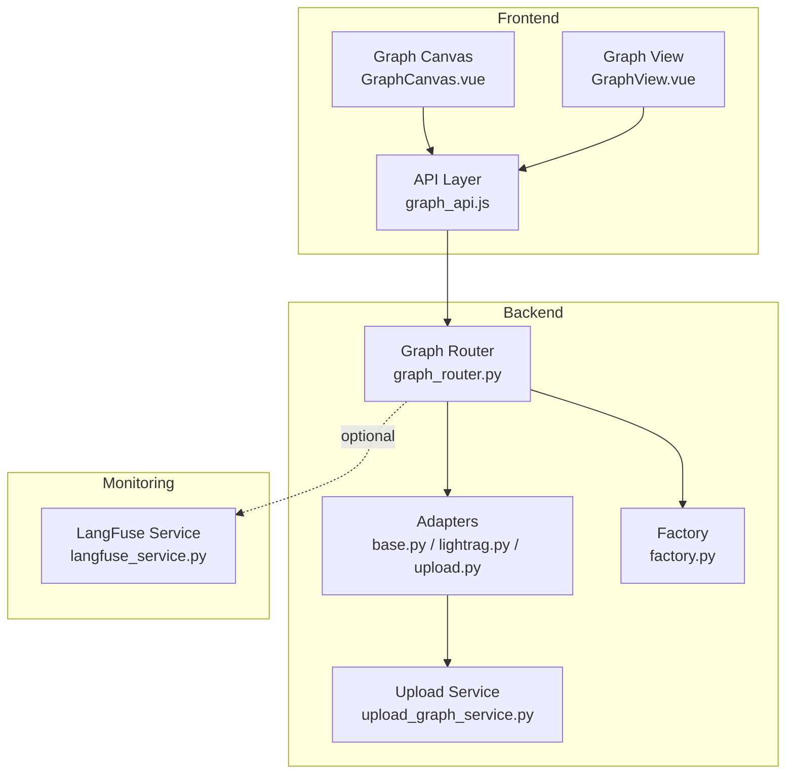
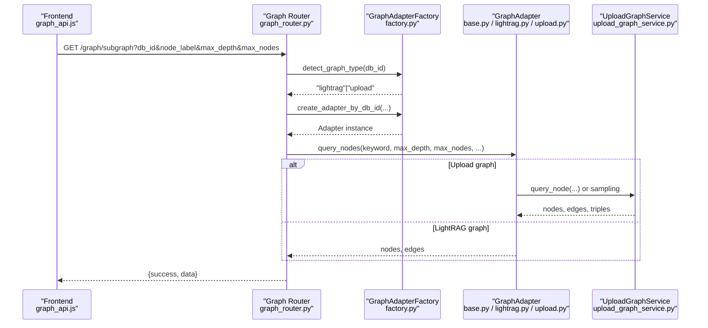
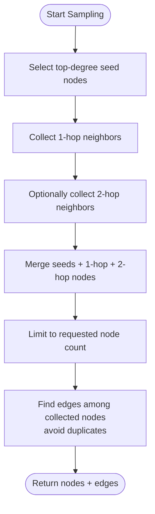
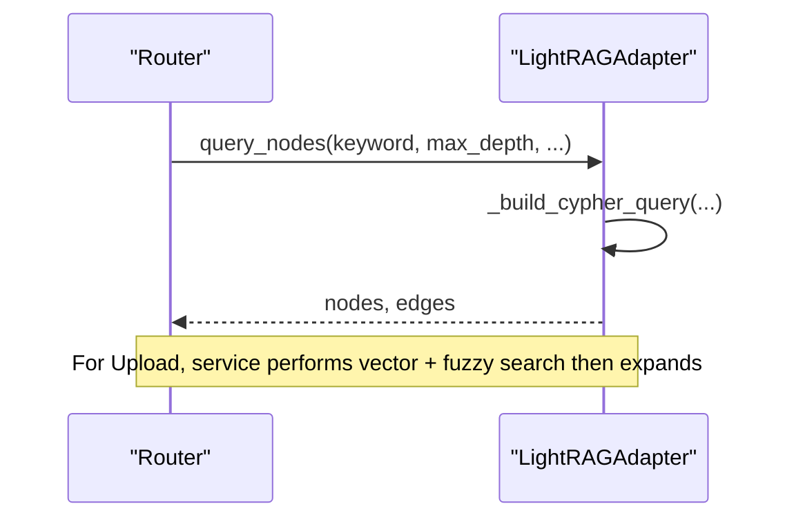
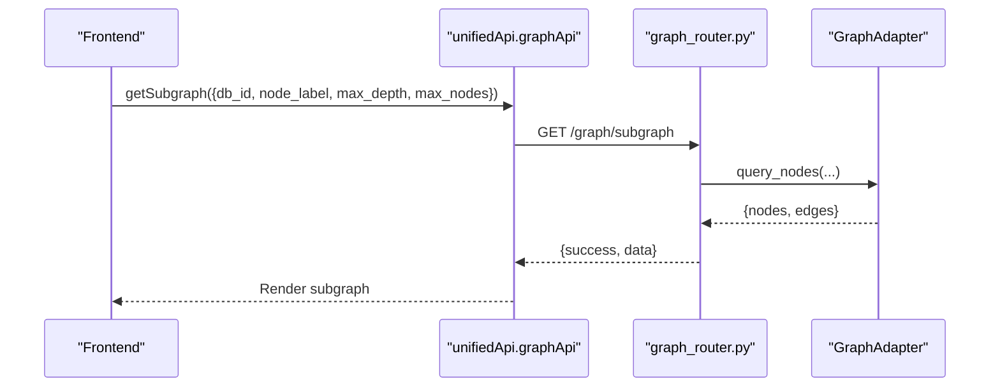
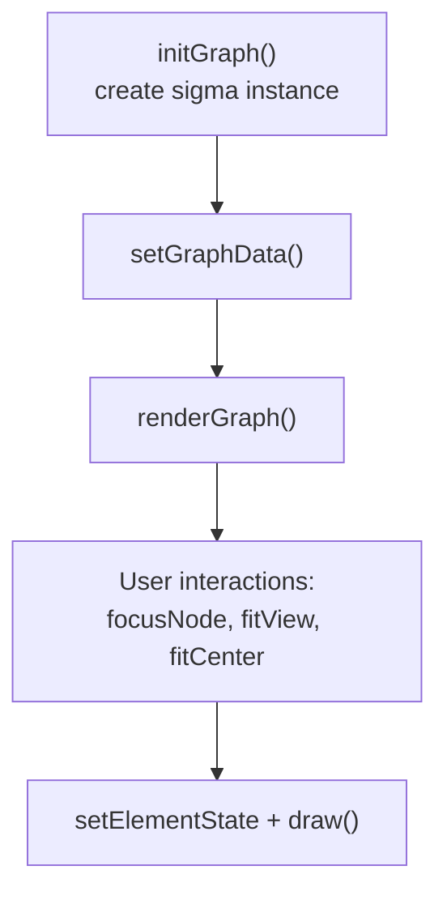
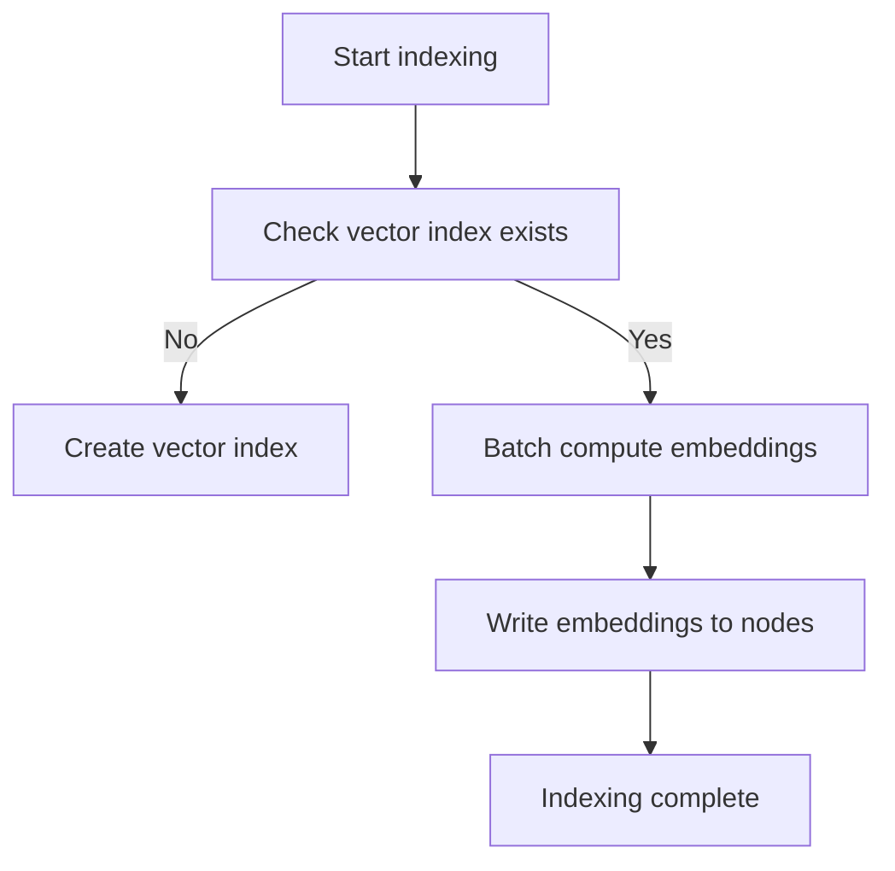
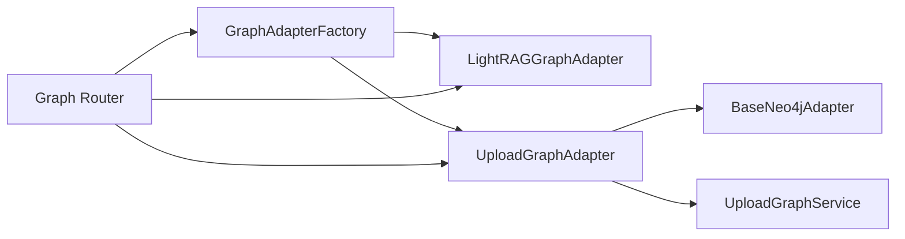

# Graph Operations & Querying

<cite>
**Referenced Files in This Document**
- [base.py](file://backend/package/yuxi/knowledge/graphs/adapters/base.py)
- [lightrag.py](file://backend/package/yuxi/knowledge/graphs/adapters/lightrag.py)
- [upload.py](file://backend/package/yuxi/knowledge/graphs/adapters/upload.py)
- [factory.py](file://backend/package/yuxi/knowledge/graphs/adapters/factory.py)
- [upload_graph_service.py](file://backend/package/yuxi/knowledge/graphs/upload_graph_service.py)
- [graph_router.py](file://backend/server/routers/graph_router.py)
- [graph_api.js](file://web/src/apis/graph_api.js)
- [GraphCanvas.vue](file://web/src/components/GraphCanvas.vue)
- [GraphView.vue](file://web/src/views/GraphView.vue)
- [langfuse_service.py](file://backend/package/yuxi/services/langfuse_service.py)
</cite>

## Table of Contents
1. [Introduction](#introduction)
2. [Project Structure](#project-structure)
3. [Core Components](#core-components)
4. [Architecture Overview](#architecture-overview)
5. [Detailed Component Analysis](#detailed-component-analysis)
6. [Dependency Analysis](#dependency-analysis)
7. [Performance Considerations](#performance-considerations)
8. [Troubleshooting Guide](#troubleshooting-guide)
9. [Conclusion](#conclusion)
10. [Appendices](#appendices)

## Introduction
This document explains the graph operations and querying capabilities of the system, focusing on:
- Graph traversal algorithms and subgraph extraction
- Path-finding and connected component retrieval
- Query interfaces for entities, relationships, and labels
- Graph visualization and interactive exploration
- Indexing strategies and query optimization
- Examples of complex queries and analytics
- Performance tuning for large graphs
- Monitoring integration with LangFuse for query performance

## Project Structure
The graph subsystem spans backend adapters, a unified router, frontend visualization, and monitoring integration:
- Adapters: Base Neo4j operations, LightRAG-specific, and Upload graph adapters
- Services: Upload graph ingestion and vector indexing
- Router: Unified FastAPI endpoints for graph operations
- Frontend: Interactive graph canvas and views
- Monitoring: Optional LangFuse integration

**Diagram sources**
- [graph_router.py:1-290](file://backend/server/routers/graph_router.py#L1-L290)
- [base.py:1-459](file://backend/package/yuxi/knowledge/graphs/adapters/base.py#L1-L459)
- [lightrag.py:1-329](file://backend/package/yuxi/knowledge/graphs/adapters/lightrag.py#L1-L329)
- [upload.py:1-123](file://backend/package/yuxi/knowledge/graphs/adapters/upload.py#L1-L123)
- [factory.py:1-93](file://backend/package/yuxi/knowledge/graphs/adapters/factory.py#L1-L93)
- [upload_graph_service.py:1-778](file://backend/package/yuxi/knowledge/graphs/upload_graph_service.py#L1-L778)
- [graph_api.js:1-262](file://web/src/apis/graph_api.js#L1-L262)
- [GraphCanvas.vue:118-373](file://web/src/components/GraphCanvas.vue#L118-L373)
- [GraphView.vue:261-307](file://web/src/views/GraphView.vue#L261-L307)
- [langfuse_service.py:1-211](file://backend/package/yuxi/services/langfuse_service.py#L1-L211)

**Section sources**
- [graph_router.py:1-290](file://backend/server/routers/graph_router.py#L1-L290)
- [base.py:1-459](file://backend/package/yuxi/knowledge/graphs/adapters/base.py#L1-L459)
- [lightrag.py:1-329](file://backend/package/yuxi/knowledge/graphs/adapters/lightrag.py#L1-L329)
- [upload.py:1-123](file://backend/package/yuxi/knowledge/graphs/adapters/upload.py#L1-L123)
- [factory.py:1-93](file://backend/package/yuxi/knowledge/graphs/adapters/factory.py#L1-L93)
- [upload_graph_service.py:1-778](file://backend/package/yuxi/knowledge/graphs/upload_graph_service.py#L1-L778)
- [graph_api.js:1-262](file://web/src/apis/graph_api.js#L1-L262)
- [GraphCanvas.vue:118-373](file://web/src/components/GraphCanvas.vue#L118-L373)
- [GraphView.vue:261-307](file://web/src/views/GraphView.vue#L261-L307)
- [langfuse_service.py:1-211](file://backend/package/yuxi/services/langfuse_service.py#L1-L211)

## Core Components
- GraphAdapter: Abstract base defining query_nodes, normalization, labels, and stats
- BaseNeo4jAdapter: Shared Neo4j connectivity and common graph operations (sampling, stats, labels)
- LightRAGGraphAdapter: Cypher-based queries for LightRAG knowledge bases (kb_id-labeled graphs)
- UploadGraphAdapter: Upload graph ingestion, vector indexing, and hybrid similarity/fuzzy queries
- GraphAdapterFactory: Factory for selecting adapter by db_id and capabilities
- UploadGraphService: Ingestion pipeline, vector index creation, and entity queries
- Graph Router: Unified endpoints for subgraph, labels, stats, and Neo4j operations
- Frontend APIs and Canvas: Unified graph API bindings and interactive visualization

**Section sources**
- [base.py:43-147](file://backend/package/yuxi/knowledge/graphs/adapters/base.py#L43-L147)
- [base.py:206-459](file://backend/package/yuxi/knowledge/graphs/adapters/base.py#L206-L459)
- [lightrag.py:8-106](file://backend/package/yuxi/knowledge/graphs/adapters/lightrag.py#L8-L106)
- [upload.py:11-123](file://backend/package/yuxi/knowledge/graphs/adapters/upload.py#L11-L123)
- [factory.py:6-93](file://backend/package/yuxi/knowledge/graphs/adapters/factory.py#L6-L93)
- [upload_graph_service.py:18-778](file://backend/package/yuxi/knowledge/graphs/upload_graph_service.py#L18-L778)
- [graph_router.py:21-290](file://backend/server/routers/graph_router.py#L21-L290)
- [graph_api.js:13-170](file://web/src/apis/graph_api.js#L13-L170)
- [GraphCanvas.vue:118-373](file://web/src/components/GraphCanvas.vue#L118-L373)

## Architecture Overview
The system routes requests through a unified FastAPI router to an adapter selected by database type. For LightRAG, the adapter builds Cypher queries against kb_id-labeled nodes; for Upload graphs, the adapter delegates to UploadGraphService for vector similarity and fuzzy matching, then enriches with Neo4j graph sampling.

**Diagram sources**
- [graph_router.py:21-158](file://backend/server/routers/graph_router.py#L21-L158)
- [factory.py:37-92](file://backend/package/yuxi/knowledge/graphs/adapters/factory.py#L37-L92)
- [lightrag.py:30-48](file://backend/package/yuxi/knowledge/graphs/adapters/lightrag.py#L30-L48)
- [upload.py:42-63](file://backend/package/yuxi/knowledge/graphs/adapters/upload.py#L42-L63)
- [upload_graph_service.py:525-609](file://backend/package/yuxi/knowledge/graphs/upload_graph_service.py#L525-L609)

## Detailed Component Analysis

### Graph Traversal and Subgraph Extraction
- Connected subgraph sampling: BaseNeo4jAdapter selects high-degree seed nodes, expands 1-hop and 2-hop neighbors, merges connected components, and limits results while avoiding duplicate undirected edges.
- Fallback query: If sampling fails, a simpler pairwise edge query is executed to return a minimal connected subgraph.
- Statistics: Provides total nodes, edges, and entity type distribution (excluding system labels).

**Diagram sources**
- [base.py:242-384](file://backend/package/yuxi/knowledge/graphs/adapters/base.py#L242-L384)

**Section sources**
- [base.py:242-384](file://backend/package/yuxi/knowledge/graphs/adapters/base.py#L242-L384)
- [base.py:386-429](file://backend/package/yuxi/knowledge/graphs/adapters/base.py#L386-L429)

### Path Finding and Connected Components
- LightRAG adapter: Builds Cypher queries that optionally expand out to 1 or more hops around matched seed nodes, returning triples (h, r, t) for visualization and analytics.
- Upload adapter: Uses vector similarity and fuzzy matching to identify candidate entities, then expands to a configurable hop radius around each entity.

**Diagram sources**
- [lightrag.py:168-256](file://backend/package/yuxi/knowledge/graphs/adapters/lightrag.py#L168-L256)
- [upload.py:42-63](file://backend/package/yuxi/knowledge/graphs/adapters/upload.py#L42-L63)
- [upload_graph_service.py:525-609](file://backend/package/yuxi/knowledge/graphs/upload_graph_service.py#L525-L609)

**Section sources**
- [lightrag.py:168-256](file://backend/package/yuxi/knowledge/graphs/adapters/lightrag.py#L168-L256)
- [upload.py:42-63](file://backend/package/yuxi/knowledge/graphs/adapters/upload.py#L42-L63)
- [upload_graph_service.py:525-609](file://backend/package/yuxi/knowledge/graphs/upload_graph_service.py#L525-L609)

### Query Interface: Entities, Relationships, Labels, and Stats
- Unified endpoints:
  - List graphs: Returns Neo4j and LightRAG databases with capabilities
  - Subgraph: Returns nodes and edges for a given db_id and keyword/label
  - Labels: Returns all labels for a given db_id
  - Stats: Returns graph statistics (counts and distributions)
  - Neo4j-specific: Sample nodes, query single node, add entities, index entities, get info
- Frontend APIs:
  - unifiedApi.getGraphs, getSubgraph, getStats, getLabels
  - neo4jApi.getSampleNodes, queryNode, addEntities, indexEntities, getInfo

**Diagram sources**
- [graph_router.py:116-158](file://backend/server/routers/graph_router.py#L116-L158)
- [graph_api.js:31-80](file://web/src/apis/graph_api.js#L31-L80)

**Section sources**
- [graph_router.py:52-211](file://backend/server/routers/graph_router.py#L52-L211)
- [graph_api.js:13-170](file://web/src/apis/graph_api.js#L13-L170)

### Graph Visualization and Interactive Exploration
- GraphCanvas: Initializes sigma graph renderer, applies layout, node sizing by degree, and highlights; supports focus on neighbors and fit-to-view.
- GraphView: Loads available databases, displays counts, and integrates unified API for graph operations.

**Diagram sources**
- [GraphCanvas.vue:124-373](file://web/src/components/GraphCanvas.vue#L124-L373)
- [GraphView.vue:287-307](file://web/src/views/GraphView.vue#L287-L307)

**Section sources**
- [GraphCanvas.vue:124-373](file://web/src/components/GraphCanvas.vue#L124-L373)
- [GraphView.vue:287-307](file://web/src/views/GraphView.vue#L287-L307)

### Indexing Strategies and Query Optimization
- Upload vector index: Creates a vector index on node embeddings for similarity search; batches embedding computation and writes back to Neo4j.
- Fuzzy + vector fusion: Aggregates scores from vector similarity and fuzzy matches, sorts, and expands around top candidates.
- Sampling-based subgraph: Seeds expansion from high-degree nodes to improve coverage while limiting fan-out.
- Property pruning: Removes embedding fields from returned properties to reduce payload size.

**Diagram sources**
- [upload_graph_service.py:201-315](file://backend/package/yuxi/knowledge/graphs/upload_graph_service.py#L201-L315)

**Section sources**
- [upload_graph_service.py:201-315](file://backend/package/yuxi/knowledge/graphs/upload_graph_service.py#L201-L315)
- [base.py:224-241](file://backend/package/yuxi/knowledge/graphs/adapters/base.py#L224-L241)

### Complex Queries and Analytics
- Multi-token aggregation: Tokenize keywords, compute vector similarity and fuzzy matches, merge scores, and rank top entities.
- Triple extraction: For each entity, expand up to configured hops and collect triples for downstream analytics.
- Label filtering: Exclude system labels and filter by kb_id for LightRAG graphs.

**Section sources**
- [upload_graph_service.py:525-609](file://backend/package/yuxi/knowledge/graphs/upload_graph_service.py#L525-L609)
- [lightrag.py:168-256](file://backend/package/yuxi/knowledge/graphs/adapters/lightrag.py#L168-L256)

### Monitoring with LangFuse
- Optional integration: Build run contexts with trace metadata/tags; attach CallbackHandler when enabled; lazily resolve trace URLs; flush events.
- Environment flags: Enable/disable via environment variables and keys.

**Section sources**
- [langfuse_service.py:30-211](file://backend/package/yuxi/services/langfuse_service.py#L30-L211)

## Dependency Analysis
- Adapter selection depends on db_id and knowledge base metadata
- Upload adapter composes BaseNeo4jAdapter for sampling and UploadGraphService for ingestion and queries
- Router depends on factory for adapter instantiation and on knowledge base manager for LightRAG detection

**Diagram sources**
- [factory.py:6-93](file://backend/package/yuxi/knowledge/graphs/adapters/factory.py#L6-L93)
- [lightrag.py:8-18](file://backend/package/yuxi/knowledge/graphs/adapters/lightrag.py#L8-L18)
- [upload.py:14-31](file://backend/package/yuxi/knowledge/graphs/adapters/upload.py#L14-L31)
- [graph_router.py:21-42](file://backend/server/routers/graph_router.py#L21-L42)

**Section sources**
- [factory.py:6-93](file://backend/package/yuxi/knowledge/graphs/adapters/factory.py#L6-L93)
- [lightrag.py:8-18](file://backend/package/yuxi/knowledge/graphs/adapters/lightrag.py#L8-L18)
- [upload.py:14-31](file://backend/package/yuxi/knowledge/graphs/adapters/upload.py#L14-L31)
- [graph_router.py:21-42](file://backend/server/routers/graph_router.py#L21-L42)

## Performance Considerations
- Limit expansions: Use max_nodes and max_depth to cap traversal cost
- Prefer sampling seeds: Start from high-degree nodes to reduce search space
- Vector index: Ensure vector index exists for Upload graphs to avoid expensive scans
- Payload reduction: Properties are pruned to remove embedding fields in BaseNeo4jAdapter
- Batch embedding: Use batch sizes appropriate for memory constraints
- Avoid bidirectional duplication: Compare element IDs to prevent duplicate undirected edges

[No sources needed since this section provides general guidance]

## Troubleshooting Guide
- Graph service not running: Unified router checks service status for Upload graphs and raises 503 if not available
- Connection failures: BaseNeo4jAdapter validates connectivity and logs errors
- Fallback sampling: If primary sampling fails, a fallback query is executed to return minimal connected subgraph
- Vector index missing: UploadGraphService raises an exception advising index creation

**Section sources**
- [graph_router.py:31-37](file://backend/server/routers/graph_router.py#L31-L37)
- [base.py:149-204](file://backend/package/yuxi/knowledge/graphs/adapters/base.py#L149-L204)
- [base.py:345-381](file://backend/package/yuxi/knowledge/graphs/adapters/base.py#L345-L381)
- [upload_graph_service.py:647-650](file://backend/package/yuxi/knowledge/graphs/upload_graph_service.py#L647-L650)

## Conclusion
The system provides a unified, extensible graph querying framework supporting both LightRAG and Upload graph types. It offers robust traversal, subgraph sampling, hybrid similarity/fuzzy search, and interactive visualization, with optional LangFuse monitoring. Performance is optimized through sampling, vector indexing, and payload pruning.

[No sources needed since this section summarizes without analyzing specific files]

## Appendices

### API Definitions
- Unified endpoints:
  - GET /graph/list: List graphs with capabilities
  - GET /graph/subgraph: Subgraph query by db_id and keyword/label
  - GET /graph/labels: Labels for db_id
  - GET /graph/stats: Graph statistics
  - GET /graph/neo4j/nodes: Sample nodes (deprecated)
  - GET /graph/neo4j/node: Single node query (deprecated)
  - GET /graph/neo4j/info: Neo4j info
  - POST /graph/neo4j/index-entities: Add vector index
  - POST /graph/neo4j/add-entities: Ingest JSONL triples

**Section sources**
- [graph_router.py:52-290](file://backend/server/routers/graph_router.py#L52-L290)
- [graph_api.js:13-170](file://web/src/apis/graph_api.js#L13-L170)