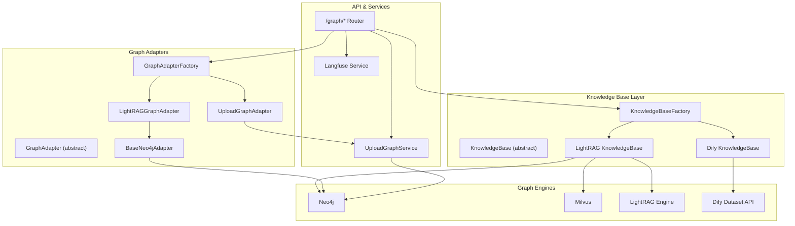
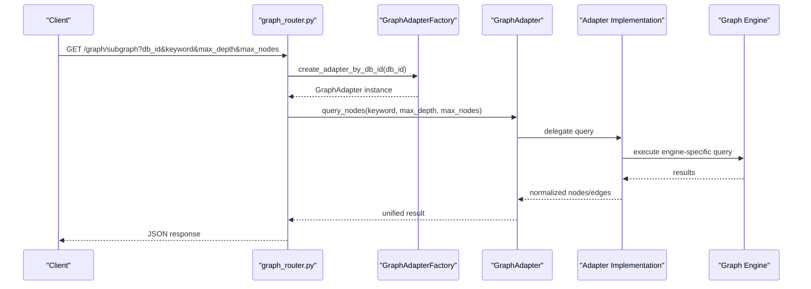
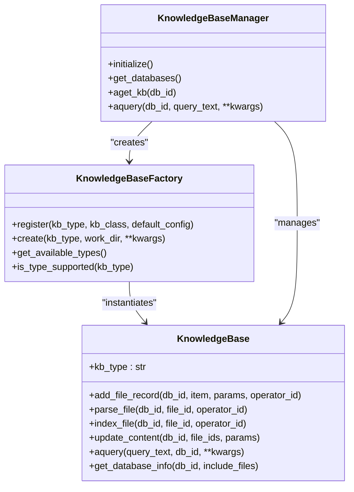
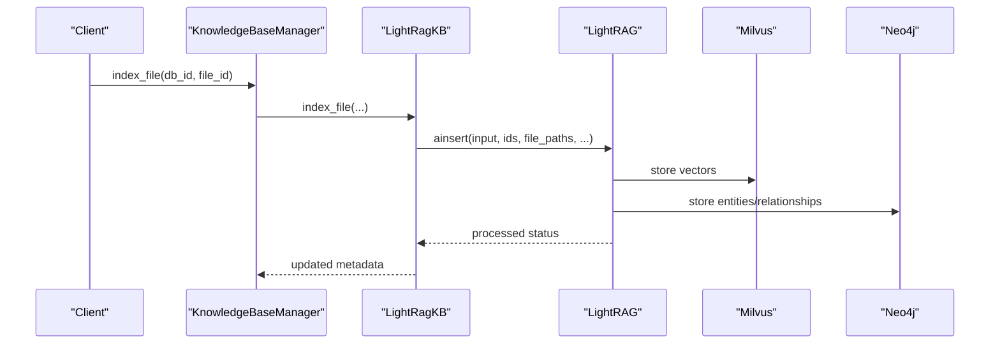
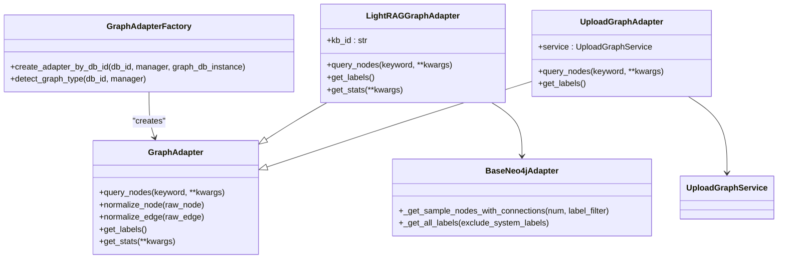
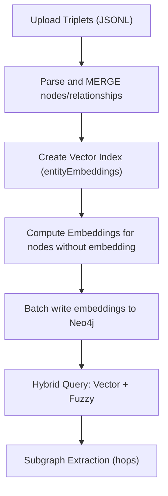
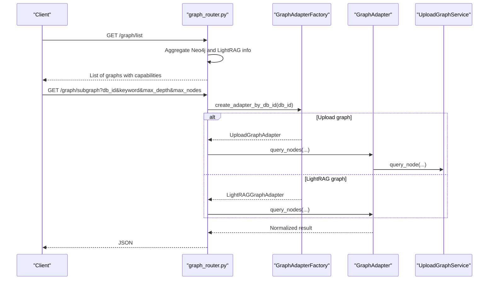
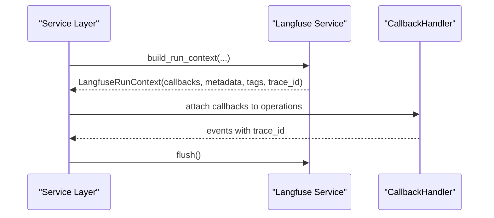
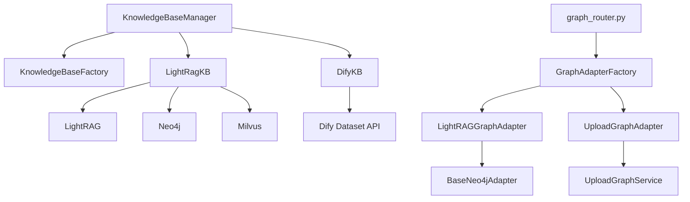

# Knowledge Graph Architecture

<cite>
**Referenced Files in This Document**
- [base.py](file://backend/package/yuxi/knowledge/base.py)
- [factory.py](file://backend/package/yuxi/knowledge/factory.py)
- [manager.py](file://backend/package/yuxi/knowledge/manager.py)
- [lightrag.py](file://backend/package/yuxi/knowledge/implementations/lightrag.py)
- [dify.py](file://backend/package/yuxi/knowledge/implementations/dify.py)
- [adapters/base.py](file://backend/package/yuxi/knowledge/graphs/adapters/base.py)
- [adapters/factory.py](file://backend/package/yuxi/knowledge/graphs/adapters/factory.py)
- [adapters/lightrag.py](file://backend/package/yuxi/knowledge/graphs/adapters/lightrag.py)
- [adapters/upload.py](file://backend/package/yuxi/knowledge/graphs/adapters/upload.py)
- [upload_graph_service.py](file://backend/package/yuxi/knowledge/graphs/upload_graph_service.py)
- [graph_router.py](file://backend/server/routers/graph_router.py)
- [langfuse_service.py](file://backend/package/yuxi/services/langfuse_service.py)
</cite>

## Table of Contents
1. [Introduction](#introduction)
2. [Project Structure](#project-structure)
3. [Core Components](#core-components)
4. [Architecture Overview](#architecture-overview)
5. [Detailed Component Analysis](#detailed-component-analysis)
6. [Dependency Analysis](#dependency-analysis)
7. [Performance Considerations](#performance-considerations)
8. [Troubleshooting Guide](#troubleshooting-guide)
9. [Conclusion](#conclusion)
10. [Appendices](#appendices)

## Introduction
This document describes the knowledge graph construction system in Yuxi, focusing on the graph database integration architecture that supports multiple graph engines, including LightRAG and Dify. It explains the entity extraction pipeline, relationship building, graph traversal algorithms, the graph adapter pattern, and pluggable graph implementations. It also covers the knowledge graph construction workflow from text processing to graph storage and querying, along with visualization capabilities, entity resolution, semantic similarity calculations, and integration with LangFuse for observability and performance monitoring.

## Project Structure
The knowledge graph system is organized around:
- A knowledge base abstraction and factory for pluggable backends (LightRAG, Dify)
- A graph adapter layer that unifies querying across different graph engines
- An upload graph service for Neo4j-based user-uploaded triplets with vector embeddings
- FastAPI routers exposing unified graph APIs
- Observability via LangFuse

**Diagram sources**
- [factory.py:32-64](file://backend/package/yuxi/knowledge/factory.py#L32-L64)
- [base.py:46-180](file://backend/package/yuxi/knowledge/base.py#L46-L180)
- [lightrag.py:23-47](file://backend/package/yuxi/knowledge/implementations/lightrag.py#L23-L47)
- [dify.py:10-19](file://backend/package/yuxi/knowledge/implementations/dify.py#L10-L19)
- [adapters/factory.py:20-26](file://backend/package/yuxi/knowledge/graphs/adapters/factory.py#L20-L26)
- [adapters/lightrag.py:8-28](file://backend/package/yuxi/knowledge/graphs/adapters/lightrag.py#L8-L28)
- [adapters/upload.py:11-40](file://backend/package/yuxi/knowledge/graphs/adapters/upload.py#L11-L40)
- [adapters/base.py:43-78](file://backend/package/yuxi/knowledge/graphs/adapters/base.py#L43-L78)
- [upload_graph_service.py:18-47](file://backend/package/yuxi/knowledge/graphs/upload_graph_service.py#L18-L47)
- [graph_router.py:21-41](file://backend/server/routers/graph_router.py#L21-L41)

**Section sources**
- [factory.py:5-108](file://backend/package/yuxi/knowledge/factory.py#L5-L108)
- [base.py:46-180](file://backend/package/yuxi/knowledge/base.py#L46-L180)
- [adapters/factory.py:6-34](file://backend/package/yuxi/knowledge/graphs/adapters/factory.py#L6-L34)
- [adapters/base.py:43-78](file://backend/package/yuxi/knowledge/graphs/adapters/base.py#L43-L78)
- [upload_graph_service.py:18-47](file://backend/package/yuxi/knowledge/graphs/upload_graph_service.py#L18-L47)
- [graph_router.py:13-41](file://backend/server/routers/graph_router.py#L13-L41)

## Core Components
- KnowledgeBase abstraction defines a uniform interface for ingestion, indexing, and querying across different backends.
- KnowledgeBaseFactory registers and instantiates pluggable knowledge base implementations (LightRAG, Dify).
- KnowledgeBaseManager orchestrates multiple knowledge base instances, metadata loading, and unified operations.
- GraphAdapter pattern provides a unified interface for querying across graph engines (LightRAG via Neo4j, Upload via Neo4j).
- GraphAdapterFactory detects graph type by db_id and creates appropriate adapters.
- UploadGraphService manages user-uploaded triplets, vector indexing, and hybrid similarity search in Neo4j.

**Section sources**
- [base.py:46-180](file://backend/package/yuxi/knowledge/base.py#L46-L180)
- [factory.py:32-64](file://backend/package/yuxi/knowledge/factory.py#L32-L64)
- [manager.py:15-102](file://backend/package/yuxi/knowledge/manager.py#L15-L102)
- [adapters/base.py:43-78](file://backend/package/yuxi/knowledge/graphs/adapters/base.py#L43-L78)
- [adapters/factory.py:20-26](file://backend/package/yuxi/knowledge/graphs/adapters/factory.py#L20-L26)
- [upload_graph_service.py:18-47](file://backend/package/yuxi/knowledge/graphs/upload_graph_service.py#L18-L47)

## Architecture Overview
The system integrates three primary knowledge graph engines:
- LightRAG: Uses Neo4j for graph storage and Milvus for vector storage. Entities and relationships are extracted from parsed chunks and indexed.
- Dify: Read-only retrieval against a Dify dataset via its Dataset Retrieve API.
- Upload: Neo4j-based triplets with optional vector embeddings for semantic similarity.

**Diagram sources**
- [graph_router.py:116-157](file://backend/server/routers/graph_router.py#L116-L157)
- [adapters/factory.py:62-83](file://backend/package/yuxi/knowledge/graphs/adapters/factory.py#L62-L83)
- [adapters/lightrag.py:30-48](file://backend/package/yuxi/knowledge/graphs/adapters/lightrag.py#L30-L48)
- [adapters/upload.py:42-63](file://backend/package/yuxi/knowledge/graphs/adapters/upload.py#L42-L63)

## Detailed Component Analysis

### Knowledge Base Abstraction and Factories
- KnowledgeBase defines lifecycle operations: add_file_record, parse_file, index_file, update_content, aquery, and metadata management.
- KnowledgeBaseFactory registers implementations and merges default configs with user-provided ones.
- KnowledgeBaseManager initializes instances per kb_type, loads metadata, and exposes unified operations.

**Diagram sources**
- [base.py:46-180](file://backend/package/yuxi/knowledge/base.py#L46-L180)
- [factory.py:32-64](file://backend/package/yuxi/knowledge/factory.py#L32-L64)
- [manager.py:15-102](file://backend/package/yuxi/knowledge/manager.py#L15-L102)

**Section sources**
- [base.py:46-180](file://backend/package/yuxi/knowledge/base.py#L46-L180)
- [factory.py:32-64](file://backend/package/yuxi/knowledge/factory.py#L32-L64)
- [manager.py:15-102](file://backend/package/yuxi/knowledge/manager.py#L15-L102)

### LightRAG Knowledge Base
- Implements ingestion via LightRAG with Milvus vector storage and Neo4j graph storage.
- Supports chunking, insertion, and entity/relationship extraction.
- Provides aquery with configurable modes and retrieval scopes.

**Diagram sources**
- [lightrag.py:305-421](file://backend/package/yuxi/knowledge/implementations/lightrag.py#L305-L421)
- [lightrag.py:526-601](file://backend/package/yuxi/knowledge/implementations/lightrag.py#L526-L601)

**Section sources**
- [lightrag.py:23-47](file://backend/package/yuxi/knowledge/implementations/lightrag.py#L23-L47)
- [lightrag.py:305-421](file://backend/package/yuxi/knowledge/implementations/lightrag.py#L305-L421)
- [lightrag.py:526-601](file://backend/package/yuxi/knowledge/implementations/lightrag.py#L526-L601)

### Dify Knowledge Base (Read-only)
- Exposes aquery against Dify’s Dataset Retrieve API with configurable search modes and thresholds.
- Designed for read-only retrieval scenarios.

```mermaid
flowchart TD
Start(["aquery(db_id, query_text, **kwargs)"]) --> CheckCfg["Load Dify config from metadata"]
CheckCfg --> BuildPayload["Build retrieval payload<br/>search_method, top_k, score_threshold"]
BuildPayload --> Request["POST /datasets/{dataset_id}/retrieve"]
Request --> HandleResp["Normalize records to chunks"]
HandleResp --> End(["Return results"])
```

**Diagram sources**
- [dify.py:69-162](file://backend/package/yuxi/knowledge/implementations/dify.py#L69-L162)

**Section sources**
- [dify.py:10-19](file://backend/package/yuxi/knowledge/implementations/dify.py#L10-L19)
- [dify.py:69-162](file://backend/package/yuxi/knowledge/implementations/dify.py#L69-L162)

### Graph Adapter Pattern and Pluggable Implementations
- GraphAdapter defines a unified interface for querying nodes, normalizing results, and retrieving labels/stats.
- GraphAdapterFactory detects graph type by db_id and creates the appropriate adapter.
- LightRAGGraphAdapter queries Neo4j using kb_id labels and builds Cypher queries.
- UploadGraphAdapter delegates to UploadGraphService for vector similarity and sampling.

**Diagram sources**
- [adapters/base.py:43-78](file://backend/package/yuxi/knowledge/graphs/adapters/base.py#L43-L78)
- [adapters/factory.py:37-83](file://backend/package/yuxi/knowledge/graphs/adapters/factory.py#L37-L83)
- [adapters/lightrag.py:8-28](file://backend/package/yuxi/knowledge/graphs/adapters/lightrag.py#L8-L28)
- [adapters/upload.py:11-40](file://backend/package/yuxi/knowledge/graphs/adapters/upload.py#L11-L40)
- [adapters/base.py:206-458](file://backend/package/yuxi/knowledge/graphs/adapters/base.py#L206-L458)

**Section sources**
- [adapters/base.py:43-78](file://backend/package/yuxi/knowledge/graphs/adapters/base.py#L43-L78)
- [adapters/factory.py:37-83](file://backend/package/yuxi/knowledge/graphs/adapters/factory.py#L37-L83)
- [adapters/lightrag.py:8-28](file://backend/package/yuxi/knowledge/graphs/adapters/lightrag.py#L8-L28)
- [adapters/upload.py:11-40](file://backend/package/yuxi/knowledge/graphs/adapters/upload.py#L11-L40)
- [adapters/base.py:206-458](file://backend/package/yuxi/knowledge/graphs/adapters/base.py#L206-L458)

### Upload Graph Service and Semantic Similarity
- UploadGraphService manages user-uploaded triplets, creates vector indexes, and computes embeddings for entities.
- Provides hybrid search combining vector similarity and fuzzy matching.
- Supports sampling subgraphs and label enumeration.

**Diagram sources**
- [upload_graph_service.py:145-316](file://backend/package/yuxi/knowledge/graphs/upload_graph_service.py#L145-L316)
- [upload_graph_service.py:525-609](file://backend/package/yuxi/knowledge/graphs/upload_graph_service.py#L525-L609)

**Section sources**
- [upload_graph_service.py:18-47](file://backend/package/yuxi/knowledge/graphs/upload_graph_service.py#L18-L47)
- [upload_graph_service.py:145-316](file://backend/package/yuxi/knowledge/graphs/upload_graph_service.py#L145-L316)
- [upload_graph_service.py:525-609](file://backend/package/yuxi/knowledge/graphs/upload_graph_service.py#L525-L609)

### Unified Graph API and Routing
- FastAPI router exposes unified endpoints for listing graphs, querying subgraphs, retrieving labels, and stats.
- Detects graph type and routes to appropriate adapter or service.

**Diagram sources**
- [graph_router.py:52-108](file://backend/server/routers/graph_router.py#L52-L108)
- [graph_router.py:116-157](file://backend/server/routers/graph_router.py#L116-L157)
- [adapters/factory.py:62-83](file://backend/package/yuxi/knowledge/graphs/adapters/factory.py#L62-L83)

**Section sources**
- [graph_router.py:52-108](file://backend/server/routers/graph_router.py#L52-L108)
- [graph_router.py:116-157](file://backend/server/routers/graph_router.py#L116-L157)
- [adapters/factory.py:62-83](file://backend/package/yuxi/knowledge/graphs/adapters/factory.py#L62-L83)

### Observability with LangFuse
- Langfuse integration provides optional tracing and callback handlers for performance monitoring.
- Run contexts encapsulate metadata and tags for trace correlation.

**Diagram sources**
- [langfuse_service.py:109-142](file://backend/package/yuxi/services/langfuse_service.py#L109-L142)
- [langfuse_service.py:202-211](file://backend/package/yuxi/services/langfuse_service.py#L202-L211)

**Section sources**
- [langfuse_service.py:30-62](file://backend/package/yuxi/services/langfuse_service.py#L30-L62)
- [langfuse_service.py:109-142](file://backend/package/yuxi/services/langfuse_service.py#L109-L142)
- [langfuse_service.py:202-211](file://backend/package/yuxi/services/langfuse_service.py#L202-L211)

## Dependency Analysis
- KnowledgeBaseManager depends on KnowledgeBaseFactory and repositories to orchestrate multiple kb_types.
- LightRAG implementation depends on external graph/vector storages (Neo4j, Milvus) and LightRAG library.
- Dify implementation depends on external Dataset Retrieve API.
- Graph adapters depend on Neo4j via BaseNeo4jAdapter and UploadGraphService for Upload graphs.
- Router depends on factories and services to route requests to the correct backend.

**Diagram sources**
- [manager.py:15-102](file://backend/package/yuxi/knowledge/manager.py#L15-L102)
- [lightrag.py:23-47](file://backend/package/yuxi/knowledge/implementations/lightrag.py#L23-L47)
- [dify.py:10-19](file://backend/package/yuxi/knowledge/implementations/dify.py#L10-L19)
- [graph_router.py:21-41](file://backend/server/routers/graph_router.py#L21-L41)
- [adapters/factory.py:20-26](file://backend/package/yuxi/knowledge/graphs/adapters/factory.py#L20-L26)
- [adapters/lightrag.py:8-28](file://backend/package/yuxi/knowledge/graphs/adapters/lightrag.py#L8-L28)
- [adapters/upload.py:11-40](file://backend/package/yuxi/knowledge/graphs/adapters/upload.py#L11-L40)

**Section sources**
- [manager.py:15-102](file://backend/package/yuxi/knowledge/manager.py#L15-L102)
- [lightrag.py:23-47](file://backend/package/yuxi/knowledge/implementations/lightrag.py#L23-L47)
- [dify.py:10-19](file://backend/package/yuxi/knowledge/implementations/dify.py#L10-L19)
- [graph_router.py:21-41](file://backend/server/routers/graph_router.py#L21-L41)
- [adapters/factory.py:20-26](file://backend/package/yuxi/knowledge/graphs/adapters/factory.py#L20-L26)
- [adapters/lightrag.py:8-28](file://backend/package/yuxi/knowledge/graphs/adapters/lightrag.py#L8-L28)
- [adapters/upload.py:11-40](file://backend/package/yuxi/knowledge/graphs/adapters/upload.py#L11-L40)

## Performance Considerations
- Batch embedding computation: UploadGraphService batches embeddings to manage memory footprint.
- Vector index creation: Ensures existence before similarity queries to avoid runtime overhead.
- Sampling subgraphs: BaseNeo4jAdapter’s sample query prioritizes connected components to reduce result size.
- Locking and concurrency: LightRAG KnowledgeBase uses per-db write locks to serialize writes and prevent race conditions.
- Query limits: Graph adapters enforce max_nodes and depth to bound result sizes.

[No sources needed since this section provides general guidance]

## Troubleshooting Guide
- Neo4j connectivity: Neo4jConnectionManager handles connection lifecycle and tests; check credentials and URI environment variables.
- LightRAG initialization: Ensure Milvus and Neo4j are reachable; verify kb_type and db_id alignment.
- Dify API errors: Validate API URL, token, and dataset_id; fallback logic retries with simplified payload.
- Upload graph indexing: Confirm vector index exists before similarity queries; handle missing index exceptions.
- LangFuse disabled: If environment variables are missing or optional dependency unavailable, tracing is silently disabled.

**Section sources**
- [adapters/base.py:149-204](file://backend/package/yuxi/knowledge/graphs/adapters/base.py#L149-L204)
- [lightrag.py:136-181](file://backend/package/yuxi/knowledge/implementations/lightrag.py#L136-L181)
- [dify.py:112-128](file://backend/package/yuxi/knowledge/implementations/dify.py#L112-L128)
- [upload_graph_service.py:632-666](file://backend/package/yuxi/knowledge/graphs/upload_graph_service.py#L632-L666)
- [langfuse_service.py:30-62](file://backend/package/yuxi/services/langfuse_service.py#L30-L62)

## Conclusion
Yuxi’s knowledge graph architecture provides a flexible, pluggable foundation for constructing and querying knowledge graphs across multiple engines. The KnowledgeBase abstraction and factories enable seamless integration of LightRAG and Dify, while the GraphAdapter pattern offers a unified interface for graph traversal and visualization. UploadGraphService extends the system with user-uploaded triplets and semantic similarity. Observability is integrated via LangFuse for performance monitoring and traceability.

[No sources needed since this section summarizes without analyzing specific files]

## Appendices

### A. Knowledge Graph Construction Workflow
- Text ingestion: add_file_record → parse_file (Markdown) → index_file (LightRAG) or upload triplets (Upload).
- Entity extraction and relationships: handled by LightRAG pipeline; Upload triplets are MERGE’d into Neo4j.
- Vector indexing: Milvus for LightRAG; UploadGraphService creates vector indexes and computes embeddings.
- Querying: Unified adapters expose subgraph queries with configurable depth and node limits.

**Section sources**
- [base.py:192-401](file://backend/package/yuxi/knowledge/base.py#L192-L401)
- [lightrag.py:305-421](file://backend/package/yuxi/knowledge/implementations/lightrag.py#L305-L421)
- [upload_graph_service.py:145-316](file://backend/package/yuxi/knowledge/graphs/upload_graph_service.py#L145-L316)

### B. Graph Configuration Examples
- LightRAG: Configure LLM and embedding models via KnowledgeBase metadata; kb_type “lightrag”.
- Dify: Provide Dify API URL, token, and dataset_id in metadata; search mode and thresholds supported.
- Upload: Use UploadGraphService endpoints to add triplets and index entities; supports embedding model selection.

**Section sources**
- [manager.py:326-387](file://backend/package/yuxi/knowledge/manager.py#L326-L387)
- [dify.py:71-89](file://backend/package/yuxi/knowledge/implementations/dify.py#L71-L89)
- [graph_router.py:268-289](file://backend/server/routers/graph_router.py#L268-L289)

### C. Custom Entity Extraction Rules
- LightRAG: Relies on LightRAG’s internal extraction pipeline; chunking parameters influence granularity.
- Upload: Triplets define entities and relations explicitly; no custom extraction rules are needed.

**Section sources**
- [lightrag.py:369-391](file://backend/package/yuxi/knowledge/implementations/lightrag.py#L369-L391)
- [upload_graph_service.py:174-200](file://backend/package/yuxi/knowledge/graphs/upload_graph_service.py#L174-L200)

### D. Graph Query Optimization Techniques
- Limit results: Use max_nodes and max_depth to constrain subgraph size.
- Prefer sampling: BaseNeo4jAdapter’s sample query returns connected subgraphs efficiently.
- Threshold tuning: UploadGraphService allows similarity threshold adjustment.
- Index existence checks: UploadGraphService validates vector index presence before querying.

**Section sources**
- [adapters/lightrag.py:30-48](file://backend/package/yuxi/knowledge/graphs/adapters/lightrag.py#L30-L48)
- [adapters/upload.py:42-63](file://backend/package/yuxi/knowledge/graphs/adapters/upload.py#L42-L63)
- [upload_graph_service.py:632-666](file://backend/package/yuxi/knowledge/graphs/upload_graph_service.py#L632-L666)