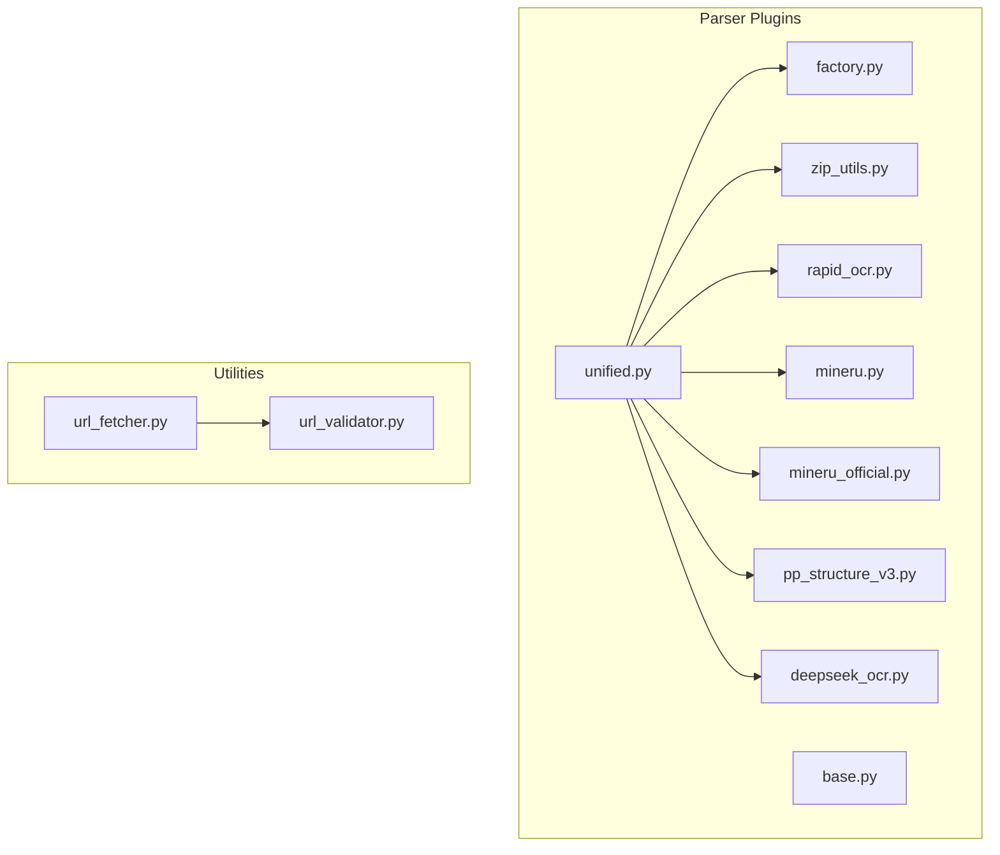
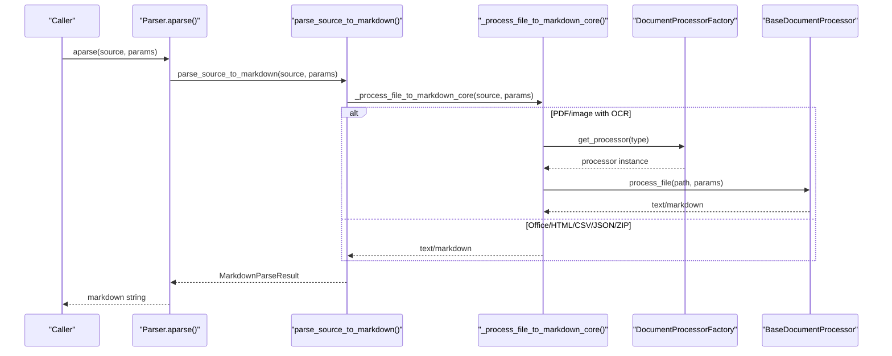
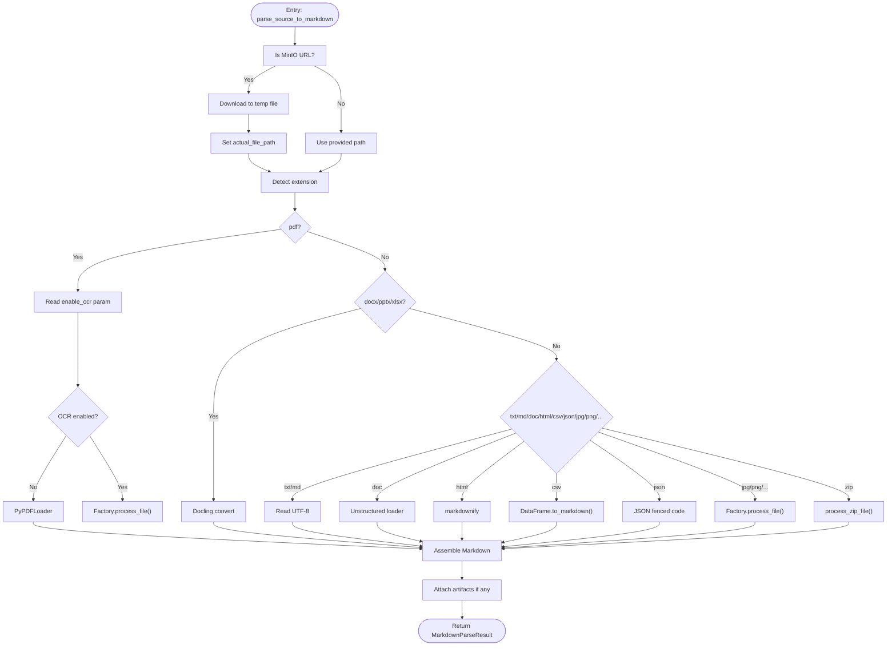
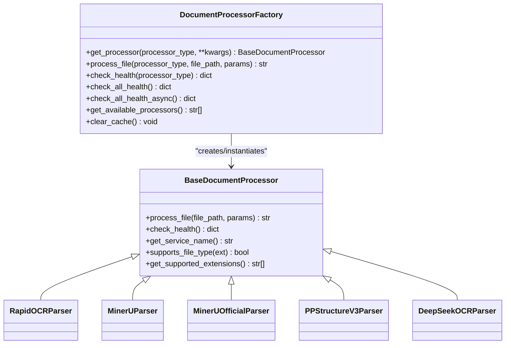
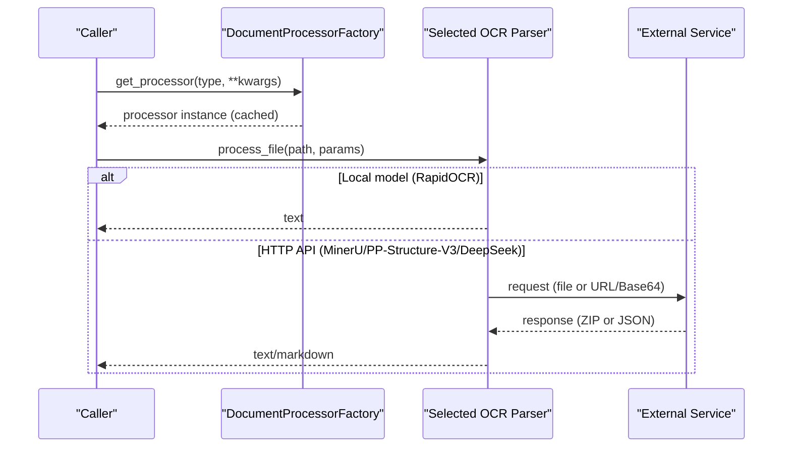
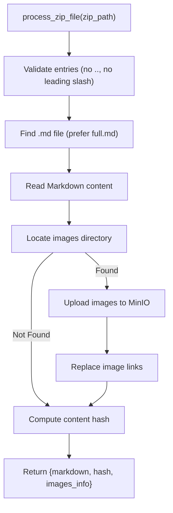
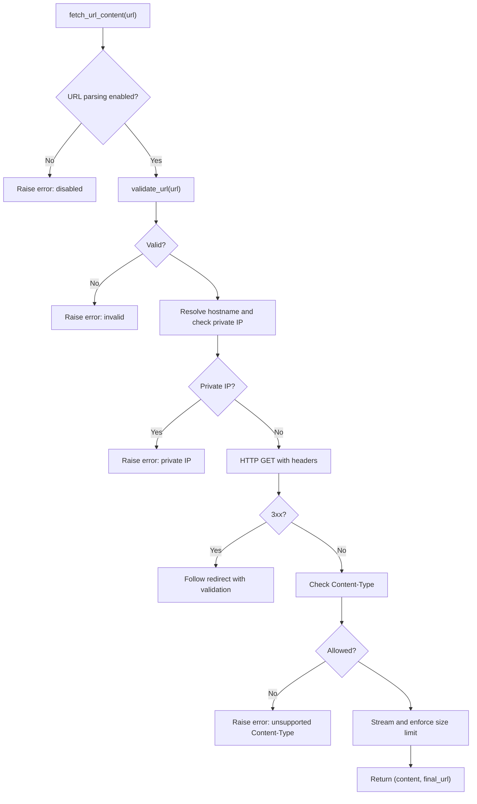
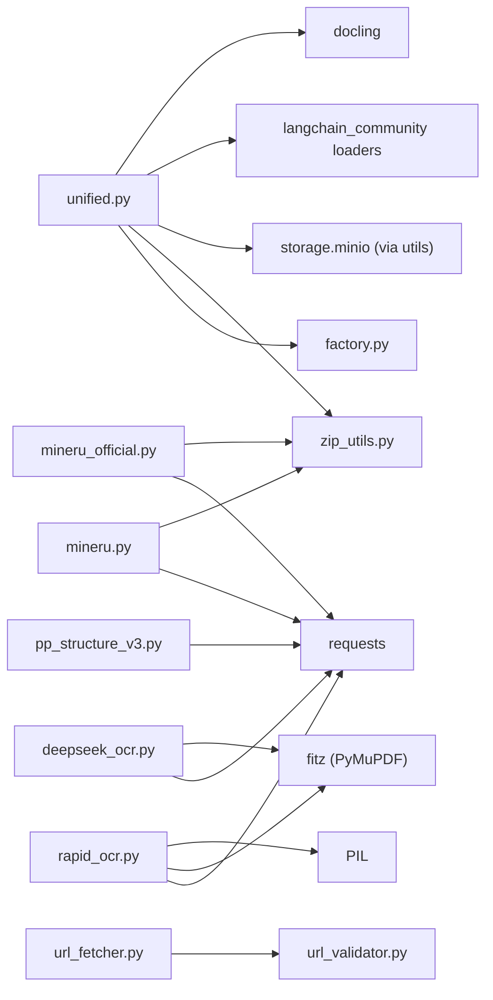

# Document Processing Pipeline

<cite>
**Referenced Files in This Document**
- [unified.py](file://backend/package/yuxi/plugins/parser/unified.py)
- [factory.py](file://backend/package/yuxi/plugins/parser/factory.py)
- [base.py](file://backend/package/yuxi/plugins/parser/base.py)
- [__init__.py](file://backend/package/yuxi/plugins/parser/__init__.py)
- [rapid_ocr.py](file://backend/package/yuxi/plugins/parser/rapid_ocr.py)
- [mineru.py](file://backend/package/yuxi/plugins/parser/mineru.py)
- [mineru_official.py](file://backend/package/yuxi/plugins/parser/mineru_official.py)
- [pp_structure_v3.py](file://backend/package/yuxi/plugins/parser/pp_structure_v3.py)
- [deepseek_ocr.py](file://backend/package/yuxi/plugins/parser/deepseek_ocr.py)
- [zip_utils.py](file://backend/package/yuxi/plugins/parser/zip_utils.py)
- [url_fetcher.py](file://backend/package/yuxi/knowledge/utils/url_fetcher.py)
- [url_validator.py](file://backend/package/yuxi/knowledge/utils/url_validator.py)
</cite>

## Table of Contents
1. [Introduction](#introduction)
2. [Project Structure](#project-structure)
3. [Core Components](#core-components)
4. [Architecture Overview](#architecture-overview)
5. [Detailed Component Analysis](#detailed-component-analysis)
6. [Dependency Analysis](#dependency-analysis)
7. [Performance Considerations](#performance-considerations)
8. [Troubleshooting Guide](#troubleshooting-guide)
9. [Conclusion](#conclusion)
10. [Appendices](#appendices)

## Introduction
This document describes the end-to-end document processing pipeline that ingests files and URLs, parses them into structured content, and converts them into Markdown. It covers:
- The ingestion workflow from upload through parsing to Markdown conversion
- The unified parser architecture supporting multiple formats (PDF, Word, Markdown, images, spreadsheets, presentations, HTML, CSV, JSON, ZIP)
- The factory pattern and plugin system enabling extensible document processing
- URL fetching and validation mechanisms for web-based content
- Error handling, content sanitization, and metadata extraction
- Examples of supported formats, custom parser development, and performance optimization techniques for large documents

## Project Structure
The document processing pipeline is primarily implemented under the parser plugin subsystem and integrated with utilities for ZIP handling, MinIO storage, and URL fetching/validation.

**Diagram sources**
- [unified.py:1-445](file://backend/package/yuxi/plugins/parser/unified.py#L1-L445)
- [factory.py:1-148](file://backend/package/yuxi/plugins/parser/factory.py#L1-L148)
- [base.py:1-100](file://backend/package/yuxi/plugins/parser/base.py#L1-L100)
- [rapid_ocr.py:1-254](file://backend/package/yuxi/plugins/parser/rapid_ocr.py#L1-L254)
- [mineru.py:1-240](file://backend/package/yuxi/plugins/parser/mineru.py#L1-L240)
- [mineru_official.py:1-366](file://backend/package/yuxi/plugins/parser/mineru_official.py#L1-L366)
- [pp_structure_v3.py:1-275](file://backend/package/yuxi/plugins/parser/pp_structure_v3.py#L1-L275)
- [deepseek_ocr.py:1-182](file://backend/package/yuxi/plugins/parser/deepseek_ocr.py#L1-L182)
- [zip_utils.py:1-211](file://backend/package/yuxi/plugins/parser/zip_utils.py#L1-L211)
- [url_fetcher.py:1-143](file://backend/package/yuxi/knowledge/utils/url_fetcher.py#L1-L143)
- [url_validator.py:1-88](file://backend/package/yuxi/knowledge/utils/url_validator.py#L1-L88)

**Section sources**
- [unified.py:1-445](file://backend/package/yuxi/plugins/parser/unified.py#L1-L445)
- [factory.py:1-148](file://backend/package/yuxi/plugins/parser/factory.py#L1-L148)
- [base.py:1-100](file://backend/package/yuxi/plugins/parser/base.py#L1-L100)
- [zip_utils.py:1-211](file://backend/package/yuxi/plugins/parser/zip_utils.py#L1-L211)
- [url_fetcher.py:1-143](file://backend/package/yuxi/knowledge/utils/url_fetcher.py#L1-L143)
- [url_validator.py:1-88](file://backend/package/yuxi/knowledge/utils/url_validator.py#L1-L88)

## Core Components
- Unified parser facade: Orchestrates format-specific parsing and Markdown conversion, handles MinIO downloads, ZIP extraction, and image uploads.
- Factory and base: Defines the processor interface and a factory that instantiates OCR/document processors with caching and health checks.
- Plugin processors: Implement OCR and document understanding for PDFs, images, and office formats via local models or external APIs.
- ZIP utilities: Extract Markdown and images from ZIP archives returned by external services, upload images to MinIO, and normalize links.
- URL utilities: Securely fetch and validate web content with size limits, content-type restrictions, and private IP blocking.

**Section sources**
- [unified.py:417-445](file://backend/package/yuxi/plugins/parser/unified.py#L417-L445)
- [factory.py:18-148](file://backend/package/yuxi/plugins/parser/factory.py#L18-L148)
- [base.py:44-100](file://backend/package/yuxi/plugins/parser/base.py#L44-L100)
- [zip_utils.py:21-112](file://backend/package/yuxi/plugins/parser/zip_utils.py#L21-L112)
- [url_fetcher.py:37-143](file://backend/package/yuxi/knowledge/utils/url_fetcher.py#L37-L143)

## Architecture Overview
The pipeline follows a layered design:
- Entry point: A synchronous or asynchronous parser facade that routes to format-specific handlers.
- Format dispatch: Based on file extension, the unified parser selects the appropriate handler (PDF, DOCX/PPTX/XLSX via Docling, images via OCR, HTML/CSV/JSON/ZIP via dedicated logic).
- OCR and external services: For PDFs/images, the factory selects an OCR processor (RapidOCR, MinerU, PP-Structure-V3, DeepSeek-OCR) depending on configuration.
- Storage and artifacts: Images extracted during Docling or OCR flows are uploaded to MinIO; ZIP archives are processed to extract Markdown and images.
- Output: The final Markdown string and optional artifacts are returned.

**Diagram sources**
- [unified.py:417-445](file://backend/package/yuxi/plugins/parser/unified.py#L417-L445)
- [unified.py:270-414](file://backend/package/yuxi/plugins/parser/unified.py#L270-L414)
- [factory.py:46-94](file://backend/package/yuxi/plugins/parser/factory.py#L46-L94)
- [base.py:44-83](file://backend/package/yuxi/plugins/parser/base.py#L44-L83)

## Detailed Component Analysis

### Unified Parser Facade and Dispatcher
Responsibilities:
- Determine file type and route to the correct handler
- Handle MinIO URLs by downloading to a temporary file
- Convert various formats to Markdown
- Manage artifacts (e.g., ZIP metadata, image info)
- Provide synchronous and asynchronous entry points

Key behaviors:
- Supported extensions include text, Markdown, Word, HTML, Excel, PowerPoint, PDF, images, CSV, JSON, and ZIP.
- PDF handling supports disabling OCR or delegating to OCR processors via the factory.
- Image handling requires OCR; otherwise raises a validation error.
- Office formats (DOCX/PPTX/XLSX) are converted using Docling with a fallback to python-docx for DOC.
- ZIP archives are extracted asynchronously; images are uploaded to MinIO and Markdown links are normalized.

**Diagram sources**
- [unified.py:417-445](file://backend/package/yuxi/plugins/parser/unified.py#L417-L445)
- [unified.py:270-414](file://backend/package/yuxi/plugins/parser/unified.py#L270-L414)
- [zip_utils.py:21-76](file://backend/package/yuxi/plugins/parser/zip_utils.py#L21-L76)

**Section sources**
- [unified.py:25-44](file://backend/package/yuxi/plugins/parser/unified.py#L25-L44)
- [unified.py:417-445](file://backend/package/yuxi/plugins/parser/unified.py#L417-L445)
- [unified.py:270-414](file://backend/package/yuxi/plugins/parser/unified.py#L270-L414)

### Factory Pattern and Plugin System
Responsibilities:
- Provide a single interface to instantiate OCR/document processors
- Cache instances to avoid repeated initialization
- Expose health checks for all processors
- Offer convenience methods for processing files and checking health

Implementation highlights:
- Processor types mapped to module and class names
- Cache keyed by processor type plus parameter representation
- Health checks return structured status with details
- Async health checks leverage threads to keep the event loop responsive

**Diagram sources**
- [base.py:44-100](file://backend/package/yuxi/plugins/parser/base.py#L44-L100)
- [factory.py:18-148](file://backend/package/yuxi/plugins/parser/factory.py#L18-L148)
- [rapid_ocr.py:21-254](file://backend/package/yuxi/plugins/parser/rapid_ocr.py#L21-L254)
- [mineru.py:19-240](file://backend/package/yuxi/plugins/parser/mineru.py#L19-L240)
- [mineru_official.py:21-366](file://backend/package/yuxi/plugins/parser/mineru_official.py#L21-L366)
- [pp_structure_v3.py:19-275](file://backend/package/yuxi/plugins/parser/pp_structure_v3.py#L19-L275)
- [deepseek_ocr.py:21-182](file://backend/package/yuxi/plugins/parser/deepseek_ocr.py#L21-L182)

**Section sources**
- [factory.py:18-148](file://backend/package/yuxi/plugins/parser/factory.py#L18-L148)
- [base.py:44-100](file://backend/package/yuxi/plugins/parser/base.py#L44-L100)

### OCR and Document Understanding Plugins
- RapidOCRParser: Local ONNXRuntime-based OCR for PDFs and images; streams PDF pages to minimize memory usage; supports configurable detection threshold.
- MinerUParser: HTTP API-based document understanding with ZIP-returning responses; supports multiple backends and languages; returns Markdown via ZIP processing.
- MinerUOfficialParser: Cloud API with batch upload flow; polls for results; extracts Markdown from ZIP or falls back to first available text.
- PPStructureV3Parser: Layout parsing API for PDFs and images; returns per-page Markdown; aggregates statistics.
- DeepSeekOCRParser: Uses SiliconFlow API with DeepSeek-OCR model; converts PDF pages to images and sends to API; cleans special tags from output.

**Diagram sources**
- [factory.py:46-94](file://backend/package/yuxi/plugins/parser/factory.py#L46-L94)
- [rapid_ocr.py:178-253](file://backend/package/yuxi/plugins/parser/rapid_ocr.py#L178-L253)
- [mineru.py:93-239](file://backend/package/yuxi/plugins/parser/mineru.py#L93-L239)
- [mineru_official.py:96-198](file://backend/package/yuxi/plugins/parser/mineru_official.py#L96-L198)
- [pp_structure_v3.py:196-274](file://backend/package/yuxi/plugins/parser/pp_structure_v3.py#L196-L274)
- [deepseek_ocr.py:80-114](file://backend/package/yuxi/plugins/parser/deepseek_ocr.py#L80-L114)

**Section sources**
- [rapid_ocr.py:21-254](file://backend/package/yuxi/plugins/parser/rapid_ocr.py#L21-L254)
- [mineru.py:19-240](file://backend/package/yuxi/plugins/parser/mineru.py#L19-L240)
- [mineru_official.py:21-366](file://backend/package/yuxi/plugins/parser/mineru_official.py#L21-L366)
- [pp_structure_v3.py:19-275](file://backend/package/yuxi/plugins/parser/pp_structure_v3.py#L19-L275)
- [deepseek_ocr.py:21-182](file://backend/package/yuxi/plugins/parser/deepseek_ocr.py#L21-L182)

### ZIP Handling and Image Upload
- Extract Markdown from ZIP archives; locate images directory; upload images to MinIO; replace image links in Markdown with MinIO URLs.
- Compute content hash for deduplication or change detection.
- Provide both async and sync entry points for ZIP processing.

**Diagram sources**
- [zip_utils.py:21-76](file://backend/package/yuxi/plugins/parser/zip_utils.py#L21-L76)
- [zip_utils.py:132-179](file://backend/package/yuxi/plugins/parser/zip_utils.py#L132-L179)
- [zip_utils.py:182-211](file://backend/package/yuxi/plugins/parser/zip_utils.py#L182-L211)

**Section sources**
- [zip_utils.py:21-112](file://backend/package/yuxi/plugins/parser/zip_utils.py#L21-L112)

### URL Fetching and Validation
- URL parsing is controlled by a whitelist environment variable; domains can use wildcards.
- Fetching enforces size limits, allowed content types, and blocks private IPs.
- Redirects are followed with validation at each hop.

**Diagram sources**
- [url_fetcher.py:37-143](file://backend/package/yuxi/knowledge/utils/url_fetcher.py#L37-L143)
- [url_validator.py:19-71](file://backend/package/yuxi/knowledge/utils/url_validator.py#L19-L71)

**Section sources**
- [url_fetcher.py:1-143](file://backend/package/yuxi/knowledge/utils/url_fetcher.py#L1-L143)
- [url_validator.py:1-88](file://backend/package/yuxi/knowledge/utils/url_validator.py#L1-L88)

## Dependency Analysis
- Unified parser depends on:
  - Factory for processor instantiation
  - ZIP utilities for archive handling
  - MinIO client for image storage
  - LangChain loaders for PDF/DOC and Docling for office formats
- OCR plugins depend on:
  - External services or local models
  - Requests for HTTP communication
  - PyMuPDF/Pillow for PDF/image processing
- URL utilities depend on:
  - httpx for async fetching
  - validators from environment variables

**Diagram sources**
- [unified.py:1-445](file://backend/package/yuxi/plugins/parser/unified.py#L1-L445)
- [factory.py:1-148](file://backend/package/yuxi/plugins/parser/factory.py#L1-L148)
- [zip_utils.py:1-211](file://backend/package/yuxi/plugins/parser/zip_utils.py#L1-L211)
- [rapid_ocr.py:1-254](file://backend/package/yuxi/plugins/parser/rapid_ocr.py#L1-L254)
- [mineru.py:1-240](file://backend/package/yuxi/plugins/parser/mineru.py#L1-L240)
- [mineru_official.py:1-366](file://backend/package/yuxi/plugins/parser/mineru_official.py#L1-L366)
- [pp_structure_v3.py:1-275](file://backend/package/yuxi/plugins/parser/pp_structure_v3.py#L1-L275)
- [deepseek_ocr.py:1-182](file://backend/package/yuxi/plugins/parser/deepseek_ocr.py#L1-L182)
- [url_fetcher.py:1-143](file://backend/package/yuxi/knowledge/utils/url_fetcher.py#L1-L143)
- [url_validator.py:1-88](file://backend/package/yuxi/knowledge/utils/url_validator.py#L1-L88)

**Section sources**
- [unified.py:1-445](file://backend/package/yuxi/plugins/parser/unified.py#L1-L445)
- [factory.py:1-148](file://backend/package/yuxi/plugins/parser/factory.py#L1-L148)
- [zip_utils.py:1-211](file://backend/package/yuxi/plugins/parser/zip_utils.py#L1-L211)
- [url_fetcher.py:1-143](file://backend/package/yuxi/knowledge/utils/url_fetcher.py#L1-L143)
- [url_validator.py:1-88](file://backend/package/yuxi/knowledge/utils/url_validator.py#L1-L88)

## Performance Considerations
- Streaming and chunking:
  - PDF OCR streams pages via PyMuPDF to avoid loading entire PDF into memory.
  - ZIP processing reads files lazily and uploads images concurrently.
- Caching:
  - Factory caches processor instances keyed by type and parameters to reduce initialization overhead.
- Async I/O:
  - MinIO uploads and ZIP processing are async-aware; URL fetching uses streaming.
- Image optimization:
  - Images are uploaded with timestamps and normalized prefixes; Markdown image links are replaced after upload.
- Health checks:
  - Factory exposes health checks for all processors; async variant uses threads to keep the event loop responsive.

[No sources needed since this section provides general guidance]

## Troubleshooting Guide
Common issues and resolutions:
- Unsupported file type:
  - Ensure the extension is in the supported list; otherwise, the unified parser raises an error.
- OCR failures:
  - RapidOCR: Verify model paths and thresholds; check health status.
  - MinerU/PP-Structure-V3/DeepSeek: Confirm service availability, credentials, and timeouts; review logs for HTTP errors.
- ZIP extraction errors:
  - Ensure ZIP contains a .md file; verify images directory exists and is accessible; check for unsafe paths.
- URL parsing disabled:
  - Configure the whitelist environment variable; validate domain patterns and wildcard usage.
- Private IP or redirect issues:
  - Private IP access is blocked; redirects are validated at each hop; adjust whitelist or disable parsing.

**Section sources**
- [unified.py:394-404](file://backend/package/yuxi/plugins/parser/unified.py#L394-L404)
- [rapid_ocr.py:44-91](file://backend/package/yuxi/plugins/parser/rapid_ocr.py#L44-L91)
- [mineru.py:33-91](file://backend/package/yuxi/plugins/parser/mineru.py#L33-L91)
- [mineru_official.py:42-94](file://backend/package/yuxi/plugins/parser/mineru_official.py#L42-L94)
- [pp_structure_v3.py:159-194](file://backend/package/yuxi/plugins/parser/pp_structure_v3.py#L159-L194)
- [deepseek_ocr.py:56-78](file://backend/package/yuxi/plugins/parser/deepseek_ocr.py#L56-L78)
- [zip_utils.py:41-50](file://backend/package/yuxi/plugins/parser/zip_utils.py#L41-L50)
- [url_validator.py:74-87](file://backend/package/yuxi/knowledge/utils/url_validator.py#L74-L87)
- [url_fetcher.py:61-62](file://backend/package/yuxi/knowledge/utils/url_fetcher.py#L61-L62)

## Conclusion
The document processing pipeline integrates a unified parser facade with a flexible factory and plugin system to support diverse file formats and OCR/document understanding services. It emphasizes robustness through health checks, secure URL handling, artifact extraction, and efficient processing strategies for large documents.

[No sources needed since this section summarizes without analyzing specific files]

## Appendices

### Supported File Formats
- Text and markup: txt, md
- Office: docx, pptx, xlsx, doc
- PDF: pdf
- Images: jpg, jpeg, png, bmp, tiff, tif
- Web: html, htm
- Data: csv, json
- Archives: zip

**Section sources**
- [unified.py:25-44](file://backend/package/yuxi/plugins/parser/unified.py#L25-L44)

### Custom Parser Development
Steps to add a new OCR/document parser:
1. Define a class inheriting from the base processor interface and implement required methods.
2. Register the processor type in the factory mapping with module and class names.
3. Optionally expose health checks and parameter handling.
4. Integrate into the unified parser if needed for automatic routing.

References:
- Base interface and exceptions: [base.py:44-100](file://backend/package/yuxi/plugins/parser/base.py#L44-L100)
- Factory registration and caching: [factory.py:18-76](file://backend/package/yuxi/plugins/parser/factory.py#L18-L76)
- Example implementations: [rapid_ocr.py:21-254](file://backend/package/yuxi/plugins/parser/rapid_ocr.py#L21-L254), [pp_structure_v3.py:19-275](file://backend/package/yuxi/plugins/parser/pp_structure_v3.py#L19-L275)

**Section sources**
- [base.py:44-100](file://backend/package/yuxi/plugins/parser/base.py#L44-L100)
- [factory.py:18-76](file://backend/package/yuxi/plugins/parser/factory.py#L18-L76)
- [rapid_ocr.py:21-254](file://backend/package/yuxi/plugins/parser/rapid_ocr.py#L21-L254)
- [pp_structure_v3.py:19-275](file://backend/package/yuxi/plugins/parser/pp_structure_v3.py#L19-L275)