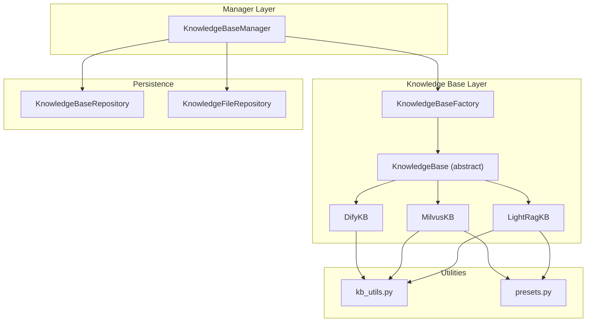
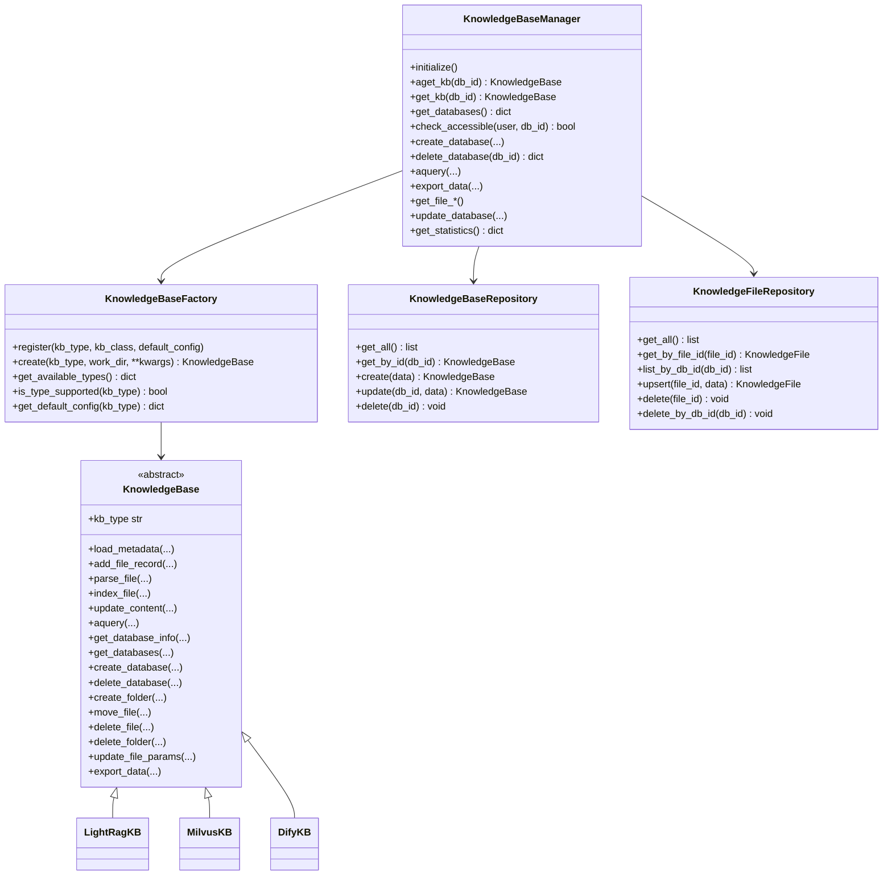
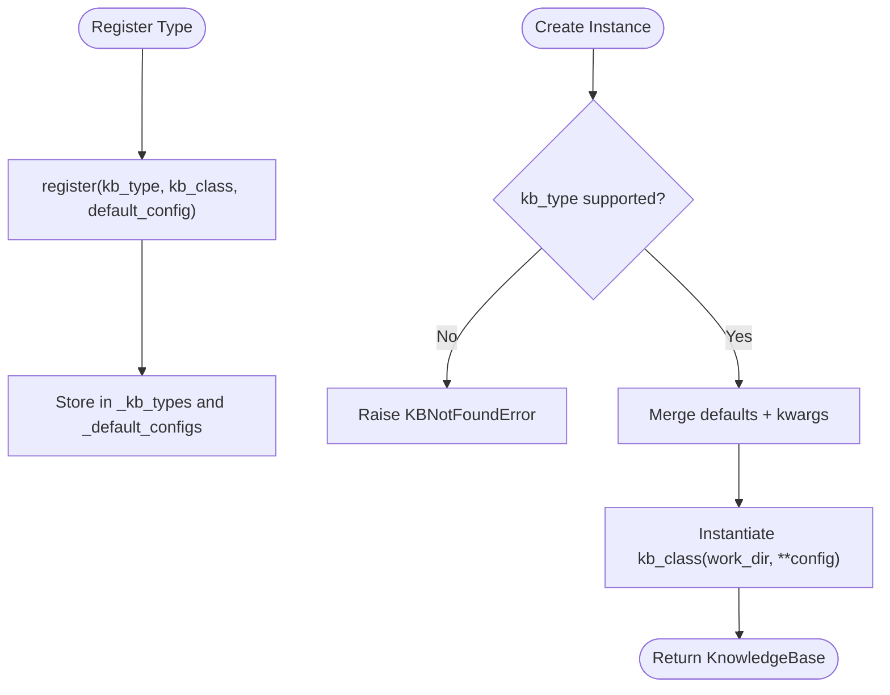
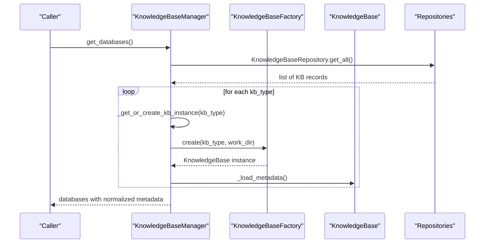
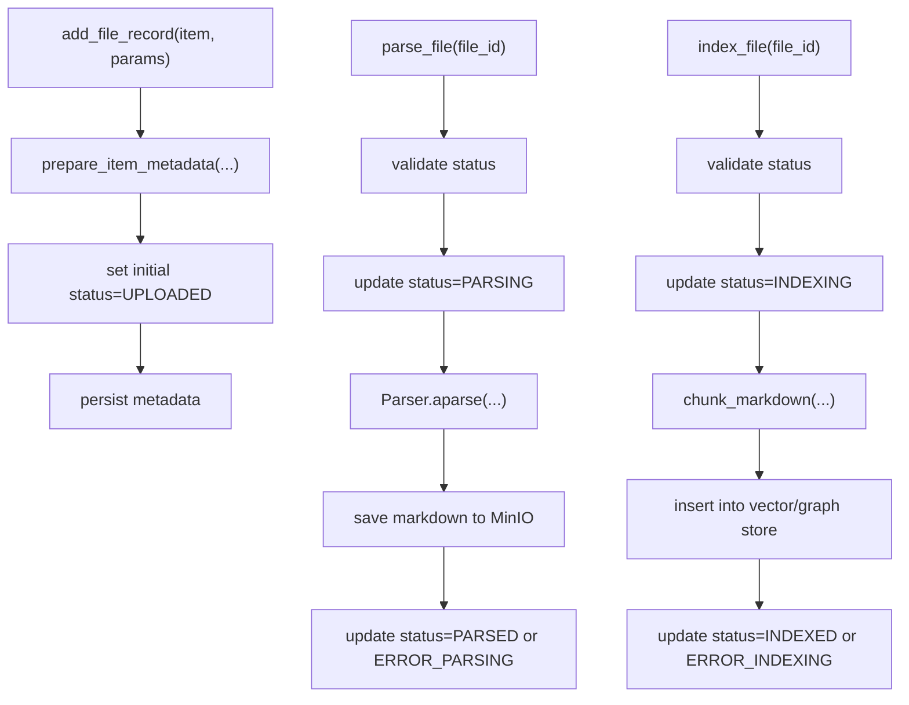
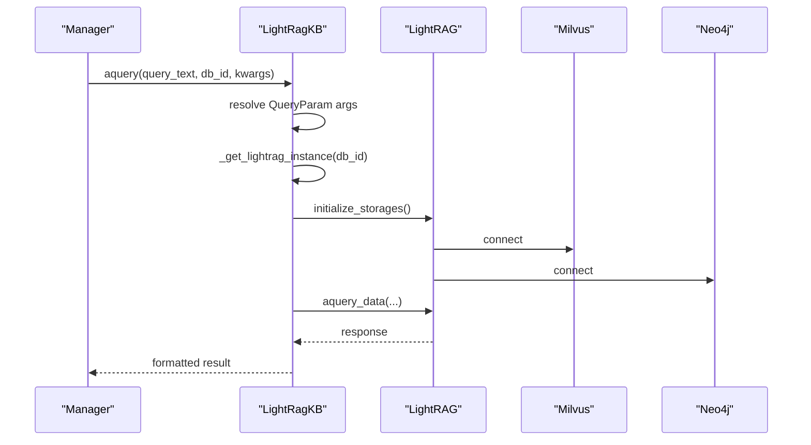
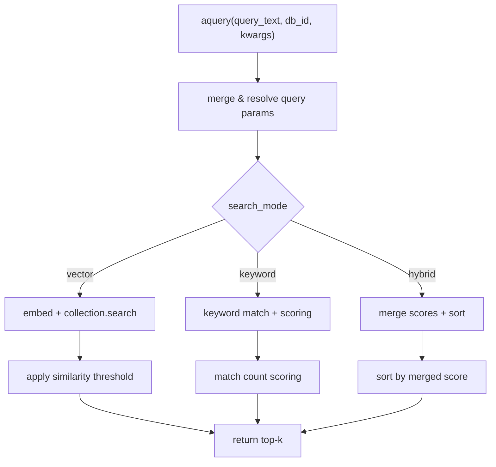
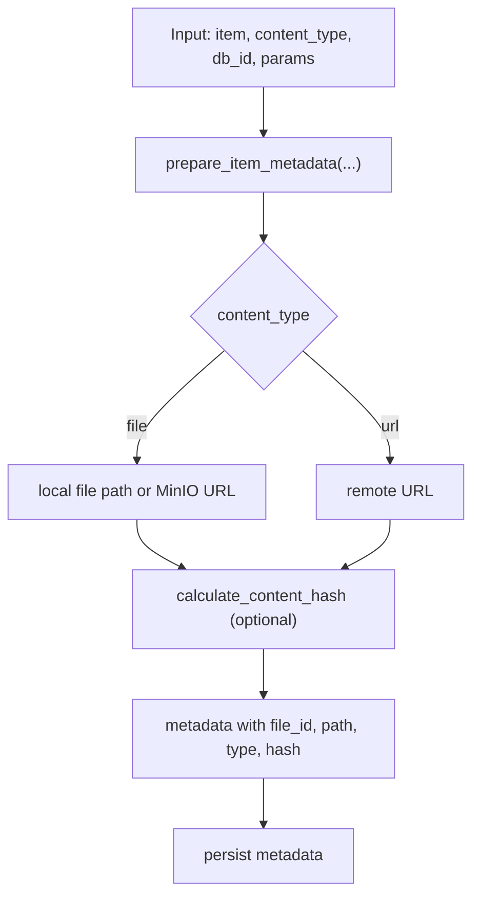
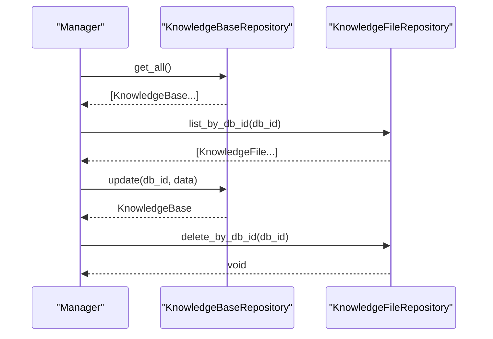
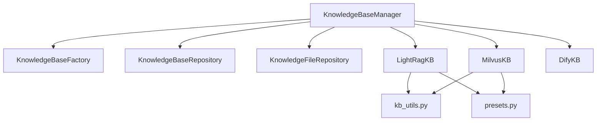

# Knowledge Base Operations

<cite>
**Referenced Files in This Document**
- [factory.py](file://backend/package/yuxi/knowledge/factory.py)
- [manager.py](file://backend/package/yuxi/knowledge/manager.py)
- [base.py](file://backend/package/yuxi/knowledge/base.py)
- [lightrag.py](file://backend/package/yuxi/knowledge/implementations/lightrag.py)
- [milvus.py](file://backend/package/yuxi/knowledge/implementations/milvus.py)
- [dify.py](file://backend/package/yuxi/knowledge/implementations/dify.py)
- [knowledge_base_repository.py](file://backend/package/yuxi/repositories/knowledge_base_repository.py)
- [knowledge_file_repository.py](file://backend/package/yuxi/repositories/knowledge_file_repository.py)
- [kb_utils.py](file://backend/package/yuxi/knowledge/utils/kb_utils.py)
- [presets.py](file://backend/package/yuxi/knowledge/chunking/ragflow_like/presets.py)
</cite>

## Table of Contents
1. [Introduction](#introduction)
2. [Project Structure](#project-structure)
3. [Core Components](#core-components)
4. [Architecture Overview](#architecture-overview)
5. [Detailed Component Analysis](#detailed-component-analysis)
6. [Dependency Analysis](#dependency-analysis)
7. [Performance Considerations](#performance-considerations)
8. [Troubleshooting Guide](#troubleshooting-guide)
9. [Conclusion](#conclusion)
10. [Appendices](#appendices)

## Introduction
This document explains the knowledge base operations and management subsystem. It covers the factory pattern for creating and managing different knowledge base implementations, the manager’s responsibilities for lifecycle, metadata, and resource allocation, file system and MinIO operations for uploads and storage, repository patterns for persistence, database operations, file metadata management, and batch processing capabilities. It also includes configuration examples, custom implementation guidance, and production best practices.

## Project Structure
The knowledge base system is organized around:
- A factory for registering and instantiating knowledge base implementations
- An abstract base class defining the uniform interface
- Concrete implementations (LightRAG, Milvus, Dify)
- A manager coordinating instances, permissions, and metadata
- Repositories for PostgreSQL-backed persistence
- Utilities for chunking, hashing, and MinIO operations

**Diagram sources**
- [factory.py:1-108](file://backend/package/yuxi/knowledge/factory.py#L1-L108)
- [base.py:46-120](file://backend/package/yuxi/knowledge/base.py#L46-L120)
- [lightrag.py:23-47](file://backend/package/yuxi/knowledge/implementations/lightrag.py#L23-L47)
- [milvus.py:24-68](file://backend/package/yuxi/knowledge/implementations/milvus.py#L24-L68)
- [dify.py:10-19](file://backend/package/yuxi/knowledge/implementations/dify.py#L10-L19)
- [manager.py:15-42](file://backend/package/yuxi/knowledge/manager.py#L15-L42)
- [knowledge_base_repository.py:11-44](file://backend/package/yuxi/repositories/knowledge_base_repository.py#L11-L44)
- [knowledge_file_repository.py:11-52](file://backend/package/yuxi/repositories/knowledge_file_repository.py#L11-L52)
- [kb_utils.py:162-190](file://backend/package/yuxi/knowledge/utils/kb_utils.py#L162-L190)
- [presets.py:150-213](file://backend/package/yuxi/knowledge/chunking/ragflow_like/presets.py#L150-L213)

**Section sources**
- [factory.py:1-108](file://backend/package/yuxi/knowledge/factory.py#L1-L108)
- [manager.py:15-82](file://backend/package/yuxi/knowledge/manager.py#L15-L82)
- [base.py:46-120](file://backend/package/yuxi/knowledge/base.py#L46-L120)

## Core Components
- KnowledgeBaseFactory: Registers implementations and creates instances with merged configurations.
- KnowledgeBase (abstract): Defines the unified interface for all KB types, including metadata loading, file lifecycle, parsing, indexing, querying, and cleanup.
- Implementations:
  - LightRagKB: Integrates LightRAG with Milvus and Neo4j, supports graph and vector retrieval.
  - MilvusKB: Production-grade vector storage with configurable chunking and reranking.
  - DifyKB: Read-only retrieval via external Dify Dataset API.
- KnowledgeBaseManager: Orchestrates lifecycle, permission checks, metadata synchronization, and cross-type operations.
- Repositories: KnowledgeBaseRepository and KnowledgeFileRepository persist and retrieve metadata to/from PostgreSQL.
- Utilities: kb_utils.py handles path validation, hashing, metadata preparation, and MinIO operations; presets.py resolves chunking parameters.

**Section sources**
- [factory.py:14-108](file://backend/package/yuxi/knowledge/factory.py#L14-L108)
- [base.py:46-120](file://backend/package/yuxi/knowledge/base.py#L46-L120)
- [lightrag.py:23-47](file://backend/package/yuxi/knowledge/implementations/lightrag.py#L23-L47)
- [milvus.py:24-68](file://backend/package/yuxi/knowledge/implementations/milvus.py#L24-L68)
- [dify.py:10-19](file://backend/package/yuxi/knowledge/implementations/dify.py#L10-L19)
- [manager.py:15-82](file://backend/package/yuxi/knowledge/manager.py#L15-L82)
- [knowledge_base_repository.py:11-44](file://backend/package/yuxi/repositories/knowledge_base_repository.py#L11-L44)
- [knowledge_file_repository.py:11-52](file://backend/package/yuxi/repositories/knowledge_file_repository.py#L11-L52)
- [kb_utils.py:162-190](file://backend/package/yuxi/knowledge/utils/kb_utils.py#L162-L190)
- [presets.py:150-213](file://backend/package/yuxi/knowledge/chunking/ragflow_like/presets.py#L150-L213)

## Architecture Overview
The system follows a layered architecture:
- Factory layer: creation and registration
- Implementation layer: concrete KB engines
- Manager layer: orchestration, permissions, and metadata
- Persistence layer: repositories backed by PostgreSQL
- Utility layer: chunking, hashing, and storage helpers

**Diagram sources**
- [factory.py:14-108](file://backend/package/yuxi/knowledge/factory.py#L14-L108)
- [base.py:46-746](file://backend/package/yuxi/knowledge/base.py#L46-L746)
- [lightrag.py:23-779](file://backend/package/yuxi/knowledge/implementations/lightrag.py#L23-L779)
- [milvus.py:24-897](file://backend/package/yuxi/knowledge/implementations/milvus.py#L24-L897)
- [dify.py:10-221](file://backend/package/yuxi/knowledge/implementations/dify.py#L10-L221)
- [manager.py:15-703](file://backend/package/yuxi/knowledge/manager.py#L15-L703)
- [knowledge_base_repository.py:11-44](file://backend/package/yuxi/repositories/knowledge_base_repository.py#L11-L44)
- [knowledge_file_repository.py:11-52](file://backend/package/yuxi/repositories/knowledge_file_repository.py#L11-L52)

## Detailed Component Analysis

### Knowledge Base Factory Pattern
- Registration: Register implementations with a type identifier, class, and optional default configuration.
- Creation: Resolve defaults and user-provided kwargs, instantiate the appropriate KB class, and return a configured instance.
- Discovery: Enumerate supported types and their default configs.

**Diagram sources**
- [factory.py:14-64](file://backend/package/yuxi/knowledge/factory.py#L14-L64)

**Section sources**
- [factory.py:14-108](file://backend/package/yuxi/knowledge/factory.py#L14-L108)

### Knowledge Base Manager Responsibilities
- Lifecycle management: Initialize existing KBs, cache instances per type, and lazily load metadata.
- Permissions: Enforce access control based on user roles and shared configuration.
- Metadata handling: Synchronize database and file metadata, normalize timestamps, and maintain consistency.
- Resource allocation: Coordinate locks for write operations and instance initialization.
- Cross-cutting operations: Provide unified APIs for CRUD, querying, file operations, and statistics.

**Diagram sources**
- [manager.py:48-82](file://backend/package/yuxi/knowledge/manager.py#L48-L82)
- [manager.py:321-404](file://backend/package/yuxi/knowledge/manager.py#L321-L404)
- [knowledge_base_repository.py:11-20](file://backend/package/yuxi/repositories/knowledge_base_repository.py#L11-L20)

**Section sources**
- [manager.py:15-82](file://backend/package/yuxi/knowledge/manager.py#L15-L82)
- [manager.py:321-404](file://backend/package/yuxi/knowledge/manager.py#L321-L404)
- [knowledge_base_repository.py:11-44](file://backend/package/yuxi/repositories/knowledge_base_repository.py#L11-L44)

### Abstract KnowledgeBase Interface
- Metadata lifecycle: load_metadata filters and normalizes global metadata into per-type databases, files, and benchmarks.
- File operations: add_file_record, parse_file, index_file, update_content, delete_file, move_file, create_folder, delete_folder.
- Querying: aquery with parameter resolution and normalization.
- Persistence: _persist_file and _persist_kb helpers invoked by implementations.
- Status management: processing queue and status normalization.

**Diagram sources**
- [base.py:192-353](file://backend/package/yuxi/knowledge/base.py#L192-L353)
- [base.py:388-401](file://backend/package/yuxi/knowledge/base.py#L388-L401)
- [base.py:522-555](file://backend/package/yuxi/knowledge/base.py#L522-L555)
- [base.py:558-600](file://backend/package/yuxi/knowledge/base.py#L558-L600)

**Section sources**
- [base.py:46-120](file://backend/package/yuxi/knowledge/base.py#L46-L120)
- [base.py:192-353](file://backend/package/yuxi/knowledge/base.py#L192-L353)
- [base.py:388-401](file://backend/package/yuxi/knowledge/base.py#L388-L401)
- [base.py:522-555](file://backend/package/yuxi/knowledge/base.py#L522-L555)
- [base.py:558-600](file://backend/package/yuxi/knowledge/base.py#L558-L600)

### LightRagKB Implementation
- Storage integration: Milvus and Neo4j via LightRAG; supports graph and vector retrieval modes.
- Locking: Per-database write locks and instance locks to prevent concurrent mutations.
- Querying: Resolves QueryParam-compatible arguments and supports scoped retrieval (chunks, graph, all).
- Export: Currently disabled due to upstream compatibility issues.

**Diagram sources**
- [lightrag.py:526-601](file://backend/package/yuxi/knowledge/implementations/lightrag.py#L526-L601)
- [lightrag.py:195-224](file://backend/package/yuxi/knowledge/implementations/lightrag.py#L195-L224)
- [lightrag.py:136-181](file://backend/package/yuxi/knowledge/implementations/lightrag.py#L136-L181)

**Section sources**
- [lightrag.py:23-47](file://backend/package/yuxi/knowledge/implementations/lightrag.py#L23-L47)
- [lightrag.py:526-601](file://backend/package/yuxi/knowledge/implementations/lightrag.py#L526-L601)
- [lightrag.py:195-224](file://backend/package/yuxi/knowledge/implementations/lightrag.py#L195-L224)
- [lightrag.py:136-181](file://backend/package/yuxi/knowledge/implementations/lightrag.py#L136-L181)

### MilvusKB Implementation
- Vector storage: Creates and manages collections per database with embedding dimension and index parameters.
- Querying: Supports vector, keyword, and hybrid modes with optional reranking and threshold filtering.
- Batch updates: Rechunks and re-embeds content atomically with per-file locks.

**Diagram sources**
- [milvus.py:471-676](file://backend/package/yuxi/knowledge/implementations/milvus.py#L471-L676)
- [milvus.py:227-359](file://backend/package/yuxi/knowledge/implementations/milvus.py#L227-L359)

**Section sources**
- [milvus.py:24-68](file://backend/package/yuxi/knowledge/implementations/milvus.py#L24-L68)
- [milvus.py:471-676](file://backend/package/yuxi/knowledge/implementations/milvus.py#L471-L676)
- [milvus.py:227-359](file://backend/package/yuxi/knowledge/implementations/milvus.py#L227-L359)

### DifyKB Implementation (Read-only)
- Retrieval-only: Exposes aquery against external Dify Dataset API with mode mapping and threshold support.
- No write operations: Raises errors for any mutating actions.

**Section sources**
- [dify.py:10-221](file://backend/package/yuxi/knowledge/implementations/dify.py#L10-L221)

### File System and MinIO Operations
- Path validation: validate_file_path prevents path traversal for local files; MinIO URLs bypass traversal checks.
- Hashing: calculate_content_hash computes SHA-256 for content deduplication.
- Metadata preparation: prepare_item_metadata builds standardized metadata for files, URLs, and MinIO objects.
- MinIO integration: _save_markdown_to_minio and _read_markdown_from_minio manage parsed content storage and retrieval.
- Chunking: split_text_into_chunks and chunk_markdown dispatch to presets for configurable splitting.

**Diagram sources**
- [kb_utils.py:192-328](file://backend/package/yuxi/knowledge/utils/kb_utils.py#L192-L328)
- [kb_utils.py:162-190](file://backend/package/yuxi/knowledge/utils/kb_utils.py#L162-L190)
- [kb_utils.py:105-159](file://backend/package/yuxi/knowledge/utils/kb_utils.py#L105-L159)
- [presets.py:150-213](file://backend/package/yuxi/knowledge/chunking/ragflow_like/presets.py#L150-L213)

**Section sources**
- [kb_utils.py:16-75](file://backend/package/yuxi/knowledge/utils/kb_utils.py#L16-L75)
- [kb_utils.py:162-190](file://backend/package/yuxi/knowledge/utils/kb_utils.py#L162-L190)
- [kb_utils.py:192-328](file://backend/package/yuxi/knowledge/utils/kb_utils.py#L192-L328)
- [kb_utils.py:105-159](file://backend/package/yuxi/knowledge/utils/kb_utils.py#L105-L159)
- [presets.py:150-213](file://backend/package/yuxi/knowledge/chunking/ragflow_like/presets.py#L150-L213)

### Repository Patterns for Persistence
- KnowledgeBaseRepository: CRUD for knowledge base records with async SQLAlchemy sessions.
- KnowledgeFileRepository: CRUD for file records, including bulk listing and deletion by db_id.

**Diagram sources**
- [knowledge_base_repository.py:11-44](file://backend/package/yuxi/repositories/knowledge_base_repository.py#L11-L44)
- [knowledge_file_repository.py:11-52](file://backend/package/yuxi/repositories/knowledge_file_repository.py#L11-L52)

**Section sources**
- [knowledge_base_repository.py:11-44](file://backend/package/yuxi/repositories/knowledge_base_repository.py#L11-L44)
- [knowledge_file_repository.py:11-52](file://backend/package/yuxi/repositories/knowledge_file_repository.py#L11-L52)

### Database Operations and Metadata Management
- Database creation: create_database generates deterministic db_id, persists metadata, and prepares working directories.
- Database deletion: delete_database removes MinIO artifacts, cleans collections/graphs, and deletes local metadata.
- File metadata: files_meta tracks per-file status, processing params, and content hashes; normalized timestamps for consistency.
- Chunk processing params: resolve_chunk_processing_params merges KB defaults, file params, and request overrides.

**Section sources**
- [base.py:403-456](file://backend/package/yuxi/knowledge/base.py#L403-L456)
- [base.py:458-520](file://backend/package/yuxi/knowledge/base.py#L458-L520)
- [base.py:162-166](file://backend/package/yuxi/knowledge/base.py#L162-L166)
- [presets.py:150-213](file://backend/package/yuxi/knowledge/chunking/ragflow_like/presets.py#L150-L213)

### Batch Processing Capabilities
- Batch indexing: update_content iterates file_ids, re-parses, re-chunks, and re-inserts into vector/graph stores.
- Concurrency control: per-db write locks and a processing queue ensure atomicity and prevent race conditions.
- Status propagation: statuses updated to reflect intermediate and terminal states.

**Section sources**
- [lightrag.py:422-524](file://backend/package/yuxi/knowledge/implementations/lightrag.py#L422-L524)
- [milvus.py:360-469](file://backend/package/yuxi/knowledge/implementations/milvus.py#L360-L469)
- [base.py:749-785](file://backend/package/yuxi/knowledge/base.py#L749-L785)

## Dependency Analysis
- Coupling: Manager depends on Factory and Repositories; implementations depend on base utilities and external storages.
- Cohesion: Each KB type encapsulates its storage specifics; base provides shared interfaces and utilities.
- External dependencies: LightRAG, Milvus, Neo4j, MinIO, PostgreSQL via SQLAlchemy.

**Diagram sources**
- [manager.py:15-82](file://backend/package/yuxi/knowledge/manager.py#L15-L82)
- [factory.py:14-108](file://backend/package/yuxi/knowledge/factory.py#L14-L108)
- [knowledge_base_repository.py:11-44](file://backend/package/yuxi/repositories/knowledge_base_repository.py#L11-L44)
- [knowledge_file_repository.py:11-52](file://backend/package/yuxi/repositories/knowledge_file_repository.py#L11-L52)
- [lightrag.py:23-47](file://backend/package/yuxi/knowledge/implementations/lightrag.py#L23-L47)
- [milvus.py:24-68](file://backend/package/yuxi/knowledge/implementations/milvus.py#L24-L68)
- [dify.py:10-19](file://backend/package/yuxi/knowledge/implementations/dify.py#L10-L19)
- [kb_utils.py:162-190](file://backend/package/yuxi/knowledge/utils/kb_utils.py#L162-L190)
- [presets.py:150-213](file://backend/package/yuxi/knowledge/chunking/ragflow_like/presets.py#L150-L213)

**Section sources**
- [manager.py:15-82](file://backend/package/yuxi/knowledge/manager.py#L15-L82)
- [factory.py:14-108](file://backend/package/yuxi/knowledge/factory.py#L14-L108)
- [knowledge_base_repository.py:11-44](file://backend/package/yuxi/repositories/knowledge_base_repository.py#L11-L44)
- [knowledge_file_repository.py:11-52](file://backend/package/yuxi/repositories/knowledge_file_repository.py#L11-L52)
- [kb_utils.py:162-190](file://backend/package/yuxi/knowledge/utils/kb_utils.py#L162-L190)
- [presets.py:150-213](file://backend/package/yuxi/knowledge/chunking/ragflow_like/presets.py#L150-L213)

## Performance Considerations
- Asynchronous operations: Heavy I/O (MinIO, vector/graph stores) is offloaded to async paths.
- Locking strategy: Per-database write locks minimize contention; processing queues prevent overlapping operations.
- Chunking parameters: Tuning chunk_size and overlap impacts indexing throughput and retrieval quality.
- Reranking cost: Optional reranking adds latency; enable only when needed.
- Metadata normalization: Timestamp normalization reduces inconsistency and improves query stability.

[No sources needed since this section provides general guidance]

## Troubleshooting Guide
- Unknown knowledge base type: Factory raises a not-found error when creating unsupported types; verify registration and type identifiers.
- Permission denied: Access checks fail for non-shared databases or mismatched departments; confirm share_config and user department.
- Path traversal attempts: validate_file_path rejects unsafe paths; ensure uploads are routed through allowed directories.
- Processing failures: parse_file and index_file update status to error states; inspect error fields and logs.
- Inconsistent metadata: Manager and base provide normalization and consistency checks; re-run metadata reload if needed.
- Export limitations: LightRAG native export is currently disabled due to upstream incompatibility.

**Section sources**
- [factory.py:47-49](file://backend/package/yuxi/knowledge/factory.py#L47-L49)
- [manager.py:203-245](file://backend/package/yuxi/knowledge/manager.py#L203-L245)
- [kb_utils.py:16-75](file://backend/package/yuxi/knowledge/utils/kb_utils.py#L16-L75)
- [base.py:233-320](file://backend/package/yuxi/knowledge/base.py#L233-L320)
- [base.py:305-421](file://backend/package/yuxi/knowledge/base.py#L305-L421)
- [lightrag.py:743-751](file://backend/package/yuxi/knowledge/implementations/lightrag.py#L743-L751)

## Conclusion
The knowledge base subsystem provides a robust, extensible framework for managing heterogeneous knowledge bases. The factory pattern enables easy addition of new backends, while the manager coordinates lifecycle, permissions, and metadata. Implementations encapsulate storage-specific logic, utilities standardize chunking and hashing, and repositories ensure durable persistence. With proper configuration and production hardening, the system supports scalable ingestion, querying, and maintenance workflows.

[No sources needed since this section summarizes without analyzing specific files]

## Appendices

### Configuration Examples
- Creating a database with a specific type and parameters:
  - Use KnowledgeBaseManager.create_database with kb_type, embed_info, share_config, and chunking parameters.
  - Parameters are normalized and persisted via repositories.
- Query tuning:
  - Adjust retrieval parameters (top_k, thresholds, reranking) per KB type using get_query_params_config and aquery.
- Chunking presets:
  - Choose among general, QA, book, or laws presets; merge with file-specific overrides.

**Section sources**
- [manager.py:326-387](file://backend/package/yuxi/knowledge/manager.py#L326-L387)
- [lightrag.py:689-741](file://backend/package/yuxi/knowledge/implementations/lightrag.py#L689-L741)
- [milvus.py:796-800](file://backend/package/yuxi/knowledge/implementations/milvus.py#L796-L800)
- [presets.py:216-239](file://backend/package/yuxi/knowledge/chunking/ragflow_like/presets.py#L216-L239)

### Custom Implementation Best Practices
- Implement the abstract interface: define kb_type, _create_kb_instance, _initialize_kb_instance, index_file, update_content, aquery, and get_query_params_config.
- Manage concurrency: use per-database locks and a processing queue to avoid race conditions.
- Normalize metadata: rely on base._normalize_metadata_state and ensure consistent timestamp formats.
- Integrate storage: handle creation, initialization, and cleanup of underlying stores (vector/graph/document).
- Respect permissions: honor share_config and enforce access checks at the manager level.

**Section sources**
- [base.py:162-166](file://backend/package/yuxi/knowledge/base.py#L162-L166)
- [base.py:168-190](file://backend/package/yuxi/knowledge/base.py#L168-L190)
- [base.py:542-600](file://backend/package/yuxi/knowledge/base.py#L542-L600)
- [base.py:626-632](file://backend/package/yuxi/knowledge/base.py#L626-L632)