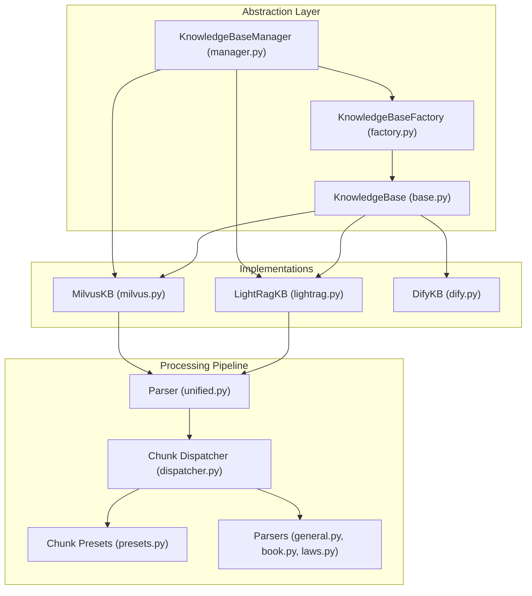
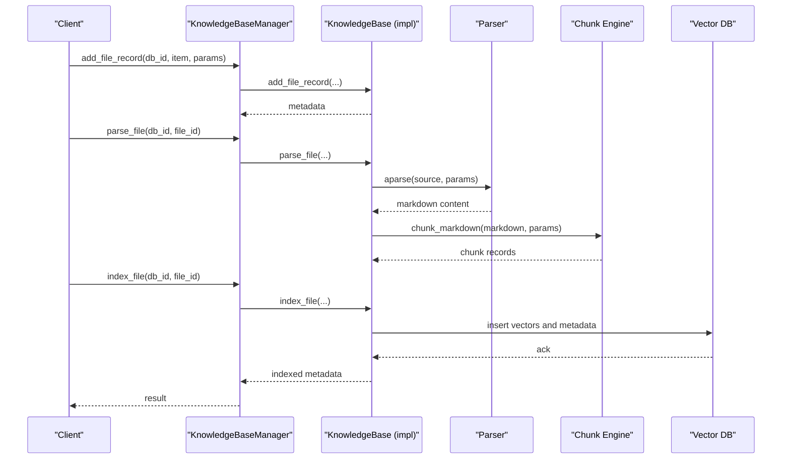
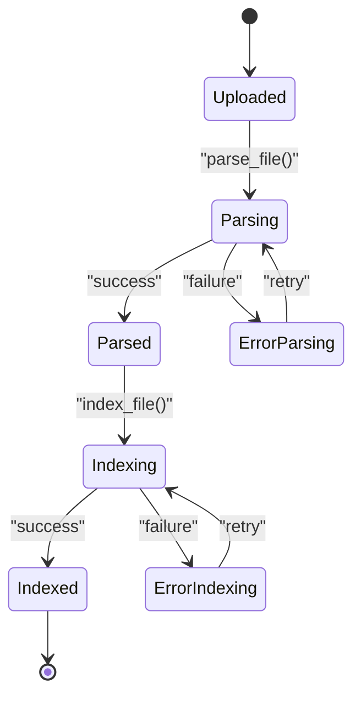
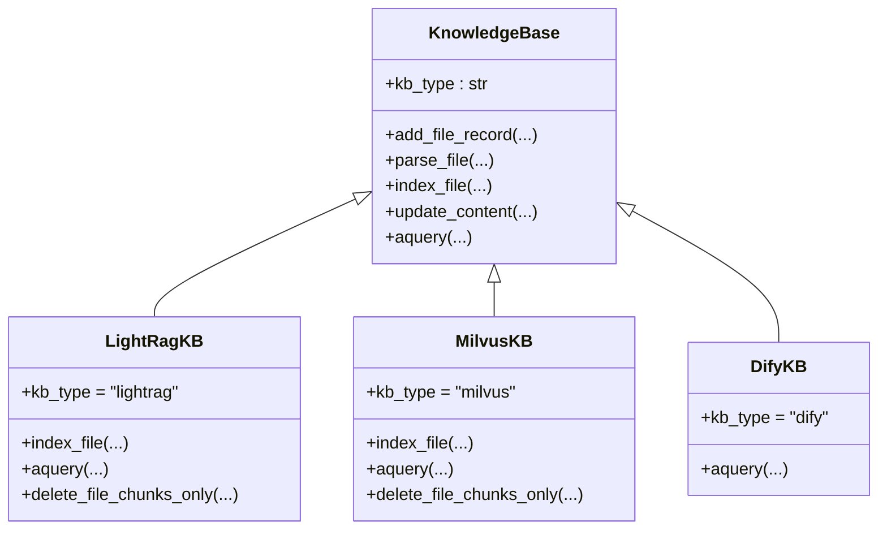
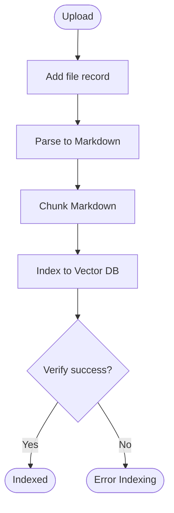
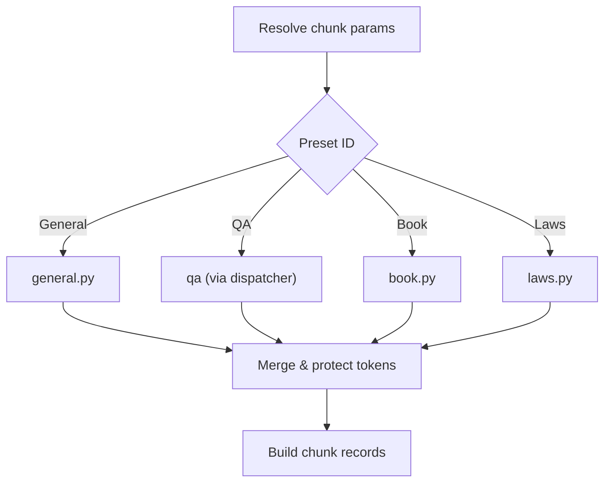
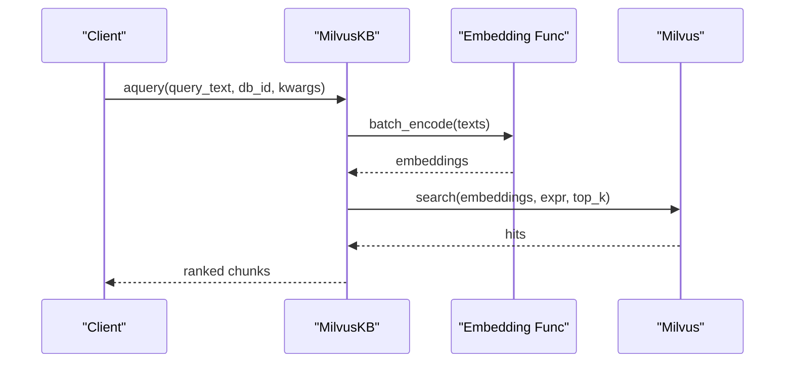
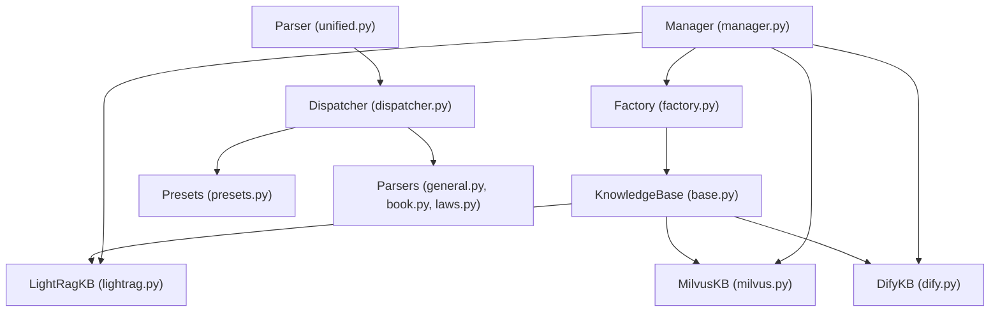

# Knowledge Management Architecture

<cite>
**Referenced Files in This Document**
- [base.py](file://backend/package/yuxi/knowledge/base.py)
- [factory.py](file://backend/package/yuxi/knowledge/factory.py)
- [manager.py](file://backend/package/yuxi/knowledge/manager.py)
- [lightrag.py](file://backend/package/yuxi/knowledge/implementations/lightrag.py)
- [milvus.py](file://backend/package/yuxi/knowledge/implementations/milvus.py)
- [dify.py](file://backend/package/yuxi/knowledge/implementations/dify.py)
- [dispatcher.py](file://backend/package/yuxi/knowledge/chunking/ragflow_like/dispatcher.py)
- [presets.py](file://backend/package/yuxi/knowledge/chunking/ragflow_like/presets.py)
- [general.py](file://backend/package/yuxi/knowledge/chunking/ragflow_like/parsers/general.py)
- [book.py](file://backend/package/yuxi/knowledge/chunking/ragflow_like/parsers/book.py)
- [laws.py](file://backend/package/yuxi/knowledge/chunking/ragflow_like/parsers/laws.py)
- [unified.py](file://backend/package/yuxi/plugins/parser/unified.py)
- [kb_utils.py](file://backend/package/yuxi/knowledge/utils/kb_utils.py)
</cite>

## Table of Contents
1. [Introduction](#introduction)
2. [Project Structure](#project-structure)
3. [Core Components](#core-components)
4. [Architecture Overview](#architecture-overview)
5. [Detailed Component Analysis](#detailed-component-analysis)
6. [Dependency Analysis](#dependency-analysis)
7. [Performance Considerations](#performance-considerations)
8. [Troubleshooting Guide](#troubleshooting-guide)
9. [Conclusion](#conclusion)

## Introduction
This document describes the knowledge management architecture of Yuxi, focusing on the multi-backend knowledge base system. It covers the document ingestion pipeline, chunking strategies, vector storage integration, and the unified abstraction that supports different storage backends (LightRAG, Milvus, and Dify). It also explains the document processing workflow from upload through embedding generation to indexing, along with quality assurance processes, metadata handling, and retrieval mechanisms.

## Project Structure
The knowledge management system is organized around a shared base abstraction and pluggable implementations:
- Base abstraction defines a uniform interface for knowledge bases and manages metadata lifecycle.
- Factories and managers coordinate creation, initialization, and routing of operations to appropriate backends.
- Implementations encapsulate backend-specific logic for indexing, querying, and storage.
- Chunking engines provide configurable strategies for splitting documents into retrievable units.
- Parsers convert diverse file formats into Markdown for downstream processing.

**Diagram sources**
- [base.py:46-118](file://backend/package/yuxi/knowledge/base.py#L46-L118)
- [factory.py:5-108](file://backend/package/yuxi/knowledge/factory.py#L5-L108)
- [manager.py:15-103](file://backend/package/yuxi/knowledge/manager.py#L15-L103)
- [lightrag.py:23-47](file://backend/package/yuxi/knowledge/implementations/lightrag.py#L23-L47)
- [milvus.py:24-68](file://backend/package/yuxi/knowledge/implementations/milvus.py#L24-L68)
- [dify.py:10-19](file://backend/package/yuxi/knowledge/implementations/dify.py#L10-L19)
- [unified.py:427-445](file://backend/package/yuxi/plugins/parser/unified.py#L427-L445)
- [dispatcher.py:32-65](file://backend/package/yuxi/knowledge/chunking/ragflow_like/dispatcher.py#L32-L65)
- [presets.py:161-214](file://backend/package/yuxi/knowledge/chunking/ragflow_like/presets.py#L161-L214)

**Section sources**
- [base.py:46-118](file://backend/package/yuxi/knowledge/base.py#L46-L118)
- [factory.py:5-108](file://backend/package/yuxi/knowledge/factory.py#L5-L108)
- [manager.py:15-103](file://backend/package/yuxi/knowledge/manager.py#L15-L103)

## Core Components
- KnowledgeBase (abstract): Defines the unified interface for knowledge base operations, including file lifecycle management, indexing, querying, and metadata persistence. It enforces status transitions and provides shared utilities for MinIO integration and metadata normalization.
- KnowledgeBaseFactory: Registers and instantiates knowledge base implementations by type, merging default configurations with user-provided parameters.
- KnowledgeBaseManager: Central coordinator that initializes instances per type, routes operations to the correct backend, and exposes unified APIs for database and file management.

Key responsibilities:
- Metadata lifecycle: Creation, loading, persistence, and normalization of database and file metadata.
- File lifecycle: Upload, parse to Markdown, index, update content, and deletion.
- Backend routing: Selects the appropriate implementation based on database type.
- Permissions and accessibility checks for database visibility.

**Section sources**
- [base.py:46-118](file://backend/package/yuxi/knowledge/base.py#L46-L118)
- [factory.py:5-108](file://backend/package/yuxi/knowledge/factory.py#L5-L108)
- [manager.py:15-103](file://backend/package/yuxi/knowledge/manager.py#L15-L103)

## Architecture Overview
The system follows a layered design:
- Abstraction: KnowledgeBase defines the contract and shared behaviors.
- Implementation: Each backend (LightRAG, Milvus, Dify) implements indexing, querying, and storage specifics.
- Processing: Parser converts inputs to Markdown; chunking engine splits Markdown into retrievable chunks.
- Storage: Backends integrate with vector databases (Milvus) and graph storages (Neo4j via LightRAG), or external retrieval APIs (Dify).

**Diagram sources**
- [manager.py:406-426](file://backend/package/yuxi/knowledge/manager.py#L406-L426)
- [base.py:192-324](file://backend/package/yuxi/knowledge/base.py#L192-L324)
- [unified.py:427-445](file://backend/package/yuxi/plugins/parser/unified.py#L427-L445)
- [dispatcher.py:49-65](file://backend/package/yuxi/knowledge/chunking/ragflow_like/dispatcher.py#L49-L65)
- [lightrag.py:305-421](file://backend/package/yuxi/knowledge/implementations/lightrag.py#L305-L421)
- [milvus.py:227-359](file://backend/package/yuxi/knowledge/implementations/milvus.py#L227-L359)

## Detailed Component Analysis

### Knowledge Base Abstraction and Lifecycle
- Status machine: Enforces transitions from uploaded → parsing → parsed → indexing → indexed, with error states and queue management.
- Metadata: Stores database-level and file-level metadata, normalizes timestamps, and persists changes atomically.
- MinIO integration: Saves parsed Markdown and images, reads/writes content safely, and cleans up on deletion.
- File operations: Supports adding records, parsing, indexing, updating content, and deletion with proper locking and concurrency control.

**Diagram sources**
- [base.py:15-26](file://backend/package/yuxi/knowledge/base.py#L15-L26)
- [base.py:233-324](file://backend/package/yuxi/knowledge/base.py#L233-L324)

**Section sources**
- [base.py:15-26](file://backend/package/yuxi/knowledge/base.py#L15-L26)
- [base.py:76-161](file://backend/package/yuxi/knowledge/base.py#L76-L161)
- [base.py:354-387](file://backend/package/yuxi/knowledge/base.py#L354-L387)

### Multi-Backend Knowledge Base Implementations
- LightRagKB: Integrates with LightRAG, Neo4j, and Milvus. Handles document insertion, entity/relation extraction verification, and mixed retrieval modes.
- MilvusKB: Provides production-grade vector storage with configurable chunking, embedding generation, and hybrid search with optional reranking.
- DifyKB: Read-only retrieval via Dify’s Dataset Retrieve API, enabling external vector storage while maintaining a unified query interface.

**Diagram sources**
- [base.py:46-118](file://backend/package/yuxi/knowledge/base.py#L46-L118)
- [lightrag.py:23-47](file://backend/package/yuxi/knowledge/implementations/lightrag.py#L23-L47)
- [milvus.py:24-68](file://backend/package/yuxi/knowledge/implementations/milvus.py#L24-L68)
- [dify.py:10-19](file://backend/package/yuxi/knowledge/implementations/dify.py#L10-L19)

**Section sources**
- [lightrag.py:23-47](file://backend/package/yuxi/knowledge/implementations/lightrag.py#L23-L47)
- [milvus.py:24-68](file://backend/package/yuxi/knowledge/implementations/milvus.py#L24-L68)
- [dify.py:10-19](file://backend/package/yuxi/knowledge/implementations/dify.py#L10-L19)

### Document Processing Workflow
End-to-end ingestion and indexing:
- Add file record: Validates content type, prepares metadata, resolves processing parameters, and persists initial state.
- Parse to Markdown: Uses the unified parser to convert files to Markdown, uploading images to MinIO and generating artifacts.
- Chunking: Applies configured chunking strategy (general, QA, book, laws) to produce chunk records with metadata.
- Indexing: Inserts vectors and metadata into the selected backend; verifies processing outcomes where applicable.

**Diagram sources**
- [base.py:192-324](file://backend/package/yuxi/knowledge/base.py#L192-L324)
- [unified.py:427-445](file://backend/package/yuxi/plugins/parser/unified.py#L427-L445)
- [dispatcher.py:49-65](file://backend/package/yuxi/knowledge/chunking/ragflow_like/dispatcher.py#L49-L65)
- [lightrag.py:305-421](file://backend/package/yuxi/knowledge/implementations/lightrag.py#L305-L421)
- [milvus.py:227-359](file://backend/package/yuxi/knowledge/implementations/milvus.py#L227-L359)

**Section sources**
- [base.py:192-324](file://backend/package/yuxi/knowledge/base.py#L192-L324)
- [unified.py:427-445](file://backend/package/yuxi/plugins/parser/unified.py#L427-L445)
- [dispatcher.py:49-65](file://backend/package/yuxi/knowledge/chunking/ragflow_like/dispatcher.py#L49-L65)

### Chunking Algorithms and Strategies
- Preset-driven chunking: Supports four presets—general, QA, book, and laws—each with tailored heuristics and token-aware protections.
- Parameter resolution: Merges defaults, database-level, file-level, and request-level parameters to compute effective chunking configuration.
- Dispatch: Routes Markdown to the appropriate parser based on preset selection.

**Diagram sources**
- [presets.py:161-214](file://backend/package/yuxi/knowledge/chunking/ragflow_like/presets.py#L161-L214)
- [dispatcher.py:32-65](file://backend/package/yuxi/knowledge/chunking/ragflow_like/dispatcher.py#L32-L65)
- [general.py:33-47](file://backend/package/yuxi/knowledge/chunking/ragflow_like/parsers/general.py#L33-L47)
- [book.py:26-62](file://backend/package/yuxi/knowledge/chunking/ragflow_like/parsers/book.py#L26-L62)
- [laws.py:169-210](file://backend/package/yuxi/knowledge/chunking/ragflow_like/parsers/laws.py#L169-L210)

**Section sources**
- [presets.py:161-214](file://backend/package/yuxi/knowledge/chunking/ragflow_like/presets.py#L161-L214)
- [dispatcher.py:32-65](file://backend/package/yuxi/knowledge/chunking/ragflow_like/dispatcher.py#L32-L65)
- [general.py:33-47](file://backend/package/yuxi/knowledge/chunking/ragflow_like/parsers/general.py#L33-L47)
- [book.py:26-62](file://backend/package/yuxi/knowledge/chunking/ragflow_like/parsers/book.py#L26-L62)
- [laws.py:169-210](file://backend/package/yuxi/knowledge/chunking/ragflow_like/parsers/laws.py#L169-L210)

### Text Preprocessing and Quality Assurance
- Parser: Converts diverse formats to Markdown, handles OCR-enabled images, and uploads embedded images to MinIO with deterministic naming.
- Content hashing: Computes SHA-256 hashes for deduplication and integrity checks.
- MinIO safety: Validates URLs and ensures safe object naming and prefixes.
- Token limits: Enforces chunk size limits and hierarchical merging to prevent oversized embeddings.

**Section sources**
- [unified.py:270-414](file://backend/package/yuxi/plugins/parser/unified.py#L270-L414)
- [kb_utils.py:162-190](file://backend/package/yuxi/knowledge/utils/kb_utils.py#L162-L190)
- [kb_utils.py:407-462](file://backend/package/yuxi/knowledge/utils/kb_utils.py#L407-L462)
- [laws.py:113-167](file://backend/package/yuxi/knowledge/chunking/ragflow_like/parsers/laws.py#L113-L167)

### Vector Storage Integration and Retrieval
- LightRAG: Uses Milvus for vectors and Neo4j for graph storage; supports mixed retrieval modes and returns structured results.
- Milvus: Provides configurable vector search, keyword search, hybrid search, optional reranking, and threshold filtering.
- Dify: Exposes external retrieval via Dataset Retrieve API with mode mapping and fallback logic.

**Diagram sources**
- [milvus.py:471-676](file://backend/package/yuxi/knowledge/implementations/milvus.py#L471-L676)
- [lightrag.py:526-601](file://backend/package/yuxi/knowledge/implementations/lightrag.py#L526-L601)
- [dify.py:69-162](file://backend/package/yuxi/knowledge/implementations/dify.py#L69-L162)

**Section sources**
- [milvus.py:471-676](file://backend/package/yuxi/knowledge/implementations/milvus.py#L471-L676)
- [lightrag.py:526-601](file://backend/package/yuxi/knowledge/implementations/lightrag.py#L526-L601)
- [dify.py:69-162](file://backend/package/yuxi/knowledge/implementations/dify.py#L69-L162)

### Knowledge Base Management Operations
- Database lifecycle: Create, update, delete, and list databases; manage sharing and permissions.
- File lifecycle: Add records, parse, index, update content, delete files, and fetch metadata/content.
- Query parameters: Per-type configuration for retrieval behavior (top_k, thresholds, modes).
- Consistency checks: Detects mismatches between metadata and vector/graph storage for Milvus.

**Section sources**
- [manager.py:326-489](file://backend/package/yuxi/knowledge/manager.py#L326-L489)
- [manager.py:651-660](file://backend/package/yuxi/knowledge/manager.py#L651-L660)
- [manager.py:776-800](file://backend/package/yuxi/knowledge/manager.py#L776-L800)

## Dependency Analysis
The system exhibits low coupling between abstractions and implementations, with clear separation of concerns:
- KnowledgeBase defines the contract; implementations encapsulate backend specifics.
- Factory and Manager decouple callers from backend instantiation and routing.
- Chunking and parsing are modular and reusable across backends.

**Diagram sources**
- [base.py:46-118](file://backend/package/yuxi/knowledge/base.py#L46-L118)
- [factory.py:5-108](file://backend/package/yuxi/knowledge/factory.py#L5-L108)
- [manager.py:15-103](file://backend/package/yuxi/knowledge/manager.py#L15-L103)
- [unified.py:427-445](file://backend/package/yuxi/plugins/parser/unified.py#L427-L445)
- [dispatcher.py:32-65](file://backend/package/yuxi/knowledge/chunking/ragflow_like/dispatcher.py#L32-L65)
- [presets.py:161-214](file://backend/package/yuxi/knowledge/chunking/ragflow_like/presets.py#L161-L214)

**Section sources**
- [factory.py:5-108](file://backend/package/yuxi/knowledge/factory.py#L5-L108)
- [manager.py:15-103](file://backend/package/yuxi/knowledge/manager.py#L15-L103)

## Performance Considerations
- Concurrency and locking: Implementations use per-database locks to serialize writes and avoid race conditions during indexing and updates.
- Batch embedding: MilvusKB batches embeddings to reduce overhead; consider tuning batch sizes based on model constraints.
- Chunk size and overlap: Tune chunk_token_num and overlapped_percent to balance recall and latency; larger chunks increase embedding cost but may improve coherence.
- Hybrid search: Enable keyword fallback or reranking judiciously; reranking adds latency and requires additional resources.
- Vector index tuning: Adjust Milvus index parameters (e.g., IVF_FLAT nlist) for recall vs. speed trade-offs.

[No sources needed since this section provides general guidance]

## Troubleshooting Guide
Common issues and resolutions:
- Parsing failures: Validate file types and OCR settings; ensure MinIO connectivity and image upload permissions.
- Indexing errors: Confirm parsed Markdown availability, chunk limits, and backend credentials; check for processing verification failures in LightRAG.
- Query timeouts: Reduce top_k, enable similarity thresholds, or disable reranking; verify vector index health.
- Dify retrieval errors: Confirm API URL, token, and dataset ID; leverage fallback logic if upstream compatibility is limited.

**Section sources**
- [base.py:308-320](file://backend/package/yuxi/knowledge/base.py#L308-L320)
- [lightrag.py:183-194](file://backend/package/yuxi/knowledge/implementations/lightrag.py#L183-L194)
- [milvus.py:673-676](file://backend/package/yuxi/knowledge/implementations/milvus.py#L673-L676)
- [dify.py:112-129](file://backend/package/yuxi/knowledge/implementations/dify.py#L112-L129)

## Conclusion
Yuxi’s knowledge management system provides a robust, extensible framework for document ingestion, chunking, and retrieval across multiple backends. Its abstraction layer ensures consistent operations while implementations tailor behavior to specific storage systems. With configurable chunking strategies, quality assurance measures, and unified management APIs, the system supports scalable knowledge workflows from upload to search.