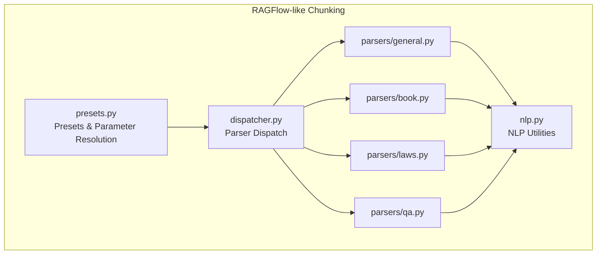
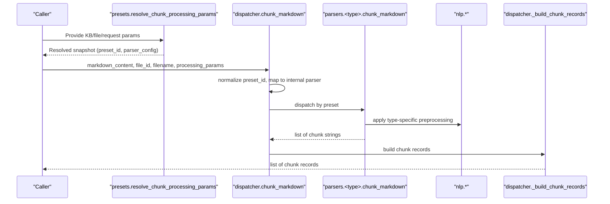
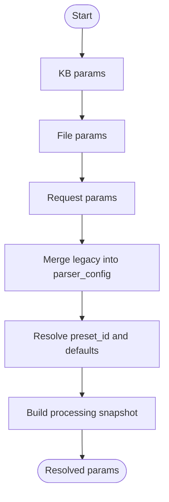
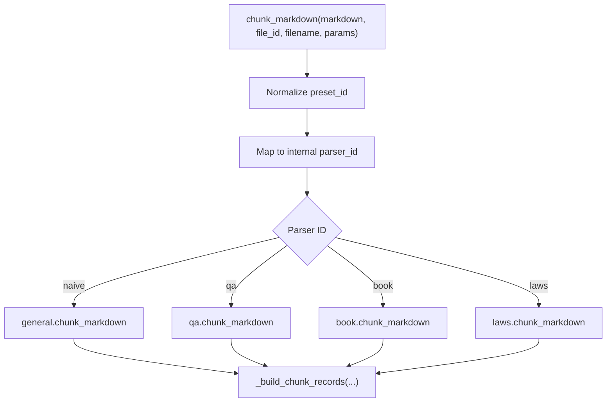
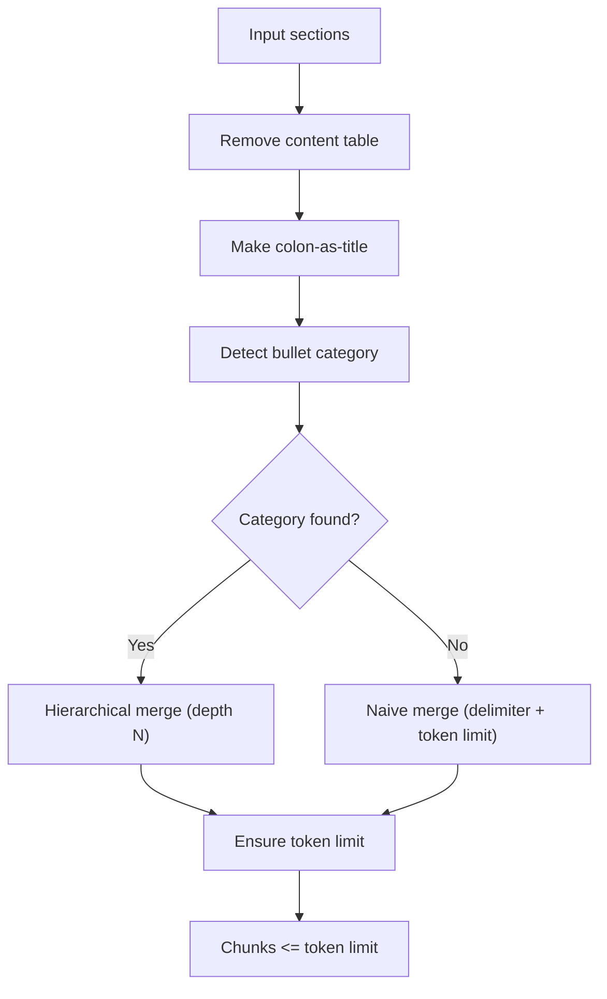
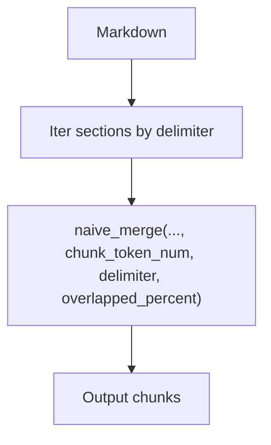
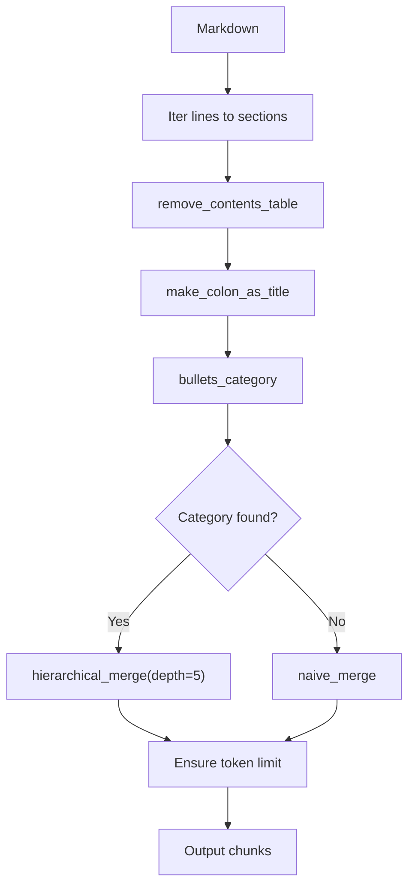
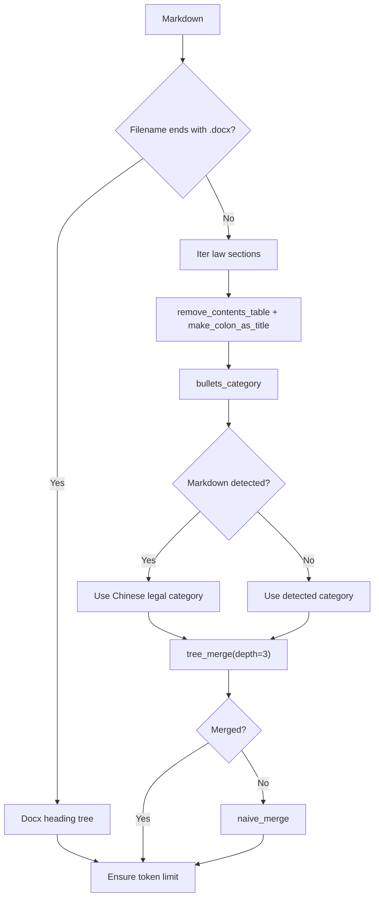
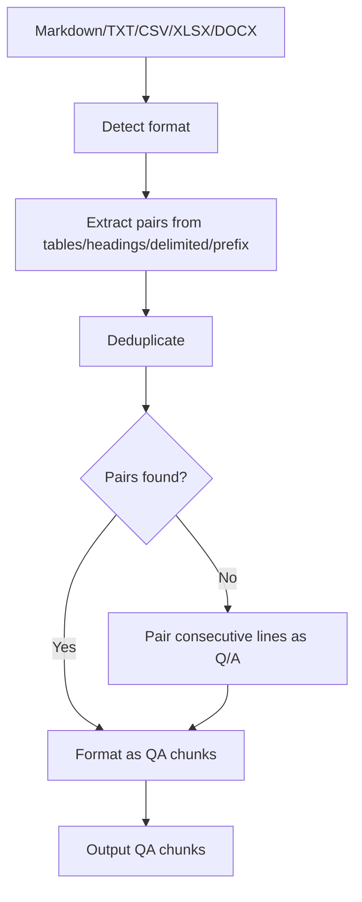
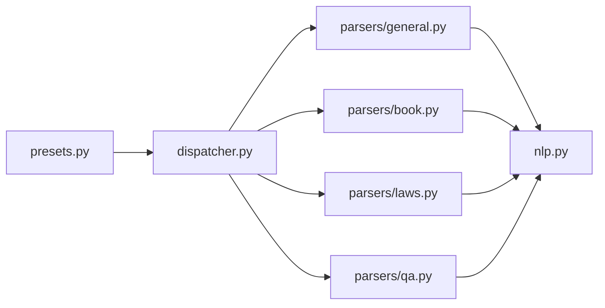

# Text Chunking Algorithms

<cite>
**Referenced Files in This Document**
- [presets.py](file://backend/package/yuxi/knowledge/chunking/ragflow_like/presets.py)
- [dispatcher.py](file://backend/package/yuxi/knowledge/chunking/ragflow_like/dispatcher.py)
- [nlp.py](file://backend/package/yuxi/knowledge/chunking/ragflow_like/nlp.py)
- [general.py](file://backend/package/yuxi/knowledge/chunking/ragflow_like/parsers/general.py)
- [book.py](file://backend/package/yuxi/knowledge/chunking/ragflow_like/parsers/book.py)
- [laws.py](file://backend/package/yuxi/knowledge/chunking/ragflow_like/parsers/laws.py)
- [qa.py](file://backend/package/yuxi/knowledge/chunking/ragflow_like/parsers/qa.py)
- [test_ragflow_like_chunking.py](file://backend/test/unit/plugins/test_ragflow_like_chunking.py)
</cite>

## Table of Contents
1. [Introduction](#introduction)
2. [Project Structure](#project-structure)
3. [Core Components](#core-components)
4. [Architecture Overview](#architecture-overview)
5. [Detailed Component Analysis](#detailed-component-analysis)
6. [Dependency Analysis](#dependency-analysis)
7. [Performance Considerations](#performance-considerations)
8. [Troubleshooting Guide](#troubleshooting-guide)
9. [Conclusion](#conclusion)
10. [Appendices](#appendices)

## Introduction
This document explains the text chunking algorithms used in knowledge base processing with a RAGFlow-like strategy. It covers preset configurations, parameter resolution, specialized parsers for different document types (general text, books, legal documents, Q&A), chunk size and overlap strategies, semantic preservation techniques, and the NLP preprocessing pipeline. It also includes examples of parameter tuning, custom strategies, and performance considerations tailored to different document types.

## Project Structure
The chunking system is organized under a dedicated module with a clear separation of concerns:
- Preset configuration and parameter resolution
- Parser dispatching based on preset
- Specialized parsers per document type
- Shared NLP utilities for segmentation, hierarchy detection, and token counting

**Diagram sources**
- [presets.py:1-239](file://backend/package/yuxi/knowledge/chunking/ragflow_like/presets.py#L1-L239)
- [dispatcher.py:1-65](file://backend/package/yuxi/knowledge/chunking/ragflow_like/dispatcher.py#L1-L65)
- [nlp.py:1-535](file://backend/package/yuxi/knowledge/chunking/ragflow_like/nlp.py#L1-L535)
- [general.py:1-47](file://backend/package/yuxi/knowledge/chunking/ragflow_like/parsers/general.py#L1-L47)
- [book.py:1-62](file://backend/package/yuxi/knowledge/chunking/ragflow_like/parsers/book.py#L1-L62)
- [laws.py:1-210](file://backend/package/yuxi/knowledge/chunking/ragflow_like/parsers/laws.py#L1-L210)
- [qa.py:1-261](file://backend/package/yuxi/knowledge/chunking/ragflow_like/parsers/qa.py#L1-L261)

**Section sources**
- [presets.py:1-239](file://backend/package/yuxi/knowledge/chunking/ragflow_like/presets.py#L1-L239)
- [dispatcher.py:1-65](file://backend/package/yuxi/knowledge/chunking/ragflow_like/dispatcher.py#L1-L65)
- [nlp.py:1-535](file://backend/package/yuxi/knowledge/chunking/ragflow_like/nlp.py#L1-L535)
- [general.py:1-47](file://backend/package/yuxi/knowledge/chunking/ragflow_like/parsers/general.py#L1-L47)
- [book.py:1-62](file://backend/package/yuxi/knowledge/chunking/ragflow_like/parsers/book.py#L1-L62)
- [laws.py:1-210](file://backend/package/yuxi/knowledge/chunking/ragflow_like/parsers/laws.py#L1-L210)
- [qa.py:1-261](file://backend/package/yuxi/knowledge/chunking/ragflow_like/parsers/qa.py#L1-L261)

## Core Components
- Preset definitions and defaults: Defines preset IDs, descriptions, base defaults, and preset-specific defaults for chunking parameters. Includes utilities to normalize preset IDs, map to internal parser IDs, and merge legacy parameters into the modern parser config.
- Parameter resolution: Resolves chunking parameters from three layers—knowledge base, file-level, and request—merging and normalizing them into a single processing snapshot.
- Dispatcher: Routes markdown content to the appropriate parser based on the selected preset.
- NLP utilities: Provides token counting, heading detection heuristics, hierarchical merging, content table removal, colon-as-title normalization, and safe hard-splitting for overlength protection.
- Parsers:
  - General: Naive splitting by delimiters and length, with optional custom delimiters.
  - Book: Hierarchical merging guided by detected bullet categories, with content table removal and colon-as-title normalization.
  - Laws: Article-aware parsing with depth-limited tree merges, overlength protection, and special handling for DOCX headings.
  - QA: Multi-source extraction from CSV/XLSX/TXT/MD/DOCX, with deduplication and fallback grouping.

**Section sources**
- [presets.py:101-214](file://backend/package/yuxi/knowledge/chunking/ragflow_like/presets.py#L101-L214)
- [dispatcher.py:32-65](file://backend/package/yuxi/knowledge/chunking/ragflow_like/dispatcher.py#L32-L65)
- [nlp.py:49-535](file://backend/package/yuxi/knowledge/chunking/ragflow_like/nlp.py#L49-L535)
- [general.py:33-47](file://backend/package/yuxi/knowledge/chunking/ragflow_like/parsers/general.py#L33-L47)
- [book.py:26-62](file://backend/package/yuxi/knowledge/chunking/ragflow_like/parsers/book.py#L26-L62)
- [laws.py:169-210](file://backend/package/yuxi/knowledge/chunking/ragflow_like/parsers/laws.py#L169-L210)
- [qa.py:213-261](file://backend/package/yuxi/knowledge/chunking/ragflow_like/parsers/qa.py#L213-L261)

## Architecture Overview
The chunking pipeline resolves parameters, selects a parser by preset, applies document-type-specific logic, and produces normalized chunk records.

**Diagram sources**
- [presets.py:161-214](file://backend/package/yuxi/knowledge/chunking/ragflow_like/presets.py#L161-L214)
- [dispatcher.py:49-65](file://backend/package/yuxi/knowledge/chunking/ragflow_like/dispatcher.py#L49-L65)
- [general.py:33-47](file://backend/package/yuxi/knowledge/chunking/ragflow_like/parsers/general.py#L33-L47)
- [book.py:26-62](file://backend/package/yuxi/knowledge/chunking/ragflow_like/parsers/book.py#L26-L62)
- [laws.py:169-210](file://backend/package/yuxi/knowledge/chunking/ragflow_like/parsers/laws.py#L169-L210)
- [qa.py:213-261](file://backend/package/yuxi/knowledge/chunking/ragflow_like/parsers/qa.py#L213-L261)

## Detailed Component Analysis

### Preset Configuration and Parameter Resolution
- Preset IDs and defaults:
  - General, QA, Book, Laws presets define default chunk sizes, delimiters, and optional advanced features (e.g., RAPTOR and GraphRAG toggles).
  - Base defaults include table/image context sizes.
- Parameter resolution order:
  - Request overrides file-level, which overrides knowledge base.
  - Legacy fields (e.g., chunk_size, chunk_overlap, qa_separator) are mapped into modern parser_config keys (e.g., chunk_token_num, overlapped_percent, delimiter).
  - Snapshot preserves non-chunk fields from request/file for UI compatibility.
- Utilities:
  - Normalize preset ID and map to internal parser ID.
  - Deep-merge dictionaries to combine defaults with overrides.

**Diagram sources**
- [presets.py:161-214](file://backend/package/yuxi/knowledge/chunking/ragflow_like/presets.py#L161-L214)

**Section sources**
- [presets.py:13-66](file://backend/package/yuxi/knowledge/chunking/ragflow_like/presets.py#L13-L66)
- [presets.py:94-158](file://backend/package/yuxi/knowledge/chunking/ragflow_like/presets.py#L94-L158)
- [presets.py:161-214](file://backend/package/yuxi/knowledge/chunking/ragflow_like/presets.py#L161-L214)

### Dispatcher and Parser Selection
- The dispatcher:
  - Normalizes preset ID and maps to internal parser ID.
  - Routes markdown content to the correct parser based on preset.
  - Builds standardized chunk records with metadata.

**Diagram sources**
- [dispatcher.py:32-65](file://backend/package/yuxi/knowledge/chunking/ragflow_like/dispatcher.py#L32-L65)

**Section sources**
- [dispatcher.py:9-65](file://backend/package/yuxi/knowledge/chunking/ragflow_like/dispatcher.py#L9-L65)

### NLP Preprocessing Pipeline
Key capabilities:
- Token counting: Approximate token estimation by word/CJK character units.
- Heading detection heuristics: Pattern-based classification of candidate headings with weights for markdown headings.
- Bullet category detection: Selects the most likely bullet pattern family for hierarchical merging.
- Content table removal: Removes spurious “Contents” entries and surrounding lines.
- Colon-as-title normalization: Treats long lines ending with colons as titles.
- Hierarchical merging: Builds a tree of sections and merges by target depth.
- Safe overlength protection: Attempts line-based splits, sentence-boundary splits, and finally hard-token splits to guarantee chunk limits.

**Diagram sources**
- [nlp.py:187-401](file://backend/package/yuxi/knowledge/chunking/ragflow_like/nlp.py#L187-L401)
- [nlp.py:411-482](file://backend/package/yuxi/knowledge/chunking/ragflow_like/nlp.py#L411-L482)

**Section sources**
- [nlp.py:49-178](file://backend/package/yuxi/knowledge/chunking/ragflow_like/nlp.py#L49-L178)
- [nlp.py:187-401](file://backend/package/yuxi/knowledge/chunking/ragflow_like/nlp.py#L187-L401)
- [nlp.py:411-535](file://backend/package/yuxi/knowledge/chunking/ragflow_like/nlp.py#L411-L535)

### General Text Parser
- Strategy:
  - Split by configured delimiter or fall back to lines.
  - Merge into chunks respecting token limits and optional overlap percentage.
  - Supports custom delimiters via backtick-enclosed markers.
- Parameters:
  - chunk_token_num, delimiter, overlapped_percent.

**Diagram sources**
- [general.py:12-47](file://backend/package/yuxi/knowledge/chunking/ragflow_like/parsers/general.py#L12-L47)
- [nlp.py:411-482](file://backend/package/yuxi/knowledge/chunking/ragflow_like/nlp.py#L411-L482)

**Section sources**
- [general.py:33-47](file://backend/package/yuxi/knowledge/chunking/ragflow_like/parsers/general.py#L33-L47)

### Book Parser
- Strategy:
  - Iterate non-empty lines as sections.
  - Remove content table and normalize colon-as-title.
  - Detect bullet category; if found, perform hierarchical merge with depth targeting chapter/section/article hierarchy.
  - Fallback to naive merge if hierarchical merge yields no chunks.
- Parameters:
  - chunk_token_num, delimiter, overlapped_percent.

**Diagram sources**
- [book.py:26-62](file://backend/package/yuxi/knowledge/chunking/ragflow_like/parsers/book.py#L26-L62)
- [nlp.py:254-401](file://backend/package/yuxi/knowledge/chunking/ragflow_like/nlp.py#L254-L401)

**Section sources**
- [book.py:26-62](file://backend/package/yuxi/knowledge/chunking/ragflow_like/parsers/book.py#L26-L62)

### Legal Documents Parser
- Strategy:
  - Prefer DOCX heading tree when file extension matches.
  - Otherwise iterate law sections (article-aware normalization).
  - Remove content table and normalize titles.
  - Detect bullet category; if markdown detected, prefer Chinese legal category to avoid over-merging chapters.
  - Tree merge with depth=3; fallback to naive merge.
  - Apply overlength protection: line-based merge, sentence-boundary split, then hard-token split.
- Parameters:
  - chunk_token_num, delimiter, overlapped_percent.

**Diagram sources**
- [laws.py:169-210](file://backend/package/yuxi/knowledge/chunking/ragflow_like/parsers/laws.py#L169-L210)
- [nlp.py:254-304](file://backend/package/yuxi/knowledge/chunking/ragflow_like/nlp.py#L254-L304)

**Section sources**
- [laws.py:169-210](file://backend/package/yuxi/knowledge/chunking/ragflow_like/parsers/laws.py#L169-L210)

### Q&A Parser
- Strategy:
  - Detect file format and extract question-answer pairs from:
    - Markdown tables
    - Markdown headings (with nesting)
    - CSV/XLSX/TXT delimited content
    - Prefix-based lines (Q/A variants)
  - Deduplicate pairs.
  - Fallback: pair consecutive lines as Q/A if nothing extracted.
  - Normalize language-specific prefixes (e.g., “Question/Answer” vs. “问题/回答”).
- Parameters:
  - language (English vs. Chinese) influences prefix labeling.

**Diagram sources**
- [qa.py:213-261](file://backend/package/yuxi/knowledge/chunking/ragflow_like/parsers/qa.py#L213-L261)

**Section sources**
- [qa.py:213-261](file://backend/package/yuxi/knowledge/chunking/ragflow_like/parsers/qa.py#L213-L261)

## Dependency Analysis
- Cohesion:
  - Each parser is cohesive around a single domain (general, book, laws, QA).
  - Shared NLP utilities are reused across parsers.
- Coupling:
  - Dispatcher depends on presets and parsers.
  - Parsers depend on shared NLP utilities.
- Parameter resolution centralizes configuration merging and normalization.

**Diagram sources**
- [presets.py:1-239](file://backend/package/yuxi/knowledge/chunking/ragflow_like/presets.py#L1-L239)
- [dispatcher.py:1-65](file://backend/package/yuxi/knowledge/chunking/ragflow_like/dispatcher.py#L1-L65)
- [nlp.py:1-535](file://backend/package/yuxi/knowledge/chunking/ragflow_like/nlp.py#L1-L535)
- [general.py:1-47](file://backend/package/yuxi/knowledge/chunking/ragflow_like/parsers/general.py#L1-L47)
- [book.py:1-62](file://backend/package/yuxi/knowledge/chunking/ragflow_like/parsers/book.py#L1-L62)
- [laws.py:1-210](file://backend/package/yuxi/knowledge/chunking/ragflow_like/parsers/laws.py#L1-L210)
- [qa.py:1-261](file://backend/package/yuxi/knowledge/chunking/ragflow_like/parsers/qa.py#L1-L261)

**Section sources**
- [presets.py:101-214](file://backend/package/yuxi/knowledge/chunking/ragflow_like/presets.py#L101-L214)
- [dispatcher.py:32-65](file://backend/package/yuxi/knowledge/chunking/ragflow_like/dispatcher.py#L32-L65)

## Performance Considerations
- Token estimation:
  - Uses a lightweight approximation to avoid heavy dependencies.
- Overlap strategy:
  - Overlap is expressed as a percentage of chunk size; converted to absolute tokens during merging to maintain proportional continuity.
- Overlength protection:
  - Laws parser applies staged splitting (line-based, sentence-boundary, then hard-token) to guarantee embedding-friendly chunk sizes.
- Complexity:
  - Hierarchical merging and tree builds operate on section lists; performance scales with number of sections and chosen depth.
- Recommendations:
  - Tune chunk_token_num per model context window and retrieval granularity.
  - Use overlapped_percent to balance recall and storage cost.
  - Prefer format-aware parsers (book/laws/QA) for domain-specific semantics to reduce post-processing needs.

[No sources needed since this section provides general guidance]

## Troubleshooting Guide
Common issues and diagnostics:
- Unexpected preset selection:
  - Verify preset ID normalization and mapping to internal parser ID.
- Overlapping parameters:
  - Ensure overlapped_percent is within [0, 99]; chunk_size maps to chunk_token_num.
- QA chunking failures:
  - Confirm delimiter detection or fallback to prefix-based extraction.
- Legal document over-length:
  - Increase chunk_token_num or reduce overlapped_percent; rely on overlength protection.
- Heading misclassification:
  - Adjust delimiter or ensure markdown headings are properly formed.

**Section sources**
- [presets.py:161-214](file://backend/package/yuxi/knowledge/chunking/ragflow_like/presets.py#L161-L214)
- [test_ragflow_like_chunking.py:23-45](file://backend/test/unit/plugins/test_ragflow_like_chunking.py#L23-L45)
- [test_ragflow_like_chunking.py:115-139](file://backend/test/unit/plugins/test_ragflow_like_chunking.py#L115-L139)
- [test_ragflow_like_chunking.py:141-164](file://backend/test/unit/plugins/test_ragflow_like_chunking.py#L141-L164)
- [test_ragflow_like_chunking.py:166-193](file://backend/test/unit/plugins/test_ragflow_like_chunking.py#L166-L193)

## Conclusion
The RAGFlow-like chunking system provides a robust, preset-driven framework for knowledge base ingestion. By combining format-aware parsers with shared NLP utilities, it achieves strong semantic preservation and reliable chunk sizing across diverse document types. Parameter resolution ensures flexibility and backward compatibility, while overlength protection and overlap strategies balance retrieval quality and storage efficiency.

[No sources needed since this section summarizes without analyzing specific files]

## Appendices

### A. Preset Options and Descriptions
- General: default general-purpose chunking
- QA: question-answer oriented
- Book: hierarchical chapter/section merging
- Laws: article-aware with overlength protection

**Section sources**
- [presets.py:216-239](file://backend/package/yuxi/knowledge/chunking/ragflow_like/presets.py#L216-L239)

### B. Parameter Tuning Examples
- General text:
  - Increase chunk_token_num for longer paragraphs; adjust overlapped_percent for continuity.
- Books:
  - Rely on hierarchical merging; ensure delimiter supports chapter/section markers.
- Laws:
  - Use article-aware merging; enforce overlength protection; tune chunk_token_num to model limits.
- QA:
  - Ensure delimiter detection or enable prefix-based extraction; deduplicate pairs.

**Section sources**
- [test_ragflow_like_chunking.py:47-66](file://backend/test/unit/plugins/test_ragflow_like_chunking.py#L47-L66)
- [test_ragflow_like_chunking.py:68-86](file://backend/test/unit/plugins/test_ragflow_like_chunking.py#L68-L86)
- [test_ragflow_like_chunking.py:115-139](file://backend/test/unit/plugins/test_ragflow_like_chunking.py#L115-L139)
- [test_ragflow_like_chunking.py:213-261](file://backend/test/unit/plugins/test_ragflow_like_chunking.py#L213-L261)

### C. Custom Chunking Strategies
- Extend presets.py with new preset IDs and defaults.
- Add a new parser under parsers/ and update dispatcher routing.
- Integrate domain-specific preprocessing in nlp.py if needed.

**Section sources**
- [presets.py:13-66](file://backend/package/yuxi/knowledge/chunking/ragflow_like/presets.py#L13-L66)
- [dispatcher.py:32-65](file://backend/package/yuxi/knowledge/chunking/ragflow_like/dispatcher.py#L32-L65)
- [nlp.py:187-401](file://backend/package/yuxi/knowledge/chunking/ragflow_like/nlp.py#L187-L401)